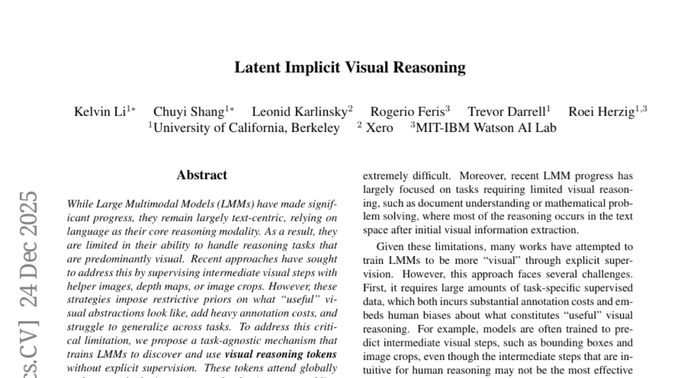
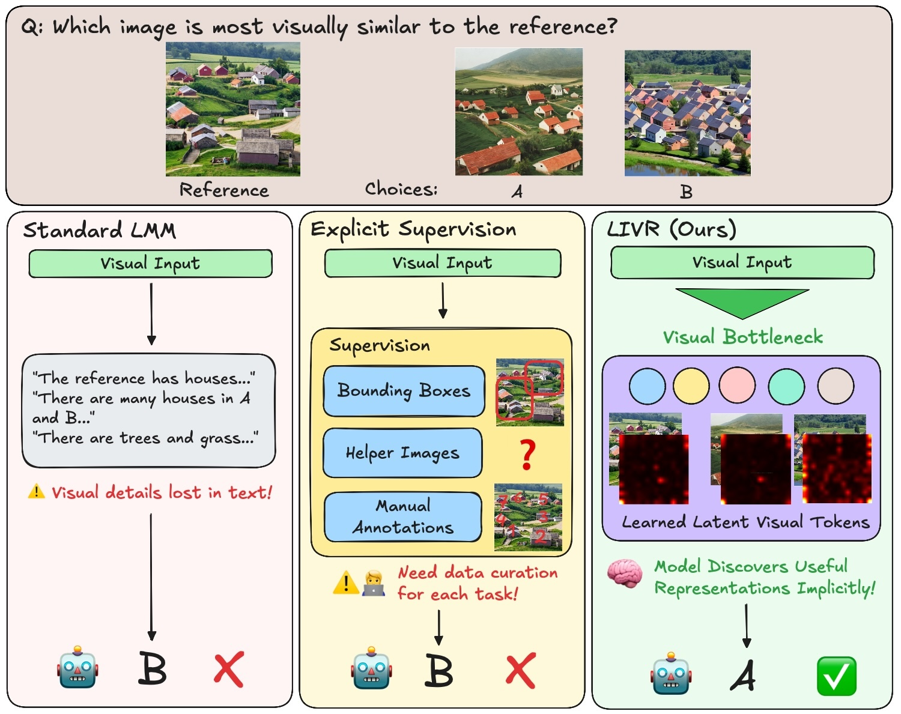
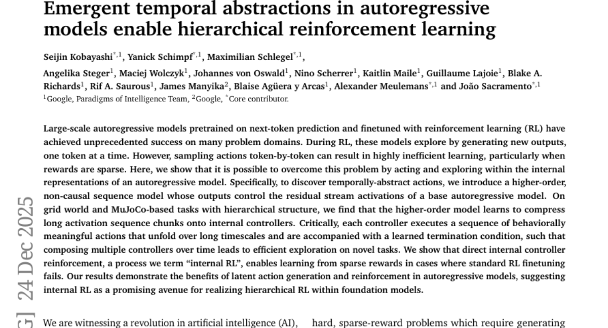
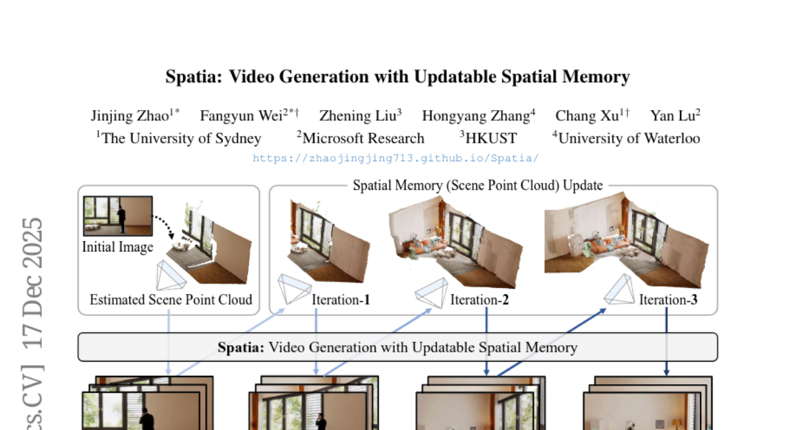
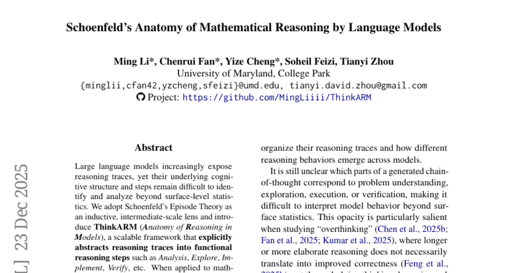
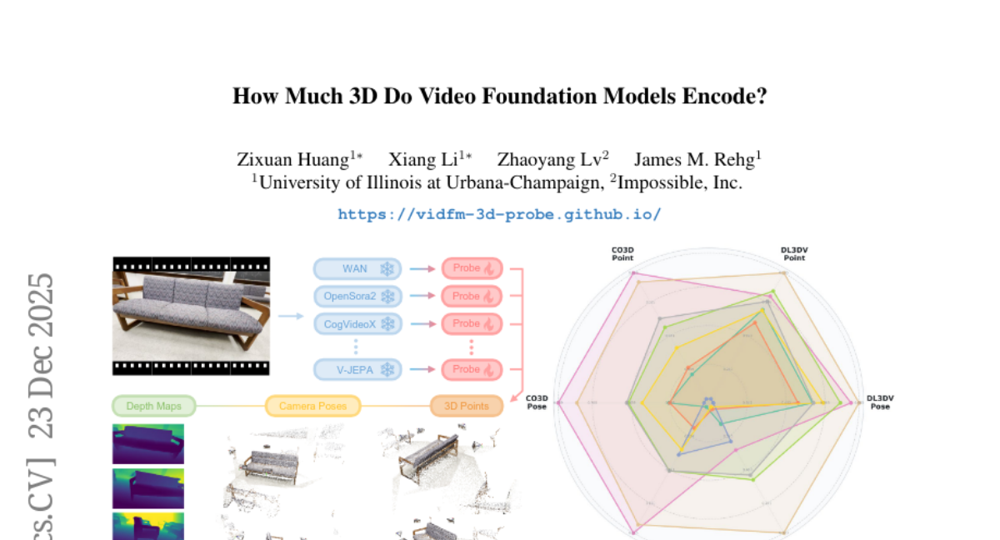

# 2025-12-26 Daily Papers (Top 5)

## 1. [Latent Implicit Visual Reasoning](https://huggingface.co/papers/2512.21218)
**Upvotes**: 57

### 📌 요약
대규모 멀티모달 모델(LMM)의 텍스트 중심적 시각 추론 한계를 극복하고자, 명시적인 지도 없이 잠재적인 시각적 추론 토큰을 발견하고 활용하여 다양한 시각 중심 작업에서 최고 성능을 달성하는 태스크 비종속적 접근 방식을 제시한다.

### 🔑 핵심 포인트
- 기존 LMM은 언어 기반 추론에 의존하여 시각 중심적인 추론 작업 수행에 한계가 있으며, 중간 시각 단계에 대한 명시적 지도(예: 깊이 맵, 이미지 자르기)는 비싸고 일반화가 어렵다.
- 수동으로 정의된 지도 없이 LMM이 잠재적인 시각적 추론 토큰(Visual Reasoning Tokens)을 자체적으로 발견하고 사용하도록 훈련시키는 태스크 불특정적(task-agnostic) 메커니즘을 제안한다.
- 이 토큰들은 이미지를 전역적으로 참조하며 작업에 적응적으로(task-adaptive) 재인코딩하여 관련 시각 정보를 추출하며, 직접적인 미세 조정보다 우수하고 다양한 시각 중심 작업에서 최첨단 결과를 달성한다.
### 🖼️ 추가 자료

---

## 2. [Emergent temporal abstractions in autoregressive models enable hierarchical reinforcement learning](https://huggingface.co/papers/2512.20605)
**Upvotes**: 54

### 📌 요약
자기회귀 모델의 비효율적인 토큰별 행동 생성 문제를 극복하고자, 잔차 스트림 활성화(residual stream activations)를 제어하는 고차 비인과적 시퀀스 모델을 도입하여 시간적 추상화를 달성하고, 이를 '내부 RL'이라 명명한 강화 학습 방법으로 활용하여 계층적 RL의 효율성을 획기적으로 향상시킨다.

### 🔑 핵심 포인트
- 표준 강화 학습(RL)의 비효율성을 극복하기 위해, 자기회귀 모델의 내부 표현(internal representations)을 활용하여 시간적으로 추상화된 행동을 탐색하고 실행하는 프레임워크를 제안한다.
- 기본 모델의 잔차 스트림 활성화를 제어하는 고차원, 비인과적 시퀀스 모델을 도입하며, 이 모델은 긴 활성화 시퀀스를 행동적으로 의미 있는 장기적인 '내부 컨트롤러'와 학습된 종료 조건으로 압축한다.
- 내부 컨트롤러를 직접 강화하는 '내부 RL(Internal RL)' 프로세스는 표준 RL 미세 조정이 실패하는 희소 보상 환경에서도 효과적으로 작동함을 입증하여, 파운데이션 모델 내에서 계층적 강화 학습(HRL)을 실현하는 유망한 길을 제시한다.

---

## 3. [Spatia: Video Generation with Updatable Spatial Memory](https://huggingface.co/papers/2512.15716)
**Upvotes**: 25

### 📌 요약
스패이셔(Spatia)는 3D 장면 포인트 클라우드를 지속 가능한 공간 메모리로 명시적으로 보존하고 Visual SLAM을 통해 이를 업데이트함으로써, 장기적인 공간 및 시간적 일관성을 강화하는 비디오 생성 프레임워크이다.

### 🔑 핵심 포인트
- 기존 비디오 생성 모델의 장기 일관성 문제를 해결하기 위해 3D 장면 포인트 클라우드를 영구적인 공간 메모리(Persistent Spatial Memory)로 활용한다.
- 생성된 비디오 클립을 공간 메모리에 조건화하고 Visual SLAM을 통해 메모리를 지속적으로 업데이트하여 기하학적 기반의 일관성 유지 능력을 확보한다.
- 정적 요소와 동적 요소를 명확히 분리(Dynamic-Static Disentanglement)하여 공간 일관성을 향상시키며, 명시적 카메라 제어 및 3D 인식 상호작용 편집과 같은 응용이 가능하다.

---

## 4. [Schoenfeld's Anatomy of Mathematical Reasoning by Language Models](https://huggingface.co/papers/2512.19995)
**Upvotes**: 13

### 📌 요약
대규모 언어 모델(LLM)의 추론 과정을 체계적으로 분석하기 위해 Schoenfeld의 에피소드 이론 기반 ThinkARM 프레임워크를 도입했으며, 이는 모델 간의 구조적 사고 역학 및 정확도에 영향을 미치는 명시적인 추론 단계를 밝혀낸다.

### 🔑 핵심 포인트
- Schoenfeld의 에피소드 이론을 중간 규모의 렌즈로 채택하고, 추론 과정을 기능적 단계(분석, 탐색, 구현, 검증 등)로 추상화하는 ThinkARM 프레임워크를 도입하여 토큰 수준 분석의 한계를 극복했다.
- 이 추상화는 수학적 문제 해결 과정에서 토큰 수준 분석으로는 드러나지 않는, 추론 모델과 비추론 모델 간의 재현 가능한 사고 역학 및 구조적 차이를 명확하게 보여준다.
- 진단적 사례 연구 결과, '탐색(Exploration)' 단계가 정확도와 관련된 중요한 분기점 역할을 하며, 효율 중심의 방법론이 응답을 일괄적으로 줄이는 대신 평가적 피드백 단계를 선택적으로 억제함을 발견했다.

---

## 5. [How Much 3D Do Video Foundation Models Encode?](https://huggingface.co/papers/2512.19949)
**Upvotes**: 8

### 📌 요약
대규모 영상 데이터로 학습된 비디오 기반 모델(VidFMs)의 3D 인코딩 능력을 측정하는 프레임워크를 제안하며, 최신 비디오 생성 모델이 3D 데이터 없이도 전문 3D 모델을 능가하는 강력한 3D 이해력을 자연스럽게 습득했음을 밝혀낸 연구이다.

### 🔑 핵심 포인트
- 다양한 비디오 기반 모델(VidFMs)의 특징에서 얕은 읽기(shallow read-outs)를 통해 3D 속성을 추정함으로써 모델의 3D 인지도를 측정하는 최초의 모델 불가지론적(model-agnostic) 프레임워크를 제시함.
- 3D 데이터에 명시적으로 훈련되지 않은 최신 비디오 생성 모델들이 객체와 장면에 대한 강력한 3D 이해력을 자연스럽게 인코딩함을 발견함.
- VidFMs의 3D 이해도가 특정 3D 작업을 위해 훈련된 대규모 전문가 모델의 성능을 능가할 수 있음을 입증하며, 확장 가능한 3D 모델 구축을 위한 중요한 관찰 결과를 제공함.
### 🖼️ 추가 자료

---

