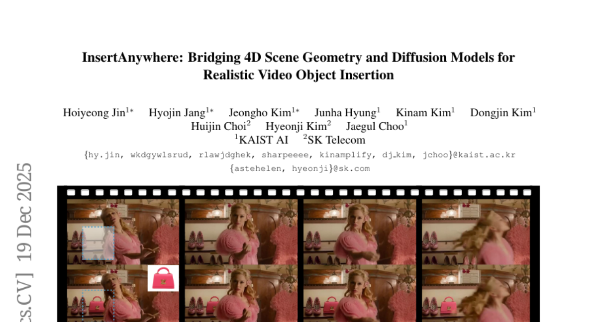
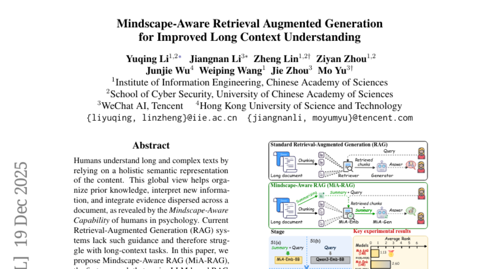
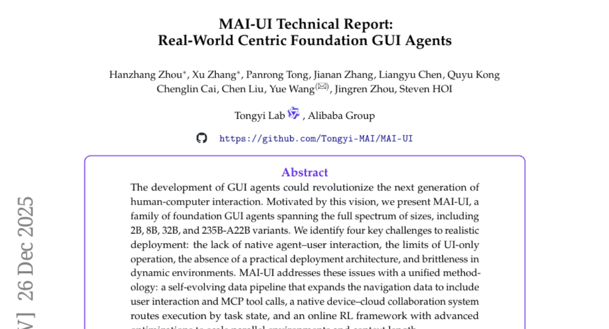
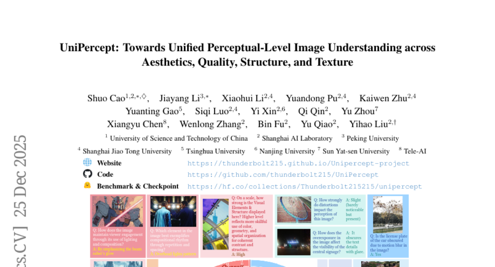
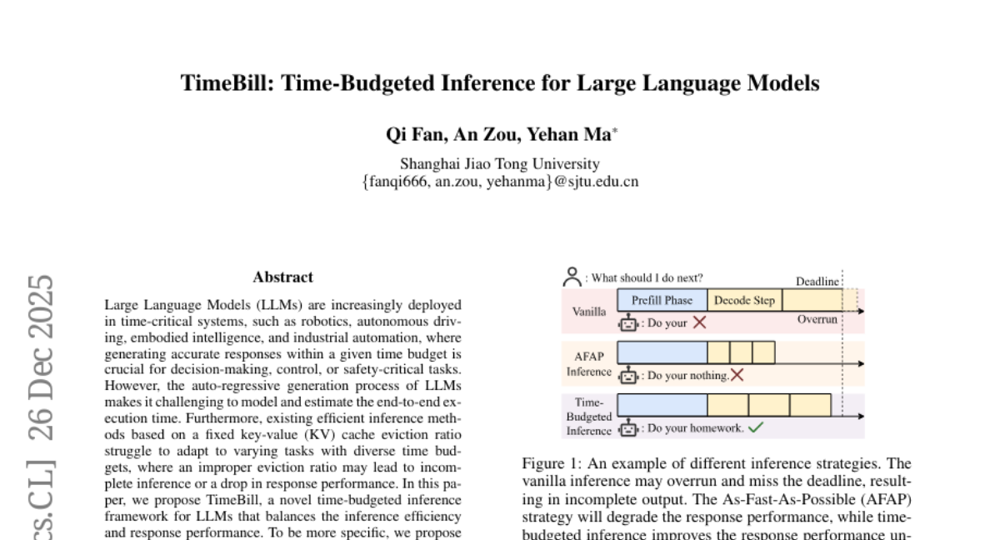

# 2025-12-29 Daily Papers (Top 5)

## 1. [InsertAnywhere: Bridging 4D Scene Geometry and Diffusion Models for Realistic Video Object Insertion](https://huggingface.co/papers/2512.17504)
**Upvotes**: 87

### 📌 요약
InsertAnywhere는 4D 장면 기하학 이해와 확산 모델을 결합하여, 가려짐 및 조명 효과를 현실적으로 처리하며 기하학적으로 일관되고 시각적으로 충실한 비디오 객체 삽입(VOI)을 달성하는 새로운 프레임워크이다.

### 🔑 핵심 포인트
- 장면 기하학을 재구성하고 시간적 일관성 및 가려짐 처리를 보장하여 기하학적으로 일관된 객체 배치를 위한 4D 인식 마스크 생성 모듈을 도입했다.
- 확산 기반 비디오 생성 모델을 확장하여 삽입된 객체뿐만 아니라 주변의 조명, 음영 등 국부적인 환경 변화까지 공동으로 합성한다.
- 지도 학습을 위해 기존 ROSE 데이터셋을 조명 인식이 가능한 합성 데이터셋(ROSE++)으로 변환하고, 객체 제거 영상, 객체 포함 영상, VLM 참조 이미지 삼중항을 구성했다.

---

## 2. [Mindscape-Aware Retrieval Augmented Generation for Improved Long Context Understanding](https://huggingface.co/papers/2512.17220)
**Upvotes**: 84

### 📌 요약
긴 문맥 이해 개선을 위해, 인간의 총체적 이해 능력을 모방하여 계층적 요약을 통해 전역적 맥락(Mindscape)을 구축하고 이를 검색과 생성 모두에 적용하는 MiA-RAG 방법론을 제안하며, 이는 우수한 성능을 입증한다.

### 🔑 핵심 포인트
- 기존 RAG 시스템의 긴 문맥 이해력 한계를 극복하기 위해 인간의 '마인드스케이프 인식 능력(Mindscape-Aware Capability)'에서 영감을 얻어 전역적 문맥 인식의 필요성을 강조한다.
- MiA-RAG는 계층적 요약(hierarchical summarization)을 통해 전역적 의미 표현(mindscape)을 구축하며, 이 정보를 검색(retrieval)과 생성(generation) 과정 모두에 명시적인 조건(conditioning)으로 활용한다.
- 이 접근 방식은 검색기(retriever)가 풍부한 쿼리 임베딩을 형성하고 생성기(generator)가 일관된 전역적 맥락 내에서 근거를 추론할 수 있게 하여, 긴 문맥 및 이중 언어 벤치마크에서 기존 기준선(baseline)보다 지속적으로 우수한 성능을 달성한다.

---

## 3. [MAI-UI Technical Report: Real-World Centric Foundation GUI Agents](https://huggingface.co/papers/2512.22047)
**Upvotes**: 25

### 📌 요약
현실 세계 배포를 위한 기반 GUI 에이전트인 MAI-UI는 2B부터 235B까지 다양한 크기로 개발되었으며, 자체 진화 데이터 파이프라인, 네이티브 기기-클라우드 협업 시스템, 확장된 온라인 RL 프레임워크를 통해 GUI 벤치마크에서 새로운 최고 성능을 확립했다.

### 🔑 핵심 포인트
- MAI-UI는 사용자 상호작용 및 MCP 도구 호출을 포함하는 자체 진화 데이터 파이프라인과 작업 상태 기반 실행을 위한 네이티브 기기-클라우드 협업 시스템을 도입하여 현실 세계에서의 배포 문제를 해결한다.
- GUI 그라운딩 벤치마크(ScreenSpot-Pro 73.5%) 및 모바일 GUI 내비게이션 벤치마크(AndroidWorld 76.7%)에서 Gemini-3-Pro 및 Seed1.8을 능가하는 새로운 최고 성능(SOTA)을 달성했다.
- 온라인 RL 환경의 병렬 처리 확장(32개→512개)을 통해 5.2%p 성능 향상을 보였으며, 기기-클라우드 협업 시스템을 통해 온디바이스 성능 33% 개선 및 클라우드 모델 호출 40% 이상 감소 효과를 얻었다.

---

## 4. [UniPercept: Towards Unified Perceptual-Level Image Understanding across Aesthetics, Quality, Structure, and Texture](https://huggingface.co/papers/2512.21675)
**Upvotes**: 22

### 📌 요약
본 연구는 미적 요소, 품질, 구조, 질감 등 지각 수준의 이미지 이해를 위한 통합 벤치마크(UniPercept-Bench)를 구축하고, DAPT 및 RL 기반으로 훈련된 강력한 기준 모델 UniPercept가 기존 MLLM을 능가하며 텍스트-이미지 생성의 보상 모델로 활용될 수 있음을 입증합니다.

### 🔑 핵심 포인트
- 심미성, 품질, 구조, 질감에 걸친 지각 수준 이미지 이해를 위한 통일된 벤치마크 프레임워크 UniPercept-Bench를 제시하고, 이를 평가할 대규모 데이터셋과 계층적 정의 시스템을 구축했다.
- Domain-Adaptive Pre-Training(도메인 적응형 사전 학습) 및 Task-Aligned RL(작업 정렬 강화 학습)을 통해 훈련되어 Visual Rating(VR) 및 Visual Question Answering(VQA) 작업 전반에서 강력한 일반화 성능을 보이는 기준 모델 UniPercept를 개발했다.
- UniPercept는 기존 MLLM보다 지각 수준 이해에서 우수한 성능을 보였으며, 텍스트-이미지 생성 모델을 위한 플러그 앤 플레이 방식의 보상 모델로 기능할 수 있다.

---

## 5. [TimeBill: Time-Budgeted Inference for Large Language Models](https://huggingface.co/papers/2512.21859)
**Upvotes**: 16

### 📌 요약
TimeBill은 LLM이 시간 임계 시스템에서 주어진 시간 예산 내에 정확한 응답을 생성하도록 돕기 위해, 실행 시간을 예측하고 이에 맞춰 KV 캐시 제거 비율을 동적으로 조절하는 새로운 시간 예산 기반 추론 프레임워크이다.

### 🔑 핵심 포인트
- LLM의 자동 회귀적 생성 특성으로 인해 어려운 종단 간 실행 시간 모델링 문제를 해결하고, 시간 예산 내 응답 완료를 보장하는 것을 목표로 한다.
- 응답 길이 예측기(RLP)와 실행 시간 예측기(ETE)를 포함하여 LLM의 총 실행 시간을 정밀하게 예측하는 구성 요소를 제안한다.
- 예측된 실행 시간과 주어진 시간 예산을 기반으로 키-값(KV) 캐시 제거 비율을 적응적으로 조정하여 추론 효율성과 응답 성능의 균형을 맞춘다.

---

