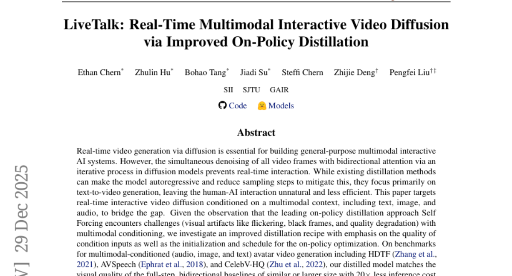
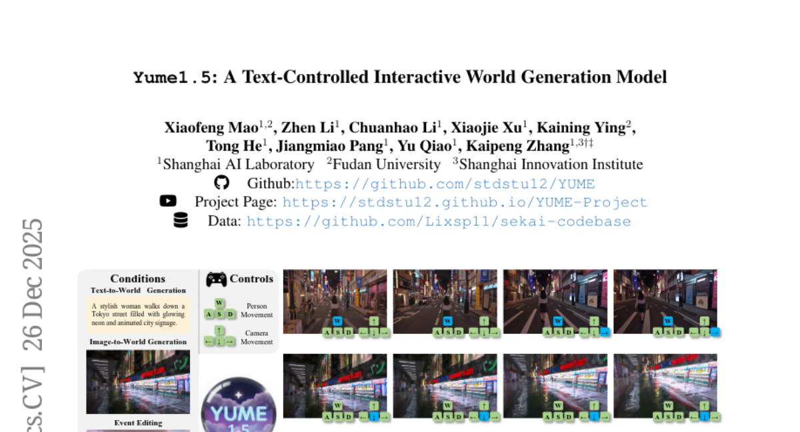
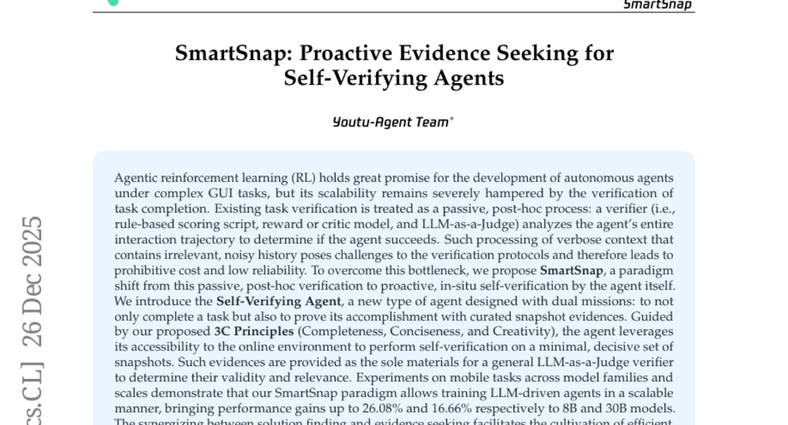
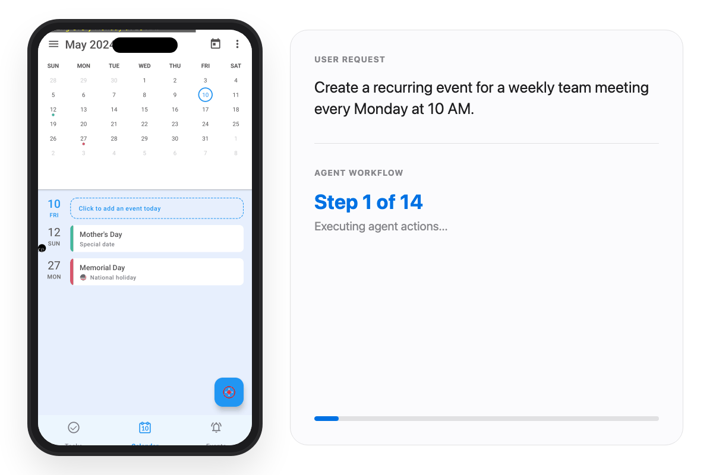
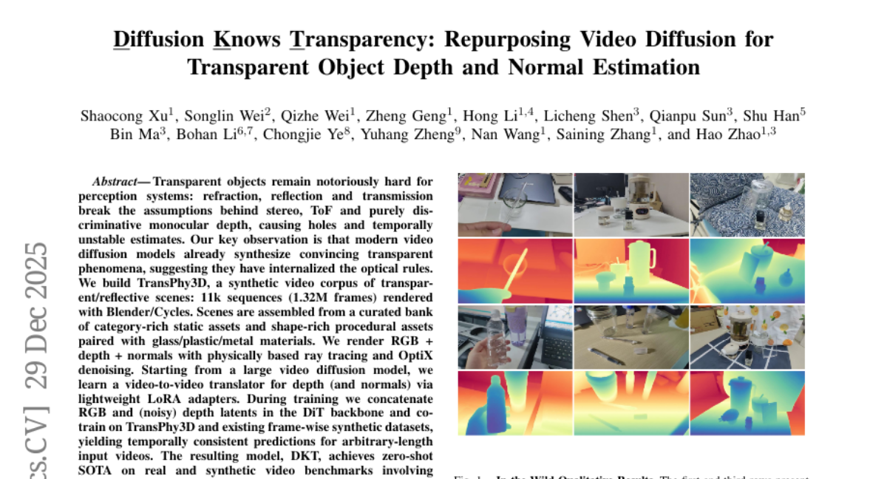

# 2025-12-30 Daily Papers (Top 5)

## 1. [Coupling Experts and Routers in Mixture-of-Experts via an Auxiliary Loss](https://huggingface.co/papers/2512.23447)
**Upvotes**: 70

### 📌 요약
MoE 모델의 라우터 결정과 전문가 역량을 긴밀하게 결합하고 전문가의 특화를 유도하여 성능을 극대화하는 효율적인 보조 손실(ERC loss)을 제안한다.

### 🔑 핵심 포인트
- 라우터의 임베딩을 해당 전문가에 할당된 토큰의 대리 토큰(proxy token)으로 취급하고, 이 프록시 토큰을 통해 라우터 결정과 전문가 역량을 명시적으로 연결하는 ERC(Expert-Router Coupling) 손실을 도입한다.
- ERC 손실은 두 가지 핵심 제약 조건을 적용한다: (1) 각 전문가는 자신의 프록시 토큰에 가장 높은 활성화를 보여야 하며 (전문화), (2) 각 프록시 토큰은 해당하는 전문가에 의해 가장 강력하게 활성화되어야 한다 (라우터 충실도).
- 계산 비용이 전문가 수($n$)에 따른 $n^2$ 활성화로 배치 크기에 독립적인 고정 비용을 가져 계산 효율성이 높으며, 대규모 MoE-LLM 사전 학습을 통해 효과를 입증하고 훈련 중 전문가 전문화 수준의 정량적 추적 및 제어를 제공한다.

---

## 2. [LiveTalk: Real-Time Multimodal Interactive Video Diffusion via Improved On-Policy Distillation](https://huggingface.co/papers/2512.23576)
**Upvotes**: 49

### 📌 요약
실시간 다중 모달 인터랙티브 비디오 생성을 위해 개선된 온-정책 증류(On-Policy Distillation) 방식을 제안하며, 이를 통해 구축된 LiveTalk 시스템은 기존 SOTA 모델 대비 20배 빠른 속도로 고품질의 다중 턴 상호작용을 가능하게 한다.

### 🔑 핵심 포인트
- 기존 온-정책 증류(Self Forcing) 접근법이 다중 모달 조건화(텍스트, 이미지, 오디오)에서 발생시키는 시각적 아티팩트 문제를 해결하기 위해, 조건 입력 품질과 최적화 스케줄에 중점을 둔 개선된 증류 레시피를 개발하였다.
- 제안된 증류 모델은 20배 적은 추론 비용과 지연 시간을 보이면서도, 유사하거나 더 큰 규모의 완전 단계(full-step) 양방향 베이스라인 모델과 동등한 수준의 시각적 품질을 달성하였다.
- 개선된 모델을 기반으로 LiveTalk라는 실시간 다중 모달 인터랙티브 아바타 시스템을 구축했으며, 이는 응답 지연 시간을 수 분에서 실시간으로 단축시키고 멀티턴 비디오 일관성 및 콘텐츠 품질에서 최신 SOTA 모델(Sora2, Veo3)을 능가하였다.

---

## 3. [Yume-1.5: A Text-Controlled Interactive World Generation Model](https://huggingface.co/papers/2512.22096)
**Upvotes**: 48

### 📌 요약
Yume-1.5는 기존 모델의 비효율적인 실시간 성능 및 텍스트 제어 부재 문제를 해결하고, 텍스트 또는 단일 이미지를 통해 키보드 탐색이 가능한 현실적이고 연속적인 인터랙티브 세계를 생성하는 새로운 프레임워크입니다.

### 🔑 핵심 포인트
- 통합된 컨텍스트 압축과 선형 어텐션을 통합한 장편 비디오(Long-video) 생성 프레임워크.
- 양방향 어텐션 증류(distillation)와 향상된 텍스트 임베딩 스킴을 활용한 실시간 스트리밍 가속 전략.
- 생성된 세계 내의 이벤트 발생을 제어하기 위한 텍스트 기반 제어 방법론.

---

## 4. [SmartSnap: Proactive Evidence Seeking for Self-Verifying Agents](https://huggingface.co/papers/2512.22322)
**Upvotes**: 33

### 📌 요약
SmartSnap은 복잡한 GUI 태스크에서 에이전트가 임무 완수를 증명하기 위해 상호작용 궤적 전체 대신 선별된 스냅샷 증거를 수집하는 능동적인 자기 검증 패러다임을 제안하여, LLM 기반 에이전트의 확장성과 성능을 크게 향상시킨다.

### 🔑 핵심 포인트
- 기존의 비효율적이고 수동적인 사후 검증 방식 대신, 에이전트 스스로 수행하는 능동적이고 현장(in-situ) 기반의 자기 검증 방식으로 패러다임을 전환한다.
- 새로운 자기 검증 에이전트(Self-Verifying Agent)는 3C 원칙(Completeness, Conciseness, Creativity)의 가이드 아래 임무 완수를 입증하는 최소한의 결정적인 스냅샷 증거를 선별적으로 수집한다.
- 이 접근 방식은 LLM 기반 에이전트의 훈련 확장성을 높이며, 모바일 태스크 실험에서 모델 규모에 따라 최대 26.08%의 성능 향상을 달성하고 경쟁적인 결과를 보인다.
### 🖼️ 추가 자료

---

## 5. [Diffusion Knows Transparency: Repurposing Video Diffusion for Transparent Object Depth and Normal Estimation](https://huggingface.co/papers/2512.23705)
**Upvotes**: 32

### 📌 요약
비디오 확산 모델이 투명 객체의 광학 규칙을 내재화했다는 관찰을 기반으로, 합성 데이터셋 TransPhy3D와 LoRA 어댑터를 활용하여 투명 객체에 대해 시간적으로 일관된 깊이 및 법선 추정에서 SOTA 성능을 달성하는 비디오-투-비디오 변환 모델 DKT를 개발했다.

### 🔑 핵심 포인트
- 현대 비디오 확산 모델이 투명 객체의 광학적 규칙(굴절, 반사)을 이미 내재화하고 있다는 통찰을 바탕으로, 이를 깊이 및 법선 추정을 위한 견고하고 시간적으로 일관된 인식 시스템으로 재활용(Repurpose)했다.
- 물리 기반 렌더링을 사용하여 11k 시퀀스로 구성된 투명/반사 객체 합성 비디오 데이터셋 TransPhy3D를 구축하고, 대규모 비디오 확산 모델 백본에 경량 LoRA 어댑터를 적용하여 DKT(Diffusion Knows Transparency) 모델을 훈련했다.
- DKT는 ClearPose, DREDS 등 투명성 관련 실제 및 합성 비디오 벤치마크에서 zero-shot SOTA 성능을 달성했으며, 파지(grasping) 스택에 통합 시 작업 성공률을 향상시켜 실용적인 로봇 조작에 대한 잠재력을 입증했다.
### 🖼️ 추가 자료

---

