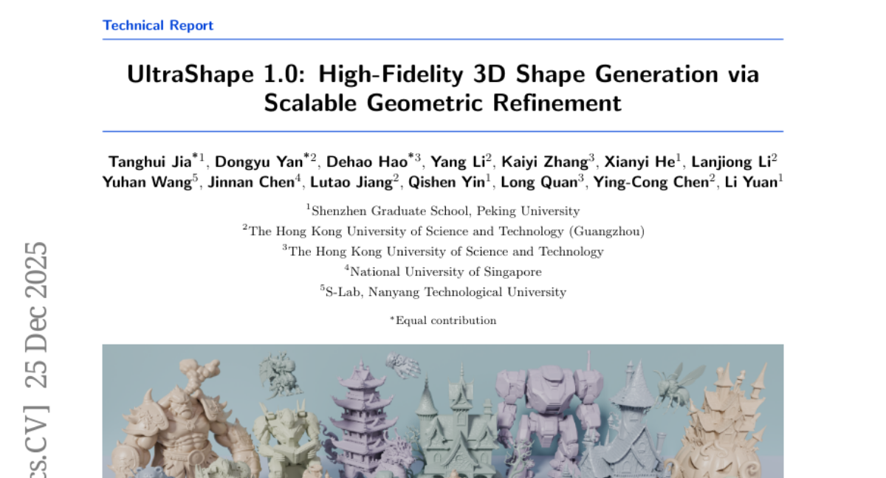
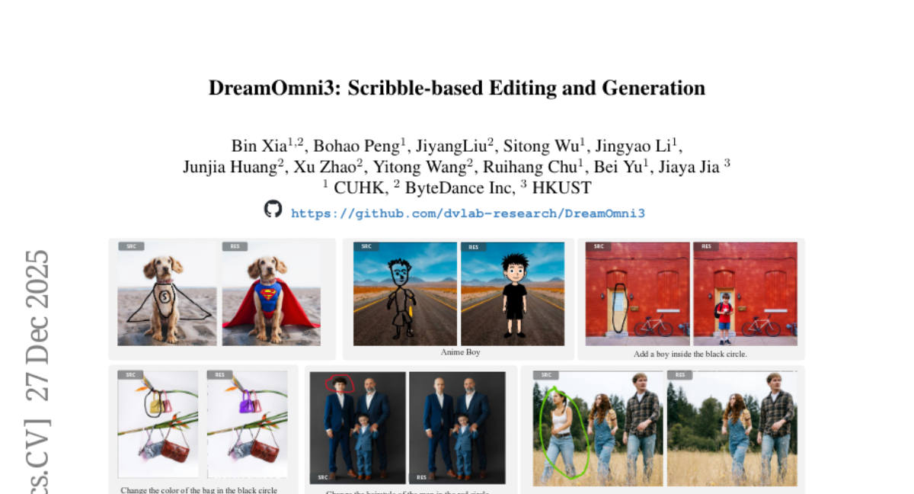
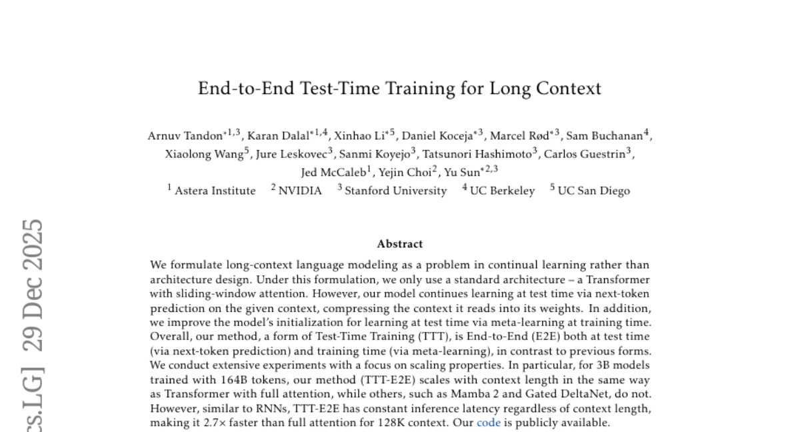
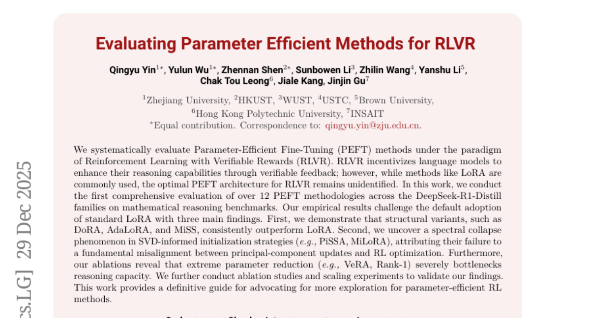
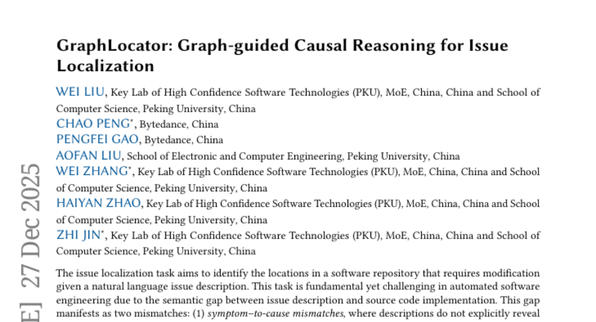

# 2025-12-31 Daily Papers (Top 5)

## 1. [UltraShape 1.0: High-Fidelity 3D Shape Generation via Scalable Geometric Refinement](https://huggingface.co/papers/2512.21185)
**Upvotes**: 14

### 📌 요약
고품질 3D 형상 생성을 위한 확장 가능한 3D 확산 프레임워크인 UltraShape 1.0은, 조악한 전역 구조를 합성한 후 정교한 기하학적 디테일을 다듬는 2단계 파이프라인을 제안합니다.

### 🔑 핵심 포인트
- 구멍 메우기, 얇은 구조물 두껍게 하기 등을 통해 기하학적 품질을 개선하는 독창적인 방수(watertight) 처리 방법을 포함한 포괄적인 데이터 처리 파이프라인을 구축했습니다.
- 조악한 전역 구조를 먼저 합성한 후 세부 기하학적 디테일을 정교하게 다듬는 2단계 생성 파이프라인을 채택하여 고품질 결과를 얻습니다.
- 확산 모델이 지역적 디테일 합성에 집중하도록, 조악한 형상에서 파생된 RoPE 인코딩 위치 앵커를 활용하여 공간 위치 지정과 디테일 합성을 분리하는 복셀 기반 정제 방식을 구현했습니다.

---

## 2. [DreamOmni3: Scribble-based Editing and Generation](https://huggingface.co/papers/2512.22525)
**Upvotes**: 9

### 📌 요약
DreamOmni3는 텍스트 프롬프트의 한계를 극복하기 위해 스크리블 기반 편집 및 생성 작업을 정의하고, 이를 처리하는 새로운 조인트 입력 프레임워크와 전용 학습 데이터셋을 구축하여 정밀한 시각적 제어를 가능하게 한다.

### 🔑 핵심 포인트
- 텍스트 외에도 이미지 및 자유형 스케치(스크리블)를 활용하여 정밀한 위치 지정 및 세밀한 시각적 조작을 가능하게 하는 스크리블 기반 편집 및 생성이라는 새로운 작업을 제안한다.
- 스크리블 기반 편집(4가지 하위 작업) 및 생성(3가지 하위 작업)을 포괄하는 새로운 데이터 합성 파이프라인을 구축하여 DreamOmni2 데이터셋을 확장하고 훈련 데이터를 구성한다.
- 복잡한 바이너리 마스크 대신, 원본 이미지와 스크리블된 소스 이미지를 색상으로 구분하여 동시에 모델에 입력하는 '조인트 입력 체계(joint input scheme)'를 제안하여 정확한 지역화 및 편집을 수행한다.

---

## 3. [End-to-End Test-Time Training for Long Context](https://huggingface.co/papers/2512.23675)
**Upvotes**: 6

### 📌 요약
긴 문맥 언어 모델링을 위한 TTT-E2E 방법론은 표준 트랜스포머 구조를 사용하여 테스트 시간에 연속적으로 학습하며, 완전한 주의 집중 모델과 동등한 확장성을 보이면서도 문맥 길이에 독립적인 일정한 추론 속도를 제공한다.

### 🔑 핵심 포인트
- 긴 문맥 언어 모델링 문제를 구조 설계가 아닌 연속 학습(Continual Learning) 문제로 재정의하고, 슬라이딩 윈도우를 사용하는 표준 트랜스포머 구조를 기반으로 한다.
- 기존 방식과 달리, 다음 토큰 예측을 통해 테스트 시간에 지속적으로 학습(Test-Time Training, TTT)하여 문맥 정보를 모델 가중치에 압축하며, 훈련 시간에 메타 학습을 적용하여 E2E(End-to-End) 학습을 완성한다.
- TTT-E2E는 Mamba 2나 Gated DeltaNet과 달리 완전한 주의 집중(full attention) 방식과 동일하게 문맥 길이에 비례하는 확장성을 보이며, 문맥 길이에 관계없이 일정한 추론 지연 시간(constant inference latency)을 유지하여 128K 문맥에서 2.7배 더 빠르다.

---

## 4. [Evaluating Parameter Efficient Methods for RLVR](https://huggingface.co/papers/2512.23165)
**Upvotes**: 5

### 📌 요약
검증 가능한 보상 기반 강화 학습(RLVR) 환경에서 12가지 이상의 PEFT 방법론을 체계적으로 평가한 결과, 구조적 변형들이 표준 LoRA보다 우수하며, SVD 기반 초기화 전략은 최적화 과정의 불일치로 인해 실패하고 극단적인 매개변수 축소는 추론 능력을 저해함을 입증했다.

### 🔑 핵심 포인트
- DoRA, AdaLoRA, MiSS와 같은 구조적 변형 PEFT 방법론들은 표준 LoRA를 능가하며 일관되게 우수한 성능을 보였다.
- PiSSA, MiLoRA 등 SVD 정보를 활용하는 초기화 전략들은 주성분 업데이트와 RL 최적화 간의 근본적인 불일치로 인해 스펙트럼 붕괴(Spectral Collapse) 현상을 보이며 성능이 저조했다.
- VeRA 및 Rank-1과 같은 극단적인 수준의 매개변수 축소는 언어 모델의 추론 능력을 심각하게 제한하는 병목 현상을 야기한다.

---

## 5. [GraphLocator: Graph-guided Causal Reasoning for Issue Localization](https://huggingface.co/papers/2512.22469)
**Upvotes**: 1

### 📌 요약
GraphLocator는 인과 구조 발견과 동적 이슈 분리 기법을 사용하여 소프트웨어 이슈 설명과 소스 코드 간의 의미론적 불일치 문제를 해결하고, 인과 이슈 그래프(CIG)를 통해 정확한 이슈 위치를 식별하는 새로운 접근법이다.

### 🔑 핵심 포인트
- 이슈 설명이 원인을 명시하지 않는 ‘증상-원인 불일치’와 하나의 이슈가 다수의 상호 의존적인 코드로 이어지는 ‘일대다 불일치’ 문제를 해결하는 것을 목표로 한다.
- 핵심 아티팩트는 인과 이슈 그래프(CIG)로, 발견된 하위 이슈와 관련 코드 엔티티를 정점으로, 그 사이의 인과적 의존성을 엣지로 표현하여 인과적 추론을 가능하게 한다.
- 기존 기준선 대비 평균적으로 함수 수준 재현율(Recall)에서 19.49%, 정확도(Precision)에서 11.89% 향상된 이슈 위치 식별 정확도를 달성했으며, 특히 복잡한 불일치 시나리오에서 우수한 성능을 입증했다.

---

