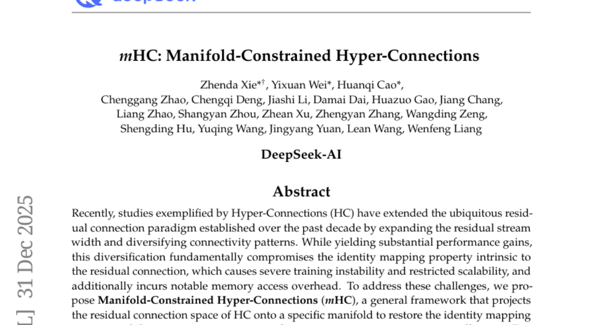
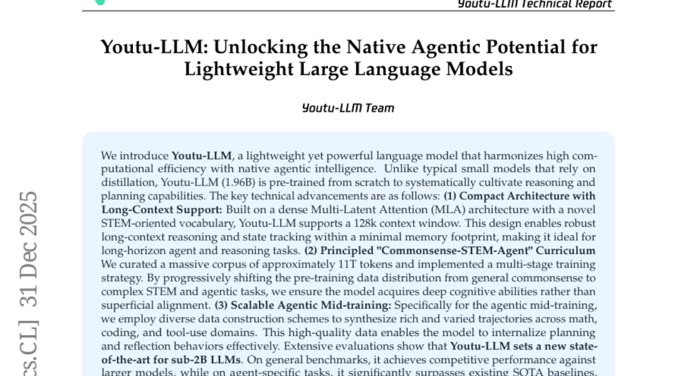
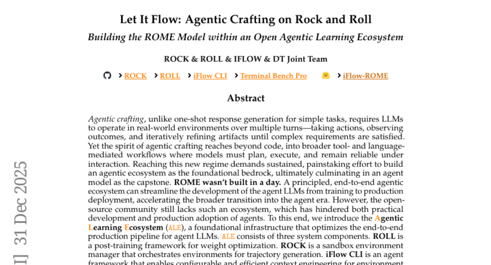
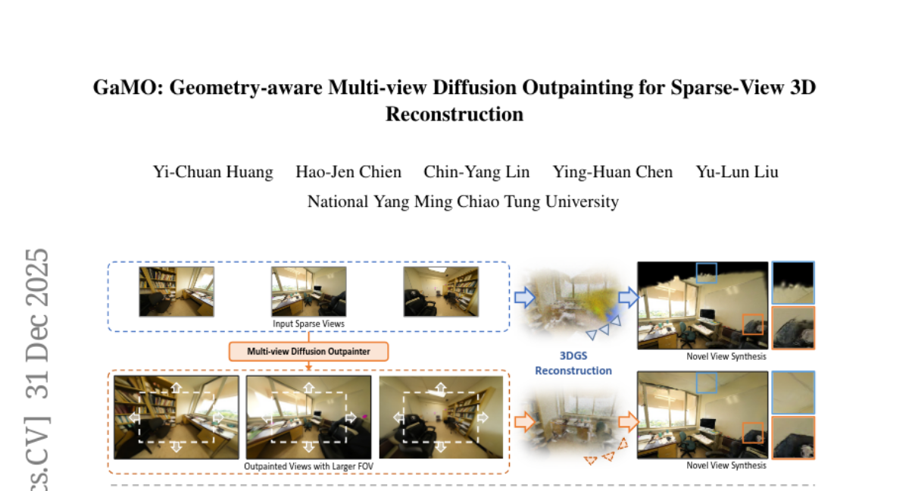
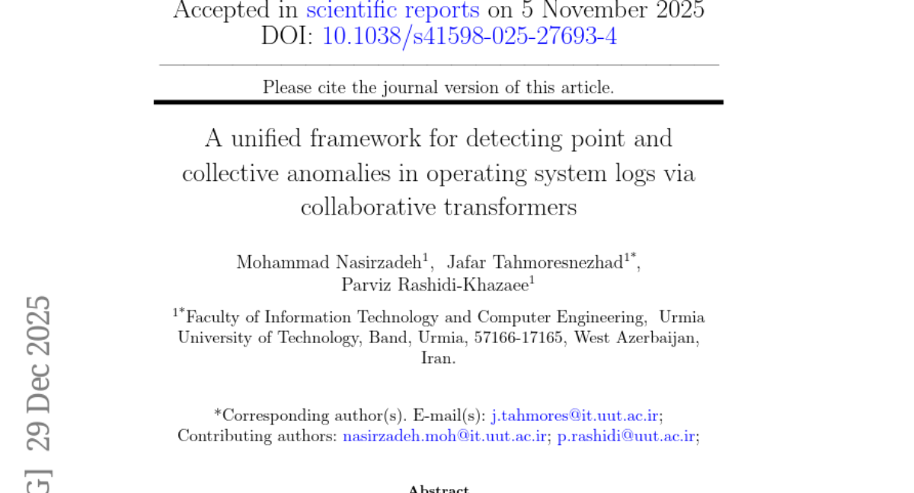

# 2026-01-01 Daily Papers (Top 5)

## 1. [mHC: Manifold-Constrained Hyper-Connections](https://huggingface.co/papers/2512.24880)
**Upvotes**: 44

### 📌 요약
본 논문은 하이퍼 연결(HC)의 단점인 훈련 불안정성과 낮은 확장성을 해결하기 위해, 잔차 연결 공간을 특정 다양체에 제약하여 항등 사상 속성을 복원하고 효율성을 극대화한 다양체 제약형 하이퍼 연결(mHC)을 제안한다.

### 🔑 핵심 포인트
- 기존 하이퍼 연결(HC)은 연결 패턴의 다양화로 성능을 높였지만, 잔차 연결의 본질적인 항등 사상 속성을 훼손하여 심각한 훈련 불안정성과 확장성 제약을 초래했다.
- 제안된 mHC(다양체 제약형 하이퍼 연결)는 HC의 잔차 연결 공간을 특정 다양체에 투영하여 항등 사상 속성을 복원함으로써 훈련 안정성을 회복한다.
- mHC는 엄격한 인프라 최적화를 통해 높은 효율성을 보장하며, 대규모 훈련에 효과적이고 우수한 확장성과 성능 향상을 제공한다.

---

## 2. [Youtu-LLM: Unlocking the Native Agentic Potential for Lightweight Large Language Models](https://huggingface.co/papers/2512.24618)
**Upvotes**: 41

### 📌 요약
Youtu-LLM은 1.96B급 경량 언어 모델로, 새로운 구조와 에이전트 중심의 다단계 훈련 커리큘럼을 통해 높은 효율성으로 강력한 장문 추론 및 에이전트 성능을 달성하며 sub-2B 모델의 새로운 SOTA를 확립했다.

### 🔑 핵심 포인트
- 조밀한 Multi-Latent Attention(MLA) 아키텍처와 STEM 기반 어휘를 사용하여 128k 컨텍스트 창을 지원, 최소 메모리 공간으로 강력한 장기 추론 및 에이전트 작업을 수행할 수 있도록 설계됨.
- 약 11T 토큰의 방대한 코퍼스와 함께, 일반 상식에서 복잡한 STEM, 에이전트 작업으로 점진적으로 이동하는 'Commonsense-STEM-Agent' 다단계 훈련 커리큘럼을 적용하여 깊은 인지 능력을 체계적으로 배양함.
- 수학, 코딩, 도구 사용 등 다양한 영역에 걸쳐 궤적 데이터를 합성하는 에이전트 중심의 고품질 미드 트레이닝을 통해 모델이 계획 및 반영 능력을 효과적으로 내재화했으며, 그 결과 에이전트 특정 작업에서 기존 SOTA를 크게 능가함.

---

## 3. [Let It Flow: Agentic Crafting on Rock and Roll, Building the ROME Model within an Open Agentic Learning Ecosystem](https://huggingface.co/papers/2512.24873)
**Upvotes**: 32

### 📌 요약
복잡한 에이전트 개발을 최적화하기 위해 ROLL, ROCK, iFlow CLI로 구성된 Agentic Learning Ecosystem (ALE)을 구축하고, 이를 활용하여 상호작용 기반 정책 정렬(IPA) 알고리즘으로 학습된 오픈소스 에이전트 모델 ROME과 새로운 벤치마크 Terminal Bench Pro를 제안한다.

### 🔑 핵심 포인트
- 에이전트 LLM 개발 파이프라인을 최적화하는 핵심 인프라인 Agentic Learning Ecosystem (ALE)을 ROLL(가중치 최적화), ROCK(샌드박스 환경), iFlow CLI(컨텍스트 엔지니어링)의 세 구성 요소로 구축했다.
- 100만 개 이상의 궤적을 학습한 오픈소스 에이전트 모델 ROME을 공개했으며, 장기적 학습 안정성을 높이기 위해 토큰 대신 의미론적 상호작용 단위로 크레딧을 할당하는 새로운 정책 최적화 알고리즘 IPA(Interaction-based Policy Alignment)를 도입했다.
- ALE 인프라의 효과는 SWE-bench Verified 및 규모와 오염 통제를 개선한 새로운 벤치마크 Terminal Bench Pro를 포함한 여러 환경에서 ROME의 강력한 성능을 통해 입증되었다.

---

## 4. [GaMO: Geometry-aware Multi-view Diffusion Outpainting for Sparse-View 3D Reconstruction](https://huggingface.co/papers/2512.25073)
**Upvotes**: 21

---

## 5. [A unified framework for detecting point and collective anomalies in operating system logs via collaborative transformers](https://huggingface.co/papers/2512.23380)
**Upvotes**: 17

---

