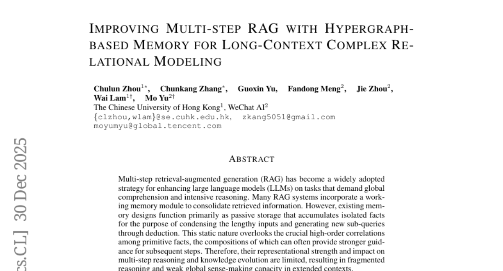
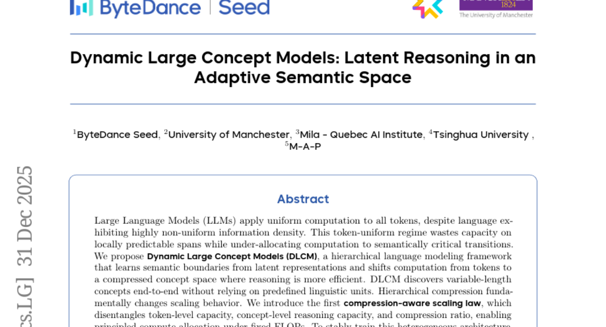
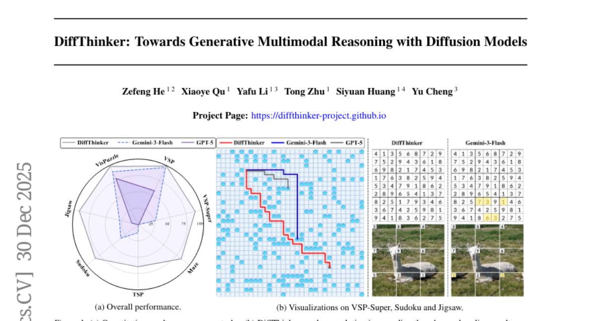
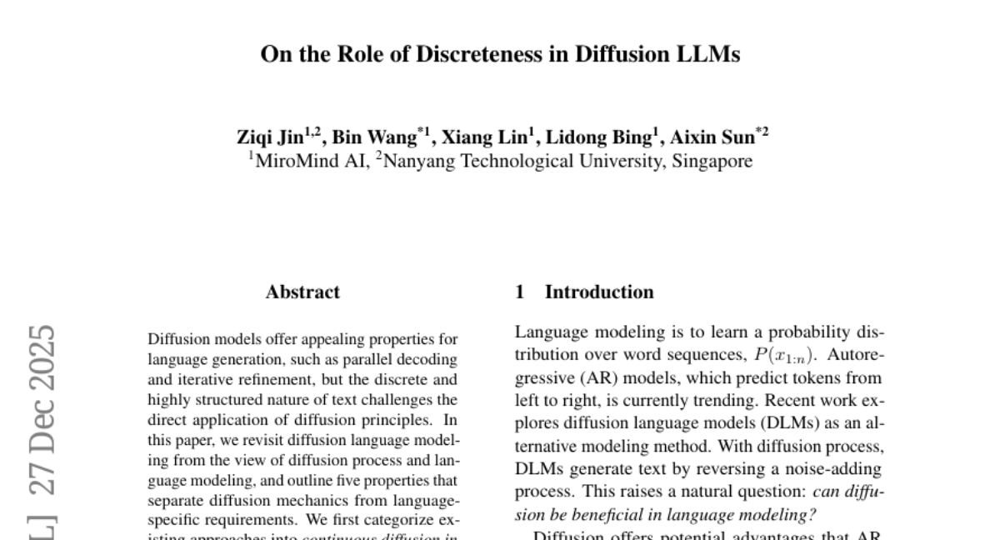
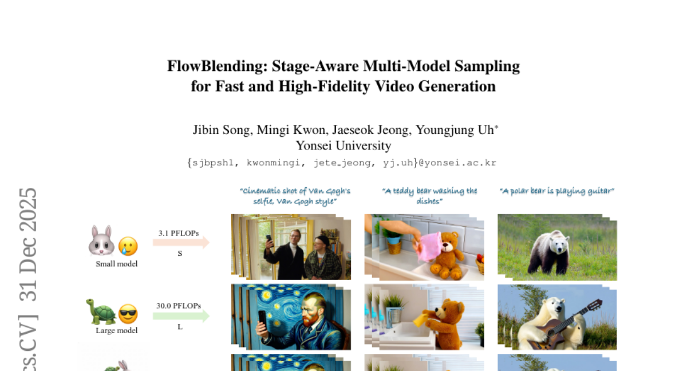

# 2026-01-02 Daily Papers (Top 5)

## 1. [Improving Multi-step RAG with Hypergraph-based Memory for Long-Context Complex Relational Modeling](https://huggingface.co/papers/2512.23959)
**Upvotes**: 37

### 📌 요약
다단계 RAG의 제한적인 메모리 기능을, 사실 간의 복잡한 고차원적 관계를 동적으로 통합하는 하이퍼그래프 기반 메모리(HGMem)로 대체하여 추론 및 전역적 상황 이해 성능을 획기적으로 개선했다.

### 🔑 핵심 포인트
- 기존 다단계 RAG 시스템의 메모리는 고립된 사실만 수동적으로 저장하여 고차원적 상관관계를 포착하지 못하고, 이로 인해 추론이 단편화된다는 문제점을 지적한다.
- 기억을 하이퍼그래프(hypergraph) 구조로 표현하는 HGMem을 제안하며, 하이퍼엣지(hyperedges)를 통해 사실들 간의 복잡하고 진화하는 고차원적 상호작용을 통합한다.
- HGMem은 메모리를 동적이고 통합적인 지식 구조로 변모시켜, 복잡한 다단계 추론 및 장문 컨텍스트에서의 전역적 상황 이해(global sense-making) 능력을 효과적으로 향상시킨다.

---

## 2. [Dynamic Large Concept Models: Latent Reasoning in an Adaptive Semantic Space](https://huggingface.co/papers/2512.24617)
**Upvotes**: 23

### 📌 요약
DLCM(Dynamic Large Concept Models)은 언어의 불균일한 정보 밀도를 해결하기 위해 계산 자원을 토큰 수준에서 효율적인 압축된 개념 공간으로 동적으로 전환하여 추론 효율을 극대화하는 계층적 언어 모델이다.

### 🔑 핵심 포인트
- 잠재 표현(latent representations)으로부터 의미론적 경계를 학습하고, 연산을 토큰 수준에서 압축된 개념 공간으로 전환함으로써 고정된 계산량(FLOPs) 하에서 추론 백본의 용량을 높여 성능을 개선한다.
- 토큰 수준 용량, 개념 수준 추론 용량, 압축률을 분리하는 최초의 '압축 인식 스케일링 법칙(compression-aware scaling law)'을 도입하여, 계산 자원 할당을 체계적으로 접근할 수 있게 한다.
- 이기종(heterogeneous) 아키텍처의 안정적인 훈련을 위해 분리된 $\mu$P(decoupled $\mu$P) 매개변수화를 개발했으며, 동일한 추론 FLOPs 조건에서 12개 제로샷 벤치마크에서 평균 2.69%의 성능 향상을 입증했다.

---

## 3. [DiffThinker: Towards Generative Multimodal Reasoning with Diffusion Models](https://huggingface.co/papers/2512.24165)
**Upvotes**: 15

### 📌 요약
본 논문은 기존 MLLM의 텍스트 중심 추론 한계를 극복하기 위해 멀티모달 추론을 생성적 이미지-투-이미지 작업으로 재정의하는 확산 기반 프레임워크인 DiffThinker를 제시하며, 복잡한 시각 중심 추론에서 기존 SOTA 모델 대비 월등한 성능 향상을 입증한다.

### 🔑 핵심 포인트
- 멀티모달 추론을 네이티브 생성형 이미지-투-이미지 작업으로 재구성하는 '생성형 멀티모달 추론'이라는 새로운 패러다임을 확립하고 DiffThinker 프레임워크를 도입하였다.
- DiffThinker는 시각 중심 작업에서 우수한 논리적 일관성과 공간적 정밀도를 제공하며, 효율성, 제어 가능성, 네이티브 병렬 처리, 협업의 4가지 핵심 내재적 특성을 가지고 있음을 밝혔다.
- 순차적 계획, 조합 최적화 등 4개 영역의 광범위한 실험에서 GPT-5 (+314.2%) 및 Gemini-3-Flash (+111.6%)를 포함한 선도적인 폐쇄형 모델들을 크게 능가하는 성능을 달성하여, 시각 중심 추론에서 생성형 멀티모달 추론의 잠재력을 강조하였다.

---

## 4. [On the Role of Discreteness in Diffusion LLMs](https://huggingface.co/papers/2512.22630)
**Upvotes**: 8

### 📌 요약
확산 언어 모델(Diffusion LLMs)에 대한 구조적 분석을 통해, 텍스트의 이산적 특성을 다루는 데 있어 기존 접근법들의 한계와, 정보 분포 및 다중 토큰 종속성 포착 실패라는 두 가지 핵심 쟁점을 지적하며 텍스트 구조에 더 부합하는 확산 프로세스의 필요성을 역설한다.

### 🔑 핵심 포인트
- 기존 확산 언어 모델 접근법들을 임베딩 공간의 연속적 확산과 토큰에 대한 이산적 확산으로 분류하고, 각각이 핵심 속성 중 일부만 만족하는 구조적 절충점을 가짐을 분석한다.
- 최근의 대규모 확산 언어 모델 분석을 통해, (i) 정보가 위치별로 어떻게 분포되어 있는지 무시하는 균일한 오염(uniform corruption) 방식이 중앙 쟁점임을 확인한다.
- (ii) 병렬 디코딩 시 토큰별 주변부 학습(token-wise marginal training)이 다중 토큰 간의 종속성을 포착하지 못하는 구조적 문제를 야기함을 식별한다.

---

## 5. [FlowBlending: Stage-Aware Multi-Model Sampling for Fast and High-Fidelity Video Generation](https://huggingface.co/papers/2512.24724)
**Upvotes**: 2

### 📌 요약
비디오 생성 추론 과정에서 단계별로 요구되는 모델 용량을 파악하여, 용량 민감 단계에서는 대형 모델을, 중간 단계에서는 소형 모델을 혼합 사용하는 FlowBlending 기법을 통해 높은 품질을 유지하며 최대 1.65배의 추론 속도 향상을 이루었다.

### 🔑 핵심 포인트
- 모델 용량의 영향이 타임스텝에 따라 달라지며, 초기 단계와 후기 단계에서 중요하고 중간 단계에서는 영향이 미미하다는 통찰에 기반한다.
- 용량 민감 단계(초기/후기)에는 대형 모델을, 중간 단계에는 소형 모델을 사용하는 단계 인식 멀티 모델 샘플링 전략인 FlowBlending을 제안한다.
- FlowBlending은 품질(시각적 충실도, 시간적 일관성, 의미적 정렬)을 유지하면서 LTX-Video 및 WAN 2.1 모델에서 최대 1.65배 빠른 추론 속도와 57.35% 적은 FLOPs를 달성했다.

---

