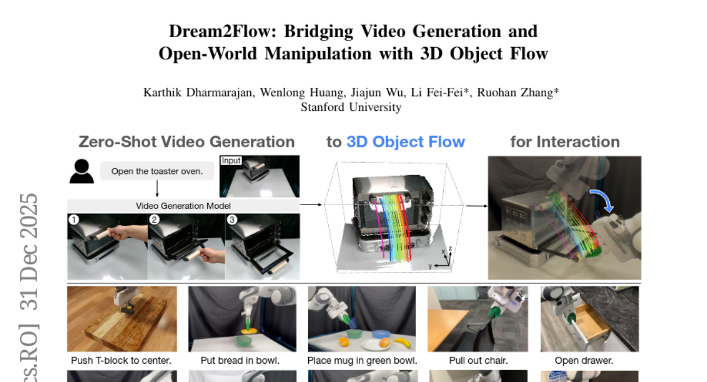

# 2026-01-02 Daily Papers (Top 5)

## 1. [Improving Multi-step RAG with Hypergraph-based Memory for Long-Context Complex Relational Modeling](https://huggingface.co/papers/2512.23959)
**Upvotes**: 69

### 📌 요약
Multi-step RAG의 단편적인 추론 문제를 해결하기 위해, 기존의 수동적인 메모리 저장소를 고차원적 상호작용을 포착하는 동적인 하이퍼그래프 기반 메모리(HGMem) 구조로 대체하여 글로벌 이해 능력을 향상시키는 연구.

### 📝 초록 (번역)
Multi-step RAG(검색 증강 생성)는 포괄적인 이해와 집중적인 추론을 요구하는 작업에서 대규모 언어 모델(LLM)의 성능을 향상시키는 데 널리 채택된 전략이 되었습니다. 많은 RAG 시스템은 검색된 정보를 통합하기 위해 작업 메모리 모듈을 통합합니다. 그러나 기존 메모리 설계는 주로 긴 입력을 압축하고 연역을 통해 새로운 하위 쿼리를 생성할 목적으로 고립된 사실들을 축적하는 수동적인 저장소 역할을 합니다. 이러한 정적 특성은 원시적인 사실들 사이의 중요한 고차원적 상관관계를 간과하며, 이러한 상관관계의 구성은 종종 후속 단계에 더 강력한 지침을 제공할 수 있습니다. 따라서, 그들의 표현력과 다단계 추론 및 지식 진화에 미치는 영향은 제한적이며, 광범위한 맥락에서 단편적인 추론과 약한 글로벌 이해 능력으로 이어집니다. 우리는 메모리 개념을 단순한 저장소를 넘어 복잡한 추론과 글로벌 이해를 위한 동적이고 표현력이 풍부한 구조로 확장하는 하이퍼그래프 기반 메모리 메커니즘인 HGMem을 소개합니다. 우리의 접근 방식에서 메모리는 하이퍼그래프로 표현되며, 그 하이퍼엣지(hyperedges)는 별개의 메모리 단위에 해당하여 메모리 내에서 고차원적 상호작용의 점진적인 형성을 가능하게 합니다. 이 메커니즘은 핵심 문제 주변의 사실과 생각을 연결하여, 후속 단계의 더 깊은 추론을 위한 강력한 명제를 제공하는 통합되고 상황화된 지식 구조로 진화합니다. 우리는 글로벌 이해 능력 측정을 위해 설계된 몇 가지 도전적인 데이터셋에서 HGMem을 평가합니다. 광범위한 실험과 심층 분석은 우리의 방법이 다단계 RAG 성능을 지속적으로 개선하며 다양한 작업에서 강력한 기준 시스템을 상당히 능가함을 보여줍니다.

### 🔑 핵심 포인트
- 기존 다단계 RAG 메모리는 고립된 사실을 축적하는 수동적, 정적 구조로, 고차원적 사실 간의 상관관계를 포착하지 못하여 추론이 단편화되는 근본적인 한계가 있었다.
- HGMem(하이퍼그래프 기반 메모리)을 도입하여 메모리를 하이퍼그래프 구조로 정의하며, 하이퍼엣지를 통해 메모리 단위 간의 고차원적 상호작용을 동적으로 구성한다.
- HGMem은 사실과 생각을 통합하고 상황화된 지식 구조로 진화시켜, 후속 추론 단계에 강력한 지침을 제공하며 글로벌 이해 능력을 크게 향상시킨다.

---

## 2. [Dynamic Large Concept Models: Latent Reasoning in an Adaptive Semantic Space](https://huggingface.co/papers/2512.24617)
**Upvotes**: 32

---

## 3. [DiffThinker: Towards Generative Multimodal Reasoning with Diffusion Models](https://huggingface.co/papers/2512.24165)
**Upvotes**: 20

---

## 4. [On the Role of Discreteness in Diffusion LLMs](https://huggingface.co/papers/2512.22630)
**Upvotes**: 10

---

## 5. [Dream2Flow: Bridging Video Generation and Open-World Manipulation with 3D Object Flow](https://huggingface.co/papers/2512.24766)
**Upvotes**: 5

---

