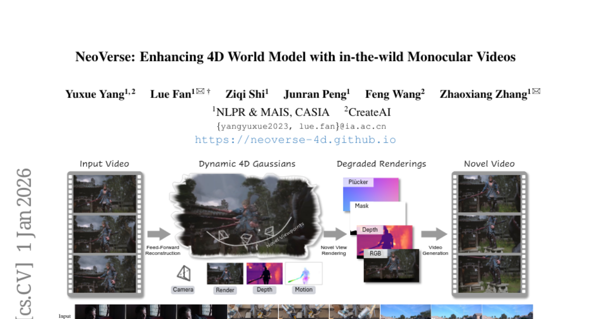
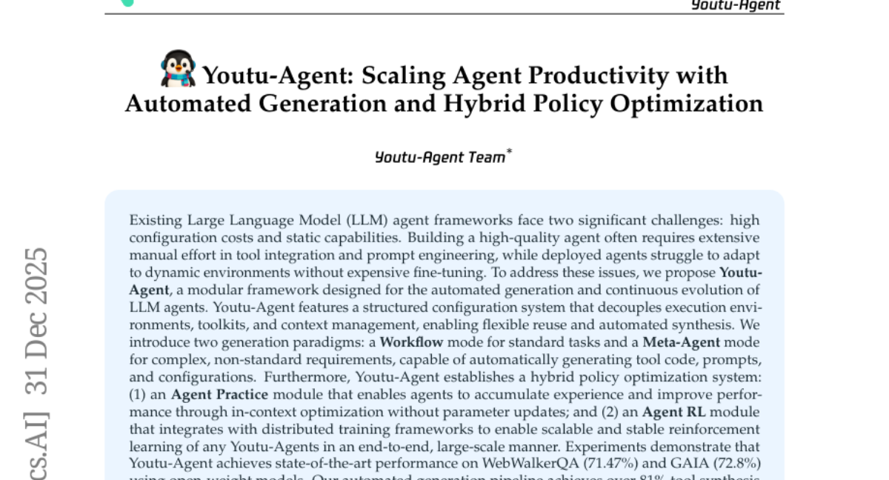
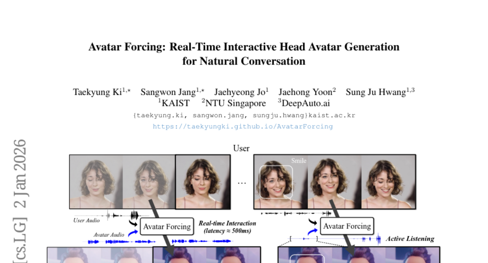
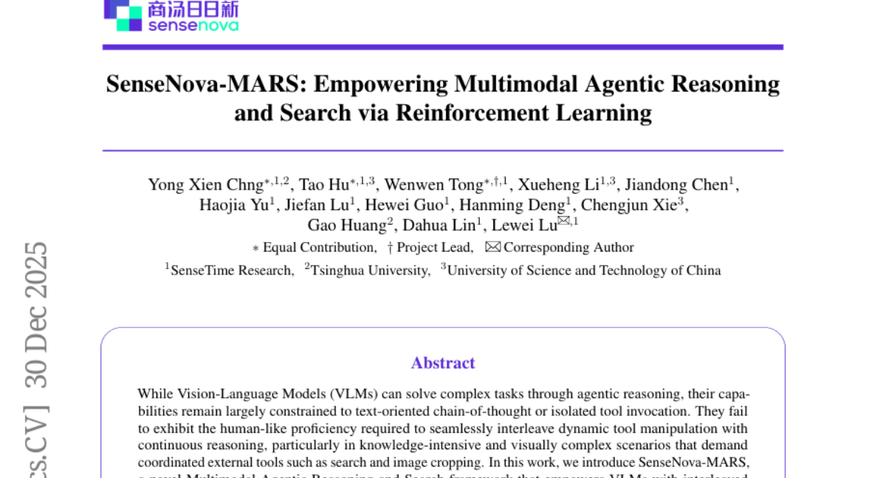
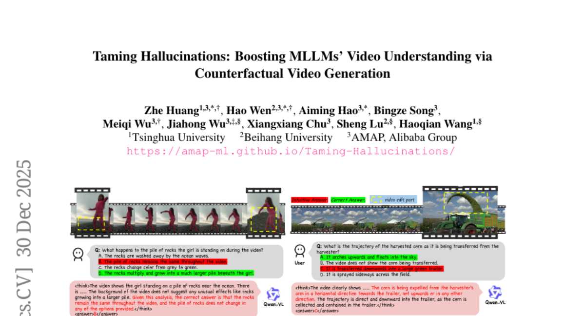

# 2026-01-05 Daily Papers (Top 5)

## 1. [NeoVerse: Enhancing 4D World Model with in-the-wild Monocular Videos](https://huggingface.co/papers/2601.00393)
**Upvotes**: 81

### 📌 요약
NeoVerse는 기존 4D 모델의 확장성 한계를 극복하기 위해 야외 단안 비디오를 활용하며, 포즈 정보 없이 4D 재구성을 수행하여 최신(SOTA) 성능을 달성한 다목적 4D 세계 모델이다.

### 📝 초록 (번역)
이 논문에서 우리는 4D 재구성, 새로운 궤적 비디오 생성, 그리고 풍부한 다운스트림 애플리케이션이 가능한 다재다능한 4D 세계 모델인 NeoVerse를 제안합니다. 우리는 먼저 비용이 많이 들고 전문화된 다중 시점 4D 데이터나 번거로운 훈련 전처리로 인해 발생하는 현재 4D 세계 모델링 방법의 확장성 한계를 확인했습니다. 이와 대조적으로, 우리의 NeoVerse는 전체 파이프라인을 다양한 인더와일드(in-the-wild) 단안 비디오에 확장할 수 있게 만드는 핵심 철학을 기반으로 구축되었습니다. 구체적으로, NeoVerse는 포즈 정보가 필요 없는(pose-free) 피드포워드 방식의 4D 재구성, 온라인 단안 열화 패턴 시뮬레이션 및 기타 잘 정렬된 기술들을 특징으로 합니다. 이러한 설계는 NeoVerse에 다용도성과 다양한 영역으로의 일반화 능력을 부여합니다. 한편, NeoVerse는 표준 재구성 및 생성 벤치마크에서 최신 기술(SOTA) 성능을 달성합니다. 우리의 프로젝트 페이지는 https://neoverse-4d.github.io 에서 이용 가능합니다.

### 🔑 핵심 포인트
- 4D 재구성, 새로운 궤적 비디오 생성 등 다양한 기능을 지원하는 다재다능한 4D 세계 모델인 NeoVerse를 제안한다.
- 기존 모델의 확장성을 저해했던 고비용의 다중 시점 4D 데이터 의존성에서 벗어나, 확장 가능한 파이프라인을 구축하여 다양한 인더와일드 단안 비디오를 활용한다.
- 포즈 정보가 필요 없는(pose-free) 피드포워드 4D 재구성 및 온라인 단안 열화 패턴 시뮬레이션 같은 핵심 기술을 통해 우수한 일반화 능력과 SOTA 성능을 확보했다.

---

## 2. [Youtu-Agent: Scaling Agent Productivity with Automated Generation and Hybrid Policy Optimization](https://huggingface.co/papers/2512.24615)
**Upvotes**: 81

### 📌 요약
Youtu-Agent는 자동화된 에이전트 생성과 경험 축적 및 강화 학습을 결합한 하이브리드 정책 최적화 시스템을 통해, LLM 에이전트의 높은 구축 비용과 정적인 능력을 해결하고 생산성을 확장하는 모듈형 프레임워크이다.

### 📝 초록 (번역)
기존의 대규모 언어 모델(LLM) 에이전트 프레임워크는 높은 구성 비용과 정적인 능력이라는 두 가지 중요한 문제에 직면합니다. 고품질 에이전트를 구축하려면 도구 통합 및 프롬프트 엔지니어링에 광범위한 수동 노력이 필요하며, 배포된 에이전트는 값비싼 미세 조정 없이는 동적인 환경에 적응하는 데 어려움을 겪습니다. 이러한 문제를 해결하기 위해, 우리는 LLM 에이전트의 자동화된 생성 및 지속적인 발전을 위해 설계된 모듈형 프레임워크인 Youtu-Agent를 제안합니다. Youtu-Agent는 실행 환경, 툴킷, 컨텍스트 관리를 분리하는 구조화된 구성 시스템을 특징으로 하여 유연한 재사용 및 자동화된 합성을 가능하게 합니다. 우리는 두 가지 생성 패러다임을 도입합니다. 표준 작업을 위한 워크플로우(Workflow) 모드와 복잡하고 비표준적인 요구 사항을 위해 도구 코드, 프롬프트 및 구성을 자동으로 생성할 수 있는 메타-에이전트(Meta-Agent) 모드입니다. 또한, Youtu-Agent는 하이브리드 정책 최적화 시스템을 구축합니다. (1) 에이전트가 매개변수 업데이트 없이 인컨텍스트 최적화를 통해 경험을 축적하고 성능을 개선할 수 있도록 하는 에이전트 연습(Agent Practice) 모듈; (2) 분산 훈련 프레임워크와 통합되어 모든 Youtu-Agent의 확장 가능하고 안정적인 강화 학습을 종단 간 대규모 방식으로 가능하게 하는 에이전트 RL 모듈입니다. 실험 결과, Youtu-Agent는 공개 가중치 모델을 사용하여 WebWalkerQA (71.47%) 및 GAIA (72.8%)에서 최첨단 성능을 달성함을 입증했습니다. 우리의 자동화된 생성 파이프라인은 81% 이상의 도구 합성 성공률을 달성했으며, 연습 모듈은 AIME 2024/2025에서 각각 +2.7% 및 +5.4%의 성능 향상을 보였습니다. 또한, 에이전트 RL 훈련은 7B LLM에서 40%의 속도 향상과 꾸준한 성능 개선을 이루었으며, 수학 및 일반/멀티홉 QA 벤치마크에서 코딩/추론 능력을 최대 35%, 검색 능력을 최대 21%까지 향상시켰습니다.

### 🔑 핵심 포인트
- 자동화된 에이전트 생성 모듈: 표준 작업을 위한 워크플로우 모드와 복잡한 요구 사항을 처리하며 도구 코드, 프롬프트 및 구성을 자동으로 생성하는 메타-에이전트 모드를 제공합니다.
- 하이브리드 정책 최적화 시스템: 매개변수 업데이트 없이 경험 기반 성능을 향상시키는 에이전트 연습(Practice) 모듈과 확장 가능하고 안정적인 종단 간 강화 학습(RL) 모듈을 통합하여 에이전트의 지속적인 발전을 가능하게 합니다.
- 최첨단 성능 및 효율성: WebWalkerQA (71.47%) 및 GAIA (72.8%)에서 SOTA를 달성했으며, RL 훈련에서 40%의 속도 향상과 코딩/추론 능력에서 최대 35%의 성능 개선을 입증했습니다.

---

## 3. [Avatar Forcing: Real-Time Interactive Head Avatar Generation for Natural Conversation](https://huggingface.co/papers/2601.00664)
**Upvotes**: 43

### 📌 요약
"Avatar Forcing" 프레임워크는 실시간 사용자-아바타 상호작용을 모델링하기 위해 확산 강제(diffusion forcing)를 사용하고, 조건 드롭을 활용한 DPO 학습을 통해 500ms 미만의 낮은 지연 시간으로 표현력이 풍부한 반응을 생성하는 대화형 헤드 아바타 기술입니다.

### 📝 초록 (번역)
말하는 아바타 생성 기술은 가상 통신 및 콘텐츠 제작을 위해 정적인 초상화로부터 실제와 같은 아바타를 만듭니다. 그러나 현재 모델들은 진정한 상호작용 통신의 느낌을 아직 전달하지 못하며, 종종 감정적인 참여가 부족한 일방적인 반응을 생성합니다. 우리는 진정으로 상호작용하는 아바타를 위한 두 가지 핵심 과제를 식별했습니다. 즉, 인과적 제약 하에서 실시간으로 모션을 생성하는 것과, 추가적인 레이블 데이터 없이 표현력이 풍부하고 생동감 있는 반응을 학습하는 것입니다. 이러한 과제를 해결하기 위해, 우리는 확산 강제(diffusion forcing)를 통해 실시간 사용자-아바타 상호작용을 모델링하는 새로운 대화형 헤드 아바타 생성 프레임워크인 Avatar Forcing을 제안합니다. 이 설계는 아바타가 사용자의 오디오 및 모션을 포함한 실시간 멀티모달 입력을 낮은 지연 시간으로 처리할 수 있게 하며, 음성, 끄덕임, 웃음과 같은 언어적 및 비언어적 신호 모두에 즉각적으로 반응할 수 있습니다. 나아가, 우리는 사용자 조건을 제거하여 합성된 패배 샘플(synthetic losing samples)을 구성하는 직접 선호도 최적화(DPO) 방법을 도입하여, 레이블 없이도 표현력이 풍부한 상호작용을 학습할 수 있도록 합니다. 실험 결과, 당사의 프레임워크가 낮은 지연 시간(약 500ms)으로 실시간 상호작용을 가능하게 하며, 기준선 대비 6.8배의 속도 향상을 달성함을 입증했습니다. 또한, 반응적이고 표현력이 풍부한 아바타 모션을 생성하며, 이는 기준선에 비해 80% 이상 선호되었습니다.

### 🔑 핵심 포인트
- Avatar Forcing은 확산 강제(Diffusion Forcing) 기법을 사용하여 사용자의 실시간 멀티모달 입력(오디오 및 모션)을 낮은 지연 시간으로 처리함으로써 인과적 제약 하의 실시간 상호작용을 가능하게 한다.
- 프레임워크는 약 500ms의 낮은 지연 시간으로 실시간 반응을 구현하여 기준선 대비 6.8배의 속도 향상을 달성했으며, 즉각적인 반응을 통해 자연스러운 대화 환경을 조성한다.
- 표현력이 풍부한 반응 학습을 위해, 사용자 조건을 제거한 합성 패배 샘플을 활용하는 레이블 없는 직접 선호도 최적화(DPO) 방법을 도입하여, 기준선보다 80% 이상 선호되는 아바타 모션을 생성한다.

---

## 4. [SenseNova-MARS: Empowering Multimodal Agentic Reasoning and Search via Reinforcement Learning](https://huggingface.co/papers/2512.24330)
**Upvotes**: 29

### 📌 요약
SenseNova-MARS는 강화 학습(RL)을 통해 VLM이 이미지 검색, 텍스트 검색, 이미지 자르기 같은 외부 도구를 유기적으로 활용하도록 훈련시켜, 고해상도 시각 정보가 필요한 복잡한 검색 및 이해 작업에서 기존의 독점 모델들을 능가하는 최첨단 성능을 달성한 멀티모달 에이전트 프레임워크입니다.

### 📝 초록 (번역)
VLM(Vision-Language Models)이 에이전트적 추론을 통해 복잡한 작업을 해결할 수 있지만, 그 능력은 주로 텍스트 중심의 사고 연쇄(Chain-of-Thought)나 독립적인 도구 호출로 제한되어 왔습니다. 특히 검색 및 이미지 자르기와 같이 조정된 외부 도구가 요구되는 지식 집약적이고 시각적으로 복잡한 시나리오에서, 동적 도구 조작과 지속적인 추론을 원활하게 엮어내는 인간과 유사한 숙련도를 보여주지 못하고 있습니다. 본 연구에서는 강화 학습(RL)을 통해 VLM에 교차적인 시각적 추론 및 도구 사용 능력을 부여하는 새로운 멀티모달 에이전트 추론 및 검색 프레임워크인 SenseNova-MARS를 소개합니다. 구체적으로, SenseNova-MARS는 세밀하고 지식 집약적인 시각 이해 문제를 해결하기 위해 이미지 검색, 텍스트 검색, 이미지 자르기 도구를 동적으로 통합합니다. RL 단계에서는 훈련 안정성을 높이고 모델의 효과적인 도구 호출 및 추론 능력을 향상시키기 위해 BN-GSPO(Batch-Normalized Group Sequence Policy Optimization) 알고리즘을 제안합니다. 복잡한 시각적 작업에서 에이전트 VLM을 종합적으로 평가하기 위해, 우리는 지식 집약적이며 검색 중심적인 질문이 포함된 고해상도 이미지로 구성된 최초의 검색 지향 벤치마크인 HR-MMSearch를 소개합니다. 실험 결과, SenseNova-MARS는 오픈 소스 검색 및 세밀한 이미지 이해 벤치마크에서 최첨단 성능을 달성했음을 입증했습니다. 특히 검색 지향 벤치마크에서 SenseNova-MARS-8B는 MMSearch에서 67.84점, HR-MMSearch에서 41.64점을 기록하며 Gemini-3-Flash 및 GPT-5와 같은 독점 모델들을 능가했습니다. SenseNova-MARS는 효과적이고 강력한 도구 사용 능력을 제공함으로써 에이전트 VLM 분야에서 유망한 진전을 보여줍니다. 이 분야의 추가 연구를 용이하게 하기 위해 모든 코드, 모델 및 데이터 세트를 공개할 예정입니다.

### 🔑 핵심 포인트
- 강화 학습(RL)을 기반으로 이미지 검색, 텍스트 검색, 이미지 자르기 도구를 동적으로 통합하여 멀티모달 추론 능력을 향상시키는 SenseNova-MARS 프레임워크를 제안했습니다.
- 모델의 도구 호출 및 추론 훈련 안정성을 개선하고 성능을 높이기 위해 BN-GSPO(Batch-Normalized Group Sequence Policy Optimization)라는 새로운 RL 알고리즘을 도입했습니다.
- 지식 집약적 고해상도 이미지로 구성된 검색 지향 벤치마크인 HR-MMSearch를 구축했으며, SenseNova-MARS가 해당 벤치마크와 기존 벤치마크에서 Gemini-3-Flash 및 GPT-5를 포함한 독점 모델들보다 우수한 최신(SOTA) 성능을 달성했습니다.

---

## 5. [Taming Hallucinations: Boosting MLLMs' Video Understanding via Counterfactual Video Generation](https://huggingface.co/papers/2512.24271)
**Upvotes**: 24

### 📌 요약
MLLM의 언어 편향으로 인한 환각 문제를 해소하고자, 확산 기반의 반사실적 영상 합성 프레임워크(DualityForge)와 새로운 대비 학습 기법(DNA-Train)을 도입하여 환각 억제 및 일반화 성능을 향상시켰다.

### 📝 초록 (번역)
다중 모드 대규모 언어 모델(MLLM)은 영상 이해 분야에서 눈부신 발전을 이루었지만, 치명적인 취약점에 시달립니다. 바로 언어 선험 지식에 과도하게 의존하여, 특히 상식을 벗어나는 반사실적 영상을 처리할 때 시각적으로 근거 없는 환각(hallucination)을 유발한다는 것입니다. 이러한 한계는 텍스트와 영상 간의 내재적인 데이터 불균형에서 비롯되며, 반사실적 데이터 수집 및 주석 처리의 막대한 비용 때문에 해결하기 어렵습니다. 이를 해결하기 위해, 우리는 제어 가능한 확산 기반 영상 편집을 사용하여 실제 영상을 반사실적 시나리오로 변환하는 새로운 반사실적 데이터 합성 프레임워크인 DualityForge를 소개합니다. 이 프레임워크는 구조화된 맥락 정보를 영상 편집 및 질의응답(QA) 생성 과정에 삽입함으로써, 대비 학습(contrastive training)을 위한 원본-편집 영상 쌍과 함께 고품질 QA 쌍을 자동으로 생성합니다. 이를 기반으로, 우리는 MLLM 환각 감소를 위해 설계된 대규모 영상 데이터셋인 DualityVidQA를 구축했습니다. 더 나아가, 쌍으로 구성된 데이터의 대비적 특성을 최대한 활용하기 위해, 우리는 Duality-Normalized Advantage Training (DNA-Train)이라는 2단계 SFT(지도 미세 조정)-RL(강화 학습) 학습 방식을 제안합니다. 이 방식의 RL 단계에서는 쌍별 $\ell_1$ 이점 정규화(pair-wise $\ell_1$ advantage normalization)를 적용하여 보다 안정적이고 효율적인 정책 최적화를 가능하게 합니다. DualityVidQA-Test에 대한 실험 결과, 우리의 방법은 반사실적 영상에 대한 모델 환각을 실질적으로 감소시켰으며, Qwen2.5-VL-7B 기준선 대비 24.0%의 상대적 개선을 달성했습니다. 또한, 우리의 접근 방식은 환각 및 범용 벤치마크 모두에서 상당한 성능 향상을 이루어 강력한 일반화 능력을 입증합니다. 우리는 데이터셋과 코드를 공개할 예정입니다.

### 🔑 핵심 포인트
- 언어 선험 지식에 과의존하여 발생하는 MLLM의 반사실적 영상 환각 문제를 해결하는 것이 목표이다.
- 제어 가능한 확산 기반 합성 프레임워크 DualityForge를 통해 고품질 QA 쌍과 반사실적 영상 데이터(DualityVidQA)를 효율적으로 구축한다.
- 안정적인 정책 최적화를 위해 쌍별 $\ell_1$ 이점 정규화를 적용하는 2단계 SFT-RL 학습 기법인 Duality-Normalized Advantage Training (DNA-Train)을 제안한다.

---

