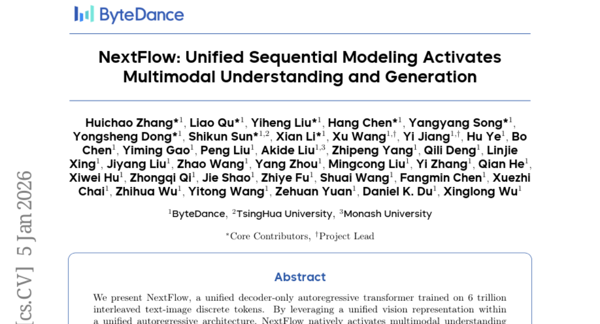
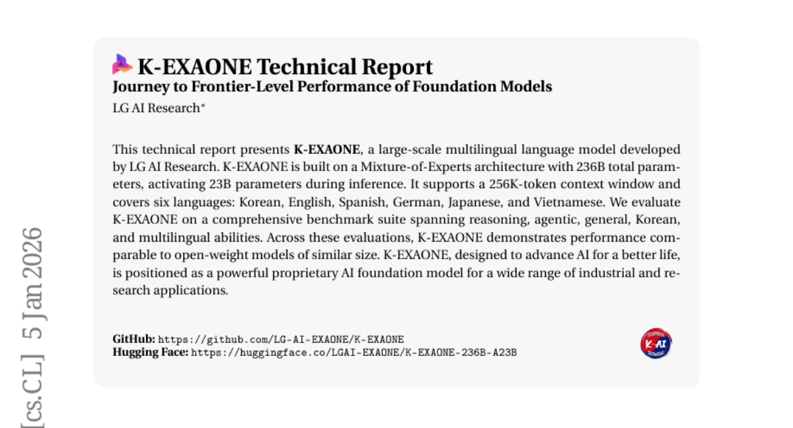
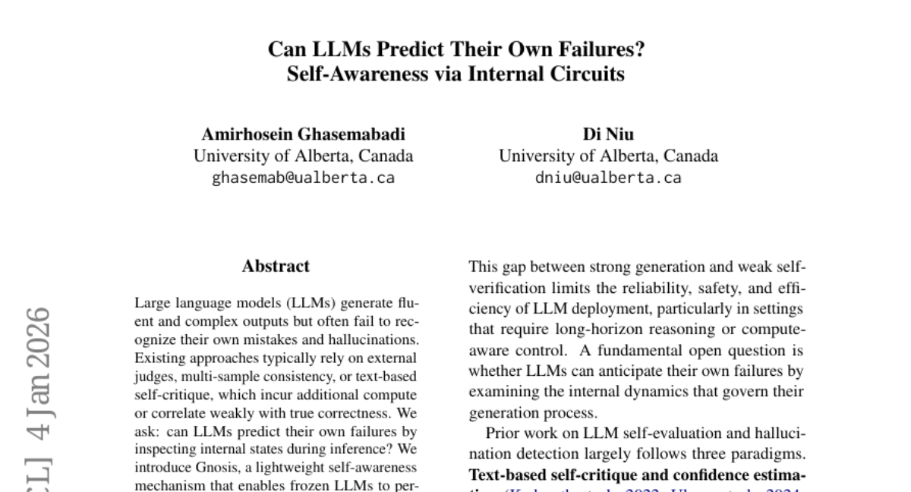
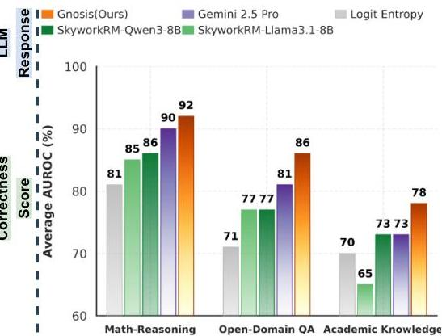
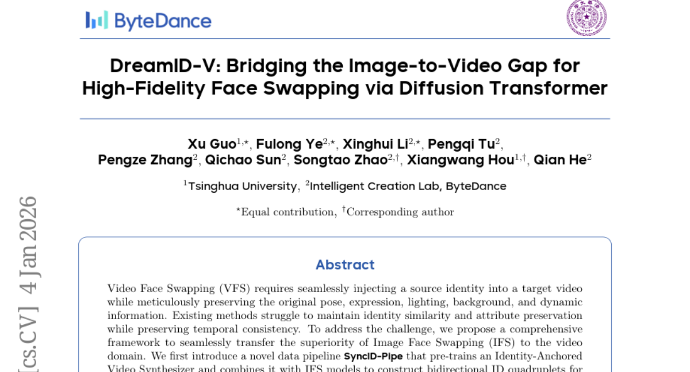
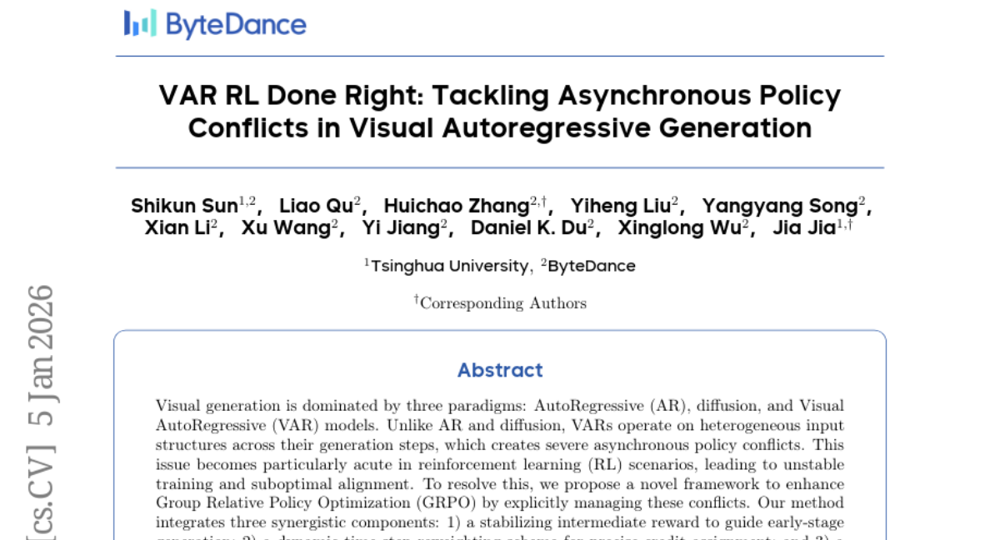

# 2026-01-06 Daily Papers (Top 5)

## 1. [NextFlow: Unified Sequential Modeling Activates Multimodal Understanding and Generation](https://huggingface.co/papers/2601.02204)
**Upvotes**: 44

### 📌 요약
NextFlow는 텍스트-이미지 6조 토큰으로 학습된 통합 자기회귀 모델로, 기존의 래스터 스캔 방식 대신 '다음 스케일 예측'을 도입하여 멀티모달 이해 및 생성 능력을 활성화하고 고속 이미지 생성을 가능하게 합니다.

### 📝 초록 (번역)
제목: NextFlow: 통합 순차 모델링은 멀티모달 이해 및 생성을 활성화합니다.

우리는 6조 개의 교차된(interleaved) 텍스트-이미지 이산 토큰으로 학습된 통합 디코더 전용 자기회귀 트랜스포머인 NextFlow를 제안합니다. NextFlow는 통합된 자기회귀 아키텍처 내에서 통합된 시각 표현을 활용함으로써, 이미지 편집, 교차된 콘텐츠 및 비디오 생성 능력을 포함한 멀티모달 이해 및 생성 기능을 기본적으로 활성화합니다. 텍스트는 엄격하게 순차적이고 이미지는 본질적으로 계층적이라는 모달리티의 고유한 특성에 동기를 부여받아, 텍스트에 대해서는 다음 토큰 예측(next-token prediction)을 유지하는 반면 시각적 생성에 대해서는 다음 스케일 예측(next-scale prediction)을 채택했습니다. 이 방식은 기존의 래스터 스캔 방식에서 벗어나 비교 가능한 자기회귀(AR) 모델보다 몇 배 더 빠른 속도인 단 5초 만에 1024x1024 이미지를 생성할 수 있도록 합니다. 우리는 견고한 훈련 레시피를 통해 멀티 스케일 생성의 불안정성을 해결했습니다. 나아가, 우리는 강화 학습을 위한 프리픽스 튜닝(prefix-tuning) 전략을 도입합니다. 실험 결과는 NextFlow가 통합 모델 중에서 최고 수준의 성능(SOTA)을 달성하며, 시각적 품질 측면에서 특화된 확산(diffusion) 모델 기준선과 경쟁함을 입증합니다.

### 🔑 핵심 포인트
- 6조 개의 텍스트-이미지 이산 토큰으로 학습된 통합 디코더 전용 자기회귀(AR) 모델로, 멀티모달 이해 및 생성(이미지 편집, 비디오 생성 등)을 기본적으로 지원합니다.
- 텍스트에는 다음 토큰 예측을, 이미지에는 계층적인 특성을 반영한 '다음 스케일 예측'을 적용하여 기존 래스터 스캔 방식보다 월등히 빠른 생성 속도를 달성합니다.
- 1024x1024 고해상도 이미지를 단 5초 만에 생성하며, 통합 모델 중 최고 성능을 달성함과 동시에 시각적 품질 면에서는 특화된 확산 모델과 동등한 수준에 도달합니다.

---

## 2. [K-EXAONE Technical Report](https://huggingface.co/papers/2601.01739)
**Upvotes**: 44

### 📌 요약
LG AI 리서치가 개발한 K-EXAONE은 총 2,360억 개의 매개변수를 가진 MoE 기반의 대규모 다국어 언어 모델로, 256K 토큰 컨텍스트를 지원하며 유사 규모의 공개 모델과 견줄 만한 성능을 보입니다.

### 📝 초록 (번역)
본 기술 보고서는 LG AI 리서치가 개발한 대규모 다국어 언어 모델인 K-EXAONE을 소개합니다. K-EXAONE은 총 2,360억 개의 매개변수(파라미터)를 가지며 추론 시 230억 개의 매개변수가 활성화되는 MoE(Mixture-of-Experts) 아키텍처를 기반으로 구축되었습니다. 이 모델은 256K 토큰의 컨텍스트 창(Context Window)을 지원하며, 한국어, 영어, 스페인어, 독일어, 일본어, 베트남어 등 6개 언어를 지원합니다. 우리는 추론, 에이전트 능력, 일반 능력, 한국어 능력, 다국어 능력을 아우르는 포괄적인 벤치마크 스위트에서 K-EXAONE을 평가했습니다. 이러한 평가 전반에서 K-EXAONE은 유사 규모의 공개 가중치(Open-weight) 모델과 비교할 만한 성능을 보여줍니다. '더 나은 삶을 위한 AI 발전'을 목표로 설계된 K-EXAONE은 광범위한 산업 및 연구 애플리케이션을 위한 강력한 독점적(Proprietary) AI 파운데이션 모델로 자리매김하고 있습니다.

### 🔑 핵심 포인트
- MoE(Mixture-of-Experts) 아키텍처를 기반으로 하며, 총 2,360억 개의 매개변수 중 추론 시 230억 개가 활성화되는 효율적인 대규모 모델임.
- 256K 토큰의 장문 컨텍스트 창을 지원하고, 한국어를 포함하여 영어, 스페인어, 독일어, 일본어, 베트남어 등 총 6개 언어를 지원하는 다국어 모델임.
- 추론 및 에이전트 능력을 포함한 종합 벤치마크 평가에서 유사 규모의 공개 모델과 필적하는 성능을 보였으며, 산업 및 연구용 독점 AI 파운데이션 모델로 활용될 예정임.

---

## 3. [Can LLMs Predict Their Own Failures? Self-Awareness via Internal Circuits](https://huggingface.co/papers/2512.20578)
**Upvotes**: 40

### 📌 요약
LLM이 내부 회로 신호를 분석해 자신의 오류를 예측할 수 있도록 돕는 경량 자기 인식 메커니즘 'Gnosis'를 제안하며, 이는 외부 개입 없이도 높은 정확도와 효율성을 보인다.

### 📝 초록 (번역)
대규모 언어 모델(LLM)은 유창하고 복잡한 출력을 생성하지만, 종종 자신의 실수와 환각을 인식하는 데 실패합니다. 기존 접근 방식은 일반적으로 외부 평가자, 다중 샘플 일관성 또는 텍스트 기반 자기 비판에 의존하는데, 이는 추가적인 계산 비용을 발생시키거나 실제 정확도와의 상관관계가 낮습니다. 우리는 질문합니다: LLM이 추론 과정 중 내부 상태를 검사하여 자신의 실패를 예측할 수 있을까요? 우리는 고정된(frozen) LLM이 은닉 상태(hidden states)와 어텐션 패턴으로부터 신호를 해독하여 본질적인 자체 검증을 수행할 수 있도록 하는 경량 자기 인식 메커니즘인 Gnosis를 소개합니다. Gnosis는 내부 흔적을 수동적으로 관찰하고, 이를 고정된 예산의 서술자로 압축하며, 단지 약 500만 개의 매개변수만 추가하고 시퀀스 길이에 독립적으로 작동하여 무시해도 될 만한 추론 비용으로 정확성을 예측합니다. Gnosis는 수학적 추론, 개방형 질문 답변, 학술 지식 벤치마크 전반과 17억 개에서 200억 개의 매개변수에 이르는 고정된 백본 모델에서, 정확도와 보정(calibration) 측면 모두에서 강력한 내부 기준선 및 대규모 외부 평가자를 지속적으로 능가합니다. 더욱이, Gnosis는 부분 생성에 대해 제로 샷 일반화가 가능하여 실패하는 경로를 조기에 감지하고 계산 효율적인 제어를 가능하게 합니다. 이러한 결과는 신뢰할 수 있는 정확성 단서가 생성 프로세스에 본질적으로 내재되어 있으며 외부 감독 없이도 효율적으로 추출될 수 있음을 보여줍니다.

### 🔑 핵심 포인트
- LLM의 오류 예측을 위해 은닉 상태(hidden states)와 어텐션 패턴 같은 내부 신호를 분석하는 경량 자기 인식 메커니즘 'Gnosis'를 도입했다.
- Gnosis는 약 500만 개의 매개변수만을 추가하고 시퀀스 길이에 독립적으로 작동하여, 기존 방법론과 달리 추론 시 무시해도 될 만큼 적은 계산 비용을 발생시킨다.
- 수학 추론, QA 등 다양한 벤치마크에서 강력한 내부 및 대규모 외부 기준선을 일관되게 능가했으며, 부분 생성에 대한 제로 샷 일반화 능력을 통해 실패 경로를 조기에 감지할 수 있다.
### 🖼️ 추가 자료

---

## 4. [DreamID-V:Bridging the Image-to-Video Gap for High-Fidelity Face Swapping via Diffusion Transformer](https://huggingface.co/papers/2601.01425)
**Upvotes**: 33

### 📌 요약
DreamID-V는 이미지 얼굴 교체(IFS)의 강점을 비디오 도메인으로 확장하기 위해, SyncID-Pipe를 통해 학습된 양방향 ID 사중쌍과 확산 트랜스포머를 결합하여 높은 현실감과 시간적 일관성을 달성한 비디오 얼굴 교체 프레임워크입니다.

### 📝 초록 (번역)
비디오 얼굴 교체(VFS)는 원본의 포즈, 표정, 조명, 배경 및 동적 정보를 세밀하게 보존하면서 소스 아이덴티티(Source identity)를 타겟 비디오에 자연스럽게 주입하는 것을 요구합니다. 기존 방법론들은 시간적 일관성을 유지하면서 아이덴티티 유사성과 속성 보존을 달성하는 데 어려움을 겪습니다. 이러한 문제를 해결하기 위해, 우리는 이미지 얼굴 교체(IFS)의 우수성을 비디오 도메인으로 매끄럽게 이전하는 포괄적인 프레임워크를 제안합니다. 우리는 먼저 Identity-Anchored Video Synthesizer를 사전 학습하고 이를 IFS 모델과 결합하여 명시적인 지도 학습을 위한 양방향 ID 사중쌍(bidirectional ID quadruplets)을 구축하는 새로운 데이터 파이프라인인 SyncID-Pipe를 소개합니다. 이 쌍을 이루는 데이터를 기반으로, 우리는 핵심적인 Modality-Aware Conditioning 모듈을 채택하여 멀티 모달 조건들을 식별적으로 주입하는 최초의 확산 트랜스포머 기반 프레임워크인 DreamID-V를 제안합니다. 동시에, 우리는 어려운 시나리오에서도 시각적 현실감과 아이덴티티 일관성을 강화하기 위해 Synthetic-to-Real 커리큘럼 메커니즘과 Identity-Coherence 강화 학습 전략을 제안합니다. 제한된 벤치마크 문제를 해결하기 위해, 우리는 다양한 장면을 포괄하는 포괄적인 벤치마크인 IDBench-V를 소개합니다. 광범위한 실험들은 DreamID-V가 최신 기술들을 능가하며, 다양한 교체 관련 작업에 매끄럽게 적용될 수 있는 뛰어난 다재다능함을 보여줍니다.

### 🔑 핵심 포인트
- 명시적인 지도 학습을 위해 IFS 모델과 결합된 Identity-Anchored Video Synthesizer 기반의 새로운 데이터 파이프라인 SyncID-Pipe를 도입하여 이미지-비디오 간의 간극을 연결합니다.
- 멀티 모달 조건을 식별적으로 주입하는 Modality-Aware Conditioning 모듈을 핵심으로 사용하는, 비디오 얼굴 교체(VFS)를 위한 최초의 확산 트랜스포머(Diffusion Transformer) 기반 프레임워크 DreamID-V를 제안합니다.
- 시각적 현실감을 높이는 Synthetic-to-Real 커리큘럼 메커니즘과 아이덴티티 일관성을 위한 Identity-Coherence 강화 학습 전략을 도입하고, 포괄적인 VFS 벤치마크인 IDBench-V를 제시합니다.

---

## 5. [VAR RL Done Right: Tackling Asynchronous Policy Conflicts in Visual Autoregressive Generation](https://huggingface.co/papers/2601.02256)
**Upvotes**: 27

### 📌 요약
시각적 자기회귀 생성(VAR) 모델의 비동기적 정책 충돌을 해결하고 강화 학습(RL) 성능을 안정화하기 위해, 중간 보상, 동적 시간 가중치, 마스크 전파를 결합한 새로운 프레임워크를 제안한다.

### 📝 초록 (번역)
시각적 생성은 자기회귀(AR), 확산(diffusion), 시각적 자기회귀(VAR) 모델의 세 가지 패러다임이 주도하고 있습니다. AR 및 확산 모델과 달리, VAR 모델은 생성 단계 전반에 걸쳐 이질적인 입력 구조로 작동하며, 이는 심각한 비동기적 정책 충돌(asynchronous policy conflicts)을 야기합니다. 이 문제는 강화 학습(RL) 환경에서 특히 심화되어 불안정한 학습과 최적화 수준 이하의 정렬(alignment)을 초래합니다. 이를 해결하기 위해, 우리는 이러한 충돌을 명시적으로 관리하여 그룹 상대 정책 최적화(GRPO)를 강화하는 새로운 프레임워크를 제안합니다. 우리의 방법은 세 가지 시너지 효과를 내는 구성 요소를 통합합니다: 1) 초기 단계 생성을 안내하는 안정화 중간 보상(intermediate reward); 2) 정확한 신용 할당(credit assignment)을 위한 동적 시간 단계 재가중치 부여(reweighting) 방안; 그리고 3) 보상 피드백 학습(ReFL) 원리에서 파생되었으며, 공간적 및 시간적으로 최적화 효과를 격리하도록 설계된 새로운 마스크 전파 알고리즘. 우리의 접근 방식은 기존 GRPO 기준선 대비 샘플 품질과 목표 정렬에서 상당한 개선을 보여주며, VAR 모델을 위한 강력하고 효과적인 최적화를 가능하게 합니다.

### 🔑 핵심 포인트
- 시각적 자기회귀(VAR) 모델의 이질적인 입력 구조에서 발생하는 고질적인 비동기적 정책 충돌 문제를 강화 학습(RL) 환경에서 해결하는 것을 목표로 한다.
- 충돌 관리를 명시적으로 수행하여 기존 그룹 상대 정책 최적화(GRPO)의 안정성과 효율성을 대폭 향상시키는 새로운 RL 프레임워크를 제안한다.
- 새로운 프레임워크는 초기 단계 생성을 위한 안정화 중간 보상, 정밀한 신용 할당을 위한 동적 시간 재가중치, 최적화 효과 격리를 위한 ReFL 기반 마스크 전파 알고리즘의 세 가지 핵심 요소로 구성된다.

---

