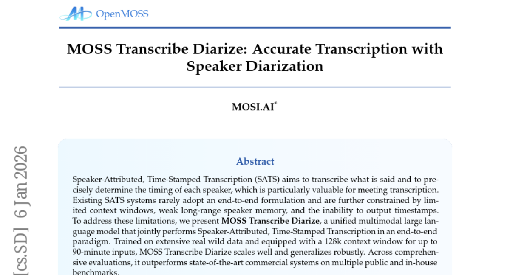
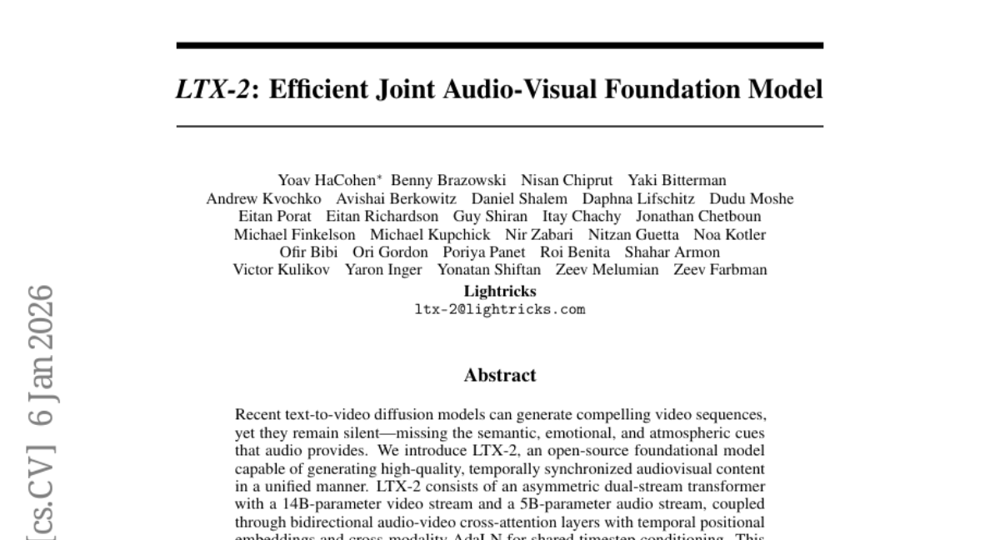
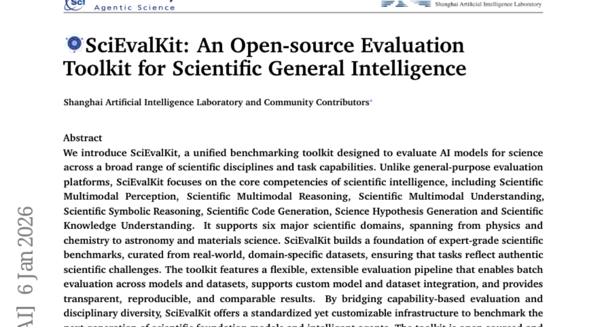
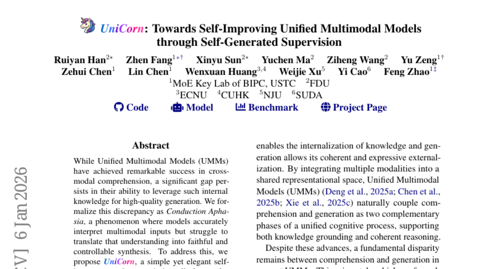

# 2026-01-07 Daily Papers (Top 5)

## 1. [InfiniDepth: Arbitrary-Resolution and Fine-Grained Depth Estimation with Neural Implicit Fields](https://huggingface.co/papers/2601.03252)
**Upvotes**: 71

### 📌 요약
InfiniDepth는 깊이 추정을 위해 신경 암시적 필드를 사용하여 임의 해상도 및 미세 수준의 기하학적 상세 복구를 가능하게 하며, 새로운 4K 벤치마크와 실제 데이터셋에서 최고 수준의 성능을 입증하고 새로운 시점 합성 작업에도 크게 기여합니다.

### 📝 초록 (번역)
기존의 깊이 추정 방법들은 근본적으로 불연속적인 이미지 그리드 상에서 깊이를 예측하도록 제한됩니다. 이러한 표기 방식은 임의의 출력 해상도로 확장하는 것을 어렵게 만들고 기하학적 세부 사항의 복구를 저해합니다. 본 논문은 깊이를 신경 암시적 필드(neural implicit fields)로 표현하는 InfiniDepth를 소개합니다. 단순하지만 효과적인 지역 암시적 디코더(local implicit decoder)를 통해 연속적인 2D 좌표에서 깊이를 질의할 수 있으며, 이는 임의의 해상도 및 미세 수준의 깊이 추정을 가능하게 합니다. 우리의 방법의 역량을 더 잘 평가하기 위해, 풍부한 기하학적 및 외관적 세부 사항을 가진 다양한 장면을 포함하는 다섯 가지 게임에서 고품질의 4K 합성 벤치마크를 선별했습니다. 광범위한 실험은 InfiniDepth가 상대적 깊이 추정 및 메트릭 깊이 추정 작업 모두에서 합성 및 실제 데이터셋 벤치마크에 걸쳐 최고 수준의 성능(SOTA)을 달성함을 보여주며, 특히 미세 세부 영역에서 뛰어난 성능을 발휘합니다. 또한 이는 큰 시점 변화(viewpoint shifts)에서의 새로운 시점 합성(novel view synthesis) 작업에도 이점을 제공하여, 구멍(holes)과 인공물(artifacts)이 적은 고품질 결과를 생성합니다.

### 🔑 핵심 포인트
- 깊이 추정을 위해 기존의 그리드 방식을 탈피하고 깊이를 연속적으로 모델링하는 신경 암시적 필드(Neural Implicit Fields)를 도입했습니다.
- 단순하면서도 효과적인 지역 암시적 디코더를 사용하여 연속적인 2D 좌표에서 깊이를 질의, 임의의 출력 해상도 및 미세 수준의 깊이 추정(fine-grained depth estimation)을 실현했습니다.
- 상대적 및 메트릭 깊이 추정 작업 모두에서 최고 수준의 성능을 달성했으며, 방법론 평가를 위해 기하학적 세부 사항이 풍부한 고품질 4K 합성 벤치마크를 새롭게 구축했습니다.

---

## 2. [MOSS Transcribe Diarize: Accurate Transcription with Speaker Diarization](https://huggingface.co/papers/2601.01554)
**Upvotes**: 45

### 📌 요약
MOSS Transcribe Diarize는 긴 컨텍스트 창과 강력한 장거리 화자 기억력을 활용하여 기존 시스템의 한계를 극복하고, 화자 식별 및 타임스탬프가 부여된 전사(SATS)를 종단 간 방식으로 수행하는 통합 멀티모달 대규모 언어 모델입니다.

### 📝 초록 (번역)
화자 식별 및 타임스탬프가 부여된 전사(SATS: Speaker-Attributed, Time-Stamped Transcription)는 발화 내용을 전사하고 각 화자의 정확한 타이밍을 결정하는 것을 목표로 하며, 이는 회의록 작성에 특히 유용합니다. 기존의 SATS 시스템은 종단 간(end-to-end) 방식을 채택하는 경우가 드물고, 제한적인 컨텍스트 창, 약한 장거리 화자 기억력, 그리고 타임스탬프를 출력할 수 없는 능력에 의해 제약받습니다. 이러한 한계를 해결하기 위해, 우리는 종단 간 패러다임에서 SATS를 공동으로 수행하는 통합 멀티모달 대규모 언어 모델인 MOSS Transcribe Diarize를 제시합니다. 방대한 실제 야생 데이터로 훈련되었으며 최대 90분 입력에 대해 128k 컨텍스트 창을 갖춘 MOSS Transcribe Diarize는 확장성이 뛰어나고 견고하게 일반화됩니다. 포괄적인 평가 전반에 걸쳐, 이 모델은 다수의 공용 및 자체 벤치마크에서 최신 상용 시스템보다 우수한 성능을 보입니다.

### 🔑 핵심 포인트
- 화자 식별 및 타임스탬프가 부여된 전사(SATS) 작업을 종단 간(end-to-end) 방식으로 공동 수행하는 통합 멀티모달 대규모 언어 모델(LLM)이다.
- 최대 90분 분량의 입력을 처리할 수 있는 128k 컨텍스트 창을 갖추어 제한적인 컨텍스트 및 약한 장거리 화자 기억력이라는 기존 시스템의 고질적인 문제를 해결했다.
- 다수의 공용 및 자체 벤치마크에 대한 포괄적인 평가에서 기존의 최신 상용 시스템들보다 우수한 성능을 입증했다.

---

## 3. [LTX-2: Efficient Joint Audio-Visual Foundation Model](https://huggingface.co/papers/2601.03233)
**Upvotes**: 38

### 📌 요약
LTX-2는 비대칭 이중 스트림 트랜스포머 구조를 사용하여 고품질의 시간적으로 동기화된 시청각 콘텐츠를 효율적으로 생성하는 오픈 소스 기반 모델입니다.

### 📝 초록 (번역)
최근의 텍스트-투-비디오 확산 모델은 매력적인 비디오 시퀀스를 생성할 수 있지만, 오디오가 제공하는 의미론적, 감정적, 분위기적 단서가 누락된 채 무음 상태로 남아 있습니다. 우리는 고품질의 시간적으로 동기화된 시청각 콘텐츠를 통합된 방식으로 생성할 수 있는 오픈 소스 기반 모델인 LTX-2를 소개합니다. LTX-2는 140억 개의 매개변수를 가진 비디오 스트림과 50억 개의 매개변수를 가진 오디오 스트림으로 구성된 비대칭 이중 스트림 트랜스포머로 이루어져 있으며, 시간적 위치 임베딩(temporal positional embeddings)과 공유 타임스텝 조건화를 위한 교차 양식 AdaLN(cross-modality AdaLN)을 갖춘 양방향 오디오-비디오 교차 주의 레이어를 통해 연결됩니다. 이 아키텍처는 오디오 생성보다 비디오 생성에 더 많은 용량(capacity)을 할당하여, 통합된 시청각 모델의 효율적인 훈련 및 추론을 가능하게 합니다. 우리는 더 넓은 프롬프트 이해를 위해 다국어 텍스트 인코더를 사용하며, 향상된 시청각 정렬(alignment) 및 제어 가능성을 위해 양식 인식 분류자 없는 안내(modality-aware classifier-free guidance, modality-CFG) 메커니즘을 도입합니다. LTX-2는 단순히 음성 생성에 그치지 않고, 각 장면의 캐릭터, 환경, 스타일 및 감정에 따라 자연스러운 배경음과 폴리(foley) 요소가 포함된 풍부하고 일관성 있는 오디오 트랙을 생성합니다. 평가 결과, 이 모델은 오픈 소스 시스템 중 최고 수준의 시청각 품질과 프롬프트 준수도를 달성했으며, 독점 모델 대비 훨씬 적은 계산 비용과 추론 시간으로도 유사한 결과를 제공합니다. 모든 모델 가중치와 코드는 공개적으로 배포됩니다.

### 🔑 핵심 포인트
- 비디오(140억 개)와 오디오(50억 개)에 비대칭적으로 용량을 할당한 이중 스트림 트랜스포머 구조를 채택했으며, 양방향 교차 주의(cross-attention)와 교차 양식 AdaLN을 통해 시청각 스트림을 효율적으로 통합했습니다.
- 음성 외에도 장면의 환경, 캐릭터, 감정 및 스타일에 맞는 배경음과 폴리(foley) 요소를 포함하는 풍부하고 일관성 있는 오디오 트랙을 생성하며, 양식 인식 CFG(modality-CFG)를 통해 시청각 정렬 및 제어 가능성을 높였습니다.
- 오픈 소스 시스템 중 최고 수준의 시청각 품질과 프롬프트 준수도를 달성했으며, 독점 모델 대비 낮은 계산 비용과 추론 시간으로도 유사한 성능을 보이며, 모든 모델 가중치와 코드를 공개했습니다.

---

## 4. [SciEvalKit: An Open-source Evaluation Toolkit for Scientific General Intelligence](https://huggingface.co/papers/2512.22334)
**Upvotes**: 28

### 📌 요약
SciEvalKit은 물리학부터 재료과학까지 광범위한 분야와 과학적 멀티모달 추론, 코드 생성 등 핵심 역량을 포괄하여 과학적 일반 지능(Scientific General Intelligence)을 평가하도록 설계된 오픈 소스 통합 벤치마킹 툴킷입니다.

### 📝 초록 (번역)
저희는 광범위한 과학 분야와 태스크 역량 전반에 걸쳐 AI 모델을 평가하기 위해 설계된 통합 벤치마킹 툴킷인 SciEvalKit을 소개합니다. 일반적인 평가 플랫폼과 달리, SciEvalKit은 과학적 멀티모달 인식, 과학적 멀티모달 추론, 과학적 멀티모달 이해, 과학적 기호 추론, 과학 코드 생성, 과학 가설 생성, 과학 지식 이해를 포함한 과학 지능의 핵심 역량에 중점을 둡니다. 이 툴킷은 물리학, 화학부터 천문학, 재료 과학에 이르기까지 6가지 주요 과학 도메인을 지원합니다. SciEvalKit은 실제 세계의 도메인별 데이터셋으로부터 선별된 전문가 수준의 과학 벤치마크 기반을 구축하여, 태스크들이 실제 과학적 난제를 반영하도록 보장합니다. 이 툴킷은 모델 및 데이터셋 전반에 걸친 일괄 평가를 가능하게 하고, 사용자 지정 모델 및 데이터셋 통합을 지원하며, 투명하고 재현 가능하며 비교 가능한 결과를 제공하는 유연하고 확장 가능한 평가 파이프라인을 특징으로 합니다. 역량 기반 평가와 학제적 다양성을 연결함으로써, SciEvalKit은 차세대 과학 파운데이션 모델 및 지능형 에이전트를 벤치마킹하기 위한 표준화되면서도 맞춤 설정 가능한 인프라를 제공합니다. 이 툴킷은 AI4Science 분야에서 커뮤니티 주도 개발 및 발전을 촉진하기 위해 오픈 소스로 공개되었으며 활발하게 유지 관리됩니다.

### 🔑 핵심 포인트
- 일반 평가 플랫폼과 달리, 과학적 멀티모달 추론, 과학 코드 생성, 가설 생성 등 과학적 일반 지능의 핵심 역량에 초점을 맞춥니다.
- 물리학, 화학, 천문학, 재료 과학 등 6가지 주요 과학 도메인을 지원하며, 실제 도메인별 데이터셋 기반의 전문가급 벤치마크를 제공합니다.
- 유연하고 확장 가능한 평가 파이프라인을 통해 투명하고 재현 가능한 배치(batch) 평가 결과를 제공하며, 오픈 소스로서 AI4Science 커뮤니티의 발전을 촉진합니다.

---

## 5. [UniCorn: Towards Self-Improving Unified Multimodal Models through Self-Generated Supervision](https://huggingface.co/papers/2601.03193)
**Upvotes**: 24

### 📌 요약
UniCorn은 멀티모달 모델의 높은 이해도를 고품질 생성 능력으로 전환하지 못하는 '전도성 실어증' 문제를 해결하기 위해, 외부 데이터 없이 단일 모델의 자체 플레이를 통해 지도 데이터를 생성하고 성능을 혁신적으로 개선하는 자가 개선 프레임워크이다.

### 📝 초록 (번역)
통합 멀티모달 모델(UMMs)이 교차 모달 이해(cross-modal comprehension)에서 놀라운 성공을 거두었지만, 이러한 내부 지식을 고품질 생성에 활용하는 능력에는 상당한 격차가 남아 있습니다. 우리는 이러한 불일치를 '전도성 실어증(Conduction Aphasia)'으로 공식화하는데, 이는 모델이 멀티모달 입력을 정확하게 해석하지만 그 이해를 충실하고 제어 가능한 합성으로 전환하는 데 어려움을 겪는 현상입니다. 이를 해결하기 위해, 우리는 외부 데이터나 교사 지도(teacher supervision)가 필요 없는 간단하면서도 우아한 자가 개선 프레임워크인 UniCorn을 제안합니다. UniCorn은 단일 UMM을 Proposer, Solver, Judge라는 세 가지 협력 역할로 분할함으로써 자체 플레이(self-play)를 통해 고품질 상호 작용을 생성하고, 인지 패턴 재구성(cognitive pattern reconstruction)을 사용하여 잠재된 이해를 명시적인 생성 신호로 추출합니다. 멀티모달 일관성의 복원을 검증하기 위해, 우리는 '텍스트-이미지-텍스트 재구성 루프'에 기반한 순환 일관성(cycle-consistency) 벤치마크인 UniCycle을 도입합니다. 광범위한 실험 결과, UniCorn은 여섯 가지 일반적인 이미지 생성 벤치마크에서 기본 모델 대비 포괄적이고 상당한 개선을 달성함을 보여주었습니다. 특히, TIIF(73.8), DPG(86.8), CompBench(88.5) 및 UniCycle에서 SOTA 성능을 달성했으며, WISE에서 +5.0, OneIG에서 +6.5의 상당한 추가 개선을 이루었습니다. 이러한 결과는 우리의 방법이 텍스트-투-이미지(T2I) 생성을 크게 향상시키면서도 강력한 이해력을 유지함을 입증하며, 통합 멀티모달 지능을 위한 완전 자가 지도 방식의 정제의 확장 가능성을 보여줍니다.

### 🔑 핵심 포인트
- 멀티모달 모델이 이해 능력을 생성 능력으로 전환하지 못하는 현상을 '전도성 실어증(Conduction Aphasia)'으로 정의하고, 이를 해결하기 위한 자가 개선 프레임워크 UniCorn을 제안한다.
- UniCorn은 외부 데이터나 교사 지도 없이 단일 UMM을 Proposer, Solver, Judge 세 역할로 분할하여 자체 플레이를 통해 고품질 상호 작용과 생성 신호를 추출하는 자가 지도 방식을 채택한다.
- 새로운 순환 일관성 벤치마크 UniCycle을 도입하였으며, UniCorn은 TIIF, DPG, CompBench 등 6개의 주요 이미지 생성 벤치마크에서 SOTA 성능을 포함하여 기존 모델 대비 포괄적이고 상당한 성능 향상을 달성했다.

---

