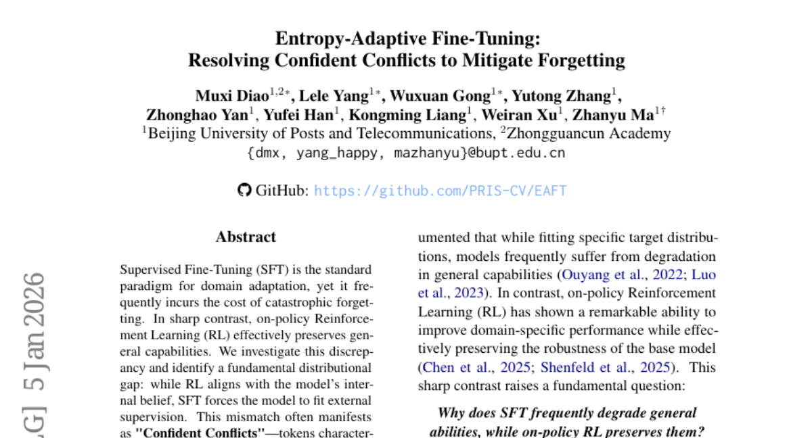
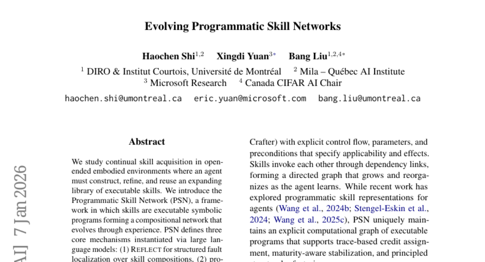
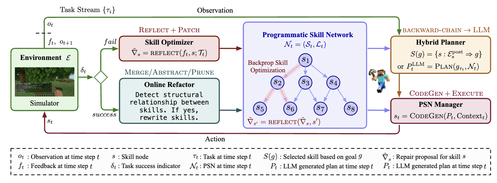
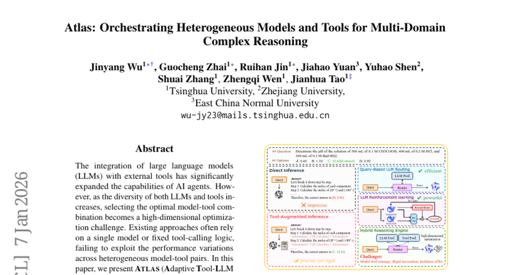
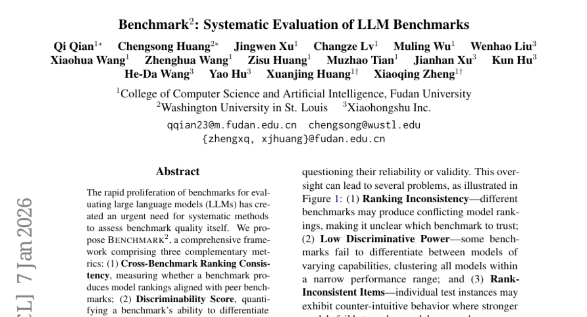
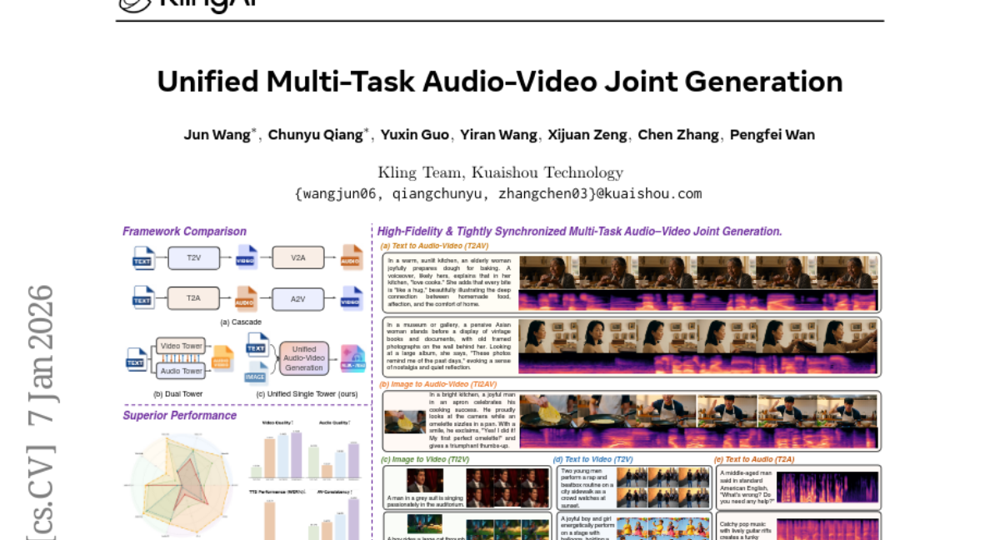

# 2026-01-08 Daily Papers (Top 5)

## 1. [Entropy-Adaptive Fine-Tuning: Resolving Confident Conflicts to Mitigate Forgetting](https://huggingface.co/papers/2601.02151)
**Upvotes**: 63

### 📌 요약
SFT의 치명적 망각 문제를 해결하기 위해, 본 연구는 모델의 높은 확신과 정답 간의 불일치(Confident Conflicts)를 토큰 수준 엔트로피를 이용해 식별하고, 이를 적응적으로 조정하는 엔트로피 적응형 미세 조정(EAFT)을 제안하여 일반 능력을 효과적으로 보존한다.

### 📝 초록 (번역)
지도 학습 기반 미세 조정(SFT)은 도메인 적응을 위한 표준 패러다임이지만, 빈번하게 치명적인 망각(catastrophic forgetting)이라는 대가를 치르게 합니다. 이와는 극명하게 대조적으로, 온-폴리시(on-policy) 강화 학습(RL)은 일반적인 능력을 효과적으로 보존합니다. 우리는 이러한 불일치를 조사하여 근본적인 분포 격차를 확인했습니다. 즉, RL은 모델의 내부 신념과 일치하는 반면, SFT는 모델이 외부의 지도 정보를 따르도록 강제합니다. 이러한 불일치는 종종 낮은 확률과 낮은 엔트로피를 특징으로 하는 '확신 충돌(Confident Conflicts)' 토큰으로 나타납니다. 이 경우, 모델은 자신의 예측에 매우 확신하지만, 이와 상이한 정답을 학습하도록 강요받아 파괴적인 경사 하강 업데이트를 유발합니다. 이를 해결하기 위해, 우리는 엔트로피 적응형 미세 조정(EAFT)을 제안합니다. EAFT는 단순히 예측 확률에만 의존하는 방법과 달리, 토큰 수준의 엔트로피를 게이팅 메커니즘으로 활용하여 인식론적 불확실성(epistemic uncertainty)과 지식 충돌(knowledge conflict)을 구별합니다. 이를 통해 모델은 불확실한 샘플로부터는 학습할 수 있게 하면서도 충돌하는 데이터에 대한 경사 하강을 억제합니다. 4B에서 32B 매개변수 범위의 Qwen 및 GLM 시리즈 모델을 수학, 의료, 에이전트 도메인에 걸쳐 수행한 광범위한 실험은 우리의 가설을 뒷받침합니다. EAFT는 표준 SFT와 동일한 다운스트림 성능을 달성하면서도 일반적인 능력의 저하를 크게 완화함을 일관되게 보여줍니다.

### 🔑 핵심 포인트
- SFT(지도 학습 기반 미세 조정)가 치명적 망각을 유발하는 이유는 RL(강화 학습)과 달리 외부 지도 정보를 따르도록 강제하여 모델의 내부 신념 분포와 근본적인 격차를 만들기 때문이다.
- 이러한 분포 불일치는 낮은 예측 확률과 낮은 엔트로피를 동시에 보이는 '확신 충돌(Confident Conflicts)' 토큰으로 구체화되며, 이는 모델의 강력한 확신에 반하는 정답을 학습하게 하여 파괴적인 경사 하강 업데이트를 촉발한다.
- 제안된 EAFT(엔트로피 적응형 미세 조정)는 토큰 수준 엔트로피를 게이팅 메커니즘으로 활용하여 학습이 필요한 인식론적 불확실성(epistemic uncertainty)과 경사 하강을 억제해야 할 지식 충돌을 구분하며, 이를 통해 SFT 성능을 유지하면서 일반 능력을 효과적으로 보존한다.

---

## 2. [Evolving Programmatic Skill Networks](https://huggingface.co/papers/2601.03509)
**Upvotes**: 51

### 📌 요약
PSN은 LLM을 기반으로 심볼릭 프로그램 형태의 기술 네트워크를 진화시켜 개방형 환경에서 지속적인 기술 습득, 효율적인 재사용 및 강력한 일반화를 가능하게 하는 프레임워크이다.

### 📝 초록 (번역)
우리는 에이전트가 확장 가능한 실행 가능한 기술 라이브러리를 구축하고, 정제하며, 재사용해야 하는 개방형 체화 환경에서의 지속적인 기술 습득을 연구합니다. 우리는 경험을 통해 진화하는 구성적 네트워크를 형성하는 실행 가능한 심볼릭 프로그램으로서의 기술을 정의하는 프로그램 기술 네트워크(PSN, Programmatic Skill Network)를 소개합니다. PSN은 대규모 언어 모델(LLM)을 통해 구현되는 세 가지 핵심 메커니즘을 정의합니다: (1) 기술 구성 요소에 대한 구조화된 오류 위치 파악을 위한 REFLECT, (2) 불확실한 기술에 대한 가소성(plasticity)을 유지하면서 신뢰할 수 있는 기술을 안정화시키는 성숙도 인식 업데이트 게이팅을 갖춘 점진적 최적화, 그리고 (3) 네트워크 압축성을 유지하는 롤백 검증 기반의 표준 구조적 리팩토링입니다. 나아가 우리는 PSN의 학습 역학이 신경망 학습과 구조적으로 유사하다는 것을 보여줍니다. MineDojo와 Crafter에서의 실험은 개방형 작업 분포 전반에서 견고한 기술 재사용, 빠른 적응, 그리고 강력한 일반화 능력을 입증합니다.

### 🔑 핵심 포인트
- PSN은 LLM을 활용하여 기술을 실행 가능한 심볼릭 프로그램으로 정의하고, 경험을 통해 지속적으로 진화하는 구성적 기술 네트워크를 구축하는 프레임워크이다.
- 핵심 메커니즘으로는 기술 구성 요소의 오류를 체계적으로 파악하는 REFLECT, 신뢰도에 따라 업데이트를 조절하는 성숙도 인식 게이팅(Maturity-aware Update Gating) 기반의 점진적 최적화가 있다.
- 이 프레임워크는 롤백 검증을 통한 표준 구조적 리팩토링을 통해 네트워크의 압축성을 유지하며, 복잡한 MineDojo 및 Crafter 환경에서 우수한 기술 재사용 및 일반화 성능을 보인다.
### 🖼️ 추가 자료

---

## 3. [Atlas: Orchestrating Heterogeneous Models and Tools for Multi-Domain Complex Reasoning](https://huggingface.co/papers/2601.03872)
**Upvotes**: 30

### 📌 요약
ATLAS는 이질적인 LLM과 도구를 동적으로 조합하는 이중 경로 라우팅 프레임워크로, GPT-4o를 능가하며 복합 추론 작업에서 기존 라우팅 방식보다 높은 성능을 달성합니다.

### 📝 초록 (번역)
대규모 언어 모델(LLM)과 외부 도구의 통합은 AI 에이전트의 역량을 크게 확장했습니다. 그러나 LLM과 도구의 다양성이 증가함에 따라 최적의 모델-도구 조합을 선택하는 것은 고차원 최적화 과제가 되고 있습니다. 기존 접근 방식은 단일 모델이나 고정된 도구 호출 로직에 의존하여 이질적인 모델-도구 쌍 간의 성능 편차를 효과적으로 활용하지 못했습니다. 본 논문에서는 크로스 도메인 복합 추론에서 동적 도구 사용을 위한 이중 경로 프레임워크인 ATLAS(Adaptive Tool-LLM Alignment and Synergistic Invocation)를 제안합니다. ATLAS는 (1) 도메인별 정렬을 위해 경험적 사전 정보를 활용하는 비학습 클러스터 기반 라우팅과, (2) 분포 외 일반화를 위해 자율적인 궤적을 탐색하는 RL 기반 다단계 라우팅이라는 이중 경로 접근 방식을 통해 작동합니다. 15개 벤치마크에 걸친 광범위한 실험 결과, 우리의 방법은 GPT-4o와 같은 비공개 소스 모델보다 성능이 뛰어나며, 기존 라우팅 방법 대비 분포 내(in-distribution, +10.1%) 및 분포 외(out-of-distribution, +13.1%) 작업 모두에서 우수함을 입증했습니다. 또한, 우리의 프레임워크는 전문화된 멀티모달 도구를 조율함으로써 시각적 추론에서 상당한 성능 향상을 보였습니다.

### 🔑 핵심 포인트
- 이질적인 LLM과 도구의 최적 조합 선택이라는 고차원 최적화 문제를 해결하기 위해 이중 경로(dual-path) 프레임워크인 ATLAS를 제안한다.
- ATLAS는 도메인 특화 정렬을 위한 '비학습 클러스터 기반 라우팅'과 분포 외 일반화를 위한 'RL 기반 다단계 라우팅'이라는 두 경로를 통해 동적인 모델-도구 오케스트레이션을 수행한다.
- 15개 벤치마크 실험 결과, GPT-4o를 능가하며 기존 라우팅 방식 대비 분포 내 작업에서 10.1%, 분포 외 작업에서 13.1%의 성능 향상을 달성했다.

---

## 4. [Benchmark^2: Systematic Evaluation of LLM Benchmarks](https://huggingface.co/papers/2601.03986)
**Upvotes**: 28

### 📌 요약
LLM 벤치마크 자체의 품질을 체계적으로 평가하기 위해 세 가지 보완적인 측정 항목(순위 일관성, 변별력, 역량 정렬 편차)을 포함하는 'Benchmark^2' 프레임워크를 제안하고, 이를 통해 벤치마크의 유효성을 분석합니다.

### 📝 초록 (번역)
대규모 언어 모델(LLM)을 평가하기 위한 벤치마크의 급속한 확산은 벤치마크 자체의 품질을 평가할 체계적인 방법의 시급한 필요성을 낳았습니다. 우리는 세 가지 보완적인 측정 항목으로 구성된 포괄적인 프레임워크인 Benchmark^2를 제안합니다. 이는 (1) 교차 벤치마크 순위 일관성(Cross-Benchmark Ranking Consistency): 해당 벤치마크가 동종 벤치마크와 일치하는 모델 순위를 생성하는지 측정하는 지표, (2) 변별력 점수(Discriminability Score): 벤치마크가 모델 간의 차이를 구별할 수 있는 능력을 정량화하는 지표, 그리고 (3) 역량 정렬 편차(Capability Alignment Deviation): 더 강력한 모델이 실패하지만 더 약한 모델이 성공하는 문제적 사례를 동일 모델군 내에서 식별하는 지표로 구성됩니다. 우리는 수학, 추론 및 지식 영역에 걸친 15개 벤치마크에 대해 광범위한 실험을 수행했으며, 4개 모델군에 걸쳐 11개 LLM을 평가했습니다. 우리의 분석은 기존 벤치마크 간에 상당한 품질 차이가 있음을 밝혀냈으며, 우리의 측정 항목을 기반으로 선별적인 벤치마크 구성을 통해 테스트 세트를 상당히 줄이면서도 유사한 평가 성능을 달성할 수 있음을 입증합니다.

### 🔑 핵심 포인트
- LLM 벤치마크 자체의 품질을 체계적으로 측정하기 위해 교차 벤치마크 순위 일관성, 변별력 점수, 역량 정렬 편차라는 세 가지 지표를 포함하는 'Benchmark^2' 프레임워크가 제시되었습니다.
- 역량 정렬 편차(Capability Alignment Deviation) 지표는 강력한 모델이 실패하고 약한 모델이 성공하는 역설적인 평가 결과를 식별하여 벤치마크의 신뢰도를 측정하는 데 사용됩니다.
- 실험 결과, 기존 벤치마크들의 품질 차이가 크며, 제안된 측정 항목을 활용하여 테스트 세트의 크기를 크게 줄이면서도 동등한 평가 성능을 유지하는 효율적인 벤치마크 구성이 가능함을 확인했습니다.

---

## 5. [Klear: Unified Multi-Task Audio-Video Joint Generation](https://huggingface.co/papers/2601.04151)
**Upvotes**: 9

### 📌 요약
Klear는 단일 타워 구조와 진보적인 다중 작업 훈련을 도입하고 대규모 고품질 데이터를 구축하여, 기존 오디오-비디오 공동 생성의 고질적인 불일치 문제를 해결하고 Veo 3 수준의 성능을 제공하는 통합 생성 모델이다.

### 📝 초록 (번역)
오디오-비디오 공동 생성은 빠르게 발전해 왔지만, 여전히 상당한 과제들이 남아 있습니다. 비상업적인 접근 방식들은 오디오-시각적 비동기화, 낮은 입술-음성 일치(lip-speech alignment), 그리고 단일 모드 성능 저하(unimodal degradation) 문제를 겪고 있으며, 이는 약한 오디오-시각적 대응 모델링, 제한된 일반화 능력, 그리고 희소한 고품질 밀집 캡션 데이터에서 비롯될 수 있습니다. 이러한 문제들을 해결하기 위해, 우리는 Klear를 소개하며 모델 아키텍처, 훈련 전략, 데이터 큐레이션이라는 세 가지 축을 깊이 탐구합니다. 아키텍처적으로는, 통합된 DiT 블록과 Omni-Full Attention 메커니즘을 갖춘 단일 타워 설계를 채택하여, 긴밀한 오디오-시각적 정렬과 강력한 확장성을 달성했습니다. 훈련 측면에서는, 무작위 모달리티 마스킹부터 작업 전반에 걸친 공동 최적화에 이르는 진보적인 멀티태스크 레짐과 다단계 커리큘럼을 채택하여, 견고한 표현 학습, A-V 정렬된 세계 지식 강화, 그리고 단일 모드 붕괴 방지를 이끌어냅니다. 데이터셋의 경우, 밀집 캡션을 포함한 최초의 대규모 오디오-비디오 데이터셋을 제시하며, 수백만 개의 다양하고 고품질이며 엄격하게 정렬된 오디오-비디오-캡션 쌍을 주석 처리하고 필터링하는 새로운 자동 데이터 구성 파이프라인을 도입합니다. 이를 기반으로 Klear는 대규모 데이터셋에 확장되며, 공동 및 단일 모드 설정 모두에서 높은 충실도, 의미적 및 시간적으로 정렬된, 명령을 따르는 생성을 제공하는 동시에 분포 외(out-of-distribution) 시나리오에서도 강력하게 일반화됩니다. Klear는 모든 작업에서 기존 방법론들을 큰 폭으로 능가하며, Veo 3에 필적하는 성능을 달성하여, 차세대 오디오-비디오 합성을 향한 통합되고 확장 가능한 경로를 제시합니다.

### 🔑 핵심 포인트
- 통합 DiT 블록과 Omni-Full Attention을 사용한 단일 타워 아키텍처 설계로 긴밀한 오디오-시각 정렬 및 강력한 확장성 확보.
- 무작위 모달리티 마스킹 및 공동 최적화를 포함하는 진보적인 멀티태스크 훈련 레짐과 다단계 커리큘럼을 통해 A-V 정렬을 강화하고 단일 모드 붕괴를 방지.
- 밀집 캡션(dense captions)이 포함된 최초의 대규모 오디오-비디오 데이터셋을 구축하고, 새로운 자동화 파이프라인으로 고품질의 엄격하게 정렬된 데이터셋을 생성.

---

