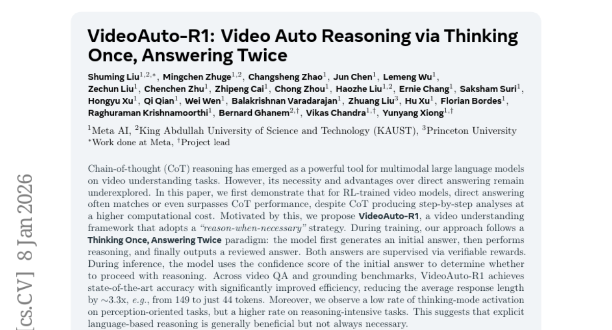
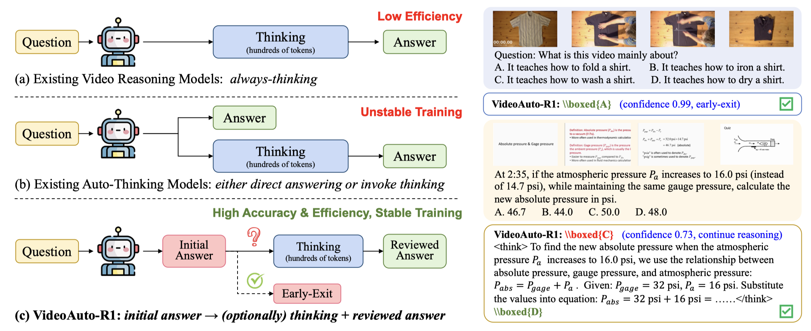

# 2026-01-09 Daily Papers (Top 5)

## 1. [GDPO: Group reward-Decoupled Normalization Policy Optimization for Multi-reward RL Optimization](https://huggingface.co/papers/2601.05242)
**Upvotes**: 135

### 📌 요약
다중 보상 RL 최적화를 위해 제안된 GDPO(그룹 보상 분리 정규화 정책 최적화)는 GRPO의 보상 신호 붕괴 문제를 해결하기 위해 개별 보상 정규화를 분리하여 더 안정적이고 우수한 성능을 달성한다.

### 📝 초록 (번역)
언어 모델의 능력이 향상됨에 따라, 사용자들은 정확한 응답뿐만 아니라 다양한 시나리오에 걸쳐 여러 인간의 선호도에 부합하는 행동을 기대한다. 이를 달성하기 위해, 강화 학습(RL) 파이프라인은 모델을 원하는 행동으로 유도하기 위해 각각 고유한 선호도를 포착하는 다중 보상을 통합하기 시작했다. 그러나 최근 연구들은 다중 보상 설정에서 Group Relative Policy Optimization (GRPO)의 적합성을 검토하지 않은 채 기본적으로 이를 적용해 왔다. 본 논문에서는 상이한 롤아웃 보상 조합에 GRPO를 직접 적용하여 정규화할 경우, 이들이 동일한 이점 값(advantage values)으로 붕괴되어 훈련 신호의 해상도를 감소시키고, 결과적으로 차선책의 수렴과 경우에 따라 조기 훈련 실패를 초래함을 입증한다. 이에 우리는 이러한 문제를 해결하기 위한 새로운 정책 최적화 방법인 Group reward-Decoupled Normalization Policy Optimization (GDPO)를 소개한다. GDPO는 개별 보상의 정규화를 분리함으로써 상대적 차이를 보다 충실히 보존하여, 더 정확한 다중 보상 최적화를 가능하게 하며 훈련 안정성을 상당히 향상시킨다. 우리는 GDPO를 툴 호출, 수학 추론, 코딩 추론 세 가지 태스크에서 GRPO와 비교했으며, 정확성 지표(정확도, 버그 비율)와 제약 조건 준수 지표(형식, 길이)를 모두 평가했다. 모든 설정에서 GDPO는 GRPO보다 일관되게 뛰어난 성능을 보이며, 다중 보상 강화 학습 최적화를 위한 효과성과 일반화 가능성을 입증한다.

### 🔑 핵심 포인트
- 기존의 다중 보상 RL 최적화 기법인 GRPO는 상이한 보상 조합을 정규화할 때 동일한 이점 값으로 붕괴시켜 훈련 신호의 해상도를 떨어뜨리고 수렴을 저해하는 문제가 있다.
- GDPO(그룹 보상 분리 정규화 정책 최적화)는 개별 보상의 정규화를 분리(decoupling)하여 보상 간의 상대적 차이를 정확하게 보존함으로써, 더 정밀한 다중 보상 최적화 및 훈련 안정성 향상을 달성한다.
- GDPO는 툴 호출, 수학 추론, 코딩 추론의 세 가지 주요 태스크에서 정확성 및 제약 조건 준수 지표 모두에서 GRPO 대비 일관되게 우수한 성능을 보여, 다중 보상 RL에서 효과성과 일반성을 입증했다.

---

## 2. [Learnable Multipliers: Freeing the Scale of Language Model Matrix Layers](https://huggingface.co/papers/2601.04890)
**Upvotes**: 36

### 📌 요약
언어 모델 학습 시 가중치 감쇠(WD)로 인해 발생하는 가중치 행렬 크기의 고정된 평형 상태를 해소하기 위해 학습 가능한 행렬 배율(multipliers)을 도입하여 최적의 스케일을 찾고 성능을 크게 개선하는 방법을 제안한다.

### 📝 초록 (번역)
가중치 행렬 레이어에 가중치 감쇠(Weight Decay, WD)를 적용하는 것은 대규모 언어 모델(LLM) 사전 학습에서 표준적인 관행입니다. 선행 연구는 확률적 경사 하강 노이즈가 가중치 행렬 $W$의 브라운 운동과 유사한 팽창을 유발하며, 이는 WD에 의해 상쇄되어 특정 가중치 노름 $||W||$을 가진 WD-노이즈 평형 상태를 형성함을 시사합니다. 본 연구에서는 이 평형 노름을 훈련 절차의 해로운 부산물로 간주하고, 최적의 스케일을 학습하기 위해 학습 가능한 배율(learnable multipliers)을 도입하여 이 문제를 해결합니다. 먼저, 우리는 $W$에 학습 가능한 스칼라 배율을 부착하고 WD-노이즈 평형 노름이 최적이 아님을 확인했습니다. 학습된 스케일은 데이터에 적응하며 성능을 향상시킵니다. 나아가, 개별 행 및 열 노름 또한 유사하게 제약된다고 주장하며, 학습 가능한 행별 및 열별 배율을 도입하여 그 스케일을 해방시킵니다. 우리의 방법은 $\mu P$ 배율의 학습 가능하고 표현력이 더 풍부한 일반화로 볼 수 있습니다. 이 방법은 잘 조정된 $\mu P$ 기준선보다 우수한 성능을 보이며, 배율 튜닝의 계산 오버헤드를 줄이고, 순방향 대칭성(forward-pass symmetries) 및 학습된 배율의 폭 스케일링(width-scaling)과 같은 실질적인 질문들을 제기합니다. 마지막으로, 우리는 Adam과 Muon 옵티마이저 모두에서 학습 가능한 배율을 검증했으며, 그 결과는 Adam에서 Muon으로 전환했을 때와 동일한 수준의 다운스트림 평가 개선을 보여주었습니다.

### 🔑 핵심 포인트
- 기존 훈련 방식에서 가중치 감쇠(WD)와 확률적 경사 노이즈의 상호작용으로 인해 발생하는 가중치 행렬 노름의 고정된 'WD-노이즈 평형 상태'를 성능 저하의 원인으로 규정한다.
- 가중치 행렬 $W$에 학습 가능한 스칼라 배율을 도입하여 전역적인 스케일의 최적화를 입증한 후, 개별 행/열 노름 제약을 해소하기 위해 학습 가능한 행별 및 열별 배율로 일반화하여 적용한다.
- 제안된 학습 가능한 배율 방법은 기존의 $\mu P$ 배율 방식보다 성능이 우수하고 튜닝 오버헤드가 적으며, Adam과 Muon 옵티마이저 모두에서 사용 가능하며 옵티마이저 전환과 동등한 수준의 다운스트림 성능 향상을 달성한다.

---

## 3. [RL-AWB: Deep Reinforcement Learning for Auto White Balance Correction in Low-Light Night-time Scenes](https://huggingface.co/papers/2601.05249)
**Upvotes**: 35

### 📌 요약
이 논문은 통계적 기법과 심층 강화 학습(DRL)을 결합하여 저조도 야간 환경에서 전문가처럼 매개변수를 동적으로 최적화하는 새로운 자동 화이트 밸런스(AWB) 프레임워크인 RL-AWB를 제안합니다.

### 📝 초록 (번역)
저조도 노이즈와 복잡한 조명 조건으로 인해 야간 색상 항상성(color constancy)은 전산 사진학에서 여전히 어려운 문제로 남아있습니다. 저희는 야간 화이트 밸런스를 위해 통계적 방법과 심층 강화 학습을 결합한 새로운 프레임워크인 RL-AWB를 제시합니다. 저희 방법은 야간 장면에 맞춤화된 통계적 알고리즘, 즉 현저한 회색 픽셀 감지(salient gray pixel detection)와 새로운 조명 추정 기법을 통합하는 것부터 시작합니다. 이러한 토대 위에서, 저희는 통계적 알고리즘을 핵심으로 활용하는 색상 항상성을 위한 최초의 심층 강화 학습 접근 방식을 개발했습니다. 이는 전문가 AWB 튜닝 전문가를 모방하여 각 이미지에 대한 매개변수를 동적으로 최적화합니다. 또한, 교차 센서 평가를 용이하게 하기 위해 최초의 멀티 센서 야간 데이터셋을 소개합니다. 실험 결과는 저희 방법이 저조도 및 충분히 조명된 이미지 전반에 걸쳐 우수한 일반화 성능을 달성함을 보여줍니다.

### 🔑 핵심 포인트
- 야간 화이트 밸런스 문제 해결을 위해 통계적 기법과 심층 강화 학습(DRL)을 결합한 'RL-AWB'라는 새로운 프레임워크를 제시합니다.
- RL-AWB는 DRL을 활용하여 통계적 알고리즘의 매개변수를 전문가의 튜닝 방식을 모방하며 이미지별로 동적으로 최적화합니다.
- 최초로 멀티 센서 야간 데이터셋을 구축하여 교차 센서 평가를 가능하게 했으며, 저조도 및 일반 조명 이미지 모두에서 뛰어난 일반화 능력을 입증했습니다.
### 🖼️ 추가 자료

---

## 4. [Token-Level LLM Collaboration via FusionRoute](https://huggingface.co/papers/2601.05106)
**Upvotes**: 30

### 📌 요약
FusionRoute는 라우터가 매 디코딩 단계마다 최적의 전문가를 선택하고 보완 로짓을 추가하여 전문가의 출력을 교정 및 개선함으로써, 기존 토큰 수준 협업의 한계를 극복하고 다양한 벤치마크에서 뛰어난 효율성과 성능을 입증한 멀티 LLM 협업 프레임워크이다.

### 📝 초록 (번역)
대규모 언어 모델(LLM)은 다양한 영역에서 강점을 보입니다. 하지만 단일 범용 모델로 이러한 모든 영역에서 강력한 성능을 달성하려면 훈련 및 배포 비용이 엄청나게 많이 드는 크기로 모델을 확장해야 합니다. 반면, 더 작은 도메인 특화 모델은 훨씬 효율적이지만, 훈련 분포를 넘어서는 일반화에는 어려움을 겪습니다. 이러한 딜레마를 해결하기 위해, 우리는 FusionRoute를 제안합니다. FusionRoute는 경량 라우터가 다음의 두 가지를 동시에 수행하는 견고하고 효과적인 토큰 수준의 멀티 LLM 협업 프레임워크입니다: (i) 각 디코딩 단계에서 가장 적합한 전문가를 선택하고, (ii) 로짓 추가를 통해 선택된 전문가의 다음 토큰 분포를 개선하거나 수정하는 보완적인 로짓을 기여합니다. 고정된 전문가 출력에만 의존하는 기존 토큰 수준 협업 방법과 달리, 우리는 순수한 전문가 전용 라우팅은 근본적으로 한계가 있다는 이론적 분석을 제공합니다. 이는 강력한 전역 커버리지 가정이 충족되지 않는 한 최적의 디코딩 정책을 일반적으로 구현할 수 없기 때문입니다. 훈련 가능한 보완 생성기를 통해 전문가 선택을 보강함으로써, FusionRoute는 효과적인 정책 클래스를 확장하고 온화한 조건 하에서 최적의 가치 함수를 복구할 수 있도록 합니다. 경험적으로, Llama-3 및 Gemma-2 계열과 수학적 추론, 코드 생성 및 명령어 준수를 포괄하는 다양한 벤치마크에서 FusionRoute는 시퀀스 및 토큰 수준 협업, 모델 병합(model merging), 직접 미세 조정(direct fine-tuning)보다 우수한 성능을 보였으며, 각 도메인 특화 작업에서는 해당 전문가들과 경쟁적인 성능을 유지했습니다.

### 🔑 핵심 포인트
- FusionRoute는 토큰 수준에서 최적의 전문가를 선택하는 동시에, 보완적인 로짓을 생성하여 전문가의 다음 토큰 분포를 수정 및 개선하는 멀티 LLM 협업 프레임워크이다.
- 순수 전문가 전용 라우팅이 최적 정책을 달성하는 데 근본적인 한계가 있음을 이론적으로 분석하고, 보완 생성기(Complementary Generator)를 통해 유효 정책 클래스를 확장하여 이 문제를 해결한다.
- 수학적 추론, 코드 생성 등 다양한 벤치마크에서 기존의 시퀀스/토큰 수준 협업, 모델 병합, 직접 미세 조정 방법보다 일관되게 우수한 성능을 달성했다.

---

## 5. [VideoAuto-R1: Video Auto Reasoning via Thinking Once, Answering Twice](https://huggingface.co/papers/2601.05175)
**Upvotes**: 25

### 📌 요약
비디오 이해를 위한 새로운 프레임워크인 VideoAuto-R1은 '한 번 생각하고 두 번 답변하기' 방식을 통해 필요할 때만 추론을 수행하여 최고 수준의 정확도를 유지하면서도 응답 길이를 획기적으로 단축한다.

### 📝 초록 (번역)
CoT(Chain-of-thought) 추론은 비디오 이해 작업을 위한 멀티모달 대규모 언어 모델에 강력한 도구로 등장했습니다. 그러나 직접적인 답변에 비해 CoT의 필요성과 장점은 여전히 충분히 탐구되지 않았습니다. 본 논문은 먼저 RL 학습된 비디오 모델의 경우, CoT가 더 높은 계산 비용으로 단계별 분석을 생성함에도 불구하고, 직접 답변이 CoT 성능과 일치하거나 심지어 능가하는 경우가 많다는 것을 보여줍니다. 이에 동기를 받아, 우리는 필요할 때만 추론하는 전략을 채택한 비디오 이해 프레임워크인 VideoAuto-R1을 제안합니다. 훈련 중에는 우리의 접근 방식은 '한 번 생각하고, 두 번 답변하기(Thinking Once, Answering Twice)' 패러다임을 따릅니다. 즉, 모델이 먼저 초기 답변을 생성하고, 이후 추론을 수행한 다음, 최종적으로 검토된 답변을 출력합니다. 두 답변 모두 검증 가능한 보상을 통해 감독됩니다. 추론 시에는 모델이 초기 답변의 신뢰도 점수를 사용하여 추론을 계속 진행할지 여부를 결정합니다. VideoAuto-R1은 비디오 QA 및 그라운딩 벤치마크 전반에서 최고 수준의 정확도를 달성하며, 평균 응답 길이를 약 3.3배(예: 149 토큰에서 44 토큰으로) 줄여 효율성을 크게 개선했습니다. 또한, 우리는 지각 중심 작업에서는 생각 모드 활성화율이 낮지만, 추론 집약적 작업에서는 더 높은 활성화율을 관찰했습니다. 이는 명시적인 언어 기반 추론이 일반적으로 유익하지만 항상 필요한 것은 아님을 시사합니다.

### 🔑 핵심 포인트
- RL 학습된 비디오 모델에서 직접 답변은 종종 높은 비용이 드는 CoT 추론보다 효율적이며 성능이 비슷하거나 우수했다.
- VideoAuto-R1은 훈련 시 '한 번 생각하고 두 번 답변하기' 패러다임을 사용하며, 추론 시에는 초기 답변의 신뢰도를 기반으로 필요할 때만 추론을 활성화하는 선택적 추론 전략을 취한다.
- 최고 수준의 정확도를 유지하면서 평균 응답 길이를 약 3.3배 단축(예: 149 토큰에서 44 토큰)하여 효율성을 획기적으로 개선했다.
### 🖼️ 추가 자료

---

