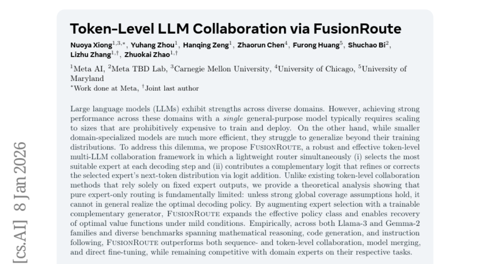

# 2026-01-09 Daily Papers (Top 5)

## 1. [GDPO: Group reward-Decoupled Normalization Policy Optimization for Multi-reward RL Optimization](https://huggingface.co/papers/2601.05242)
**Upvotes**: 117

### 📌 요약
다중 보상 RL 최적화에서 발생하는 기존 GRPO의 훈련 신호 붕괴 문제를 해결하기 위해, 개별 보상 정규화를 분리하여 더 정확하고 안정적인 학습을 가능하게 하는 GDPO(Group reward-Decoupled Normalization Policy Optimization)를 제안한다.

### 📝 초록 (번역)
언어 모델의 역량이 향상됨에 따라, 사용자들은 정확한 응답뿐만 아니라 다양한 시나리오에서 인간의 선호도와 일치하는 행동을 기대합니다. 이를 달성하기 위해, 강화 학습(RL) 파이프라인은 각기 다른 선호도를 포착하는 여러 보상을 통합하여 모델을 원하는 행동으로 유도하고 있습니다. 그러나 최근 연구들은 그 적합성에 대한 검토 없이 다중 보상 설정에서 기본적으로 GRPO(Group Relative Policy Optimization)를 적용해왔습니다. 본 논문에서는 상이한 롤아웃 보상 조합에 GRPO를 직접 적용하여 정규화할 경우, 이들이 동일한 이점 값(advantage values)으로 붕괴되어 훈련 신호의 해상도가 떨어지고, 결과적으로 비최적의 수렴 또는 조기 훈련 실패를 초래함을 입증합니다. 이에 우리는 이러한 문제를 해결하기 위한 새로운 정책 최적화 방법인 GDPO(Group reward-Decoupled Normalization Policy Optimization)를 소개합니다. GDPO는 개별 보상의 정규화를 분리(Decoupling)하여 상대적 차이를 더욱 충실하게 보존하며, 훨씬 향상된 훈련 안정성과 더불어 더욱 정확한 다중 보상 최적화를 가능하게 합니다. 우리는 도구 호출, 수학 추론, 코딩 추론 세 가지 작업에서 GDPO와 GRPO를 비교했으며, 정확성 지표(정확도, 버그 비율)와 제약 조건 준수 지표(형식, 길이)를 모두 평가했습니다. 모든 설정에서 GDPO는 GRPO보다 지속적으로 우수한 성능을 보였으며, 이는 다중 보상 강화 학습 최적화에 대한 GDPO의 효과와 일반성을 입증합니다.

### 🔑 핵심 포인트
- 기존 GRPO를 다중 보상 설정에 적용할 경우, 상이한 보상 조합이 동일한 이점 값으로 붕괴되어 훈련 신호 해상도가 저하되고 학습 실패를 유발하는 문제를 발견했다.
- 이 문제를 해결하기 위해 개별 보상의 정규화를 분리(Decoupling)하여 상대적 차이를 보존하고 훈련 안정성을 높이는 새로운 정책 최적화 방법인 GDPO(Group reward-Decoupled Normalization Policy Optimization)를 제안한다.
- GDPO는 도구 호출, 수학 추론, 코딩 추론 등 세 가지 핵심 LLM 작업에서 정확성 및 제약 조건 준수 지표 모두에서 GRPO 대비 지속적으로 우수한 성능과 일반성을 입증했다.

---

## 2. [Learnable Multipliers: Freeing the Scale of Language Model Matrix Layers](https://huggingface.co/papers/2601.04890)
**Upvotes**: 32

### 📌 요약
가중치 감소(WD)가 유발하는 가중치 행렬의 스케일 제약을 학습 가능한 승수(Learnable Multipliers)를 통해 해소하고 최적의 스케일을 데이터 기반으로 학습하게 하여 모델 성능을 크게 개선했다.

### 📝 초록 (번역)
대규모 언어 모델 사전 학습에서 행렬 레이어에 가중치 감소(Weight Decay, WD)를 적용하는 것은 표준 관행입니다. 선행 연구에 따르면, 확률적 경사 소음(stochastic gradient noise)은 가중치 행렬 W의 브라운 운동과 유사한 확장을 유도하며, 이는 WD에 의해 상쇄되어 특정 가중치 놈(norm) ||W||를 갖는 WD-소음 평형 상태에 도달합니다. 본 연구에서는 이 평형 놈을 훈련 절차의 해로운 부산물로 간주하고, 학습 가능한 승수를 도입하여 최적의 스케일을 학습함으로써 이 문제를 해결합니다. 먼저, W에 학습 가능한 스칼라 승수를 부착하여 WD-소음 평형 놈이 최적이 아님을 확인했습니다. 학습된 스케일은 데이터에 적응하며 성능을 향상시킵니다. 다음으로, 개별 행 및 열의 놈도 유사하게 제약된다고 주장하며, 학습 가능한 행별 및 열별 승수를 도입하여 해당 스케일을 해방시킵니다. 우리의 방법은 muP 승수(multipliers)의 학습 가능하며 더욱 표현력이 풍부한 일반화로 볼 수 있습니다. 이는 잘 조정된 muP 기준선보다 성능이 우수하며, 승수 튜닝의 계산 오버헤드를 줄이고, 순방향 대칭(forward-pass symmetries) 및 학습된 승수의 폭 스케일링(width-scaling)과 같은 실용적인 질문들을 제기합니다. 마지막으로, 우리는 Adam 및 Muon 최적화 프로그램 모두에서 학습 가능한 승수를 검증했으며, 이 방법은 다운스트림 평가에서 Adam에서 Muon으로 전환했을 때와 동일한 수준의 개선을 보여주었습니다.

### 🔑 핵심 포인트
- 가중치 감소(WD)로 인해 발생하는 최적 이하의 평형 놈(equilibrium norm)을 학습 가능한 승수 도입으로 해소하여, 모델이 데이터에 따라 최적의 행렬 스케일을 학습하게 한다.
- 학습 가능한 스칼라 승수에서 더 나아가 행별 및 열별 승수를 도입하여 개별 놈의 스케일을 해방했으며, 이는 muP 승수 방법보다 표현력이 풍부한 일반화이다.
- 학습 가능한 승수는 muP 기준선보다 성능이 우수하며, Adam 및 Muon 최적화 프로그램 모두에서 유효함을 입증했고, 그 성능 개선 효과는 Adam에서 Muon으로 전환할 때의 개선 효과와 맞먹는다.

---

## 3. [RL-AWB: Deep Reinforcement Learning for Auto White Balance Correction in Low-Light Night-time Scenes](https://huggingface.co/papers/2601.05249)
**Upvotes**: 30

### 📌 요약
저조도 야간 장면의 자동 화이트 밸런스 보정을 위해 통계적 방법론과 심층 강화 학습을 결합하여 전문가처럼 파라미터를 동적으로 최적화하는 새로운 프레임워크인 RL-AWB를 제안합니다.

### 📝 초록 (번역)
컴퓨테이셔널 포토그래피에서 야간 색상 항등성(color constancy)은 저조도 노이즈와 복잡한 조명 조건으로 인해 여전히 어려운 문제입니다. 본 논문은 야간 화이트 밸런스를 위해 통계적 방법론과 심층 강화 학습을 결합한 새로운 프레임워크인 RL-AWB를 소개합니다. 우리의 방법은 야간 장면에 특화된 통계적 알고리즘으로 시작하며, 이 알고리즘은 현저한 회색 픽셀(salient gray pixel) 감지와 새로운 조명 추정 기법을 통합합니다. 이러한 기반 위에, 우리는 통계적 알고리즘을 핵심으로 활용하여 이미지별 파라미터를 동적으로 최적화함으로써 전문 AWB 튜닝 전문가를 모방하는 최초의 색상 항등성 심층 강화 학습 접근 방식을 개발합니다. 교차 센서 평가를 용이하게 하기 위해, 우리는 최초의 다중 센서 야간 데이터셋을 도입합니다. 실험 결과는 우리의 방법이 저조도 및 잘 조명된 이미지 전반에서 우수한 일반화 성능을 달성함을 보여줍니다.

### 🔑 핵심 포인트
- 저조도 야간 장면을 위해 현저한 회색 픽셀 감지 및 새로운 조명 추정을 통합한 통계적 알고리즘을 개발하여 AWB 프레임워크의 기반을 마련함.
- 통계적 알고리즘을 핵심으로 사용하여 전문 AWB 튜닝 전문가처럼 이미지별 파라미터를 동적으로 최적화하는 최초의 색상 항등성 심층 강화 학습(DRL) 접근 방식(RL-AWB)을 제안함.
- 교차 센서 평가를 지원하는 최초의 다중 센서 야간 데이터셋을 구축했으며, 제안된 방법이 저조도 및 일반 조명 이미지 모두에서 우수한 일반화 능력을 보임을 입증함.
### 🖼️ 추가 자료

---

## 4. [Token-Level LLM Collaboration via FusionRoute](https://huggingface.co/papers/2601.05106)
**Upvotes**: 26

### 📌 요약
FusionRoute는 토큰 수준에서 전문가 LLM 선택과 경량 라우터가 생성하는 보완 로짓(Complementary Logit) 추가를 결합하여, 기존 협업 방식의 한계를 극복하고 효율적이면서도 강력한 성능을 달성하는 새로운 다중 LLM 협업 프레임워크입니다.

### 📝 초록 (번역)
대규모 언어 모델(LLM)은 다양한 영역에서 강점을 보입니다. 하지만 단일 범용 모델로 이러한 영역 전반에 걸쳐 강력한 성능을 달성하려면 훈련 및 배포 비용이 막대한 크기로 확장해야 합니다. 반면, 더 작은 도메인 특화 모델은 훨씬 효율적이지만, 훈련 분포를 넘어 일반화하는 데 어려움을 겪습니다. 이러한 딜레마를 해결하기 위해, 우리는 FusionRoute를 제안합니다. FusionRoute는 강력하고 효과적인 토큰 수준의 다중 LLM 협업 프레임워크로, 경량 라우터가 동시에 (i) 각 디코딩 단계에서 가장 적합한 전문가를 선택하고, (ii) 로짓 덧셈을 통해 선택된 전문가의 다음 토큰 분포를 정교하게 다듬거나 수정하는 보완 로짓을 기여합니다. 고정된 전문가 출력에만 의존하는 기존의 토큰 수준 협업 방식과는 달리, 우리는 순수한 전문가 전용 라우팅은 근본적으로 한계가 있으며, 강력한 전역 커버리지 가정이 충족되지 않는 한 최적의 디코딩 정책을 일반적으로 실현할 수 없음을 보여주는 이론적 분석을 제공합니다. 전문가 선택에 훈련 가능한 보완 생성기를 추가함으로써, FusionRoute는 효과적인 정책 클래스를 확장하고 온건한 조건 하에서 최적의 가치 함수를 복구할 수 있게 합니다. 경험적으로, Llama-3 및 Gemma-2 제품군과 수학적 추론, 코드 생성, 명령어 준수 등 다양한 벤치마크에서 FusionRoute는 시퀀스 및 토큰 수준 협업, 모델 병합, 직접적인 미세 조정보다 뛰어난 성능을 보였으며, 각 도메인 전문가 모델들과 비교해도 경쟁력을 유지했습니다.

### 🔑 핵심 포인트
- FusionRoute는 토큰 수준에서 가장 적합한 전문가 LLM을 선택하는 라우팅 메커니즘과, 선택된 전문가의 분포를 보정하는 보완 로짓(Complementary Logit) 생성을 결합한 하이브리드 협업 방식을 제안한다.
- 순수 전문가 출력에만 의존하는 기존 라우팅 방식은 근본적인 한계가 있으며, FusionRoute는 보완 생성기를 통해 정책 클래스를 확장하여 최적의 디코딩 정책을 복구할 수 있음을 이론적으로 입증했다.
- Llama-3, Gemma-2 기반의 수학적 추론, 코드 생성, 명령어 준수 등 다양한 벤치마크에서 기존의 시퀀스/토큰 수준 협업, 모델 병합, 미세 조정 기법들을 일관되게 능가하는 성능을 보였다.

---

## 5. [RelayLLM: Efficient Reasoning via Collaborative Decoding](https://huggingface.co/papers/2601.05167)
**Upvotes**: 23

### 📌 요약
RelayLLM은 토큰 수준의 협업 디코딩을 통해 SLM이 능동적인 제어기로서 중요한 토큰에 대해서만 LLM을 호출하여 높은 추론 성능을 효율적으로 달성하는 새로운 프레임워크이다.

### 📝 초록 (번역)
복잡한 추론을 위한 대규모 언어 모델(LLM)은 높은 계산 비용과 지연 시간 때문에 제약을 받는 반면, 자원 효율적인 소규모 언어 모델(SLM)은 일반적으로 필요한 추론 능력이 부족합니다. 캐스케이딩(cascading)이나 라우팅(routing)과 같은 기존의 협업 접근 방식은 전체 질의를 LLM에 오프로드하는 거친(coarse) 세분성으로 작동하며, SLM이 추론 단계의 대부분을 처리할 수 있을 때 상당한 계산 낭비를 초래합니다. 이를 해결하기 위해, 우리는 토큰 수준의 협업 디코딩을 통한 효율적인 추론을 위한 새로운 프레임워크인 RelayLLM을 제안합니다. 라우터와 달리, RelayLLM은 SLM이 특수 명령을 통해 중요한 토큰에 대해서만 LLM을 동적으로 호출하는 능동적인 제어기 역할을 하도록 권한을 부여하여, 생성 프로세스를 효과적으로 '릴레이(중계)'합니다. 우리는 모델에게 독립성과 전략적 도움 요청 사이의 균형을 맞추도록 가르치기 위해 웜업(warm-up)과 GRPO(Group Relative Policy Optimization)를 포함하는 2단계 훈련 프레임워크를 도입합니다. 6개 벤치마크에 걸친 실험 결과는 RelayLLM이 평균 49.52%의 정확도를 달성하여 두 모델 사이의 성능 격차를 효과적으로 줄였음을 보여줍니다. 특히, 이는 전체 생성된 토큰 중 1.07%에 대해서만 LLM을 호출함으로써 달성되었으며, 성능이 일치하는 무작위 라우터 대비 98.2%의 비용 절감 효과를 제공합니다.

### 🔑 핵심 포인트
- RelayLLM은 SLM이 능동적인 제어기로서 특수 명령을 통해 LLM을 중요한 토큰 생성 시에만 호출하는 토큰 수준의 협업 디코딩 방식을 사용하며, 기존의 질의 단위 오프로드 방식이 가진 비효율성을 해소한다.
- 모델이 독립성과 전략적 도움 요청 간의 균형을 맞추도록 웜업(warm-up) 및 GRPO(Group Relative Policy Optimization)를 포함하는 2단계 훈련 프레임워크를 적용하여 효율적인 협업 능력을 학습시킨다.
- LLM 호출 비율을 전체 토큰의 1.07%로 최소화하면서도 두 모델 간의 성능 격차를 해소하는 정확도를 달성하여, 성능 일치 라우터 대비 98.2%의 혁신적인 비용 절감 효과를 입증했다.

---

