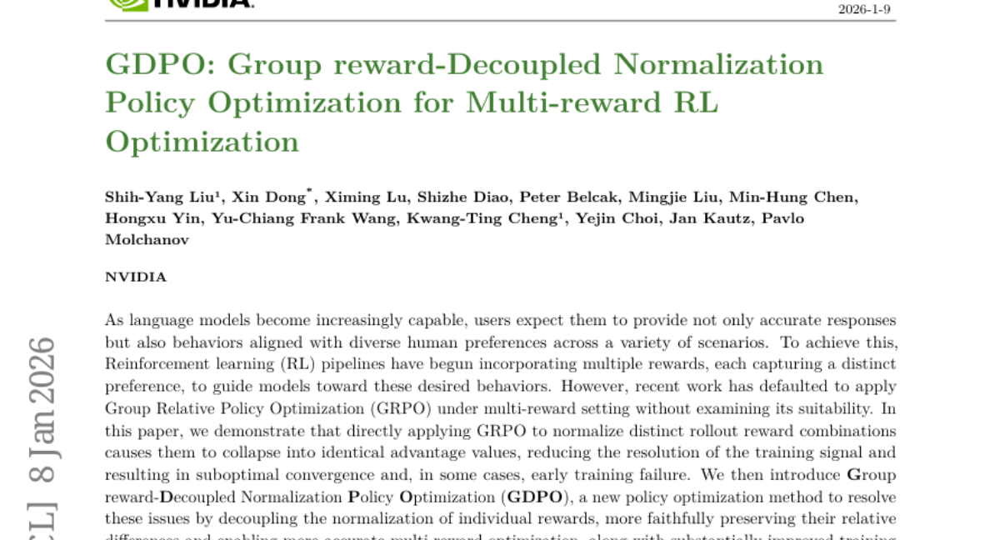
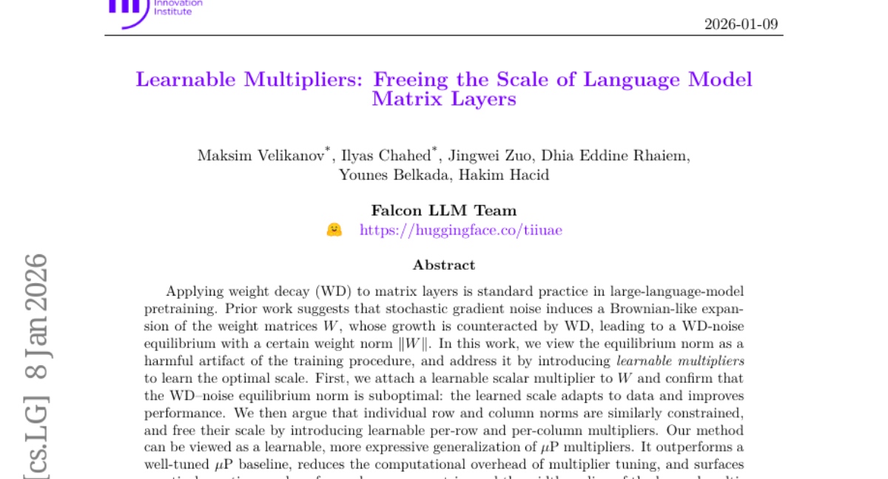
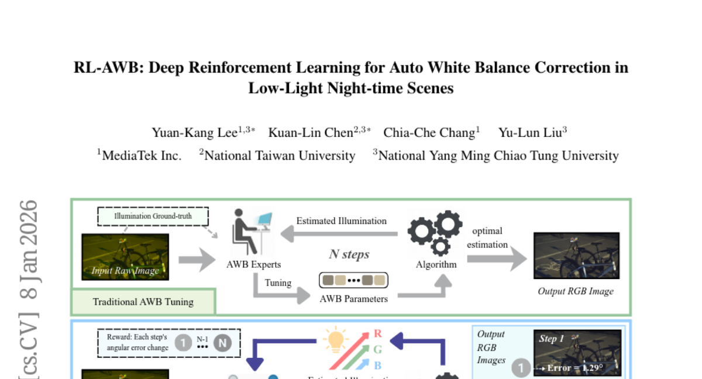
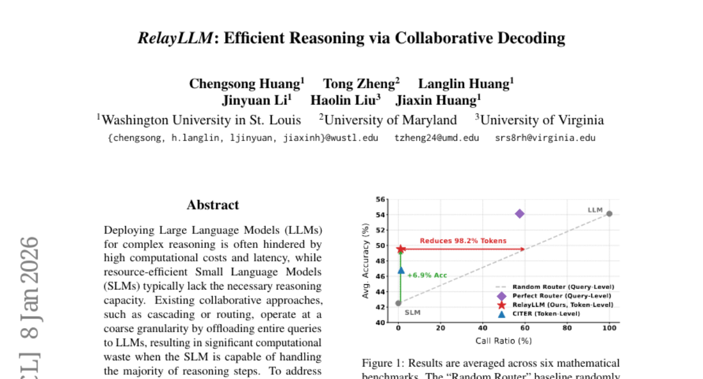

# 2026-01-09 Daily Papers (Top 5)

## 1. [GDPO: Group reward-Decoupled Normalization Policy Optimization for Multi-reward RL Optimization](https://huggingface.co/papers/2601.05242)
**Upvotes**: 91

### 📌 요약
다중 보상 강화 학습 환경에서 기존 GRPO의 이점 값 붕괴 문제를 해결하기 위해 개별 보상의 정규화를 분리하여 최적화 정확도와 안정성을 개선한 GDPO(Group reward-Decoupled Normalization Policy Optimization)를 제안하고, 다양한 작업에서 그 우수성을 입증한다.

### 📝 초록 (번역)
언어 모델의 능력이 향상됨에 따라, 사용자들은 정확한 응답뿐만 아니라 다양한 시나리오에서 여러 인간의 선호도에 부합하는 행동을 기대합니다. 이를 달성하기 위해, 강화 학습(RL) 파이프라인은 모델을 원하는 행동으로 유도하기 위해 각기 다른 선호도를 포착하는 여러 보상을 통합하기 시작했습니다. 그러나 최근 연구에서는 그 적합성을 검토하지 않은 채 다중 보상 설정에 GRPO(Group Relative Policy Optimization)를 적용하는 것이 기본이 되었습니다. 본 논문에서 우리는 뚜렷이 구분되는 롤아웃 보상 조합에 GRPO를 직접 적용하여 정규화할 경우, 이들이 동일한 이점 값(advantage values)으로 붕괴되어 훈련 신호의 해상도를 감소시키고, 결과적으로 최적화 미달 수렴(suboptimal convergence)을 야기하며, 일부 경우에서는 조기 훈련 실패를 초래함을 입증합니다. 이에 우리는 이러한 문제를 해결하기 위해 개별 보상의 정규화를 분리함으로써 상대적 차이를 더욱 충실하게 보존하고, 더 정확한 다중 보상 최적화를 가능하게 하며, 훈련 안정성을 실질적으로 향상시키는 새로운 정책 최적화 방법인 GDPO(Group reward-Decoupled Normalization Policy Optimization)를 소개합니다. 우리는 GDPO를 도구 호출, 수학적 추론, 코딩 추론이라는 세 가지 작업에서 GRPO와 비교하고, 정확성 지표(정확도, 버그 비율)와 제약 조건 준수 지표(형식, 길이)를 모두 평가했습니다. 모든 설정에서 GDPO는 일관되게 GRPO보다 우수한 성능을 보였으며, 이는 다중 보상 강화 학습 최적화에 대한 GDPO의 효과성과 일반화 가능성을 입증합니다.

### 🔑 핵심 포인트
- 다중 보상 강화 학습 환경에서 GRPO를 직접 적용할 경우, 상이한 보상 조합들이 동일한 이점 값으로 붕괴되어 훈련 신호의 해상도가 저하되며 최적화 미달 및 훈련 실패를 유발한다.
- GDPO는 개별 보상의 정규화를 분리(decoupling)함으로써 보상 간의 상대적 차이를 충실하게 보존하고, 더 정확한 다중 보상 최적화와 향상된 훈련 안정성을 제공한다.
- GDPO는 도구 호출, 수학적 추론, 코딩 추론 등 세 가지 작업에서 정확성 지표와 제약 조건 준수 지표 모두에서 기존 GRPO 대비 일관되게 우수한 성능을 보인다.

---

## 2. [Learnable Multipliers: Freeing the Scale of Language Model Matrix Layers](https://huggingface.co/papers/2601.04890)
**Upvotes**: 28

---

## 3. [RL-AWB: Deep Reinforcement Learning for Auto White Balance Correction in Low-Light Night-time Scenes](https://huggingface.co/papers/2601.05249)
**Upvotes**: 24

### 📌 요약
RL-AWB는 통계적 방법을 기반으로 심층 강화 학습을 결합하여 저조도 야간 환경에서 전문적인 AWB 조정 전문가처럼 동적으로 파라미터를 최적화하고 우수한 일반화 성능을 달성하는 새로운 색 재현성 프레임워크를 제시합니다.

### 📝 초록 (번역)
야간 색 재현성(color constancy)은 저조도 노이즈와 복잡한 조명 조건으로 인해 컴퓨터 사진술 분야에서 여전히 어려운 문제로 남아있습니다. 본 연구는 야간 화이트 밸런스(AWB)를 위해 통계적 방법과 심층 강화 학습을 결합한 새로운 프레임워크인 RL-AWB를 제안합니다. 제안된 방법은 야간 장면에 특화된 통계적 알고리즘으로 시작하며, 현저한 회색 픽셀(salient gray pixel) 탐지와 새로운 조명 추정 기법을 통합합니다. 이러한 기반 위에서, 저희는 통계적 알고리즘을 핵심으로 활용하는 최초의 색 재현성을 위한 심층 강화 학습 접근 방식을 개발했습니다. 이는 이미지별로 파라미터를 동적으로 최적화함으로써 전문 AWB 조정 전문가의 작업을 모방합니다. 크로스-센서 평가를 용이하게 하기 위해, 저희는 최초의 다중 센서 야간 데이터셋을 소개합니다. 실험 결과는 저희 방법이 저조도 및 충분히 밝은 이미지 전반에서 우수한 일반화 성능을 달성함을 입증합니다.

### 🔑 핵심 포인트
- 저조도 야간 환경에 특화된 통계적 화이트 밸런스(AWB) 알고리즘과 심층 강화 학습(DRL)을 결합한 RL-AWB 프레임워크를 제안했습니다.
- 통계적 알고리즘을 핵심으로 활용하여 이미지별 파라미터를 동적으로 최적화하며, 전문 AWB 조정 전문가의 튜닝 방식을 모방하는 최초의 색 재현성을 위한 강화 학습 접근 방식을 구축했습니다.
- 크로스-센서 평가를 지원하기 위해 최초의 다중 센서 야간 데이터셋을 구축 및 공개하였으며, 이를 통해 다양한 조명 조건에서 뛰어난 일반화 성능을 입증했습니다.
### 🖼️ 추가 자료

---

## 4. [RoboVIP: Multi-View Video Generation with Visual Identity Prompting Augments Robot Manipulation](https://huggingface.co/papers/2601.05241)
**Upvotes**: 19

### 📌 요약
본 논문은 텍스트 프롬프트의 한계를 극복하고 장면 설정의 시각적 일관성을 높이기 위해 시각적 정체성 프롬프트(예시 이미지)를 도입하여 로봇 조작을 위한 다중 시점 및 시간적으로 일관된 비디오 데이터를 생성하고, 이를 통해 로봇 정책 모델의 성능을 향상시키는 RoboVIP를 제안한다.

### 📝 초록 (번역)
효과적인 로봇 정책을 훈련시키기 위해서는 조작 데이터의 다양성, 양, 품질이 매우 중요하다. 그러나 하드웨어 및 물리적 설정 제약으로 인해 다양한 환경에서 대규모 실제 조작 데이터를 수집하는 것은 확장하기 어렵다. 최근 연구들은 텍스트 프롬프트에 의해 조건화된 이미지 확산 모델을 사용하여 시각적 관찰에서 배경과 테이블 위 물체를 변경함으로써 조작 데이터를 증강해왔다. 하지만 이러한 접근 방식은 최신 정책 모델이 요구하는 다중 시점(multi-view) 및 시간적으로 일관된(temporally coherent) 관찰 데이터의 실질적인 필요성을 간과하는 경우가 많다. 더욱이, 텍스트 프롬프트만으로는 장면 설정을 안정적으로 지정할 수 없다. 확산 모델에 명시적인 시각적 안내를 제공하기 위해, 우리는 원하는 장면 설정 생성을 안내하기 위한 조건 입력으로 예시 이미지를 제공하는 시각적 정체성 프롬프트(visual identity prompting)를 도입한다. 이를 위해 우리는 대규모 로봇 데이터셋으로부터 시각적 정체성 풀(visual identity pool)을 큐레이션(선별)하는 확장 가능한 파이프라인도 구축한다. 우리의 증강된 조작 데이터를 사용하여 후속 비전-언어-행동(vision-language-action) 및 시각-운동(visuomotor) 정책 모델을 훈련시킨 결과, 시뮬레이션 및 실제 로봇 환경 모두에서 일관된 성능 향상을 보였다.

### 🔑 핵심 포인트
- 기존 텍스트 기반 증강 방식이 간과했던, 최신 로봇 정책 모델에 필수적인 다중 시점 및 시간적 일관성을 갖춘 조작 비디오 데이터 생성에 초점을 맞춘다.
- 텍스트 프롬프트의 불확실성을 해결하기 위해 예시 이미지를 조건 입력으로 제공하여 원하는 장면 설정을 명시적으로 안내하는 시각적 정체성 프롬프트(Visual Identity Prompting) 방법을 제안한다.
- 대규모 로봇 데이터셋으로부터 시각적 정체성 풀을 구축하는 확장 가능한 파이프라인을 마련했으며, 이 증강 데이터를 사용한 정책 모델 훈련 결과 시뮬레이션 및 실제 로봇 환경 모두에서 일관된 성능 향상을 입증했다.

---

## 5. [RelayLLM: Efficient Reasoning via Collaborative Decoding](https://huggingface.co/papers/2601.05167)
**Upvotes**: 17

### 📌 요약
RelayLLM은 SLM이 능동적인 제어자 역할을 하며 중요한 토큰 생성 시에만 LLM을 호출하도록 하는 토큰 수준의 협업 디코딩 프레임워크를 제안하여, 극도의 효율성으로 LLM급 추론 성능을 달성합니다.

### 📝 초록 (번역)
복잡한 추론을 위한 대규모 언어 모델(LLM)은 종종 높은 계산 비용과 지연 시간으로 인해 제약을 받는 반면, 자원 효율적인 소규모 언어 모델(SLM)은 일반적으로 필요한 추론 능력이 부족합니다. 캐스케이딩이나 라우팅과 같은 기존의 협업 접근 방식은 전체 쿼리를 LLM으로 오프로드하는 거친 세분성(coarse granularity)으로 작동하여, SLM이 대부분의 추론 단계를 처리할 수 있을 때에도 상당한 계산 낭비를 초래합니다. 이러한 문제를 해결하기 위해, 우리는 토큰 수준의 협업 디코딩을 통한 효율적인 추론을 위한 새로운 프레임워크인 RelayLLM을 제안합니다. 라우터와 달리, RelayLLM은 SLM이 능동적인 제어자로 기능하여 특별한 명령을 통해 중요한 토큰에 대해서만 LLM을 동적으로 호출함으로써 생성 프로세스를 효과적으로 '릴레이(중계)'하도록 합니다. 우리는 모델이 독립성과 전략적인 도움 요청 사이의 균형을 맞추도록 교육하기 위해 웜업(warm-up) 단계와 GRPO(Group Relative Policy Optimization)를 포함하는 2단계 훈련 프레임워크를 도입합니다. 6개 벤치마크에 걸친 실증적 결과는 RelayLLM이 평균 49.52%의 정확도를 달성하여 두 모델 간의 성능 격차를 효과적으로 해소함을 보여줍니다. 특히, 이 성과는 전체 생성 토큰 중 단 1.07%에 대해서만 LLM을 호출함으로써 달성되었으며, 성능이 일치하는 무작위 라우터 대비 98.2%의 비용 절감을 제공합니다.

### 🔑 핵심 포인트
- RelayLLM은 LLM과 SLM의 협업을 쿼리 수준이 아닌 토큰 수준으로 세분화하여 효율성을 극대화합니다.
- SLM이 능동적인 제어자 역할을 수행하며, 특수 명령을 사용하여 추론 과정 중 '결정적인 토큰' 생성 시에만 LLM을 동적으로 호출(릴레이)합니다.
- 웜업 단계와 GRPO(Group Relative Policy Optimization)를 포함하는 2단계 훈련 방식을 통해 SLM이 독립성과 전략적 도움 요청 사이의 균형을 학습하도록 유도합니다.
- 전체 생성 토큰의 1.07%만 LLM을 활용했음에도 불구하고 높은 정확도(49.52%)를 달성하여, 성능 매칭된 기준 모델 대비 98.2%의 비용 절감 효과를 입증했습니다.

---

