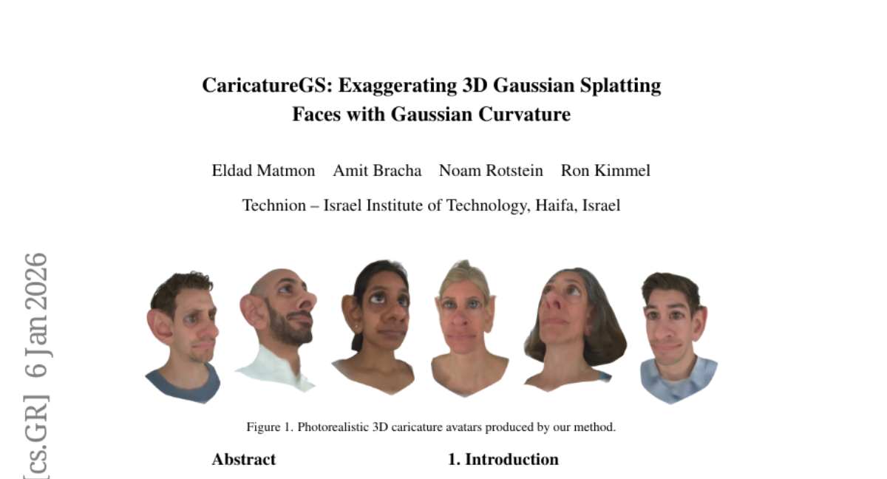
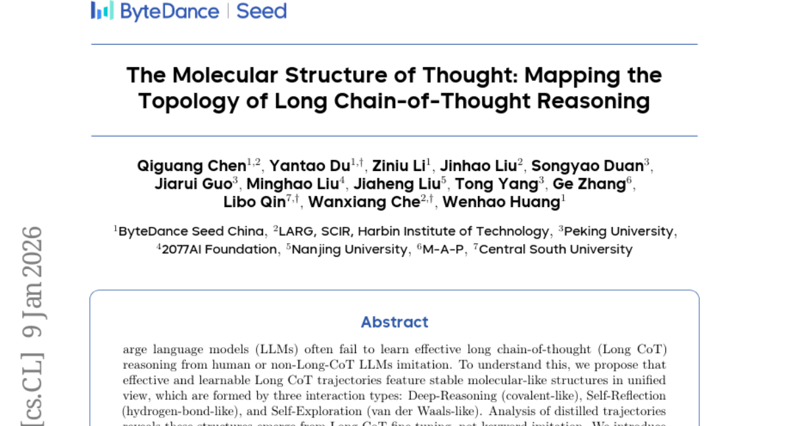
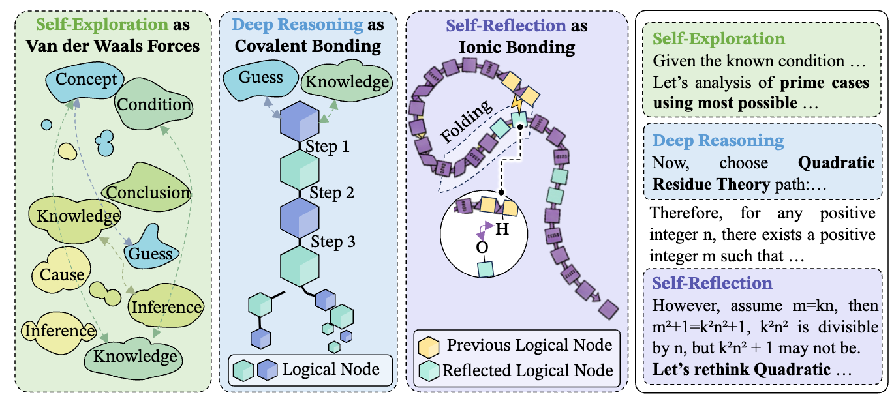
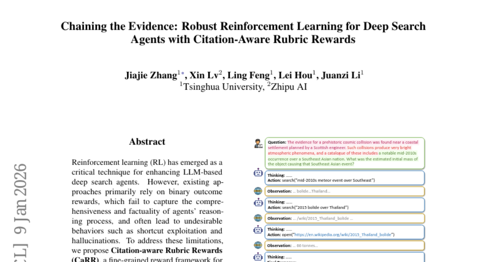

# 2026-01-12 Daily Papers (Top 5)

## 1. [Thinking with Map: Reinforced Parallel Map-Augmented Agent for Geolocalization](https://huggingface.co/papers/2601.05432)
**Upvotes**: 129

### 📌 요약
이미지 지리 위치 파악 성능을 획기적으로 개선하기 위해, 지도 활용 능력을 갖춘 에이전트를 강화 학습(RL)과 병렬 테스트 시간 스케일링(TTS)을 통해 최적화했으며, 이는 최신 LVLM들을 크게 능가하는 결과를 보였습니다.

### 📝 초록 (번역)
이미지 지리 위치 파악 작업은 시각적 단서를 활용하여 이미지가 지구상의 어느 곳에서 촬영되었는지 예측하는 것을 목표로 합니다. 기존의 대규모 시각-언어 모델(LVLM) 접근 방식은 세계 지식, 사고 연쇄 추론(chain-of-thought reasoning), 그리고 에이전트 역량을 활용하지만, 인간이 흔히 사용하는 전략인 지도 사용을 간과합니다. 본 연구에서는 모델에 '지도를 활용하여 생각하는(Thinking with Map)' 능력을 처음으로 부여하고 이를 지도 내 에이전트(agent-in-the-map) 루프로 공식화합니다. 이를 위해 에이전트형 강화 학습(RL)과 병렬 테스트 시간 스케일링(TTS)을 포함하는 2단계 최적화 방식을 개발했습니다. 강화 학습(RL)은 모델의 에이전트 역량을 강화하여 샘플링 효율을 개선하며, 병렬 TTS는 모델이 최종 예측을 내리기 전에 여러 후보 경로를 탐색할 수 있도록 하여 지리 위치 파악에 필수적인 역할을 합니다. 최신 실제 이미지로 저희의 방법을 평가하기 위해, 저희는 전적으로 실제 이미지로 구성된 포괄적인 지리 위치 파악 학습 및 평가 벤치마크인 MAPBench를 추가로 제시합니다. 실험 결과는 저희의 방법이 기존의 공개 및 비공개 소스 모델들보다 대부분의 지표에서 뛰어난 성능을 보였으며, 특히 Google 검색/지도 기반 모드를 사용한 Gemini-3-Pro와 비교하여 Acc@500m(500미터 이내 정확도)를 8.0%에서 22.1%로 대폭 개선했음을 보여줍니다.

### 🔑 핵심 포인트
- 인간의 전략을 모방하여, 기존 LVLM이 간과했던 지도 활용 능력('Thinking with Map')을 모델에 통합하고 이를 지도 내 에이전트 루프(agent-in-the-map loop)로 공식화함.
- 샘플링 효율을 높이는 에이전트형 강화 학습(RL)과 지리 위치 파악에 필수적인 다중 후보 경로 탐색을 위한 병렬 테스트 시간 스케일링(TTS)으로 구성된 2단계 최적화 방식을 개발함.
- 실제 이미지로만 구성된 포괄적인 지리 위치 파악 벤치마크 MAPBench를 제시하였으며, Acc@500m 지표를 Gemini-3-Pro 대비 8.0%에서 22.1%로 대폭 향상시키는 등 기존 모델들을 크게 능가하는 성능을 입증함.

---

## 2. [MMFormalizer: Multimodal Autoformalization in the Wild](https://huggingface.co/papers/2601.03017)
**Upvotes**: 93

### 📌 요약
MMFormalizer는 시각적 단서를 통해 숨겨진 물리적 제약 조건을 추론하고 적응적 접지 및 공리 구성을 통해 자연어 수학을 형식적 명제로 변환하는 최초의 다중 모드 자동 형식화 프레임워크입니다.

### 📝 초록 (번역)
기계 추론을 가능하게 하기 위해 자연어 수학을 형식적 명제로 번역하는 자동 형식화(autoformalization)는 물리학이 시각적 요소로부터 숨겨진 제약(예: 질량 또는 에너지)을 추론해야 하는 물리 세계의 다중 모드 특성으로 인해 현실 세계에서 근본적인 도전에 직면합니다. 이를 해결하기 위해 우리는 실제 수학 및 물리 영역의 엔티티와 적응적 접지(adaptive grounding)를 통합하여 자동 형식화를 텍스트를 넘어 확장하는 MMFormalizer를 제안합니다. MMFormalizer는 재귀적 접지 및 공리 구성을 통해 지각적으로 접지된(perceptually grounded) 기본 요소로부터 형식적 명제를 재귀적으로 구성하며, 적응적 재귀 종료를 통해 모든 추상화가 시각적 증거에 의해 뒷받침되고 차원적 또는 공리적 접지에 고정되도록 보장합니다. 우리는 다양한 다중 모드 자동 형식화 작업을 포괄하는 MathVerse, PhyX, Synthetic Geometry, Analytic Geometry에서 선별된 115개의 샘플로 구성된 새로운 벤치마크인 PhyX-AF를 통해 MMFormalizer를 평가합니다. 결과는 GPT-5 및 Gemini-3-Pro와 같은 최신 모델이 가장 높은 컴파일 및 의미론적 정확도를 달성했으며, GPT-5는 물리적 추론에서 특히 탁월했지만 기하학은 여전히 가장 어려운 영역임을 보여줍니다. 전반적으로 MMFormalizer는 인지(perception)와 형식적 추론을 연결하는 통합된 다중 모드 자동 형식화를 위한 확장 가능한 프레임워크를 제공합니다. 우리가 아는 한, 이는 고전 역학(해밀토니안에서 파생됨)뿐만 아니라 상대성 이론, 양자 역학 및 열역학까지 처리할 수 있는 최초의 다중 모드 자동 형식화 방법입니다.

### 🔑 핵심 포인트
- MMFormalizer는 실제 세계의 물리적 문제에서 시각적 요소를 해석하여 숨겨진 제약 조건을 추론함으로써 자동 형식화의 범위를 텍스트를 넘어 다중 모드 영역으로 확장합니다.
- 이 프레임워크는 재귀적 접지 및 공리 구성을 통해 지각적으로 접지된 기본 요소로부터 형식적 명제를 구성하며, 모든 추상화가 시각적 증거에 의해 지원되도록 보장합니다.
- 고전 역학, 상대성 이론, 양자 역학, 열역학 등 광범위한 고급 물리 도메인을 처리할 수 있는 최초의 다중 모드 자동 형식화 방법론이며, 새로운 PhyX-AF 벤치마크를 통해 평가되었습니다.

---

## 3. [CaricatureGS: Exaggerating 3D Gaussian Splatting Faces With Gaussian Curvature](https://huggingface.co/papers/2601.03319)
**Upvotes**: 44

### 📌 요약
이 논문은 가우시안 곡률 기반의 표면 과장 기법을 3D 가우시안 스플래팅(3DGS)과 결합하고 실제 및 합성 데이터에 대한 교차 학습을 통해 사실적이며 제어 가능한 3D 얼굴 캐리커처 아바타를 생성하는 프레임워크를 제안한다.

### 📝 초록 (번역)
얼굴에 대한 사진처럼 사실적이고 제어 가능한 3D 캐리커처화 프레임워크가 소개됩니다. 우리는 내재적 가우시안 곡률 기반 표면 과장 기법으로 시작하는데, 이는 텍스처와 결합될 경우 렌더링 결과가 지나치게 부드럽게(over-smoothed) 나오는 경향이 있습니다. 이 문제를 해결하기 위해, 최근 사실적인 자유 시점 아바타 생성 능력을 입증한 3D 가우시안 스플래팅(3DGS)을 활용합니다. 다중 시점 시퀀스가 주어지면, 우리는 FLAME 메쉬를 추출하고, 곡률 가중 포아송 방정식을 풀어 과장된 형태를 얻습니다. 하지만 가우시안을 직접 변형하면 결과가 좋지 않으므로, 각 프레임을 로컬 아핀 변환을 사용하여 과장된 2D 표현으로 워핑함으로써 의사(pseudo) 실제 캐리커처 이미지를 합성해야 합니다. 이후 우리는 실제 및 합성된 지도 학습을 교차하는 훈련 방식을 고안하여, 단일 가우시안 컬렉션이 자연스러운 아바타와 과장된 아바타 모두를 표현할 수 있도록 합니다. 이 방식은 충실도(fidelity)를 개선하고, 로컬 편집을 지원하며, 캐리커처 강도를 연속적으로 제어할 수 있게 합니다. 실시간 변형을 달성하기 위해, 원본 표면과 과장된 표면 간의 효율적인 보간법이 도입됩니다. 우리는 이 보간법이 닫힌 형식(closed-form) 해와의 편차가 제한적임을 추가로 분석하고 보여줍니다. 정량적 및 정성적 평가 모두에서 우리의 결과는 이전 연구를 능가하며, 사진처럼 사실적이고 기하학적으로 제어되는 캐리커처 아바타를 제공합니다.

### 🔑 핵심 포인트
- 가우시안 곡률 기반의 기하학적 표면 과장 기법을 3D 가우시안 스플래팅(3DGS) 기반 렌더링 파이프라인과 결합하여 고품질의 3D 캐리커처 아바타를 생성한다.
- 가우시안을 직접 변형했을 때 발생하는 품질 저하 문제를 해결하기 위해, 로컬 아핀 변환을 이용한 2D 워핑으로 의사 실제(pseudo-ground-truth) 이미지를 생성하고 이를 실제 이미지와 교차하여 학습하는 감독(supervision) 전략을 제안한다.
- 단일 3DGS 모델로 캐리커처 강도를 연속적으로 제어할 수 있으며, 실시간 변형을 위한 효율적인 표면 보간법을 도입하고 해당 보간법이 이론적인 닫힌 형식 해에 대해 유계 편차(bounded deviation)를 가짐을 증명하여 효율성과 정확성을 확보한다.

---

## 4. [The Molecular Structure of Thought: Mapping the Topology of Long Chain-of-Thought Reasoning](https://huggingface.co/papers/2601.06002)
**Upvotes**: 37

### 📌 요약
대규모 언어 모델의 긴 연쇄적 사고(Long CoT) 학습 문제를 해결하기 위해 추론 궤적을 분자 구조로 모델링하고, 엔트로피 수렴을 촉진하는 안정적인 구조를 합성하는 Mole-Syn 방법을 제안한다.

### 📝 초록 (번역)
대규모 언어 모델(LLM)은 종종 인간 또는 비(非)-Long CoT LLM 모방을 통해 효과적인 긴 연쇄적 사고(Long CoT) 추론을 학습하는 데 실패합니다. 이를 이해하기 위해, 우리는 효과적이고 학습 가능한 Long CoT 궤적은 통합된 관점에서 안정적인 분자 유사 구조를 특징으로 한다고 제안하며, 이 구조는 세 가지 상호작용 유형, 즉 심층 추론(공유 결합 유사), 자기 성찰(수소 결합 유사), 자기 탐색(반데르발스 힘 유사)을 통해 형성됩니다. 증류된 궤적에 대한 분석 결과, 이러한 구조는 키워드 모방이 아닌 Long CoT 미세 조정을 통해 나타난다는 것을 보여줍니다. 우리는 효율적인 의미론적 이성질체(Effective Semantic Isomers)를 도입하고, 오직 빠른 엔트로피 수렴을 촉진하는 결합만이 안정적인 Long CoT 학습을 지원하며, 구조적 경쟁은 훈련을 저해한다는 것을 밝혀냅니다. 이러한 발견을 바탕으로, 우리는 효과적인 Long CoT 구조의 합성을 유도하는 분포 전송 그래프(distribution-transfer-graph) 방법인 Mole-Syn을 제시하며, 이는 모든 벤치마크에서 성능과 RL(강화 학습) 안정성을 향상시킵니다.

### 🔑 핵심 포인트
- 긴 연쇄적 사고(Long CoT)의 학습 비효율성 문제를 해결하기 위해, 추론 궤적을 세 가지 상호작용(심층 추론, 자기 성찰, 자기 탐색)을 기반으로 하는 '분자 유사 구조'로 모델링한다.
- 안정적인 Long CoT 학습을 위해서는 구조적 경쟁을 피하고, 빠른 엔트로피 수렴을 촉진하는 결합(bonds)이 필수적이라는 것을 효율적인 의미론적 이성질체 분석을 통해 규명하였다.
- 효과적인 Long CoT 구조 합성을 유도하는 분포 전송 그래프 기반의 방법론인 Mole-Syn을 제시하여 벤치마크에서 LLM의 성능과 강화 학습 안정성을 개선하였다.
### 🖼️ 추가 자료

---

## 5. [Chaining the Evidence: Robust Reinforcement Learning for Deep Search Agents with Citation-Aware Rubric Rewards](https://huggingface.co/papers/2601.06021)
**Upvotes**: 30

### 📌 요약
기존의 이진 보상 체계의 한계를 극복하기 위해, 추론의 포괄성, 사실적 근거, 증거 연결성을 강조하는 세분화된 보상 프레임워크인 CaRR과 이를 활용한 C-GRPO 알고리즘을 제안하여, 견고하고 신뢰성 있는 딥 서치 에이전트를 성공적으로 학습시켰다.

### 📝 초록 (번역)
강화 학습(RL)은 LLM 기반 딥 서치 에이전트의 성능을 향상시키는 데 핵심적인 기술로 부상했습니다. 그러나 기존 접근 방식은 주로 이진 결과 보상(binary outcome rewards)에 의존하며, 이는 에이전트의 추론 과정의 포괄성(comprehensiveness)과 사실성(factuality)을 포착하지 못하고, 종종 지름길 악용(shortcut exploitation)이나 환각(hallucinations)과 같은 바람직하지 않은 행동으로 이어집니다. 이러한 한계를 해결하기 위해, 우리는 추론의 포괄성, 사실적 근거 제시, 그리고 증거 연결성(evidence connectivity)을 강조하는 딥 서치 에이전트용 미세 조정된 보상 프레임워크인 CaRR(Citation-aware Rubric Rewards)을 제안합니다. CaRR은 복잡한 질문을 검증 가능한 단일 홉(single-hop) 채점 기준(rubrics)으로 분해하며, 에이전트가 숨겨진 개체(hidden entities)를 명시적으로 식별하고, 정확한 인용(citations)으로 이를 뒷받침하며, 예측된 답변으로 연결되는 완전한 증거 사슬(evidence chains)을 구성함으로써 이 기준들을 충족하도록 요구합니다. 나아가, 우리는 CaRR과 결과 보상을 결합하여 견고한 딥 서치 에이전트를 훈련하는 C-GRPO(Citation-aware Group Relative Policy Optimization)를 추가로 도입합니다. 실험 결과, C-GRPO는 여러 딥 서치 벤치마크에서 표준 결과 기반 RL 기준선보다 지속적으로 우수한 성능을 보였습니다. 우리의 분석은 또한 C-GRPO가 지름길 악용을 효과적으로 억제하고, 포괄적이며 증거에 기반한 추론을 촉진하며, 개방형 딥 리서치 작업으로의 강력한 일반화 능력을 보여준다는 것을 입증합니다. 우리의 코드와 데이터는 https://github.com/THUDM/CaRR 에서 이용 가능합니다.

### 🔑 핵심 포인트
- 기존 딥 서치 RL은 이진 결과 보상(binary outcome rewards)으로 인해 추론 과정의 질(comprehensiveness and factuality)을 평가하지 못하며, 지름길 악용 및 환각 문제를 야기한다.
- 추론의 포괄성, 사실적 근거 제시, 증거 연결성을 평가하기 위해 복잡한 질문을 검증 가능한 단일 홉 채점 기준(rubrics)으로 분해하는 세밀한 보상 체계인 CaRR(Citation-aware Rubric Rewards)을 제안한다.
- CaRR과 결과 보상을 결합한 C-GRPO(Citation-aware Group Relative Policy Optimization)를 사용하여 훈련했을 때, 기존 결과 기반 RL 기준선 대비 일관되게 우수한 성능을 보였으며, 특히 지름길 악용 방지 및 개방형 작업에서의 강력한 일반화 능력을 입증했다.

---

