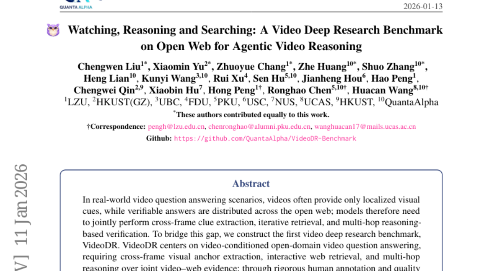
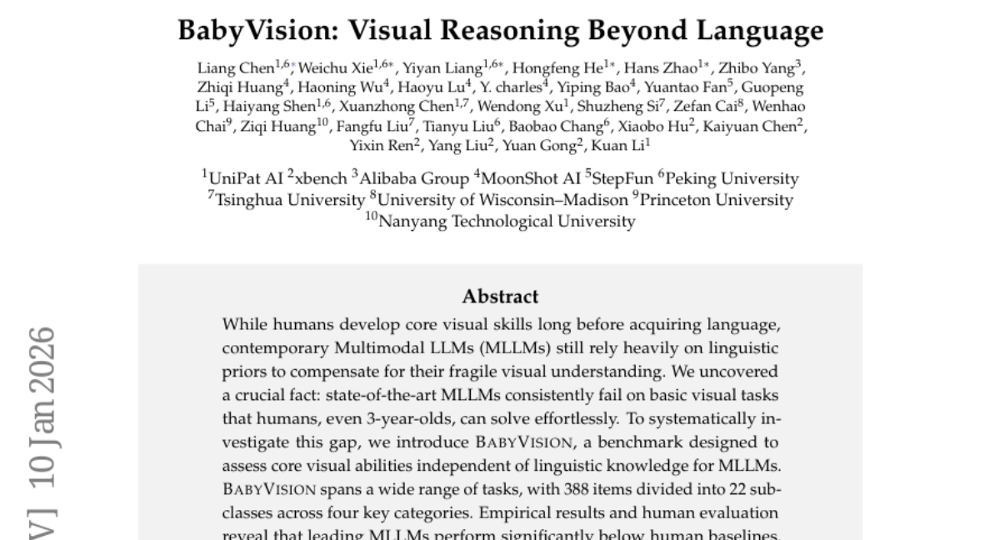
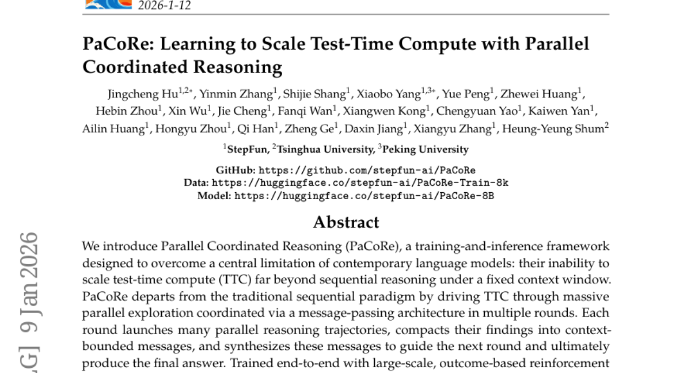
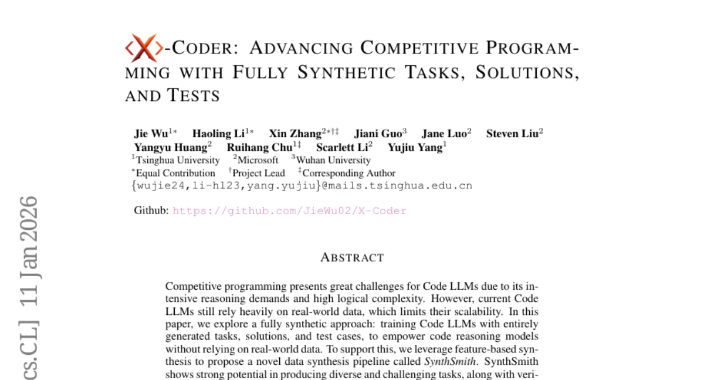
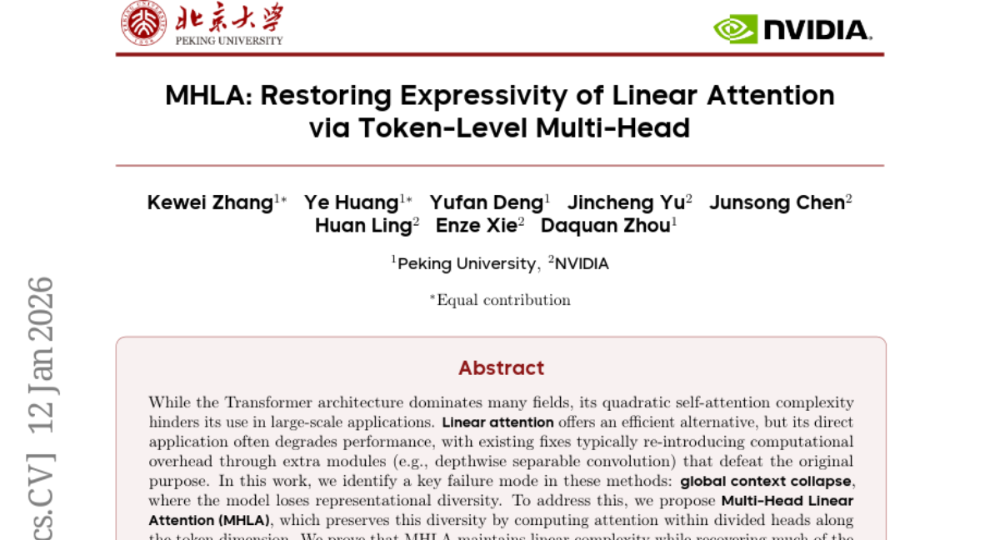

# 2026-01-13 Daily Papers (Top 5)

## 1. [Watching, Reasoning, and Searching: A Video Deep Research Benchmark on Open Web for Agentic Video Reasoning](https://huggingface.co/papers/2601.06943)
**Upvotes**: 169

### 📌 요약
본 논문은 영상 시청, 추론, 개방형 웹 검색을 통합하는 최초의 영상 심층 연구 벤치마크인 VideoDR을 구축하고, 에이전트 모델의 성능이 긴 검색 체인에서 초기 영상 단서를 유지하는 능력(장기적인 일관성)에 달려 있음을 밝혀냅니다.

### 📝 초록 (번역)
실제 영상 질문 응답(VQA) 시나리오에서, 영상은 종종 국지적인 시각적 단서만을 제공하는 반면, 검증 가능한 답은 개방형 웹에 분산되어 있습니다. 따라서 모델은 프레임 간 단서 추출, 반복적인 검색, 그리고 다중 홉 추론 기반 검증을 공동으로 수행해야 합니다. 이러한 격차를 해소하기 위해, 우리는 최초의 영상 심층 연구 벤치마크인 VideoDR을 구축했습니다. VideoDR은 영상에 기반한 개방 도메인 영상 질문 응답을 중심으로 하며, 이는 프레임 간 시각적 앵커 추출, 상호작용적 웹 검색, 그리고 영상-웹 결합 증거에 대한 다중 홉 추론을 요구합니다. 엄격한 사람 주석 작업과 품질 관리를 통해, 우리는 여섯 가지 의미론적 영역에 걸친 고품질의 영상 심층 연구 샘플을 확보했습니다. 우리는 워크플로우(Workflow) 및 에이전트(Agentic) 패러다임 하에서 여러 폐쇄형 및 개방형 멀티모달 대규모 언어 모델을 평가했으며, 그 결과 에이전트 방식이 워크플로우 방식보다 항상 우수하지는 않음을 보여줍니다. 에이전트 방식의 이점은 모델이 긴 검색 체인 동안 초기 영상 앵커를 유지하는 능력에 달려 있습니다. 추가 분석에 따르면, 목표 이탈(goal drift)과 장기적인 일관성(long-horizon consistency)이 핵심 병목 현상입니다. 요약하자면, VideoDR은 개방형 웹 환경에서 영상 에이전트를 연구하기 위한 체계적인 벤치마크를 제공하며, 차세대 영상 심층 연구 에이전트가 직면한 주요 과제를 드러냅니다.

### 🔑 핵심 포인트
- 영상 시청과 개방형 웹 검색을 결합하여 실제와 유사한 질문 응답을 요구하는 최초의 영상 심층 연구 벤치마크인 VideoDR을 구축했습니다.
- VideoDR은 프레임 간 시각적 앵커 추출, 상호작용적 웹 검색, 그리고 영상과 웹 증거를 결합한 다중 홉 추론 능력을 핵심적으로 요구합니다.
- 에이전트 방식(Agentic paradigm)은 워크플로우 방식(Workflow paradigm)에 대해 일관된 우위를 보이지 못했으며, 긴 검색 과정에서 목표 이탈 및 장기적인 일관성 유지 능력이 핵심 병목 현상임을 확인했습니다.

---

## 2. [BabyVision: Visual Reasoning Beyond Language](https://huggingface.co/papers/2601.06521)
**Upvotes**: 145

### 📌 요약
언어에 과도하게 의존하는 최신 MLLM이 기본적인 시각 추론 능력에서 인간 아동보다 뒤처짐을 밝히고, 언어와 독립적인 핵심 시각 능력을 측정하는 벤치마크인 BabyVision을 제시한다.

### 📝 초록 (번역)
인간은 언어를 습득하기 훨씬 전부터 핵심 시각 기술을 개발하는 반면, 현대의 멀티모달 LLM(MLLM)은 취약한 시각적 이해를 보완하기 위해 여전히 언어적 사전 지식에 크게 의존합니다. 우리는 최첨단 MLLM이 3세 아동을 포함한 인간이 쉽게 해결할 수 있는 기본적인 시각 작업에서 일관되게 실패한다는 결정적인 사실을 발견했습니다. 이러한 격차를 체계적으로 조사하기 위해, 우리는 MLLM의 언어적 지식과 독립적으로 핵심 시각 능력을 평가하도록 설계된 벤치마크인 BabyVision을 소개합니다. BabyVision은 네 가지 주요 범주에 걸쳐 22개의 하위 클래스로 나뉜 388개의 항목으로 구성되어 있으며, 광범위한 작업을 포함합니다. 실험 결과와 인간 평가는 주요 MLLM이 인간 기준선보다 현저히 낮은 성능을 보인다는 것을 밝혀냈습니다. Gemini3-Pro-Preview는 49.7점을 기록하여 6세 아동보다 뒤처지며 평균 성인 점수인 94.1점에 훨씬 미치지 못합니다. 이러한 결과는 현재 MLLM이 지식 중심 평가에서는 탁월하더라도 근본적인 시각적 원시 능력(visual primitives)이 여전히 부족함을 보여줍니다. BabyVision에서의 발전은 인간 수준의 시각적 인식 및 추론 능력으로 나아가는 한 걸음을 나타냅니다. 우리는 또한 생성 모델을 사용하여 시각적 추론을 해결하는 방안을 모색하며, BabyVision-Gen과 자동 평가 도구 키트를 제안합니다. 우리의 코드와 벤치마크 데이터는 재현을 위해 https://github.com/UniPat-AI/BabyVision에 공개됩니다.

### 🔑 핵심 포인트
- 최신 MLLM은 언어적 사전 지식에 과도하게 의존하며, 3세 아동도 쉽게 해결할 수 있는 기본적인 시각 추론 작업에서 일관되게 실패하는 취약점을 보인다.
- 언어적 지식과 독립적으로 MLLM의 핵심 시각 원시 능력을 평가하도록 설계된 4개 주요 범주, 22개 하위 클래스, 388개 항목으로 구성된 BabyVision 벤치마크를 새롭게 도입했다.
- 최첨단 MLLM(Gemini3-Pro-Preview 49.7점)의 성능이 인간의 기준선(평균 성인 94.1점)에 크게 미치지 못하며, 이는 지식 기반 성공에도 불구하고 근본적인 시각 이해 능력이 부족함을 입증한다.

---

## 3. [PaCoRe: Learning to Scale Test-Time Compute with Parallel Coordinated Reasoning](https://huggingface.co/papers/2601.05593)
**Upvotes**: 61

### 📌 요약
PaCoRe는 고정된 컨텍스트 창의 제약을 넘어 병렬 탐색과 메시지 전달을 통해 테스트 시 계산 능력(TTC)을 수백만 토큰 수준으로 확장하여 수학 등의 다양한 영역에서 기존 모델들을 능가하는 성능을 달성한 훈련 및 추론 프레임워크이다.

### 📝 초록 (번역)
우리는 현대 언어 모델의 핵심 한계, 즉 고정된 컨텍스트 창 내에서 순차적 추론을 넘어 테스트 시 계산 능력(TTC)을 확장하기 어렵다는 점을 극복하기 위해 설계된 훈련 및 추론 프레임워크인 병렬 조정 추론(PaCoRe)을 소개합니다. PaCoRe는 전통적인 순차적 패러다임에서 벗어나, 메시지 전달 아키텍처를 통해 조정되는 다중 라운드의 대규모 병렬 탐색을 통해 TTC를 추진합니다. 각 라운드는 여러 개의 병렬 추론 궤적을 시작하고, 그 결과를 컨텍스트 제한이 있는 메시지로 압축하며, 이 메시지들을 종합하여 다음 라운드를 안내하고 최종적으로 최종 답변을 생성합니다. 대규모 결과 기반 강화 학습(RL)으로 엔드투엔드 훈련된 이 모델은 PaCoRe에 필요한 종합 능력을 숙달하고, 컨텍스트 제한을 초과하지 않으면서 수백만 토큰에 달하는 유효 TTC로 확장됩니다. 이 접근 방식은 다양한 영역에서 강력한 개선을 보이며, 특히 수학 분야에서 최신 선두 시스템의 추론 능력을 뛰어넘습니다. 8B 모델은 유효 TTC를 약 2백만 토큰으로 확장함으로써 HMMT 2025에서 94.5%를 달성하여 GPT-5의 93.2%를 능가합니다. 후속 연구를 가속화하기 위해 모델 체크포인트, 훈련 데이터 및 전체 추론 파이프라인을 오픈소스로 공개합니다.

### 🔑 핵심 포인트
- PaCoRe는 고정된 컨텍스트 창과 순차적 추론이라는 현대 언어 모델의 근본적인 한계를 극복하기 위해 설계된 훈련 및 추론 프레임워크이다.
- 이 프레임워크는 메시지 전달 아키텍처로 조정되는 다중 라운드 방식의 대규모 병렬 탐색을 사용하여 테스트 시 계산 능력(TTC)을 효율적으로 확장하며, 각 라운드는 결과를 요약하고 다음 추론을 안내한다.
- 8B 모델이 수학 벤치마크인 HMMT 2025에서 유효 TTC를 약 2백만 토큰으로 확장함으로써 94.5%의 정확도를 달성, GPT-5의 93.2% 성능을 능가하는 최첨단 추론 결과를 보여주었다.

---

## 4. [X-Coder: Advancing Competitive Programming with Fully Synthetic Tasks, Solutions, and Tests](https://huggingface.co/papers/2601.06953)
**Upvotes**: 30

### 📌 요약
실제 데이터 없이 완전히 합성된 데이터와 SynthSmith 파이프라인으로 학습된 7B 규모의 X-Coder 모델이 경쟁적 프로그래밍에서 강력한 성능을 보여주며 코드 추론 능력을 획기적으로 향상시켰다.

### 📝 초록 (번역)
경쟁적 프로그래밍은 집중적인 추론 요구와 높은 논리적 복잡성 때문에 코드 대규모 언어 모델(Code LLMs)에 큰 어려움을 제기합니다. 하지만 현재의 코드 LLM은 여전히 실제 데이터에 크게 의존하고 있으며, 이는 확장성을 제한합니다. 본 논문에서는 실제 데이터에 의존하지 않고 코드 추론 모델의 역량을 강화하기 위해 완전히 생성된 과제, 해법, 테스트 케이스로 코드 LLM을 훈련하는 '완전 합성' 접근 방식을 탐구합니다. 이를 위해, 우리는 특징 기반 합성을 활용하여 SynthSmith라고 불리는 새로운 데이터 합성 파이프라인을 제안합니다. SynthSmith는 지도 미세 조정(SFT)과 강화 학습(RL) 모두를 지원하며, 검증된 해법 및 테스트와 더불어 다양하고 도전적인 과제들을 생성하는 데 강력한 잠재력을 보여줍니다. 제안된 합성 SFT 및 RL 데이터셋을 기반으로, 우리는 X-Coder 모델 시리즈를 소개하며, 이 모델은 단 70억 개의 매개변수만 가지고 있음에도 불구하고 LiveCodeBench v5에서 62.9 avg@8, v6에서 55.8의 주목할 만한 통과율을 달성하여 DeepCoder-14B-Preview 및 AReal-boba2-14B를 능가하는 성능을 보였습니다. 심층 분석 결과, 스케일링 법칙이 우리의 합성 데이터셋에서도 유효하며, 어떤 차원을 확장하는 것이 더 효과적인지 탐구합니다. 또한, 우리는 코드 중심의 강화 학습에 대한 통찰력을 제공하고, 상세한 절제 연구 및 분석을 통해 성능을 결정하는 핵심 요소를 강조합니다. 우리의 연구 결과는 고품질 합성 데이터를 확장하고 단계적 훈련(staged training)을 채택하는 것이 실제 코딩 데이터에 대한 의존도를 줄이면서 코드 추론 능력을 크게 발전시킬 수 있음을 입증합니다.

### 🔑 핵심 포인트
- SynthSmith라는 새로운 특징 기반 합성 파이프라인을 통해 완전히 합성된 과제, 해법, 테스트 케이스를 생성하여 코드 LLM을 훈련하는 '완전 합성' 접근 방식을 제안했습니다.
- 70억 매개변수의 X-Coder 모델은 완전히 합성된 데이터셋으로 학습되었음에도 불구하고, LiveCodeBench에서 140억 매개변수 모델들을 능가하는 경쟁적 프로그래밍 성능을 달성했습니다.
- 심층 분석을 통해 합성 데이터셋에서의 스케일링 법칙 유효성을 확인하고, 고품질 합성 데이터의 확장 및 단계적 훈련(staged training)이 코드 추론 능력을 향상시키는 핵심 요소임을 입증했습니다.

---

## 5. [MHLA: Restoring Expressivity of Linear Attention via Token-Level Multi-Head](https://huggingface.co/papers/2601.07832)
**Upvotes**: 29

### 📌 요약
MHLA(Multi-Head Linear Attention)는 기존 선형 어텐션의 표현력 저하 문제인 '전역 컨텍스트 붕괴'를 토큰 차원 분할 멀티 헤드를 통해 해결함으로써, 선형 복잡도를 유지하면서도 소프트맥스 어텐션에 필적하는 표현력을 회복하여 다양한 분야에서 성능을 크게 향상시켰다.

### 📝 초록 (번역)
트랜스포머 아키텍처가 많은 분야를 지배하고 있음에도 불구하고, 그 이차 복잡도(quadratic complexity)를 갖는 셀프 어텐션은 대규모 애플리케이션에서의 사용을 방해합니다. 선형 어텐션은 효율적인 대안을 제공하지만, 이를 직접 적용하면 성능이 저하되는 경우가 많으며, 기존 해결책들은 원래의 목적을 해치는 추가 모듈(예: 깊이별 분리 가능 컨볼루션)을 통해 계산 오버헤드를 다시 도입합니다. 본 연구에서는 이러한 방식들의 주요 실패 원인으로 모델이 표현 다양성을 잃는 '전역 컨텍스트 붕괴(global context collapse)'를 식별했습니다. 이를 해결하기 위해, 우리는 토큰 차원(token dimension)을 따라 나누어진 헤드 내에서 어텐션을 계산하여 이러한 다양성을 보존하는 MHLA(Multi-Head Linear Attention)를 제안합니다. 우리는 MHLA가 선형 복잡도를 유지하면서 소프트맥스 어텐션의 표현력을 상당 부분 복구함을 증명하고, 다양한 도메인에서 그 효과를 검증하여 동일한 시간 복잡도 내에서 ImageNet 분류에서 3.6%, NLP에서 6.3%, 이미지 생성에서 12.6%, 비디오 생성에서 41%의 성능 향상을 달성했습니다.

### 🔑 핵심 포인트
- 기존 선형 어텐션의 성능 저하 원인인 표현 다양성 상실('전역 컨텍스트 붕괴', global context collapse)을 핵심 실패 모드로 식별하고, 이를 극복하기 위해 MHLA를 제안했습니다.
- MHLA는 토큰 차원을 따라 어텐션 헤드를 분할하여 계산함으로써 표현 다양성을 보존하며, 선형 복잡도($O(N)$)를 유지하면서도 소프트맥스 어텐션에 필적하는 표현력을 회복할 수 있음을 증명했습니다.
- MHLA는 동일한 시간 복잡도 내에서 ImageNet 분류에서 3.6%, NLP에서 6.3%, 이미지 생성에서 12.6%, 비디오 생성에서 41%에 이르는 광범위한 성능 향상을 입증했습니다.

---

