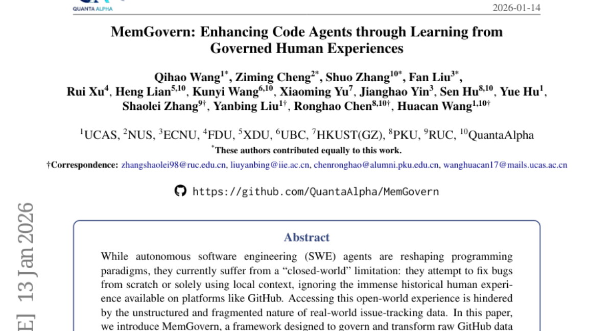
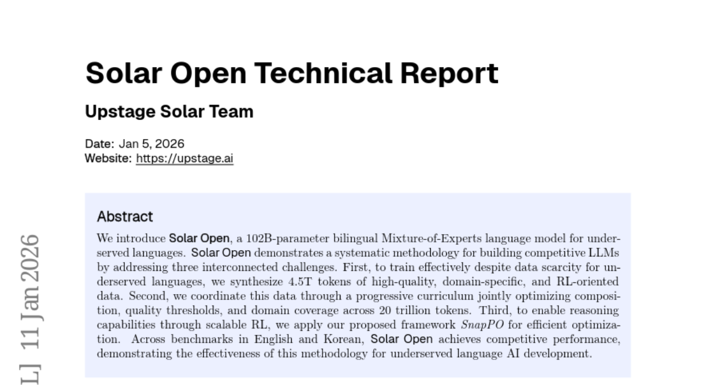
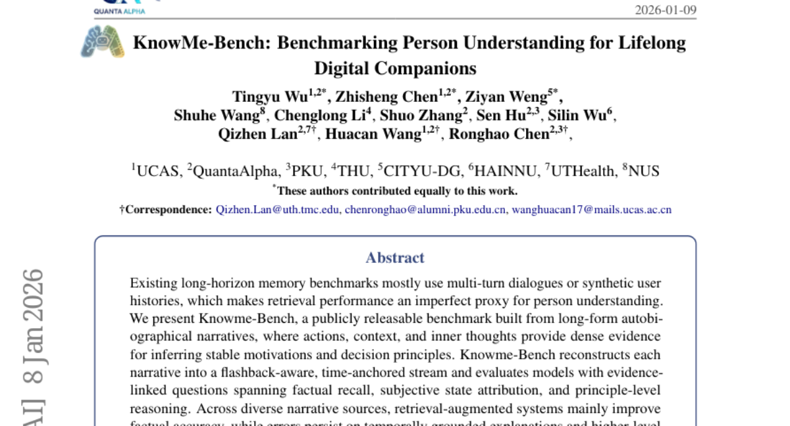
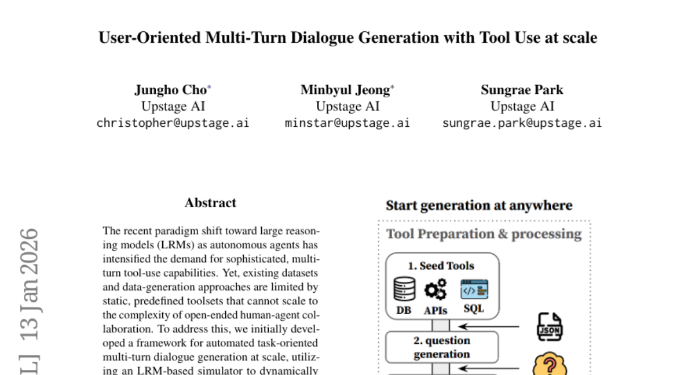
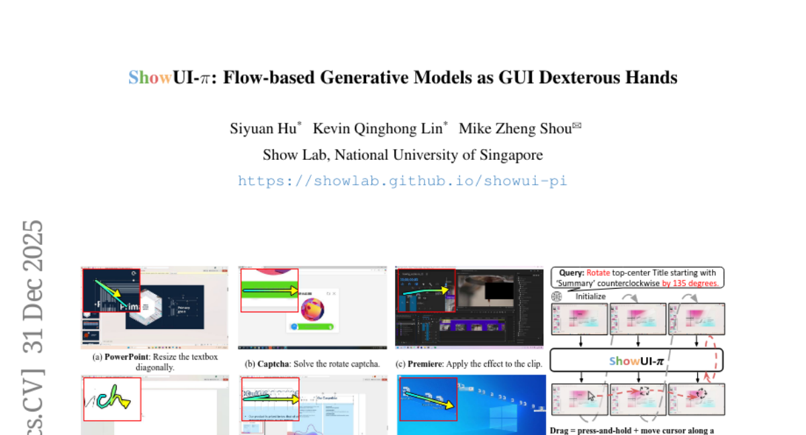

# 2026-01-14 Daily Papers (Top 5)

## 1. [MemGovern: Enhancing Code Agents through Learning from Governed Human Experiences](https://huggingface.co/papers/2601.06789)
**Upvotes**: 57

### 📌 요약
MemGovern은 방대한 GitHub 데이터를 에이전트 친화적인 경험 메모리로 체계화하여 SWE 에이전트의 성능을 강화하고, SWE-bench Verified에서 해결률을 4.65% 개선하는 플러그인 프레임워크입니다.

### 📝 초록 (번역)
자율 소프트웨어 엔지니어링(SWE) 에이전트가 프로그래밍 패러다임을 재편하고 있지만, 현재 이들은 '닫힌 세계(closed-world)'라는 한계에 시달리고 있습니다. 즉, 버그를 처음부터 고치거나 지역적 문맥만을 사용하여, GitHub와 같은 플랫폼에서 얻을 수 있는 방대한 역사적 인간 경험을 무시합니다. 이러한 '열린 세계' 경험에 접근하는 것은 실세계 이슈 추적 데이터의 비정형적이고 파편화된 특성으로 인해 방해받습니다. 본 논문에서 우리는 원시 GitHub 데이터를 에이전트가 실행 가능한 경험적 메모리로 변환하고 관리(govern)하도록 설계된 프레임워크인 MemGovern을 소개합니다. MemGovern은 인간 경험을 에이전트 친화적인 '경험 카드(experience cards)'로 전환하기 위해 경험 거버넌스(experience governance)를 사용하며, 인간의 전문 지식을 논리 기반으로 검색할 수 있게 하는 에이전트적 경험 검색 전략을 도입합니다. 135,000개의 관리된 경험 카드를 생성함으로써, MemGovern은 SWE-bench Verified에서 해결률을 4.65% 향상시키는 중요한 성능 향상을 달성합니다. 플러그인 접근 방식으로서, MemGovern은 에이전트 친화적인 메모리 인프라를 위한 해결책을 제공합니다.

### 🔑 핵심 포인트
- SWE 에이전트가 방대한 GitHub의 역사적 인간 경험을 활용하지 못하고 지역적 문맥에만 의존하는 '닫힌 세계' 문제를 해결하는 것을 목표로 한다.
- MemGovern은 경험 거버넌스(experience governance)를 통해 원시 GitHub 데이터를 에이전트 친화적인 '경험 카드'로 체계화하고, 논리 기반으로 인간 전문 지식을 검색할 수 있는 에이전트적 검색 전략을 도입한다.
- 135,000개의 관리된 경험 카드를 생성했으며, 이를 플러그인 방식으로 적용하여 SWE-bench Verified 벤치마크에서 버그 해결률을 4.65% 개선하는 성능 향상을 입증했다.

---

## 2. [Solar Open Technical Report](https://huggingface.co/papers/2601.07022)
**Upvotes**: 47

### 📌 요약
Solar Open은 102B 매개변수의 이중 언어 MoE 모델로, 소외된 언어의 데이터 부족 문제를 해결하기 위해 4.5조 토큰의 고품질 데이터 합성, 20조 토큰의 진보적 커리큘럼, 그리고 효율적인 SnapPO RL 프레임워크를 적용하여 한국어와 영어 벤치마크에서 경쟁력 있는 성능을 달성했습니다.

### 📝 초록 (번역)
우리는 소외된 언어를 위한 102B 매개변수의 이중 언어 MoE(Mixture-of-Experts) 언어 모델인 Solar Open을 소개합니다. Solar Open은 상호 연결된 세 가지 난제를 해결함으로써 경쟁력 있는 LLM을 구축하기 위한 체계적인 방법론을 제시합니다. 첫째, 소외된 언어의 데이터 부족에도 불구하고 효과적으로 훈련하기 위해, 우리는 4.5조(4.5T) 토큰에 달하는 고품질의 도메인 특화 및 RL 지향 데이터를 합성했습니다. 둘째, 우리는 20조 토큰에 걸쳐 구성, 품질 임계값, 도메인 커버리지를 공동으로 최적화하는 진보적 커리큘럼을 통해 이 데이터를 조정했습니다. 셋째, 확장 가능한 RL(강화 학습)을 통해 추론 능력을 확보하기 위해, 효율적인 최적화를 위한 우리가 제안한 프레임워크인 SnapPO를 적용했습니다. 영어 및 한국어 벤치마크 전반에서 Solar Open은 경쟁력 있는 성능을 달성했으며, 이는 소외된 언어 AI 개발을 위한 이 방법론의 효과를 입증합니다.

### 🔑 핵심 포인트
- 소외된 언어를 대상으로 하는 102B 매개변수의 이중 언어 MoE(Mixture-of-Experts) 언어 모델인 Solar Open을 개발함.
- 데이터 희소성 문제를 극복하기 위해 4.5조 토큰에 달하는 고품질, 도메인 특화, 그리고 RL 지향 데이터를 성공적으로 합성하여 모델 훈련에 활용함.
- 20조 토큰에 걸쳐 데이터 구성과 품질을 공동으로 최적화하는 진보적 훈련 커리큘럼과, 효율적인 강화 학습(RL)을 위한 SnapPO 프레임워크를 적용하여 추론 능력을 확보함.

---

## 3. [KnowMe-Bench: Benchmarking Person Understanding for Lifelong Digital Companions](https://huggingface.co/papers/2601.04745)
**Upvotes**: 43

### 📌 요약
기존 벤치마크의 한계를 넘어 개인 이해 능력을 정밀하게 측정하기 위해 장편 자서전 서사를 기반으로 한 새로운 벤치마크인 KnowMe-Bench를 제안하며, 모델 평가 결과 고차원적 추론 능력 향상을 위해서는 검색을 넘어서는 메모리 메커니즘이 필요함을 밝힙니다.

### 📝 초록 (번역)
기존의 장기간 기억 벤치마크들은 대부분 다중 턴 대화나 합성된 사용자 이력을 사용하는데, 이는 검색 성능이 사람 이해 능력을 측정하는 불완전한 대리 지표가 되게 만듭니다. 우리는 장편 자서전적 서사(narratives)를 기반으로 구축된 공개 가능한 벤치마크인 KnowMe-Bench를 제시합니다. 이 서사들에서 행동, 맥락, 내면의 생각들은 안정적인 동기와 의사결정 원칙을 추론하기 위한 밀도 높은 증거를 제공합니다. KnowMe-Bench는 각 서사를 회상(flashback)을 인지하고 시간에 고정된 스트림으로 재구성하며, 사실적 회상, 주관적 상태 귀인, 원칙 수준 추론에 이르는 증거 연결 질문으로 모델을 평가합니다. 다양한 서사 출처에 걸쳐, 검색 증강 시스템들은 주로 사실적 정확도만 향상시키는 반면, 시간적으로 근거를 둔 설명과 고차원적 추론에서는 오류가 지속됩니다. 이는 검색을 넘어서는 메모리 메커니즘의 필요성을 강조합니다. 데이터는 KnowMeBench(https://github.com/QuantaAlpha/KnowMeBench)에서 확인할 수 있습니다.

### 🔑 핵심 포인트
- 기존의 장기간 기억 벤치마크는 합성 데이터나 대화에 의존하여 검색 성능만을 측정하기 때문에, 평생 디지털 동반자에게 필요한 진정한 '사람 이해' 능력을 측정하는 데 한계가 있습니다.
- KnowMe-Bench는 장편 자서전적 서사를 활용하여 안정적인 동기 및 의사결정 원칙을 추론할 수 있도록 행동, 맥락, 내면의 생각을 포함하는 밀도 높은 증거를 제공합니다.
- 이 벤치마크는 서사를 시간 기반 스트림으로 재구성하고 사실적 기억, 주관적 상태, 원칙 수준의 추론 능력을 아우르는 질문으로 모델을 평가하며, 검색 증강 시스템의 경우 고차원적인 시간 기반 설명 및 추론에서 여전히 취약점을 드러냅니다.

---

## 4. [User-Oriented Multi-Turn Dialogue Generation with Tool Use at scale](https://huggingface.co/papers/2601.08225)
**Upvotes**: 39

### 📌 요약
현실적인 다중 턴 도구 사용 대화 데이터의 확장을 위해, 기존의 과제 중심 방법론이 아닌 인간의 행동 규칙을 모방하는 사용자 중심 시뮬레이션 프레임워크를 개발하였다.

### 📝 초록 (번역)
자율 에이전트로서 대형 추론 모델(LRM)을 활용하는 최근의 패러다임 변화는 정교한 다중 턴 도구 사용 능력에 대한 수요를 증대시켰다. 그러나 기존의 데이터셋 및 데이터 생성 접근 방식은 개방형 인간-에이전트 협업의 복잡성까지 확장될 수 없는 정적이고 미리 정의된 도구 세트에 의해 제한된다. 이를 해결하기 위해, 우리는 처음에 LRM 기반 시뮬레이터를 활용하여 지정된 과제를 해결하기 위한 고가치, 도메인별 도구를 동적으로 생성하는 대규모 자동화된 과제 중심 다중 턴 대화 생성 프레임워크를 개발했다. 하지만 우리는 순전히 과제 중심적인 설계가 에이전트가 최소한의 상호작용으로 목표를 완료하는 '단순 과제 해결' 경로를 초래하여, 현실적인 시나리오에서 볼 수 있는 높은 턴 수의 대화를 생성하지 못한다는 것을 관찰했다. 이러한 격차를 해소하기 위해, 우리는 사용자 중심 시뮬레이션 패러다임으로 전환한다. 증분 요청(incremental request-making) 및 턴별 피드백과 같은 인간의 행동 규칙을 모방하는 전용 사용자 시뮬레이터로부터 과제 생성을 분리함으로써, 우리는 실제 문제 해결의 반복적인 특성을 반영하는 보다 실제적이고 확장된 다중 턴 대화를 촉진한다. 우리의 생성 파이프라인은 어떤 상태에서든 생성을 시작할 수 있는 다재다능한 플러그 앤 플레이 모듈로 작동하여, 확장된 도구 사용 데이터를 생성하는 데 높은 확장성을 보장한다. 또한, 단일 경로 내에서 여러 과제 완료를 촉진함으로써, 실제 인간-에이전트 상호작용의 다면적인 요구를 반영하는 고밀도 데이터셋을 산출한다.

### 🔑 핵심 포인트
- 정적 도구셋의 한계를 극복하고, 단순 과제 해결 중심(task-oriented)에서 사용자 행동 모방 중심(user-oriented) 시뮬레이션으로 패러다임을 전환했다.
- 점진적인 요청 및 턴별 피드백과 같은 인간의 행동 규칙을 모방하는 전용 사용자 시뮬레이터를 도입하여 현실적인 반복적 다중 턴 대화를 생성한다.
- 생성 파이프라인은 어떤 상태에서든 시작 가능한 플러그 앤 플레이 모듈로 높은 확장성을 가지며, 단일 경로 내에서 여러 과제를 완료하는 고밀도 데이터셋을 산출한다.

---

## 5. [ShowUI-π: Flow-based Generative Models as GUI Dexterous Hands](https://huggingface.co/papers/2512.24965)
**Upvotes**: 34

### 📌 요약
GUI 에이전트의 인간과 유사한 능숙한 조작(드래그)을 위해 이산 및 연속 동작을 통합하고 증분 커서 조정을 예측하는 플로우 기반 생성 모델 ShowUI-π를 제안하며, 새로운 ScreenDrag 벤치마크에서 기존 모델들을 능가하는 우수한 성능을 입증했습니다.

### 📝 초록 (번역)
로봇 공학 및 디지털 환경 모두에서 인간과 유사한 자동화를 달성하기 위해서는 능숙한 조작이 가능한 지능형 에이전트를 구축하는 것이 필수적입니다. 그러나 기존 GUI 에이전트는 이산적인 클릭 예측(x, y)에 의존하여, 지속적인 실시간 인지 및 조정이 필요한 자유로운 형태의 폐쇄 루프 궤적(예: 진행 표시줄 드래그)을 구현할 수 없습니다. 본 연구에서는 GUI의 능숙한 손 역할을 하는 최초의 플로우 기반 생성 모델인 ShowUI-π를 개발했으며, 다음과 같은 특징을 가집니다. (i) 이산 및 연속 동작 통합(Unified Discrete-Continuous Actions) — 다양한 상호작용 모드에 유연하게 적응할 수 있도록 이산적인 클릭과 연속적인 드래그를 하나의 공유 모델 내에 통합합니다. (ii) 드래그 모델링을 위한 플로우 기반 동작 생성(Flow-based Action Generation) — 경량 동작 전문가(lightweight action expert)를 통해 연속적인 시각적 관찰로부터 증분 커서 조정을 예측하여 부드럽고 안정적인 궤적을 보장합니다. (iii) 드래그 훈련 데이터 및 벤치마크(Drag Training data and Benchmark) — 5가지 도메인(예: PowerPoint, Adobe Premiere Pro)에 걸쳐 수동으로 수집 및 합성된 20K 드래그 궤적을 포함하며, GUI 에이전트의 드래그 능력을 평가하기 위한 포괄적인 온라인 및 오프라인 평가 프로토콜을 갖춘 ScreenDrag 벤치마크를 소개합니다. 실험 결과, 독점 GUI 에이전트들은 여전히 ScreenDrag에서 어려움을 겪는 반면(예: Operator는 13.27점, 최고의 Gemini-2.5-CUA는 22.18점), ShowUI-π는 단 450M 개의 파라미터만으로 26.98점을 달성하여, 이 작업의 난이도와 본 접근 방식의 효율성을 모두 강조합니다. 우리는 이 작업이 디지털 세계에서 GUI 에이전트를 인간과 유사한 능숙한 제어로 발전시키는 데 기여하기를 바랍니다.

### 🔑 핵심 포인트
- 기존 이산적 클릭 기반 GUI 에이전트의 한계(연속 드래그 불가능)를 극복하고 능숙한 조작을 위해 설계된 최초의 플로우 기반 생성 모델인 ShowUI-π를 제안했습니다.
- 이산적인 클릭과 연속적인 드래그를 단일 모델 내에 통합하며, 연속적인 관찰을 통해 커서의 증분 조정(incremental adjustment)을 예측하는 플로우 기반 동작 생성 기법을 사용하여 부드럽고 안정적인 드래그 궤적을 확보합니다.
- PowerPoint, Adobe Premiere Pro 등 5개 도메인에 걸친 20K 드래그 궤적을 포함하는 새로운 ScreenDrag 벤치마크를 구축했으며, ShowUI-π는 적은 파라미터(450M)로도 기존 최상위 독점 모델들(Gemini-2.5-CUA 등)을 능가하는 성능(26.98점)을 달성했습니다.

---

