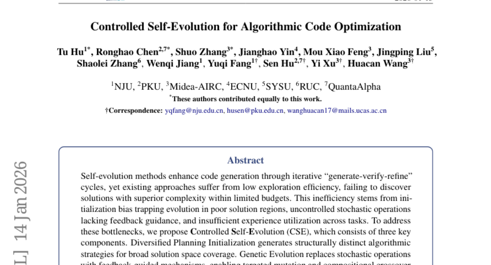
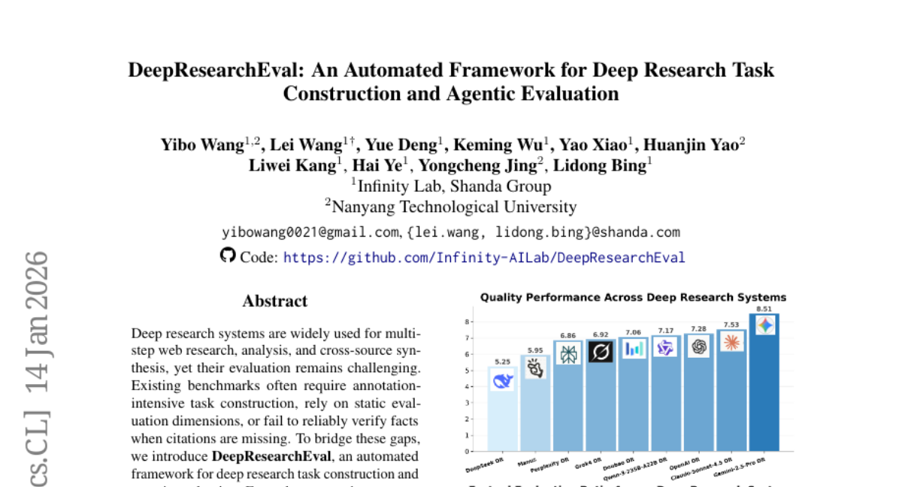
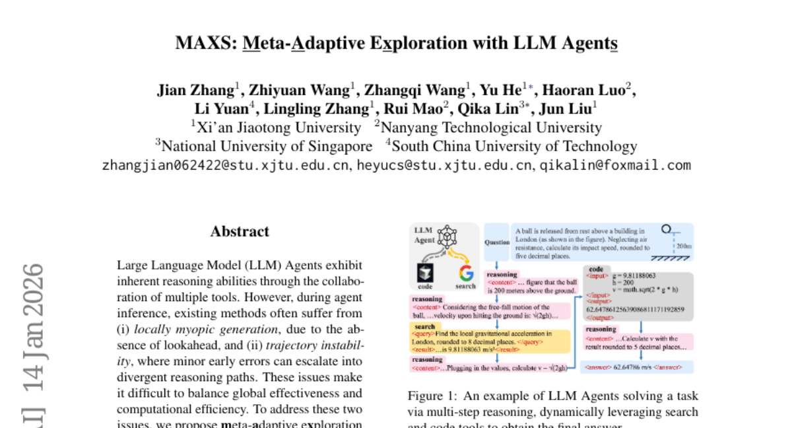
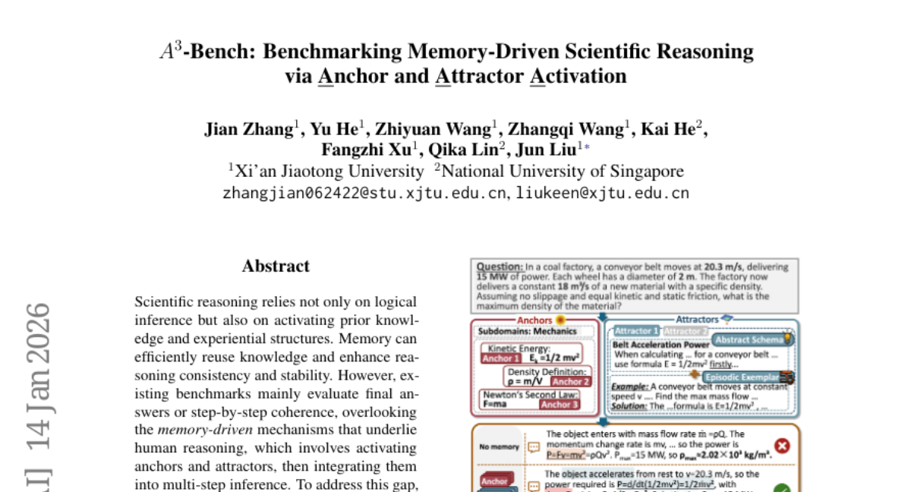
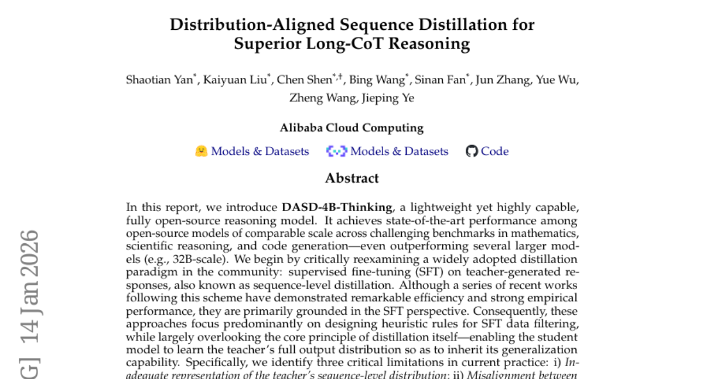

# 2026-01-15 Daily Papers (Top 5)

## 1. [Controlled Self-Evolution for Algorithmic Code Optimization](https://huggingface.co/papers/2601.07348)
**Upvotes**: 93

### 📌 요약
코드 최적화를 위한 자가 진화 방법론의 낮은 탐색 효율 문제를 해결하기 위해, 초기화 다양화, 피드백 기반 유전 진화, 계층적 메모리를 활용하는 제어된 자가 진화(CSE) 프레임워크를 제안하고, 이를 통해 기존 모델 대비 우수한 성능을 입증했다.

### 📝 초록 (번역)
자가 진화(Self-evolution) 방법론은 반복적인 '생성-검증-개선' 주기를 통해 코드 생성 능력을 향상시키지만, 기존 접근 방식들은 제한된 예산 내에서 더 복잡하고 우수한 해답을 발견하는 데 실패하는 낮은 탐색 효율 문제를 겪습니다. 이러한 비효율성은 진화를 좋지 않은 해답 영역에 갇히게 만드는 초기화 편향, 피드백 유도가 부족한 무작위적인 확률적 연산, 그리고 태스크 전반에 걸친 경험 활용 부족에서 비롯됩니다. 이러한 병목 현상을 해결하기 위해, 우리는 세 가지 핵심 요소로 구성된 제어된 자가 진화(Controlled Self-Evolution, CSE)를 제안합니다. 첫째, '다각화된 계획 초기화(Diversified Planning Initialization)'는 광범위한 해답 공간 탐색을 위해 구조적으로 구별되는 알고리즘 전략들을 생성합니다. 둘째, '유전적 진화(Genetic Evolution)'는 확률적 연산을 피드백 기반 메커니즘으로 대체하여, 목표 지향적인 변이(mutation)와 구성적 교차(compositional crossover)를 가능하게 합니다. 셋째, '계층적 진화 메모리(Hierarchical Evolution Memory)'는 태스크 간 및 태스크 내 수준 모두에서 성공 및 실패 경험을 포착합니다. EffiBench-X에 대한 실험 결과, CSE는 다양한 LLM 백본에서 모든 기준선 대비 지속적으로 우수한 성능을 보였습니다. 나아가, CSE는 초기 단계부터 더 높은 효율성을 달성하며 진화 전반에 걸쳐 지속적인 개선을 유지함을 입증했습니다.

### 🔑 핵심 포인트
- 초기화 편향 문제를 해결하고 광범위한 해답 공간을 탐색하기 위한 '다각화된 계획 초기화(Diversified Planning Initialization)' 방법론을 도입하였다.
- 비효율적인 확률적 연산을 피드백 기반 메커니즘으로 대체하여, 목표 지향적인 변이 및 교차를 가능하게 하는 '유전적 진화(Genetic Evolution)'를 활용하였다.
- 태스크 간 및 태스크 내 성공/실패 경험을 모두 포착하고 활용하는 '계층적 진화 메모리(Hierarchical Evolution Memory)'를 구축하여 경험 활용도를 극대화하였다.

---

## 2. [DeepResearchEval: An Automated Framework for Deep Research Task Construction and Agentic Evaluation](https://huggingface.co/papers/2601.09688)
**Upvotes**: 89

### 📌 요약
심층 연구 시스템의 평가 난제를 해결하기 위해, 현실적인 연구 과제를 자동 생성하고 과제별로 동적인 평가 기준 및 능동적 사실 확인 기능을 갖춘 에이전트 기반 프레임워크인 DeepResearchEval을 제안한다.

### 📝 초록 (번역)
심층 연구 시스템은 다단계 웹 조사, 분석, 그리고 복합 출처 통합에 널리 사용되지만, 이들을 평가하는 것은 여전히 어렵습니다. 기존 벤치마크는 종종 주석 작업이 집중적으로 필요한 과제 구성을 요구하거나, 정적인 평가 차원에 의존하거나, 인용이 누락되었을 때 사실을 신뢰성 있게 검증하지 못하는 경우가 많습니다. 이러한 격차를 해소하기 위해, 우리는 심층 연구 과제 구성 및 에이전트 기반 평가를 위한 자동화된 프레임워크인 DeepResearchEval을 소개합니다. 과제 구성을 위해, 우리는 다양한 사용자 프로필에 기반하여 현실적이고 복잡한 연구 과제를 생성하는 페르소나 기반 파이프라인을 제안하며, 다중 출처 증거 통합과 외부 검색을 필요로 하는 과제만을 남기기 위해 '과제 적격성(Task Qualification)' 및 '검색 필요성(Search Necessity)'이라는 2단계 필터를 적용합니다. 평가를 위해서는 두 가지 구성 요소를 가진 에이전트 기반 파이프라인을 제안합니다. 첫 번째는 생성된 각 과제에 맞춰 동적으로 과제별 평가 차원, 기준, 가중치를 도출하는 '적응형 포인트별 품질 평가(Adaptive Point-wise Quality Evaluation)'이며, 두 번째는 인용이 누락된 경우에도 웹 검색을 통해 보고서 진술을 자율적으로 추출하고 검증하는 '능동적 사실 확인(Active Fact-Checking)'입니다.

### 🔑 핵심 포인트
- 심층 연구 시스템 평가의 기존 문제점(주석 의존성, 정적 평가 기준, 인용 없는 사실 검증 실패)을 해결하기 위한 자동화된 에이전트 기반 프레임워크 DeepResearchEval을 제시한다.
- 과제 구성 단계에서 페르소나 기반 파이프라인을 통해 현실적이고 복잡한 과제를 생성하며, '과제 적격성' 및 '검색 필요성' 2단계 필터를 적용하여 다중 출처 통합과 외부 검색이 필수적인 과제만 선별한다.
- 평가 단계에서는 과제별로 평가 기준과 가중치를 동적으로 도출하는 적응형 포인트별 품질 평가(APQE)와 인용 유무에 관계없이 자율적으로 사실을 검증하는 능동적 사실 확인(AFC)을 도입하여 평가의 신뢰성과 유연성을 높인다.

---

## 3. [MAXS: Meta-Adaptive Exploration with LLM Agents](https://huggingface.co/papers/2601.09259)
**Upvotes**: 80

### 📌 요약
LLM 에이전트의 근시안적 추론과 궤적 불안정성 문제를 해결하기 위해, MAXS는 미리보기 탐색과 안정성 지표를 사용하여 전역적으로 효과적이면서도 계산적으로 효율적인 추론 단계를 선택하는 메타 적응형 탐색 프레임워크입니다.

### 📝 초록 (번역)
대규모 언어 모델(LLM) 에이전트는 다중 도구의 협력을 통해 고유한 추론 능력을 발휘합니다. 그러나 에이전트 추론 과정에서 기존 방법론들은 (i) 미리보기(lookahead)의 부재로 인한 국소적으로 근시안적인 생성, 그리고 (ii) 사소한 초기 오류가 발산적인 추론 경로로 확대될 수 있는 궤적 불안정성이라는 문제점을 자주 겪습니다. 이러한 문제들은 전역적 효과성과 계산 효율성 사이의 균형을 맞추기 어렵게 만듭니다. 이 두 가지 문제를 해결하기 위해, 우리는 도구 실행과 추론 계획을 유연하게 통합하는 LLM 에이전트 기반의 메타 적응형 추론 프레임워크인 MAXS(Meta-Adaptive Exploration with LLM Agents)를 제안합니다. MAXS는 미리보기 전략을 사용하여 추론 경로를 몇 단계 앞서 확장하고, 도구 사용의 이점 값(advantage value)을 추정하며, 단계 일관성 분산(step consistency variance)과 단계 간 추세 기울기(inter-step trend slopes)를 결합하여 안정적이고, 일관적이며, 높은 가치를 지닌 추론 단계를 공동으로 선택합니다. 또한, 경로 일관성이 달성되면 추가적인 롤아웃(rollouts)을 중단하여 계산 비용을 제어하는 궤적 수렴 메커니즘을 도입하여, 다중 도구 추론에서 자원 효율성과 전역적 효과성의 균형을 가능하게 합니다. 우리는 세 가지 기반 모델(MiMo-VL-7B, Qwen2.5-VL-7B, Qwen2.5-VL-32B)과 다섯 가지 데이터셋에 걸쳐 광범위한 실증적 연구를 수행했으며, MAXS가 성능과 추론 효율성 모두에서 기존 방법들보다 지속적으로 우수함을 입증했습니다. 추가 분석을 통해 우리의 미리보기 전략과 도구 사용의 효과가 확인되었습니다.

### 🔑 핵심 포인트
- 기존 LLM 에이전트 추론의 주요 문제점인 미리보기 부재로 인한 '국소적 근시안성'과 초기 오류 증폭으로 인한 '궤적 불안정성'을 해결하는 것을 목표로 함.
- 미리보기 전략을 통해 추론 경로를 확장하고 도구 사용의 이점 값(advantage value)을 예측하며, 단계 일관성 분산 및 추세 기울기를 활용하여 안정적이고 고가치 추론 단계를 공동으로 선택하는 메커니즘을 도입.
- 경로 일관성 달성 시 롤아웃을 중단하는 궤적 수렴 메커니즘을 통해 계산 비용을 효율적으로 제어하여, 성능과 추론 효율성 측면에서 기존 방법론 대비 일관되게 우수한 결과를 입증.

---

## 4. [A^3-Bench: Benchmarking Memory-Driven Scientific Reasoning via Anchor and Attractor Activation](https://huggingface.co/papers/2601.09274)
**Upvotes**: 74

### 📌 요약
이 논문은 기존 벤치마크가 간과했던 메모리 기반의 과학적 추론 능력을 앵커(Anchor)와 어트랙터(Attractor) 활성화를 통해 이중 척도로 평가하는 새로운 벤치마크인 A^3-Bench를 제안하고 검증한다.

### 📝 초록 (번역)
과학적 추론은 논리적 추론뿐만 아니라 선행 지식(prior knowledge) 및 경험적 구조(experiential structures)를 활성화하는 데 의존합니다. 메모리는 지식을 효율적으로 재사용하고 추론의 일관성과 안정성을 향상시킬 수 있습니다. 하지만 기존의 벤치마크들은 주로 최종 답변이나 단계별 일관성만을 평가하며, 인간 추론의 근간을 이루는 기억 기반 메커니즘—즉, 앵커(anchors)와 어트랙터(attractors)를 활성화하고 이를 다단계 추론(multi-step inference)에 통합하는 과정—을 간과하고 있습니다. 이러한 격차를 해소하기 위해, 우리는 앵커 및 어트랙터 활성화(Anchor and Attractor Activation)에 기반하여 이중 척도의 메모리 기반 활성화를 통해 과학적 추론을 평가하도록 설계된 벤치마크인 A^3-Bench(https://a3-bench.github.io)를 제안합니다. 첫째, 우리는 SAPM 프로세스(주제, 앵커 및 어트랙터, 문제, 메모리 개발)를 사용하여 2,198개의 과학 추론 문제를 도메인 전반에 걸쳐 주석 처리했습니다. 둘째, 우리는 메모리 활성화율을 측정하기 위한 AAUI(Anchor--Attractor Utilization Index) 지표와 함께 앵커와 어트랙터를 활용하는 이중 척도 메모리 평가 프레임워크를 도입합니다. 마지막으로, 다양한 기본 모델과 패러다임을 사용한 실험을 통해 A^3-Bench를 검증하고, 메모리 활성화가 추론 성능에 미치는 영향을 분석하여 메모리 기반 과학 추론에 대한 심층적인 통찰을 제공합니다.

### 🔑 핵심 포인트
- 기존 벤치마크의 한계였던 메모리 기반 과학 추론 메커니즘을 앵커와 어트랙터 활성화라는 이중 척도로 평가하는 벤치마크(A^3-Bench)를 제안한다.
- 주제, 앵커 및 어트랙터, 문제, 메모리 개발을 포함하는 SAPM 프로세스를 사용하여 2,198개의 과학 추론 문제로 구성된 주석 처리된 데이터셋을 구축한다.
- 앵커와 어트랙터 활용에 기반한 이중 척도 메모리 평가 프레임워크와 메모리 활성화율 측정 지표인 AAUI(Anchor--Attractor Utilization Index)를 제시한다.

---

## 5. [Distribution-Aligned Sequence Distillation for Superior Long-CoT Reasoning](https://huggingface.co/papers/2601.09088)
**Upvotes**: 43

### 📌 요약
기존 시퀀스 레벨 증류 방식의 한계(분포 표현 부족, 교사-학생 능력 불일치, 노출 편향)를 극복하기 위한 분포 정렬 시퀀스 증류(DASD) 방법론을 제안하며, 이를 적용한 경량 모델 DASD-4B-Thinking이 적은 데이터로도 SOTA 추론 성능을 달성했음을 보고한다.

### 📝 초록 (번역)
본 보고서에서 우리는 경량이면서도 매우 우수한 성능을 가진 완전 오픈 소스 추론 모델인 DASD-4B-Thinking을 소개합니다. 이 모델은 수학, 과학 추론, 코드 생성 등 까다로운 벤치마크에서 유사 규모의 오픈 소스 모델 중 SOTA 성능을 달성했으며, 심지어 일부 더 큰 모델들보다도 우수한 결과를 보여줍니다. 우리는 커뮤니티에서 널리 채택된 증류 패러다임, 즉 교사가 생성한 응답에 대한 SFT(시퀀스 레벨 증류)를 비판적으로 재검토하는 것으로 시작합니다. 이 방식은 효율성과 강력한 경험적 성능을 보여주었지만, 주로 SFT 관점에 기반을 두고 있습니다. 그 결과, 이러한 접근 방식들은 주로 SFT 데이터 필터링을 위한 휴리스틱 규칙 설계에 집중하는 반면, 증류 자체의 핵심 원칙, 즉 학생 모델이 교사의 일반화 능력을 물려받기 위해 교사의 전체 출력 분포를 학습하도록 하는 것은 대체로 간과하고 있습니다. 구체적으로, 우리는 현재 관행에서 세 가지 중요한 한계를 확인했습니다. i) 교사의 시퀀스 레벨 분포에 대한 불충분한 표현; ii) 교사의 출력 분포와 학생의 학습 능력 간의 불일치; 그리고 iii) 교사 강제 학습(teacher-forced training)과 자기회귀 추론(autoregressive inference)에서 발생하는 노출 편향(exposure bias)입니다. 요약하자면, 이러한 단점들은 증류 과정 전반에 걸쳐 명시적인 교사-학생 상호작용이 체계적으로 부재함을 반영하며, 증류의 본질이 충분히 활용되지 못하고 있음을 의미합니다. 이러한 문제들을 해결하기 위해, 우리는 향상된 시퀀스 레벨 증류 학습 파이프라인을 집합적으로 구성하는 몇 가지 방법론적 혁신을 제안합니다. 놀랍게도, DASD-4B-Thinking은 기존의 대부분의 오픈 소스 노력들이 사용한 샘플 수보다 훨씬 적은 단 448K의 학습 샘플만을 사용하여 경쟁력 있는 결과를 얻습니다. 커뮤니티 연구를 지원하기 위해, 우리는 모델과 학습 데이터셋을 공개적으로 발표합니다.

### 🔑 핵심 포인트
- DASD-4B-Thinking은 4B 규모의 오픈 소스 모델 중 수학, 과학 추론 및 코드 생성 벤치마크에서 SOTA 성능을 달성했으며, 기존 모델보다 훨씬 적은 448K 샘플만으로 학습되었습니다.
- 기존의 시퀀스 레벨 증류 방식은 SFT(Supervised Fine-Tuning) 데이터 필터링에 주로 초점을 맞추어, 학생 모델이 교사의 일반화 능력을 물려받도록 돕는 '전체 출력 분포 학습'이라는 증류의 핵심 원칙을 간과하고 있습니다.
- 현재 증류의 세 가지 주요 한계점(교사 분포 불충분 표현, 교사-학생 능력 불일치, 노출 편향)을 해결하기 위해, 명시적인 교사-학생 상호작용을 통합한 향상된 분포 정렬 시퀀스 증류(DASD) 파이프라인이 제안됩니다.

---

