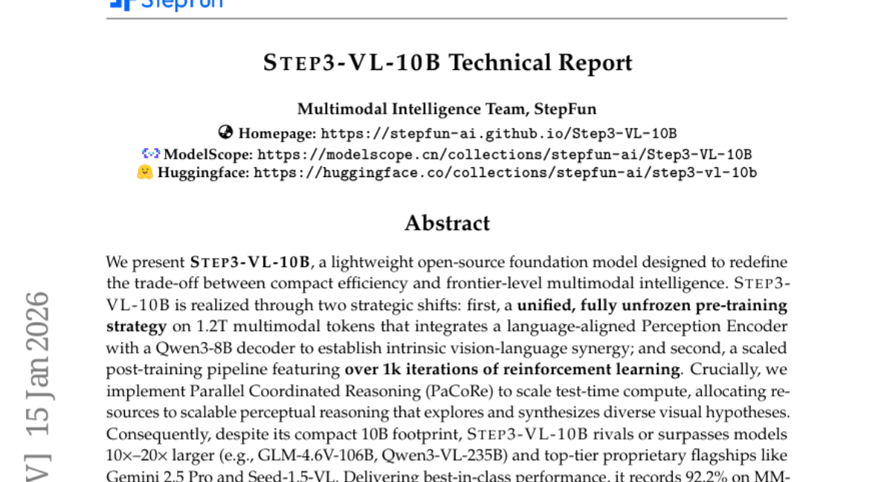
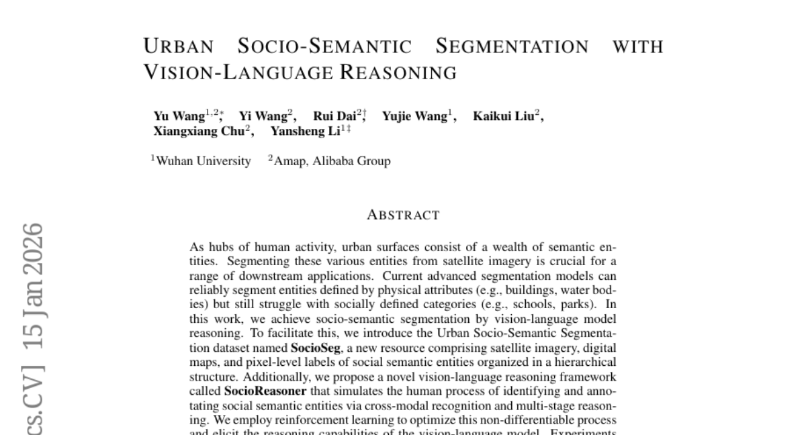
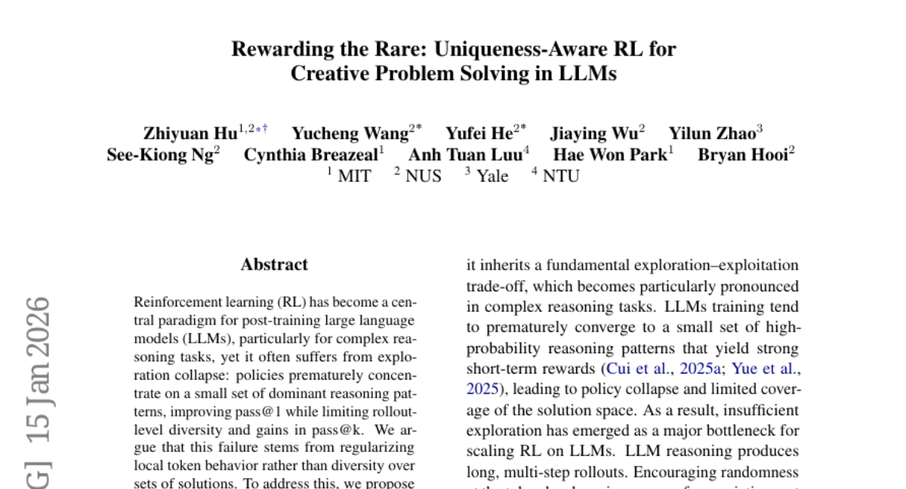
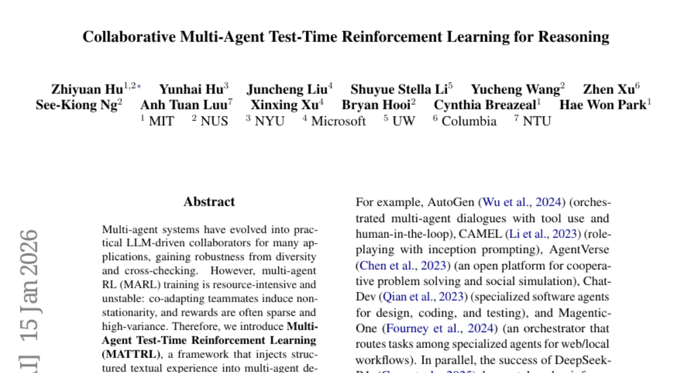
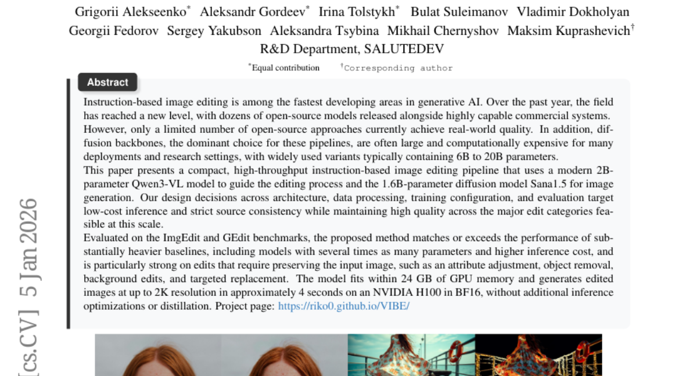

# 2026-01-16 Daily Papers (Top 5)

## 1. [STEP3-VL-10B Technical Report](https://huggingface.co/papers/2601.09668)
**Upvotes**: 160

### 📌 요약
경량 오픈소스 기반 모델인 STEP3-VL-10B는 10B 규모에도 불구하고 통합 훈련과 PaCoRe 추론 전략을 통해 훨씬 큰 모델들을 능가하는 최고 수준의 멀티모달 지능을 제공한다.

### 📝 초록 (번역)
우리는 압축된 효율성과 최첨단 멀티모달 지능 간의 트레이드오프를 재정의하도록 설계된 경량 오픈소스 기반 모델인 STEP3-VL-10B를 소개합니다. STEP3-VL-10B는 두 가지 전략적 변화를 통해 구현되었습니다. 첫째, 언어 정렬된 인식 인코더를 Qwen3-8B 디코더와 통합하여 본질적인 비전-언어 시너지를 확립하는 1.2조 멀티모달 토큰에 대한 통합되고 완전히 동결되지 않은(fully unfrozen) 사전 훈련 전략입니다. 둘째, 1,000회 이상의 강화 학습 반복을 특징으로 하는 확장된 사후 훈련(post-training) 파이프라인입니다. 결정적으로, 우리는 테스트 시간 계산을 확장하기 위해 병렬 조정 추론(PaCoRe)을 구현하여, 다양한 시각적 가설을 탐색하고 통합하는 확장 가능한 지각 추론에 자원을 할당합니다. 결과적으로, 10B의 컴팩트한 규모에도 불구하고 STEP3-VL-10B는 10배에서 20배 더 큰 모델(예: GLM-4.6V-106B, Qwen3-VL-235B)과 Gemini 2.5 Pro 및 Seed-1.5-VL과 같은 최고 수준의 독점 플래그십 모델들과 경쟁하거나 이를 능가합니다. 동급 최고의 성능을 제공하며, MMBench에서 92.2%, MMMU에서 80.11%를 기록하는 동시에, AIME2025에서 94.43%, MathVision에서 75.95%를 기록하며 복잡한 추론 능력이 뛰어남을 보였습니다. 우리는 커뮤니티에 강력하고 효율적이며 재현 가능한 기준선을 제공하기 위해 전체 모델 제품군을 공개합니다.

### 🔑 핵심 포인트
- 10B의 경량 모델임에도 불구하고, 10배에서 20배 더 큰 대규모 모델 및 최고 수준의 독점 모델(Gemini 2.5 Pro 등)과 필적하거나 이를 능가하는 멀티모달 성능을 달성했다.
- 언어 정렬된 인식 인코더를 Qwen3-8B 디코더와 통합하여 1.2조 멀티모달 토큰으로 완전히 동결되지 않은(fully unfrozen) 통합된 사전 훈련을 수행했으며, 1,000회 이상 강화 학습을 포함하는 사후 훈련 파이프라인을 적용했다.
- 다양한 시각적 가설을 탐색하고 합성하는 확장 가능한 지각 추론을 위해 테스트 시간에 병렬 조정 추론(Parallel Coordinated Reasoning, PaCoRe) 기법을 구현했다.

---

## 2. [Urban Socio-Semantic Segmentation with Vision-Language Reasoning](https://huggingface.co/papers/2601.10477)
**Upvotes**: 147

### 📌 요약
도시 위성 이미지에서 학교나 공원과 같은 사회적 의미론적 엔티티를 분할하기 위해, 새로운 데이터셋(SocioSeg)과 강화 학습을 통해 최적화된 비전-언어 추론 프레임워크(SocioReasoner)를 제안하고 그 성능을 입증한다.

### 📝 초록 (번역)
인간 활동의 중심지인 도시 표면은 풍부한 의미론적 엔티티들로 구성되어 있습니다. 이러한 다양한 엔티티들을 위성 이미지에서 분할하는 것은 광범위한 다운스트림 애플리케이션에 매우 중요합니다. 현재의 첨단 분할 모델들은 물리적 속성(예: 건물, 수역)으로 정의된 엔티티들은 안정적으로 분할할 수 있지만, 사회적으로 정의된 범주(예: 학교, 공원)에 대해서는 여전히 어려움을 겪습니다. 본 연구에서는 비전-언어 모델 추론을 통해 사회적 의미론적 분할(socio-semantic segmentation)을 달성합니다. 이를 촉진하기 위해, 우리는 위성 이미지, 디지털 지도, 그리고 계층적 구조로 조직된 사회적 의미론적 엔티티의 픽셀 수준 레이블을 포함하는 새로운 자원인 Urban Socio-Semantic Segmentation 데이터셋, SocioSeg를 소개합니다. 또한, 우리는 교차 모달 인식과 다단계 추론을 통해 사회적 의미론적 엔티티를 식별하고 주석을 다는 인간의 과정을 시뮬레이션하는 새로운 비전-언어 추론 프레임워크인 SocioReasoner를 제안합니다. 우리는 이 미분 불가능한 프로세스를 최적화하고 비전-언어 모델의 추론 능력을 이끌어내기 위해 강화 학습을 사용합니다. 실험은 우리의 접근 방식이 최신 모델 대비 성능 향상과 강력한 제로샷 일반화 능력을 보임을 입증합니다. 우리의 데이터셋과 코드는 https://github.com/AMAP-ML/SocioReasoner에서 이용 가능합니다.

### 🔑 핵심 포인트
- 기존 모델이 어려움을 겪는, 학교나 공원 등 사회적으로 정의된 범주(사회적 의미론적 엔티티)의 도시 위성 이미지 분할 문제를 해결하고자 한다.
- 위성 이미지, 디지털 지도, 픽셀 수준 레이블을 통합하고 계층적 구조로 조직된 새로운 Urban Socio-Semantic Segmentation 데이터셋인 'SocioSeg'를 구축했다.
- 인간의 주석 과정을 모방하며 교차 모달 인식 및 다단계 추론을 수행하는 비전-언어 추론 프레임워크 'SocioReasoner'를 제안하고, 강화 학습(RL)을 사용하여 이 비미분 가능한 프로세스를 최적화했다.

---

## 3. [Rewarding the Rare: Uniqueness-Aware RL for Creative Problem Solving in LLMs](https://huggingface.co/papers/2601.08763)
**Upvotes**: 124

### 📌 요약
LLM의 탐색 붕괴 문제를 해결하기 위해, 희귀하고 독창적인 고수준 전략을 가진 정답 솔루션에 더 높은 보상을 주는 '독창성 인식 강화 학습(UARL)'을 제안하여 pass@k 성능을 향상시킨다.

### 📝 초록 (번역)
강화 학습(RL)은 특히 복잡한 추론 작업을 위해 대규모 언어 모델(LLM)을 후속 훈련하는 데 핵심 패러다임이 되었지만, 종종 탐색 붕괴(exploration collapse)로 어려움을 겪습니다. 이는 정책이 소수의 지배적인 추론 패턴에 조기에 집중하여 pass@1은 개선하지만, 롤아웃 수준의 다양성과 pass@k에서의 이득을 제한하기 때문입니다. 우리는 이러한 실패가 솔루션 집합 전반의 다양성보다는 국소적인 토큰 행동을 정규화하는 데서 비롯된다고 주장합니다. 이를 해결하기 위해, 우리는 희귀한 고수준 전략을 보이는 정답 솔루션에 명시적으로 보상을 제공하는 롤아웃 수준의 목표인 '독창성 인식 강화 학습(Uniqueness-Aware Reinforcement Learning)'을 제안합니다. 우리의 방법은 LLM 기반 평가자를 사용하여 동일한 문제에 대한 롤아웃들을 표면적인 변화를 무시하고 고수준 솔루션 전략에 따라 군집화하며, 군집 크기에 반비례하여 정책 이점(advantage)의 가중치를 재조정합니다. 그 결과, 정확하지만 새로운 전략은 중복되는 전략보다 더 높은 보상을 받게 됩니다. 수학, 물리, 의료 추론 벤치마크 전반에 걸쳐, 우리의 접근 방식은 pass@1을 희생하지 않으면서도 대규모 샘플링 예산에서 pass@k를 일관되게 개선하고 pass@k 곡선 아래 면적(AUC@K)을 증가시키며, 동시에 탐색을 유지하고 더 다양한 솔루션 전략을 대규모로 발굴합니다.

### 🔑 핵심 포인트
- 기존 RL이 LLM에서 겪는 탐색 붕괴 문제를 해결하고, 국소적인 토큰 정규화 대신 솔루션 집합 다양성 확보를 목표로 한다.
- LLM 기반 평가자를 사용하여 표면적 차이를 무시하고 롤아웃을 고수준 솔루션 전략에 따라 군집화한 후, 군집 크기에 반비례하여 보상을 재조정하는 '독창성 인식 강화 학습(UARL)'을 도입한다.
- UARL은 희귀한 전략을 가진 정답에 더 높은 보상을 부여하여 탐색을 유지시키며, 수학, 물리, 의료 추론 벤치마크에서 pass@1을 유지하면서 pass@k 및 AUC@K 성능을 일관되게 향상시킨다.

---

## 4. [Collaborative Multi-Agent Test-Time Reinforcement Learning for Reasoning](https://huggingface.co/papers/2601.09667)
**Upvotes**: 72

### 📌 요약
본 논문은 기존 다중 에이전트 강화 학습(MARL)의 불안정성을 해결하기 위해, 훈련 없이 추론 시점에 구조화된 텍스트 경험을 주입하여 안정적이고 효율적인 다중 에이전트 추론 성능을 향상시키는 MATTRL 프레임워크를 제안한다.

### 📝 초록 (번역)
다중 에이전트 시스템은 다양성과 교차 검증을 통해 견고성을 확보하며, 많은 애플리케이션에서 LLM 기반의 협력자로 발전했습니다. 하지만 다중 에이전트 강화 학습(MARL) 훈련은 자원 집약적이고 불안정하며, 팀원들의 상호 적응은 비정상성(non-stationarity)을 유발하고, 보상은 종종 희소하고 분산이 높습니다. 따라서 본 논문은 추론 시점에 다중 에이전트 협의에 구조화된 텍스트 경험을 주입하는 프레임워크인 다중 에이전트 테스트 시간 강화 학습(Multi-Agent Test-Time Reinforcement Learning, MATTRL)을 소개합니다. MATTRL은 다중 턴 논의를 위해 전문가들로 구성된 다중 전문가 팀을 형성하고, 테스트 시점의 경험을 검색 및 통합하며, 최종 결정을 위해 합의에 도달합니다. 또한 우리는 턴(turn) 수준의 경험 풀을 구성하고 이를 대화에 다시 주입하기 위한 기여도 할당(credit assignment) 방식을 연구합니다. 의학, 수학, 교육 분야의 까다로운 벤치마크 전반에서 MATTRL은 다중 에이전트 기준선보다 평균 3.67%, 유사한 단일 에이전트 기준선보다 8.67%의 정확도를 향상시킵니다. 절제 연구(ablation studies)는 다양한 기여도 할당 방식을 조사하고 이것이 훈련 결과에 미치는 영향을 상세히 비교합니다. MATTRL은 튜닝(tuning) 없이도 분포 변화에 강건한 다중 에이전트 추론을 위한 안정적이고 효과적이며 효율적인 경로를 제공합니다.

### 🔑 핵심 포인트
- 기존 다중 에이전트 강화 학습(MARL)의 훈련 난이도(비정상성, 희소 보상 등) 문제를 해결하기 위해 추론 시점에 작동하는 MATTRL(Multi-Agent Test-Time Reinforcement Learning) 프레임워크를 도입하였다.
- MATTRL은 다중 전문가 팀을 구성하고 테스트 시점의 텍스트 경험을 검색 및 통합하며, 턴 수준의 기여도 할당을 통해 경험 풀을 구성하고 대화에 재주입하는 메커니즘을 사용한다.
- 의료, 수학, 교육 등 다양한 벤치마크에서 MATTRL은 다중 에이전트 기준선 대비 평균 3.67%의 정확도 향상을 달성했으며, 튜닝 과정 없이도 분포 변화에 강건한 추론 능력을 제공한다.

---

## 5. [VIBE: Visual Instruction Based Editor](https://huggingface.co/papers/2601.02242)
**Upvotes**: 53

### 📌 요약
VIBE는 20억 파라미터 Qwen3-VL과 16억 파라미터 Sana1.5를 결합하여, 기존의 무거운 모델보다 훨씬 적은 파라미터로도 높은 품질과 빠른 처리량, 엄격한 소스 일관성을 달성하는 경량 시각 명령 기반 이미지 편집 파이프라인입니다.

### 📝 초록 (번역)
명령 기반 이미지 편집은 생성형 AI 분야에서 가장 빠르게 발전하는 영역 중 하나입니다. 지난 한 해 동안, 이 분야는 매우 유능한 상업적 시스템과 더불어 수십 개의 오픈 소스 모델이 출시되면서 새로운 차원에 도달했습니다. 하지만 현재 실제 환경 수준의 품질을 달성하는 오픈 소스 접근 방식은 극히 제한적입니다. 더욱이, 이러한 파이프라인에서 지배적으로 사용되는 디퓨전 백본 모델은 일반적으로 60억 개에서 200억 개의 파라미터를 포함하여, 많은 배포 환경 및 연구 설정에서 크고 계산 비용이 많이 듭니다. 본 논문은 이미지 편집 과정을 안내하는 최신 20억 개 파라미터의 Qwen3-VL 모델과 이미지 생성을 위한 16억 개 파라미터의 디퓨전 모델 Sana1.5를 사용하여, 작고 처리량이 높은 명령 기반 이미지 편집 파이프라인을 제시합니다. 아키텍처, 데이터 처리, 훈련 구성 및 평가 전반에 걸친 설계 결정은 낮은 추론 비용과 엄격한 원본 일관성을 목표로 하며, 이 규모에서 가능한 주요 편집 범주에 걸쳐 높은 품질을 유지합니다. ImgEdit 및 GEdit 벤치마크에서 평가했을 때, 제안된 방법은 파라미터 수가 몇 배 더 많고 추론 비용이 높은 훨씬 무거운 기준 모델들의 성능과 일치하거나 능가하며, 특히 속성 조정, 객체 제거, 배경 편집 및 표적 대체와 같이 입력 이미지 보존이 필요한 편집에서 강력한 성능을 보였습니다. 이 모델은 24GB의 GPU 메모리 내에서 작동하며, 추가적인 추론 최적화나 증류(distillation) 없이도 NVIDIA H100에서 BF16 환경 기준 약 4초 만에 최대 2K 해상도의 편집된 이미지를 생성합니다.

### 🔑 핵심 포인트
- 기존 60억~200억 파라미터의 무거운 디퓨전 모델 대신, 20억 파라미터 Qwen3-VL과 16억 파라미터 Sana1.5를 결합하여 고품질을 유지하면서도 파라미터 수를 대폭 줄인(총 약 3.6B) 경량 편집 파이프라인을 제안했습니다.
- ImgEdit 및 GEdit 벤치마크 평가 결과, VIBE는 파라미터 수와 추론 비용이 훨씬 높은 기존 기준 모델들과 동등하거나 그 이상의 성능을 달성했으며, 특히 원본 일관성(Source Consistency)이 중요한 편집 작업(속성 조정, 객체 제거 등)에서 강점을 보였습니다.
- 낮은 추론 비용과 높은 처리량을 목표로 설계되었으며, 24GB GPU 메모리 내에서 구동되며 NVIDIA H100 환경에서 별도의 최적화 없이도 약 4초 만에 2K 해상도의 편집된 이미지를 생성할 수 있습니다.

---

