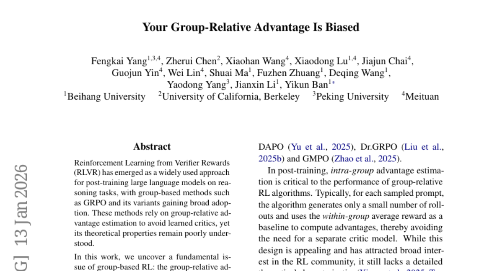
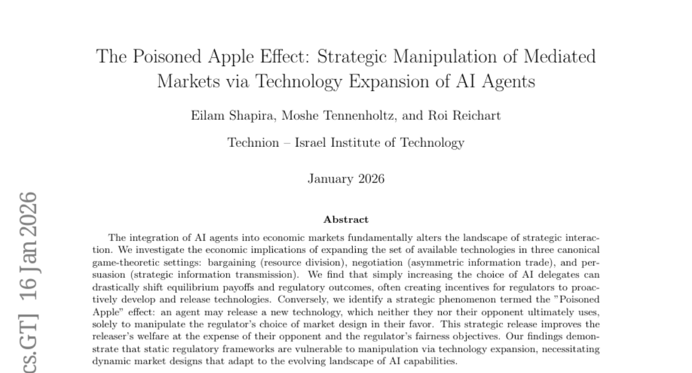
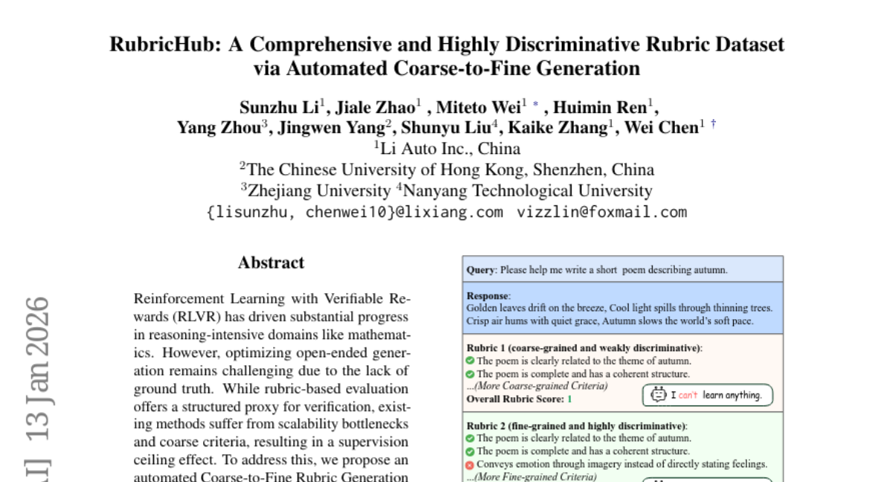
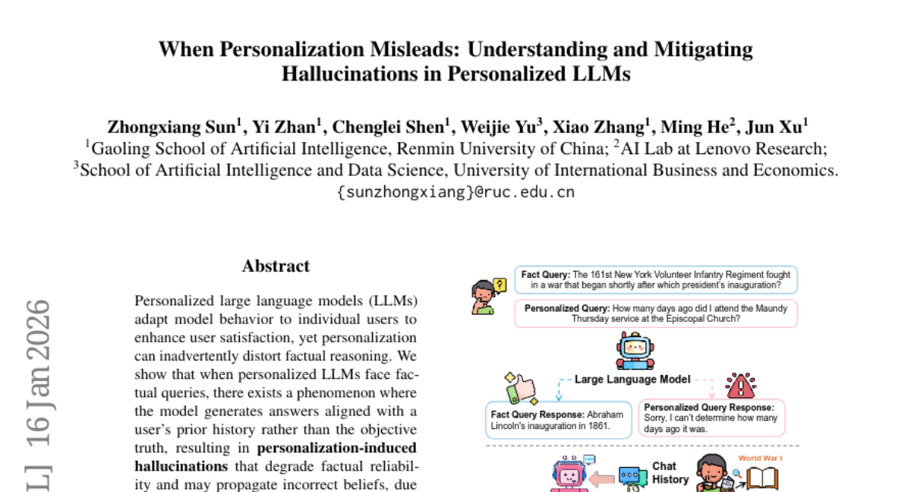

# 2026-01-19 Daily Papers (Top 5)

## 1. [Your Group-Relative Advantage Is Biased](https://huggingface.co/papers/2601.08521)
**Upvotes**: 94

### 📌 요약
그룹 기반 RLVR 방법론에서 내재적인 편향을 갖는 그룹 상대적 이점 추정기가 어려운 문제에 대해서는 이점을 과소평가하고 쉬운 문제에 대해서는 과대평가하는 문제를 해결하기 위해, 본 논문은 훈련 역학을 고려한 적응형 재가중 방식인 HA-DW(History-Aware Adaptive Difficulty Weighting)를 제안하여 성능 향상을 입증한다.

### 📝 초록 (번역)
검증자 보상 기반 강화 학습(Reinforcement Learning from Verifier Rewards, RLVR)은 추론 작업에 대한 대규모 언어 모델의 후속 훈련에 널리 사용되는 접근 방식이며, GRPO 및 그 변형과 같은 그룹 기반 방법론이 광범위하게 채택되고 있습니다. 이러한 방법들은 학습된 비평가(critics)를 피하기 위해 그룹 상대적 이점 추정(group-relative advantage estimation)에 의존하지만, 그 이론적 속성은 아직 제대로 이해되지 않고 있습니다.
본 연구에서 우리는 그룹 기반 RL의 근본적인 문제점을 발견했습니다. 즉, 그룹 상대적 이점 추정기는 참된 (기대) 이점과 비교했을 때 본질적으로 편향되어 있다는 것입니다. 우리는 이 추정기가 어려운 프롬프트에 대해서는 이점을 체계적으로 과소평가하고 쉬운 프롬프트에 대해서는 과대평가하여 탐색과 활용의 균형을 해친다는 것을 보여주는 최초의 이론적 분석을 제공합니다. 이 문제를 해결하기 위해, 우리는 진화하는 난이도 기준점(difficulty anchor)과 훈련 역학을 기반으로 이점 추정치를 조정하는 적응형 재가중 방식인 HA-DW(History-Aware Adaptive Difficulty Weighting)를 제안합니다. 이론적 분석과 다섯 가지 수학적 추론 벤치마크에 대한 실험 모두 HA-DW가 GRPO 및 그 변형에 통합될 때 일관되게 성능을 향상시킨다는 것을 입증합니다. 우리의 결과는 편향된 이점 추정을 교정하는 것이 강력하고 효율적인 RLVR 훈련에 중요하다는 것을 시사합니다.

### 🔑 핵심 포인트
- 그룹 기반 RL에서 사용하는 그룹 상대적 이점 추정기(group-relative advantage estimator)는 참된 (기대) 이점에 비해 본질적인 편향을 갖는다는 것을 이론적으로 규명하였다.
- 이러한 편향은 어려운 프롬프트에 대한 이점은 체계적으로 과소평가하고 쉬운 프롬프트에 대한 이점은 과대평가함으로써 불균형적인 탐색 및 활용을 야기한다.
- 편향된 이점 추정을 교정하기 위해 훈련 역학 및 난이도 기준점을 활용하는 적응형 재가중 방식인 HA-DW(History-Aware Adaptive Difficulty Weighting)를 제안하였으며, 이를 통해 GRPO 계열 방법론의 성능을 일관되게 향상시켰다.

---

## 2. [The Poisoned Apple Effect: Strategic Manipulation of Mediated Markets via Technology Expansion of AI Agents](https://huggingface.co/papers/2601.11496)
**Upvotes**: 38

### 📌 요약
AI 에이전트의 기술 확장은 시장 균형을 전략적으로 조작하는 '독이 든 사과' 효과를 유발하여, 정적인 규제 체계가 기술 확장에 취약하며 AI 역량 변화에 적응하는 동적 시장 설계가 필요함을 시사한다.

### 📝 초록 (번역)
AI 에이전트의 경제 시장 통합은 전략적 상호 작용의 판도를 근본적으로 변화시킵니다. 우리는 세 가지 표준적인 게임 이론적 환경(협상(자원 분배), 교섭(비대칭 정보 거래), 설득(전략적 정보 전달))에서 사용 가능한 기술의 집합을 확장하는 것이 경제에 미치는 영향을 연구합니다. 연구 결과, 단순히 AI 대리인의 선택지를 늘리는 것만으로도 균형 성과(payoffs)와 규제 결과가 급격하게 바뀔 수 있으며, 종종 규제 당국이 선제적으로 기술을 개발하고 공개하도록 유도하는 동기가 생성됩니다. 반대로, 우리는 '독이 든 사과(Poisoned Apple)' 효과라고 명명된 전략적 현상을 식별했습니다. 이는 에이전트가 궁극적으로 자신이나 상대방 모두 사용하지 않을 새로운 기술을, 오직 자신에게 유리하도록 규제 당국의 시장 설계 선택을 조작하기 위해 공개하는 현상입니다. 이러한 전략적 공개는 상대방의 손해와 규제 당국의 공정성 목표를 희생시키면서 공개자의 후생을 개선합니다. 우리의 연구 결과는 정적인 규제 프레임워크가 기술 확장을 통한 조작에 취약함을 보여주며, AI 역량의 진화하는 환경에 적응하는 동적인 시장 설계의 필요성을 강조합니다.

### 🔑 핵심 포인트
- AI 대리인의 기술 선택 범위 확대는 시장의 균형 성과(payoffs)와 규제 결과를 크게 변화시키며, 규제 당국이 기술을 선제적으로 개발 및 공개하도록 유도한다.
- '독이 든 사과 효과'는 에이전트가 실제로 사용되지 않을 새로운 기술을 공개함으로써, 자신에게 유리하도록 규제 당국의 시장 설계를 전략적으로 조작하는 현상이다.
- 정적인 규제 프레임워크는 AI 기술 확장을 통한 조작에 취약하며, AI 역량의 진화에 맞춰 동적으로 적응하는 시장 설계가 필수적이다.

---

## 3. [Unlocking Implicit Experience: Synthesizing Tool-Use Trajectories from Text](https://huggingface.co/papers/2601.10355)
**Upvotes**: 30

### 📌 요약
자율 에이전트 구축을 위해 텍스트 말뭉치에서 다단계 문제 해결 경험을 추출하고 합성하는 새로운 파이프라인(GEM)을 제안하여 다중 턴 도구 사용 벤치마크에서 뛰어난 일반화 성능을 달성했다.

### 📝 초록 (번역)
대규모 언어 모델(LLM)이 다중 턴 상호 작용에서 도구를 효과적으로 활용하도록 하는 것은 유능한 자율 에이전트를 구축하는 데 필수적입니다. 그러나 다양하고 현실적인 다중 턴 도구 사용 데이터를 확보하는 것은 여전히 중요한 과제로 남아 있습니다. 본 연구에서는 새로운 텍스트 기반 패러다임을 제안합니다. 우리는 텍스트 말뭉치가 본질적으로 풍부한 다단계 문제 해결 경험을 포함하고 있으며, 이는 다중 턴 도구 사용 작업을 위한 활용되지 않은, 확장 가능하고 신뢰할 수 있는 데이터 소스가 될 수 있음을 관찰했습니다. 이러한 통찰력을 바탕으로, 우리는 관련성 필터링, 워크플로 및 도구 추출, 궤적 접지(grounding), 그리고 복잡성 개선의 4단계 프로세스를 통해 텍스트 말뭉치에서 다중 턴 도구 사용 궤적을 생성하고 추출할 수 있게 해주는 데이터 합성 파이프라인인 GEM을 도입합니다. 계산 비용을 줄이기 위해, 우리는 지도 미세 조정을 통해 특화된 '궤적 합성기(Trajectory Synthesizer)'를 추가로 훈련시켰습니다. 이 모델은 복잡한 생성 파이프라인을 효율적인 종단 간 궤적 생성기로 증류합니다. 실험 결과, 우리의 GEM-32B는 BFCL V3 다중 턴 벤치마크에서 16.5%의 성능 향상을 달성했습니다. 우리 모델은 텍스트 기반 합성 패러다임에서 파생된 우수한 일반화 능력을 강조하며, τ-bench(항공 및 소매업) 인-도메인 데이터로 훈련된 모델의 성능을 부분적으로 능가합니다. 특히, 궤적 합성기는 추론 지연 시간과 비용을 크게 줄이면서도 전체 파이프라인과 동일한 품질을 유지합니다.

### 🔑 핵심 포인트
- 텍스트 말뭉치에 내재된 다단계 문제 해결 경험을 다중 턴 도구 사용 궤적 합성의 확장 가능한 데이터 소스로 활용하는 새로운 텍스트 기반 패러다임을 제안했습니다.
- 도구 사용 궤적을 생성하고 추출하는 4단계 프로세스(관련성 필터링, 도구 추출, 궤적 접지, 복잡성 개선)로 구성된 데이터 합성 파이프라인 GEM을 도입했습니다.
- 지도 학습을 통해 훈련된 특화된 궤적 합성기는 전체 파이프라인의 품질을 유지하면서 추론 비용과 지연 시간을 크게 줄였으며, GEM-32B는 BFCL V3 벤치마크에서 16.5%의 성능 향상을 달성했습니다.

---

## 4. [RubricHub: A Comprehensive and Highly Discriminative Rubric Dataset via Automated Coarse-to-Fine Generation](https://huggingface.co/papers/2601.08430)
**Upvotes**: 25

### 📌 요약
본 논문은 자동화된 Coarse-to-Fine 생성 프레임워크를 통해 포괄적이고 판별력이 높은 루브릭 데이터셋인 RubricHub를 구축하고, 이를 활용한 2단계 후처리 학습을 통해 Qwen3-14B 모델이 HealthBench에서 GPT-5를 능가하는 SOTA 성능을 달성했음을 입증합니다.

### 📝 초록 (번역)
검증 가능한 보상을 사용한 강화 학습(RLVR)은 수학과 같은 추론 집약적인 영역에서 상당한 발전을 이끌어냈습니다. 하지만, 정답(ground truth)의 부재로 인해 개방형 생성(open-ended generation)을 최적화하는 것은 여전히 어렵습니다. 루브릭 기반 평가는 검증을 위한 구조화된 대리 지표를 제공하지만, 기존 방법들은 확장성 문제와 거친(coarse) 기준으로 인해 감독 상한 효과(supervision ceiling effect)를 겪고 있습니다. 이를 해결하기 위해, 우리는 자동화된 Coarse-to-Fine 루브릭 생성 프레임워크를 제안합니다. 원칙 기반 합성, 다중 모델 통합, 그리고 난이도 진화의 시너지를 통해, 우리의 접근 방식은 미묘한 뉘앙스까지 포착할 수 있는 포괄적이고 판별력이 매우 높은 기준을 생성합니다. 이 프레임워크를 기반으로, 우리는 대규모(약 110k) 다중 도메인 데이터셋인 RubricHub를 소개합니다. 우리는 루브릭 기반 기각 샘플링 미세 조정(RuFT)과 강화 학습(RuRL)으로 구성된 2단계 후처리 학습 파이프라인을 통해 그 유용성을 검증합니다. 실험 결과는 RubricHub가 상당한 성능 향상을 이끌어냄을 입증합니다. 우리의 후처리 학습된 Qwen3-14B는 HealthBench에서 69.3이라는 SOTA(State-of-the-Art) 결과를 달성했으며, 이는 GPT-5와 같은 선도적인 독점 모델들을 능가하는 수치입니다. 코드와 데이터는 곧 공개될 예정입니다.

### 🔑 핵심 포인트
- 기존 루브릭 기반 평가의 확장성 및 기준 미세함 문제를 해결하기 위해, 자동화된 Coarse-to-Fine 루브릭 생성 프레임워크를 제안했다.
- 제안된 프레임워크를 사용하여 미묘한 뉘앙스를 포착할 수 있는 대규모(110k) 다중 도메인, 고도 판별적 루브릭 데이터셋 RubricHub를 구축했다.
- RubricHub를 활용한 2단계 후처리 학습 파이프라인(RuFT 및 RuRL)을 통해 Qwen3-14B 모델이 HealthBench 벤치마크에서 SOTA를 달성하며 GPT-5를 포함한 독점 모델들을 능가하는 성능을 보였다.

---

## 5. [When Personalization Misleads: Understanding and Mitigating Hallucinations in Personalized LLMs](https://huggingface.co/papers/2601.11000)
**Upvotes**: 21

### 📌 요약
개인화된 LLM이 사실적 질문에 대해 사용자 이력에 치우친 환각을 일으키는 문제를 분석하고, 이를 완화하기 위해 사실성 보존 개인화 조향(FPPS) 기법과 새로운 공동 평가 벤치마크(PFQABench)를 제안한다.

### 📝 초록 (번역)
개인화된 대규모 언어 모델(LLM)은 개별 사용자에게 맞게 모델 동작을 조정하여 사용자 만족도를 높이지만, 이러한 개인화는 의도치 않게 사실적 추론을 왜곡할 수 있다. 우리는 개인화된 LLM이 사실적 질문에 직면했을 때, 객관적인 진실이 아닌 사용자의 이전 이력에 맞춘 답변을 생성하는 현상이 존재함을 보여주는데, 이는 개인화 및 사실 표현 간의 표상적 얽힘(representational entanglement)으로 인해 발생하며, 사실적 신뢰도를 저하시키고 부정확한 믿음을 전파할 수 있는 개인화 유도 환각(hallucinations)을 초래한다. 이 문제를 해결하기 위해, 우리는 개인화된 동작을 보존하면서 개인화 유도 사실 왜곡을 완화하는 경량 추론 시간 접근 방식인 사실성 보존 개인화 조향(Factuality-Preserving Personalized Steering, FPPS)을 제안한다. 또한, 개인화 환경에서 사실 기반 및 개인화 질의응답을 공동으로 평가하도록 설계된 최초의 벤치마크인 PFQABench를 소개한다. 다중 LLM 백본 및 개인화 방법을 사용한 실험 결과, FPPS가 개인화 성능을 유지하면서 사실적 정확도를 크게 향상시키는 것으로 나타났다.

### 🔑 핵심 포인트
- 개인화된 LLM은 사실적 질문에 대해 객관적 진실 대신 사용자의 이전 이력에 치우친 답변을 생성하는 '개인화 유도 환각' 현상을 겪는다.
- 이러한 환각은 개인화 표상과 사실 표상 간의 표상적 얽힘(entanglement)으로 인해 발생하며, 이는 모델의 사실적 신뢰도를 저하시키고 부정확한 믿음을 전파할 위험이 있다.
- 환각을 완화하고 개인화 성능을 유지하는 경량 추론 시간 기법인 사실성 보존 개인화 조향(FPPS)을 제안하고, 사실성 및 개인화 질의응답을 공동 평가하기 위한 새로운 벤치마크 PFQABench를 구축하였다.

---

