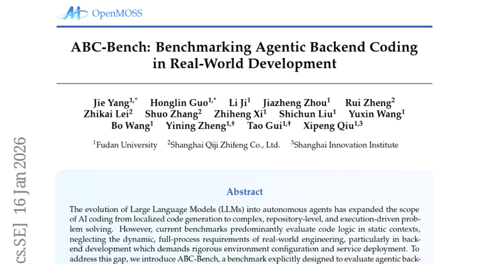
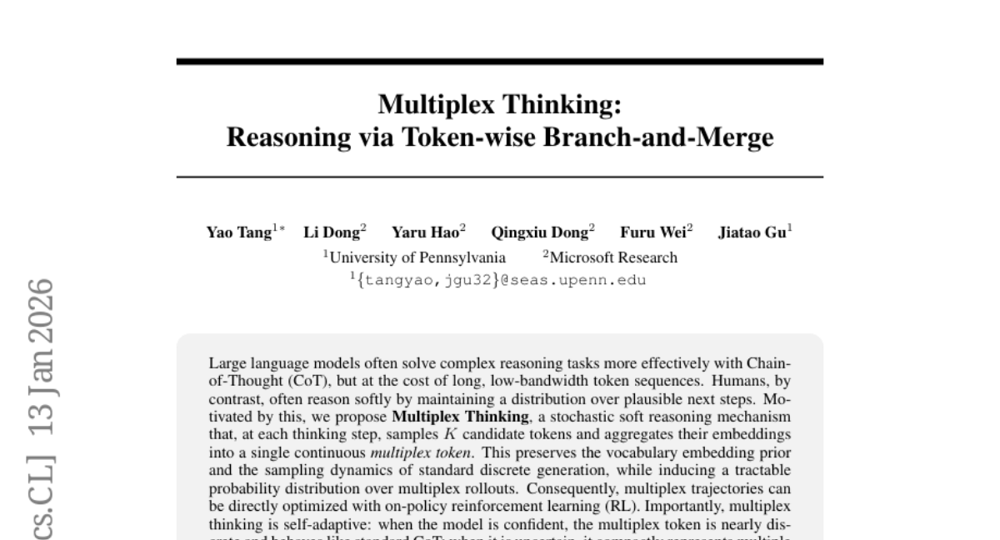
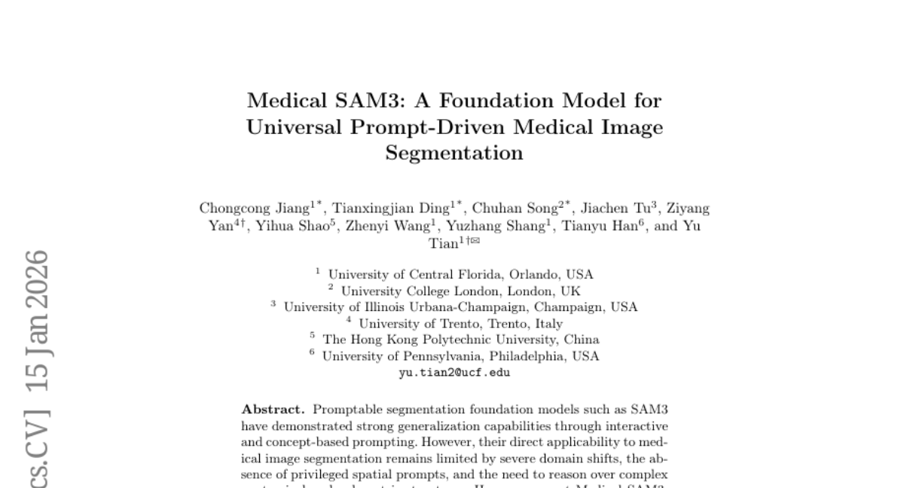
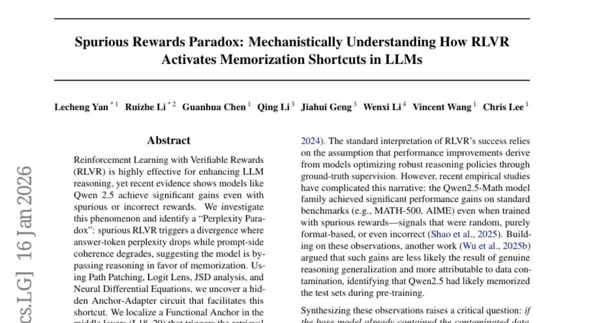
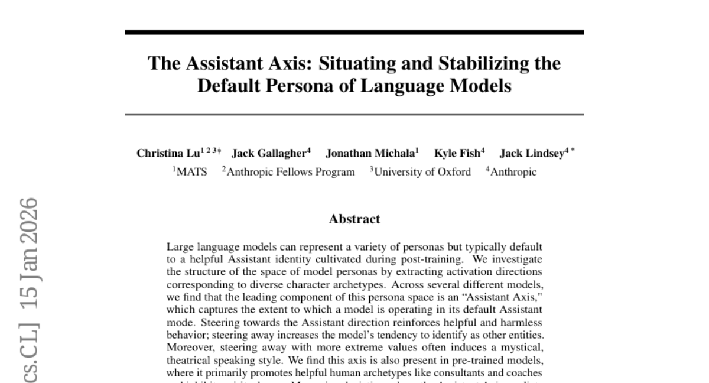

# 2026-01-20 Daily Papers (Top 5)

## 1. [ABC-Bench: Benchmarking Agentic Backend Coding in Real-World Development](https://huggingface.co/papers/2601.11077)
**Upvotes**: 48

### 📌 요약
실세계 백엔드 개발의 전 과정을 평가하고 컨테이너화된 서비스 배포 및 엔드투엔드 API 테스트를 요구하는 새로운 벤치마크 ABC-Bench를 제시하며, 현재 최신 AI 에이전트들의 실용적 역량 부족을 드러낸다.

### 📝 초록 (번역)
대규모 언어 모델(LLMs)이 자율 에이전트로 진화함에 따라, AI 코딩의 범위는 국소적인 코드 생성에서 복잡하고 저장소 수준이며 실행 기반의 문제 해결로 확장되었습니다. 그러나 현재의 벤치마크들은 주로 정적인 환경에서 코드 논리만을 평가하여, 엄격한 환경 설정과 서비스 배포를 요구하는 실세계 엔지니어링, 특히 백엔드 개발의 동적이고 전 과정적인 요구사항을 간과하고 있습니다. 이러한 격차를 해소하기 위해, 우리는 현실적이고 실행 가능한 워크플로우 내에서 에이전트 기반 백엔드 코딩을 평가하도록 명시적으로 설계된 벤치마크인 ABC-Bench를 소개합니다. 확장 가능한 자동화된 파이프라인을 사용하여, 오픈소스 저장소에서 8개 언어와 19개 프레임워크에 걸친 224개의 실용적인 작업을 선별했습니다. 이전 평가들과 구별되게, ABC-Bench는 에이전트들이 저장소 탐색부터 컨테이너화된 서비스를 인스턴스화하고 외부 엔드투엔드 API 테스트를 통과하는 전체 개발 수명 주기를 관리하도록 요구합니다. 우리의 광범위한 평가는 최신 모델조차도 이러한 총체적인 작업에서 신뢰할 수 있는 성능을 제공하는 데 어려움을 겪고 있음을 보여주며, 이는 현재 모델 역량과 실용적인 백엔드 엔지니어링 요구 사항 사이의 상당한 격차를 강조합니다. 우리의 코드는 https://github.com/OpenMOSS/ABC-Bench에서 확인할 수 있습니다.

### 🔑 핵심 포인트
- 기존 LLM 코딩 벤치마크의 정적인 코드 논리 평가 한계를 극복하고, 동적 환경 설정 및 서비스 배포가 필수적인 실세계 백엔드 개발 과정을 평가한다.
- 확장 가능한 자동화 파이프라인을 활용하여 오픈소스 기반의 8개 언어와 19개 프레임워크를 아우르는 224개의 실용적인 작업으로 구성된 ABC-Bench를 구축했다.
- 에이전트가 저장소 탐색, 컨테이너화된 서비스 인스턴스화, 외부 엔드투엔드 API 테스트 통과 등 전체 개발 수명 주기를 관리하도록 요구하며, 최신 모델들의 실용적 성능 부족을 입증했다.

---

## 2. [Multiplex Thinking: Reasoning via Token-wise Branch-and-Merge](https://huggingface.co/papers/2601.08808)
**Upvotes**: 25

### 📌 요약
Multiplex Thinking은 매 단계마다 K개의 후보 토큰을 하나의 연속적인 다중 토큰으로 통합하여 불확실성을 효율적으로 관리하며, 기존의 이산적인 CoT 및 RL 기준선보다 짧은 시퀀스로 더 높은 추론 성능을 보이는 자기 적응형 확률적 소프트 추론 방식이다.

### 📝 초록 (번역)
대규모 언어 모델(LLM)은 종종 사고 과정(CoT)을 통해 복잡한 추론 작업을 더 효과적으로 해결하지만, 이는 길고 대역폭이 낮은 토큰 시퀀스를 희생해야 한다. 이와 달리 인간은 그럴듯한 다음 단계들에 대한 분포를 유지하며 부드럽게(softly) 추론하는 경향이 있다. 이에 영감을 받아, 우리는 매 사고 단계마다 K개의 후보 토큰을 샘플링하고 이들의 임베딩을 하나의 연속적인 다중 토큰(multiplex token)으로 통합하는 확률적 소프트 추론 메커니즘인 Multiplex Thinking을 제안한다. 이는 표준 이산 생성의 어휘 임베딩 사전 지식과 샘플링 역학을 보존하는 동시에, 다중 롤아웃(multiplex rollouts)에 대한 다루기 쉬운 확률 분포를 유도한다. 결과적으로, 다중 궤적(multiplex trajectories)은 온-정책(on-policy) 강화 학습(RL)을 사용하여 직접 최적화될 수 있다. 중요하게도, Multiplex Thinking은 자기 적응적(self-adaptive)이다: 모델이 확신할 때는 다중 토큰이 거의 이산적(discrete)이 되어 표준 CoT처럼 작동한다; 불확실할 때는 시퀀스 길이를 늘리지 않으면서 여러 그럴듯한 다음 단계를 압축적으로 표현한다. 까다로운 수학 추론 벤치마크 전반에 걸쳐, Multiplex Thinking은 Pass@1부터 Pass@1024까지 강력한 이산 CoT 및 RL 기준선보다 지속적으로 우수한 성능을 보였으며, 동시에 더 짧은 시퀀스를 생성했다.

### 🔑 핵심 포인트
- 각 추론 단계에서 K개의 후보 토큰을 샘플링한 후 이들의 임베딩을 하나의 연속적인 다중 토큰으로 통합하는 확률적 소프트 추론 메커니즘을 제안.
- 제안된 다중 토큰은 표준 이산 생성의 역학을 유지하면서도 궤적에 대한 다루기 쉬운 확률 분포를 유도하여 온-정책 강화 학습(RL)을 통한 직접 최적화를 가능하게 함.
- 모델의 불확실성에 따라 자동으로 적응하며, 시퀀스 길이를 늘리지 않고도 여러 그럴듯한 다음 단계를 압축적으로 표현할 수 있는 자기 적응적(self-adaptive) 기능을 가짐.
- 수학 추론 벤치마크에서 기존의 강력한 이산 CoT 및 RL 기준선 대비 Pass@1부터 Pass@1024까지 일관되게 우수한 성능을 보였으며, 결과 시퀀스 길이도 더 짧았음.

---

## 3. [Medical SAM3: A Foundation Model for Universal Prompt-Driven Medical Image Segmentation](https://huggingface.co/papers/2601.10880)
**Upvotes**: 9

### 📌 요약
Medical SAM3는 심각한 도메인 불일치를 극복하고 프롬프트 기반 유연성을 유지하도록 대규모 이질적 의료 데이터로 완전히 미세 조정된 범용 의료 영상 분할 기반 모델이다.

### 📝 초록 (번역)
SAM3와 같은 프롬프트 기반 분할 기반 모델은 상호작용적 및 개념 기반 프롬프트를 통해 강력한 일반화 능력을 입증했습니다. 하지만 심각한 도메인 불일치, 특권적 공간 프롬프트의 부재, 그리고 복잡한 해부학적 및 체적 구조에 대한 추론 필요성 때문에 의료 영상 분할에 직접 적용하는 데는 여전히 한계가 있습니다. 본 논문에서는 대규모의 이질적인 2D 및 3D 의료 영상 데이터셋과 쌍을 이루는 분할 마스크 및 텍스트 프롬프트를 사용하여 SAM3를 완전히 미세 조정함으로써 얻은 범용 프롬프트 기반 의료 영상 분할 기반 모델인 Medical SAM3를 소개합니다. 바닐라 SAM3에 대한 체계적인 분석을 통해, 우리는 의료 데이터에서 그 성능이 실질적으로 저하되며, 겉보기 경쟁력은 주로 정답(ground-truth)에서 파생된 경계 상자와 같은 강력한 기하학적 사전 지식에 크게 의존하고 있음을 관찰했습니다. 이러한 발견은 단순히 프롬프트 엔지니어링을 넘어선 전체 모델 적응의 필요성을 시사합니다. Medical SAM3는 10가지 의료 영상 양식에 걸쳐 33개의 데이터셋을 사용하여 SAM3의 모델 매개변수를 미세 조정함으로써, 프롬프트 기반의 유연성을 보존하면서도 견고한 도메인별 표현을 습득합니다. 장기, 영상 양식, 차원성 전반에 걸친 광범위한 실험은 일관되고 중요한 성능 향상을 보여주며, 특히 의미적 모호성, 복잡한 형태, 그리고 장거리 3D 맥락과 같은 도전적인 시나리오에서 두드러집니다. 우리의 결과는 Medical SAM3를 의료 영상을 위한 범용 텍스트 유도 분할 기반 모델로 확립하며, 심각한 도메인 불일치 하에서 견고한 프롬프트 기반 분할을 달성하기 위한 전체론적 모델 적응의 중요성을 강조합니다.

### 🔑 핵심 포인트
- 바닐라 SAM3는 심각한 도메인 불일치와 강력한 기하학적 사전 지식(정답 경계 상자)에 대한 의존성 때문에 의료 영상 분할에서 성능이 크게 저하된다.
- Medical SAM3는 10가지 의료 영상 양식에 걸친 33개의 이질적인 2D 및 3D 데이터셋을 사용하여 SAM3의 모델 매개변수를 완전히 미세 조정하여 개발되었다.
- Medical SAM3는 기존 방식으로는 어려운 의미적 모호성이나 복잡한 3D 맥락 시나리오를 포함하여 다양한 장기 및 양식에 걸쳐 일관되고 중요한 성능 향상을 달성하며, 전체 모델 적응의 중요성을 입증했다.

---

## 4. [Spurious Rewards Paradox: Mechanistically Understanding How RLVR Activates Memorization Shortcuts in LLMs](https://huggingface.co/papers/2601.11061)
**Upvotes**: 5

### 📌 요약
이 논문은 RLVR에서 잘못된 보상이 암기 지름길을 활성화하는 역설을 탐구하며, 이를 촉진하는 LLM 내부의 '앵커-어댑터' 회로를 기계론적으로 규명합니다.

### 📝 초록 (번역)
검증 가능한 보상을 사용한 강화 학습(RLVR)은 LLM의 추론 능력을 향상시키는 데 매우 효과적이지만, 최근 증거에 따르면 Qwen 2.5와 같은 모델은 거짓이거나 부정확한 보상으로도 상당한 성능 향상을 달성합니다. 우리는 이러한 현상을 조사하고 '퍼플렉시티 역설(Perplexity Paradox)'을 확인했습니다. 즉, 잘못된 RLVR은 답변 토큰의 퍼플렉시티는 낮추지만 프롬프트 측면의 일관성은 저하시키는 발산을 유발하며, 이는 모델이 추론을 우회하고 암기를 선호하고 있음을 시사합니다. 경로 패칭(Path Patching), 로짓 렌즈(Logit Lens), JSD 분석, 신경 미분 방정식(Neural Differential Equations)을 사용하여, 우리는 이러한 지름길을 가능하게 하는 숨겨진 '앵커-어댑터' 회로를 밝혀냅니다. 우리는 중간 레이어(L18-20)에서 암기된 해답의 검색을 유발하는 '기능적 앵커(Functional Anchor)'를 국지화했으며, 이후 후기 레이어(L21+)의 '구조적 어댑터(Structural Adapters)'가 지름길 신호를 수용하도록 표현을 변환하는 것을 확인했습니다. 마지막으로, 우리는 이 회로 내의 특정 MLP 키를 스케일링하는 것이 양방향 인과적 조향(인위적으로 오염 기반 성능을 증폭시키거나 억제)을 가능하게 함을 보여줍니다. 우리의 결과는 RLVR 튜닝 모델에서 데이터 오염을 식별하고 완화하기 위한 기계론적 로드맵을 제공합니다.

### 🔑 핵심 포인트
- 잘못된 RLVR은 '퍼플렉시티 역설'(낮은 답변 퍼플렉시티와 저하된 일관성)을 유발하며, 이는 모델이 추론 대신 암기 지름길을 사용하고 있음을 나타냅니다.
- 이 암기 지름길은 중간 레이어의 '기능적 앵커'(암기된 해답 검색)와 후기 레이어의 '구조적 어댑터'(지름길 신호 수용)로 구성된 '앵커-어댑터' 회로에 의해 촉진됩니다.
- 해당 회로 내 특정 MLP 키의 스케일링을 통해 오염(암기)으로 인한 성능 변화를 인과적으로 양방향 조향(증폭 또는 억제)할 수 있으며, 이는 데이터 오염 완화를 위한 로드맵을 제공합니다.

---

## 5. [The Assistant Axis: Situating and Stabilizing the Default Persona of Language Models](https://huggingface.co/papers/2601.10387)
**Upvotes**: 5

### 📌 요약
대규모 언어 모델의 페르소나 공간 분석을 통해 모델의 기본 정체성을 나타내는 '어시스턴트 축(Assistant Axis)'을 발견했으며, 이 축을 따라 활성화를 제한함으로써 모델의 페르소나 표류(persona drift)와 적대적 공격에 대한 행동 안정성을 확보했다.

### 📝 초록 (번역)
대규모 언어 모델(LLMs)은 다양한 페르소나를 표현할 수 있지만, 일반적으로 후속 훈련(post-training) 과정에서 양성된 유용한 '어시스턴트' 정체성을 기본값으로 설정한다. 우리는 다양한 캐릭터 원형에 해당하는 활성화 방향을 추출하여 모델 페르소나 공간의 구조를 탐구했다. 여러 모델에 걸쳐, 이 페르소나 공간의 주요 구성 요소가 모델이 기본 어시스턴트 모드로 작동하는 정도를 포착하는 '어시스턴트 축'임을 발견했다. 어시스턴트 방향으로 조향(steering)하면 도움이 되고 무해한 행동이 강화되며, 이 축에서 멀어지게 조향하면 모델이 다른 독립체로 식별하려는 경향이 증가한다. 나아가, 더 극단적인 값으로 멀리 조향하면 종종 신비롭거나 연극적인 말하기 방식이 유발된다. 우리는 이 축이 사전 훈련된 모델에서도 존재하며, 주로 컨설턴트 및 코치와 같은 도움이 되는 인간 원형을 촉진하고 영적인 원형을 억제한다는 것을 발견했다. 어시스턴트 축을 따른 편차를 측정하는 것은 모델이 일반적인 페르소나와는 다른 유해하거나 기이한 행동을 보이는 현상인 '페르소나 표류'를 예측한다. 페르소나 표류는 종종 모델의 프로세스에 대한 메타 성찰을 요구하는 대화나 감정적으로 취약한 사용자가 등장하는 상황에 의해 유발된다는 것을 확인했다. 우리는 어시스턴트 축을 따라 활성화를 고정된 영역으로 제한함으로써 이러한 시나리오뿐만 아니라 적대적 페르소나 기반의 탈옥(jailbreaks) 공격에 직면했을 때 모델 행동을 안정화할 수 있음을 보여준다. 우리의 결과는 후속 훈련이 모델을 페르소나 공간의 특정 영역으로 조향하지만 느슨하게만 고정시킨다는 것을 시사하며, 모델을 일관된 페르소나에 더 깊이 정박시키는 훈련 및 조향 전략에 대한 연구를 촉진한다.

### 🔑 핵심 포인트
- 페르소나 공간 분석을 통해 모델의 기본 모드 작동 정도를 포착하고 행동의 일관성을 결정하는 핵심 방향인 '어시스턴트 축'을 발견했다.
- 어시스턴트 축 방향으로 조향하면 유익하고 무해한 행동이 강화되지만, 축에서 멀어지도록 조향하면 모델이 다른 엔티티로 식별하려는 경향이 커지며 극단적인 경우 신비롭거나 연극적인 발화 스타일이 유발된다.
- 이 축을 따라 활성화 범위를 제한함으로써 '페르소나 표류(Persona Drift)' 현상(특히 메타 성찰 요구 또는 감정적 취약성을 가진 사용자 대화 시 발생)을 예측하고 방지하며, 적대적 페르소나 기반의 탈옥 공격에 대한 모델 행동을 안정화할 수 있다.

---

