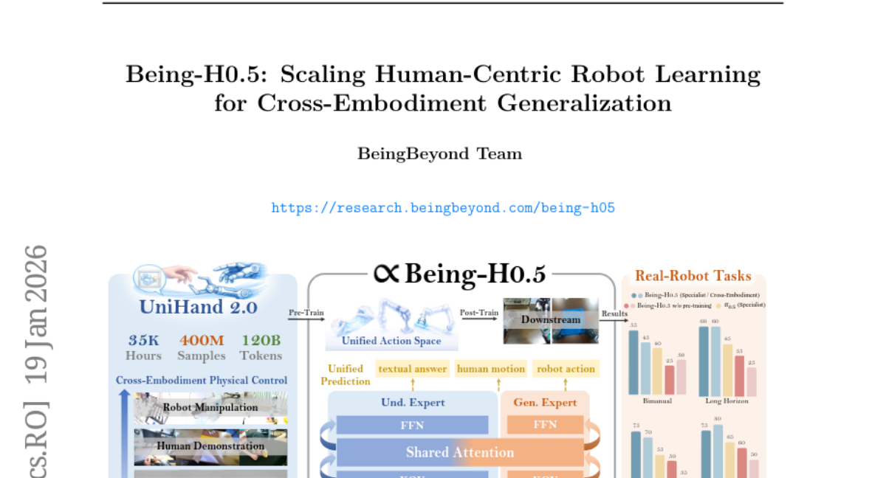
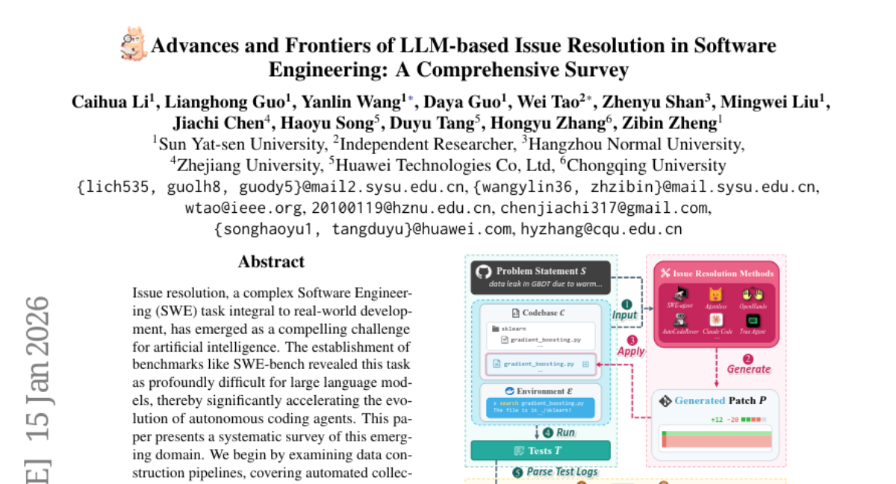
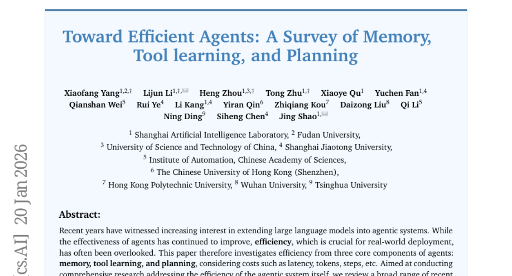
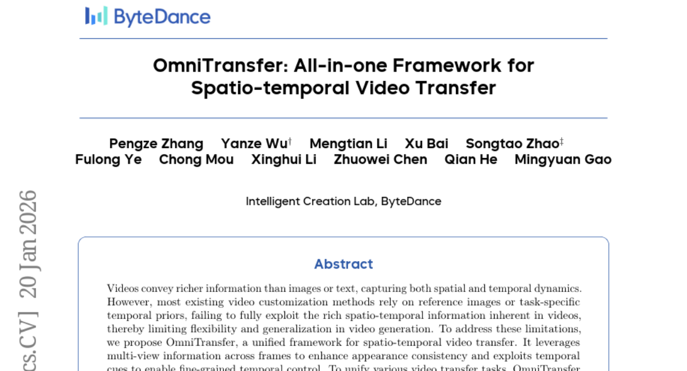

# 2026-01-21 Daily Papers (Top 5)

## 1. [Being-H0.5: Scaling Human-Centric Robot Learning for Cross-Embodiment Generalization](https://huggingface.co/papers/2601.12993)
**Upvotes**: 59

### 📌 요약
대규모 인간 중심 데이터를 기반으로 로봇의 형태적 차이를 극복하고, 단일 정책으로 여러 로봇 플랫폼에서 최고 수준의 일반화 성능을 달성한 혁신적인 VLA 모델 'Being-H0.5'를 제시합니다.

### 📝 초록 (번역)
로봇 학습 분야에서 가장 큰 난제 중 하나는 다양한 형태를 가진 로봇들(Embodiments) 사이에서 하나의 정책으로 일반화(Generalization)를 달성하는 것입니다. 기존의 VLA(Vision-Language-Action) 모델들은 로봇의 형태적 이질성(morphological heterogeneity)과 특정 로봇에 대한 데이터 부족 문제에 직면했습니다. 

이러한 문제를 해결하기 위해, 본 논문은 인간의 상호작용 궤적을 로봇 학습의 '보편적인 모국어'로 활용하는 인간 중심(Human-Centric) 학습 패러다임인 'Being-H0.5'를 제안합니다. 이 모델은 30가지 이상의 로봇 형태에 걸쳐 35,000시간 이상의 멀티모달 데이터를 포함하는 역대 최대 규모의 사전 학습 데이터셋 'UniHand-2.0'을 기반으로 합니다. 기술적으로는 이질적인 로봇 제어 방식을 의미적으로 정렬하는 '통합 행동 공간(Unified Action Space)'을 도입하고, 공유되는 기본적인 모터 동작과 특정 로봇에 특화된 동작을 분리하여 학습하는 MoF(Mixture-of-Flow) 아키텍처를 활용하여 일반화 능력을 극대화했습니다. 또한, 실제 환경의 센서 변화에도 안정적인 제어를 위한 특수 게이팅 기법을 적용했습니다.

결과적으로, Being-H0.5는 LIBERO(98.9%)와 RoboCasa(53.9%) 같은 시뮬레이션 벤치마크에서 기존 최고 성능을 뛰어넘었으며, 실제 환경의 5개 로봇 플랫폼에서도 강력하고 안정적인 교차 일반화 성능을 성공적으로 입증했습니다.

### 🔑 핵심 포인트
- Introduction of the human-centric learning paradigm 'Being-H0.5' and the UniHand-2.0 dataset (35,000+ hours across 30 embodiments) to establish a universal 'mother tongue' for physical robot interaction.
- Architectural innovations including a Unified Action Space for semantic alignment of heterogeneous controls and a Mixture-of-Flow (MoF) framework to decouple general motor primitives from embodiment-specific expertise.
- Achieves state-of-the-art results on major benchmarks (LIBERO 98.9%, RoboCasa 53.9%) and demonstrates practical cross-embodiment skill transfer, crucial for leveraging high-resource data to bootstrap low-resource robotic platforms.

---

## 2. [Advances and Frontiers of LLM-based Issue Resolution in Software Engineering: A Comprehensive Survey](https://huggingface.co/papers/2601.11655)
**Upvotes**: 48

### 📌 요약
소프트웨어 개발의 난제인 LLM 기반 이슈 해결 에이전트 분야를 체계적으로 분석하여, 데이터 파이프라인부터 방법론, 심층 분석, 그리고 향후 과제까지 포괄적인 로드맵을 제시하는 핵심 참고 자료입니다.

### 📝 초록 (번역)
소프트웨어 개발(SWE)에서 버그나 기술적 이슈를 해결하는 '이슈 해결' 작업은 현실 개발의 필수 과정인 동시에, SWE-bench 같은 벤치마크를 통해 대규모 언어 모델(LLM)에게는 매우 어려운 난제로 입증되었습니다. 이러한 어려움은 자율 코딩 에이전트(Autonomous Coding Agents) 연구의 폭발적인 발전을 이끌었습니다. 본 논문은 급변하는 이 분야에 대한 체계적인 조사(Survey)를 제공합니다. 

**해결책:** 우리는 이슈 해결에 사용되는 데이터의 자동 수집 및 합성 방법론부터 시작하여, 다양한 접근 방식을 종합적으로 분석했습니다. 특히 모듈형 구성 요소를 활용하는 '학습 없는(training-free)' 프레임워크와 지도 학습(SFT), 강화 학습(RL) 기반의 '학습 기반' 기법들을 심도 있게 다룹니다. 더 나아가, 데이터 품질과 에이전트의 실제 행동에 대한 비판적 분석과 실용적인 응용 사례까지 논의합니다. 

**기여:** 최종적으로, 본 설문조사는 연구자들이 직면한 주요 도전 과제를 명확히 정의하고 향후 연구를 위한 유망한 방향을 제시함으로써, LLM 기반 이슈 해결 에이전트 분야의 발전을 가속화하는 데 기여합니다.

### 🔑 핵심 포인트
- A comprehensive, systematic survey mapping the rapidly evolving domain of LLM-based autonomous coding agents specifically focused on the complex task of software issue resolution.
- Detailed analysis covering the entire research lifecycle, spanning automated data construction pipelines (collection/synthesis) and diverse methodologies (modular training-free frameworks, Supervised Fine-Tuning, and Reinforcement Learning).
- Essential resource for researchers, developers, and practitioners seeking structured domain knowledge, critical analyses of data quality/agent behavior, and strategic guidance on future challenges and promising research directions in autonomous SWE.

---

## 3. [Toward Efficient Agents: Memory, Tool learning, and Planning](https://huggingface.co/papers/2601.14192)
**Upvotes**: 29

### 📌 요약
실시간 배포에 필수적인 AI 에이전트의 효율성 문제를 해결하기 위해 메모리, 도구 학습, 계획 세 가지 핵심 요소 전반에 걸쳐 효율 극대화 전략과 비용 대비 성능 분석 프레임워크를 제시하는 종합 연구입니다.

### 📝 초록 (번역)
최근 대규모 언어 모델(LLM)을 활용하여 에이전트 시스템을 구축하는 연구가 활발합니다. 에이전트의 기능과 성능은 지속적으로 향상되었지만, 실시간 배포 및 운영에 필수적인 '효율성(레이턴시, 토큰 사용량, 실행 단계 수 등)' 문제는 종종 뒷전으로 밀려났습니다. 따라서 이 논문은 에이전트 시스템의 핵심인 메모리, 도구 학습, 계획 세 가지 구성 요소에 초점을 맞추어 효율을 극대화하는 방안을 종합적으로 탐구합니다. 구체적인 방법론으로는 컨텍스트 압축 및 관리, 도구 호출을 최소화하는 보상 설계, 효율적인 제어 검색 메커니즘 사용 등 다양한 접근 방식에서 공통적으로 발견되는 원칙들을 분석합니다. 최종적으로, 이 연구는 효율성을 고정된 비용 대비 성능 비교, 또는 동일 성능 대비 비용 비교라는 두 가지 상보적인 관점에서 명확히 특성화하고, 성능과 비용 사이의 최적 균형점(파레토 최전선)을 찾는 분석 프레임워크를 제시하며, 효율성 지향 벤치마크와 평가 지표들을 통합 정리했습니다.

### 🔑 핵심 포인트
- Agent 효율성 문제를 메모리, 도구 학습, 계획 세 가지 핵심 구성 요소에 걸쳐 종합적으로 분석하고, 비용(Cost)과 효과(Effectiveness) 간의 트레이드오프를 정의하는 파레토 최전선(Pareto Frontier) 분석 프레임워크를 제시.
- 컨텍스트 압축/관리, 도구 호출 최소화를 위한 RL 보상 설계, 제어 검색 메커니즘 등 효율성을 높이기 위한 다양한 방법론의 공통 원칙을 분석하고, 비용/토큰/단계 수를 측정하는 효율성 지향 벤치마크 및 평가 프로토콜을 통합 정리.
- 실시간 환경에 LLM 에이전트를 배포해야 하거나, 에이전트의 운영 비용(API 비용, 지연 시간)을 절감하고자 하는 연구자 및 엔지니어.

---

## 4. [OmniTransfer: All-in-one Framework for Spatio-temporal Video Transfer](https://huggingface.co/papers/2601.14250)
**Upvotes**: 28

### 📌 요약
기존 비디오 생성 방식의 한계를 극복하고, 단일 프레임워크로 외형(Appearance) 및 시공간적 움직임(Temporal Dynamics) 전송에서 최고 수준의 유연성과 정확도를 달성한 혁신적인 통합 비디오 전송 프레임워크.

### 📝 초록 (번역)
비디오는 이미지나 텍스트보다 훨씬 풍부한 시공간적 정보를 담고 있지만, 기존의 비디오 커스터마이징 기법들은 참조 이미지나 특정 작업에 한정된 시간적 사전 지식에 의존하여 유연성과 범용성이 크게 제한되었습니다. 

**문제 해결을 위해,** 우리는 모든 비디오 전송 작업을 처리하는 통합 시공간 비디오 전송 프레임워크인 OmniTransfer를 제안합니다. OmniTransfer는 프레임 간 다중 뷰 정보를 활용하여 외형적 일관성(Appearance Consistency)을 극대화하고, 시간적 단서(Temporal Cues)를 활용하여 정교한 시간 제어를 가능하게 합니다.

**핵심 기술로는,** 참조 비디오 정보를 작업에 맞춰 효율적으로 활용하는 '작업 인지 위치 바이어스(Task-aware Positional Bias)', 참조와 타겟 분기를 나누어 정밀도와 효율을 높인 '참조 분리형 인과 학습(Reference-decoupled Causal Learning)', 그리고 멀티모달 의미론적 가이드를 통해 작업을 동적으로 구분하는 '작업 적응형 멀티모달 정렬(Task-adaptive Multimodal Alignment)'을 사용합니다.

**실험 결과,** OmniTransfer는 외형(ID 및 스타일)과 시간적 전송(카메라 움직임, 비디오 효과)에서 기존 방법론들을 압도적으로 능가했으며, 심지어 포즈 데이터를 사용하지 않고도 포즈 기반 방법론과 유사한 움직임 전송 성능을 보여주며 유연하고 고품질의 비디오 생성의 새로운 패러다임을 제시합니다.

### 🔑 핵심 포인트
- 비디오의 시공간적 역학(Spatio-temporal Dynamics)을 온전히 활용하여 외형 변환, 카메라 이동, 모션 전송 등 모든 비디오 전송 작업을 단일 모델로 통합한 'All-in-one' 프레임워크(OmniTransfer)를 구축했습니다.
- ID/스타일 전송, 카메라 움직임, 비디오 효과 등 다양한 작업에서 기존 SOTA(State-of-the-Art) 모델들을 뛰어넘는 성능을 보였습니다. 특히, 명시적인 포즈(Pose) 데이터 없이도 포즈 기반 생성 모델만큼 정밀한 움직임 전송(Motion Transfer)이 가능하다는 점이 주목할 만합니다.
- 기존의 제한적인 비디오 커스터마이징 방법을 넘어, 외형 변환(Style/ID Transfer)부터 복잡한 카메라 무빙(Temporal Transfer)까지 유연하고 고품질의 비디오 생성을 필요로 하는 AI 개발자 및 시공간 데이터 처리 연구자에게 필수적인 핵심 기술입니다.

---

## 5. [FutureOmni: Evaluating Future Forecasting from Omni-Modal Context for Multimodal LLMs](https://huggingface.co/papers/2601.13836)
**Upvotes**: 27

### 📌 요약
기존 MLLM 평가의 사각지대였던 오디오-비주얼 기반 미래 예측 능력을 측정하는 최초의 벤치마크 FutureOmni와 전용 학습 전략 OFF를 제시하며 모델의 실제 추론 능력을 획기적으로 확장했다.

### 📝 초록 (번역)
Multimodal Large Language Model(MLLM)은 시청각 정보를 강력하게 인식하지만, 이를 바탕으로 미래 이벤트를 예측하는 능력은 기존 벤치마크에서 제대로 다뤄지지 않았습니다. 이러한 격차를 해소하기 위해 연구진은 오디오-비주얼 환경에서 옴니 모달 미래 예측 능력을 평가하는 최초의 벤치마크인 FutureOmni를 도입했습니다. FutureOmni는 LLM의 지원과 인간 검증을 통해 구축된 919개의 영상과 1,034개의 QA 쌍을 포함하며, 모델이 교차 모달 인과 및 시간적 추론 능력을 사용하도록 요구합니다. 13개의 옴니 모달 모델과 7개의 비디오 전용 모델을 평가한 결과, 현재 시스템들은 음성 정보가 많은 시나리오에서 특히 어려움을 겪는 것으로 나타났으며, Gemini 3 Flash가 64.8%로 가장 높은 정확도를 기록했습니다. 이 한계를 극복하기 위해 7천 개의 튜닝 데이터셋을 큐레이션하고 'Omni-Modal Future Forecasting (OFF)' 학습 전략을 제안했으며, OFF 전략이 미래 예측 및 일반화 성능을 효과적으로 향상시키는 것으로 입증되었습니다.

### 🔑 핵심 포인트
- What is the core innovation? (Key Contribution): Introduction of FutureOmni, the first benchmark designed specifically to evaluate omni-modal (audio-visual) future forecasting in MLLMs, requiring cross-modal causal and temporal reasoning. Also proposed the Omni-Modal Future Forecasting (OFF) instruction-tuning strategy and an accompanying 7K-sample dataset to enhance prediction abilities.
- How does it perform? (Performance/Results): Current leading models struggle significantly with audio-visual future prediction, achieving a maximum accuracy of 64.8% (Gemini 3 Flash). Performance degradation is notable in speech-heavy scenarios. The proposed OFF training strategy successfully mitigates this limitation and enhances generalization.
- Who should use this? (Target/Application): Researchers and developers working on advanced Multimodal LLMs, particularly those focused on improving temporal reasoning, causal prediction, AI safety, and building robust systems capable of making proactive inferences based on dynamic real-world audio-visual contexts.

---

