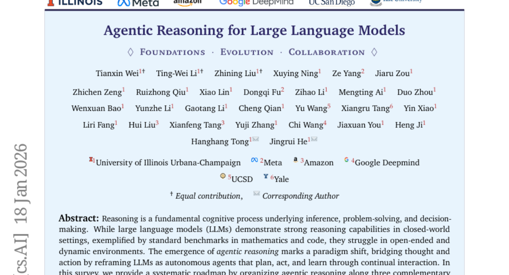
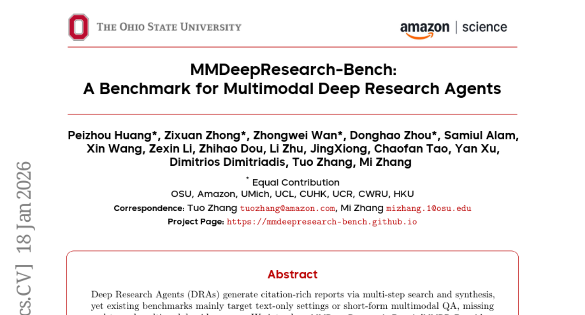
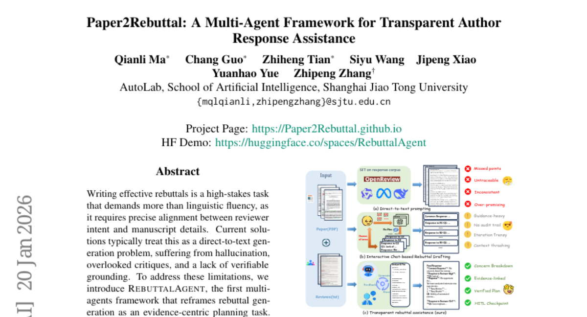
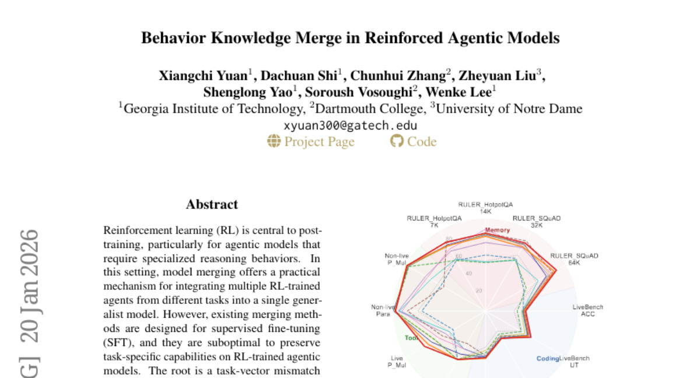

# 2026-01-22 Daily Papers (Top 5)

## 1. [Agentic Reasoning for Large Language Models](https://huggingface.co/papers/2601.12538)
**Upvotes**: 118

### 📌 요약
LLM을 환경과 상호작용하며 스스로 진화하는 자율 에이전트로 재정의하는 '에이전트적 추론(Agentic Reasoning)'의 핵심 구조와 미래 로드맵을 체계적으로 제시하는 기념비적인 서베이입니다.

### � 핵심 포인트
- 에이전트적 추론(Agentic Reasoning)을 환경 역동성 수준에 따라 '기반', '자기 진화', '집단'의 세 가지 보완적 차원으로 구조화한 통일된 로드맵 제시.
- LLM의 '생각'을 실제 환경에서의 '행동'으로 연결하는 통합 프레임워크를 제시하며, 테스트 시점의 오케스트레이션을 다루는 인컨텍스트 추론과 학습 단계의 최적화를 다루는 후학습 추론의 장단점을 명확히 구분하여 분석함.
- 로보틱스, 자율 연구(Autonomous Research), 헬스케어, 복잡한 의사결정 시스템 등 동적이고 장기적인 상호작용 및 멀티 에이전트 협업이 필요한 LLM 기반 솔루션을 개발하는 연구자 및 엔지니어.

### 📝 초록 (번역)
추론은 LLM의 핵심 인지 능력 중 하나이지만, 기존의 LLM은 데이터가 고정된 닫힌 환경(closed-world)에서는 강력한 성능을 보이는 반면, 현실 세계와 같이 개방적이고 역동적인 환경에서는 쉽게 한계를 드러냈습니다. 이러한 문제를 해결하기 위해, 본 논문은 LLM을 단순히 텍스트를 생성하는 모델이 아닌, 스스로 계획하고, 행동하며, 지속적인 상호작용을 통해 학습하는 '자율 에이전트(Autonomous Agent)'로 재정의하는 에이전트적 추론 패러다임을 제안합니다.

저자들은 에이전트적 추론을 세 가지 상호보완적인 차원으로 구조화하여 분석합니다. 첫째, '기반 에이전트적 추론'은 안정적인 환경에서 계획, 도구 사용 등 핵심 단일 에이전트 능력을 확립합니다. 둘째, '자기 진화 에이전트적 추론'은 피드백, 메모리, 적응을 통해 에이전트 스스로 능력을 개선하는 방법을 다룹니다. 셋째, '집단 다중 에이전트 추론'은 협업, 지식 공유, 공동 목표 달성을 통한 확장된 지능을 탐구합니다.

또한, 구조화된 프롬프트 오케스트레이션을 사용하는 '인컨텍스트 추론' 방식과 강화 학습(RL) 또는 지도 미세 조정(SFT)을 통해 행동을 최적화하는 '후학습 추론' 방식을 구분하여 분석합니다. 이러한 포괄적인 프레임워크는 로보틱스, 과학 연구, 헬스케어, 수학 등 다양한 실제 애플리케이션 벤치마크에 적용된 사례를 검토하며, LLM의 '생각(thought)'을 실제 환경에서의 '행동(action)'으로 연결하는 통합된 로드맵을 제시합니다.

---

## 2. [MMDeepResearch-Bench: A Benchmark for Multimodal Deep Research Agents](https://huggingface.co/papers/2601.12346)
**Upvotes**: 40

### 📌 요약
기존 텍스트 및 단순 QA 중심의 한계를 넘어, 이미지-텍스트 증거를 활용하여 인용이 필수적인 심층 연구 보고서를 생성하는 AI 성능을 측정하고 진단하는 새로운 표준 벤치마크(MMDR-Bench)와 평가 시스템을 제시했습니다.

### � 핵심 포인트
- 핵심은 보고서 생성 및 인용 기반 멀티모달 AI의 성능을 종합적으로 측정하는 MMDR-Bench 벤치마크와, 세부적인 오류 진단이 가능한 3단계 통합 평가 시스템(FLAE, TRACE, MOSAIC)을 구축한 것입니다.
- 실험 결과, 현재 최신 AI 모델들은 유려한 보고서 작성 능력과 증거(인용)의 충실한 사용 사이에서 상충 관계를 보였으며, 특히 텍스트와 이미지 증거를 일관되게 연결하는 '멀티모달 무결성' 확보가 가장 큰 병목 지점임이 확인되었습니다.
- 심층 연구 보고서 자동 생성(Deep Research Agent) 기술을 개발하는 연구자 및 개발자, 그리고 멀티모달 환경에서 AI의 사실성(Factuality) 및 인용 신뢰도를 평가하는 새로운 기준이 필요한 모든 AI 연구 그룹.

### 📝 초록 (번역)
기존의 심층 연구 에이전트(DRA) 벤치마크는 주로 텍스트 기반이거나 단순한 단문 형태의 멀티모달 질의응답(QA)에 초점을 맞추고 있었습니다. 이로 인해 AI가 이미지 같은 시각적 증거를 포함하여 종단 간(end-to-end)으로 활용하고, 이를 기반으로 정확한 출처(인용)를 명시한 보고서를 작성하는 능력을 제대로 평가할 수 없다는 문제가 있었습니다.

이러한 격차를 해소하기 위해, 우리는 21개 도메인에 걸쳐 140개의 전문적으로 설계된 태스크로 구성된 새로운 벤치마크, MMDeepResearch-Bench (MMDR-Bench)를 소개합니다. MMDR-Bench는 AI가 이미지와 텍스트 증거를 모두 이해하고, 시각 자료를 인용된 주장과 연결하며, 일관된 보고서 스타일의 글을 작성하도록 요구합니다. 또한, 보고서 품질(FLAE), 인용 신뢰도(TRACE), 텍스트-시각 자료 간 일관성(MOSAIC)을 세밀하게 진단할 수 있는 통합 평가 파이프라인도 함께 제안합니다.

25개의 최신 모델을 대상으로 한 실험 결과, 글쓰기 능력(산출물의 품질)이 뛰어나더라도 증거 자료의 충실한 사용(인용 규율)을 보장하지 않으며, 특히 멀티모달 증거의 무결성(텍스트와 이미지의 정합성)을 유지하는 것이 심층 연구 에이전트 성능 개선의 핵심 병목 현상임이 밝혀졌습니다.

---

## 3. [Rethinking Video Generation Model for the Embodied World](https://huggingface.co/papers/2601.15282)
**Upvotes**: 35

### 📌 요약
실체화된 AI의 물리적 현실성 문제를 정밀하게 진단하는 표준 벤치마크 RBench와 400만 개 규모의 최대 로봇 영상 데이터셋 RoVid-X를 동시에 공개하여 차세대 로봇 영상 생성 모델 개발을 가속화합니다.

### � 핵심 포인트
- 로봇 영상 생성의 물리적 현실성을 평가하는 표준 벤치마크 'RBench'와 400만 클립 규모의 최대 오픈소스 로봇 데이터셋 'RoVid-X'를 동시 구축했습니다.
- 기존 25개 모델들이 물리적 현실성 구현에 심각한 약점을 보임을 정량적으로 확인했으며, RBench는 인간 평가와 0.96의 높은 상관관계를 입증했습니다.
- 실체화된 AI(Embodied AI) 연구자 및 개발자. 특히 로봇 행동의 물리적 정확도와 대규모 데이터셋 기반의 훈련 시스템 구축이 필요한 모든 분야에 적용됩니다.

### 📝 초록 (번역)
로봇 데이터 생성을 위한 영상 생성 모델은 실체화된 인공지능(Embodied AI) 분야에서 지각, 추론, 행동을 포착하며 그 발전에 크게 기여했습니다. 하지만 현재 모델들은 로봇의 실제 상호작용처럼 물리적으로 현실적인 고품질 영상을 만드는 데 어려움을 겪고 있으며, 공정한 성능 비교를 위한 표준화된 벤치마크도 부족했습니다.

저희는 이러한 문제를 해결하기 위해 로봇 중심의 영상 생성을 평가하는 종합 벤치마크 'RBench'를 제안했습니다. RBench는 5가지 작업 영역과 4가지 로봇 유형을 포괄하며, 구조적 일관성, 물리적 타당성, 행동 완결성 등 정량적인 하위 지표를 통해 평가의 정확도를 높였습니다. 또한, 물리적 현실성을 높이기 위한 고품질 데이터의 부족을 해결하고자 4단계 데이터 파이프라인을 개선하여, 400만 개의 주석 달린 클립을 포함하는 최대 규모의 로봇 데이터셋 'RoVid-X'를 구축했습니다.

RBench를 통해 25개 모델을 평가한 결과, 기존 모델들이 물리적으로 현실적인 로봇 행동을 생성하는 데 심각한 부족함을 보임을 정량적으로 확인했습니다. RBench는 사람의 평가와 0.96의 높은 상관관계를 보이며 그 유효성을 입증했습니다. 이처럼 평가(RBench)와 데이터(RoVid-X)를 결합한 시너지 효과는 실체화된 AI의 일반 지능(general intelligence)으로의 발전을 위한 강력한 토대가 될 것입니다.

---

## 4. [Paper2Rebuttal: A Multi-Agent Framework for Transparent Author Response Assistance](https://huggingface.co/papers/2601.14171)
**Upvotes**: 35

### 📌 요약
최초의 다중 에이전트 기반 증거 중심 계획 프레임워크인 RebuttalAgent를 도입하여, 논문 피어 리뷰 과정에서 투명성과 신뢰성을 극대화한 저자 답변(rebuttal) 작성 자동화를 실현했습니다.

### � 핵심 포인트
- 다중 에이전트 기반의 '증거 중심 계획(Evidence-centric Planning)'을 핵심 혁신으로, 검토 가능한 응답 계획 수립을 통해 답변의 투명성과 근거 제시를 보장합니다.
- 새로운 RebuttalBench 데이터셋에서 기존 모델 대비 커버리지(Coverage), 충실도(Faithfulness), 전략적 일관성(Strategic Coherence) 모두에서 우수한 성능을 달성했습니다.
- 논문 저자, 연구자, 그리고 피어 리뷰 과정에서 고품질의 투명한 저자 답변(rebuttal) 작성을 필요로 하는 개발자.

### 📝 초록 (번역)
저자 답변(rebuttal) 작성은 리뷰어의 의도와 원고 내용을 정확히 일치시켜야 하는 매우 중요한 작업입니다. 기존 AI 솔루션들은 이를 단순 텍스트 생성 문제로 다루어, 논리적 허위 정보(hallucination)를 만들거나 핵심 비판을 누락하며, 근거를 확인할 수 없는 고질적인 문제가 있었습니다. 이를 해결하기 위해, 우리는 답변 생성을 '증거 중심의 계획 수립 작업'으로 재정의한 최초의 다중 에이전트 프레임워크인 RebuttalAgent를 제안합니다. 이 시스템은 복잡한 피드백을 세부 항목으로 분해하고, 요약과 상세 텍스트를 결합한 하이브리드 컨텍스트를 구성하며, 외부 검색 모듈을 통합해 필요한 문헌 정보까지 동적으로 확보합니다. 특히, 초안 작성 전에 검토 가능한 '응답 계획'을 먼저 생성하여 모든 주장이 명시적인 내부 또는 외부 증거에 기반하도록 보장합니다. 제안된 RebuttalBench 데이터셋에서 검증한 결과, RebuttalAgent는 기존 모델들보다 커버리지, 충실도, 전략적 일관성 측면에서 우수한 성능을 보이며, 피어 리뷰 과정에 투명하고 통제 가능한 지원을 제공합니다.

---

## 5. [Behavior Knowledge Merge in Reinforced Agentic Models](https://huggingface.co/papers/2601.13572)
**Upvotes**: 14

### 📌 요약
RL 에이전트 모델의 지식 합병 시 발생하는 성능 희석 문제를 해결하고, 오히려 개별 에이전트보다 강력한 시너지를 발휘하는 새로운 프레임워크 RAM(Reinforced Agent Merging)을 제안합니다.

### � 핵심 포인트
- 공유 지식과 고유 지식을 분리하고, 희석 없이 고유 지식을 보존 및 재조정하는 분포 인식형 RL 합병 프레임워크(RAM) 제안.
- 기존 합병 방식 대비 월등한 성능을 보이며, 개별 전문 에이전트의 성능을 뛰어넘는 시너지 효과 달성.
- 여러 RL 에이전트의 지식을 효과적으로 통합하여 고성능 범용 에이전트 모델을 구축하려는 개발자 및 연구자.

### 📝 초록 (번역)
에이전트 모델이 복잡한 추론 행동을 학습하기 위해서는 RL(강화 학습)을 통한 후속 훈련이 필수적입니다. 여러 전문화된 RL 에이전트들을 하나의 범용 모델로 통합하는 모델 합병 기술은 효율적이지만, 기존 합병 방식(SFT 방식에 최적화됨)을 RL 에이전트에 적용하면 성능이 크게 떨어지는 문제가 있었습니다. 그 원인은 RL 훈련이 만들어내는 핵심 지식(Task Vector)이 매우 희소하고 비균질적이며, 일반적인 평균 합병 방식으로는 이 고유한 지식 업데이트가 서로 희석되어 중요한 기능을 상실하기 때문입니다. 

이러한 RL 고유의 문제를 해결하기 위해, 우리는 '분포 인식형' 합병 프레임워크인 RAM(Reinforced Agent Merging)을 제안합니다. RAM은 에이전트들의 파라미터 업데이트에서 공유된 부분과 각 에이전트의 고유한 부분을 명확히 분리합니다. 공유된 부분은 평균을 내되, 희소하지만 중요한 고유 지식은 선택적으로 보존하고 스케일을 재조정하여 지식 희석을 근본적으로 막습니다.

다양한 에이전트 도메인과 모델 아키텍처에서 진행된 실험 결과, RAM은 기존 합병 베이스라인들을 훨씬 능가했을 뿐만 아니라, 여러 에이전트들의 능력을 융합하여 개별 전문 에이전트보다 더 뛰어난 성능을 발휘하는 시너지 효과를 성공적으로 이끌어냈습니다.

---

