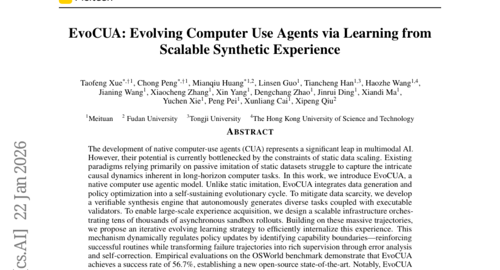
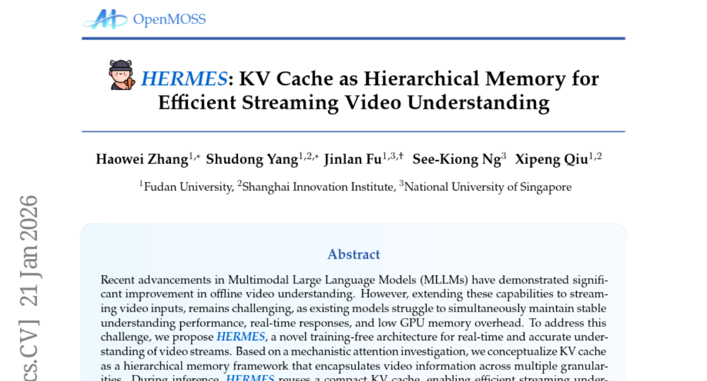
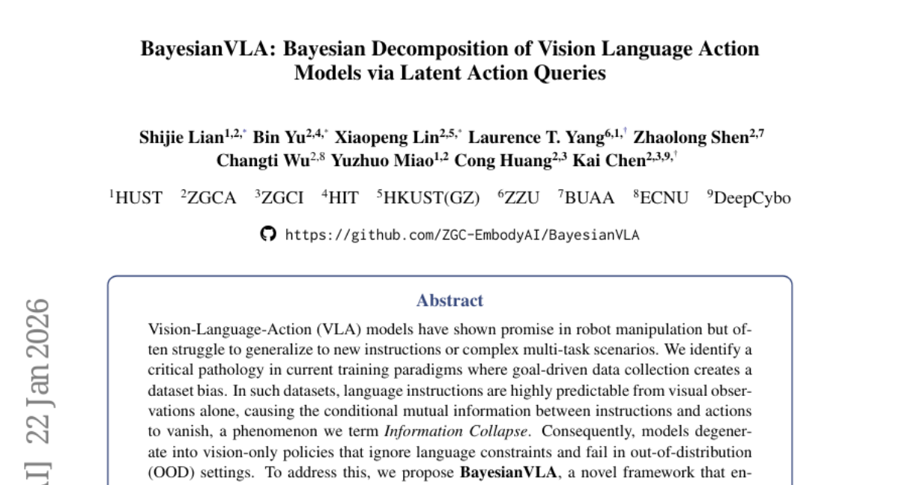
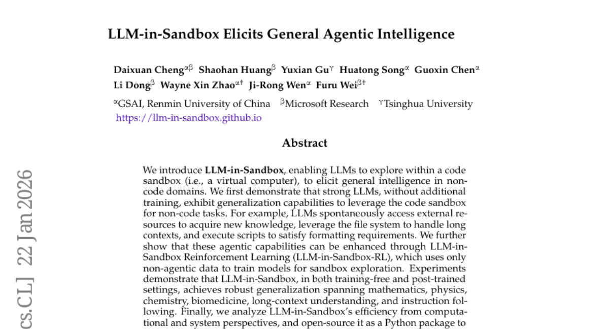

# 2026-01-23 Daily Papers (Top 5)

## 1. [EvoCUA: Evolving Computer Use Agents via Learning from Scalable Synthetic Experience](https://huggingface.co/papers/2601.15876)
**Upvotes**: 62

### 📌 요약
정적인 데이터 모방의 한계를 극복하고, 확장 가능한 합성 경험 학습 기반의 자가 진화 사이클을 도입하여 컴퓨터 사용 에이전트 성능의 새로운 오픈소스 최고 기록을 달성했습니다.

### � 핵심 포인트
- 대규모 합성 경험 학습과 정책 최적화를 결합한, 자가 유지 및 진화 사이클 학습 패러다임 도입.
- OSWorld 벤치마크에서 56.7%의 성공률로 새로운 오픈소스 최고 기록(SOTA) 달성. 기존 최고 모델들 대비 압도적 성능 우위 입증.
- 복잡한 장기 작업을 수행하는 네이티브 컴퓨터 사용 에이전트(CUA) 개발, 다양한 규모의 파운데이션 모델에 적용 가능한 일반화된 학습 접근 방식 모색.

### 📝 초록 (번역)
멀티모달 AI 분야에서 네이티브 컴퓨터 사용 에이전트(CUA) 개발은 큰 잠재력을 가지고 있지만, 기존 모델들은 정적인 데이터셋 모방에 의존하여 복잡하고 장기적인 컴퓨터 작업의 인과 관계를 포착하는 데 어려움을 겪었습니다. 

EvoCUA는 이 문제를 해결하기 위해 데이터 생성과 정책 최적화를 통합한 '자가 유지 및 진화 사이클'을 제안합니다. 이 시스템은 자체적으로 검증 가능한 합성 엔진을 통해 다양한 작업과 유효성 검사기를 생성하여 데이터 부족 문제를 해소합니다. 또한, 수만 개의 비동기 샌드박스 실행을 통해 대규모 경험 궤적을 확보할 수 있는 인프라를 구축했습니다. 핵심은 '반복적 진화 학습 전략'으로, 에이전트가 성공한 루틴은 강화하고 실패한 궤적은 오류 분석 및 자체 수정을 통해 풍부한 학습 데이터로 변환합니다. 

OSWorld 벤치마크 평가 결과, EvoCUA는 56.7%의 성공률을 기록하며 새로운 오픈소스 최고 성능(SOTA)을 수립했습니다. 이는 이전 오픈소스 최고 모델인 OpenCUA-72B(45.0%)는 물론, 선도적인 폐쇄형 모델인 UI-TARS-2(53.1%)까지 능가하는 수준입니다. 이러한 경험 기반의 진화 학습 패러다임이 규모가 다른 파운데이션 모델 전반에 걸쳐 일관된 성능 향상을 가져옴으로써, 네이티브 에이전트 역량 발전을 위한 강력하고 확장 가능한 경로를 제시합니다.

---

## 2. [The Flexibility Trap: Why Arbitrary Order Limits Reasoning Potential in Diffusion Language Models](https://huggingface.co/papers/2601.15165)
**Upvotes**: 55

### 📌 요약
기존 확산 언어 모델(dLLM)의 임의 순서 생성 유연성이 오히려 추론 능력을 저해함을 밝혀내고, 이 유연성을 제한한 단순화된 JustGRPO 방식으로 GSM8K에서 89.1%의 정확도를 달성하며 성능을 극대화했습니다.

### � 핵심 포인트
- dLLM의 임의 순서 생성이 추론 능력을 제한한다는 역설적 발견 (유연성의 함정) 및 이를 해결하기 위한 단순화된 JustGRPO 방법론 제안.
- GSM8K 벤치마크에서 89.1%의 높은 정확도 달성; dLLM의 핵심 장점인 병렬 디코딩 능력은 그대로 유지.
- 확산 언어 모델(dLLM)을 연구하는 개발자 및 연구자, 효율적인 추론 시스템 구축에 관심 있는 AI 엔지니어.

### 📝 초록 (번역)
확산 언어 모델(dLLM)은 기존의 좌에서 우로 진행되는 LLM과 달리 토큰을 임의의 순서로 생성할 수 있습니다. 이론적으로 이러한 유연성은 수학이나 코딩 같은 복잡한 추론 작업에 더 넓은 해법 공간을 제공하여 성능을 개선할 것으로 기대되었습니다. 실제로 많은 연구가 강화 학습(RL)을 동원하여 이 유연성을 활용하고자 노력했습니다.

하지만 본 연구는 임의 순서 생성이 현 형태로 적용될 때 dLLM의 추론 범위를 좁히는 '유연성의 함정'이 될 수 있음을 밝혀냈습니다. 모델이 이 유연성을 악용하여 탐색에 필수적인 '불확실성이 높은 토큰'을 회피하는 경향이 있으며, 이로 인해 해법 탐색 공간이 조기에 붕괴되는 현상이 관찰되었습니다.

이러한 발견은 복잡한 궤적 처리를 감수하면서까지 임의 순서 유연성을 보존하려던 기존 RL 접근법의 근본적인 전제에 의문을 제기합니다. 우리는 의도적으로 임의 순서 생성을 포기하고 대신 표준 GRPO(Group Relative Policy Optimization)를 적용하는 매우 단순화된 접근법인 JustGRPO를 제안했습니다.

JustGRPO는 미니멀리스트적이지만, dLLM의 핵심 장점인 병렬 디코딩 능력을 완전히 유지하면서도 GSM8K 벤치마크에서 89.1%의 놀라운 정확도를 달성하며 효과적인 추론 능력을 입증했습니다.

---

## 3. [HERMES: KV Cache as Hierarchical Memory for Efficient Streaming Video Understanding](https://huggingface.co/papers/2601.14724)
**Upvotes**: 52

### 📌 요약
HERMES는 KV 캐시를 계층적 메모리로 재정의하여 스트리밍 비디오 이해 시스템의 효율성을 획기적으로 개선, 기존 대비 10배 빠른 실시간 응답 속도를 제공하며 정확도까지 향상시킨 혁신적인 아키텍처입니다.

### � 핵심 포인트
- 학습 없이(Training-free) KV 캐시를 계층적 메모리 구조로 활용하여 스트리밍 비디오 데이터의 장기 및 다중 해상도 정보를 효율적으로 압축하고 재사용하는 핵심 기술을 개발했습니다.
- 기존 모델 대비 TTFT(첫 응답 시간)가 10배 빨라 실시간 응답성을 보장하며, 비디오 토큰을 최대 68% 절감했음에도 스트리밍 데이터셋에서 최대 11.4% 향상된 정확도를 보였습니다.
- 실시간 비디오 분석 및 이해가 필수적인 애플리케이션을 개발하는 연구자 및 개발자, 특히 자원 효율성과 빠른 응답 속도가 중요한 MLLM 기반 시스템 구축팀에게 유용합니다.

### 📝 초록 (번역)
최근 멀티모달 대규모 언어 모델(MLLM)은 일반적인(오프라인) 비디오 이해 분야에서 뛰어난 성능을 보여주었지만, 이를 실시간 스트리밍 환경에 적용할 때 안정적인 성능 유지, 빠른 응답 속도 확보, GPU 메모리 오버헤드 최소화라는 난관에 봉착했습니다.

이러한 문제를 해결하기 위해 우리는 학습이 필요 없는(training-free) 새로운 아키텍처인 'HERMES'를 제안합니다. HERMES는 핵심 메커니즘인 KV 캐시를 비디오 정보를 다차원적으로 포착하는 '계층적 메모리' 프레임워크로 개념화합니다. 추론 과정에서 이 압축된 KV 캐시를 재사용함으로써, 자원 제약이 있는 환경에서도 스트리밍 이해 능력을 효율적으로 유지합니다.

가장 주목할 점은 사용자 질의가 도착해도 보조적인 추가 계산이 전혀 필요 없다는 것입니다. 이는 연속적인 비디오 스트림 상호작용에서 실시간 응답을 보장하며, 기존 최고 성능(SOTA) 모델 대비 TTFT(첫 토큰 출력 시간)를 10배나 단축했습니다. 또한, 균일 샘플링 방식에 비해 비디오 토큰을 최대 68%까지 줄였음에도 불구하고 모든 벤치마크에서 우수하거나 동등한 정확도를 달성했으며, 스트리밍 데이터셋에서는 최대 11.4%의 성능 향상을 기록했습니다.

---

## 4. [BayesianVLA: Bayesian Decomposition of Vision Language Action Models via Latent Action Queries](https://huggingface.co/papers/2601.15197)
**Upvotes**: 50

### 📌 요약
베이시안 분해와 Latent Action Queries를 활용하여 기존 VLA 모델이 겪던 '정보 붕괴' 문제를 해결하고, 특히 어려운 OOD 시나리오에서 11.3% 성능 향상을 달성하며 언어 기반 로봇 조작의 견고성을 획기적으로 개선한 연구입니다.

### � 핵심 포인트
- ['정보 붕괴(Information Collapse)' 방지] '정보 붕괴'를 방지하기 위해 베이시안 분해와 Latent Action Queries를 활용한 BayesianVLA 프레임워크 제시. 조건부 상호 정보(PMI)를 최대화하여 모델이 언어 지시를 명시적으로 따르도록 강제함.
- ['OOD 일반화 11.3% 향상'] 새로운 데이터 없이도 일반화 능력을 크게 개선했으며, 특히 어려운 OOD(Out-of-Distribution) SimplerEnv 벤치마크에서 11.3%의 현저한 성능 향상을 달성함.
- ['견고한 VLA 개발자'] VLA 모델의 일반화 능력을 높이려는 AI 연구자 및 엔지니어, 그리고 언어 지시 기반의 견고한 로봇 조작 시스템을 개발하는 분야.

### 📝 초록 (번역)
Vision-Language-Action(VLA) 모델은 로봇 조작 분야에서 큰 잠재력을 보였지만, 목표 중심의 데이터 수집 방식 때문에 시각 정보만으로도 언어 지시를 예측할 수 있는 데이터 편향이 발생합니다. 이로 인해 모델이 언어 지시를 무시하고 시각 정보에만 의존하는 '정보 붕괴(Information Collapse)' 현상이 발생하며, 결국 새로운 환경이나 복잡한 작업(OOD)에서는 실패합니다. 이러한 문제를 해결하기 위해, 우리는 'BayesianVLA' 프레임워크를 제안합니다. 이는 베이시안 분해를 통해 시각 의존적인 사전 정책과 언어 조건이 부여된 사후 정책을 모두 추정하는 이중 구조를 사용합니다. 핵심은 Latent Action Queries를 도입하고, 액션과 지시 사이의 조건부 상호 정보(PMI)를 최대화하는 방식으로 학습하여 모델이 시각적 편법(shortcut)을 사용하지 못하도록 강제하고 언어 지시를 명시적으로 따르도록 만드는 것입니다. 새로운 데이터를 추가하지 않고도, BayesianVLA는 일반화 능력을 크게 향상했으며, 특히 까다로운 OOD SimplerEnv에서는 11.3%라는 눈에 띄는 성능 개선을 달성하며 언어 기반 행동 접지(grounding)의 견고성을 입증했습니다.

---

## 5. [LLM-in-Sandbox Elicits General Agentic Intelligence](https://huggingface.co/papers/2601.16206)
**Upvotes**: 45

### 📌 요약
코드 샌드박스 환경을 활용하여 LLM이 수학, 과학 등 비(非)코드 도메인에서 외부 자원 접근 및 장문 컨텍스트 처리 등 일반화된 에이전트 지능을 획기적으로 발휘하도록 설계하고 검증한 연구입니다.

### � 핵심 포인트
- LLM을 위한 가상 컴퓨터 환경(코드 샌드박스)인 'LLM-in-Sandbox' 프레임워크 제안 및 핵심 에이전트 기능(외부 검색, 장문 컨텍스트 관리 등) 구현.
- 추가 학습 없이도 LLM이 외부 지식 접근, 장문 컨텍스트 처리 등 자발적인 에이전트 행동을 보이며, 광범위한 비(非)코드 도메인(수학, 과학, 생물의학 등)에서 강력한 일반화 성능 달성.
- 범용 인공지능(AGI) 연구를 진행하거나, 외부 도구 사용 및 복잡한 워크플로우를 필요로 하는 시스템을 구축하려는 개발자 및 연구자.

### 📝 초록 (번역)
최근 LLM은 텍스트 기반 추론에서 강력한 성능을 보이지만, 새로운 지식을 습득하거나 시스템 명령을 수행하는 등 범용적인 '에이전트' 능력을 발휘하는 데는 한계가 있었습니다. 이 문제를 해결하기 위해, 연구팀은 LLM을 가상 컴퓨터 환경인 '코드 샌드박스(Code Sandbox)' 내에서 구동하는 'LLM-in-Sandbox' 프레임워크를 제안했습니다. 이 프레임워크를 적용하면, LLM은 추가적인 학습 없이도 외부 리소스를 검색하거나, 파일 시스템을 이용해 긴 문맥을 처리하고, 스크립트를 실행하여 포맷을 맞추는 등 비(非)코드 영역에서 자발적이고 일반화된 에이전트 행동을 보입니다. 나아가, 연구팀은 비(非)에이전트 데이터로만 학습시킨 LLM-in-Sandbox-RL 기법을 통해 이러한 에이전트 능력을 더욱 향상시키는 방법을 제시했습니다. 그 결과, LLM-in-Sandbox는 수학, 물리학, 화학, 생물의학, 장문 컨텍스트 이해 등 광범위한 도메인에서 강력하고 일반화된 성능을 입증했으며, 실질적인 활용을 위해 파이썬 패키지로 오픈소스화되었습니다.

---

