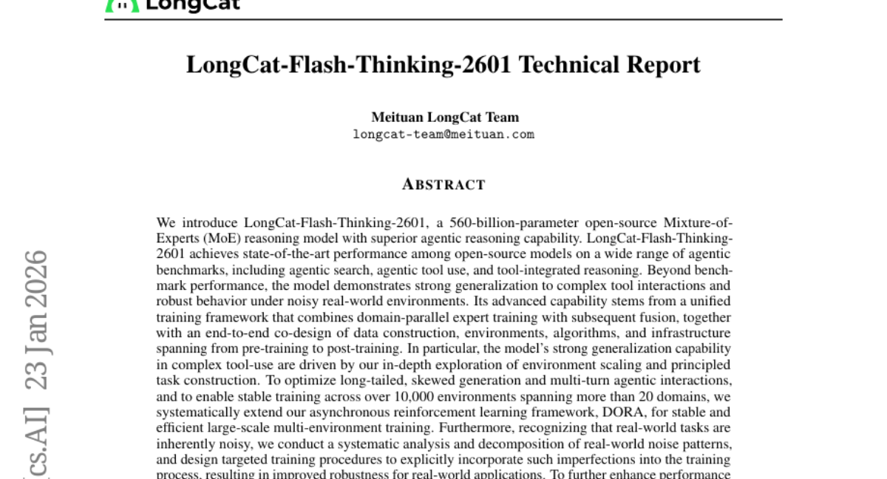
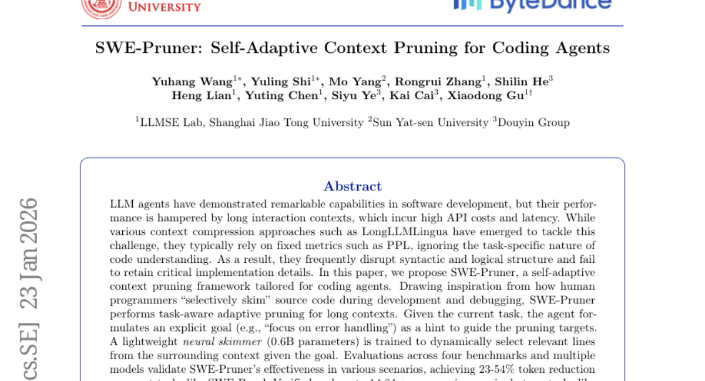
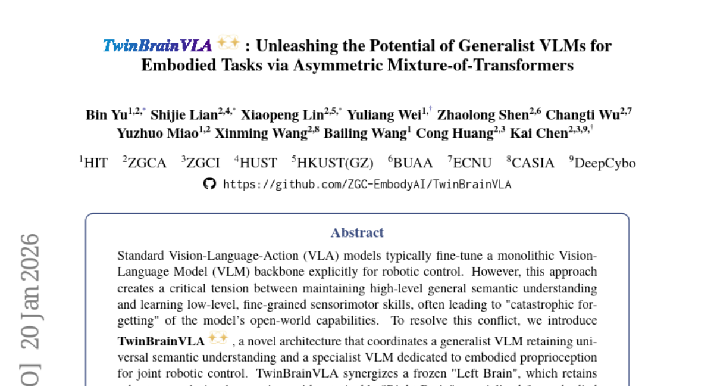
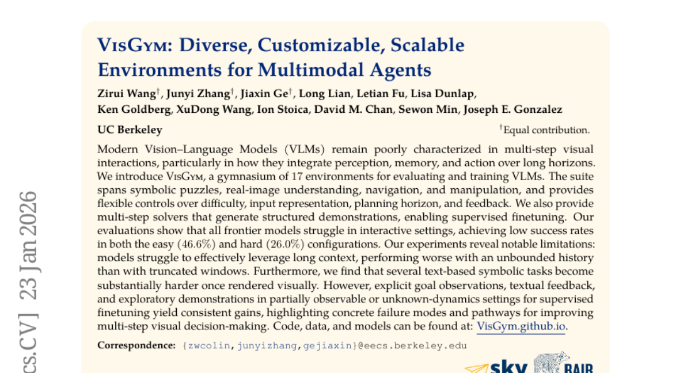
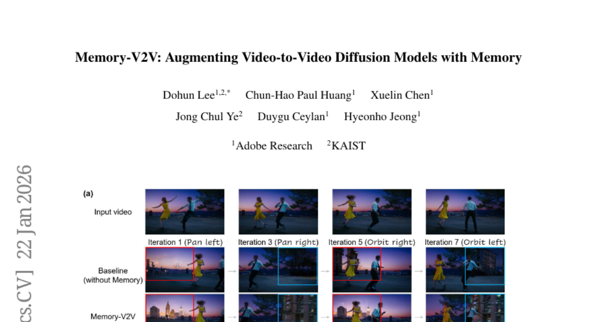

# 2026-01-26 Daily Papers (Top 5)

## 1. [LongCat-Flash-Thinking-2601 Technical Report](https://huggingface.co/papers/2601.16725)
**Upvotes**: 136

### 📌 요약
5600억 매개변수 규모의 개방형 MoE 모델을 통해, 복잡한 도구 사용 및 실제 환경 노이즈에 강인한 세계 최고 수준의 에이전트 추론 능력을 성공적으로 구현하였습니다.

### � 핵심 포인트
- 통합 학습 프레임워크(도메인 병렬 전문가 훈련 및 융합)와 대규모 비동기 강화 학습(DORA 확장)을 통해 10,000개 이상의 환경에서 안정적인 훈련을 달성하고, 테스트 시점에는 추론 깊이와 폭을 확장하는 'Heavy Thinking' 모드를 도입한 것.
- 에이전트 도구 사용 및 추론 벤치마크에서 개방형 모델 중 최고 성능(SOTA)을 달성했으며, 복잡한 도구 상호작용에 대한 뛰어난 일반화 능력과 현실 환경 노이즈에 대한 강력한 내구성 확보.
- 실제 노이즈가 존재하는 환경에서 안정적인 성능을 필요로 하는 AI 에이전트 시스템 개발자 및 연구자, 복잡한 다중 도구 사용 추론이 필요한 애플리케이션.

### 📝 초록 (번역)
AI 에이전트의 발전으로 복잡한 작업을 효율적으로 수행하고 현실 세계의 불완전성에 대처할 수 있는 고성능 모델의 필요성이 커지고 있습니다. 기존 모델들은 복잡한 다중 도구 사용 환경이나 실제 세상의 다양한 노이즈(불완전성) 속에서 성능과 안정성이 저하되는 문제가 있었습니다. 이에 연구팀은 5600억 개의 매개변수를 가진 개방형 MoE(Mixture-of-Experts) 모델인 LongCat-Flash-Thinking-2601을 제안합니다. 이 모델은 도메인 병렬 전문가 훈련과 이후의 융합을 결합한 통일된 훈련 프레임워크를 사용했으며, 특히 10,000개 이상의 다양한 환경에서 안정적인 학습을 위해 비동기 강화 학습 프레임워크인 DORA를 확장했습니다. 또한, 실제 노이즈 패턴을 분석하고 이를 훈련 과정에 명시적으로 통합하여 모델의 강인함을 극대화했습니다. 이 모델은 에이전트 검색, 도구 사용 등 광범위한 에이전트 벤치마크에서 개방형 모델 중 최고 성능(SOTA)을 달성했으며, 복잡한 도구 상호작용 환경에서 탁월한 일반화 능력과 실제 노이즈 상황에 대한 강력한 안정성을 입증했습니다.

---

## 2. [SWE-Pruner: Self-Adaptive Context Pruning for Coding Agents](https://huggingface.co/papers/2601.16746)
**Upvotes**: 62

### 📌 요약
코드 에이전트의 높은 비용과 지연 시간을 유발하는 긴 컨텍스트 문제를, 태스크 목표 기반의 자기 적응형 코드 가지치기(SWE-Pruner)를 통해 해결하여, 성능 저하 없이 최대 14배 이상의 컨텍스트 압축 효과를 입증했습니다.

### � 핵심 포인트
- 명시적인 목표(Goal) 설정에 따라 필요한 코드만 선별적으로 남기는 '태스크 인지형 자기 적응형 가지치기' 기법 (핵심 기여).
- 에이전트 태스크(SWE-Bench Verified)에서 23~54% 토큰 감소 및 단일 턴 태스크(LongCodeQA)에서 최대 14.84배 압축률 달성 (성능 영향 최소화).
- 소프트웨어 개발 및 디버깅 환경에서 긴 컨텍스트를 다루는 코드 에이전트, 개발자 및 LLM 효율성 연구자 (주요 적용 대상).

### 📝 초록 (번역)
최근 LLM 에이전트가 소프트웨어 개발에서 뛰어난 능력을 보이고 있지만, 처리해야 하는 코드가 길어질수록 API 비용이 증가하고 지연 시간이 길어지는 문제가 발생합니다. 기존의 LongLLMLingua 같은 컨텍스트 압축 방법들은 PPL(Perplexity)과 같은 고정된 지표에 의존하여 코드를 압축하기 때문에, 코드를 이해하는 과정에서 문법적, 논리적 구조가 훼손되거나 핵심 구현 정보를 잃어버리는 단점이 있었습니다. 이 논문은 이러한 문제를 해결하기 위해 인간 프로그래머가 개발 및 디버깅 시 필요한 부분만 '선택적으로 훑어보는' 방식에서 영감을 얻어, 코드 에이전트에 특화된 자기 적응형 컨텍스트 프루닝 프레임워크인 SWE-Pruner를 제안합니다. SWE-Pruner는 에이전트가 현재 태스크에 대한 명시적인 목표(예: '오류 처리 집중')를 설정하면, 이 목표를 바탕으로 0.6B 파라미터의 경량 신경망 스키머가 주변 컨텍스트에서 관련 있는 코드 라인만 동적으로 선택하여 가지치기를 수행합니다. 4가지 벤치마크 평가 결과, SWE-Pruner는 SWE-Bench Verified 같은 에이전트 태스크에서 23~54%의 토큰 감소를 이루었고, LongCodeQA 같은 단일 턴 태스크에서는 최대 14.84배의 압축률을 달성하면서도 성능 저하를 최소화하여 그 실효성을 입증했습니다.

---

## 3. [TwinBrainVLA: Unleashing the Potential of Generalist VLMs for Embodied Tasks via Asymmetric Mixture-of-Transformers](https://huggingface.co/papers/2601.14133)
**Upvotes**: 52

### 📌 요약
일반 지식과 로봇 제어 전문성을 동시에 확보하기 위해 두뇌를 분리하고 비대칭적으로 융합하는 혁신적인 VLA 아키텍처를 제안하여 최고 수준의 로봇 조작 성능을 달성했다.

### � 핵심 포인트
- 핵심 혁신: 동결된 범용 VLM('Left Brain')과 학습 가능한 전문 VLM('Right Brain')을 비대칭적 트랜스포머 혼합(AsyMoT) 메커니즘으로 결합한 TwinBrainVLA 아키텍처.
- 성능/결과: SimplerEnv 및 RoboCasa 벤치마크에서 SOTA 대비 우수한 조작 성능을 달성하고, VLM의 기존 일반 시각 이해 능력을 완벽하게 보존함.
- 대상/응용: 범용적 고수준 이해 능력과 정밀한 저수준 물리적 기교가 동시에 요구되는 차세대 범용 로봇 개발 연구자 및 엔지니어.

### 📝 초록 (번역)
기존 Vision-Language-Action (VLA) 모델들은 로봇 제어를 위해 대규모 VLM(Vision-Language Model) 백본을 미세 조정(fine-tuning)하는데, 이 과정에서 고수준의 일반적인 의미 이해 능력을 잃어버리는 '재앙적 망각(catastrophic forgetting)' 문제가 발생합니다. 이 상충되는 문제를 해결하기 위해, 우리는 일반적인 시각 추론 능력을 유지하는 동결된 'Left Brain'과 로봇의 고유 수용 감각(proprioception)에 특화된 학습 가능한 'Right Brain'을 조정하는 TwinBrainVLA 아키텍처를 소개합니다. TwinBrainVLA는 새로운 '비대칭적 트랜스포머 혼합(AsyMoT)' 메커니즘을 통해 Right Brain이 동결된 Left Brain의 풍부한 시맨틱 지식을 동적으로 질의하고, 이를 로봇 상태와 융합하여 정밀한 연속 제어 동작을 생성하는 데 사용합니다. 광범위한 실험 결과, TwinBrainVLA는 SimplerEnv와 RoboCasa 벤치마크에서 SOTA 대비 우수한 조작 성능을 입증했으며, 사전 훈련된 VLM의 포괄적인 시각 이해 능력을 명확히 보존하여 범용 로봇 구축의 새로운 방향을 제시합니다.

---

## 4. [VisGym: Diverse, Customizable, Scalable Environments for Multimodal Agents](https://huggingface.co/papers/2601.16973)
**Upvotes**: 22

### 📌 요약
VisGym은 멀티모달 에이전트의 다단계 상호작용 능력을 진단하고 훈련하기 위해 17가지 환경을 제공하며, 현존하는 최신 VLM들이 장기 기억과 시각적 계획에서 심각한 한계를 보임을 입증한 새로운 표준 벤치마크입니다.

### � 핵심 포인트
- VLM의 다단계 시각적 의사 결정을 평가하고 훈련하기 위한 17가지 환경을 갖춘 사용자 지정 가능한 벤치마크 스위트인 'VisGym' 제안.
- 최신 VLM들이 낮은 성공률(쉬움 46.6%)을 보이며, 특히 긴 컨텍스트(무한한 이력)를 활용할 때 성능이 오히려 저하되는 치명적인 장기 기억 오류를 확인.
- VLM의 장기 기억, 순차적 의사 결정 능력, 멀티모달 에이전트의 강건성 향상을 연구하는 개발자 및 연구자.

### 📝 초록 (번역)
현재의 비전-언어 모델(VLM)들은 복잡한 시각적 환경에서 인지, 기억, 행동을 장기적으로 통합하는 다단계 상호작용 능력에 대한 평가가 부족하다는 문제의식에서 출발했습니다. 이에 우리는 다양한 난이도, 입력 표현, 계획 범위, 피드백 등을 유연하게 제어할 수 있는 17가지 환경(기호 퍼즐, 실제 이미지 이해, 네비게이션, 조작)으로 구성된 새로운 벤치마크 스위트인 'VisGym'을 제안합니다. 또한, 지도 학습을 위한 구조화된 데모를 생성하는 다단계 솔버도 함께 제공합니다. 평가 결과, 현존하는 최신 모델들은 VisGym 환경에서 매우 저조한 성공률(쉬움 46.6%, 어려움 26.0%)을 보였습니다. 특히, 모델들은 무한한 이력(긴 컨텍스트)을 활용할 때 오히려 성능이 저하되는 심각한 장기 기억 문제를 드러냈습니다. 하지만 명시적인 목표 관찰, 텍스트 피드백, 탐색적 데모를 통한 지도 학습은 성능 향상에 일관된 이득을 제공했으며, 향후 VLM 연구의 개선 방향을 명확히 제시했습니다.

---

## 5. [Memory-V2V: Augmenting Video-to-Video Diffusion Models with Memory](https://huggingface.co/papers/2601.16296)
**Upvotes**: 14

### 📌 요약
반복 편집 시 턴 간 일관성(cross-consistency)을 획기적으로 개선하는 명시적 메모리 기반 V2V 프레임워크를 제안하며, 학습 가능한 토큰 압축기를 통해 연산 오버헤드 없이 30% 속도 향상까지 달성했다.

### � 핵심 포인트
- 반복적 비디오 편집의 '턴 간 일관성' 유지를 위한 명시적 메모리 기반 Memory-V2V 프레임워크 제안 및 중복 정보를 압축하는 학습 가능한 토큰 압축기 도입.
- 기존 모델 대비 획기적으로 향상된 턴 간 일관성 달성 및 토큰 압축을 통한 30% 연산 속도 향상.
- 멀티턴 비디오 편집, 비디오 신규 시점 합성, 긴 비디오 편집 등 일관성 유지가 중요한 생성 AI 분야의 연구자와 개발자.

### 📝 초록 (번역)
최근 비디오-투-비디오(V2V) 확산 모델은 외형, 움직임 등을 수정하는 데 뛰어난 성능을 보였습니다. 하지만 실제 비디오 편집은 여러 단계에 걸쳐 결과를 다듬는 '반복적(multi-turn)' 과정인데, 기존 모델들은 연속적인 편집 턴 사이에서 영상의 일관성(cross-consistency)을 유지하는 데 실패한다는 근본적인 문제가 있었습니다.

저자들은 이 문제를 해결하기 위해 기존 V2V 모델에 '명시적 메모리(Explicit Memory)'를 통합한 'Memory-V2V' 프레임워크를 최초로 선보입니다. 이 프레임워크는 과거 편집된 영상을 외부 캐시에 저장하고, 정확한 검색 및 동적 토큰화 전략을 활용하여 현재 편집 단계에 과거의 결과물 정보를 효과적으로 주입합니다. 또한, 연산 효율성과 중복 제거를 위해 DiT 백본 내부에 '학습 가능한 토큰 압축기'를 도입하여 필수 시각 정보를 보존하면서도 중복된 컨디셔닝 토큰을 압축함으로써 전체 속도를 30% 개선했습니다.

Memory-V2V는 비디오 신규 시점 합성이나 텍스트 조건부 장시간 비디오 편집 같은 고난도 작업에서 검증되었으며, 최소한의 연산 부담만으로 기존 최신 기술 대비 현저하게 높은 턴 간 일관성을 확보하고 동시에 작업별 성능도 유지하거나 향상시키는 결과를 보였습니다.

---

