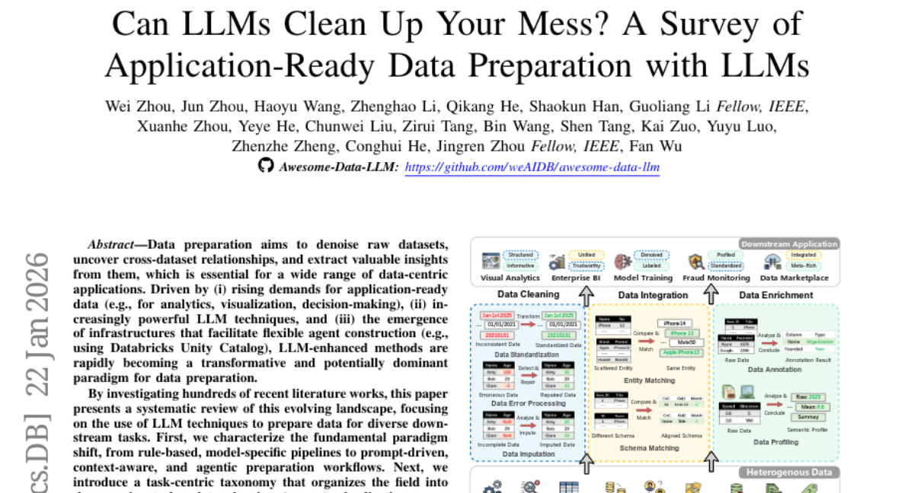
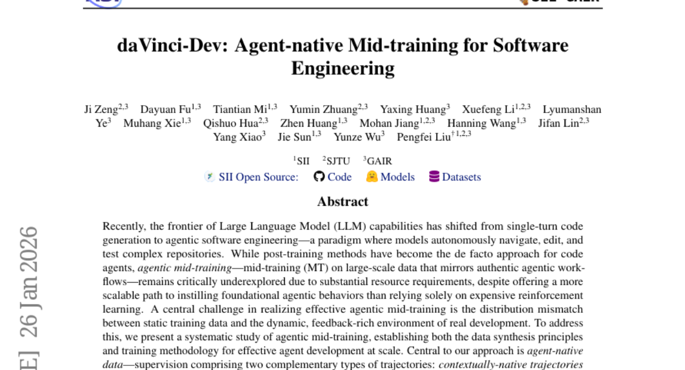
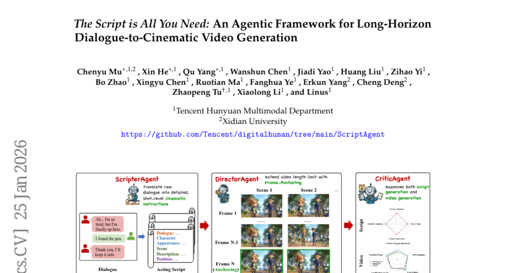
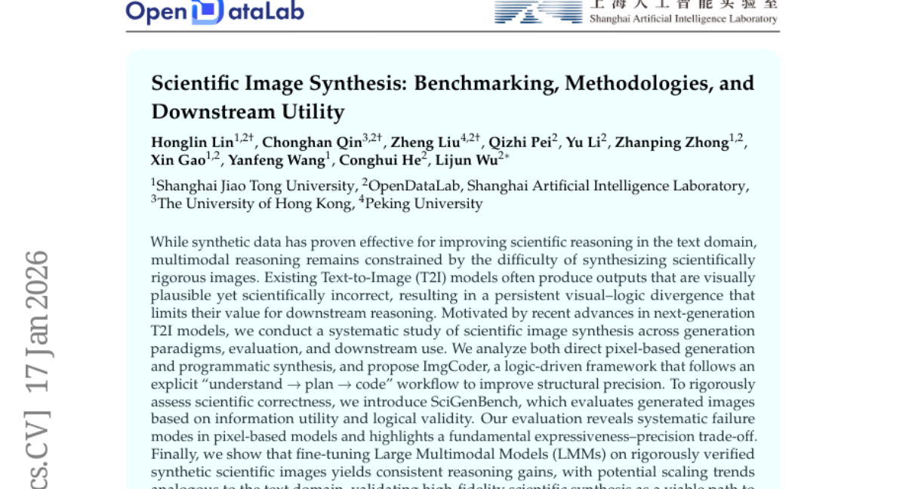
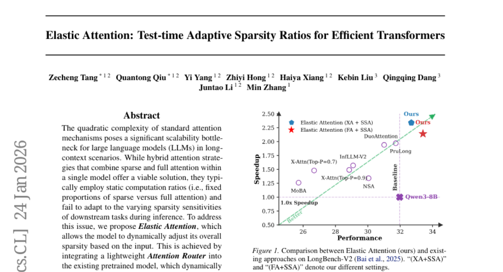

# 2026-01-27 Daily Papers (Top 5)

## 1. [Can LLMs Clean Up Your Mess? A Survey of Application-Ready Data Preparation with LLMs](https://huggingface.co/papers/2601.17058)
**Upvotes**: 126

### 📌 요약
데이터 준비 작업을 규칙 기반의 고정된 파이프라인에서 프롬프트 기반의 상황 인식적 에이전트 워크플로우로 혁신하는 LLM 기반 방법론의 현황과 미래 로드맵을 체계적으로 제시하는 핵심 보고서입니다.

### � 핵심 포인트
- 규칙 기반 방식에서 프롬프트 기반의 상황 인식적 에이전트 워크플로우로의 데이터 준비 패러다임 전환을 정의하고, 클리닝, 통합, 강화라는 3대 핵심 태스크로 체계화했습니다.
- LLM의 강점(일반화 능력, 높은 의미론적 이해)을 확인하는 동시에, 확장성 비용, 지속적인 환각 발생, 그리고 고급 방법론에 비해 미흡한 평가 프로토콜과 같은 명확한 한계를 지적합니다.
- 데이터 품질 및 준비 기술의 최신 동향을 파악하려는 연구자, 그리고 확장 가능하고 신뢰도 높은 LLM 기반 데이터 시스템 및 에이전트 파이프라인을 구축하려는 개발자.

### 📝 초록 (번역)
데이터 분석 및 의사결정의 기초가 되는 데이터 준비 작업이 강력한 LLM 기술의 등장으로 혁신을 맞고 있습니다. 기존의 규칙 기반 및 모델 특화된 방식은 유연성이 부족했지만, 이제 프롬프트 기반, 상황 인식적, 에이전트 중심의 워크플로우로 패러다임이 전환되고 있습니다. 이 논문은 LLM을 활용한 데이터 클리닝(표준화, 오류 처리), 데이터 통합(스키마 매칭), 데이터 강화(데이터 주석)라는 세 가지 핵심 태스크를 중심으로 최신 기술 동향을 체계적으로 분석합니다. LLM이 제공하는 향상된 일반화 및 의미론적 이해 능력과 더불어, 높은 확장 비용, 지속적인 환각 문제, 그리고 미흡한 평가 방식과 같은 현재의 명확한 한계점들을 제시합니다. 최종적으로 확장 가능한 LLM-데이터 시스템 및 신뢰도 높은 에이전트 워크플로우 구축을 위한 미래 로드맵을 제시합니다.

---

## 2. [daVinci-Dev: Agent-native Mid-training for Software Engineering](https://huggingface.co/papers/2601.18418)
**Upvotes**: 104

### 📌 요약
자율 소프트웨어 에이전트 개발의 핵심 난제였던 '에이전트 미드 트레이닝'의 효율적인 방법론을 정립하고, 적은 학습량으로도 최고 수준의 문제 해결 능력을 입증했습니다.

### � 핵심 포인트
- 대규모 에이전트 미드 트레이닝을 위한 '에이전트 네이티브 데이터' 합성 방법론(Contextually-native 및 Environmentally-native 궤적)을 제시하여 확장 가능한 학습 경로를 정립한 것이 핵심입니다.
- `SWE-Bench Verified`에서 72B 모델이 58.5%의 문제 해결률을 달성했으며, 이전 공개 레시피 대비 절반 이하의 학습 토큰만을 사용해 효율성과 성능 모두에서 우위를 점했습니다.
- 자율 소프트웨어 엔지니어링 에이전트(Autonomous Software Engineering Agents)를 개발하거나, 대규모 에이전트 미드 트레이닝 및 확장 가능한 에이전트 학습 방법론을 연구하는 개발자 및 연구자에게 유용합니다.

### 📝 초록 (번역)
최근 LLM의 역량은 단순한 코드 생성에서 벗어나 복잡한 리포지토리를 자율적으로 수정하고 테스트하는 '에이전트 기반 소프트웨어 엔지니어링' 패러다임으로 전환되고 있습니다. 하지만 이 분야에서 잠재력이 높은 '에이전트 미드 트레이닝'(MT)은 막대한 자원 소모와 정적 학습 데이터와 동적 개발 환경 간의 불일치 문제 때문에 실현이 어려웠습니다. 

본 논문은 이 문제를 해결하기 위해 실제 에이전트 워크플로우를 반영하는 '에이전트 네이티브 데이터' 기반의 체계적인 미드 트레이닝 방법을 제시합니다. 이 데이터는 에이전트의 전체 정보 흐름을 보존하는 'Contextually-native' 궤적과, 실제 도구 및 테스트 호출을 포함하여 상호작용의 진정성을 확보하는 'Environmentally-native' 궤적으로 구성되어 깊이와 다양성을 동시에 제공합니다.

그 결과, 기존 공개 미드 트레이닝 모델 대비 절반 이하의 학습 토큰(73.1B)만 사용하고도 `SWE-Bench Verified`에서 72B 모델이 58.5%의 문제 해결률을 달성하며, 자율 소프트웨어 엔지니어링 분야에서 월등한 성능 우위를 입증했습니다.

---

## 3. [The Script is All You Need: An Agentic Framework for Long-Horizon Dialogue-to-Cinematic Video Generation](https://huggingface.co/papers/2601.17737)
**Upvotes**: 46

### 📌 요약
대화 스크립트를 장편의 일관된 시네마틱 영상으로 변환하는 에이전트 기반 프레임워크를 제시하여, 기존 영상 생성 모델의 스토리 일관성 문제를 혁신적으로 해결했습니다.

### � 핵심 포인트
- 대화 기반 장편 영상 생성을 위한 에이전트 기반 프레임워크 (ScripterAgent, DirectorAgent) 및 신규 대규모 벤치마크(ScriptBench) 도입.
- 스크립트 충실도와 시간적 일관성에서 큰 폭의 향상을 달성했으며, 영상-스크립트 정렬(VSA)이라는 새로운 평가 지표를 제시.
- 자동화된 영화 제작(Automated Filmmaking) 시스템 구축 및 긴 호흡의 내러티브 일관성 연구를 진행하는 개발자/연구자.

### 📝 초록 (번역)
최근의 영상 생성 모델은 짧은 텍스트 프롬프트에는 뛰어난 성능을 보이지만, 대화 같은 고수준 개념을 기반으로 긴 서사를 만들 때는 서사 일관성을 유지하는 데 어려움을 겪는 '의미론적 격차(semantic gap)'가 존재했습니다.

이 문제를 해결하기 위해, 이 논문은 대화 기반 시네마틱 영상 생성을 위한 종단 간(end-to-end) 에이전트 기반 프레임워크를 제안합니다. 핵심은 거친 대화 스크립트를 상세하고 실행 가능한 시네마틱 스크립트로 변환하는 'ScripterAgent'이며, 이를 위해 전문가 주도 파이프라인을 통해 주석 처리된 대규모 멀티모달 벤치마크인 'ScriptBench'를 구축했습니다.

생성된 스크립트는 'DirectorAgent'가 이어받아 최신 영상 모델들을 장면 간 연속 생성 전략(cross-scene continuous generation strategy)으로 조직화하여 장편의 일관성을 보장합니다. 

AI 기반 'CriticAgent'와 새로운 VSA(Visual-Script Alignment) 지표를 활용한 종합 평가 결과, 제안된 프레임워크가 모든 테스트 모델에서 스크립트 충실도와 시간적 정확도를 크게 향상시킴을 입증했습니다. 또한, 현재 SOTA 모델들이 시각적 화려함과 엄격한 스크립트 준수 사이에서 상충 관계를 보인다는 중요한 통찰을 제공하며, 이는 미래의 자동화된 영화 제작에 유용할 것입니다.

---

## 4. [Scientific Image Synthesis: Benchmarking, Methodologies, and Downstream Utility](https://huggingface.co/papers/2601.17027)
**Upvotes**: 34

### 📌 요약
기존 T2I 모델의 시각적 오류 한계를 극복하기 위해 논리 기반 이미지 합성 프레임워크(ImgCoder)와 평가 벤치마크(SciGenBench)를 제시하고, 고품질 합성 데이터가 대규모 멀티모달 모델(LMM)의 과학적 추론 능력을 비약적으로 향상시킬 수 있음을 입증했습니다.

### � 핵심 포인트
- 핵심 기여: 과학적 이미지 합성의 구조적 정밀도를 높이기 위한 '이해-계획-코드' 워크플로우 기반의 논리 중심 프레임워크 ImgCoder 제안 및 과학적 정확성을 평가하는 SciGenBench 벤치마크 도입.
- 성능/결과: 기존 픽셀 기반 모델의 체계적 오류를 밝히고, 합성된 고품질 데이터를 활용하여 대규모 멀티모달 모델(LMM)을 파인튜닝했을 때 일관된 과학적 추론 능력 향상(스케일링 잠재력 확인).
- 대상/응용 분야: 과학적 정확성을 갖춘 합성 데이터셋을 구축하여 대규모 멀티모달 모델(LMM)의 과학적 추론 능력을 획기적으로 향상시키고자 하는 AI 연구자 및 개발자.

### 📝 초록 (번역)
합성 데이터는 텍스트 기반 과학 추론 분야에서 효과적임이 입증되었으나, 멀티모달 영역에서는 과학적 정확성을 갖춘 이미지를 합성하기 어려워 추론 능력 개발에 제약이 있었습니다. 기존 텍스트-이미지(T2I) 모델들은 시각적으로는 그럴듯하지만 과학적으로는 오류가 있는 이미지(시각-논리 불일치)를 자주 생성하는 문제가 있었습니다. 본 논문은 이러한 문제를 해결하고자 이미지 생성 패러다임 전반을 체계적으로 연구했습니다.

해결책으로, 명시적인 '이해 - 계획 - 코딩' 워크플로우를 따르는 논리 중심 프레임워크 'ImgCoder'를 제안하여 구조적 정밀도를 높였습니다. 또한, 생성된 이미지의 정보 효용성과 논리적 타당성을 엄격하게 평가하기 위한 벤치마크 'SciGenBench'를 도입했습니다.

연구 결과, 픽셀 기반 모델의 체계적인 실패 모드를 발견했으며 표현력과 정밀도 사이의 근본적인 트레이드오프를 확인했습니다. 가장 중요한 것은, 엄격하게 검증된 합성 과학 이미지를 사용하여 대규모 멀티모달 모델(LMM)을 파인튜닝했을 때 일관된 추론 능력 향상이 관찰되었으며, 이는 텍스트 분야와 유사한 스케일링 잠재력이 있음을 시사하여 고정밀 과학적 합성이 멀티모달 추론 능력을 여는 핵심 경로임을 검증했습니다.

---

## 5. [Elastic Attention: Test-time Adaptive Sparsity Ratios for Efficient Transformers](https://huggingface.co/papers/2601.17367)
**Upvotes**: 26

### 📌 요약
입력의 특성에 맞춰 주의 메커니즘의 희소성 비율을 실시간으로 조절하는 'Elastic Attention'을 제시하여, 장문맥 LLM의 효율성과 성능 저하 없는 확장을 동시에 달성한 핵심 기술이다.

### � 핵심 포인트
- 경량의 'Attention Router'를 활용하여 추론 시 입력 데이터에 맞춰 희소성 비율을 동적으로 조정하는 핵심 메커니즘.
- 12시간의 짧은 훈련(8xA800)만으로 3가지 장문맥 벤치마크에서 기존 방식을 능가하는 성능과 뛰어난 추론 효율성을 달성.
- 긴 문맥 처리가 필요한 시나리오에서 대규모 언어 모델(LLM)의 계산 효율성과 확장성을 개선하고자 하는 AI 연구자 및 개발자.

### 📝 초록 (번역)
대규모 언어 모델(LLM)이 긴 문맥을 처리할 때 표준 주의 메커니즘의 2차 복잡도(O(N²))로 인해 확장성 병목 현상이 발생합니다. 기존에 희소(Sparse)와 전체(Full) 주의를 결합한 하이브리드 방식이 있었지만, 이는 고정된 비율을 사용하기 때문에 입력이나 특정 작업의 희소성 민감도에 유연하게 적응하지 못하는 문제가 있었습니다. 이 문제를 해결하기 위해, 우리는 입력에 따라 모델의 전체 희소성을 동적으로 조절하는 'Elastic Attention'을 제안합니다. 이 기술은 기존 모델에 경량의 'Attention Router'를 통합하여, 각 주의 헤드가 실시간으로 적절한 계산 모드에 할당되도록 합니다. 그 결과, 짧은 훈련 시간(8xA800에서 12시간)만으로도 널리 사용되는 LLM을 활용한 3가지 장문맥 벤치마크에서 뛰어난 성능과 효율적인 추론 속도를 동시에 달성했습니다.

---

