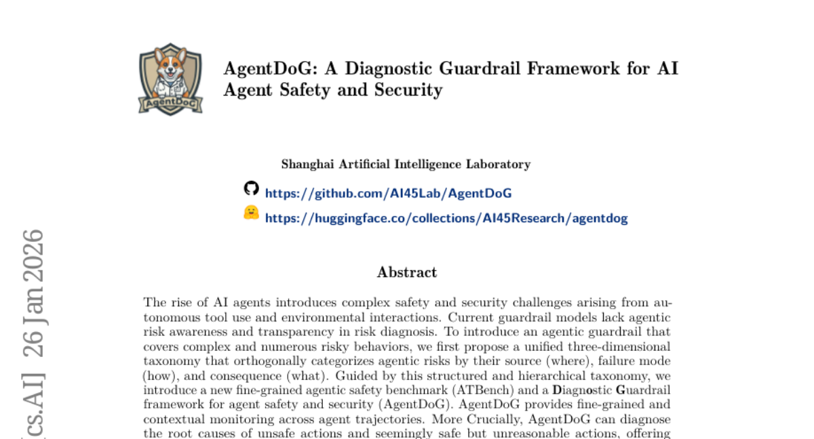
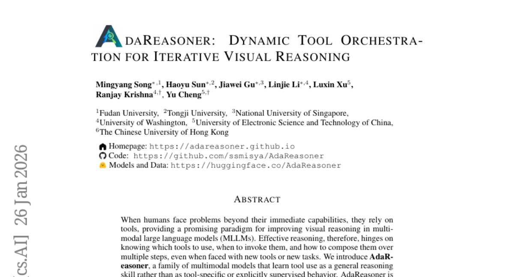
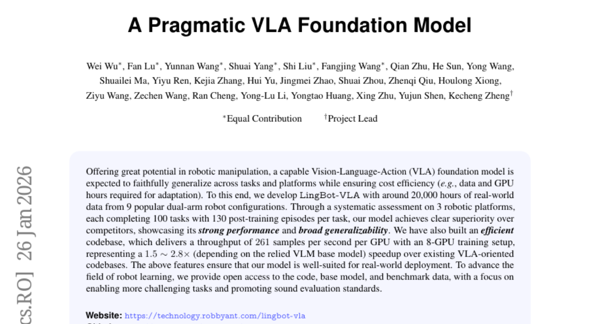
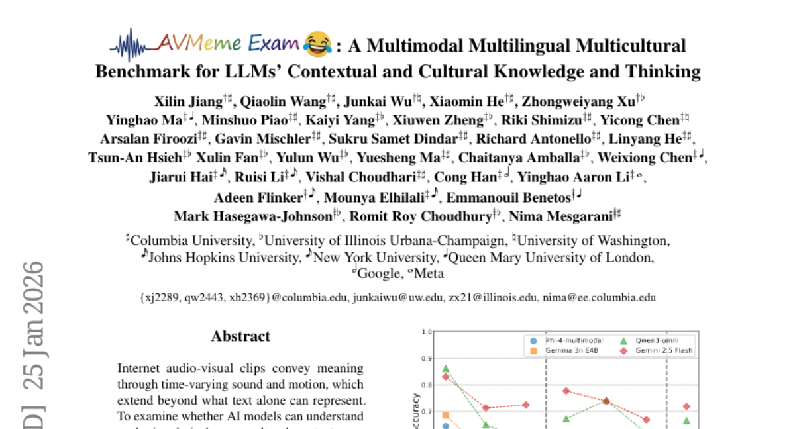
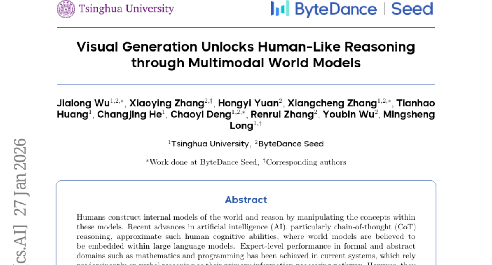

# 2026-01-28 Daily Papers (Top 5)

## 1. [AgentDoG: A Diagnostic Guardrail Framework for AI Agent Safety and Security](https://huggingface.co/papers/2601.18491)
**Upvotes**: 59

### 📌 요약
자율 AI 에이전트의 복잡한 안전 문제를 해결하기 위해, 3차원 위험 분류 체계를 기반으로 위험의 근본 원인을 투명하게 진단하고 최첨단(SOTA) 성능을 달성한 진단형 가드레일 프레임워크 AgentDoG를 제안했습니다.

### � 핵심 포인트
- 통일된 3차원 위험 분류 체계와 근본 원인 진단 기능을 갖춘 투명한 진단형 가드레일 프레임워크(AgentDoG) 개발.
- 복잡한 상호작용 시나리오에서 최첨단(SOTA) 안전 중재 성능 달성 및 진단 모델과 에이전트 안전 벤치마크 데이터셋(ATBench) 공개.
- 도구 사용 및 환경 상호작용 기능을 갖춘 자율 AI 에이전트를 구축하거나 정렬(Alignment)하려는 개발자 및 연구자.

### 📝 초록 (번역)
AI 에이전트가 도구 사용과 환경 상호작용을 통해 발전하면서 복잡한 안전 및 보안 문제가 발생하고 있습니다. 기존의 가드레일 모델들은 에이전트의 행위적 위험을 인지하거나 위험 진단 과정이 투명하지 않다는 한계가 있었습니다.

이러한 복잡하고 다양한 위험을 체계적으로 분류하기 위해, 위험의 근본 원인(어디서), 실패 방식(어떻게), 결과(무엇)를 기준으로 하는 통일된 3차원 분류 체계를 제시했습니다. 이 분류 체계를 바탕으로 새로운 벤치마크(ATBench)와 진단형 가드레일 프레임워크인 AgentDoG를 개발했습니다. AgentDoG는 에이전트의 행동 궤적을 미세하게 모니터링할 뿐만 아니라, 위험 행동이나 겉보기에 안전해 보이지만 비합리적인 행동의 근본 원인을 진단하여 이력을 투명하게 제공합니다.

Qwen 및 Llama 계열 모델(4B, 7B, 8B)로 구현된 AgentDoG는 광범위한 실험에서 복잡한 상호작용 시나리오에 걸쳐 최첨단(SOTA) 에이전트 안전 중재 성능을 입증했으며, 모든 모델과 데이터셋은 공개되었습니다.

---

## 2. [AdaReasoner: Dynamic Tool Orchestration for Iterative Visual Reasoning](https://huggingface.co/papers/2601.18631)
**Upvotes**: 38

### 📌 요약
MLLM이 일반적인 추론 능력으로 도구 사용을 익히고, 강화 학습 기반의 동적 도구 오케스트레이션을 통해 SOTA 성능을 달성하며 GPT-5와 같은 강력한 모델을 능가하는 혁신적인 모델, AdaReasoner를 제안합니다.

### � 핵심 포인트
- 강화 학습(Tool-GRPO)과 적응형 학습 메커니즘을 통해 도구 사용을 일반적인 추론 능력으로 학습시켜 도구 오케스트레이션을 동적으로 수행하며, 보지 못한 도구에도 일반화합니다. (Core Contribution)
- 7B 기본 모델 대비 평균 +24.9%의 압도적인 성능 향상을 달성했으며, VSP 및 Jigsaw 등 주요 벤치마크에서 GPT-5와 같은 강력한 독점 시스템을 능가하는 SOTA 결과를 보였습니다. (Performance/Results)
- 시각적 추론 및 다중 모드 작업에서 도구의 활용과 조합 능력을 극대화하려는 MLLM 연구자 및 복잡한 AI 시스템 개발자에게 핵심적인 통찰력을 제공합니다. (Target/Application)

### 📝 초록 (번역)
배경: 복잡한 시각적 추론(Visual Reasoning)을 개선하기 위해 인간처럼 MLLM(Multimodal Large Language Model)도 도구(Tool)를 활용하는 패러다임이 주목받고 있습니다. 문제: 기존 모델은 어떤 도구를 언제, 어떻게 조합하여 사용해야 할지(오케스트레이션)를 일반적인 추론 기술로 학습하지 못하고, 새로운 도구나 작업에 쉽게 적응하지 못하는 문제가 있었습니다. 해결책: 이 논문은 AdaReasoner를 소개하며, 이는 장기적인 다단계 도구 상호작용 데이터를 구축하고, 최종 작업 성공을 기반으로 도구 선택 및 순서를 최적화하는 강화 학습(Tool-GRPO) 알고리즘과 동적 적응 메커니즘을 결합하여 도구 사용을 일반적인 추론 능력으로 학습시킵니다. 결과: AdaReasoner는 명시적인 훈련 없이도 작업 요구에 따라 유용한 도구를 자율적으로 채택하고 불필요한 도구를 억제하는 강력한 적응 능력을 보여줍니다. 결과적으로, 기본 7B 모델의 성능을 평균 +24.9% 향상시키고 VSP 및 Jigsaw와 같은 도전적인 벤치마크에서 GPT-5를 능가하는 SOTA 결과를 달성했습니다.

---

## 3. [A Pragmatic VLA Foundation Model](https://huggingface.co/papers/2601.18692)
**Upvotes**: 24

---

## 4. [AVMeme Exam: A Multimodal Multilingual Multicultural Benchmark for LLMs' Contextual and Cultural Knowledge and Thinking](https://huggingface.co/papers/2601.17645)
**Upvotes**: 17

### 📌 요약
LLM의 표면적 이해를 넘어선 문화적 및 맥락적 지식을 심층적으로 측정하는 독창적인 시청각 벤치마크 'AVMeme Exam'을 제시하며, 현존하는 최신 멀티모달 모델들의 중대한 한계를 입증했습니다.

### � 핵심 포인트
- 핵심 혁신: 인터넷 밈을 활용하여 멀티모달 모델의 문화적, 맥락적 이해도를 다층적으로 평가하는 최초의 인간 큐레이팅 벤치마크 'AVMeme Exam'을 구축.
- 성능/결과: 현존하는 MLLM들은 텍스트가 없는 음악 및 음향 효과에서 특히 취약하며, 표면적 이해는 가능해도 문화적/맥락적 사고 능력은 인간 대비 현저히 낮은 것으로 확인됨.
- 대상/응용 분야: 인간 정렬 AI 연구자, 멀티모달 시스템의 문화적 인지 능력을 향상시키려는 MLLM 개발자 및 엔지니어.

### 📝 초록 (번역)
인터넷의 시청각 클립(밈)은 시간의 흐름에 따른 소리와 움직임을 통해 단순한 텍스트 이상의 의미와 인간 문화적 맥락을 전달합니다. 이러한 신호를 AI 모델이 얼마나 정확하게 이해하는지 검증하기 위한 체계적인 도구가 필요했습니다. 이에 연구팀은 대화, 노래, 음악, 음향 효과 등 1,000개 이상의 상징적인 인터넷 밈으로 구성된 인간 큐레이팅 벤치마크인 'AVMeme Exam'을 도입했습니다. 각 밈은 표면적 내용부터 맥락, 감정, 사용법, 세계 지식에 이르는 다층적 이해도를 측정하는 고유한 Q&A 쌍과 함께 제작 연도, 스크립트, 요약, 민감도 등 풍부한 메타데이터를 포함합니다. 이 벤치마크를 통해 최신 멀티모달 대규모 언어 모델(MLLM)을 인간 참가자들과 비교 평가한 결과, 현재 모델들은 텍스트가 없는 음악이나 음향 효과에 취약하며, 표면적인 콘텐츠 이해 수준에 비해 맥락적 및 문화적 사고 능력에서 현저히 낮은 성능을 보였습니다. 이러한 결과는 인간 정렬 멀티모달 지능에 중대한 격차가 있음을 시사하며, 단순히 듣고 보는 것을 넘어 문화적 및 맥락적으로 인지할 수 있는 모델 개발이 시급함을 강조합니다.

---

## 5. [Visual Generation Unlocks Human-Like Reasoning through Multimodal World Models](https://huggingface.co/papers/2601.19834)
**Upvotes**: 16

### 📌 요약
시각적 생성(visual generation)을 내재적 세계 모델로 활용하는 '시각 우위 가설'을 최초로 입증하며, 기존 언어 모델이 취약했던 물리 및 공간 추론 능력에서 인간 수준에 근접하는 획기적인 발전을 이끌었습니다.

### � 핵심 포인트
- 물리 및 공간 추론을 위한 '시각 우위 가설(Visual Superiority Hypothesis)' 제시와 시각적 생성 능력을 세계 모델로 활용하는 시각-언어 상호작용적 CoT 추론 방식 제안.
- 시각적 세계 모델링이 요구되는 새로운 벤치마크(VisWorld-Eval)에서, 기존의 순수 언어적 CoT 대비 교차(interleaved) 방식이 월등한 성능 향상을 달성했음을 실험적으로 입증.
- 물리적/공간적 지능, 로보틱스, 그리고 차세대 인간 중심 멀티모달 AI 모델의 추론 능력을 극대화하려는 연구자 및 엔지니어.

### 📝 초록 (번역)
{"배경": "인간은 내면의 세계 모델(World Model)을 구축하여 추론하며, AI는 CoT(Chain-of-Thought) 추론을 통해 이를 근사하고 있습니다. 현재 AI는 수학이나 프로그래밍 같은 추상적 영역에서는 뛰어난 성능을 보이지만, 이는 주로 언어적 추론에 의존합니다.", "문제": "하지만 물리적, 공간적 지능이 필요한 영역에서는 기존의 순수 언어 기반 세계 모델이 표현력의 한계와 부족한 사전 지식으로 인해 병목 현상을 겪으며 인간보다 훨씬 뒤처져 있습니다.", "해결책": "이 논문은 시각적 생성과 언어적 생성이 모두 가능한 통합 멀티모달 모델(UMMs)을 활용하여, 특정 과업(특히 물리적 세계에 기반한)에서 시각적 생성이 더 우월한 세계 모델 역할을 한다는 '시각 우위 가설'을 제시합니다. 핵심적으로, 시각적 생성 단계와 언어적 추론 단계를 교차(interleaved)하는 CoT 추론 방식을 제안하고, 새로운 평가 벤치마크 VisWorld-Eval을 구축했습니다.", "결과": "최신 UMM 모델을 사용한 통제 실험 결과, 시각적 세계 모델링이 필수적인 작업에서는 이 상호작용적(interleaved) CoT 방식이 순수 언어적 CoT 방식 대비 월등히 뛰어난 성능을 보였습니다. 이는 멀티모달 세계 모델링이 더욱 강력하고 인간적인 추론 능력을 갖춘 AI를 실현할 잠재력을 명확히 보여줍니다."}

---

