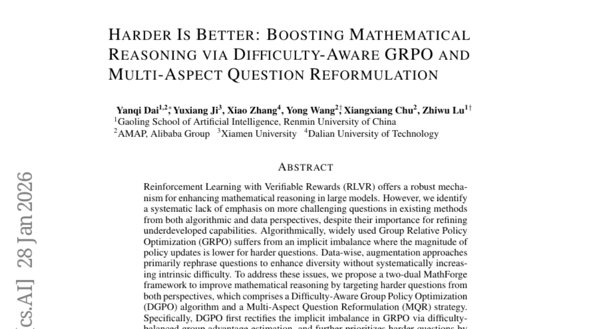
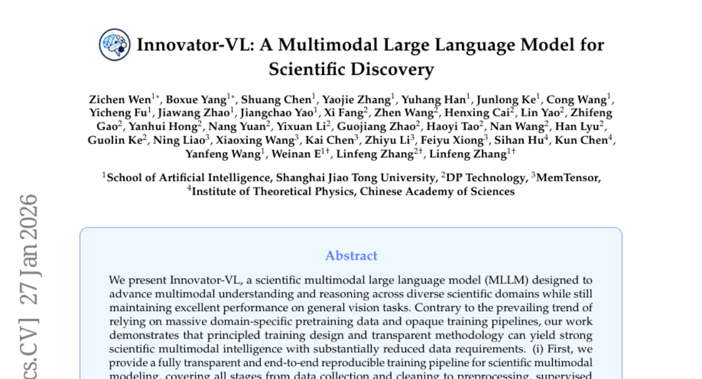
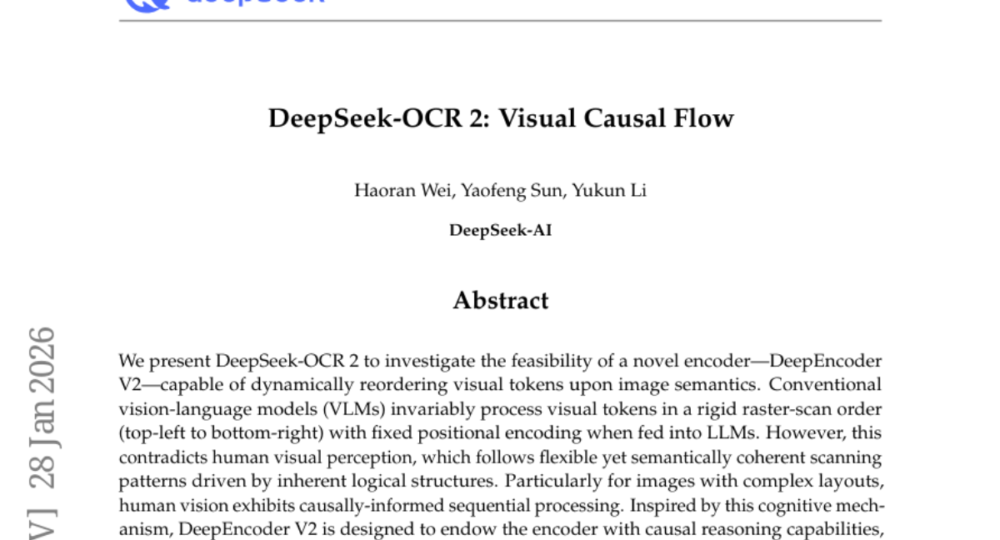
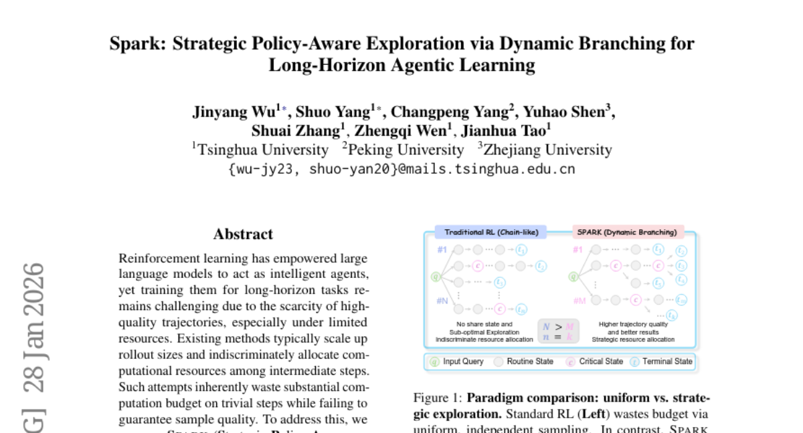

# 2026-01-29 Daily Papers (Top 5)

## 1. [Harder Is Better: Boosting Mathematical Reasoning via Difficulty-Aware GRPO and Multi-Aspect Question Reformulation](https://huggingface.co/papers/2601.20614)
**Upvotes**: 92

### 📌 요약
기존 RL 기반 수학 추론 학습의 난이도 불균형 문제를 해결하기 위해, 어려운 문제를 효과적으로 공략하는 새로운 알고리즘(DGPO)과 난이도 상승 데이터 전략(MQR)을 통합한 MathForge 프레임워크를 제시하여 수학적 추론 능력을 획기적으로 향상시켰습니다.

### � 핵심 포인트
- 핵심 기여: 난이도 인식 학습 알고리즘(DGPO)과 난이도 상승 데이터 증강 전략(MQR)을 결합하여 고난도 문제 학습 효율을 극대화하는 MathForge 이중 프레임워크를 제안.
- 성능/결과: 난이도 불균형을 해결함으로써 다양한 수학 추론 벤치마크에서 기존의 RLVR 기반 학습 방식들(예: GRPO)보다 훨씬 우월한 성능을 달성.
- 적용 대상: 고급 수학 추론 LLM 개발 연구자 및 강화 학습 기반 생성 모델 미세 조정을 담당하여 모델의 'Underdeveloped' 역량을 끌어올리려는 AI 엔지니어.

### 📝 초록 (번역)
RLVR(강화 학습 기반 검증 보상)은 대규모 언어 모델의 수학적 추론 능력을 강화하는 핵심 기술입니다. 하지만 기존 방법론들은 모델의 미개발된 역량을 끌어올리는 데 필수적인 '어려운' 문제들을 알고리즘(GRPO)과 데이터 측면 모두에서 체계적으로 다루지 못했습니다. 즉, 알고리즘적으로는 GRPO가 어려운 문제에 대한 정책 업데이트를 충분히 반영하지 못했고, 데이터 증강은 단순히 다양성만 높일 뿐 난이도를 높이지 못했습니다.

이에 본 논문은 어려운 문제를 집중 공략하는 이중 접근 방식인 MathForge 프레임워크를 제안합니다. MathForge는 기존 GRPO의 불균형을 해소하고 어려운 문제를 우선 학습하도록 설계된 DGPO(난이도 인식 그룹 정책 최적화) 알고리즘과, 정답은 유지하되 문제 자체의 본질적 난이도를 높여 재구성하는 MQR(다중 관점 질문 재구성) 전략으로 구성됩니다.

MathForge는 MQR로 데이터 영역을 확장하고 DGPO로 이 확장된 고난도 데이터를 효과적으로 학습하는 강력한 시너지를 통해, 다양한 수학 추론 벤치마크에서 기존 방법들을 크게 능가하는 우수한 성능을 입증했습니다.

---

## 2. [Advancing Open-source World Models](https://huggingface.co/papers/2601.20540)
**Upvotes**: 64

### 📌 요약
비디오 생성 기술에서 발전한 오픈소스 세계 모델 'LingBot-World'는 장기 시뮬레이션의 일관성 및 실시간 상호작용 능력을 극대화하여 콘텐츠, 게임, 로봇 학습 분야에 혁신적인 발판을 마련했습니다.

### � 핵심 포인트
- 핵심 기여: 비디오 생성 기술에서 파생된 최상위 성능의 오픈소스 세계 시뮬레이터(World Simulator)인 LingBot-World 최초 공개.
- 성능/결과: 분 단위의 장기적 문맥 일관성(Long-term Memory) 유지 및 16FPS 기준 1초 미만의 지연 시간(Latency)을 달성하는 실시간 상호작용 지원.
- 활용 분야: 고품질 콘텐츠 제작, 실감형 게임 환경 구축, 정교한 로봇 학습 및 시뮬레이션.

### 📝 초록 (번역)
AI 연구에서 고성능 세계 모델(World Model)의 중요성이 커지고 있지만, 최고 수준의 성능을 가진 모델은 대개 접근성이 낮은 폐쇄형 기술에 한정되어 있었습니다. 이러한 문제 해결을 위해 본 논문은 비디오 생성 기술을 기반으로 하는 오픈소스 세계 시뮬레이터 'LingBot-World'를 제안합니다. 이 모델은 현실적인 환경뿐만 아니라 과학적 맥락, 카툰 스타일 등 광범위한 영역에서 높은 충실도와 강력한 동역학을 유지하는 것이 특징입니다. 특히, 분 단위의 긴 시간 동안 문맥적 일관성(장기 기억)을 보존하는 능력을 보여주었으며, 16FPS 생성 시 1초 미만의 지연 시간으로 실시간 상호작용까지 가능하게 했습니다. 연구팀은 코드와 모델을 공개함으로써 오픈소스 기술과 폐쇄형 기술 간의 성능 격차를 줄이는 데 기여하고, 이를 통해 콘텐츠 제작, 게이밍, 로봇 학습 등의 분야에 실질적인 응용이 가능할 것으로 기대하고 있습니다.

---

## 3. [Innovator-VL: A Multimodal Large Language Model for Scientific Discovery](https://huggingface.co/papers/2601.19325)
**Upvotes**: 52

### 📌 요약
Innovator-VL은 투명한 훈련 방법론과 선별적 데이터 활용을 통해 대규모 데이터에 의존하지 않고도 과학 분야에서 강력한 추론 능력을 발휘하는 멀티모달 LLM의 새로운 기준을 제시했습니다.

### � 핵심 포인트
- 핵심은 대규모 데이터 사전 학습 없이도 강력한 성능을 달성하는 '원칙 기반의 투명한 훈련 방법론'을 제시했다는 점입니다. 모든 훈련 과정(데이터 수집, SFT, RL 등)이 재현 가능하도록 상세히 공개되었습니다.
- 500만 개 미만의 엄선된 샘플만을 사용하여 대규모 사전 학습 모델에 필적하는 과학적 추론 및 일반 비전 작업 성능을 달성했습니다. 데이터의 양보다는 질과 선별이 중요함을 입증했습니다.
- 재현 가능성이 높은 효율적인 과학 모델 개발을 목표로 하는 연구자 및 개발자. 적은 데이터로도 강력한 과학적 추론 기능(Scientific Alignment)과 일반 목적 기능이 모두 필요한 응용 분야에 적합합니다.

### 📝 초록 (번역)
과학 분야는 복잡한 이미지와 데이터를 이해하고 추론하는 멀티모달 LLM을 필요로 하지만, 기존 모델들은 방대한 도메인 전용 데이터와 불투명한 훈련 파이프라인에 의존하는 경향이 있었습니다. 이러한 방식은 높은 데이터 비효율성과 낮은 재현성을 야기했습니다. 이에 본 논문은 'Innovator-VL'이라는 새로운 과학용 멀티모달 LLM을 제안합니다. Innovator-VL은 대규모 사전 학습 없이도 원칙에 입각한 훈련 설계와 선별된 데이터 사용에 집중했으며, 특히 데이터 수집부터 미세 조정, 강화 학습(RL), 평가에 이르는 전 과정을 완전히 투명하고 재현 가능하도록 공개했습니다. 그 결과, Innovator-VL은 500만 개 미만의 엄선된 샘플만을 사용했음에도 불구하고 일반 비전 작업은 물론 다양한 과학 벤치마크에서 기존 대규모 모델과 경쟁하는 강력한 성능을 달성했습니다. 이는 효율적이고 재현 가능한 과학 특화 멀티모달 모델 구축이 대규모 데이터 없이도 가능하다는 실질적인 기반을 제공합니다.

---

## 4. [DeepSeek-OCR 2: Visual Causal Flow](https://huggingface.co/papers/2601.20552)
**Upvotes**: 23

### 📌 요약
기존의 고정된 이미지 처리 순서를 넘어, 시각 토큰을 의미론적으로 재정렬하는 새로운 인코더(DeepEncoder V2)를 도입하여 인간의 시각적 흐름처럼 작동하는 진정한 2D 이해의 가능성을 연 혁신적인 연구입니다.

### � 핵심 포인트
- 핵심 혁신: 이미지 의미론에 기반하여 시각 토큰의 입력 순서를 동적으로 재정렬하는 인과 추론 인코더(DeepEncoder V2)를 도입하여, 고정된 래스터 스캔 방식의 한계를 극복했습니다.
- 성능/결과: 2D 이미지를 두 단계의 1D 인과 추론 구조로 처리하여, 복잡한 레이아웃에 대해 인간의 시각적 흐름과 유사한 '진정한 2D 추론'을 달성할 잠재력을 제시합니다.
- 활용 대상: 복잡한 문서 레이아웃 분석(OCR), VLM/LLM 아키텍처의 인과적 흐름 처리 방식에 관심 있는 연구자 및 개발자. 모델 코드와 가중치가 공개되었습니다.

### 📝 초록 (번역)
VLMs(Vision-Language Models)은 시각 정보를 언어 모델에 연결하지만, 전통적인 모델들은 시각 토큰을 항상 왼쪽 상단부터 오른쪽 하단으로 딱딱하게 스캔하는 고정된 순서로 처리합니다. 이는 복잡한 이미지 레이아웃의 논리적 구조를 따라 유연하게 정보를 해석하는 인간의 인지적 방식(인과적 흐름)과 크게 모순됩니다. 

이러한 문제를 해결하기 위해, DeepSeek-OCR 2는 이미지에 내재된 의미적 구조와 인과 관계를 파악하여 시각 토큰의 순서를 동적으로 재정렬하는 능력을 가진 'DeepEncoder V2'를 제안합니다. 이 인코더는 2D 이미지의 이해를 두 단계의 1D 인과 추론 구조(인코더의 재정렬 및 LLM의 해석)로 나누어 처리함으로써, 기존 아키텍처의 한계를 뛰어넘어 진정한 2D 추론을 달성할 수 있는 새로운 아키텍처적 패러다임을 제시합니다.

---

## 5. [Spark: Strategic Policy-Aware Exploration via Dynamic Branching for Long-Horizon Agentic Learning](https://huggingface.co/papers/2601.20209)
**Upvotes**: 12

### 📌 요약
긴 작업 수행 에이전트 학습에서 자원 낭비를 막고 샘플 효율을 극대화하기 위해, 핵심 결정 시점에만 동적 분기 탐색을 수행하는 'Spark' 프레임워크를 제안하여 압도적인 성능 향상을 입증했습니다.

### � 핵심 포인트
- 자원 효율적인 탐색을 위해 에이전트의 정책 신호를 활용하여 핵심 결정 시점에만 선택적으로 동적 분기를 수행하는 전략적 탐색 방법론 (Core Innovation: Dynamic Branching at Key-states).
- 훨씬 적은 학습 샘플로도 높은 성공률을 달성하며, 다양한 장기 계획 태스크(예: 환경 내 계획)에서 강력한 일반화 능력을 입증함 (Performance: High Success Rate, Sample Efficiency).
- 긴 작업 수행(Long-horizon) 에이전트 학습 및 LLM 기반 에이전트 개발자 및 연구자. (특히 자원 효율성과 샘플 품질 개선이 필요한 분야) (Target: Long-horizon Agentic Learning Researchers).

### 📝 초록 (번역)
최근 강화 학습(RL)은 대규모 언어 모델(LLM)을 지능형 에이전트로 만드는 데 핵심적인 역할을 하고 있습니다. 하지만 이러한 에이전트들을 긴 작업(Long-horizon tasks)에 대해 훈련시키려면 고품질 궤적 데이터가 부족하고 학습 자원도 한정적이라는 큰 문제에 직면합니다. 기존 방법들은 단순히 롤아웃 규모를 키우거나 모든 중간 단계에 계산 자원을 똑같이 할당하기 때문에, 사소한 단계에 예산을 낭비하며 정작 중요한 샘플 품질은 보장하지 못했습니다.

이를 해결하기 위해 저희는 'Spark'(Strategic Policy-Aware exploRation via Key-state dynamic branching)라는 새로운 프레임워크를 제안합니다. Spark의 핵심은 에이전트의 내재적인 의사결정 신호를 활용하여, 특히 중요하거나 불확실한 '핵심 결정 상태(Key-state)'에서만 탐색 경로를 동적으로 분기하는 것입니다. 이 전략적 접근 방식을 통해 무작정 탐색 범위를 넓히기보다 고품질 샘플링에 자원을 집중하여 효율성을 극대화합니다.

다양한 작업(예: 환경 내 계획/Embodied planning)에서 Spark를 실험한 결과, 훨씬 적은 학습 샘플만으로도 기존 방법론 대비 월등히 높은 성공률을 달성했으며, 심지어 이전에 보지 못한 시나리오에서도 강력하고 견고한 일반화 능력을 보여주었습니다.

---

