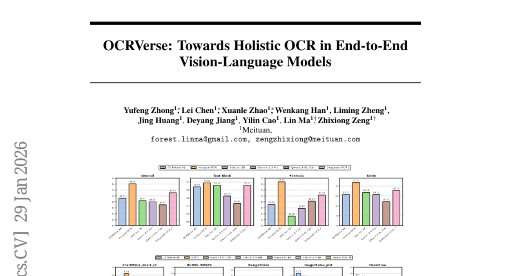

# 2026-01-30 Daily Papers (Top 5)

## 1. [Idea2Story: An Automated Pipeline for Transforming Research Concepts into Complete Scientific Narratives](https://huggingface.co/papers/2601.20833)
**Upvotes**: 111

### 📌 요약
LLM 기반 과학 연구 에이전트의 고질적인 문제인 실시간 추론의 비효율성과 환각 문제를 해결하고, 사전 구축된 지식 그래프를 통해 신뢰도 높은 자율 과학 발견을 가능하게 하는 새로운 패러다임을 제시합니다.

### � 핵심 포인트
- 실시간 문헌 분석 및 추론 방식(runtime reasoning)을 오프라인 지식 구축 및 방법론적 지식 그래프(Methodological Knowledge Graph) 재사용 방식으로 전환하여 LLM의 한계를 극복함.
- LLM 컨텍스트 윈도우 문제를 해소하고 반복적인 실시간 추론 비용을 대폭 절감함. 방법론적으로 건전하고 참신한(novel) 고품질 연구 결과를 효율적으로 생성함.
- 컴퓨팅 비용 효율성과 신뢰성을 높이려는 자율 과학 발견 에이전트(Autonomous Scientific Discovery Agents) 개발자 및 연구 커뮤니티.

### 📝 초록 (번역)
최근 LLM 기반 에이전트가 과학 연구의 전 과정을 자동화하며 상당한 발전을 이루고 있습니다. 하지만 기존 시스템은 연구 문헌을 실시간으로 반복해서 읽고 추론하는 '실시간 실행(runtime-centric)' 방식에 의존했습니다. 이는 컴퓨팅 비용이 매우 높고, 컨텍스트 윈도우 한계에 부딪히며, 추론이 불안정해지고 환각(hallucination)을 일으키는 주원인이었습니다.

우리는 이러한 문제를 해결하기 위해 'Idea2Story'라는 사전 연산 기반 프레임워크를 제안합니다. 이 시스템은 문헌 이해 과정을 실시간 추론이 아닌 '오프라인 지식 구축'으로 전환합니다. Idea2Story는 논문과 리뷰 피드백을 지속적으로 수집하고, 핵심 방법론 단위를 추출하며, 이를 구조화된 '방법론적 지식 그래프(Methodological Knowledge Graph)'로 미리 조직합니다.

런타임에는 사용자의 연구 의도가 이 지식 그래프에 기반하여 정립된 연구 패턴과 효율적으로 연결됩니다. 이를 통해 LLM의 컨텍스트 병목 현상을 완화하고 반복적인 실시간 문헌 추론을 크게 줄일 수 있습니다. 예비 연구 결과, Idea2Story는 방법론적으로 건전하고 참신한(novel) 연구 패턴을 생성할 수 있으며, 신뢰할 수 있는 엔드 투 엔드(end-to-end) 연구 시연 능력을 입증하여 자율 과학 발견의 실용적이고 확장 가능한 기반을 마련했음을 보여주었습니다.

---

## 2. [Everything in Its Place: Benchmarking Spatial Intelligence of Text-to-Image Models](https://huggingface.co/papers/2601.20354)
**Upvotes**: 96

### 📌 요약
기존 T2I 모델들이 간과했던 복잡한 공간 추론 능력을 정확히 평가하고 데이터 중심 학습을 통해 성능을 비약적으로 끌어올릴 수 있는 새로운 표준 벤치마크와 고밀도 데이터셋을 제시했습니다.

### � 핵심 포인트
- 복잡한 공간 지능 평가를 위한 정보 밀도 높은 벤치마크(SpatialGenEval)와 파인튜닝용 데이터셋(SpatialT2I)을 최초로 구축.
- 최신 T2I 모델들이 고차원 공간 추론에 취약함을 확인했으나, SpatialT2I로 파인튜닝 시 최대 5.7% 성능 향상을 달성하며 데이터의 영향력을 증명함.
- T2I 모델의 공간 관계 정밀도와 신뢰성을 높이려는 개발자 및 공간 추론/장면 구성 연구를 진행하는 AI 연구자.

### 📝 초록 (번역)
최근 텍스트-이미지(T2I) 모델들이 뛰어난 이미지 품질을 보이고 있지만, '왼쪽에', '뒤에 숨겨진' 같은 복잡하고 고차원적인 공간 관계(공간 지능)를 이해하고 생성하는 데는 여전히 취약합니다. 기존 벤치마크는 짧고 정보가 희소한 프롬프트만 다루기 때문에 이러한 모델의 공간적 오류를 제대로 포착하지 못했습니다.

이 문제를 해결하기 위해, 본 논문은 10가지 공간 세부 영역을 포함하고 정보 밀도가 높은 1,230개의 긴 프롬프트로 구성된 새로운 평가 벤치마크인 **SpatialGenEval**을 제안합니다. 또한, 이 고밀도 디자인을 활용하여 모델 개선에 사용할 수 있는 15,400쌍의 텍스트-이미지 데이터셋인 **SpatialT2I**를 구축했습니다.

총 21개 최신 모델을 SpatialGenEval로 평가한 결과, 특히 객체 간의 고차원 공간 추론 영역이 T2I 모델의 주요 병목 지점임이 확인되었습니다. 하지만 SpatialT2I 데이터셋으로 주요 기반 모델(Stable Diffusion-XL 등)을 파인튜닝한 결과, 일관되게 4.2%에서 5.7%까지 성능이 향상되었으며 훨씬 현실적인 공간 관계 묘사가 가능해져, T2I 공간 지능 달성을 위한 데이터 중심 접근법의 중요성을 입증했습니다.

---

## 3. [Scaling Embeddings Outperforms Scaling Experts in Language Models](https://huggingface.co/papers/2601.21204)
**Upvotes**: 73

### 📌 요약
전문가 확장(MoE)의 효율성 한계를 극복하기 위해 임베딩(Embedding) 레이어를 파격적으로 확장하는 새로운 희소성(Sparsity) 스케일링 방법론을 제시했으며, 이를 통해 68.5B급 모델에서 더 우수한 성능과 실질적인 추론 속도 향상을 동시에 달성했습니다.

### � 핵심 포인트
- 핵심 확장 혁신: 기존 MoE(전문가 확장)의 대안으로 임베딩 확장(Embedding Scaling)을 제시하고, 더 우수한 성능 대 효율성(Pareto frontier)을 제공함을 입증.
- 성능 및 결과: 68.5B 파라미터 규모의 LongCat-Flash-Lite 모델(활성 파라미터 ~3B)을 처음부터 훈련하여, 파라미터가 유사한 MoE 기준 모델들을 능가하며 에이전트 및 코딩 도메인에서 특히 강력한 성능 발휘.
- 주요 대상 및 활용: 시스템 제약 없이 효율적인 희소성 확장을 모색하는 개발자 및 연구자. 특히, 복잡한 에이전트 기반 작업이나 고성능 코딩 능력이 요구되는 LLM 분야.

### 📝 초록 (번역)
최근 대규모 언어 모델(LLM)에서 희소성(Sparsity)을 확장하기 위한 표준으로 MoE(Mixture-of-Experts) 아키텍처가 자리 잡았지만, 시스템 병목 현상과 효율성 저하 문제에 직면하고 있습니다. 이 논문은 MoE의 대안으로 '임베딩 확장(Embedding Scaling)'이라는 새로운 확장 차원을 제시하며, 특정 조건에서 임베딩 확장이 전문가 확장보다 월등히 우수한 성능 대 비용 효율(Pareto frontier)을 제공함을 체계적으로 분석했습니다. 

이러한 효과를 실질적인 추론 속도 향상으로 변환하기 위해 맞춤형 시스템 최적화와 투기적 디코딩(speculative decoding) 기법을 통합적으로 활용했습니다. 이러한 통찰을 바탕으로 68.5B 파라미터(활성 파라미터 약 3B) 모델인 LongCat-Flash-Lite를 개발했는데, 전체 파라미터의 30B 이상을 임베딩에 할당했음에도 불구하고 동등한 파라미터 규모의 MoE 기준 모델들을 뛰어넘었으며, 특히 에이전트 및 코딩 분야에서 강력한 경쟁력을 입증했습니다.

---

## 4. [DynamicVLA: A Vision-Language-Action Model for Dynamic Object Manipulation](https://huggingface.co/papers/2601.22153)
**Upvotes**: 43

### 📌 요약
DynamicVLA는 효율적인 0.4B 아키텍처와 추론/실행을 겹치는 연속적 추론 기법을 통합하여, 기존 VLA 모델이 어려움을 겪던 움직이는 객체 조작 환경에서 반응 속도와 일반화 성능을 획기적으로 향상시킨 범용 프레임워크입니다.

### � 핵심 포인트
- 핵심 기여: 동적 VLA 제어를 위한 효율적인 컨볼루션 인코더 기반의 경량 0.4B 아키텍처와, 낮은 지연 시간(Low Latency)을 확보하는 연속적 추론 및 실행 기법을 통합한 폐쇄 루프 제어 프레임워크.
- 성능 및 결과: 자체 구축한 대규모 DOM 벤치마크에서 기존 모델 대비 반응 속도, 대상 객체에 대한 인지 정확도, 다양한 환경에서의 일반화 성능이 획기적으로 향상됨.
- 적용 대상: 실시간 로보틱스, 특히 움직이는 객체에 대한 정밀한 조작(Dynamic Manipulation)이 필요하거나, 빠르고 효율적인 VLA 시스템 개발을 추구하는 연구자 및 엔지니어.

### 📝 초록 (번역)
기존 Vision-Language-Action (VLA) 모델들은 정적인 물체 조작에서는 뛰어난 성능을 보였지만, 빠르게 움직이는 동적 객체를 다루는 시나리오처럼 실시간으로 연속적인 제어와 시공간 예측이 필요할 때는 취약하다는 문제점이 있었습니다. DynamicVLA는 이러한 동적 조작 문제를 해결하기 위해 시공간 추론 능력과 폐쇄 루프 적응 기능을 통합한 새로운 프레임워크를 제시합니다. 핵심 설계로는 1) 공간적으로 효율적이고 빠른 추론이 가능한 0.4B의 경량 VLA 아키텍처, 2) 추론과 실행을 겹쳐 지연 시간을 줄이는 '연속적 추론(Continuous Inference)', 3) 인지-실행 간의 시간적 불일치를 해소하는 '잠재 인지 기반 액션 스트리밍'을 채택했습니다. 또한, 동적 조작 연구의 기초 데이터 부족을 해소하기 위해 20만 건 이상의 합성 데이터와 2천 건의 실제 데이터를 포함하는 대규모 DOM(Dynamic Object Manipulation) 벤치마크를 구축했습니다. 이 종합적인 평가를 통해 DynamicVLA는 반응 속도, 인지 정확도, 일반화 성능 측면에서 현저한 개선을 보였으며, 범용적인 동적 객체 조작을 위한 통일된 기반을 마련했습니다.

---

## 5. [OCRVerse: Towards Holistic OCR in End-to-End Vision-Language Models](https://huggingface.co/papers/2601.21639)
**Upvotes**: 41

### 📌 요약
기존의 한계를 넘어, OCRVerse는 텍스트 중심 및 비전 중심의 OCR을 통합한 최초의 종단 간 솔루션으로, 복잡하고 시각적인 정보가 풍부한 데이터 추출의 새로운 장을 열었습니다.

### � 핵심 포인트
- 텍스트 중심 OCR과 비전 중심 OCR을 통합한 최초의 '전체론적(Holistic) OCR' 방법론 제시
- SFT와 RL을 결합한 2단계 멀티 도메인 학습 방법론(RL 단계에서 도메인별 맞춤형 보상 전략 활용)
- 텍스트 및 비전 중심 데이터에서 모두 경쟁력 있는 성능 달성 (대규모 모델 수준)

### 📝 초록 (번역)
대규모 비전 언어 모델(LVLM)의 발전으로 다양한 시각 데이터에서 정보를 추출하는 OCR 기술의 중요성이 커지고 있습니다. 하지만 기존 OCR은 신문, 책 같은 '텍스트 중심' 문서 인식에만 치중되어 있으며, 차트, 웹 페이지, 과학 그래프처럼 '시각적 정보가 밀집된' 이미지를 분석하는 '비전 중심' OCR은 소홀히 다루었습니다. 이에 우리는 '텍스트 중심'과 '비전 중심' OCR을 통합하는 최초의 '전체론적(holistic)' 종단 간(end-to-end) 방법인 **OCRVerse**를 제안합니다. OCRVerse는 SFT(지도 미세 조정)와 RL(강화 학습)을 결합한 2단계 훈련 방식을 사용하는데, 특히 RL 단계에서는 각 도메인(문서 vs. 차트)의 특성에 맞춘 보상 전략을 유연하게 설계하여 교차 도메인 데이터의 충돌을 방지하고 통합 성능을 극대화합니다. 실험 결과, OCRVerse는 텍스트 중심 및 비전 중심 데이터 유형 모두에서 경쟁력 있는 결과를 보여주었으며, 대규모 상용 모델과 견줄 만한 성능을 입증했습니다.

---

