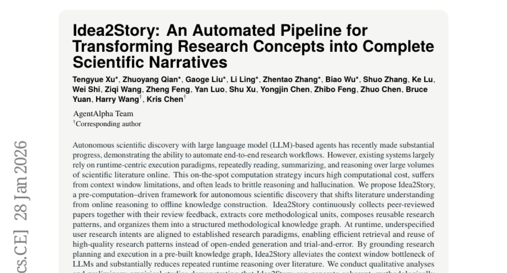
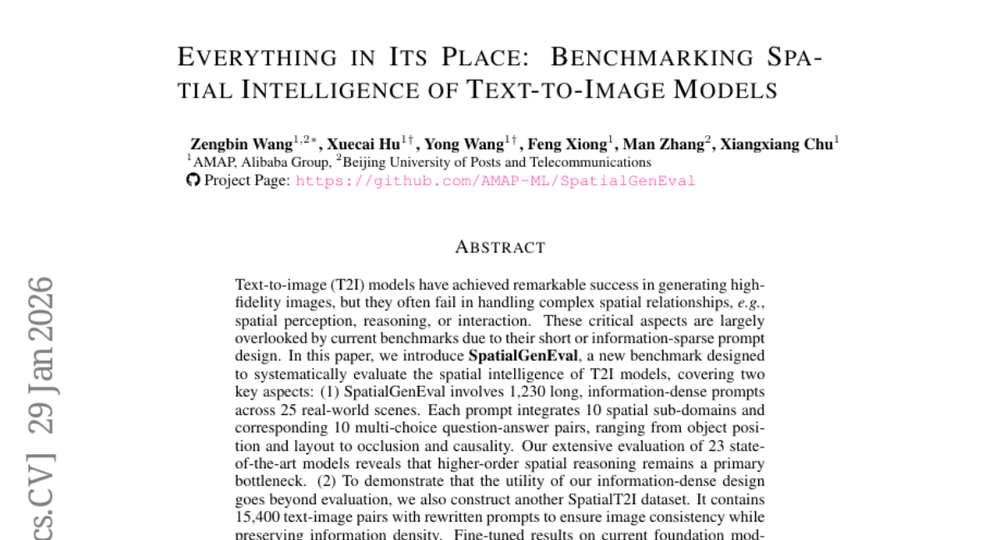
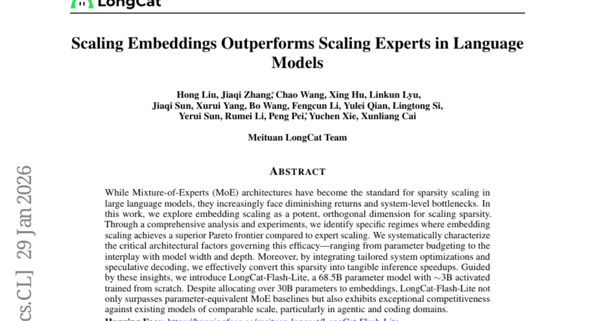
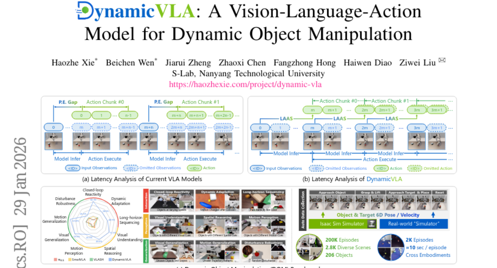
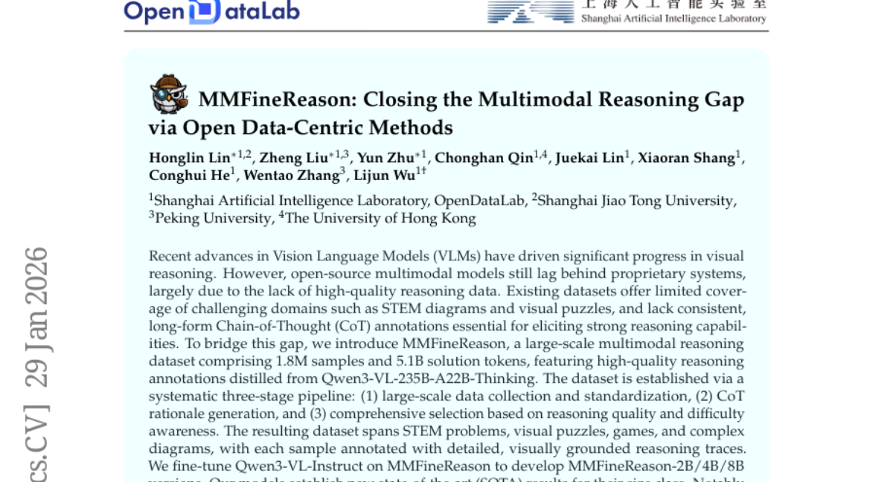

# 2026-01-30 Daily Papers (Top 5)

## 1. [Idea2Story: An Automated Pipeline for Transforming Research Concepts into Complete Scientific Narratives](https://huggingface.co/papers/2601.20833)
**Upvotes**: 133

### 📌 요약
기존 LLM 기반 과학 연구 에이전트의 비효율적인 실시간 문헌 분석 방식을 혁신하고, 사전 구축된 방법론 지식 그래프를 활용하여 신뢰성 높고 확장 가능한 자율 과학 발견의 토대를 마련한 프레임워크입니다.

### � 핵심 포인트
- 실시간 문헌 분석 추론에서 사전 구축된 방법론 지식 그래프를 활용하는 오프라인 지식 구성 방식으로의 전환 (Shifting from Online Reasoning to Offline Knowledge Graph Construction for scientific literature understanding).
- LLM의 컨텍스트 창 제약을 완화하고, 일관성 있고 방법론에 근거한 새로운 연구 패턴을 효율적으로 생성함 (Alleviating the LLM context window bottleneck and efficiently generating coherent, methodologically grounded novel research patterns).
- 계산 효율성과 신뢰성을 높여야 하는 자율 과학 발견 에이전트 개발자 및 연구 방법론의 체계적인 재사용이 필요한 연구자 (Developers of autonomous scientific discovery agents requiring higher efficiency and reliability, and researchers needing systematic reuse of established research methodologies).

### 📝 초록 (번역)
최근 대규모 언어 모델(LLM)을 활용한 자율 과학 연구가 상당한 진전을 이루고 있습니다. 하지만 기존 시스템은 연구 과정에서 방대한 문헌을 실시간으로 읽고 요약하며 추론하는 방식(runtime-centric)에 의존하기 때문에, 계산 비용이 매우 높고, LLM의 컨텍스트 창 제한에 쉽게 부딪히며, 추론 과정에서 오류(환각)가 발생하는 문제가 있었습니다. 이에 우리는 문헌 이해 작업을 실시간 온라인 추론에서 오프라인 지식 구축으로 전환하는 사전 연산 기반 프레임워크인 'Idea2Story'를 제안합니다. Idea2Story는 학술 논문과 검토 피드백을 지속적으로 수집하여 핵심 방법론 단위를 추출하고, 이를 재사용 가능한 연구 패턴으로 조합한 뒤, 구조화된 '방법론 지식 그래프'로 조직화합니다. 런타임에는 사용자의 추상적인 연구 의도를 이 미리 구축된 지식 그래프와 연계하여 고품질 연구 패턴을 효율적으로 검색하고 재사용합니다. 이 프레임워크는 LLM의 컨텍스트 창 병목 현상을 해소하고 반복적인 실시간 추론을 대폭 줄여, 방법론적으로 타당하고 새로운 연구 패턴을 생성하는 데 성공했습니다. 결과적으로 Idea2Story는 신뢰성 있는 자율 과학 발견을 위한 실용적이고 확장 가능한 기반을 제공함을 입증했습니다.

---

## 2. [Everything in Its Place: Benchmarking Spatial Intelligence of Text-to-Image Models](https://huggingface.co/papers/2601.20354)
**Upvotes**: 103

### 📌 요약
정보 밀도가 높은 새로운 벤치마크와 대규모 데이터셋을 통해 텍스트-투-이미지 모델의 고차원 공간 추론 능력을 체계적으로 평가하고 데이터 중심 개선 방안을 제시한 연구.

### � 핵심 포인트
- 핵심은 10개 공간 하위 도메인 및 25개 실제 장면을 포함하는 정보 밀도가 높은 새로운 벤치마크 'SpatialGenEval'과 이를 기반으로 구축된 15,400쌍의 학습 데이터셋 'SpatialT2I'를 제안한 것입니다.
- 최신 T2I 모델들은 고차원 공간 추론에서 심각한 병목 현상을 보였으나, SpatialT2I 데이터셋으로 파인 튜닝 시 기존 모델들의 공간 지능 성능이 최대 5.7% 향상되었습니다.
- 공간 관계 정확도와 복잡한 프롬프트 처리가 중요한 T2I 모델 개발자 및 높은 공간 지능을 가진 모델을 훈련하고자 하는 AI 연구원에게 필수적인 평가 기준 및 데이터셋을 제공합니다.

### 📝 초록 (번역)
최신 T2I(Text-to-Image) 모델들은 이미지 품질 면에서 놀라운 발전을 이루었지만, 사물 간의 복잡한 공간 관계(예: 위치, 가려짐, 인과 관계 등)를 처리하는 데는 여전히 취약하다는 한계를 보였습니다. 기존 평가 방법들은 짧고 정보가 부족한 프롬프트를 사용하여 이러한 '공간 지능' 문제를 제대로 측정하지 못했습니다.

이에 본 논문은 10가지 공간 하위 도메인과 25개의 실제 장면을 포괄하는 1,230개의 길고 정보 밀도가 높은 프롬프트로 구성된 새로운 벤치마크인 'SpatialGenEval'을 제시했습니다. 또한, 평가를 넘어 학습 데이터의 개선 가능성을 입증하기 위해, 이 프롬프트를 기반으로 이미지 일관성을 유지하며 정보 밀도를 높인 15,400쌍의 대규모 'SpatialT2I' 데이터셋을 구축했습니다.

21개 최신 모델을 평가한 결과, 모델들이 특히 고차원 공간 추론 영역에서 심각한 병목 현상을 겪고 있음을 명확히 확인했습니다. 하지만 SpatialT2I 데이터셋으로 주요 기반 모델(SDXL, Uniworld 등)을 미세 조정(Fine-tuning)하자 성능이 4.2%에서 최대 5.7%까지 일관되게 향상되어, 공간 지능 확보를 위해서는 데이터셋 개선이 핵심적인 '데이터 중심 패러다임'임을 입증했습니다.

---

## 3. [Scaling Embeddings Outperforms Scaling Experts in Language Models](https://huggingface.co/papers/2601.21204)
**Upvotes**: 86

### 📌 요약
전문가(MoE) 확장 대신 임베딩 크기를 대폭 확장하는 혁신적인 접근법을 통해, 기존 MoE 모델의 시스템 병목을 극복하고 에이전트 및 코딩 영역에서 압도적인 성능을 보이는 새로운 고성능 희소 모델을 성공적으로 제시했습니다.

### � 핵심 포인트
- 핵심 혁신: 전문가(Expert) 확장 대신 임베딩(Embedding) 확장이 LLM 희소화의 새로운, 더 효율적인 접근법임을 제시하고 그 효용성을 입증함.
- 성능 및 결과: 68.5B 'LongCat-Flash-Lite' 모델이 파라미터가 비슷한 MoE 모델들보다 우수하며, 특히 에이전트 및 코딩 작업에서 뛰어난 경쟁력을 보임.
- 대상 및 응용: MoE 병목 현상에 직면한 연구자 및 개발자, 그리고 임베딩 확장과 투기적 디코딩을 통한 실질적인 추론 속도 향상 및 특정 도메인(에이전트/코딩) 최적화를 원하는 사용자.

### 📝 초록 (번역)
배경: 대규모 언어 모델(LLM)에서 모델의 희소성(Sparsity)을 확장하는 주류 방식은 MoE(Mixture-of-Experts) 구조입니다. 문제: 하지만 MoE는 점차 성능 향상의 효율이 떨어지고 있으며, 특히 시스템 수준에서 병목 현상을 유발하는 한계에 봉착했습니다. 해결책: 본 연구는 MoE와 독립적으로 임베딩(Embedding) 크기를 확장하는 것이 훨씬 더 우수한 파레토 최적점(Pareto Frontier)을 제공하는 희소화 방식임을 입증했습니다. 우리는 임베딩 확장 효과를 극대화하는 아키텍처 요소를 체계적으로 분석하고, 추론 시 실질적인 속도 향상을 위해 투기적 디코딩(Speculative Decoding) 같은 맞춤형 시스템 최적화를 통합했습니다. 결과: 이러한 통찰을 바탕으로 개발된 68.5B 파라미터 모델(활성화 파라미터 약 3B)인 'LongCat-Flash-Lite'는 총 파라미터의 30B 이상을 임베딩에 할당했음에도 불구하고, 파라미터 규모가 비슷한 기존 MoE 모델들을 능가했으며, 특히 에이전트 및 코딩 도메인에서 뛰어난 경쟁력을 보였습니다.

---

## 4. [DynamicVLA: A Vision-Language-Action Model for Dynamic Object Manipulation](https://huggingface.co/papers/2601.22153)
**Upvotes**: 55

### 📌 요약
DynamicVLA는 초소형 0.4B 구조와 혁신적인 연속 추론 기술을 결합하여, 실시간으로 움직이는 객체를 정확하게 조작할 수 있도록 VLA 모델의 반응 속도와 적응력을 극적으로 향상시킨 통합 솔루션입니다.

### � 핵심 포인트
- 핵심 혁신은? 실시간 폐쇄 루프 제어를 위한 경량(0.4B) VLA 모델 구조와 연속 추론(Continuous Inference) 기술을 도입하여 동적 조작 시나리오에서 모델의 반응 속도와 적응력을 극대화했습니다.
- 성능 및 결과는? 자동 데이터 수집 파이프라인을 통해 구축된 DOM 벤치마크(200K 합성 + 2K 실제 데이터) 상에서 기존 모델 대비 반응 속도, 인지, 일반화 능력 면에서 현저한 성능 향상을 입증했습니다.
- 사용 대상 및 응용 분야는? 고속으로 움직이는 물체(예: 제조 라인, 실시간 픽앤플레이스) 조작이 필요한 환경의 AI 연구원 및 로봇 공학 개발자에게 적합한 통합 프레임워크를 제공합니다.

### 📝 초록 (번역)
기존 Vision-Language-Action (VLA) 모델들은 정적인 환경에서의 조작 능력은 뛰어나지만, 움직이는 물체를 다뤄야 하는 동적 시나리오에서는 신속한 인지, 시간 예측, 그리고 연속적인 제어 능력 부족으로 인해 큰 어려움을 겪었습니다. 이 문제를 해결하기 위해, 우리는 시간적 추론과 폐쇄 루프 적응을 통합한 DynamicVLA 프레임워크를 제안합니다. DynamicVLA는 1) 효율적인 합성곱 인코더를 사용하는 0.4B 규모의 경량 VLA 구조, 2) 추론과 실행을 중첩시켜 지연 시간을 줄이는 연속 추론(Continuous Inference) 기술, 3) 인지-실행 간극을 해소하는 잠재 인지 기반 액션 스트리밍 기술로 구성됩니다. 또한, 동적 조작 연구의 기초 데이터 부족 문제를 해결하고자 20만 개의 합성 에피소드와 2천 개의 실제 에피소드를 포함하는 대규모 Dynamic Object Manipulation (DOM) 벤치마크를 자동화된 파이프라인을 통해 새롭게 구축했습니다. 광범위한 평가 결과, DynamicVLA는 기존 모델 대비 반응 속도, 물체 인지, 그리고 일반화 능력 면에서 획기적인 개선을 달성했으며, 다양한 형태의 로봇에 적용 가능한 동적 조작을 위한 통합 프레임워크로 기능합니다.

---

## 5. [MMFineReason: Closing the Multimodal Reasoning Gap via Open Data-Centric Methods](https://huggingface.co/papers/2601.21821)
**Upvotes**: 45

### 📌 요약
고품질 추론 데이터셋 MMFineReason을 구축하여, 소규모 오픈소스 VLM이 훨씬 큰 규모의 독점 모델을 능가하는 획기적인 파라미터 효율성을 달성했습니다.

### � 핵심 포인트
- 고품질 CoT(Chain-of-Thought) 주석이 포함된 180만 개 규모의 대규모 멀티모달 추론 데이터셋 'MMFineReason' 구축 및 공개. (복잡한 STEM 및 시각 퍼즐 도메인 포함)
- 뛰어난 파라미터 효율성 입증: MMFineReason-4B 모델이 8B급 모델을 능가했으며, 8B 모델은 30B급 성능에 근접. 고난이도 데이터 7%만으로도 유사한 성능을 내는 '적을수록 많다'는 현상 발견.
- 멀티모달 추론 능력 강화 및 파라미터 효율적인 VLM을 구축하려는 AI 개발자 및 연구원.

### 📝 초록 (번역)
현재 오픈소스 VLM(Vision Language Model)들은 고품질 추론 데이터 부족 때문에 독점 모델 대비 성능이 뒤처지고 있으며, 특히 STEM 문제나 시각적 퍼즐 같은 복잡한 도메인과, 강력한 추론 능력을 유도하는 일관된 장문 CoT(Chain-of-Thought) 주석이 부족합니다. 이 격차를 해소하기 위해, 우리는 180만 개의 샘플과 51억 개의 솔루션 토큰을 가진 대규모 멀티모달 추론 데이터셋인 **MMFineReason**을 제안합니다. 이 데이터셋은 고성능 모델(Qwen3-VL-235B)로부터 정제된 고품질의 시각 기반 추론 과정(CoT) 주석을 포함하며, 데이터 수집, CoT 생성, 그리고 추론 품질 및 난이도를 고려한 선별이라는 체계적인 3단계 파이프라인을 통해 구축되었습니다. MMFineReason으로 미세 조정한 모델들(MMFineReason-2B/4B/8B)은 동급 크기에서 새로운 최고 성능을 달성했습니다. 특히, 4B 모델은 기존 8B급 모델을 능가했으며, 8B 모델은 30B급 모델 성능에 육박하여 놀라운 파라미터 효율성을 입증했습니다. 또한, 전체 데이터의 7%에 불과한 고난이도 부분 집합만으로도 전체 데이터셋에 준하는 성능을 내는 '적을수록 많다(less is more)'는 현상을 발견했습니다.

---

