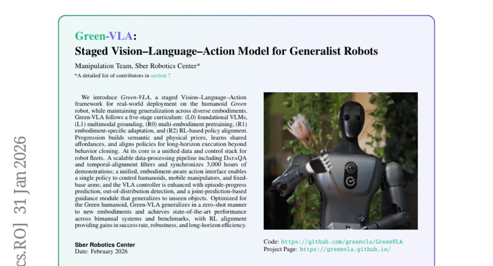
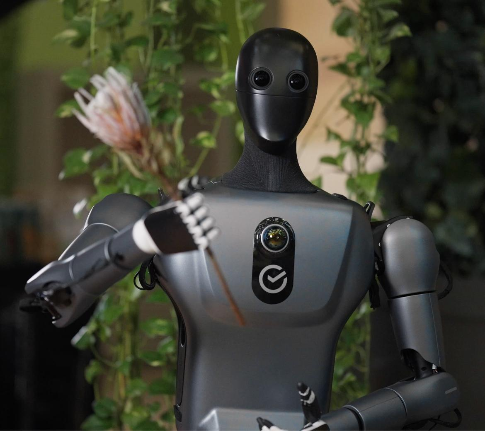
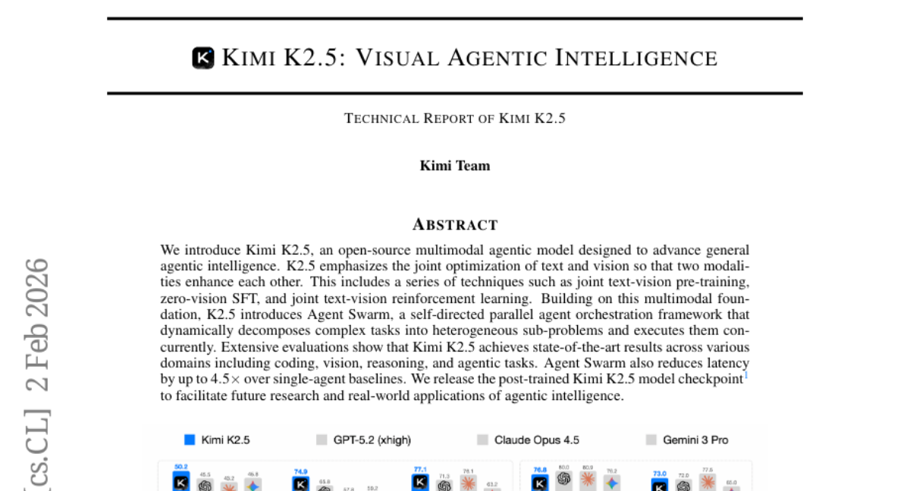
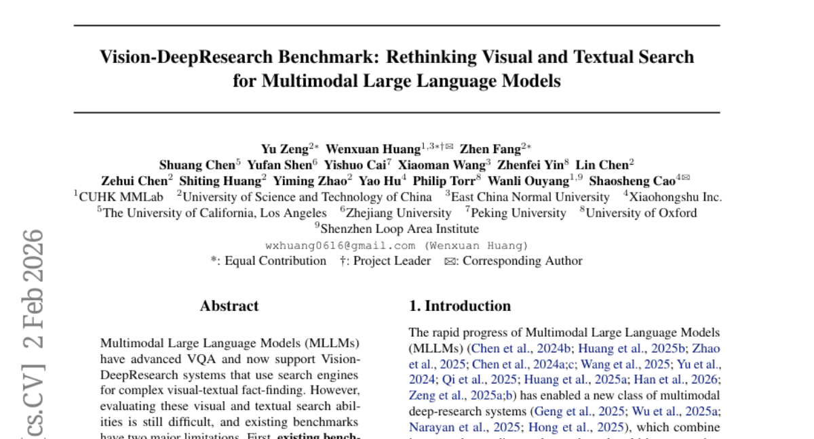
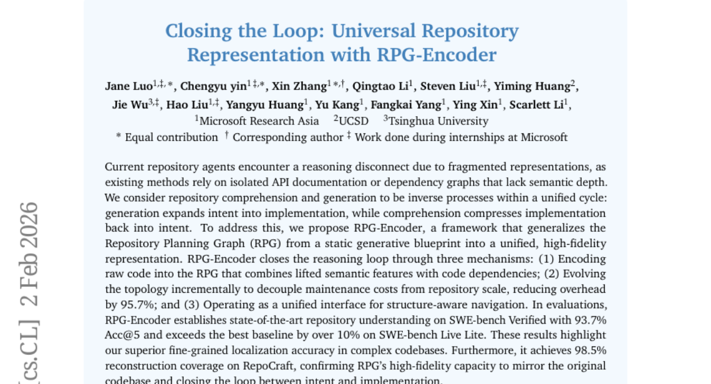

# 2026-02-03 Daily Papers (Top 5)

## 1. [Green-VLA: Staged Vision-Language-Action Model for Generalist Robots](https://huggingface.co/papers/2602.00919)
**Upvotes**: 169

### 📌 요약
Green-VLA는 5단계 커리큘럼 기반의 VLA 모델로, 단일 정책으로 다양한 로봇 형태를 통합 제어하고 RL 정렬을 통해 실제 환경에서의 성공률과 장기 작업 효율성을 획기적으로 향상시킵니다.

### � 핵심 포인트
- 핵심 혁신: 5단계(L0~R2)로 구성된 체계적인 훈련 커리큘럼(Staged Curriculum)과 단일 정책으로 다양한 로봇 형태(휴머노이드, 매니퓰레이터 등)를 제어할 수 있는 통일된 동작 인터페이스 구축.
- 성능/결과: 3,000시간 분량의 대규모 데이터로 학습되었으며, 최종 RL 정렬 단계를 통해 성공률과 장기 작업 효율성이 크게 향상됨. 추론 시 안전성 및 정밀도를 위한 OOD 감지 및 안내 기능 제공.
- 대상/응용 분야: 휴머노이드 및 모바일 매니퓰레이터 등 다양한 하드웨어를 단일 VLA 정책으로 통합 제어하려는 로봇 공학 연구원 및 범용 로봇 개발자.

### 📝 초록 (번역)
범용 로봇(예: 휴머노이드 로봇 Green)을 실제 환경에 성공적으로 배포하기 위해서는 높은 일반화 성능과 신뢰성을 갖춘 VLA(Vision-Language-Action) 모델이 필수적입니다. 하지만 기존 모델들은 다양한 로봇 형태(Embodiment)를 통합적으로 제어하는 데 어려움을 겪으며, 실제 환경에서의 안전성과 정밀도가 부족하다는 문제가 있었습니다. 본 논문은 이러한 문제를 해결하기 위해 5단계 커리큘럼(L0: VLM 기초, L1: 멀티모달 그라운딩, R0: 다중 로봇 사전 학습, R1: 특정 로봇 적응, R2: RL 정책 정렬)을 따르는 'Green-VLA' 프레임워크를 제안합니다. 특히 3,000시간 분량의 대규모 시연 데이터를 정제하여, 단일 정책으로 휴머노이드, 모바일 매니퓰레이터 등을 제어할 수 있는 통일된 로봇 동작 인터페이스를 구축했습니다. 또한, 추론 단계에서는 안전성과 정밀한 타겟 선택을 위해 에피소드 진행 예측, 이상치(OOD) 감지, 관절 예측 기반 안내 기능을 추가했습니다. Simpler BRIDGE 및 CALVIN 벤치마크와 실제 로봇 실험 결과, Green-VLA는 강력한 일반화 성능을 보였으며, 특히 최종 RL 정렬 단계를 통해 성공률, 견고성, 장기 계획 효율성 측면에서 상당한 성능 향상을 입증했습니다.

### 🖼️ 추가 자료

---

## 2. [Kimi K2.5: Visual Agentic Intelligence](https://huggingface.co/papers/2602.02276)
**Upvotes**: 141

### 📌 요약
시각적 에이전트 지능을 극대화하기 위해 텍스트와 비전을 공동 최적화하고, 에이전트 스웜(Agent Swarm) 병렬 처리 프레임워크를 통해 추론 지연 시간을 최대 4.5배 단축한 SOTA 오픈소스 에이전트 모델.

### � 핵심 포인트
- 텍스트와 비전의 공동 최적화를 통한 강력한 멀티모달 기반 구축 및 태스크 병렬 처리를 위한 '에이전트 스웜' 오케스트레이션 프레임워크 도입.
- 코딩, 비전, 추론 등 다양한 에이전트 작업에서 SOTA 성능 달성 및 에이전트 스웜을 통해 처리 지연 시간 최대 4.5배 단축.
- 복잡한 멀티모달 에이전트 시스템을 구축하려는 개발자 및 오픈소스 기반의 에이전트 지능 연구를 진행하는 연구자.

### 📝 초록 (번역)
기존 멀티모달 에이전트 모델들은 복잡한 작업을 효율적으로 처리하는 데 있어 텍스트와 비전 모달리티를 유기적으로 결합하고 태스크를 병렬 처리하는 데 한계가 있었습니다. 이를 해결하기 위해 Kimi K2.5는 두 모달리티가 서로를 강화하도록 텍스트-비전 공동 사전 학습, 제로 비전 SFT(지도 미세 조정) 등의 기법을 적용하여 '시각적 에이전트 지능(Visual Agentic Intelligence)'을 향상시켰습니다. 핵심 혁신은 복잡한 태스크를 이질적인 서브 태스크로 분해하여 병렬로 실행하는 자기 주도 에이전트 오케스트레이션 프레임워크인 '에이전트 스웜(Agent Swarm)'을 도입한 것입니다. 그 결과, K2.5는 코딩, 비전, 추론, 에이전트 영역 전반에서 최고 수준의 성능(SOTA)을 달성했으며, 에이전트 스웜 덕분에 단일 에이전트 대비 처리 지연 시간이 최대 4.5배 감소했습니다. 해당 모델 체크포인트는 연구 및 실사용 애플리케이션 확대를 위해 오픈소스로 공개되었습니다.

---

## 3. [Vision-DeepResearch: Incentivizing DeepResearch Capability in Multimodal Large Language Models](https://huggingface.co/papers/2601.22060)
**Upvotes**: 124

### 📌 요약
기존의 단순한 검색 한계를 넘어, 수십 단계의 추론과 수백 번의 엔진 상호작용을 통해 깊은 연구 능력을 내재화함으로써 최고 수준의 멀티모달 LLM 성능을 능가하는 '멀티턴/멀티스케일 검색 패러다임'을 제시했습니다.

### � 핵심 포인트
- 핵심 혁신: 시각적 노이즈가 많은 환경에서도 강력한 증거 수집을 위한 '멀티턴, 멀티개체, 멀티스케일' 심층 연구 패러다임 제시.
- 성능/결과: 수십 단계의 추론과 수백 번의 엔진 상호작용을 지원하며, GPT-5 등 최신 폐쇄형 모델 기반 워크플로우를 포함한 기존 최고 성능 모델들을 압도적으로 능가함.
- 대상/활용 분야: 복잡한 시각적 노이즈 환경에서 정교하고 깊이 있는 사실 기반 추론 능력이 필요한 멀티모달 LLM 연구자 및 개발자.

### 📝 초록 (번역)
멀티모달 대규모 언어 모델(MLLM)은 시각 작업에서 뛰어난 성과를 보였지만, 내부 지식 부족을 보완하기 위해 툴 호출(검색) 기능을 사용합니다. 하지만 기존의 접근 방식은 이미지 전체 또는 단일 개체에 대한 단순한 쿼리 몇 번으로 증거를 찾는다는 비현실적인 가정을 하며, 시각적 노이즈가 심한 실제 환경에서는 추론 깊이와 검색 폭이 좁아 복잡한 질문에 대응하기 어렵다는 문제가 있었습니다. 이를 해결하기 위해 우리는 'Vision-DeepResearch'를 제안합니다. 이 모델은 '멀티턴, 멀티개체, 멀티스케일'의 심층 연구 패러다임을 도입하여, 노이즈가 많은 검색 엔진 환경에서도 강력하게 증거를 수집할 수 있습니다. Vision-DeepResearch는 콜드 스타트 지도 학습 및 RL 훈련을 통해 MLLM 내부에 이러한 심층 연구 능력을 내재화하며, 수십 단계의 추론과 수백 번의 검색 상호작용을 지원합니다. 그 결과, Vision-DeepResearch는 기존의 심층 연구 MLLM은 물론, GPT-5, Gemini-2.5-pro와 같은 강력한 폐쇄형 모델 기반의 워크플로우까지 압도적으로 능가하는 최첨단 성능을 입증했습니다.

---

## 4. [Vision-DeepResearch Benchmark: Rethinking Visual and Textual Search for Multimodal Large Language Models](https://huggingface.co/papers/2602.02185)
**Upvotes**: 106

### 📌 요약
MLLM의 진정한 시각-텍스트 융합 심층 탐색 능력을 현실적으로 평가하고 성능을 효과적으로 개선하는 VDR-Bench와 다중 라운드 크롭 탐색 워크플로우를 제시했습니다.

### � 핵심 포인트
- 기존 벤치마크의 한계(단서 유출, 이상적인 시나리오)를 극복하고 현실적인 심층 탐색을 유도하는 VDR-Bench 구축 및 '다중 라운드 크롭 탐색' 워크플로우 제안.
- 제안된 크롭 탐색 전략은 MLLM의 현실적인 시각 검색 성능을 효과적으로 개선하며, 차세대 멀티모달 시스템 설계에 실용적인 가이드라인을 제시.
- MLLM(멀티모달 대규모 언어 모델), 멀티모달 검색 엔진, 복잡한 시각-텍스트 기반 사실 확인 시스템을 연구/개발하는 연구자 및 엔지니어.

### 📝 초록 (번역)
최근 MLLM은 단순 VQA를 넘어 검색 엔진을 활용하는 복잡한 시각-텍스트 기반 심층 탐색 시스템(Vision-DeepResearch)을 지원하고 있습니다. 하지만 기존 평가 방식은 두 가지 큰 문제점을 안고 있습니다. 첫째, 답이 텍스트 단서나 모델의 사전 지식으로 유출되어 시각적 검색이 제대로 작동했는지 검증하기 어렵습니다. 둘째, 평가 시나리오가 지나치게 이상적이어서 이미지 전체의 근사치 매칭이나 너무 직접적인 텍스트 검색만으로도 답을 얻을 수 있습니다. 

이러한 한계를 극복하기 위해, 본 논문은 실제와 유사한 조건 하에서 시스템의 성능을 측정하도록 설계된 2,000개의 VQA 인스턴스로 구성된 VDR-Bench(Vision-DeepResearch Benchmark)를 구축했습니다. 또한, 현재 MLLM의 시각적 검색 능력을 높이기 위해 간단하지만 효과적인 '다중 라운드 크롭 탐색(multi-round cropped-search)' 워크플로우를 제안합니다. 이 전략은 현실적인 시각 정보 검색 시나리오에서 모델 성능을 효과적으로 향상시키는 것으로 나타났으며, 미래의 멀티모달 심층 탐색 시스템 설계에 실질적인 지침을 제공합니다.

---

## 5. [Closing the Loop: Universal Repository Representation with RPG-Encoder](https://huggingface.co/papers/2602.02084)
**Upvotes**: 75

### 📌 요약
RPG-Encoder는 코드 이해와 생성을 통합하는 고충실도 리포지토리 표현 방식을 제시하여, SOTA 성능을 달성하고 대규모 코드베이스 유지 관리 비용을 획기적으로 절감하는 혁신적인 AI 프레임워크입니다.

### � 핵심 포인트
- 코드 이해와 생성을 통합하고 추론 루프를 완성하는 'RPG-Encoder' 프레임워크와 Repository Planning Graph(RPG)의 고도화된 통합 표현 방식.
- SWE-bench 벤치마크에서 SOTA 성능 달성 (Verified 93.7% Acc@5), 미세 조정된 위치 파악 정확도 우위 입증, 그리고 유지보수 오버헤드 95.7% 절감.
- 복잡한 대규모 코드베이스를 다루는 소프트웨어 엔지니어 및 개발자, 그리고 차세대 자동화된 소프트웨어 엔지니어링(SWE) 에이전트 연구자.

### 📝 초록 (번역)
기존의 리포지토리 AI 에이전트들은 개별 API 문서나 단순 종속성 그래프 같은 단편적인 표현에 의존했기 때문에, 코드의 깊은 의미를 파악하지 못하고 추론 과정이 단절되는 문제가 있었습니다. 즉, 코드를 이해하는 과정(구현을 의도로 압축)과 생성하는 과정(의도를 구현으로 확장)이 분리되어 있었죠. 

저희는 이러한 문제를 해결하고 코드 추론의 순환 고리를 닫기 위해 'RPG-Encoder'를 제안합니다. RPG-Encoder는 기존의 Repository Planning Graph (RPG)를 정적인 생성 청사진이 아닌, 의미론적 특징과 코드 종속성을 결합한 고충실도의 통합 표현으로 일반화합니다.

이 시스템은 크게 세 가지 메커니즘을 통해 작동합니다. 첫째, 원시 코드를 의미론적 특징과 종속성을 모두 담은 RPG로 인코딩합니다. 둘째, 저장소 규모와 무관하게 유지보수 비용을 95.7% 절감하는 점진적 토폴로지 진화 방식을 도입합니다. 셋째, 구조 인식 탐색을 위한 통합 인터페이스 역할을 합니다.

평가 결과, RPG-Encoder는 SWE-bench Verified에서 93.7%의 Acc@5를 달성하며 SOTA 성능을 확립했고, SWE-bench Live Lite에서는 기존 최고 성능보다 10% 이상 뛰어난 미세 조정된 코드 위치 파악 정확도를 입증했습니다. 또한 RepoCraft에서 98.5%의 재구성 커버리지를 보여, RPG가 원본 코드베이스를 고충실도로 반영하며 의도와 구현 사이의 루프를 성공적으로 닫았음을 확인했습니다.

---

