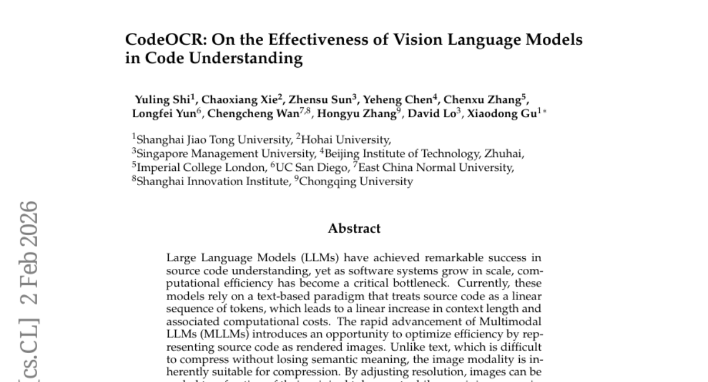
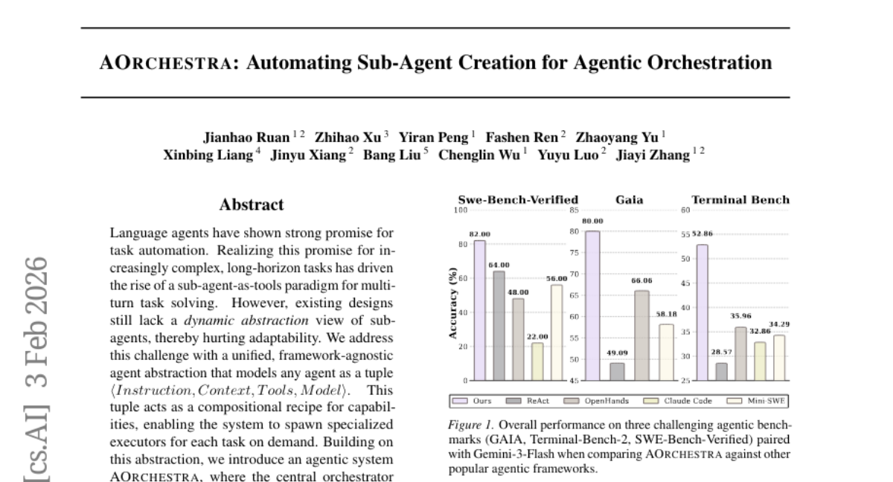
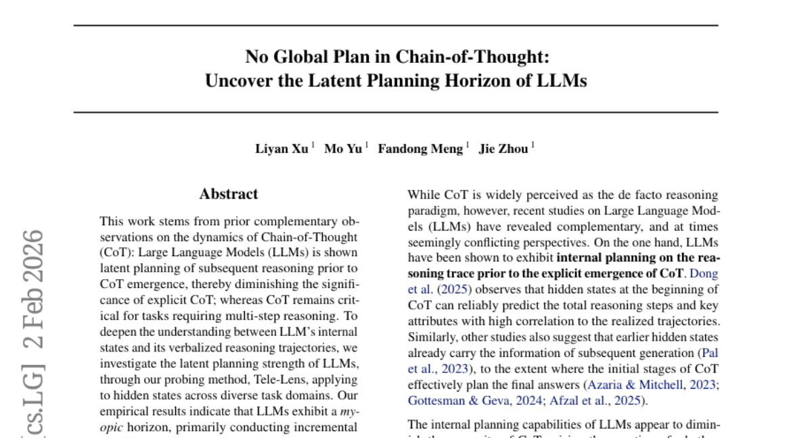
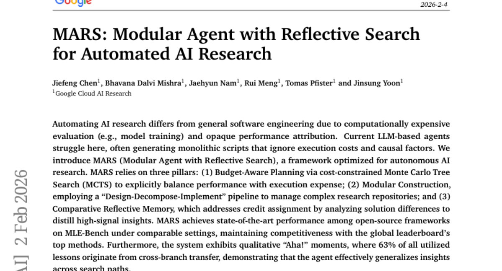
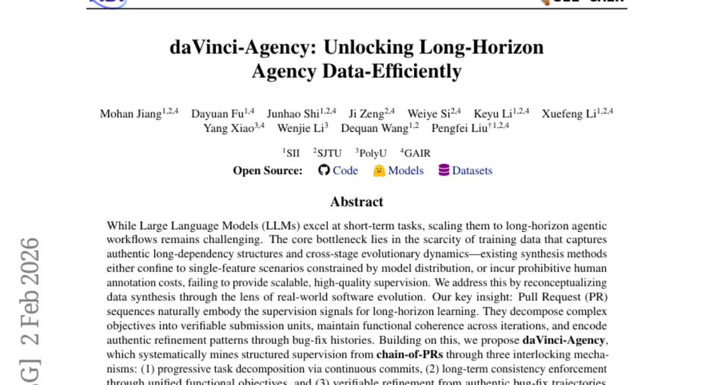

# 2026-02-04 Daily Papers (Top 5)

## 1. [CodeOCR: On the Effectiveness of Vision Language Models in Code Understanding](https://huggingface.co/papers/2602.01785)
**Upvotes**: 78

### 📌 요약
이 논문은 소스 코드를 이미지로 시각화하여 MLLM(멀티모달 대규모 언어 모델)에 적용함으로써, 연산 병목이었던 긴 텍스트 토큰 길이를 최대 8배까지 압축하며 코드 이해 효율을 혁신적으로 개선했습니다.

### � 핵심 포인트
- 코드 이해를 위한 입력 방식을 텍스트(선형 토큰)에서 이미지(시각적 압축) 모달리티로 전환하여 MLLM 기반 효율성을 극대화하는 새로운 패러다임 제시.
- 최대 8배의 토큰 압축률을 달성하며 효율성을 높임. 시각적 단서(구문 강조)는 성능을 향상시키며, 코드 복제 감지(clone detection) 작업에서는 압축된 시각 입력이 원본 텍스트 성능을 능가하는 탁월한 탄력성(resilience)을 보임.
- 대규모 코드 시스템의 추론 비용 및 효율성 개선이 필요한 개발자 및 연구자, 그리고 멀티모달 LLM(MLLM)을 활용하여 고효율 코드 분석 모델을 개발하는 AI 엔지니어.

### 📝 초록 (번역)
LLM(대규모 언어 모델)은 소스 코드 이해 분야에서 놀라운 성과를 거두었지만, 소프트웨어 시스템의 규모가 커지면서 계산 효율성이 핵심 병목 현상으로 부상했습니다. 기존의 텍스트 기반 패러다임은 코드를 선형적인 토큰 시퀀스로 처리하여 컨텍스트 길이가 선형적으로 증가하고 그에 따른 계산 비용도 비례하여 커지는 문제가 있습니다. 이 문제를 해결하기 위해, 본 연구는 코드를 렌더링된 이미지 모달리티로 표현하는 방법을 제안합니다. 이미지는 본질적으로 압축에 유리하여, 해상도 조절만으로 코드의 의미를 유지하면서도 토큰 비용을 극적으로 줄일 수 있습니다. 실험 결과, MLLM은 최대 8배의 토큰 압축률을 달성하면서도 코드를 효과적으로 이해했으며, 구문 강조(syntax highlighting)와 같은 시각적 요소를 활용하면 4배 압축 환경에서도 코드 완성 성능이 향상됨을 확인했습니다. 특히 코드 복제 감지(clone detection)와 같은 일부 작업은 텍스트 입력보다 압축된 시각적 입력에서 더 뛰어난 성능을 보여주며, 이미지 모달리티를 통한 효율적인 추론 가능성을 강력하게 입증했습니다.

---

## 2. [AOrchestra: Automating Sub-Agent Creation for Agentic Orchestration](https://huggingface.co/papers/2602.03786)
**Upvotes**: 62

### 📌 요약
복잡한 작업을 위해 에이전트 생성과 기능을 실행 시점에 자동화하는 새로운 오케스트레이션 시스템 AOrchestra를 제안하여, 주요 벤치마크에서 기존 대비 16.28%의 획기적인 상대 성능 개선을 이끌어냈습니다.

### � 핵심 포인트
- 통합된 에이전트 추상화 모델(Instruction, Context, Tools, Model)을 기반으로, 실행 시점에 필요한 기능을 갖춘 전문 서브 에이전트를 자동으로 생성하고 관리하는 동적 오케스트레이션 기술.
- GAIA, SWE-Bench 등 복잡한 벤치마크 3종에서 기존 최강 모델 대비 16.28%의 높은 상대 성능 향상을 달성했으며, 유연한 모델 선택을 통해 비용-성능의 균형(Pareto-efficient) 조절이 가능함.
- 복잡하고 장기적인 AI 태스크 자동화 시스템을 구축하는 개발자, 기존 에이전트 프레임워크에 구애받지 않고 유연하며 비용 효율적인 멀티 에이전트 설계를 연구하는 AI 연구자.

### 📝 초록 (번역)
최근 언어 에이전트(LLMs)는 복잡하고 장기적인 작업을 해결하기 위해 여러 서브 에이전트를 도구처럼 활용하는 멀티 에이전트 패러다임이 대두되었습니다. 하지만 기존 시스템은 서브 에이전트의 구성 요소(기능, 모델 등)를 실행 환경에 맞게 동적으로 추상화하지 못했기 때문에, 변화하는 작업 환경에 대한 유연성이 떨어지고 개발자의 수동적인 엔지니어링 노력이 많이 필요했습니다.

AOrchestra는 이러한 문제를 해결하기 위해 모든 에이전트를 `(지시, 컨텍스트, 도구, 모델)`의 튜플로 정의하는 통일된 추상화 모델을 제시합니다. 중앙 오케스트레이터는 이 튜플을 실행 단계마다 구체화하여 (즉, 작업 관련 컨텍스트를 선별하고, 최적의 도구와 모델을 선택하여), 필요할 때마다 전문화된 에이전트를 즉석에서 자동 생성하고 작업을 위임합니다. 이처럼 자동화되고 프레임워크에 구애받지 않는 플러그 앤 플레이 설계 덕분에, AOrchestra는 엔지니어링 노력을 줄이는 동시에 성능과 비용 사이의 최적화된 균형(Pareto-efficient)을 잡을 수 있습니다.

결과적으로 AOrchestra는 GAIA, SWE-Bench, Terminal-Bench 등 세 가지 도전적인 벤치마크에서 가장 강력한 기존 모델 대비 16.28%의 뛰어난 상대 성능 향상을 달성했습니다.

---

## 3. [No Global Plan in Chain-of-Thought: Uncover the Latent Planning Horizon of LLMs](https://huggingface.co/papers/2602.02103)
**Upvotes**: 57

### 📌 요약
LLM의 추론 과정이 전역적 계획 없이 단계적으로 이루어짐을 규명하고, 이 근시안적(myopic) 특성을 활용하여 추론 경로의 불확실성을 최소한의 정보로 정확히 예측하는 새로운 효율화 방법을 제시했습니다.

### � 핵심 포인트
- LLM의 은닉 상태를 분석하는 프로빙 기법 'Tele-Lens' 개발 및 LLM이 장기적 전역 계획 없이 근시안적 단계 추론만 수행한다는 핵심 특성 규명.
- 전체 경로 불확실성 예측에 필요한 CoT 위치를 최소화하여 추론 과정의 효율성을 높였으며, 정확도 손실 없이 CoT 우회 인식 자동화 달성.
- LLM의 CoT 동역학을 이해하고, 추론 과정의 불필요한 단계를 제거하여 모델 추론 효율성을 극대화하려는 연구자 및 개발자.

### 📝 초록 (번역)
최근 LLM의 Chain-of-Thought(CoT) 추론이 필수적인지, 아니면 LLM 내부의 잠재 계획만으로 충분한지에 대한 논쟁이 있었습니다. **(배경)** 본 연구는 LLM의 내부 상태와 외부로 드러나는 추론 과정(CoT) 사이의 관계를 심층적으로 이해하고, 특히 LLM이 추론을 얼마나 멀리까지 내다보고 계획하는지(잠재적 계획 범위)를 파악하는 것을 목표로 했습니다. **(문제)** 우리는 이 잠재적 계획 강도를 측정하기 위해 LLM의 은닉 상태(hidden states)에 적용되는 새로운 프로빙 방법론인 'Tele-Lens'를 제안했습니다. **(해결)** 'Tele-Lens'를 통한 분석 결과, LLM은 장기적인 '전역 계획' 없이 현재 단계에 집중하는 '근시안적 수평선(myopic horizon)'을 가지고 있으며, 주로 증분적(incremental) 단계 전환만 수행한다는 사실이 밝혀졌습니다. 이 특성을 활용하여 CoT 경로의 불확실성을 예측하는 데 필요한 추론 단계를 획기적으로 줄여 효율성을 높일 수 있음을 검증했으며, 성능 저하 없이 CoT 우회(Bypass)를 자동으로 인식할 수 있는 방법을 제시했습니다. **(결과)**

---

## 4. [MARS: Modular Agent with Reflective Search for Automated AI Research](https://huggingface.co/papers/2602.02660)
**Upvotes**: 43

### 📌 요약
MARS는 비용 효율성을 고려한 MCTS와 모듈식 설계, 통찰력 있는 메모리를 결합하여 자율 AI 연구 에이전트 중 최고 수준의 성능과 뛰어난 범용적 학습 능력을 입증했습니다.

### � 핵심 포인트
- 핵심 혁신 (Key Contribution): AI 연구의 고비용 문제를 해결하기 위해 비용 제약 MCTS(예산 인지형 계획), 모듈식 설계 파이프라인, 그리고 결과 차이 분석을 통한 반성적 학습을 결합했습니다.
- 성능 및 결과 (Performance/Results): MLE-Bench에서 오픈 소스 프레임워크 중 최고 성능(SOTA)을 달성했으며, 시스템이 활용한 교훈의 63%를 다른 경로에서 일반화하여 학습 능력의 효율성을 입증했습니다.
- 주요 사용자 및 응용 분야 (Target/Application): 반복적 모델 훈련 및 평가 비용이 높은 환경에서 자율적인 AI 모델 개발 및 최적화 연구를 수행하려는 개발자 및 연구원에게 최적화되었습니다.

### 📝 초록 (번역)
기존 LLM 기반 에이전트들은 모델 학습과 같은 비용이 많이 드는 평가 과정 때문에 AI 연구 자동화에 어려움을 겪었습니다. 또한, 어떤 변경 사항이 성능 개선에 기여했는지 명확히 파악하기 어려워 비효율적인 모놀리식 스크립트를 생성하는 경향이 있었습니다.

이에 우리는 자율 AI 연구에 최적화된 MARS (Modular Agent with Reflective Search) 프레임워크를 제안합니다. MARS는 (1) 비용 효율성과 성능을 균형 있게 맞추는 예산 인지형 MCTS(Monte Carlo Tree Search) 계획, (2) 복잡한 저장소를 효율적으로 관리하는 모듈식 구축 파이프라인, 그리고 (3) 솔루션 간 차이를 비교 분석하여 핵심 통찰력을 추출하는 비교 반성 메모리(Comparative Reflective Memory)의 세 가지 핵심 요소를 사용합니다.

그 결과, MARS는 MLE-Bench에서 오픈 소스 프레임워크 중 최고 성능(SOTA)을 달성했으며, 최상위 글로벌 경쟁 프레임워크와도 대등한 수준을 유지했습니다. 특히, 에이전트가 사용한 학습 내용 중 63%가 다른 탐색 경로에서 가져온 교차 학습을 통해 얻어져, 시스템이 통찰력을 효과적으로 일반화하고 '아하!' 순간을 포착함을 입증했습니다.

---

## 5. [daVinci-Agency: Unlocking Long-Horizon Agency Data-Efficiently](https://huggingface.co/papers/2602.02619)
**Upvotes**: 43

### 📌 요약
실제 소프트웨어 개발 PR 데이터를 활용하여 장기 목표를 달성하는 에이전트의 데이터 효율적 학습을 혁신하고, Toolathlon 벤치마크에서 47%의 획기적인 성능 향상을 입증한 데이터 합성 프레임워크.

### � 핵심 포인트
- 핵심 혁신은 소프트웨어 개발의 '연속된 풀 리퀘스트(Chain-of-PRs)' 구조에서 장기 목표 에이전트 학습에 필요한 구조화된 감독 신호를 데이터 효율적으로 마이닝하는 것입니다. (Core Contribution)
- 단 239개의 샘플만으로 GLM-4.6 모델을 미세 조정하여 Toolathlon 벤치마크에서 47%의 획기적인 상대적 성능 향상을 달성하는 등 뛰어난 데이터 효율성과 성능을 입증했습니다. (Performance/Results)
- 장기 목표 계획(Long-horizon planning), 지속적인 목표 지향 행동 학습, LLM 에이전트 훈련 데이터셋 구축 및 소프트웨어 개발 관련 에이전트를 연구하는 개발자 및 연구자. (Target/Application)

### 📝 초록 (번역)
거대 언어 모델(LLM)은 단기 과제에는 강하지만, 복잡하고 장기적인 에이전트 워크플로우를 처리하는 데는 어려움을 겪습니다. 주요 병목은 장기적인 종속성과 단계별 진화 과정을 포착하는 고품질 학습 데이터가 극도로 부족하다는 점입니다. 기존의 데이터 합성 방식은 기능이 제한적이거나 막대한 주석 비용을 발생시켰습니다. daVinci-Agency는 이 문제를 해결하기 위해 데이터 합성 방식을 실제 소프트웨어 개발의 '풀 리퀘스트(PR) 시퀀스'라는 새로운 관점으로 재구성했습니다. PR 시퀀스는 복잡한 목표를 검증 가능한 단위로 나누고, 기능적 일관성을 유지하며, 버그 수정 기록을 통해 실제적인 개선 패턴을 자연스럽게 인코딩합니다. daVinci-Agency는 (1) 지속적인 커밋을 통한 점진적 작업 분해, (2) 통일된 기능 목표를 통한 장기적 일관성 유지, (3) 실제 버그 수정 궤적을 통한 검증 가능한 개선이라는 세 가지 메커니즘을 통해 PR 체인에서 체계적으로 감독 신호를 추출합니다. 이 PR 기반 구조는 기존의 독립적인 단계로 구성된 합성 궤적과 달리, 에이전트가 지속적인 목표 지향 행동을 학습하는 데 필수적인 인과 관계와 반복적 개선 과정을 보존합니다. 결과적으로, daVinci-Agency는 평균 85k 토큰, 116회 도구 호출의 풍부한 궤적을 생성하며, 단 239개의 샘플만으로 GLM-4.6 모델을 미세 조정했을 때 Toolathlon에서 47%의 괄목할 만한 상대적 성능 향상을 달성했습니다.

---

