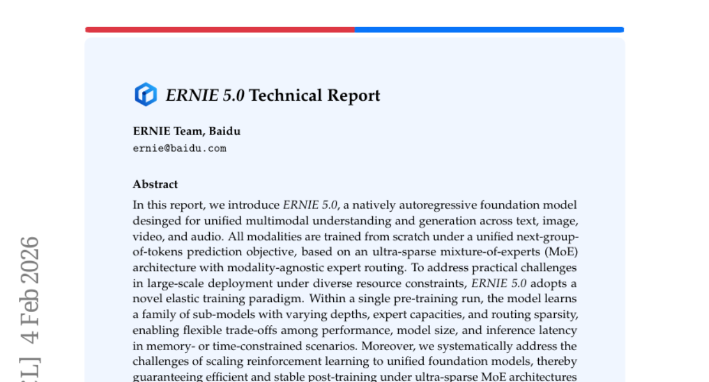
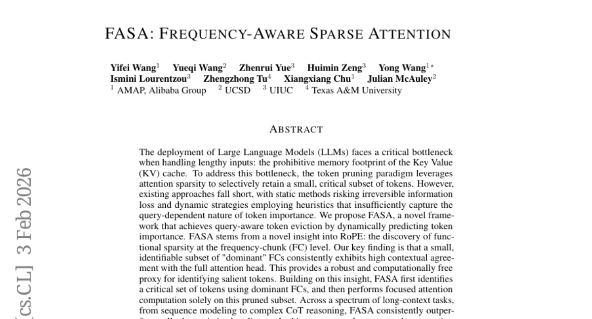
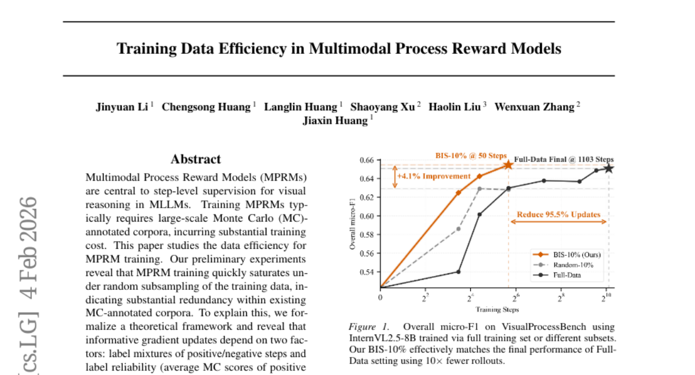
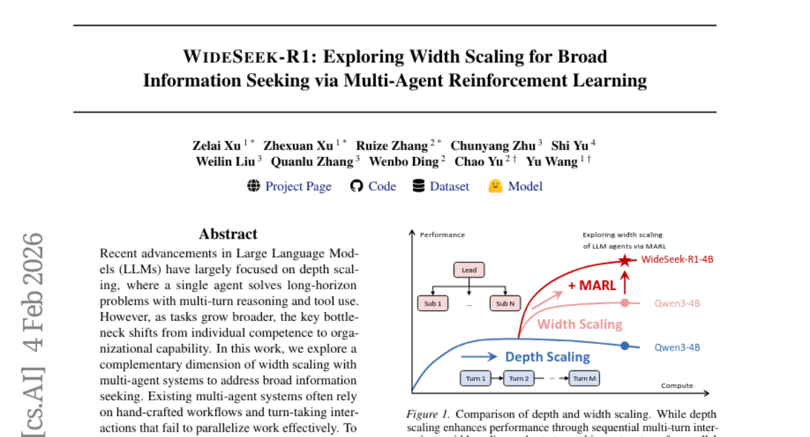
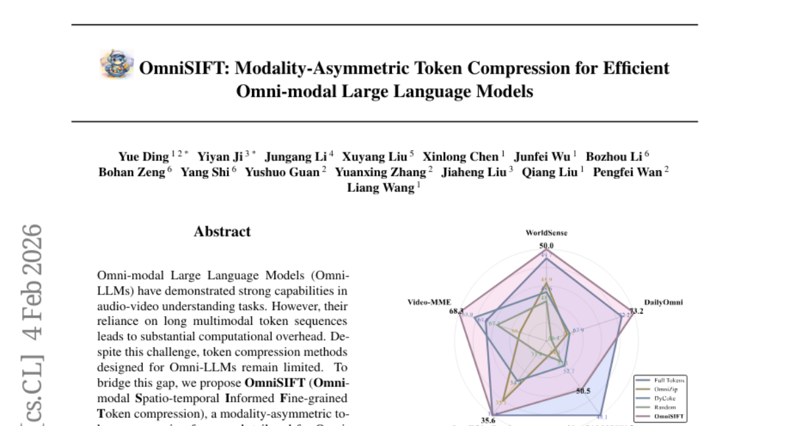

# 2026-02-05 Daily Papers (Top 5)

## 1. [ERNIE 5.0 Technical Report](https://huggingface.co/papers/2602.04705)
**Upvotes**: 194

### 📌 요약
ERNIE 5.0은 텍스트부터 비디오까지 전 영역을 아우르는 세계 최초의 1조 개 파라미터급 통합 MoE 모델로, 효율적인 배포를 위한 탄성 훈련 패러다임을 제시하며 파운데이션 모델의 새로운 상용화 기준을 세웠습니다.

### � 핵심 포인트
- 핵심은 '탄성 훈련'을 통한 초희소 통합 MoE 아키텍처입니다. 하나의 훈련으로 다양한 성능/크기의 서브 모델군을 학습시켜 배포 유연성을 극대화합니다.
- 최초로 공개된 상용화 규모의 1조 개 파라미터 통합 멀티모달 모델이며, 텍스트, 이미지, 비디오, 오디오 모든 양식에서 강력하고 균형 잡힌 이해 및 생성 성능을 입증했습니다.
- 파운데이션 모델, MoE 구조, 강화 학습 스케일링을 연구하는 개발자 및 연구자. 특히, 메모리나 속도 제약이 심한 환경에서 멀티모달 AI를 효율적으로 배포해야 하는 엔지니어에게 유용합니다.

### 📝 초록 (번역)
기존의 멀티모달 모델들은 텍스트, 이미지, 오디오 등 다양한 양식(모달리티)을 통합적으로 처리해야 했지만, 대규모 모델을 상용화하거나 리소스 제약이 심한 환경에 배포하는 것이 큰 숙제였습니다. 특히 1조 개 이상의 파라미터를 가진 MoE(Mixture-of-Experts) 구조에서 안정적인 후속 훈련(강화 학습)을 보장하고, 다양한 배포 환경에서 유연하게 성능을 유지할 수 있는 방안이 필요했습니다. ERNIE 5.0은 모든 양식에 대해 통일된 '다음 토큰 그룹 예측' 목표를 사용하는 초희소 MoE 구조를 도입하고, 하나의 훈련 과정에서 깊이, 용량, 희소성 등이 다른 다양한 서브 모델들을 학습시키는 '탄성 훈련(Elastic Training)' 패러다임을 통해 이 문제를 해결했습니다. 그 결과, ERNIE 5.0은 모든 양식에서 강력하고 균형 잡힌 성능을 달성했으며, 공개된 모델 중 최초로 1조 개 파라미터급 통합 멀티모달 모델을 상용화 수준으로 실현하며 효율적인 배포의 새로운 기준을 제시했습니다.

---

## 2. [FASA: Frequency-aware Sparse Attention](https://huggingface.co/papers/2602.03152)
**Upvotes**: 99

### 📌 요약
새로운 RoPE 기반 주파수 분석 기법(FC)을 활용하여 KV 캐시를 지능적으로 압축, 장문 컨텍스트 환경에서 정확도 손실 없이 혁신적인 속도 향상과 메모리 절감을 달성한 최첨단 기술.

### � 핵심 포인트
- 핵심 혁신: RoPE의 주파수 청크(FC)에서 기능적 희소성(Functional Sparsity)을 발견하여, 계산 비용 없이 쿼리 의도를 반영하는 토큰 중요도 식별 프록시(Proxy)를 개발함.
- 성능 및 결과: KV 캐시 사용량을 대폭 절감하고 (AIME24에서 18.9% 사용 시 2.56배 속도 향상), 풀-KV 모델과 거의 동일한(near-oracle) 수준의 정확도를 유지함.
- 적용 대상: 효율적인 대규모 LLM 배포를 목표로 하는 연구자 및 개발자. 특히 긴 시퀀스 모델링 및 복잡한 CoT(사고의 사슬) 추론 등 장문 컨텍스트 작업에서 강력한 성능이 필요할 때 활용 가능.

### 📝 초록 (번역)
LLM이 긴 입력을 처리할 때 KV(Key Value) 캐시의 막대한 메모리 사용량은 심각한 병목 현상을 야기합니다. 기존 토큰 제거(Pruning) 방식들은 정적이라 중요한 정보를 잃거나, 휴리스틱 기반이라 쿼리(Query)의 의도를 제대로 반영하지 못하는 한계가 있었습니다. 

본 논문은 이러한 비효율성을 해결하기 위해 FASA(Frequency-aware Sparse Attention) 프레임워크를 제안합니다. FASA는 RoPE(회전식 위치 인코딩) 분석을 통해 주파수 청크(FC) 수준에서 '기능적 희소성'이 존재한다는 새로운 통찰력에서 출발합니다. 핵심은 전체 어텐션 헤드와 맥락적 일치도가 높은 소수의 '지배적 FC(Dominant FC)'가 존재하며, 이를 계산 부하 없이 토큰 중요도를 파악하는 강력한 지표로 활용할 수 있다는 것입니다.

FASA는 이 지배적 FC를 사용해 쿼리 인지적 방식으로 핵심 토큰 집합을 식별한 다음, 이 압축된 집합에 대해서만 어텐션 계산을 수행함으로써 메모리 대역폭과 계산 비용을 획기적으로 낮춥니다. 그 결과, FASA는 모든 기존 토큰 제거 방식들을 일관되게 능가하며, 긴 컨텍스트 작업 및 복잡한 추론 작업 전반에서 거의 풀-KV 모델 수준의 정확도(near-oracle accuracy)를 달성했습니다. 특히, 256개의 토큰만 유지할 때도 LongBench-V1에서 거의 100%의 성능을 보였으며, AIME24 벤치마크에서는 캐시의 18.9%만 사용하고도 2.56배의 속도 향상을 입증했습니다.

---

## 3. [Training Data Efficiency in Multimodal Process Reward Models](https://huggingface.co/papers/2602.04145)
**Upvotes**: 70

### 📌 요약
새로운 균형 정보 점수(BIS)를 통해 멀티모달 과정 보상 모델(MPRM) 학습에 필요한 훈련 데이터를 90%까지 획기적으로 줄이면서도 성능 저하 없이 전체 데이터 학습 효과를 달성하여, 대규모 AI 훈련 비용 문제를 해결했습니다.

### � 핵심 포인트
- 핵심적인 정보성 요소(레이블 혼합도 및 신뢰도)를 밝혀낸 이론적 프레임워크를 기반으로, MPRM 훈련 데이터 효율을 극대화하는 **균형 정보 점수(BIS)**를 제안했습니다.
- 전체 훈련 데이터의 10%만을 사용하여 전체 데이터 학습 성능을 달성했으며, 무작위 샘플링 대비 4.1%의 상대적 성능 향상을 입증하여 압도적인 데이터 효율성을 보여주었습니다.
- MLLM/MPRM 훈련 효율성 향상을 목표로 하는 연구자 및 대규모 보상 모델 훈련 비용과 시간을 획기적으로 줄이고자 하는 개발자.

### 📝 초록 (번역)
Multimodal Process Reward Models(MPRM)은 MLLM(멀티모달 대규모 언어 모델)의 시각적 추론을 위한 핵심적인 단계별 감독 모델입니다. 하지만 MPRM 훈련은 막대한 비용이 드는 대규모 MC(Monte Carlo) 주석 코퍼스를 필요로 하며, 초기 실험 결과 기존 데이터에 상당한 중복(Redundancy)이 있음이 밝혀졌습니다. 이 비효율성을 해소하기 위해, 연구진은 정보성이 높은 기울기 업데이트를 결정하는 두 가지 핵심 요소, 즉 긍정/부정 단계의 레이블 혼합도와 레이블 신뢰도(긍정 단계의 평균 MC 점수)를 이론적으로 정립했습니다. 이러한 통찰을 바탕으로, 추가 비용 없이 기존 MC 신호만 활용하여 혼합도와 신뢰도를 모두 우선시하는 **균형 정보 점수(BIS, Balanced-Information Score)**를 제안했습니다. InternVL2.5-8B 및 Qwen2.5-VL-7B 백본을 VisualProcessBench에서 테스트한 결과, BIS를 사용해 선별된 데이터셋은 훈련 데이터의 10%만을 사용하고도 전체 데이터 학습 성능과 같거나 심지어 능가했으며, 무작위 샘플링 대비 4.1%의 상대적 성능 개선을 보였습니다.

---

## 4. [WideSeek-R1: Exploring Width Scaling for Broad Information Seeking via Multi-Agent Reinforcement Learning](https://huggingface.co/papers/2602.04634)
**Upvotes**: 69

### 📌 요약
대규모 언어 모델의 조직적 한계를 극복하기 위해 다중 에이전트 강화 학습 기반의 폭(Width) 스케일링을 도입, 소형 모델(4B)이 거대 단일 에이전트 모델(671B)과 맞먹는 정보 탐색 성능을 달성한 혁신적인 멀티 에이전트 시스템 연구입니다.

### � 핵심 포인트
- 다중 에이전트 강화 학습(MARL) 기반의 '폭(Width) 스케일링' 프레임워크인 WideSeek-R1 제안. 수동적인 워크플로우를 벗어나 병렬 실행과 확장 가능한 오케스트레이션을 구현한 것이 핵심입니다.
- WideSeek-R1-4B가 WideSearch 벤치마크에서 단일 에이전트 모델인 DeepSeek-R1-671B와 동등한 수준의 정보 탐색 성능(F1 40.0%)을 달성했으며, 서브 에이전트 증가에 비례하여 성능이 향상됨을 입증했습니다.
- 광범위한 정보 탐색 및 조직적 협업 능력이 필요한 복잡한 문제를 해결하려는 연구자 및 개발자. 특히 자원 제약 하에 소형 모델로 대규모 단일 모델의 성능을 따라잡고자 하는 경우 유용합니다.

### 📝 초록 (번역)
최근 LLM 연구는 단일 에이전트가 다단계 추론과 도구 사용을 통해 긴 문제를 해결하는 깊이(Depth) 스케일링에 집중되어 왔습니다. 하지만 정보 탐색 작업이 광범위해질수록 개별 에이전트의 역량보다는 에이전트 간의 조직적 협업 능력이 병목이 됩니다. 기존 멀티 에이전트 시스템은 수동적인(hand-crafted) 작업 흐름에 의존하여 작업 병렬화가 어려웠습니다. 

이러한 간극을 해소하기 위해 본 논문은 병렬 실행을 극대화하는 폭(Width) 스케일링 접근법인 WideSeek-R1 프레임워크를 제안합니다. WideSeek-R1은 리드 에이전트와 병렬 서브 에이전트 구조를 가지며, 다중 에이전트 강화 학습(MARL)을 통해 확장 가능한 오케스트레이션을 공동으로 최적화합니다. 이는 격리된 컨텍스트와 전문 도구를 갖춘 공유 LLM을 활용하여 이루어집니다.

실험 결과, WideSeek-R1-4B 모델은 WideSearch 벤치마크에서 40.0%의 Item F1 점수를 기록했는데, 이는 무려 671B 파라미터의 거대한 단일 에이전트 모델(DeepSeek-R1)과 유사한 성능입니다. 또한, 병렬 서브 에이전트의 수가 증가함에 따라 성능이 꾸준히 향상되는 것을 확인하여, 폭 스케일링의 효율성과 확장성을 명확히 입증했습니다.

---

## 5. [OmniSIFT: Modality-Asymmetric Token Compression for Efficient Omni-modal Large Language Models](https://huggingface.co/papers/2602.04804)
**Upvotes**: 40

### 📌 요약
옴니SIFT는 모달리티별로 최적화된 비대칭 토큰 압축 전략을 사용하여 전체 토큰의 25%만으로 기존 모델보다 더 높은 성능을 달성하며 옴니-모달 LLM의 효율성을 혁신적으로 개선했습니다.

### � 핵심 포인트
- 모달리티 비대칭 접근 방식(Modality-Asymmetric Approach): 비디오와 오디오 모달리티에 특화된 2단계 압축 전략(시공간 비디오 가지치기 및 시각 유도 오디오 필터링)을 통해 효율성을 극대화합니다.
- 압도적인 효율성: 전체 토큰 컨텍스트의 25%만 사용하여도 기존 압축 모델들을 능가하며, 일부 벤치마크에서는 풀-토큰 모델보다 높은 성능을 달성하며 낮은 지연 시간을 유지합니다.
- 대상 사용자 및 응용 분야: 대규모 멀티모달 모델(Omni-LLM)의 계산 효율성 개선을 목표로 하는 연구원 및 저지연(Low-Latency) 오디오/비디오 처리 시스템을 구축하려는 개발자.

### 📝 초록 (번역)
옴니-모달 LLM(Omni-LLM)은 음성 및 영상 이해 분야에서 뛰어난 능력을 보이지만, 긴 멀티모달 토큰 시퀀스에 의존하여 막대한 계산 오버헤드와 지연 시간을 발생시키는 문제가 있습니다. 이를 해결하기 위해, 저희는 비디오와 오디오 모달리티에 서로 다르게 접근하는(비대칭적) 토큰 압축 프레임워크인 OmniSIFT를 제안합니다. OmniSIFT는 두 단계로 작동합니다. 첫 번째는 시공간적 비디오 가지치기(Spatio-temporal video pruning)를 통해 프레임 내부 구조와 프레임 간의 중복을 제거하며, 두 번째는 시각 정보의 안내를 받아 오디오 토큰을 선별적으로 필터링합니다. 이 모든 과정은 미분 가능한 추정기(Straight-through estimator)를 통해 종단 간(end-to-end) 최적화됩니다. Qwen2.5-Omni-7B 모델에 적용한 결과, OmniSIFT는 단지 4.85M의 파라미터만을 추가하고도 훈련 없는 기준선들보다 낮은 지연 시간을 유지했습니다. 특히, 원래 토큰 컨텍스트의 25%만 사용하고도 기존 압축 기준선들을 일관되게 능가했으며, 일부 작업에서는 풀-토큰 모델보다도 더 나은 성능을 입증했습니다.

---

