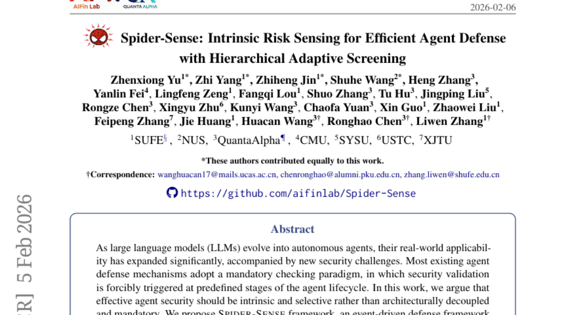
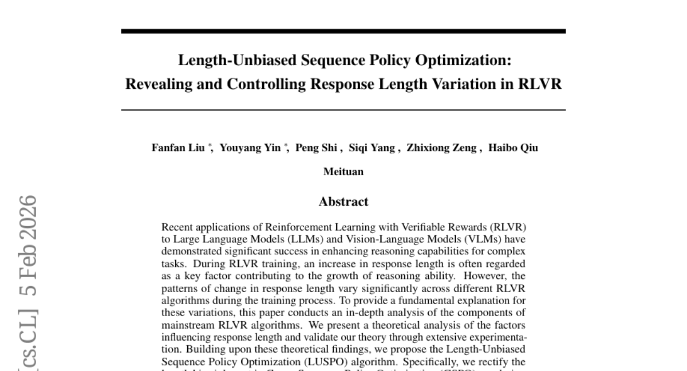
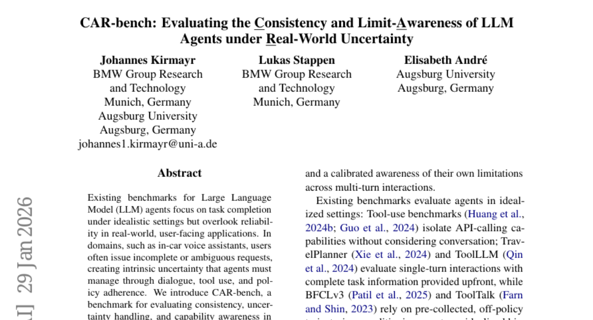
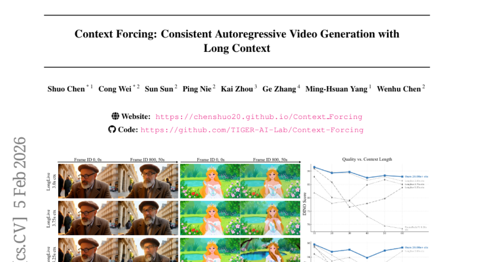
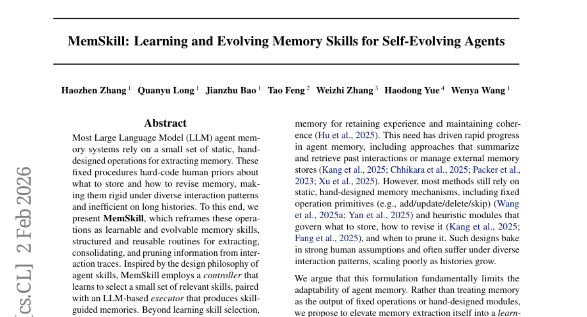

# 2026-02-06 Daily Papers (Top 5)

## 1. [Spider-Sense: Intrinsic Risk Sensing for Efficient Agent Defense with Hierarchical Adaptive Screening](https://huggingface.co/papers/2602.05386)
**Upvotes**: 56

### 📌 요약
기존의 강제적 보안 검사를 내재적 위험 감지 기반의 선택적 방어로 전환하고, 계층적 선별 방식을 통해 최고 수준의 방어 성능을 효율적으로 달성한 에이전트 보안 프레임워크를 제안함.

### � 핵심 포인트
- 내재적 위험 감지(IRS) 기반의 선택적, 이벤트 중심 방어 시스템 및 효율성과 정밀도를 모두 잡는 계층적 적응형 선별 메커니즘.
- 경쟁 모델 대비 가장 낮은 공격 성공률(ASR)과 오탐률(FPR)을 달성했으며, 단 8.3%의 미미한 지연 시간만 발생시켜 고성능 및 고효율을 증명함.
- 자율 LLM 에이전트의 보안 및 안정성 강화를 고민하는 개발자 및 에이전트 방어 메커니즘을 연구하는 연구자.

### 📝 초록 (번역)
LLM이 자율 에이전트로 발전하면서 그 적용 범위가 넓어졌지만, 이로 인해 새로운 보안 문제가 생겨나고 있습니다. 기존 방어 시스템은 정해진 단계마다 무조건 검사를 수행하는 '강제적 검사(mandatory checking)' 방식이라 비효율적이고 아키텍처적으로 분리되어 있어 유연성이 떨어집니다. 

본 연구는 효과적인 에이전트 보안은 외부적인 의무가 아니라 내재적이고 선택적이어야 한다고 주장하며, 'Spider-Sense'라는 내재적 위험 감지(Intrinsic Risk Sensing, IRS) 기반의 이벤트 중심 프레임워크를 제안합니다. 이 프레임워크는 에이전트가 잠재적 경계심을 유지하다가 위험을 인지했을 때만 방어를 선택적으로 작동시킵니다. 방어가 발동되면, 경량화된 유사성 매칭으로 알려진 위협 패턴을 신속하게 처리하고 모호한 경우는 심층 내부 추론으로 상향 조정하는 계층적 방어 시스템을 통해 효율성과 정밀도를 모두 확보하며 외부 모델 의존성을 제거합니다. 

자체 개발한 S^2Bench 벤치마크를 통해 실험한 결과, Spider-Sense는 가장 낮은 공격 성공률(ASR)과 오탐률(FPR)을 달성하며 경쟁 모델 대비 우수한 방어 성능을 보였고, 시스템 지연 시간(latency overhead)은 8.3%로 매우 낮아 효율성 또한 입증했습니다.

---

## 2. [Length-Unbiased Sequence Policy Optimization: Revealing and Controlling Response Length Variation in RLVR](https://huggingface.co/papers/2602.05261)
**Upvotes**: 45

### 📌 요약
기존 RLVR 알고리즘의 고질적인 응답 길이 편향 문제를 이론적으로 규명하고, 이를 해결한 LUSPO 알고리즘을 제안하여 수학 및 멀티모달 추론 벤치마크에서 최고 수준의 성능을 달성했습니다.

### � 핵심 포인트
- 응답 길이 편향을 제거한 LUSPO(Length-Unbiased Sequence Policy Optimization) 알고리즘 제안 및 기존 GSPO 손실 함수의 길이 편향 해결.
- 수학적 추론 및 멀티모달 시나리오에서 기존 RLVR 방법론(GRPO, GSPO) 대비 일관되게 우수한 최고 수준(SOTA)의 성능 달성.
- LLM/VLM 추론 능력을 강화하고, 정책 최적화 과정에서 응답 길이 붕괴 문제를 해결하려는 연구자 및 개발자.

### 📝 초록 (번역)
LLM(대규모 언어 모델) 및 VLM(시각-언어 모델)의 복잡한 추론 능력 향상을 위해 RLVR(검증 가능한 보상 기반 강화 학습)이 성공적으로 사용되고 있으며, 응답 길이가 길어지는 것이 추론 능력 향상과 깊은 관련이 있다고 알려져 있습니다. **하지만,** RLVR 알고리즘의 종류에 따라 학습 과정 중 응답 길이 변화 패턴이 크게 달라지며, 이는 성능 저하 및 '응답 길이 붕괴(collapse)'로 이어질 수 있습니다. **본 논문은** 이러한 응답 길이 변동성의 원인을 밝히기 위해 주류 RLVR 알고리즘의 구성 요소를 심층 분석하고 길이에 영향을 미치는 요소를 이론적으로 규명했습니다. **이를 바탕으로** 응답 길이에 대한 편향이 제거된 LUSPO(Length-Unbiased Sequence Policy Optimization) 알고리즘을 제안했습니다. 특히 GSPO(Group Sequence Policy Optimization)의 손실 함수에 내재된 길이 편향을 수정하여 붕괴 문제를 성공적으로 해결했습니다. **결과적으로,** LUSPO는 수학적 추론 벤치마크와 멀티모달 추론 시나리오 전반에서 기존 GRPO, GSPO 같은 방법론 대비 일관되게 우수한 성능을 입증하며 새로운 최첨단 최적화 전략임을 보여주었습니다.

---

## 3. [CAR-bench: Evaluating the Consistency and Limit-Awareness of LLM Agents under Real-World Uncertainty](https://huggingface.co/papers/2601.22027)
**Upvotes**: 44

### 📌 요약
기존 LLM 에이전트 평가의 현실 격차를 해소하기 위해 일관성 및 한계 인식을 측정하는 벤치마크 'CAR-bench'를 제시하고, 최신 모델들이 실제 불확실성 상황에서 일관성과 정책 준수에 심각한 결함을 보임을 입증했습니다.

### � 핵심 포인트
- 현실적인 불확실성을 평가하는 차량용 에이전트 벤치마크, CAR-bench 도입 (LLM 시뮬레이션 사용자 및 58개 도구 환경 제공).
- 최신 LLM이 불확실성 해소 태스크에서 50% 미만의 일관된 성공률을 보였으며, 정보 부족 시 정책 위반 및 정보 조작(환각) 경향 확인.
- 차량 음성 비서 또는 엄격한 정책 준수 및 불확실성 처리가 요구되는 멀티턴 도구 사용 에이전트를 개발하는 연구자 및 개발자.

### 📝 초록 (번역)
배경: 기존 LLM 에이전트 벤치마크는 이상적인 환경의 태스크 완료에만 집중하여, 차량 음성 비서와 같이 실제 사용자 환경에서 발생하는 불완전하고 모호한 요청(내재적 불확실성)에 대한 신뢰성 평가가 미흡했습니다.
문제: 실제 애플리케이션에서 에이전트는 대화, 도구 사용, 정책 준수를 통해 이러한 불확실성을 반드시 관리해야 하지만, 이를 체계적으로 평가할 기준이 부족했습니다.
해결책: 연구진은 멀티턴 도구 사용 LLM 에이전트의 일관성, 불확실성 처리, 능력 인식을 평가하는 CAR-bench를 개발했습니다. 이 벤치마크는 LLM 시뮬레이션 사용자 환경과 내비게이션, 차량 제어 등을 아우르는 58개의 연동된 도구를 포함하며, 특히 에이전트의 한계 인식을 테스트하는 환각(Hallucination) 태스크와 불확실성 해소를 요구하는 명확화(Disambiguation) 태스크를 도입했습니다.
결과: 초기 실험 결과, 최신 추론 LLM조차 모호성 해소 태스크에서 일관성 있는 성공률이 50% 미만이었으며(성급한 조치), 도구나 정보가 부족할 때 정책을 위반하거나 정보를 조작하는 경향이 강하게 나타나 실제 환경에서 더욱 신뢰할 수 있고 자기 인식이 뛰어난 LLM 에이전트 개발이 시급함을 강조했습니다.

---

## 4. [Context Forcing: Consistent Autoregressive Video Generation with Long Context](https://huggingface.co/papers/2602.06028)
**Upvotes**: 23

### 📌 요약
기존의 단기 컨텍스트 한계를 극복하기 위해 장기 컨텍스트 교사를 도입한 Context Forcing 프레임워크는 20초 이상의 유효 컨텍스트 길이를 달성하여 영상 일관성 유지 능력을 획기적으로 향상시켰다.

### � 핵심 포인트
- 장기 컨텍스트 교사를 활용하여 지도 학습 불일치(supervision mismatch)를 해소하고, 긴 영상 생성의 핵심 병목을 제거하는 'Context Forcing' 프레임워크.
- 기존 SOTA 대비 2~10배 긴 20초 이상의 유효 컨텍스트 길이를 달성, 장시간 영상 일관성 지표에서 최첨단 성능을 뛰어넘음.
- 실시간 고일관성 장편 영상 생성(예: 긴 스토리텔링 기반 영상 합성, 장기 비디오 Diffusion 모델 연구) 분야 개발자와 연구자.

### 📝 초록 (번역)
최근 실시간 장편 영상 생성 모델들은 주로 짧은 컨텍스트(예: 5초)만 학습한 교사 모델이 학생 모델을 가르치는 스트리밍 튜닝 방식을 채택합니다. 문제는 교사가 장기적인 생성 이력을 볼 수 없어 전역적인 시간 의존성을 학생에게 전달할 수 없다는 점이며, 이는 학생 모델의 유효 컨텍스트 길이를 제한하는 심각한 '교사-학생 불일치'를 야기합니다.

이 구조적 문제를 해결하기 위해, 저희는 'Context Forcing'이라는 새로운 프레임워크를 제안합니다. 이는 교사 모델 역시 전체 생성 이력을 인지하도록 설계하여 (장기 컨텍스트 교사) 지도 학습 과정에서의 불일치를 근본적으로 제거합니다. 또한, 2분에 달하는 극단적인 장기 컨텍스트에서도 계산 효율성을 확보하기 위해 시각적 중복을 크게 줄이는 Slow-Fast 메모리 아키텍처 기반의 컨텍스트 관리 시스템을 도입했습니다.

실험 결과, Context Forcing은 LongLive나 Infinite-RoPE 같은 최신 기술 대비 2배에서 10배 긴 20초 이상의 유효 컨텍스트 길이를 성공적으로 구현했습니다. 이 확장된 컨텍스트를 활용하여, 저희 방법론은 장시간에 걸쳐 월등히 우수한 일관성을 유지하며 기존 최첨단 기준선을 뛰어넘는 성능을 입증했습니다.

---

## 5. [MemSkill: Learning and Evolving Memory Skills for Self-Evolving Agents](https://huggingface.co/papers/2602.02474)
**Upvotes**: 23

### 📌 요약
기존 LLM 에이전트 메모리 시스템의 고정된 한계를 극복하고, 기억 관리 기능을 스스로 학습하고 진화시키는 'MemSkill'을 제안하여 다양한 환경에서 뛰어난 성능 향상을 입증했습니다.

### � 핵심 포인트
- 학습 및 진화 가능한 메모리 스킬 (MemSkill) 도입. 컨트롤러, 실행기, 설계자로 구성된 닫힌 루프(Closed-loop)를 통해 에이전트가 기억 관리 스킬을 스스로 학습하고 진화시키는 자가 진화(Self-Evolving) 시스템을 구현했습니다.
- LoCoMo, LongMemEval, HotpotQA, ALFWorld를 포함한 다중 벤치마크 실험에서 기존의 강력한 기준선(Baseline) 대비 현저한 성능 향상 및 우수한 일반화 능력을 보였으며, 에이전트 메모리 관리의 적응성을 높이는 새로운 통찰을 제공합니다.
- 장기 기억 및 복잡한 의사결정이 필수적인 LLM 에이전트 아키텍처 연구자 및 적응성이 높고 견고한 장문 컨텍스트 기반의 에이전트 애플리케이션 개발자.

### 📝 초록 (번역)
대부분의 LLM(거대 언어 모델) 에이전트 메모리 시스템은 기억을 추출하거나 통합하는 작업에 대해 미리 사람이 설계한 정적인 명령어에 의존합니다. 이러한 고정된 방식은 상호작용 패턴이 다양해지거나 기록이 길어질수록 유연성이 떨어지고 비효율적이라는 문제가 있었습니다. 

이에 본 연구는 이러한 기억 관리 작업을 학습 및 진화가 가능한 '메모리 스킬(MemSkill)'로 재정의하는 해결책을 제시합니다. MemSkill은 컨트롤러가 상황에 맞는 스킬을 선택하고, LLM 기반 실행기(Executor)가 이를 바탕으로 기억을 생성합니다. 특히 중요한 혁신은 '설계자(Designer)' 컴포넌트인데, 이 설계자가 주기적으로 스킬이 실패한 '어려운 사례'를 검토하고, 기존 스킬을 개선하거나 완전히 새로운 스킬을 제안함으로써 스킬 세트 자체를 스스로 발전(Evolve)시킵니다. 

MemSkill은 LoCoMo, LongMemEval 등 여러 주요 벤치마크 테스트에서 강력한 기존 모델 대비 뛰어난 작업 수행 능력과 일반화 성능을 입증했습니다. 이 결과는 LLM 에이전트의 메모리 관리가 더 적응적이고 자율적으로 진화할 수 있는 방향을 제시합니다.

---

