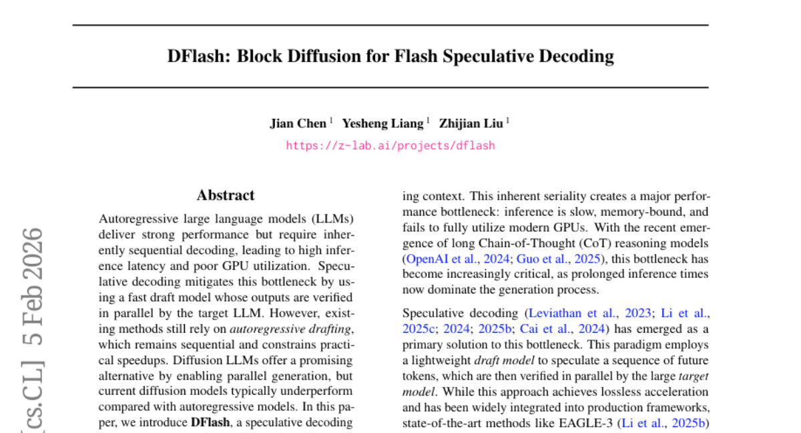

# 2026-02-06 Daily Papers (Top 5)

## 1. [CAR-bench: Evaluating the Consistency and Limit-Awareness of LLM Agents under Real-World Uncertainty](https://huggingface.co/papers/2601.22027)
**Upvotes**: 72

### 📌 요약
실세계 불확실성 속 LLM 에이전트의 치명적 결함을 파악하고 일관성과 한계 인식을 평가하는 혁신적 벤치마크 CAR-bench가 제시되었습니다.

### � 핵심 포인트
- 핵심 기여: LLM으로 시뮬레이션된 불확실한 사용자 환경, 도메인 정책, 58개의 상호 연결된 도구를 활용하여 일관성, 한계 인식, 불확실성 처리를 평가하는 새로운 벤치마크 CAR-bench를 도입했습니다.
- 성능/결과: 최신 LLM 에이전트조차 모호성 해소(Disambiguation) 작업에서 일관된 성공률이 50% 미만이며, 도구가 없을 때 정책 위반 및 정보 조작(환각)을 자주 일으키는 심각한 신뢰성 격차를 보였습니다.
- 대상/응용 분야: 실제 환경(예: 음성 비서)에서 사용되는 신뢰성 높은 다중 턴, 도구 사용 LLM 에이전트를 개발하는 연구자 및 개발자.

### 📝 초록 (번역)
현재 LLM 에이전트 평가는 이상적인 설정에서의 단순한 작업 완료에 초점을 맞추고 있습니다. 하지만 차량 내 음성 비서와 같은 실제 사용자 환경에서는 불완전하거나 모호한 요청이 흔하며, 에이전트는 이를 처리하는 신뢰성(일관성, 한계 인식)이 매우 중요합니다. 기존 벤치마크는 이러한 실세계 불확실성을 간과했습니다. 이에 연구진은 LLM으로 시뮬레이션된 사용자, 도메인 정책, 58개의 상호 연결된 도구를 포함하는 새로운 벤치마크 'CAR-bench'를 제안했습니다. 이 벤치마크는 에이전트가 정보를 조작하는지를 확인하는 '환각 테스트(Hallucination)'와 모호한 요청을 명확히 하는 '모호성 해소 테스트(Disambiguation)'에 집중하여 신뢰성을 평가합니다. 평가 결과, 최신 추론 LLM 에이전트조차 모호성 해소 작업에서 일관성 있는 성공률이 50% 미만이었으며, 도구 부재 시 정보를 조작하거나 정책을 위반하는 등 심각한 신뢰성 문제를 드러냈습니다. 이는 실세계 적용을 위한 더 안정적이고 자기 인식적인 LLM 에이전트 개발이 시급함을 보여줍니다.

---

## 2. [Spider-Sense: Intrinsic Risk Sensing for Efficient Agent Defense with Hierarchical Adaptive Screening](https://huggingface.co/papers/2602.05386)
**Upvotes**: 64

### 📌 요약
자율형 LLM 에이전트의 보안을 강화하기 위해 내재적 위험 감지(IRS)를 도입하고 계층적 적응형 선별 방식을 통해 외부 모델 의존성을 제거, 최소한의 지연(8.3%)으로 최고 수준의 방어 성능을 달성한 혁신적인 방어 프레임워크를 제안했습니다.

### � 핵심 포인트
- 에이전트가 스스로 위험을 감지하고 선택적으로 방어하는 내재적 위험 감지(IRS) 기반의 계층적 적응형 선별(Hierarchical Adaptive Screening) 시스템 구축.
- 경쟁 모델 대비 가장 낮은 공격 성공률(ASR)과 오탐률(FPR)을 기록했으며, 시스템 지연 시간은 8.3%로 매우 효율적임.
- 자율형 LLM 에이전트의 보안 및 안정성 확보, 그리고 보안 검증 효율성 향상을 연구하는 개발자 및 연구자.

### 📝 초록 (번역)
LLM이 자율형 에이전트로 발전함에 따라 실제 적용 분야는 넓어졌지만, 동시에 새로운 보안 문제에 직면했습니다. 기존의 에이전트 방어 방식은 정해진 단계마다 보안 검증을 강제적으로 실행(mandatory checking)하여 비효율적이며 에이전트 아키텍처와 분리되어 있다는 한계가 있었습니다. 본 논문은 에이전트의 보안이 강제적이 아닌 '내재적이고 선택적'이어야 한다고 주장하며, 이벤트 기반의 방어 프레임워크인 'Spider-Sense'를 제안합니다. 이 시스템은 에이전트가 평소에는 잠재적인 경계를 유지하다가 위험을 감지(Intrinsic Risk Sensing, IRS)했을 때만 방어 기제를 작동시킵니다. 방어 기제가 발동되면, 이미 알려진 패턴은 경량화된 유사성 매칭으로 빠르게 처리하고 모호한 사례는 에이전트 내부의 깊은 추론을 통해 정밀하게 해결하는 계층적 방어 전략을 사용합니다. 이를 통해 외부 보안 모델에 의존할 필요가 없어집니다. 실제 도구 실행과 다단계 공격 시나리오를 반영한 S^2Bench 벤치마크를 통해 검증한 결과, Spider-Sense는 경쟁 모델 대비 가장 낮은 공격 성공률(ASR)과 오탐률(FPR)을 달성했으며, 시스템 지연 시간은 단 8.3% 증가하는 데 그쳐 효율성과 정밀도를 동시에 입증했습니다.

---

## 3. [MemSkill: Learning and Evolving Memory Skills for Self-Evolving Agents](https://huggingface.co/papers/2602.02474)
**Upvotes**: 46

### 📌 요약
정적인 메모리 시스템의 한계를 극복하고, 메모리 작업을 스스로 학습하고 진화시키는 'MemSkill'을 제안하여 LLM 에이전트의 장기 기억 관리 능력을 혁신적으로 개선했습니다.

### � 핵심 포인트
- 핵심 혁신은 정적인 메모리 작업을 학습 및 진화 가능한 '메모리 스킬'로 대체하고, 컨트롤러, 실행기, 디자이너로 구성된 폐쇄 루프 시스템을 통해 스킬 세트 자체를 지속적으로 개선하는 것입니다.
- LoCoMo, LongMemEval, HotpotQA, ALFWorld 등 주요 벤치마크에서 기존 강력한 기준선보다 뛰어난 작업 수행 능력을 보였으며, 다양한 환경에서 높은 일반화 성능을 입증했습니다.
- 장기 기억 관리, 자체 진화 에이전트(Self-Evolving Agents), 그리고 복잡하고 적응적인 메모리 시스템 구축에 관심 있는 LLM 에이전트 개발자 및 연구자.

### 📝 초록 (번역)
현재 대규모 언어 모델(LLM) 에이전트의 메모리 시스템은 정보를 추출하거나 정리하는 기능이 정적이고 미리 설계된 방식에 의존합니다. 이처럼 고정된 절차는 인간의 사전 지식에 갇혀 다양한 상호작용 상황에서 경직되며, 긴 이력을 처리할 때 비효율적이라는 근본적인 한계가 있었습니다. 이를 해결하기 위해 저희는 메모리 작업을 정보 추출, 통합, 가지치기 등을 위한 학습 가능하고 진화하는 '메모리 스킬(MemSkill)'로 재정의했습니다. MemSkill은 컨트롤러가 상황에 맞는 스킬을 선택하고, LLM 기반 실행기(Executor)가 이 스킬 가이드를 따르는 메모리를 생성하는 구조입니다. 더욱 중요한 점은, MemSkill이 디자이너 컴포넌트를 도입하여, 선택된 스킬이 부정확하거나 불완전한 메모리를 생성한 '어려운 사례'를 주기적으로 검토하고 기존 스킬을 개선하거나 완전히 새로운 스킬을 제안함으로써 스킬 세트 자체를 진화시킨다는 것입니다. 이러한 닫힌 루프(Closed-loop) 절차를 통해 메모리 선택 정책과 스킬 세트 모두가 지속적으로 개선됩니다. 실험 결과, MemSkill은 LoCoMo, LongMemEval 등 주요 벤치마크에서 기존의 강력한 기준선보다 뛰어난 작업 수행 능력을 보였으며, 자체 진화하는 LLM 에이전트 메모리 관리 시스템의 새로운 방향을 제시합니다.

---

## 4. [Length-Unbiased Sequence Policy Optimization: Revealing and Controlling Response Length Variation in RLVR](https://huggingface.co/papers/2602.05261)
**Upvotes**: 45

### 📌 요약
RLVR 훈련 중 응답 길이 편향을 제거하여 추론 능력 붕괴를 막고, 수학 및 멀티모달 추론 과제에서 SOTA 성능을 입증한 길이-비편향 시퀀스 정책 최적화(LUSPO) 알고리즘을 발표함.

### � 핵심 포인트
- GSPO의 손실 함수에서 응답 길이 편향을 제거하고 길이 붕괴(Response Length Collapse) 문제를 해결한 LUSPO 알고리즘 제안.
- 수학적 추론 및 멀티모달 추론 벤치마크에서 기존 SOTA 방식(GRPO, GSPO) 대비 일관되게 우수한 성능을 달성하며 최신 기술 수준을 갱신함.
- RLVR 기반의 LLM/VLM 추론 능력 향상 연구자, 특히 정책 최적화 단계에서 응답 길이 제어 및 안정적인 성능 개선이 필요한 개발자.

### 📝 초록 (번역)
최근 LLM 및 VLM의 복잡한 추론 능력을 강화하기 위해 RLVR(검증 가능한 보상을 사용한 강화 학습)이 성공적으로 적용되고 있으며, 일반적으로 응답 길이가 길어지는 것이 추론 능력 성장의 핵심 지표로 여겨집니다. 하지만 훈련 과정에서 알고리즘별로 응답 길이 변화 패턴이 불규칙하고, 기존 방법론들에는 응답 길이에 대한 내재적 편향이 존재하여 추론 능력의 저하(길이 붕괴) 문제가 발생했습니다. 본 논문은 이러한 문제를 해결하기 위해 주류 RLVR 알고리즘의 구성 요소를 심층 분석하여 응답 길이 변화에 영향을 미치는 요소를 이론적으로 규명했습니다. 이 이론적 통찰을 바탕으로 기존 GSPO(Group Sequence Policy Optimization)의 손실 함수에 내재된 길이 편향을 완벽하게 제거한 LUSPO(Length-Unbiased Sequence Policy Optimization) 알고리즘을 제안합니다. 실험 결과, LUSPO는 수학 및 멀티모달 추론 벤치마크 전반에 걸쳐 GRPO, GSPO 같은 기존 최적화 전략보다 지속적으로 월등한 성능을 달성하며 새로운 SOTA를 확립했습니다.

---

## 5. [DFlash: Block Diffusion for Flash Speculative Decoding](https://huggingface.co/papers/2602.06036)
**Upvotes**: 30

### 📌 요약
DFlash는 병렬 블록 디퓨전 모델을 통해 LLM 추론 과정 중 드래프팅의 순차적 구조를 완전히 제거하여, 기존 최고 속도 모델보다 최대 2.5배 빠른 6배 이상의 혁신적인 무손실 가속 성능을 제공합니다.

### � 핵심 포인트
- 핵심 혁신: 자기회귀 대신 경량 블록 디퓨전 모델을 사용하여 LLM 드래프팅을 병렬화하는 DFlash 프레임워크 도입.
- 성능 및 결과: 다양한 태스크에서 6배 이상의 무손실 가속 달성; 기존 최고 수준의 스펙큘레이티브 디코딩 기술 대비 최대 2.5배 높은 속도 향상.
- 적용 대상: 고성능 및 고처리량 LLM 추론 시스템 구축이 필요한 개발자 및 연구자.

### 📝 초록 (번역)
대규모 언어 모델(LLM)은 뛰어난 성능을 보이지만, 토큰을 하나씩 생성하는 순차적(자기회귀) 디코딩 방식 때문에 추론 지연 시간이 길고 GPU 활용 효율이 낮았습니다. 스펙큘레이티브 디코딩(Speculative Decoding)이 이러한 병목 현상을 완화하기 위해 도입되었으나, 초안을 생성하는(drafting) 과정 역시 여전히 순차적이어서 실질적인 속도 향상에 큰 한계가 있었습니다.

본 논문은 이러한 한계를 극복하기 위해 DFlash라는 새로운 스펙큘레이티브 디코딩 프레임워크를 제안합니다. DFlash는 경량화된 '블록 디퓨전 모델(Block Diffusion Model)'을 활용하여 드래프팅 과정을 병렬로 처리합니다. 이 모델은 단 한 번의 포워드 패스만으로 여러 개의 초안 토큰을 동시에 생성하며, 타겟 모델에서 추출한 컨텍스트 특징을 조건으로 사용하여 높은 품질의 초안과 높은 수용률을 보장합니다.

실험 결과, DFlash는 다양한 모델과 작업에서 6배 이상의 무손실 가속을 달성했으며, 기존 최고 성능 스펙큘레이티브 디코딩 방법인 EAGLE-3 대비 최대 2.5배 높은 속도 향상을 입증했습니다.

---

