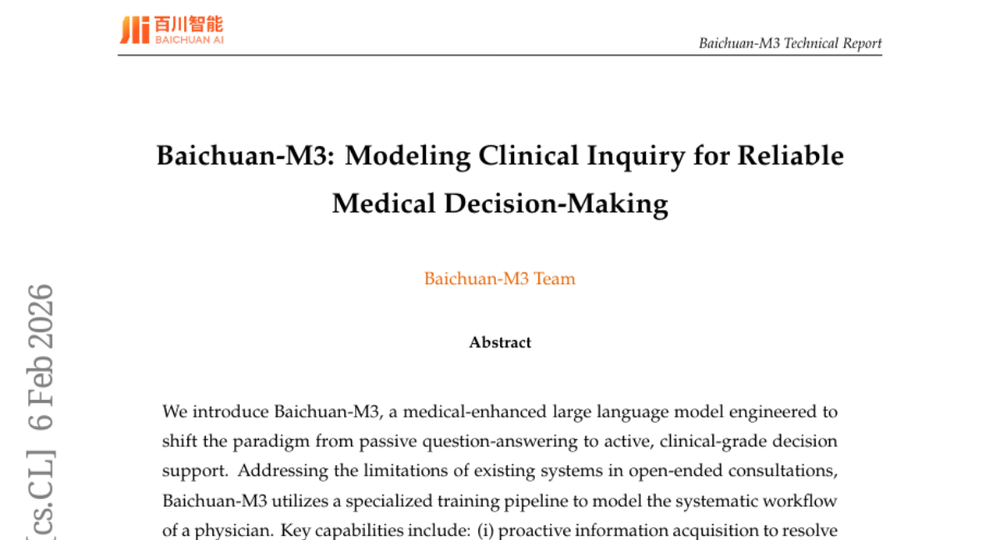
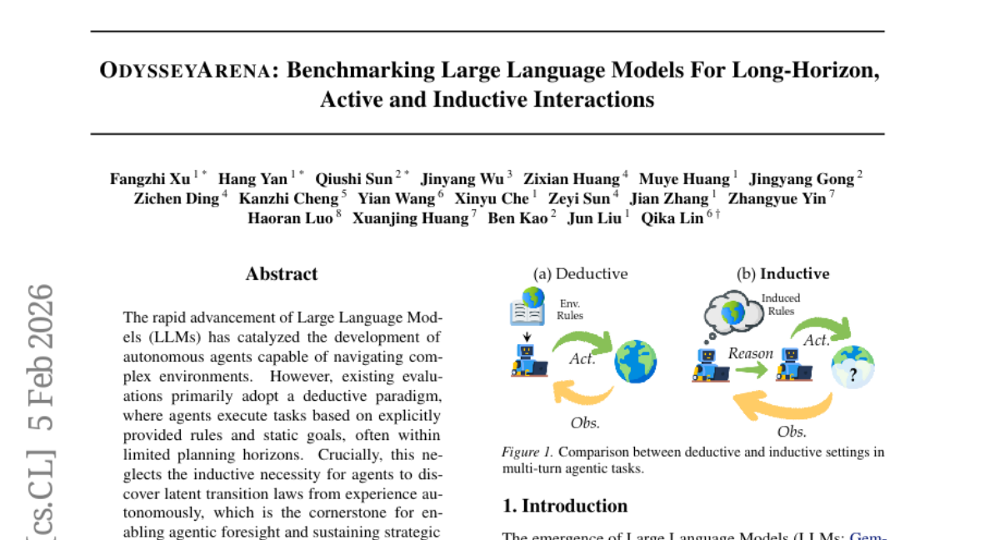
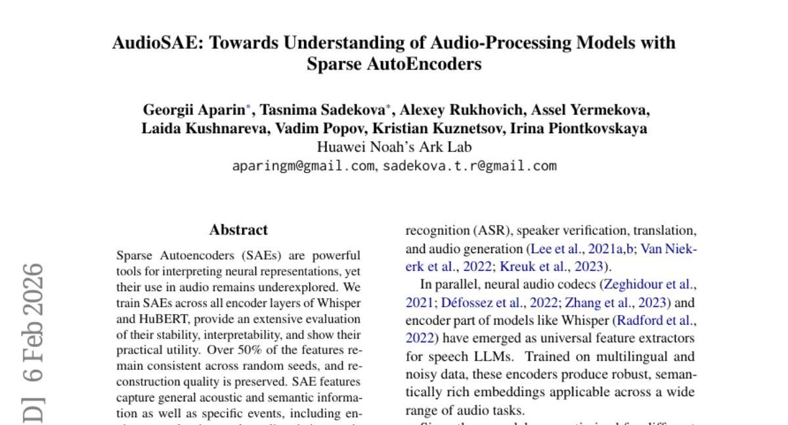
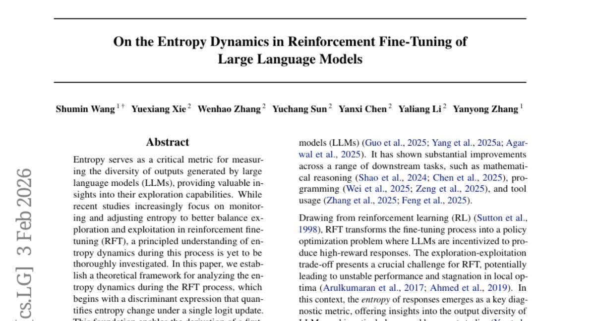

# 2026-02-09 Daily Papers (Top 5)

## 1. [Baichuan-M3: Modeling Clinical Inquiry for Reliable Medical Decision-Making](https://huggingface.co/papers/2602.06570)
**Upvotes**: 54

### 📌 요약
백천-M3는 단순 문답형 AI를 넘어 의사의 체계적인 진료 과정을 모방하여 신뢰성을 극대화한 임상급 의사결정 지원 시스템의 새로운 표준을 제시합니다.

### � 핵심 포인트
- 수동적 답변에서 벗어나, 능동적인 정보 획득, 장기 추론, 환각 억제를 통해 의사의 체계적 진료 흐름을 모방한 임상 의사결정 지원 시스템.
- HealthBench, HealthBench-Hallu, ScanBench 등 핵심 의료 벤치마크에서 SOTA를 달성했으며, 특히 임상 자문 및 안전성 측면에서 GPT-5.2를 큰 차이로 능가함.
- 신뢰도 높은 임상 보조 AI 시스템 및 의료용 LLM의 안전성 향상 연구를 진행하는 개발자 및 연구자.

### 📝 초록 (번역)
기존 의료 AI는 환자의 복잡하고 개방형인 질의에 대해 수동적인 답변만 제공하며, 신뢰성(환각 현상)과 논리적 추론 능력이 부족했습니다. 이에 백천-M3(Baichuan-M3)는 의사의 체계적인 진료 과정을 모델링하여 능동적으로 정보를 획득(모호성 해소), 분산된 증거를 통합하는 장기 추론, 그리고 환각을 능동적으로 억제하는 전문화된 학습 파이프라인을 도입했습니다. 그 결과, Baichuan-M3는 HealthBench, HealthBench-Hallu, ScanBench 등 주요 벤치마크에서 기존 최고 수준 모델인 GPT-5.2를 임상 질의, 자문, 안전성 측면에서 월등히 능가하며 최신 SOTA 성능을 달성했습니다.

---

## 2. [F-GRPO: Don't Let Your Policy Learn the Obvious and Forget the Rare](https://huggingface.co/papers/2602.06717)
**Upvotes**: 53

### 📌 요약
RL 학습에서 흔한 성공 사례에 대한 편향을 줄이고 희귀한 정답 경로를 포착하도록 난이도 인식 이득 스케일링 계수를 도입하여, 계산 비용 증가 없이 주요 RLVR 벤치마크 성능을 획기적으로 향상시킨 경량화된 정책 업데이트 방법을 제안합니다.

### � 핵심 포인트
- 핵심은 희귀하고 어려운 성공 경로에 집중하기 위해, 쉬운 성공 사례의 정책 업데이트 가중치를 낮추는 '난이도 인식 이득 스케일링 계수(Focal Loss 아이디어 차용)'를 도입한 것입니다.
- 그룹 크기나 계산 비용 증가 없이, Qwen2.5-7B 벤치마크에서 pass@256 기준 성능을 획기적으로 개선했습니다 (GRPO 기준 6.2%p 향상). 이는 기존 RLVR 알고리즘의 희귀 정답 포착 능력이 대폭 강화되었음을 의미합니다.
- RLVR 기반의 언어 모델 학습 연구자 및 개발자 (특히 GRPO, DAPO, CISPO와 같은 그룹 기반 상대적 강화 학습 알고리즘을 사용하는 분야)가 대상입니다. 복잡한 추론이나 코드 생성 등 희귀한 정답 경로가 중요한 영역에 즉시 적용 가능합니다.

### 📝 초록 (번역)
검증 가능한 보상 기반의 강화 학습(RLVR)은 정책 업데이트 안정화를 위해 그룹 샘플링 방식을 주로 사용합니다. 하지만 그룹 크기가 제한되면 계산상의 한계로 인해 학습이 이미 흔한 성공 경로에 편중되며, 정책이 희귀하지만 정확한 해법(rare-correct trajectories)을 놓치거나 기존의 희귀 성공 모드를 잊어버리는 문제가 발생합니다. 이 문제를 해결하기 위해, 우리는 Focal Loss에서 영감을 받아 정책의 난이도를 인지하여 이득(advantage)을 조정하는 스케일링 계수(Difficulty-aware advantage scaling coefficient)를 제안합니다. 이 계수는 성공률이 높은(쉬운) 프롬프트에 대한 업데이트 가중치를 낮춰서, 알고리즘이 희귀한 성공 사례에 집중하도록 유도합니다. 이 간단하고 가벼운 수정은 GRPO, DAPO, CISPO 같은 기존 RLVR 알고리즘에 바로 통합될 수 있으며, Qwen2.5-7B 모델 테스트 결과 pass@256 성능을 획기적으로 개선하면서(예: GRPO 기준 64.1% $\rightarrow$ 70.3%) pass@1 성능은 유지하거나 향상시키는 놀라운 결과를 보였습니다.

---

## 3. [OdysseyArena: Benchmarking Large Language Models For Long-Horizon, Active and Inductive Interactions](https://huggingface.co/papers/2602.05843)
**Upvotes**: 51

### 📌 요약
기존 LLM 에이전트 평가의 한계(단순 연역)를 극복하고, 장기적이며 능동적인 '귀납적 상호작용'을 측정하는 새로운 벤치마크인 OdysseyArena를 제시하며 최신 모델들의 근본적인 취약점을 밝혀냈다.

### � 핵심 포인트
- 핵심 공헌은 에이전트 평가 패러다임을 연역(Deduction)에서 장기적이고 능동적인 귀납적 상호작용(Inductive Interaction)으로 전환하는 새로운 벤치마크 'OdysseyArena'를 제시한 것입니다.
- 15개 이상의 선도적인 LLM 실험 결과, 최첨단 모델들이 귀납적 효율성에서 심각한 결함을 보였으며, 이는 자율 에이전트 개발의 중요한 병목 지점임을 입증했습니다.
- 자율 에이전트 개발자, LLM 평가 연구자, 복잡 환경에서의 장기 전략 및 '에이전트적 선견지명(Agentic Foresight)' 개선에 관심 있는 연구자들에게 필수적입니다.

### 📝 초록 (번역)
LLM 에이전트의 발전으로 복잡한 환경을 탐색하는 능력이 향상되고 있습니다. 하지만 기존 평가는 명시된 규칙만 따르는 '연역적' 방식에 치우쳐 있으며, 에이전트가 경험을 통해 환경의 숨겨진 작동 방식(전이 법칙)을 스스로 발견(귀납)하는 능력을 측정하지 못하고 있습니다. 이러한 귀납 능력은 장기적인 전략 수립 및 선견지명에 필수적입니다. 이 격차를 해소하기 위해 저희는 장기적이고, 능동적이며, 귀납적인 상호작용에 초점을 맞춘 OdysseyArena 벤치마크를 도입했습니다. 이 벤치마크는 표준 측정 세트인 OdysseyArena-Lite(120개 태스크)와 극한의 상호작용 환경을 테스트하는 OdysseyArena-Challenge를 포함합니다. 15개 이상의 최신 LLM을 대상으로 한 광범위한 실험 결과, 최첨단 모델조차도 귀납적 시나리오에서 심각한 결함을 보였으며, 이는 복잡 환경에서 자율적 발견을 추구하는 데 있어 중요한 병목 현상임을 확인했습니다.

---

## 4. [AudioSAE: Towards Understanding of Audio-Processing Models with Sparse AutoEncoders](https://huggingface.co/papers/2602.05027)
**Upvotes**: 48

### 📌 요약
희소 오토인코더(SAE)를 오디오 모델 해석에 최초로 적용하여 Whisper의 내부 작동 원리를 깊이 이해하고, 실질적인 특징 조향(Feature Steering)을 통해 음성 오탐지율을 70% 감소시키는 등 혁신적인 제어 능력을 입증한 연구입니다.

### � 핵심 포인트
- 오디오 모델(Whisper, HuBERT)에 희소 오토인코더(SAE)를 최초로 적용하여 모델의 내부 표현을 깊이 있게 해석하고, 환경 소음 및 미묘한 발화 특징(예: 웃음, 속삭임)까지 효과적으로 분리하는 혁신적인 해석 가능성(Interpretability)을 확보했습니다.
- 특징 조향(Feature Steering)을 통해 Whisper의 음성 오탐지율을 70% 감소시키는 실제적 효용성을 입증했으며, 특징의 절반 이상이 무작위 시드 변경에도 일관되게 유지되는 등 높은 안정성을 보여주었습니다.
- XAI(설명 가능한 AI) 연구자, Whisper나 HuBERT 같은 최신 오디오 모델의 내부 오작동을 제어하고 성능을 미세 조정하려는 개발자 및 엔지니어에게 필수적인 분석 도구를 제공합니다.

### 📝 초록 (번역)
오디오SAE(AudioSAE) 연구는 AI 모델의 내부를 해석하는 데 효과적인 희소 오토인코더(SAE)가 오디오 처리 모델에서는 제대로 활용되지 못했다는 문제의식에서 출발합니다. 이에 연구팀은 Whisper와 HuBERT의 모든 인코더 레이어에 SAE를 학습시켜 모델이 어떤 특징을 포착하는지 분석했습니다. 그 결과, AudioSAE 특징들은 일반적인 음향 정보뿐 아니라 웃음, 속삭임 같은 미묘한 발화 특징과 환경 소음을 놀랍도록 효과적으로 분리해 포착했습니다. 특히, 이 특징들을 제어(Feature Steering)하는 것만으로 Whisper의 음성 오탐지(False Speech Detection)를 70%나 줄이는 강력한 실용적 효용성을 보여주었으며, 이 특징들이 인간의 뇌파(EEG) 활동과도 상관관계를 보인다는 점은 AudioSAE가 인간의 청각 인지 과정과 유사하게 작동함을 시사합니다.

---

## 5. [On the Entropy Dynamics in Reinforcement Fine-Tuning of Large Language Models](https://huggingface.co/papers/2602.03392)
**Upvotes**: 45

### 📌 요약
LLM 강화 학습 기반 미세 조정(RFT) 과정 중 엔트로피 변화를 정량적으로 분석하는 이론적 프레임워크를 수립하고, 이를 기반으로 탐색과 활용 균형을 극대화하는 새로운 제어 전략을 제시한다.

### � 핵심 포인트
- RFT 과정 중 엔트로피 변화를 정량화하고 분석하는 이론적 프레임워크 수립 및 핵심 식(판별 표현식, 1차 표현식) 도출.
- 분석 결과를 뒷받침하는 실증적 증거 제시 및 파생된 엔트로피 판별자 클리핑 방법의 효과 입증.
- RFT 훈련 동역학 이해 및 탐색-활용 균형 최적화 전략이 필요한 연구자와 개발자.

### 📝 초록 (번역)
대규모 언어 모델(LLM)의 강화 학습 기반 미세 조정(RFT)에서 엔트로피는 모델의 출력 다양성 및 탐색 능력 측정에 핵심적 역할을 합니다. 하지만 훈련 중 엔트로피가 어떻게 변동하는지에 대한 원리적인 이해는 부족했습니다. 본 논문은 단일 로그잇 업데이트에 따른 엔트로피 변화를 정량적으로 분석하는 이론적 프레임워크를 수립하고, 이를 GRPO(Group Relative Policy Optimization) 업데이트 공식까지 확장했습니다. 이러한 이론적 통찰력은 기존 엔트로피 기반 방법론을 해석하는 새로운 기준을 제공하며, 탐색-활용 균형을 최적화할 수 있는 '엔트로피 판별자 클리핑'과 같은 실용적인 제어 기법 개발로 이어져 RFT 훈련 동역학에 대한 깊은 이해를 제공합니다.

---

