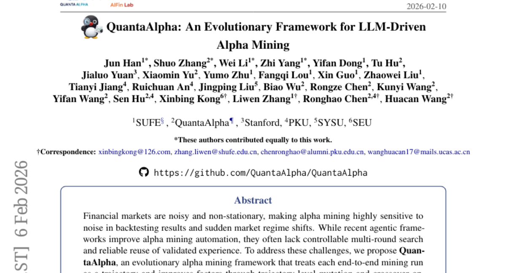
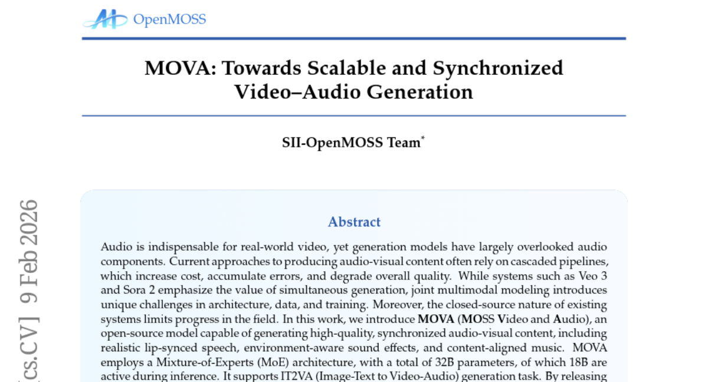
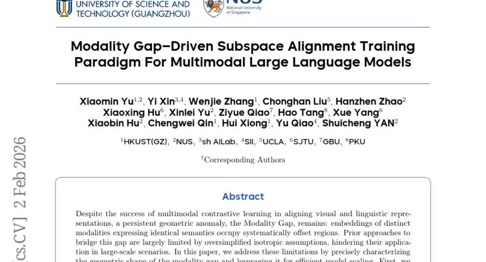
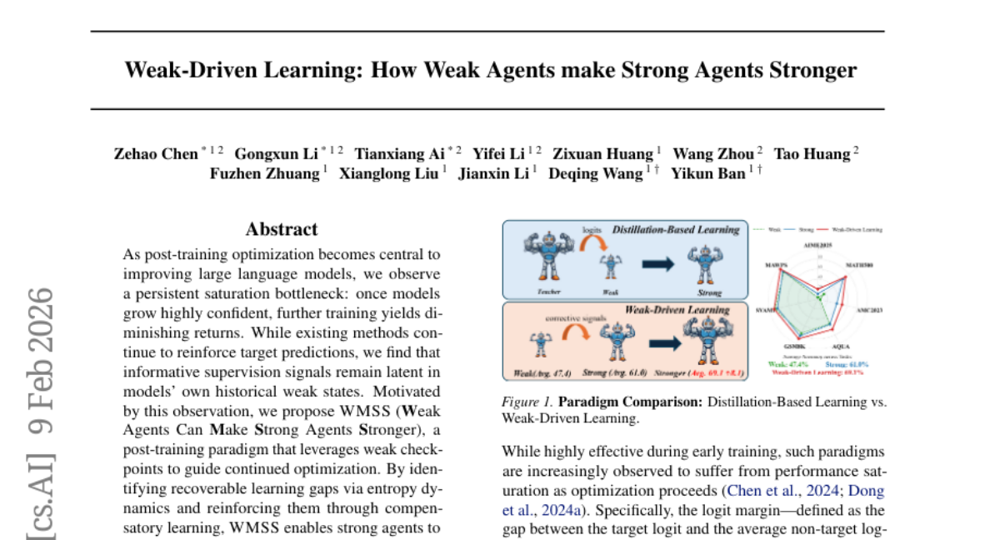
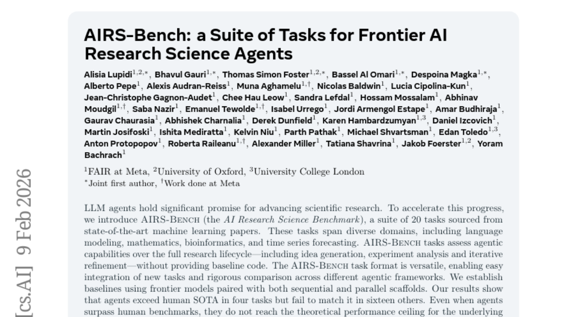

# 2026-02-10 Daily Papers (Top 5)

## 1. [QuantaAlpha: An Evolutionary Framework for LLM-Driven Alpha Mining](https://huggingface.co/papers/2602.07085)
**Upvotes**: 140

### 📌 요약
LLM의 추론 과정을 진화 알고리즘과 결합하여, 노이즈가 많은 금융 시장에서도 강건하고 전이 성능이 뛰어난 차세대 알파 마이닝 프레임워크를 제안했습니다.

### � 핵심 포인트
- 알파 마이닝 과정을 궤적 단위로 관리하며 변이(Mutation)와 교차(Crossover)를 통해 전략을 지속적으로 개선하는 '진화적 궤적 최적화' 기법을 도입했습니다.
- CSI 300 기준 정보 계수(IC) 0.1501, 연수익률 27.75%라는 높은 성과를 냈으며, 타 시장(S&P 500 등)으로의 전이 학습 시에도 압도적인 초과 수익을 유지했습니다.
- LLM을 활용해 자동화된 퀀트 투자 시스템을 구축하려는 엔지니어와 시장의 비정형적 변화에 대응 가능한 강건한 알고리즘을 연구하는 금융 데이터 과학자에게 유용합니다.

### 📝 초록 (번역)
금융 시장은 노이즈가 심하고 끊임없이 변화하기 때문에, 수익을 낼 수 있는 지표인 '알파'를 찾는 과정은 시장 변화와 백테스킹 오차에 매우 취약합니다. 최근 LLM 기반의 에이전트들이 도입되었으나, 검색 과정을 제어하거나 과거의 성공 경험을 효과적으로 재사용하는 데 한계가 있었습니다. 이를 해결하기 위해 본 논문은 알파 마이닝의 전체 과정을 하나의 '궤적(Trajectory)'으로 정의하고, 이를 진화시키는 QuantaAlpha 프레임워크를 선보입니다. 이 시스템은 성과가 낮은 단계를 찾아내 수정하는 '변이'와 우수한 전략 조각들을 결합하는 '교차' 연산을 통해 최적의 지표를 찾아냅니다. 결과적으로 CSI 300 지수에서 연수익률 27.75%를 기록했으며, 특히 미국 S&P 500 시장에서도 137%의 누적 초과 수익을 달성하며 강력한 시장 범용성을 입증했습니다.

---

## 2. [MOVA: Towards Scalable and Synchronized Video-Audio Generation](https://huggingface.co/papers/2602.08794)
**Upvotes**: 130

### 📌 요약
비디오와 오디오를 동시에 생성하는 32B 규모의 MoE 기반 오픈소스 모델 MOVA를 통해, 기존의 분절된 생성 방식의 한계를 극복하고 완벽하게 동기화된 고품질 멀티미디어 생성을 실현했습니다.

### � 핵심 포인트
- 핵심 혁신: 비디오와 오디오를 병렬적으로 생성하는 통합 MoE(Mixture-of-Experts) 아키텍처를 도입하여 복잡한 다중 단계 파이프라인 없이도 자연스러운 시청각 동기화를 달성했습니다.
- 성능 및 결과: 32B 파라미터(추론 시 18B 활성) 규모의 대형 모델로서, 사실적인 립싱크 음성, 환경 소리, 배경 음악이 조화된 고품질 IT2VA(Image-Text to Video-Audio) 생성을 지원합니다.
- 대상 및 활용: 고성능 통합 생성 모델을 연구하는 개발자와 연구자, 그리고 LoRA 미세 조정이나 프롬프트 강화를 통해 맞춤형 멀티미디어 콘텐츠를 제작하려는 크리에이터에게 최적화되어 있습니다.

### 📝 초록 (번역)
현실적인 비디오 경험을 위해 오디오는 필수적이지만, 기존의 AI 모델들은 오디오 생성을 간과하거나 비디오 생성 후 오디오를 별도로 입히는 번거로운 방식을 사용해왔습니다. 이러한 방식은 처리 비용이 높고 시각-청각 간의 정렬이 어긋나는 고질적인 문제를 안고 있었습니다. 이를 해결하기 위해 본 논문에서는 비디오와 오디오를 하나의 시스템에서 동시에 생성하는 'MOVA'를 제안합니다. MOVA는 320억 개의 파라미터를 가진 MoE(Mixture-of-Experts) 구조를 채택하여, 입력된 이미지와 텍스트를 바탕으로 고품질 영상은 물론 입모양에 맞춘 음성, 환경음, 음악까지 동기화된 상태로 생성합니다. 특히 소스 코드를 모두 공개함으로써 폐쇄적이었던 고성능 미디어 생성 기술의 장벽을 낮추고 누구나 연구에 활용할 수 있도록 했습니다.

---

## 3. [Modality Gap-Driven Subspace Alignment Training Paradigm For Multimodal Large Language Models](https://huggingface.co/papers/2602.07026)
**Upvotes**: 120

### 📌 요약
고가의 이미지-텍스트 쌍 데이터 없이도 통계적 정렬을 통해 대규모 멀티모달 모델(MLLM)의 성능을 효율적으로 확장할 수 있는 'ReVision' 훈련 패러다임을 제시했습니다.

### � 핵심 포인트
- 모달리티 갭을 단순 오차가 아닌 통계적 편향과 잔차로 정밀하게 정의하고, 학습 없이 텍스트를 이미지 분포에 맞추는 3단계 정렬(ReAlign) 기술을 개발했습니다.
- 수작업이 필요한 고가의 이미지-텍스트 데이터 쌍을 대량의 일반 텍스트 데이터로 대체할 수 있어, 모델 확장 비용을 획기적으로 낮추면서도 높은 성능을 유지합니다.
- 데이터 구축 비용 문제로 어려움을 겪는 MLLM 개발자와 임베딩 공간의 기하학적 불균형을 해결하려는 AI 연구자들에게 강력한 솔루션을 제공합니다.

### 📝 초록 (번역)
최근 멀티모달 모델들은 이미지와 텍스트를 동일한 공간에 정렬하려 노력하지만, 실제 임베딩 공간에서는 두 데이터가 서로 분리된 영역에 위치하는 '모달리티 갭(Modality Gap)' 현상이 고질적으로 발생합니다. 기존 연구들은 이 간극을 너무 단순하게 가정하여 대규모 모델로의 확장에 한계가 있었습니다. 본 논문은 모달리티 갭의 기하학적 형상을 정밀하게 분석하는 '고정 프레임 모달리티 갭 이론'을 정립하고, 이를 바탕으로 별도의 학습 없이 통계치만으로 데이터를 정렬하는 'ReAlign' 전략을 제안합니다. 나아가 이를 MLLM의 사전 학습 단계에 통합한 'ReVision' 프레임워크를 통해, 값비싼 이미지-텍스트 쌍 데이터 대신 풍부한 일반 텍스트 데이터만으로도 시각적 분포를 학습할 수 있음을 입증했습니다.

---

## 4. [Weak-Driven Learning: How Weak Agents make Strong Agents Stronger](https://huggingface.co/papers/2602.08222)
**Upvotes**: 114

### 📌 요약
포스트 트레이닝의 한계를 넘어, 성능이 포화된 모델이 과거의 '약한 상태'를 이정표 삼아 스스로를 더욱 강화하게 만드는 새로운 학습 패러다임 'WMSS'를 제안합니다.

### � 핵심 포인트
- 과거의 약한 체크포인트를 활용한 '약자 기반 학습(Weak-Driven Learning)'을 통해, 정답 예측만 반복하던 기존 방식의 한계를 깨고 모델의 잠재적 취약점을 정밀하게 보완하는 혁신적인 접근법을 제시함.
- 수학적 추론 및 코드 생성 벤치마크에서 기존 포스트 트레이닝 기법보다 우수한 성능 향상을 입증했으며, 별도의 외부 모델 없이 자체 체크포인트만 활용하여 추가적인 추론 비용(Zero Inference Cost)이 발생하지 않음.
- LLM의 성능 포화 문제를 겪고 있는 AI 모델러나, 추가적인 연산 리소스 투입 없이 모델의 추론 및 코딩 능력을 극대화하고자 하는 개발자 및 연구자에게 유용함.

### 📝 초록 (번역)
최근 LLM의 성능을 끌어올리기 위한 사후 최적화(Post-training)가 핵심적인 과정으로 자리 잡았지만, 모델이 특정 수준 이상의 확신을 가지게 되면 학습 효율이 급격히 떨어지는 '성능 포화' 현상이 발생합니다. 연구진은 이 문제를 해결하기 위해 모델이 과거에 가졌던 '약한 상태'의 체크포인트에 숨겨진 감독 신호가 있다는 점에 주목했습니다. 이를 바탕으로 엔트로피 변화를 분석해 모델이 놓치고 있는 학습 공백을 찾아내고 보완하는 'WMSS' 기법을 개발했습니다. 그 결과, 수학적 추론과 코드 생성 분야에서 기존 방식을 뛰어넘는 성능 향상을 이뤄냈으며, 특히 실제 서비스 시 추가적인 연산 비용이 전혀 들지 않는다는 점이 큰 장점입니다.

---

## 5. [AIRS-Bench: a Suite of Tasks for Frontier AI Research Science Agents](https://huggingface.co/papers/2602.06855)
**Upvotes**: 51

### 📌 요약
최신 ML 논문의 20개 과제를 통해 AI 에이전트의 아이디어 생성부터 실험 분석까지 전 과정을 평가하는 개방형 벤치마크 'AIRS-Bench'를 제안했습니다.

### � 핵심 포인트
- 아이디어 생성, 실험 설계, 반복적인 결과 분석 등 과학 연구의 전 과정을 코드 지원 없이 독자적으로 수행해야 하는 고난도 평가 체계를 구축했습니다.
- 20개의 연구 과제 중 4개에서는 기존 인간 SOTA를 경신하는 성과를 거두었으나, 대다수 과제에서는 여전히 인간 수준과 이론적 한계에 미치지 못함을 확인했습니다.
- 자율 과학 연구(Autonomous Research) 시스템을 개발하는 연구자나 복잡한 논리적 추론 및 문제 해결 능력을 갖춘 LLM 에이전트를 설계하는 엔지니어에게 최적의 평가 도구가 될 것입니다.

### 📝 초록 (번역)
최근 LLM 에이전트가 과학 연구를 자동화할 것이라는 기대가 크지만, 실제 연구의 복잡한 과정을 제대로 평가할 수 있는 표준화된 도구는 부족했습니다. 기존의 평가 방식은 가이드 코드를 제공하거나 단편적인 문제 해결에 그치는 경우가 많았습니다. 연구진은 이를 해결하기 위해 수학, 생물정보학, 시계열 예측 등 실제 최신 논문에서 추출한 20개의 난도 높은 과제로 구성된 'AIRS-Bench'를 개발했습니다. 이 벤치마크는 베이스라인 코드 없이 에이전트가 스스로 연구 사이클을 완수하도록 요구합니다. 실험 결과, 최신 AI 에이전트들은 4개 과제에서 인간의 성능을 앞질렀으나 나머지 16개에서는 미치지 못했으며, 이는 향후 자율 과학 연구 에이전트가 발전해야 할 방향과 잠재력을 명확히 보여줍니다.

---

