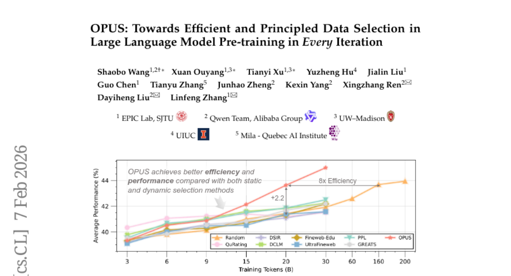
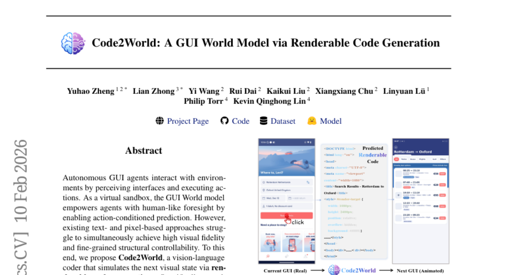
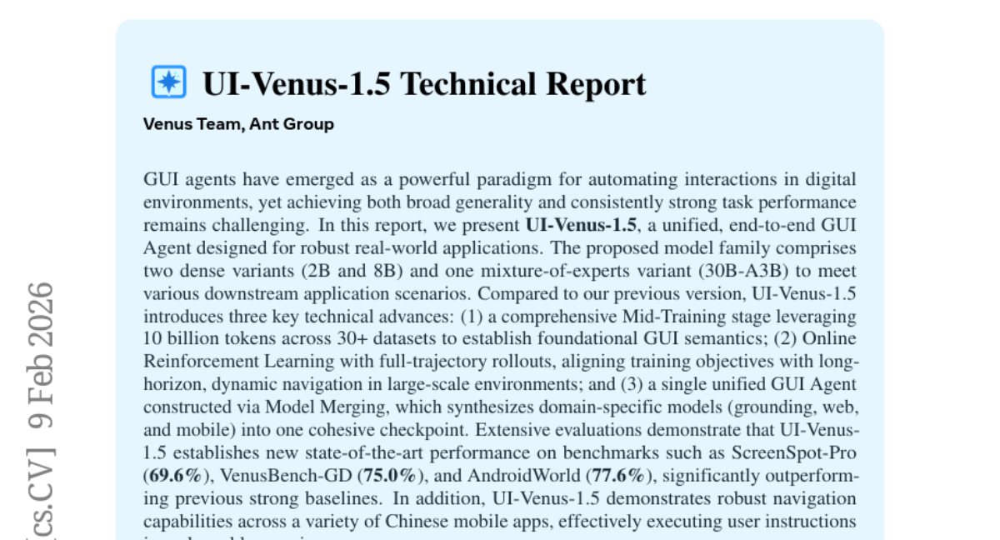
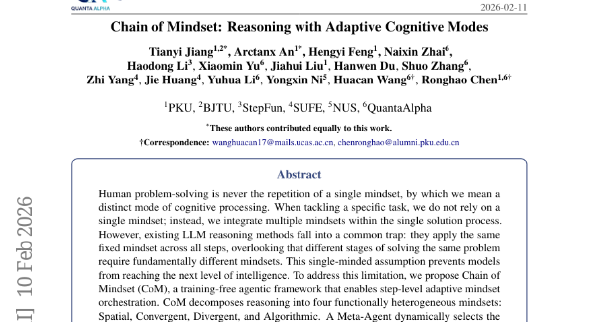
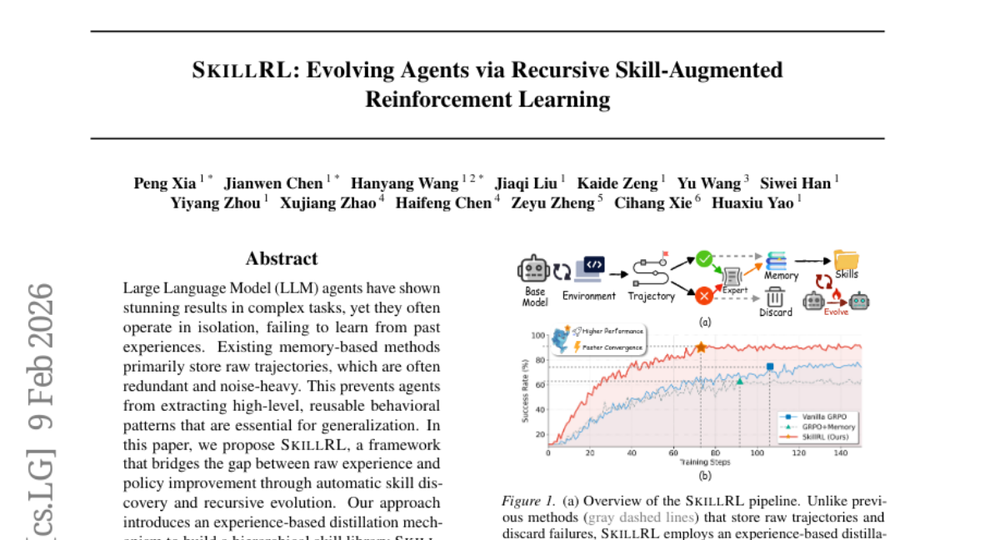
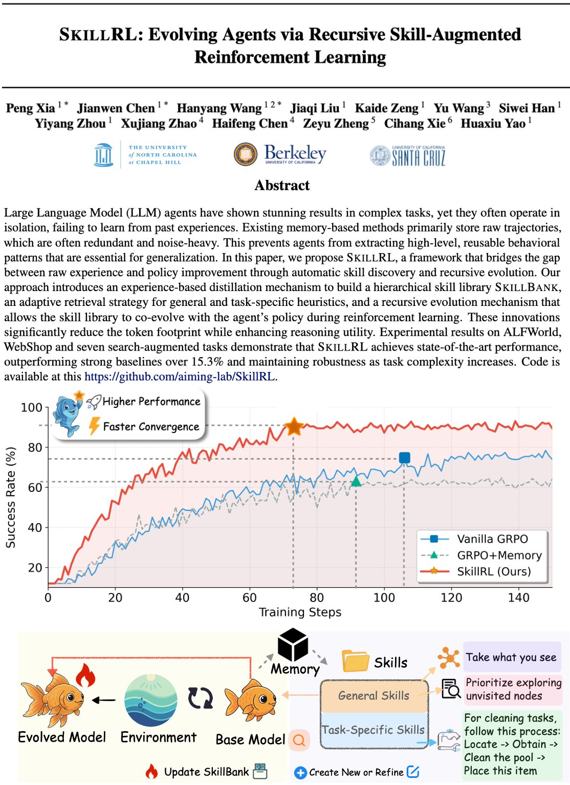

# 2026-02-11 Daily Papers (Top 5)

## 1. [OPUS: Towards Efficient and Principled Data Selection in Large Language Model Pre-training in Every Iteration](https://huggingface.co/papers/2602.05400)
**Upvotes**: 276

### 📌 요약
옵티마이저의 업데이트 방향성을 실시간으로 반영하는 동적 데이터 선택 기술 OPUS를 통해, 단 15%의 데이터만으로도 전체 학습을 뛰어넘는 압도적인 데이터 효율성을 달성했습니다.

### � 핵심 포인트
- 핵심 혁신: 원시 그래디언트(Raw Gradient)가 아닌, Adam과 같은 실제 옵티마이저에 의해 조정된 업데이트 방향을 기준으로 데이터 유용성을 측정하는 '옵티마이저 유도 투영(Optimizer-induced Projection)' 기법 도입
- 성능 지표: GPT-2 XL 학습 시 30B 토큰만으로 200B 토큰의 전체 학습 성능을 추월했으며, Qwen3-8B의 지속 학습(Continued Pre-training)에서는 3B 토큰 분량의 학습을 0.5B 토큰으로 대체하는 고효율 달성
- 활용 대상: 한정된 컴퓨팅 자원으로 고성능 LLM을 구축하려는 연구자나, 특정 도메인 데이터가 부족하여 최적의 데이터 혼합(Data Mix)을 찾아야 하는 데이터 엔지니어에게 권장

### 📝 초록 (번역)
최근 고품질 공개 데이터의 고갈로 인해 '데이터 벽(Data Wall)' 문제가 심각해지면서, 더 많은 데이터가 아닌 '더 좋은 데이터'를 선별하는 기술이 중요해졌습니다. 하지만 기존 방식은 학습 과정의 변화를 무시하는 정적 필터링을 쓰거나, 실제 옵티마이저의 동작을 고려하지 않는 한계가 있었습니다. 이를 해결하기 위해 본 논문은 옵티마이저가 실제로 가중치를 업데이트하는 공간에서 데이터의 유용성을 계산하는 OPUS 프레임워크를 제안합니다. OPUS는 타겟 데이터의 학습 방향에 가장 잘 부합하는 데이터 샘플을 매 반복(iteration)마다 동적으로 선택하며, Ghost technique과 CountSketch 기술을 적용해 연산 오버헤드를 4.7% 수준으로 낮췄습니다. 그 결과, GPT-2와 Qwen3 모델 학습에서 전체 데이터를 사용한 것보다 훨씬 적은 데이터로도 더 뛰어난 성능을 기록하며 학습 효율의 새로운 기준을 제시했습니다.

---

## 2. [Code2World: A GUI World Model via Renderable Code Generation](https://huggingface.co/papers/2602.09856)
**Upvotes**: 167

### 📌 요약
렌더링 가능한 코드 생성을 통해 GUI의 시각적 변화를 정밀하게 예측하는 세계 모델(World Model) 'Code2World'를 제안하여 자율형 에이전트의 조작 성공률을 획기적으로 높였습니다.

### � 핵심 포인트
- 시각적 상태를 렌더링 가능한 코드(HTML) 형태로 생성하여 GUI의 구조적 제어와 시각적 사실성을 동시에 잡은 새로운 세계 모델 아키텍처 제안
- 8B 규모의 모델로 GPT-5(가칭/최상위 모델) 및 Gemini-3 수준의 UI 예측 성능을 달성했으며, 기존 에이전트의 내비게이션 성공률을 유의미하게 개선
- GUI 자동화 에이전트를 개발하는 엔지니어나 가상 환경 시뮬레이션을 통해 에이전트를 학습시키려는 AI 연구자에게 최적화됨

### 📝 초록 (번역)
스마트폰이나 웹 같은 GUI 환경에서 스스로 동작하는 AI 에이전트에게는 자신의 행동 결과를 미리 예측하는 '세계 모델' 능력이 필수적입니다. 하지만 기존의 텍스트나 이미지 기반 방식은 화면의 세밀한 구조를 제어하기 어렵거나 시각적 품질이 낮다는 문제가 있었습니다. 연구진은 이를 해결하기 위해 다음 화면 상태를 렌더링 가능한 HTML 코드로 생성하는 'Code2World' 방식을 도입했습니다. 고품질의 AndroidCode 데이터셋을 구축하고, 렌더링된 실제 화면을 보상 신호로 사용하는 강화학습 기법을 적용해 시각적 사실성과 액션의 일관성을 동시에 확보했습니다. 그 결과, 8B 규모의 모델로도 최고 수준의 상용 모델들을 뛰어넘는 예측 성능을 보였으며, 실제 안드로이드 내비게이션 작업 성공률을 최대 9.5%p 향상시키는 성과를 거두었습니다.

---

## 3. [UI-Venus-1.5 Technical Report](https://huggingface.co/papers/2602.09082)
**Upvotes**: 143

### 📌 요약
100억 토큰 규모의 데이터 학습과 온라인 강화학습, 모델 머징 기법을 결합하여 웹과 모바일을 아우르는 세계 최고 수준의 범용 GUI 에이전트 UI-Venus-1.5를 선보였습니다.

### � 핵심 포인트
- 100억 토큰 규모의 대규모 학습, 온라인 강화학습, 그리고 다중 도메인(웹/모바일/그라운딩) 모델을 하나로 합치는 모델 머징 기술을 통한 기술적 혁신
- AndroidWorld(77.6%), ScreenSpot-Pro(69.6%) 등 주요 GUI 벤치마크에서 기존 모델을 뛰어넘는 압도적인 성능 지표 달성
- 실제 모바일 앱 및 웹 환경에서 복잡한 사용자 지시사항을 자율적으로 수행하는 고성능 GUI 자동화 에이전트를 구축하려는 개발자와 연구자

### 📝 초록 (번역)
디지털 환경의 자동화를 돕는 GUI 에이전트는 최근 많은 주목을 받고 있지만, 다양한 플랫폼에서 일관된 성능을 유지하며 복잡한 작업을 수행하는 데는 한계가 있었습니다. UI-Venus-1.5는 이러한 문제를 해결하기 위해 100억 토큰 이상의 대규모 GUI 데이터를 활용한 미드-트레이닝(Mid-Training) 단계를 도입하여 기초 체력을 다졌습니다. 여기에 긴 경로의 작업을 안정적으로 수행할 수 있도록 전체 궤적(full-trajectory) 기반의 온라인 강화학습을 적용하고, 모델 머징 기술을 통해 웹과 모바일 전문 모델을 하나로 통합했습니다. 그 결과, AndroidWorld와 ScreenSpot-Pro 등 주요 벤치마크에서 기존의 강력한 베이스라인들을 압도하며 새로운 SOTA(State-of-the-Art) 성능을 기록했습니다.

---

## 4. [Chain of Mindset: Reasoning with Adaptive Cognitive Modes](https://huggingface.co/papers/2602.10063)
**Upvotes**: 62

### 📌 요약
LLM이 문제 풀이의 각 단계마다 공간·수렴·발산·알고리즘 등 최적의 인지 모드를 스스로 선택해 전환하는 'Chain of Mindset' 프레임워크로 추론 성능을 SOTA 수준으로 끌어올렸습니다.

### � 핵심 포인트
- 별도의 모델 학습 없이도 단계별로 최적의 인지 모드(4가지 마인드셋)를 선택하여 실행하는 에이전트 기반 추론 프레임워크를 구현했습니다.
- Qwen3-VL-32B 및 Gemini-2.0-Flash 모델에서 기존 강력한 베이스라인 대비 각각 4.96%와 4.72%의 정확도 향상을 달성하며 6개 벤치마크에서 SOTA를 기록했습니다.
- 복잡한 수학적 증명, 코드 생성, 과학적 질의응답 등 다각도의 사고가 필요한 고급 추론 시스템을 개발하려는 엔지니어와 연구자에게 매우 유용합니다.

### 📝 초록 (번역)
인간은 복잡한 문제를 해결할 때 상황에 맞춰 사고 방식을 유연하게 바꾸지만, 기존의 LLM 추론 방식은 모든 단계에서 하나의 고정된 사고 방식만을 고수한다는 한계가 있었습니다. 본 논문은 이러한 '단일 사고의 함정'을 해결하기 위해, 추론 과정을 공간적(Spatial), 수렴적(Convergent), 발산적(Divergent), 알고리즘적(Algorithmic)이라는 네 가지 핵심 마인드셋으로 세분화한 'Chain of Mindset(CoM)' 프레임워크를 제안합니다. CoM은 메타 에이전트가 현재 단계에 가장 적합한 마인드셋을 동적으로 선택하고, 컨텍스트 게이트를 통해 불필요한 정보 흐름을 제어합니다. 그 결과, 별도의 추가 학습 없이도 Qwen3-VL과 Gemini-2.0 등 최신 모델에서 기존 대비 약 5%에 가까운 성능 향상을 기록하며 수학, 코딩, 과학적 추론 분야에서 압도적인 효율성과 정확도를 증명했습니다.

---

## 5. [SkillRL: Evolving Agents via Recursive Skill-Augmented Reinforcement Learning](https://huggingface.co/papers/2602.08234)
**Upvotes**: 55

### 📌 요약
LLM 에이전트가 경험을 통해 고차원의 스킬을 스스로 추출하고 강화학습을 통해 정책과 스킬을 동시에 진화시키는 SkillRL 프레임워크를 통해 성능을 15.3% 이상 향상시켰습니다.

### � 핵심 포인트
- 핵심 혁신: 가공되지 않은 경험 데이터를 재사용 가능한 고차원 스킬로 변환하는 '경험 기반 증류'와, 강화학습 과정에서 스킬 라이브러리가 정책과 함께 스스로 최적화되는 '재귀적 진화' 구조를 구현했습니다.
- 성능 지표: ALFWorld, WebShop 등 다양한 환경에서 기존의 강력한 베이스라인들보다 15.3% 높은 성능을 기록했으며, 효율적인 스킬 추출을 통해 토큰 사용량을 대폭 절감하면서도 추론의 정확도를 높였습니다.
- 활용 대상: 장기적인 의사결정이 필요한 자율형 LLM 에이전트를 구축하려는 개발자와 경험 데이터를 지식화하여 에이전트의 일반화 능력을 극대화하려는 AI 연구자들에게 필수적인 프레임워크입니다.

### 📝 초록 (번역)
최근 LLM 에이전트는 복잡한 작업에서 뛰어난 성과를 보이고 있지만, 과거의 경험으로부터 학습하지 못하고 일회성 수행에 그치는 경우가 많습니다. 기존의 메모리 기반 방식들은 가공되지 않은 실행 기록을 그대로 저장하기 때문에 데이터에 노이즈가 많고 토큰 소모가 크며, 일반화된 행동 패턴을 추출하기 어렵다는 한계가 있었습니다. 이를 해결하기 위해 본 논문은 'SkillRL' 프레임워크를 제안합니다. SkillRL은 과거 경험에서 핵심 스킬을 증류하여 계층적 스킬 저장소(SkillBank)를 구축하고, 강화학습 과정에서 에이전트의 정책과 스킬 라이브러리가 함께 성장하는 재귀적 진화 메커니즘을 도입했습니다. 그 결과, ALFWorld 및 WebShop 등 주요 벤치마크에서 기존 모델 대비 15.3% 이상의 성능 향상을 달성했으며, 작업의 복잡도가 높아질수록 더욱 강력한 성능과 효율성을 입증했습니다.

### 🖼️ 추가 자료

---

