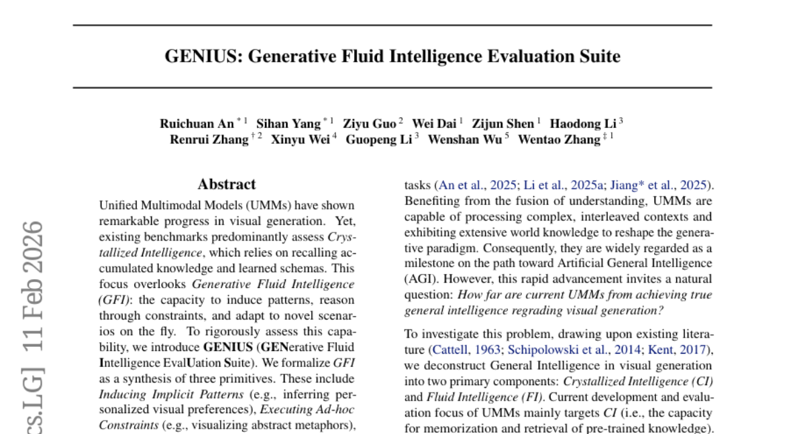
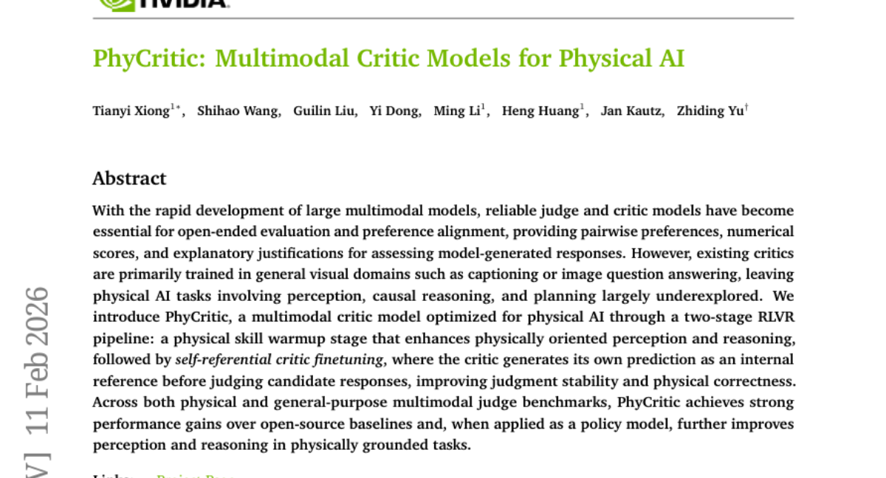
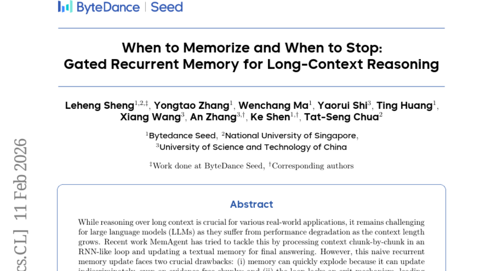

# 2026-02-12 Daily Papers (Top 5)

## 1. [Step 3.5 Flash: Open Frontier-Level Intelligence with 11B Active Parameters](https://huggingface.co/papers/2602.10604)
**Upvotes**: 146

### 📌 요약
11B 활성 파라미터만으로 GPT-5급 지능을 구현한 Step 3.5 Flash는 고성능 에이전트의 대중화와 산업적 배포를 위한 새로운 효율성 기준을 제시합니다.

### � 핵심 포인트
- 196B 파라미터 기반 MoE 구조에 3:1 슬라이딩 윈도우 어텐션과 MTP-3를 결합하여, 높은 지능을 유지하면서 추론 지연 시간과 비용을 획기적으로 낮췄습니다.
- LiveCodeBench(86.4%), IMO-AnswerBench(85.4%), tau2-Bench(88.2%) 등 주요 벤치마크에서 GPT-5.2 xHigh 및 Gemini 3.0 Pro와 대등한 수준의 성능을 입증했습니다.
- 낮은 비용으로 고성능 AI 에이전트, 복잡한 코딩 도구, 수학적 추론 시스템을 실제 산업 현장에 대규모로 배포하려는 개발자와 기업에게 최적의 선택지입니다.

### 📝 초록 (번역)
AI 에이전트가 실제 산업 현장에서 복잡한 작업을 수행하려면 높은 지능과 빠른 응답 속도가 필수적이지만, 기존의 거대 모델들은 비용과 지연 시간 문제로 배포에 한계가 있었습니다. 이를 해결하기 위해 Step 3.5 Flash는 1,960억 개의 전체 파라미터 중 단 110억 개만 활성화하는 희소 혼합 전문가(MoE) 구조와 Multi-Token Prediction(MTP-3) 기법을 도입하여 연산 효율을 극대화했습니다. 또한 수학과 코딩 분야에서 일관된 성능 향상을 위해 검증 가능한 신호와 선호도 피드백을 결합한 대규모 강화학습 프레임워크를 적용했습니다. 그 결과, 본 모델은 수학(85.4%) 및 코딩(86.4%) 벤치마크에서 GPT-5.2 xHigh와 같은 최상위 모델에 육박하는 성능을 보이면서도 압도적인 추론 속도를 확보했습니다.

---

## 2. [GENIUS: Generative Fluid Intelligence Evaluation Suite](https://huggingface.co/papers/2602.11144)
**Upvotes**: 40

### 📌 요약
지식 암기를 넘어 실시간 패턴 추론과 제약 조건 해결 능력을 평가하는 '생성형 유동적 지능(GFI)' 벤치마크 GENIUS를 통해 멀티모달 모델의 차세대 발전 방향을 제시했습니다.

### � 핵심 포인트
- 지식 회상이 아닌 실시간 추론과 적응력을 측정하는 '생성형 유동적 지능(GFI)' 개념을 정립하고 이를 위한 최초의 멀티모달 벤치마크 설계
- 최신 12개 모델 평가 결과, 모델의 실패 원인이 이미지 생성 기술의 부족이 아니라 주어진 문맥과 제약 조건을 논리적으로 이해하지 못하는 데 있음을 진단
- 추가 학습 없이도 모델의 문맥 이해도를 높여 복합적인 생성 과제를 수행할 수 있게 돕는 어텐션 간섭(Attention Intervention) 전략 제시

### 📝 초록 (번역)
최근 멀티모달 모델(UMM)은 이미지 생성 분야에서 눈부신 발전을 이루었지만, 기존 평가는 주로 모델이 학습 과정에서 습득한 지식을 얼마나 잘 기억하는지(결정적 지능)에 치우쳐 있었습니다. 하지만 진정한 인공지능으로 나아가기 위해서는 낯선 상황에서 패턴을 찾아내고 복잡한 제약 조건을 실시간으로 해결하는 '유동적 지능(Fluid Intelligence)'이 필수적입니다. 본 논문에서는 이를 측정하기 위해 GENIUS라는 새로운 평가 프레임워크를 제안합니다. GENIUS는 암시적 패턴 유도, 추상적 비유 시각화, 반직관적 물리 법칙 적응이라는 세 가지 핵심 요소를 통해 모델의 적응력을 정밀하게 검증합니다. 12개의 주요 모델을 실험한 결과, 생성 능력 자체보다는 문맥을 이해하는 단계에서 큰 한계가 있음이 드러났으며, 이를 해결하기 위한 '학습이 필요 없는 어텐션 개입 전략'을 통해 성능 개선의 실마리를 제공했습니다.

---

## 3. [PhyCritic: Multimodal Critic Models for Physical AI](https://huggingface.co/papers/2602.11124)
**Upvotes**: 40

### 📌 요약
물리적 법칙에 대한 지각과 추론 능력을 극대화하기 위해 '자가 참조형 비평' 기법을 도입하여, 물리적 AI 작업의 평가와 성능을 동시에 끌어올린 멀티모달 비평 모델 PhyCritic을 제안했습니다.

### � 핵심 포인트
- 물리적 지각 능력을 높이는 워밍업과 비평 일관성을 확보하는 '자가 참조형(Self-referential)' 2단계 학습 파이프라인 구축
- 물리적 AI 전용 벤치마크와 일반 멀티모달 평가에서 기존 오픈소스 베이스라인을 뛰어넘는 강력한 성능 입증
- 로봇 제어, 물리 기반 계획 수립 시스템을 개발하거나 고도화된 멀티모달 평가 도구가 필요한 개발자 및 연구자

### 📝 초록 (번역)
최근 대규모 멀티모달 모델의 발전에 따라 답변의 품질을 판단하고 정렬하는 '비평(Critic) 모델'이 중요해졌지만, 기존 모델들은 일반적인 시각 정보 처리에 치중되어 물리적 지각이나 인과 추론, 계획 수립 능력이 부족하다는 한계가 있었습니다. 연구팀은 이를 해결하기 위해 'PhyCritic'을 개발했습니다. 먼저 물리적 기술 워밍업 단계를 통해 기초적인 물리 지각 능력을 강화한 뒤, 비평가가 후보 답변을 판단하기 전 스스로 정답을 먼저 예측해보는 '자가 참조형 미세조정(Self-referential finetuning)'을 적용하여 판단의 안정성과 정확성을 높였습니다. 그 결과, PhyCritic은 물리 및 일반 멀티모달 벤치마크 모두에서 기존 오픈소스 모델들을 압도하는 성능을 보였으며, 실제 정책 모델로 적용했을 때도 물리적 작업 수행 능력이 크게 향상되었습니다.

---

## 4. [ASA: Training-Free Representation Engineering for Tool-Calling Agents](https://huggingface.co/papers/2602.04935)
**Upvotes**: 38

### 📌 요약
모델 가중치 업데이트 없이 중간 레이어의 활성화를 제어하여 '게으른 에이전트' 문제를 해결하고 도구 호출(Tool-calling) 성능을 2.7배 이상 향상시킨 ASA 프레임워크를 제안했습니다.

### � 핵심 포인트
- 별도의 모델 학습이나 가중치 업데이트 없이, 단 20KB 수준의 가벼운 자산만으로 추론 단계에서 도구 호출 의도를 정밀하게 제어하는 활성화 스티어링 기술을 제안함
- MTU-Bench 기준 도구 호출 F1 점수를 0.18에서 0.50으로 약 177% 향상시켰으며, 불필요한 도구 호출(False Positive) 확률을 15%에서 5%로 크게 낮춤
- 추가 학습 비용이 부담스럽거나 기존 모델의 일반적인 추론 능력을 유지하면서도 도구 호출의 정확도와 신뢰성만 선택적으로 높이고 싶은 에이전트 개발자 및 연구자

### 📝 초록 (번역)
최근 LLM 에이전트의 도구 호출 능력은 필수적이지만, 프롬프트 엔지니어링은 환경 변화에 취약하고 미세 조정(Fine-tuning)은 높은 유지 비용과 지식 망각 문제를 야기합니다. 연구진은 모델이 내부적으로는 도구의 필요성을 인지하면서도 실제 출력에서는 이를 거부하는 '게으른 에이전트(Lazy Agent)' 현상을 발견했습니다. 이를 해결하기 위해 추론 시점에 중간 레이어의 활성화를 정밀하게 조절하는 ASA(Activation Steering Adapter)를 개발했습니다. ASA는 라우터 기반의 스티어링 벡터와 프로브 가이드 게이트를 결합해 도구 호출 의도는 증폭하고 오작동은 억제합니다. 그 결과 Qwen2.5-1.5B 모델에서 도구 사용 F1 점수를 0.18에서 0.50으로 대폭 높였으며, 오작동률은 1/3로 낮추는 성과를 거두었습니다.

---

## 5. [When to Memorize and When to Stop: Gated Recurrent Memory for Long-Context Reasoning](https://huggingface.co/papers/2602.10560)
**Upvotes**: 21

### 📌 요약
불필요한 정보는 거르고 정답을 찾으면 즉시 종료하는 '게이트 메커니즘'을 도입하여, 기존 대비 최대 4배 빠른 속도로 정확한 롱컨텍스트 추론을 수행하는 GRU-Mem을 제안합니다.

### � 핵심 포인트
- 업데이트 및 종료 게이트라는 두 가지 텍스트 제어 메커니즘을 도입하여 메모리 폭주 방지 및 연산 효율성 확보
- 강화학습 기반의 보상 신호(r^update, r^exit)를 활용해 모델이 스스로 정보를 기록할 시점과 추론을 끝낼 시점을 학습함
- 방대한 양의 문서를 분석해야 하는 Q&A 시스템이나 긴 컨텍스트 기반의 복합 추론이 필요한 AI 서비스 개발자

### 📝 초록 (번역)
대규모 언어 모델(LLM)은 문맥이 길어질수록 성능이 떨어지는 문제를 겪습니다. 이를 해결하기 위해 최근에는 정보를 메모리에 기록하며 읽어 나가는 방식이 제안되었지만, 무의미한 정보까지 모두 저장해 메모리가 비대해지거나 정답을 찾은 후에도 불필요한 연산을 계속하는 한계가 있었습니다. 본 논문은 이를 해결하기 위해 업데이트 게이트(Update Gate)와 종료 게이트(Exit Gate)를 도입한 'GRU-Mem'을 제안합니다. 강화학습(RL)을 통해 꼭 필요한 정보만 메모리에 기록하고, 충분한 근거가 확보되면 즉시 추론을 멈추도록 설계되었습니다. 그 결과, GRU-Mem은 기존 방식보다 훨씬 정확하면서도 추론 속도를 최대 400%까지 끌어올리는 성과를 거두었습니다.

---

