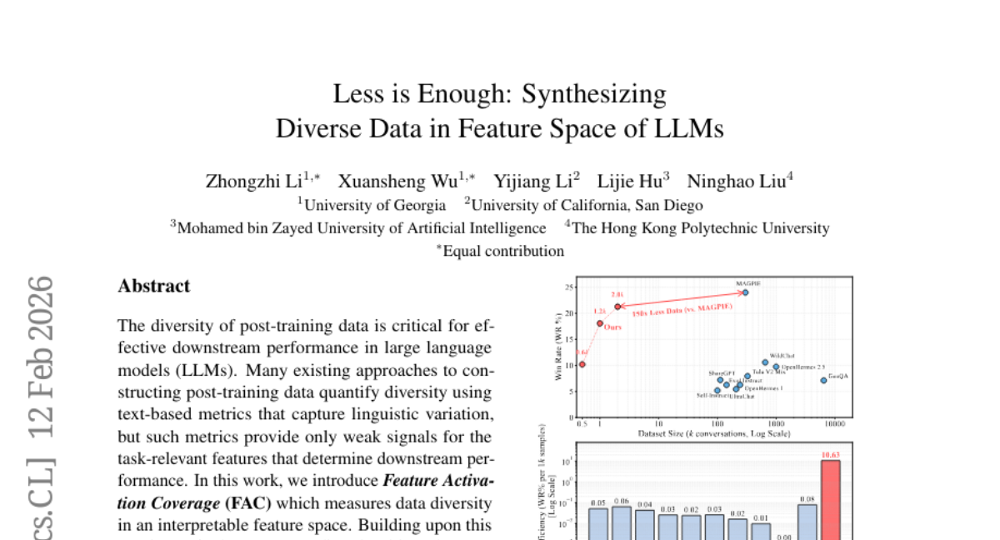
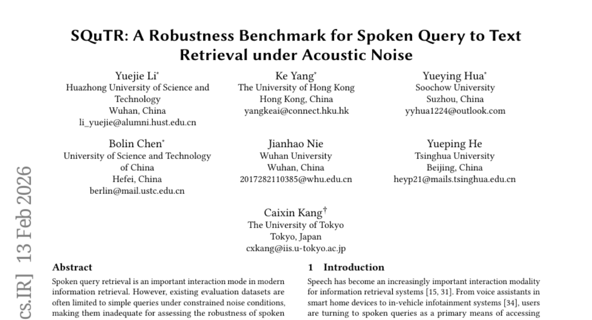
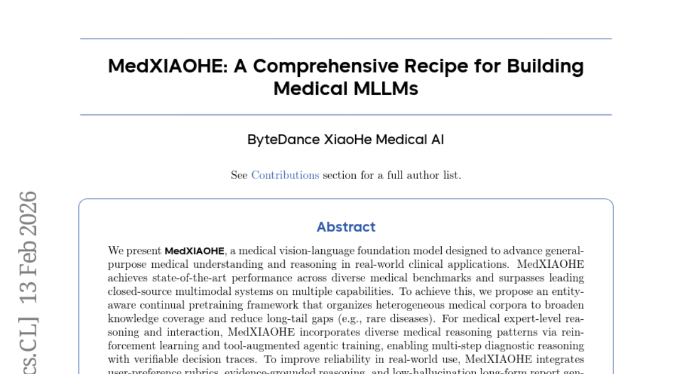
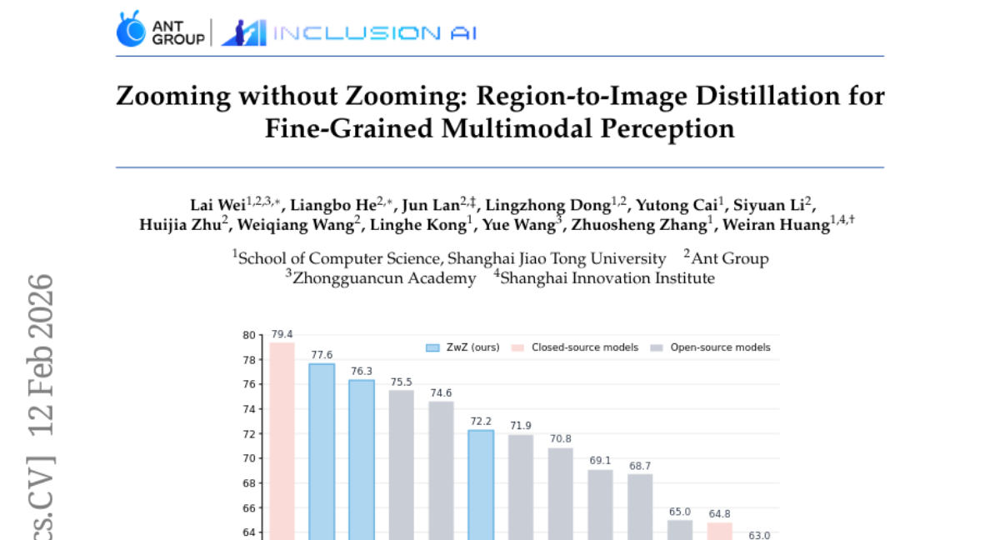
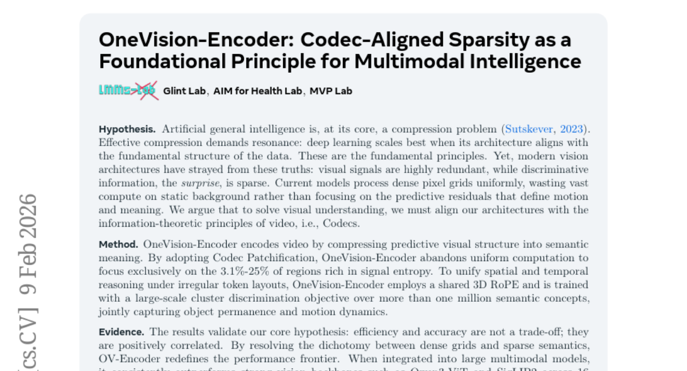

# 2026-02-16 Daily Papers (Top 5)

## 1. [Less is Enough: Synthesizing Diverse Data in Feature Space of LLMs](https://huggingface.co/papers/2602.10388)
**Upvotes**: 202 | **도입 난이도**: 중 | **신뢰도**: 상
**arXiv**: https://arxiv.org/abs/2602.10388

**태그**: Fine-tuning, Data Augmentation, LLM, Interpretability, RAG

### 📌 한 줄 요약
LLM의 downstream 성능 향상을 위해, sparse autoencoder 기반의 feature activation coverage(FAC)라는 새로운 데이터 다양성 측정 지표와 데이터 합성 프레임워크를 제안하고, 이를 통해 적은 데이터로도 성능 향상을 이끌어냄.

### 🔑 핵심 포인트
- Feature Activation Coverage (FAC)라는 새로운 데이터 다양성 측정 지표 제시
- Sparse autoencoder 기반의 다양성 기반 데이터 합성 프레임워크 (FAC Synthesis) 제안
- 다양한 LLM 모델 간에 공유 가능한 feature space 존재 확인

### 🧑‍💻 개발자 관점
LLM fine-tuning 시 데이터셋 구축 비용을 줄이고, 적은 데이터로도 모델 성능을 향상시킬 수 있는 가능성을 제시하며, 모델 간 knowledge transfer 전략 수립에 활용 가능합니다.

### 🚀 실무 적용 아이디어
- FAC metric을 활용하여 현재 fine-tuning 데이터셋의 다양성 분석
- Sparse autoencoder를 사용하여 데이터셋의 부족한 feature 파악 및 보완
- FAC Synthesis 프레임워크를 활용하여 synthetic 데이터 생성 및 fine-tuning 적용

### ⚠️ 리스크/한계
- Sparse autoencoder 학습 및 interpretable feature space 정의의 어려움
- Synthetic 데이터의 현실성 및 일반화 성능에 대한 추가 검증 필요

### 📝 초록 기반 상세 설명
LLM의 downstream 성능은 post-training 데이터의 다양성에 크게 의존하지만, 기존의 텍스트 기반 다양성 측정 방식은 task-relevant feature를 제대로 반영하지 못한다는 문제가 있습니다. 본 연구에서는 interpretable feature space에서 데이터 다양성을 측정하는 Feature Activation Coverage(FAC)라는 새로운 지표를 제시합니다. 이를 기반으로 sparse autoencoder를 사용하여 seed 데이터에서 부족한 feature를 식별하고, 이를 반영한 synthetic 데이터를 생성하는 FAC Synthesis 프레임워크를 제안합니다. 실험 결과, 제안하는 방식이 데이터 다양성과 instruction following, toxicity detection 등 다양한 downstream task 성능을 향상시키는 것을 확인했으며, 서로 다른 모델(LLaMA, Mistral, Qwen) 간에 공유 가능한 feature space가 존재함을 밝혔습니다.

---

## 2. [SQuTR: A Robustness Benchmark for Spoken Query to Text Retrieval under Acoustic Noise](https://huggingface.co/papers/2602.12783)
**Upvotes**: 134 | **도입 난이도**: 중 | **신뢰도**: 상
**arXiv**: https://arxiv.org/abs/2602.12783

**태그**: Speech Recognition, Information Retrieval, Benchmark, Robustness, Noise, RAG, Evaluation

### 📌 한 줄 요약
SQuTR 벤치마크는 음성 질의-텍스트 검색 시스템의 노이즈 환경에서의 성능 저하를 진단하고 개선하는데 유용하며, 실제 사용자 환경에서의 검색 성능 향상에 기여할 수 있습니다.

### 🔑 핵심 포인트
- 실제 환경 노이즈를 반영한 대규모 음성 질의-텍스트 검색 Robustness 벤치마크 SQuTR 제시
- 다양한 음성 프로필 및 노이즈 환경을 결합하여 재현 가능한 평가 환경 구축
- 기존 시스템의 Robustness 취약점을 분석하고 향후 연구 방향 제시

### 🧑‍💻 개발자 관점
실제 서비스 환경에서 발생하는 다양한 노이즈 조건에서 음성 검색 시스템의 성능을 평가하고 개선하는 데 직접적으로 활용할 수 있으며, 사용자 경험 향상에 기여할 수 있습니다.

### 🚀 실무 적용 아이디어
- SQuTR 데이터셋을 활용하여 기존 음성 검색 시스템의 노이즈 Robustness 평가
- SQuTR 벤치마크를 기반으로 노이즈 제거 또는 음성 향상 기술 적용 후 성능 개선 효과 확인
- 새로운 음성 검색 모델 개발 시 SQuTR 데이터셋을 활용하여 Robustness를 평가하고 개선하는 과정에 적용

### ⚠️ 리스크/한계
- 합성 음성 데이터가 실제 음성 데이터와 차이가 있을 수 있으며, 일부 특수한 노이즈 환경은 반영되지 않았을 수 있음
- SQuTR 벤치마크는 특정 언어(영어, 중국어) 및 도메인에 편향되어 있을 수 있음

### 📝 초록 기반 상세 설명
최근 음성 질의 검색은 중요해지고 있지만, 기존 데이터셋은 단순 질의 및 제한적인 노이즈 환경에 국한되어 실제 복잡한 환경에서의 시스템 Robustness 평가에 어려움이 있었습니다. 이러한 문제점을 해결하기 위해 다양한 도메인과 질의 유형을 포괄하는 대규모 음성 질의-텍스트 검색 Robustness 벤치마크인 SQuTR을 제안합니다. SQuTR은 200명의 실제 화자 음성과 17가지 실제 환경 노이즈를 활용하여 다양한 SNR 조건에서 재현 가능한 평가를 지원합니다. 실험 결과, 노이즈가 증가함에 따라 검색 성능이 저하되었으며, 특히 extreme noise 환경에서는 대규모 모델도 어려움을 겪어 Robustness가 여전히 중요한 문제임을 확인했습니다. SQuTR은 벤치마킹 및 진단 분석을 위한 재현 가능한 테스트베드를 제공하여 음성 질의-텍스트 검색 Robustness 연구를 촉진할 것입니다.

---

## 3. [MedXIAOHE: A Comprehensive Recipe for Building Medical MLLMs](https://huggingface.co/papers/2602.12705)
**Upvotes**: 56 | **도입 난이도**: 중 | **신뢰도**: 상
**arXiv**: https://arxiv.org/abs/2602.12705

**태그**: MLLM, Medical AI, Reasoning, Reinforcement Learning, Pretraining, Agent, RAG, Multimodal, Vision, Benchmark, Evaluation

### 📌 한 줄 요약
MedXIAOHE는 의료 분야의 시각-언어 모델로, 다양한 의료 벤치마크에서 최고 성능을 달성하고 폐쇄형 시스템을 능가하며, 지식 확장, 추론 능력 향상, 신뢰성 개선을 통해 실제 임상 적용 가능성을 높였습니다.

### 🔑 핵심 포인트
- Entity-aware continual pretraining을 통한 지식 커버리지 확장
- 강화 학습 및 Tool-augmented agentic training을 통한 의료 추론 능력 향상
- 사용자 선호도, 증거 기반 추론, 낮은 환각의 긴 보고서 생성을 통한 신뢰성 개선

### 🧑‍💻 개발자 관점
의료 분야에 특화된 MLLM을 구축하기 위한 레시피와 같은 역할을 하며, 특히 지식 확장, 추론 능력 향상, 신뢰성 개선에 대한 구체적인 방법을 제시하여 실제 의료 서비스 개발에 참고할 만합니다.

### 🚀 실무 적용 아이디어
- Entity-aware continual pretraining을 자사의 의료 데이터에 적용해보기
- 강화 학습 기반의 추론 엔진을 구축하고 의료 데이터에 적용하여 성능 향상 시도
- 사용자 피드백을 반영하는 보고서 생성 메커니즘 구현

### ⚠️ 리스크/한계
- 실제 임상 환경에서의 성능 검증 필요
- 모델의 해석 가능성과 설명 가능성 확보가 중요

### 📝 초록 기반 상세 설명
최근 의료 분야에서 시각-언어 모델의 중요성이 커지고 있지만, 지식 부족, 추론 능력 제한, 신뢰성 문제 등이 존재합니다. MedXIAOHE는 entity-aware continual pretraining을 통해 다양한 의료 지식을 학습하고, 강화 학습 및 도구 활용 에이전트 학습을 통해 의료 추론 능력을 향상시켰습니다. 또한 사용자 선호도, 증거 기반 추론, 낮은 환각의 긴 보고서 생성 등을 통해 신뢰성을 개선했습니다. MedXIAOHE는 다양한 의료 벤치마크에서 최고 성능을 달성하고, 폐쇄형 시스템을 능가하는 결과를 보여주었습니다. 이 연구는 실제 설계 선택, 스케일링 인사이트, 평가 프레임워크를 제공하여 후속 연구에 기여할 것입니다.

---

## 4. [Zooming without Zooming: Region-to-Image Distillation for Fine-Grained Multimodal Perception](https://huggingface.co/papers/2602.11858)
**Upvotes**: 50 | **도입 난이도**: 중 | **신뢰도**: 상
**arXiv**: https://arxiv.org/abs/2602.11858

**태그**: Agent, Vision, Distillation, Fine-grained perception, MLLM, Reasoning, Multimodal, Benchmark, Evaluation, Inference

### 📌 한 줄 요약
MLLM의 fine-grained 인식 능력을 향상시키기 위해, inference 시점에 zooming하는 대신 학습 시점에 region-grounded supervision을 통해 single-glance 인식 능력을 향상시키는 Region-to-Image Distillation 방법론을 제안하며, fine-grained perception benchmark에서 우수한 성능을 보임.

### 🔑 핵심 포인트
- Region-to-Image Distillation: inference 시점 zooming을 training 시점으로 옮겨 single-glance fine-grained perception 능력 향상
- ZoomBench: fine-grained perception 능력을 평가하기 위한 새로운 hybrid-annotated VQA benchmark 제시
- Fine-grained perception 및 일반 multimodal cognition benchmark에서 SOTA 성능 달성

### 🧑‍💻 개발자 관점
기존 MLLM의 미세한 인식 능력 부족 문제를 해결하고 inference latency를 줄여 실제 서비스 적용 가능성을 높임. 특히 작은 객체나 디테일이 중요한 서비스(의료, 제조 등)에서 유용할 수 있다.

### 🚀 실무 적용 아이디어
- 제공된 Github 레포지토리의 코드를 살펴보고, 기존 모델에 적용 가능성 검토
- ZoomBench 데이터셋을 활용하여 모델의 fine-grained perception 성능 평가
- 자체 데이터셋에 Region-to-Image Distillation 방법론 적용 및 성능 비교

### ⚠️ 리스크/한계
- Teacher 모델의 성능에 크게 의존적이며, teacher 모델의 bias가 student 모델에 전이될 수 있음
- ZoomBench 데이터셋의 특성상 특정 fine-grained perception task에만 효과적일 수 있으며, 일반적인 fine-grained perception에 대한 일반화 성능은 불확실함

### 📝 초록 기반 상세 설명
최근 multimodal large language models (MLLMs)는 넓은 시각적 이해 능력을 보여주지만, 미세한 인식(fine-grained perception)에서는 여전히 어려움을 겪고 있습니다. 기존의 'Thinking-with-Images' 방법들은 추론 과정에서 관심 영역을 반복적으로 확대/축소하여 이 문제를 해결하려 하지만, 잦은 툴 호출과 시각 정보 재인코딩으로 인해 latency가 높습니다. 이를 해결하기 위해, 본 논문에서는 zooming을 inference time의 툴이 아닌 training time의 기본 요소로 변환하여 agentic zooming의 이점을 MLLM의 single forward pass에 내재화하는 Region-to-Image Distillation을 제안합니다. 구체적으로, 먼저 micro-cropped 영역을 확대하여 강력한 teacher 모델이 고품질 VQA 데이터를 생성하도록 하고, 이 region-grounded supervision을 전체 이미지에 다시 distillation합니다. 이러한 데이터로 학습된 작은 student 모델은 툴 사용 없이도 'single-glance' fine-grained perception을 향상시킵니다. 또한, 이 능력을 엄격하게 평가하기 위해, 6개의 fine-grained perceptual dimension에 걸쳐 845개의 VQA 데이터로 구성된 hybrid-annotated benchmark인 ZoomBench를 제시하고, global-regional 'zooming gap'을 정량화하는 dual-view 프로토콜을 제공합니다. 실험 결과, 제안하는 모델은 여러 fine-grained perception benchmark에서 최고의 성능을 달성했으며, visual reasoning 및 GUI agents와 같은 일반적인 multimodal cognition benchmark에서도 성능이 향상되었습니다.

---

## 5. [OneVision-Encoder: Codec-Aligned Sparsity as a Foundational Principle for Multimodal Intelligence](https://huggingface.co/papers/2602.08683)
**Upvotes**: 39 | **도입 난이도**: 중 | **신뢰도**: 중
**arXiv**: https://arxiv.org/abs/2602.08683

**태그**: Vision, Compression, Codec, Efficiency, Sparsity, RAG, Reasoning, Multimodal, Video, Benchmark, Optimization

### 📌 한 줄 요약
동영상 코덱의 정보 이론적 원리를 활용하여 시각 정보를 효율적으로 압축하고 이해하는 새로운 비전 인코더 아키텍처(OneVision-Encoder)를 제안, 기존 모델 대비 성능 향상 및 효율성 증가를 달성함.

### 🔑 핵심 포인트
- 동영상 코덱 원리를 활용한 새로운 비전 인코더 아키텍처 (OneVision-Encoder) 제안
- 코덱 패치화를 통해 정보량이 많은 영역에 집중, 연산 효율성 극대화
- 기존 모델 대비 적은 연산량과 데이터로 더 나은 성능 달성

### 🧑‍💻 개발자 관점
실제 서비스에서 비디오/이미지 이해 모델의 효율성을 개선하고 싶을 때, OneVision-Encoder의 코덱 기반 희소성 접근 방식을 활용하여 모델의 연산 비용을 줄이면서도 성능을 유지하거나 향상시킬 수 있다.

### 🚀 실무 적용 아이디어
- OneVision-Encoder의 코덱 패치화 방식을 기존 모델에 적용하여 성능 및 효율성 변화 관찰
- 자체 데이터셋에 OneVision-Encoder를 파인튜닝하여 특정 도메인에서의 성능 테스트
- OneVision-Encoder를 LLM과 통합하여 멀티모달 태스크에서의 성능 비교

### ⚠️ 리스크/한계
- 코덱 기반 희소성 방식이 특정 유형의 비디오/이미지에만 효과적일 수 있음
- OneVision-Encoder의 구현 복잡도가 높을 수 있으며, 추가적인 엔지니어링 노력이 필요할 수 있음

### 📝 초록 기반 상세 설명
최근 비전 모델은 시각적 정보의 중복성을 제대로 활용하지 못하고 불필요한 연산을 수행하는 경향이 있다. 본 논문에서는 인공지능의 핵심이 압축이라는 가정 하에, 동영상 코덱의 원리를 활용하여 시각 정보의 중요한 부분에 집중하는 OneVision-Encoder를 제안한다. 제안하는 방법은 코덱 패치화를 통해 신호 엔트로피가 높은 영역에 집중하고, 3D RoPE와 대규모 클러스터 판별 목표를 통해 공간적, 시간적 추론을 통합한다. 실험 결과, OneVision-Encoder는 기존의 강력한 비전 백본(Qwen3-ViT, SigLIP2)보다 적은 연산량과 데이터로도 이미지, 비디오, 문서 이해 벤치마크에서 더 나은 성능을 보였으며, 특히 비디오 이해 작업에서 평균 4.1% 향상을 보였다. 이는 코덱 기반의 희소성이 차세대 시각 모델의 핵심 원리가 될 수 있음을 시사한다.

---

