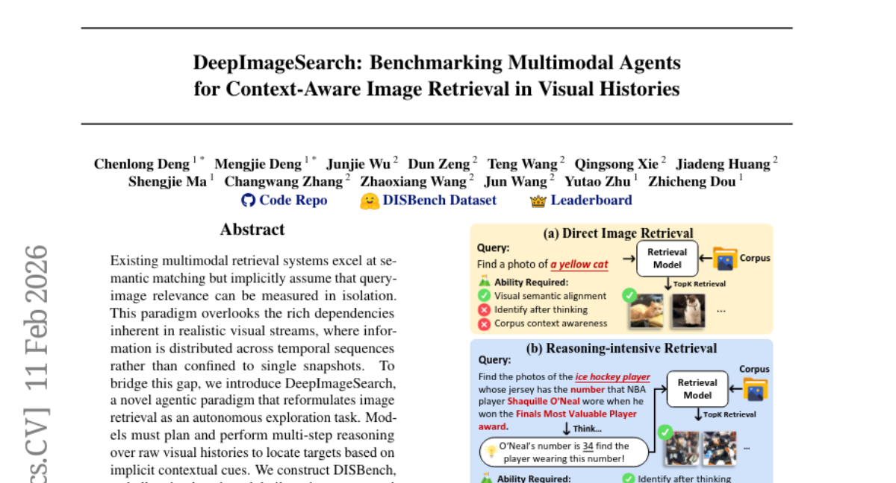
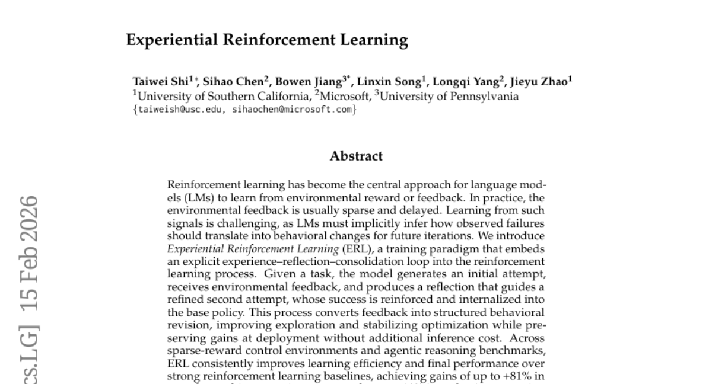
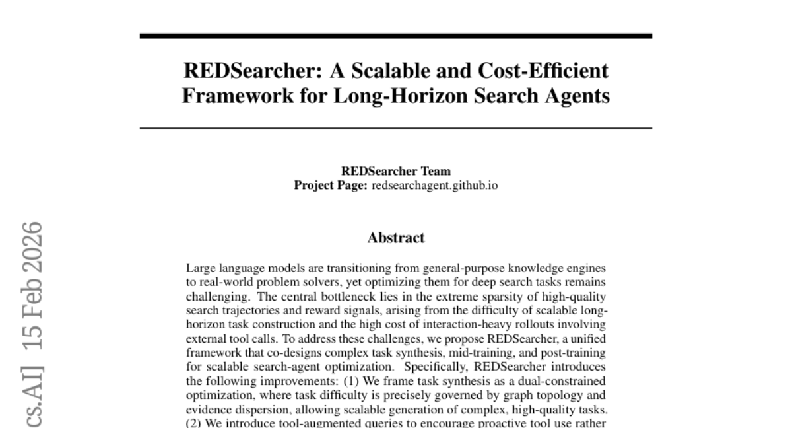
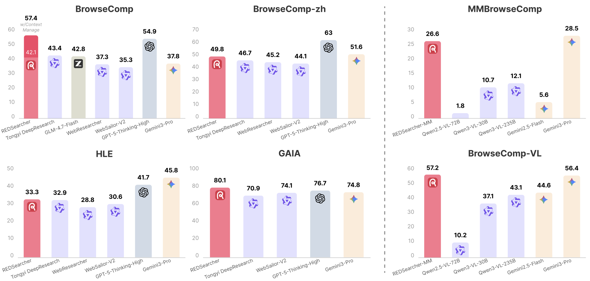
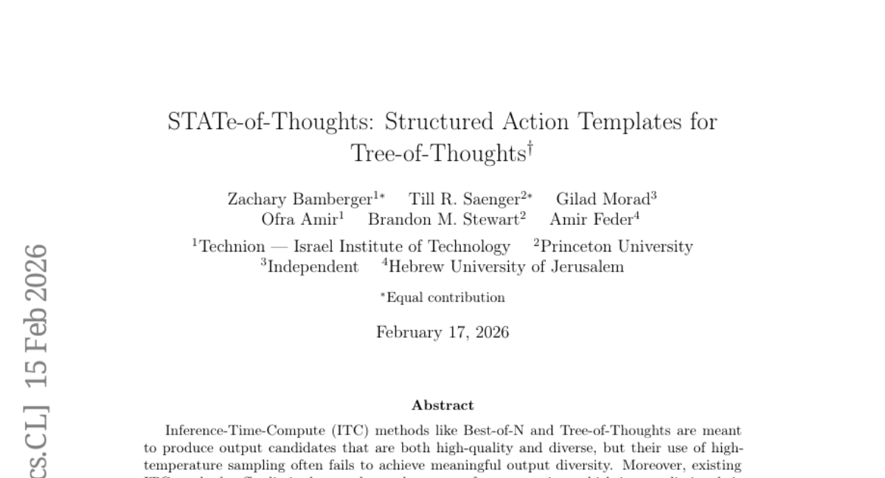
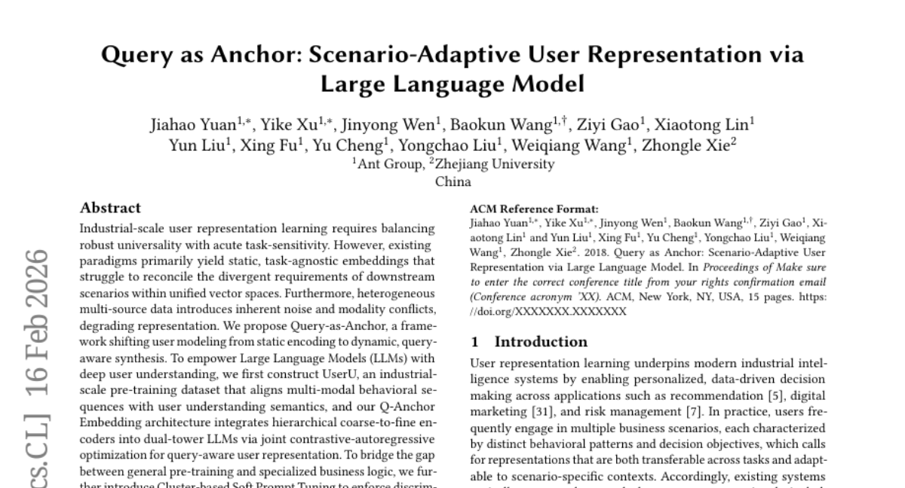

# 2026-02-17 Daily Papers (Top 5)

## 1. [DeepImageSearch: Benchmarking Multimodal Agents for Context-Aware Image Retrieval in Visual Histories](https://huggingface.co/papers/2602.10809)
**Upvotes**: 25 | **도입 난이도**: 상 | **신뢰도**: 중
**arXiv**: https://arxiv.org/abs/2602.10809

**태그**: Agent, RAG, Vision, Retrieval, Multimodal, Reasoning, Benchmark, Evaluation

### 📌 한 줄 요약
기존 이미지 검색 시스템의 한계를 극복하기 위해, 시각적 히스토리 내에서 컨텍스트를 고려한 이미지 검색을 수행하는 에이전트 기반의 새로운 DeepImageSearch 패러다임과 벤치마크 DISBench를 제안하고, 기존 모델의 한계를 보임.

### 🔑 핵심 포인트
- 시각적 히스토리 기반 컨텍스트 인지 이미지 검색을 위한 에이전트 패러다임 DeepImageSearch 제안
- 새로운 벤치마크 DISBench 구축 및 기존 모델의 한계점 지적
- human-model 협업 파이프라인을 통한 컨텍스트 의존적 쿼리 생성 자동화

### 🧑‍💻 개발자 관점
실제 서비스에서 사용자 상호작용 로그, 시간 순서대로 배열된 이미지 데이터 등을 활용하여 더욱 정확하고 맥락에 맞는 이미지 검색 시스템을 구축하는 데 활용될 수 있습니다.

### 🚀 실무 적용 아이디어
- DISBench 데이터셋을 다운로드하여 기존 검색 모델의 성능을 테스트해보기
- DeepImageSearch에서 제안하는 에이전트 기반 검색 구조를 RAG 파이프라인에 통합하는 연구 진행
- vision-language 모델을 활용한 컨텍스트 추출 파이프라인을 구축하여 데이터 증강 효과 확인

### ⚠️ 리스크/한계
- 에이전트 기반 시스템의 복잡성 증가 및 디버깅 난이도 상승
- DISBench 데이터셋의 편향 가능성 및 일반화 성능에 대한 검증 필요

### 📝 초록 기반 상세 설명
기존 멀티모달 검색 시스템은 이미지 간의 독립적인 관련성만 고려하여 시각적 히스토리의 풍부한 의존성을 간과합니다. 이러한 문제를 해결하기 위해, 이미지 검색을 자율 탐색 작업으로 재정의하는 DeepImageSearch라는 에이전트 기반 패러다임을 제안합니다. 이 패러다임은 모델이 컨텍스트 기반의 단서를 통해 목표를 찾기 위해 시각적 히스토리에 대한 다단계 추론을 수행해야 합니다. 이를 평가하기 위해 상호 연결된 시각적 데이터로 구축된 challenging 벤치마크 DISBench를 구축했습니다. 또한, 대규모 컨텍스트 의존적 쿼리 생성을 위해 vision-language 모델을 활용하여 인간 검증 전에 컨텍스트 발견을 자동화하는 파이프라인을 제안합니다. 실험 결과, DISBench는 기존 모델에 상당한 어려움을 주며, 차세대 검색 시스템에 에이전트 추론 통합의 필요성을 보여줍니다.

---

## 2. [Experiential Reinforcement Learning](https://huggingface.co/papers/2602.13949)
**Upvotes**: 21 | **도입 난이도**: 중 | **신뢰도**: 중
**arXiv**: https://arxiv.org/abs/2602.13949

**태그**: Reinforcement Learning, Language Model, Agent, Reasoning, Vision, Benchmark, Inference

### 📌 한 줄 요약
희소한 보상 환경에서 LM의 강화 학습 효율을 높이기 위해 경험-반성-강화 루프를 도입, 복잡한 환경과 도구 사용 추론 작업에서 성능 향상.

### 🔑 핵심 포인트
- 경험-반성-강화 루프를 통해 희소 보상 환경에서의 강화 학습 효율성 향상
- 명시적인 자기 반성을 통해 피드백을 행동 개선으로 변환
- 복잡한 환경과 도구 사용 추론 작업에서 기존 강화 학습 baseline 대비 성능 향상

### 🧑‍💻 개발자 관점
복잡하고 희소한 보상 환경에서 작동하는 에이전트 개발 시, ERL을 통해 학습 효율성을 높이고 최종 성능을 향상시킬 수 있습니다. 특히, 환경과의 상호작용이 제한적인 경우에 유용합니다.

### 🚀 실무 적용 아이디어
- ERL을 사용해 간단한 게임 환경에서 에이전트 학습 실험
- 기존 강화 학습 코드에 ERL 루프 통합 시도
- ERL의 반성 단계에서 다양한 반성 전략 실험

### ⚠️ 리스크/한계
- 반성 단계의 설계가 중요하며, 잘못된 반성은 오히려 성능 저하를 초래할 수 있음
- ERL이 복잡한 환경에서만 유의미한 성능 향상을 보이는지 추가 검증 필요

### 📝 초록 기반 상세 설명
언어 모델(LM)은 환경 보상이나 피드백으로부터 학습하기 위해 강화 학습을 주로 사용하지만, 실제 환경 피드백은 희소하고 지연되는 경우가 많아 학습이 어렵습니다. 이러한 신호로부터 학습하려면 LM은 관찰된 실패가 미래 행동 변화로 어떻게 이어져야 하는지 추론해야 합니다. 본 논문에서는 경험-반성-강화 루프를 강화 학습 프로세스에 통합하는 Experiential Reinforcement Learning (ERL)이라는 새로운 학습 패러다임을 제안합니다. 모델은 초기 시도를 생성하고, 환경 피드백을 받아, 개선된 두 번째 시도를 안내하는 반성을 생성합니다. 이 과정은 피드백을 구조화된 행동 수정으로 변환하여 탐색을 개선하고 최적화를 안정화하며, 추가 추론 비용 없이 배포 시 이득을 유지합니다. 희소 보상 제어 환경과 에이전트 추론 벤치마크에서 ERL은 강력한 강화 학습 baseline 대비 학습 효율성과 최종 성능을 일관되게 향상시켜 복잡한 다단계 환경에서 최대 +81%, 도구 사용 추론 작업에서 최대 +11%의 이득을 달성했습니다.

---

## 3. [REDSearcher: A Scalable and Cost-Efficient Framework for Long-Horizon Search Agents](https://huggingface.co/papers/2602.14234)
**Upvotes**: 17 | **도입 난이도**: 중 | **신뢰도**: 상
**arXiv**: https://arxiv.org/abs/2602.14234

**태그**: Agent, Search, Reinforcement Learning, RAG, Multimodal, Benchmark

### 📌 한 줄 요약
REDSearcher는 복잡한 검색 에이전트 학습을 위한 통합 프레임워크로, 고품질 작업 생성, 도구 활용 쿼리, 중간 학습, 로컬 시뮬레이션 환경을 통해 성능을 향상시키고 비용을 절감합니다.

### 🔑 핵심 포인트
- 그래프 토폴로지와 증거 분산을 활용한 작업 합성으로 고품질 작업 생성
- 도구 활용 쿼리를 통한 능동적인 도구 사용 장려
- 중간 학습을 통한 핵심 역량 강화 및 고품질 궤적 수집 비용 절감

### 🧑‍💻 개발자 관점
복잡한 검색 에이전트를 구축하고 싶지만, 데이터 확보 및 학습 비용이 부담스러운 개발자에게 REDSearcher 프레임워크는 확장 가능하고 비용 효율적인 솔루션을 제공합니다. 특히, 공개된 데이터셋과 코드, 모델 체크포인트를 활용하여 빠르게 실험하고 성능을 개선할 수 있습니다.

### 🚀 실무 적용 아이디어
- 제공되는 10K 텍스트 검색 궤적 데이터셋을 활용하여 RAG 시스템 성능 향상 실험
- 도구 활용 쿼리를 RAG 파이프라인에 통합하여 정보 검색 정확도 개선
- REDSearcher 프레임워크를 기반으로 로컬 시뮬레이션 환경 구축 및 강화 학습 실험 진행

### ⚠️ 리스크/한계
- 시뮬레이션 환경이 실제 환경을 완전히 반영하지 못할 수 있음
- 특정 유형의 검색 작업에만 최적화되어 있을 수 있음

### 📝 초록 기반 상세 설명
LLM이 범용 지식 엔진에서 실제 문제 해결사로 전환되고 있지만, 심층 검색 작업에 최적화하는 것은 여전히 어렵습니다. 고품질 검색 궤적과 보상 신호가 극히 희소하고, 확장 가능한 장기 작업 구성의 어려움과 외부 도구 호출을 포함하는 상호 작용 중심 롤아웃의 높은 비용 때문입니다. 이 문제를 해결하기 위해 REDSearcher라는 통합 프레임워크를 제안합니다. REDSearcher는 복잡한 작업 합성, 중간 학습, 사후 학습을 공동 설계하여 확장 가능한 검색 에이전트 최적화를 지원합니다. 특히 작업 난이도를 그래프 토폴로지와 증거 분산으로 정밀하게 제어하고, 도구 활용 쿼리를 통해 능동적인 도구 사용을 장려하며, 핵심 역량을 강화하여 고품질 궤적 수집 비용을 줄이고, 로컬 시뮬레이션 환경을 구축하여 강화 학습 실험의 반복 속도를 높입니다. 텍스트 및 멀티모달 검색 에이전트 벤치마크에서 최첨단 성능을 달성했습니다.

### 🖼️ 추가 자료

---

## 4. [STATe-of-Thoughts: Structured Action Templates for Tree-of-Thoughts](https://huggingface.co/papers/2602.14265)
**Upvotes**: 16 | **도입 난이도**: 중 | **신뢰도**: 상
**arXiv**: https://arxiv.org/abs/2602.14265

**태그**: Agent, LLM, Reasoning, Text Generation, Interpretability, Evaluation, Inference

### 📌 한 줄 요약
STATe는 Tree-of-Thoughts 방식의 다양성 부족 및 제어 한계를 극복하고, 고품질의 해석 가능한 텍스트 생성을 위한 새로운 프레임워크를 제공합니다.

### 🔑 핵심 포인트
- 액션 가이드 텍스트 개입을 통한 응답 다양성 향상
- 명시적인 액션 시퀀스를 통한 추론 과정의 해석 가능성 확보
- 액션 선택과 성능 간의 연관성 분석을 통한 생성 방향 최적화

### 🧑‍💻 개발자 관점
STATe는 LLM을 활용한 텍스트 생성 파이프라인에서 추론 과정을 제어하고 결과를 해석할 수 있게 하여, 디버깅과 성능 개선에 유용합니다. 특히 Agent 기반 시스템에서 reasoning 전략을 명확하게 정의하고 실험적으로 검증하는데 효과적입니다.

### 🚀 실무 적용 아이디어
- 제공된 GitHub 저장소에서 argument generation 예제를 실행해보기
- 자신의 텍스트 생성 task에 STATe 프레임워크 적용 가능성 검토하기
- 액션 공간을 정의하고, 다양한 액션 조합에 따른 결과 변화 관찰하기

### ⚠️ 리스크/한계
- 액션 공간 설계 및 컨트롤러 구현의 복잡성
- 특정 task에 적합한 액션 정의의 어려움

### 📝 초록 기반 상세 설명
기존의 Inference-Time-Compute (ITC) 방법들은 고온 샘플링으로 인해 출력 다양성이 부족하고, 추론 과정에 대한 제어 능력이 제한적입니다. 본 논문에서는 고수준 추론 패턴을 탐색하는 해석 가능한 ITC 방법인 STATe를 제안합니다. STATe는 컨트롤러가 추론 선택을 인코딩하는 액션을 선택하고, 생성기가 해당 액션을 기반으로 추론 단계를 생성하며, 평가기가 후보를 평가하여 검색을 안내하는 방식으로 작동합니다. 이러한 구조화된 접근 방식은 응답 다양성 향상, 액션 시퀀스의 해석 가능성 확보, 성능과 액션 선택 간의 연관성 분석을 통한 최적화 가능성 제시라는 세 가지 주요 이점을 제공합니다. 실험 결과, STATe는 고품질, 다양성, 해석 가능성을 모두 갖춘 텍스트 생성에 효과적임을 입증했습니다.

---

## 5. [Query as Anchor: Scenario-Adaptive User Representation via Large Language Model](https://huggingface.co/papers/2602.14492)
**Upvotes**: 15 | **도입 난이도**: 중 | **신뢰도**: 상
**arXiv**: https://arxiv.org/abs/2602.14492

**태그**: LLM, User Representation, Recommendation, Embedding, Pre-training, Benchmark, Evaluation, Inference

### 📌 한 줄 요약
LLM을 활용하여 사용자 표현 학습 성능을 크게 향상시키고, 실제 서비스 환경에서 효율적인 배포 및 A/B 테스트를 통해 효과를 검증한 프레임워크(Q-Anchor)를 제안합니다.

### 🔑 핵심 포인트
- 쿼리 기반 동적 사용자 표현 학습 프레임워크(Q-Anchor) 제안
- 멀티모달 데이터셋 UserU 구축 및 LLM 기반 임베딩 아키텍처 설계
- 클러스터 기반 소프트 프롬프트 튜닝을 통한 시나리오별 성능 향상

### 🧑‍💻 개발자 관점
LLM을 활용한 사용자 표현 학습은 추천 시스템, 광고, 검색 등 다양한 분야에서 성능 향상을 기대할 수 있으며, 특히 실제 서비스 환경에서 A/B 테스트를 통해 효과가 검증되었으므로, 기존 시스템에 LLM을 통합하는 방안을 고려해볼 가치가 있습니다.

### 🚀 실무 적용 아이디어
- 제공된 github 코드를 살펴보고, 사용자 데이터에 적용 가능한지 검토
- LLM을 활용한 사용자 임베딩 생성 파이프라인 구축
- 클러스터링 기반 프롬프트 튜닝을 통해 특정 시나리오 성능 향상 시도

### ⚠️ 리스크/한계
- LLM의 크기와 복잡도로 인해 리소스 소모가 클 수 있음
- 특정 도메인 또는 데이터셋에 대한 과적합 가능성 존재

### 📝 초록 기반 상세 설명
산업 규모의 사용자 표현 학습은 범용성과 작업 민감성 사이의 균형을 요구하지만, 기존 방식은 정적이고 작업에 독립적인 임베딩을 생성하여 다양한 시나리오 요구사항을 충족시키기 어려웠습니다. 또한, 이기종 멀티 소스 데이터는 노이즈와 모달리티 충돌을 발생시켜 표현 학습의 품질을 저하시킵니다. 이러한 문제를 해결하기 위해 본 논문에서는 사용자 모델링을 정적 인코딩에서 동적인 쿼리 인식 합성으로 전환하는 Q-Anchor 프레임워크를 제안합니다. LLM의 사용자 이해 능력을 강화하기 위해 멀티모달 행동 시퀀스와 사용자 이해 의미를 연결하는 대규모 사전 학습 데이터셋 UserU를 구축하고, 계층적 coarse-to-fine 인코더를 듀얼 타워 LLM에 통합하여 쿼리 인식 사용자 표현을 학습합니다. 또한, 클러스터 기반 소프트 프롬프트 튜닝을 통해 시나리오별 모달리티에 모델의 집중도를 맞추고, 쿼리를 시퀀스 끝에 고정하여 KV-cache를 활용한 빠른 추론을 가능하게 합니다. Alipay 산업 벤치마크 및 실제 서비스 A/B 테스트에서 SOTA 성능과 확장성, 효율적인 배포 가능성을 입증했습니다.

---

