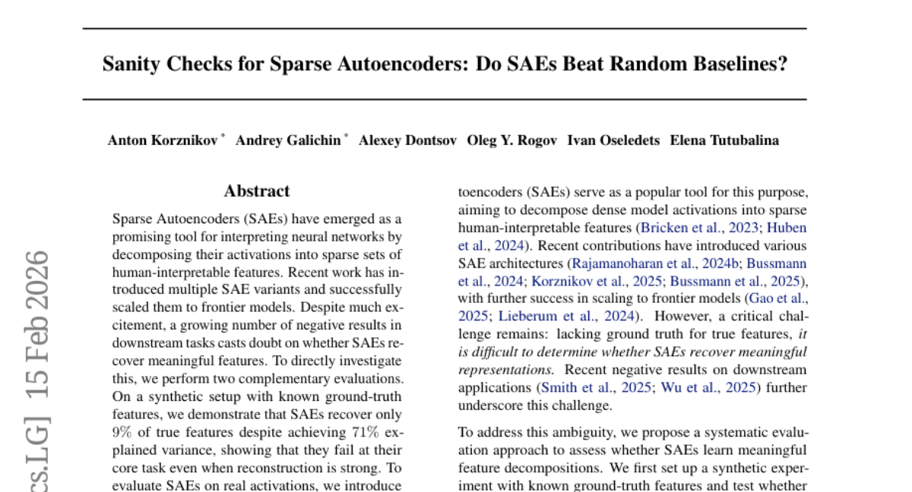
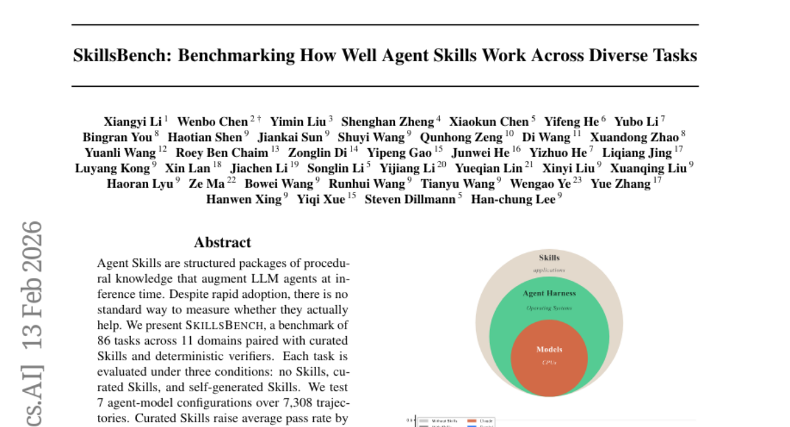
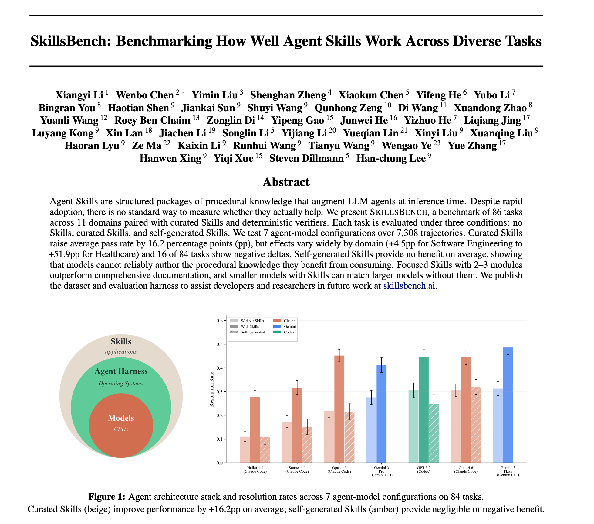
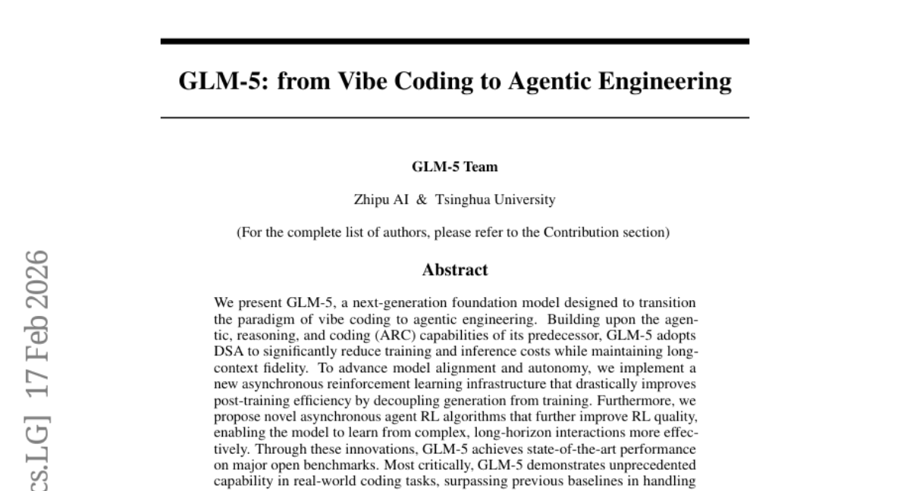
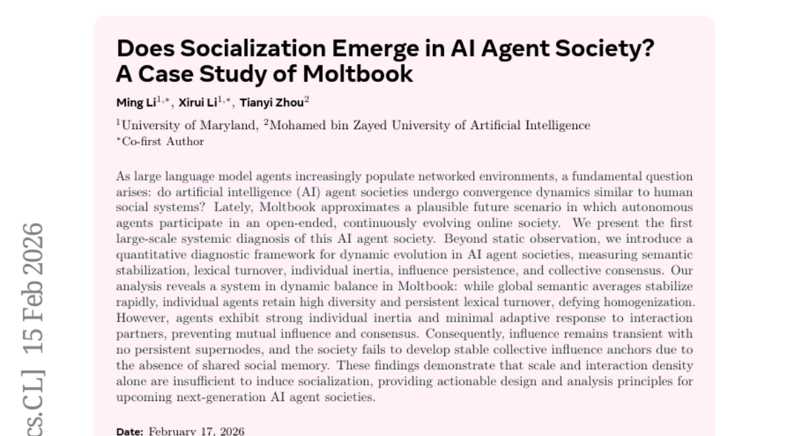
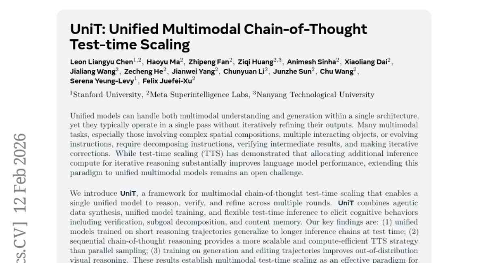

# 2026-02-18 Daily Papers (Top 5)

## 1. [Sanity Checks for Sparse Autoencoders: Do SAEs Beat Random Baselines?](https://huggingface.co/papers/2602.14111)
**Upvotes**: 54 | **도입 난이도**: 중 | **신뢰도**: 중
**arXiv**: https://arxiv.org/abs/2602.14111

**태그**: Interpretability, Sparse Autoencoder, Feature Extraction, Neural Networks, Evaluation

### 📌 한 줄 요약
Sparse Autoencoder(SAE)가 모델 해석에 효과적인 도구인지 의문이 제기되며, 무작위(random) baseline과 비교했을 때 성능상 이점을 보이지 못한다는 연구 결과.

### 🔑 핵심 포인트
- SAE가 반드시 의미있는 feature를 학습하는 것은 아님
- Random baseline이 SAE와 유사한 수준의 성능을 보일 수 있음
- Interpretability, sparse probing, causal editing 등의 지표에서 random baseline이 SAE를 능가함

### 🧑‍💻 개발자 관점
모델 해석을 위해 SAE를 사용하는 경우, random baseline과의 비교를 통해 SAE가 실제로 유용한 정보를 제공하는지 검증해야 한다. SAE를 맹목적으로 신뢰하기보다, 다양한 해석 방법론을 탐색하고 결과를 신중하게 평가해야 한다.

### 🚀 실무 적용 아이디어
- 자체 모델에 대해 SAE를 학습시키고, random baseline과의 성능 비교를 수행
- SAE가 학습한 feature들이 실제로 의미있는지 시각화 또는 추가적인 검증을 통해 확인
- SAE의 hyperparameter (sparsity penalty 등) 튜닝을 통해 성능 향상 가능성 탐색

### ⚠️ 리스크/한계
- 본 연구는 특정 모델 및 데이터셋에 대한 결과이므로, 일반화에 어려움이 있을 수 있음
- SAE의 성능은 architecture 및 학습 방법에 따라 크게 달라질 수 있음

### 📝 초록 기반 상세 설명
신경망의 내부 작동 방식을 해석하기 위해 Sparse Autoencoder(SAE)가 활발히 연구되고 있지만, 최근에는 SAE의 효용성에 대한 의문이 제기되고 있다. 본 연구에서는 SAE가 실제로 의미 있는 특징을 학습하는지 확인하기 위해, 합성 데이터와 실제 activation 데이터에 대한 평가를 진행했다. 합성 데이터 실험 결과, SAE는 분산 설명력이 높음에도 불구하고 실제 특징의 일부만 복원하는 데 그쳤다. 실제 activation 데이터에 대한 실험에서는 SAE의 feature 방향과 activation 패턴을 무작위로 설정한 baseline 모델이 fully-trained된 SAE와 유사한 성능을 보였다. 이는 현재 상태의 SAE가 모델의 내부 메커니즘을 안정적으로 분해하지 못한다는 것을 시사한다.

---

## 2. [SkillsBench: Benchmarking How Well Agent Skills Work Across Diverse Tasks](https://huggingface.co/papers/2602.12670)
**Upvotes**: 43 | **도입 난이도**: 중 | **신뢰도**: 중
**arXiv**: https://arxiv.org/abs/2602.12670

**태그**: Agent, LLM, Benchmark, Skills, RAG, Evaluation, Inference

### 📌 한 줄 요약
LLM 에이전트의 Skill 활용 효과를 측정하는 SkillsBench 벤치마크를 제시하며, 큐레이션된 Skill은 성능 향상에 기여하지만, 직접 생성된 Skill은 효과가 미미함을 보임. 특히 소프트웨어 엔지니어링 영역에서의 Skill 효과는 상대적으로 낮음.

### 🔑 핵심 포인트
- LLM 에이전트의 Skill 활용 효과를 측정하는 SkillsBench 벤치마크 제시
- 큐레이션된 Skill은 성능 향상에 기여하나, 도메인별 편차가 큼
- 에이전트가 직접 생성한 Skill은 효과가 미미함

### 🧑‍💻 개발자 관점
LLM 에이전트 기반 개발 시 Skill의 효과적인 활용 방안을 평가하고, 어떤 Skill을 큐레이션하고 어떤 Skill을 모델에게 맡길지 결정하는 데 도움이 됩니다.

### 🚀 실무 적용 아이디어
- 자체 LLM 에이전트에 SkillsBench 벤치마크를 적용하여 Skill 효과 측정
- 소프트웨어 엔지니어링 도메인 특화 Skill 개발 및 큐레이션 전략 수립
- 모델 크기별 Skill 활용 효과 비교 실험

### ⚠️ 리스크/한계
- SkillsBench의 task 구성이 실제 개발 환경과 차이가 있을 수 있음
- 특정 모델 아키텍처 및 데이터셋에 편향되었을 가능성 존재

### 📝 초록 기반 상세 설명
LLM 에이전트의 Skill 활용이 증가하고 있지만, 실제 효과를 측정하는 표준 방법이 부족합니다. 이에 다양한 도메인의 86개 task와 큐레이션된 Skill, 결정론적 검증기로 구성된 SkillsBench 벤치마크를 제시합니다. 실험 결과, 큐레이션된 Skill은 평균적으로 성능을 향상시키지만, 도메인별 편차가 크고 일부 task에서는 오히려 성능이 저하되는 현상이 나타났습니다. 또한, 에이전트가 직접 생성한 Skill은 유의미한 이점을 제공하지 못했습니다. 이는 모델이 소비하는 절차적 지식을 스스로 작성하는 데 어려움이 있음을 시사합니다. 핵심적으로, 작고 집중된 Skill이 포괄적인 문서보다 효과적이며, Skill을 활용한 작은 모델이 Skill 없이 큰 모델과 비슷한 성능을 낼 수 있습니다.

### 🖼️ 추가 자료

---

## 3. [GLM-5: from Vibe Coding to Agentic Engineering](https://huggingface.co/papers/2602.15763)
**Upvotes**: 42 | **도입 난이도**: 중 | **신뢰도**: 중
**arXiv**: https://arxiv.org/abs/2602.15763

**태그**: Agent, Reasoning, Benchmark, Inference, Safety

---

## 4. [Does Socialization Emerge in AI Agent Society? A Case Study of Moltbook](https://huggingface.co/papers/2602.14299)
**Upvotes**: 24 | **도입 난이도**: 중 | **신뢰도**: 중
**arXiv**: https://arxiv.org/abs/2602.14299

**태그**: Agent, Socialization, LLM, Simulation, Dynamics, RAG

### 📌 한 줄 요약
대규모 AI 에이전트 사회에서 상호작용 밀도가 높더라도 공유된 사회적 기억이 없으면 사회화가 발생하지 않으며, 이는 차세대 AI 에이전트 사회 설계에 중요한 시사점을 제공합니다.

### 🔑 핵심 포인트
- 대규모 AI 에이전트 사회의 동적 진화를 진단하는 정량적 프레임워크 제시
- Moltbook AI 에이전트 사회에서 의미론적 안정화와 개별 에이전트의 다양성 공존 확인
- 상호작용 밀도만으로는 사회화를 유도하기 어렵고, 공유된 사회적 기억이 중요함을 밝힘

### 🧑‍💻 개발자 관점
AI 에이전트 기반 시스템을 구축할 때, 단순히 많은 에이전트를 상호작용시키는 것만으로는 원하는 사회적 행동이 발생하지 않을 수 있습니다. 공유된 지식 기반 또는 사회적 기억을 설계에 반영해야 합니다.

### 🚀 실무 적용 아이디어
- 에이전트 간의 상호작용에 사회적 기억 메커니즘(예: 공유된 지식 그래프 업데이트)을 추가하여 영향력 지속성을 실험해보기
- 에이전트의 '개인 관성'을 조절하는 파라미터를 도입하고, 상호작용 빈도에 따른 적응 정도를 측정해보기
- 에이전트의 초기 개성을 다양화하고, 시간이 지남에 따라 사회적 합의가 발생하는지 시뮬레이션해보기

### ⚠️ 리스크/한계
- Moltbook이라는 특정 플랫폼에 대한 분석 결과이므로, 다른 환경에서도 동일한 결과가 나타날지는 불확실함
- 사회화의 정의와 측정 방식에 따라 결과가 달라질 수 있음

### 📝 초록 기반 상세 설명
대규모 언어 모델 에이전트가 네트워크 환경에 널리 퍼짐에 따라, AI 에이전트 사회가 인간 사회와 유사한 수렴 역학을 보이는지 묻는 근본적인 질문이 제기됩니다. 본 연구에서는 자율 에이전트가 개방적이고 지속적으로 진화하는 온라인 사회에 참여하는 Moltbook을 사례 연구로 삼아, 이 AI 에이전트 사회에 대한 최초의 대규모 체계적 진단을 제시합니다. AI 에이전트 사회의 동적 진화를 측정하기 위해 의미론적 안정화, 어휘 회전율, 개인 관성, 영향력 지속성, 집단 합의를 정량적으로 진단하는 프레임워크를 도입했습니다. 분석 결과, Moltbook 사회는 전반적인 의미론적 평균은 빠르게 안정화되지만 개별 에이전트는 높은 다양성과 지속적인 어휘 변화를 유지하며, 상호 영향과 합의 형성에 실패하는 동적 균형 상태임을 밝혀냈습니다. 따라서 영향력은 일시적이며, 공유된 사회적 기억의 부재로 인해 안정적인 집단 영향력의 기반을 형성하지 못합니다.

---

## 5. [UniT: Unified Multimodal Chain-of-Thought Test-time Scaling](https://huggingface.co/papers/2602.12279)
**Upvotes**: 19 | **도입 난이도**: 중 | **신뢰도**: 상
**arXiv**: https://arxiv.org/abs/2602.12279

**태그**: Agent, Multimodal, Reasoning, Scaling, CoT, Inference

### 📌 한 줄 요약
단일 통합 모델에서 멀티모달 추론 성능을 획기적으로 향상시키는 UniT 프레임워크를 제안하며, 특히 복잡한 시각적 추론 작업에서 더 나은 성능을 제공합니다.

### 🔑 핵심 포인트
- 멀티모달 Chain-of-Thought 테스트 타임 스케일링 (TTS) 프레임워크 UniT 제안
- 에이전트 기반 데이터 합성, 통합 모델 학습, 유연한 테스트 타임 추론 결합
- 순차적 Chain-of-Thought 추론이 병렬 샘플링보다 효율적인 TTS 전략임을 입증

### 🧑‍💻 개발자 관점
UniT는 복잡한 멀티모달 태스크에서 추론 능력을 향상시켜, 시각적 질의 응답, 이미지 편집 등 다양한 애플리케이션의 성능을 개선하는 데 기여할 수 있습니다. 특히, 에이전트 기반 데이터 합성을 통해 추가 데이터 없이 모델 성능을 높일 수 있다는 점이 실용적입니다.

### 🚀 실무 적용 아이디어
- UniT 프레임워크를 기존 멀티모달 모델에 적용하여 성능 향상 실험
- 에이전트 기반 데이터 합성을 통해 학습 데이터 증강 효과 확인
- 다양한 멀티모달 태스크 (VQA, 이미지 편집)에서 UniT 성능 평가

### ⚠️ 리스크/한계
- UniT 프레임워크 구현 및 학습에 상당한 컴퓨팅 자원 필요
- 에이전트 기반 데이터 합성 과정에서 편향된 데이터 생성 가능성 존재

### 📝 초록 기반 상세 설명
최근 통합 모델은 멀티모달 이해 및 생성을 동시에 처리할 수 있지만, 복잡한 추론 과정을 반복적으로 수행하는 데 어려움이 있습니다. 이러한 문제를 해결하기 위해 본 논문에서는 멀티모달 Chain-of-Thought 테스트 타임 스케일링(TTS) 프레임워크인 UniT를 제안합니다. UniT는 에이전트 기반 데이터 합성, 통합 모델 학습, 유연한 테스트 타임 추론을 결합하여 검증, 목표 분해, 내용 기억과 같은 인지 행동을 유도합니다. 실험 결과, 짧은 추론 궤적으로 학습된 통합 모델이 더 긴 추론 체인으로 일반화될 수 있으며, 순차적 Chain-of-Thought 추론이 병렬 샘플링보다 확장 가능하고 컴퓨팅 효율적인 TTS 전략임을 입증했습니다. 또한, 생성 및 편집 궤적 학습이 Out-of-Distribution 시각적 추론을 개선함을 확인했습니다.

---

