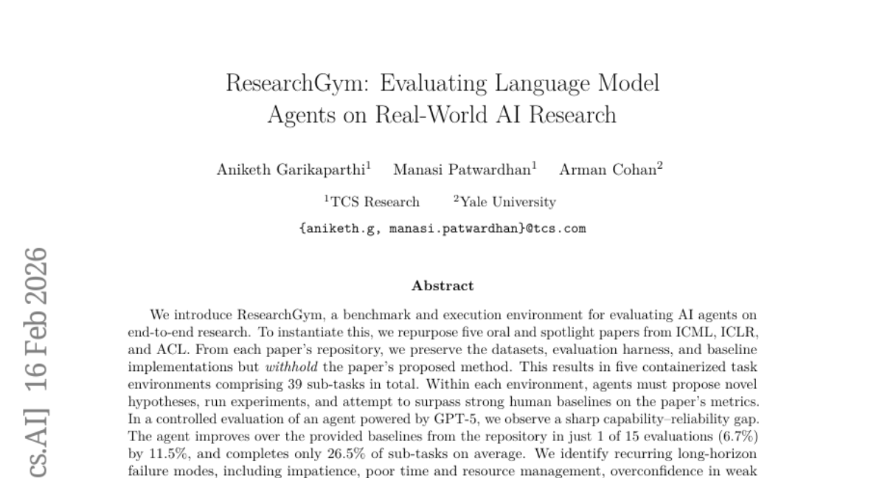
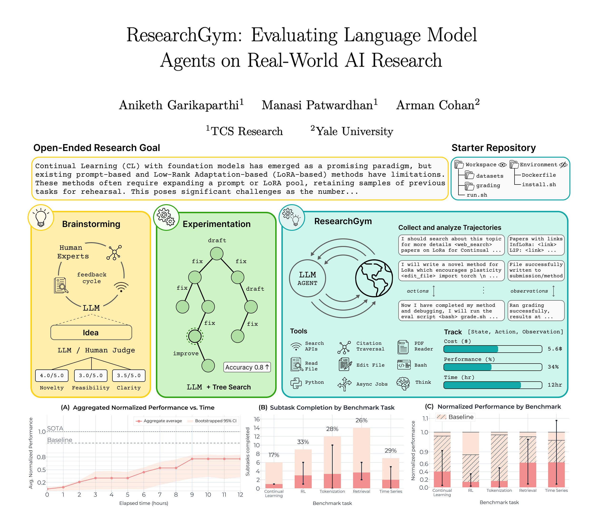

# 2026-02-18 Daily Papers (Top 5)

## 1. [Sanity Checks for Sparse Autoencoders: Do SAEs Beat Random Baselines?](https://huggingface.co/papers/2602.14111)
**Upvotes**: 50 | **도입 난이도**: 중 | **신뢰도**: 상
**arXiv**: https://arxiv.org/abs/2602.14111

**태그**: Interpretability, Sparse Autoencoder, Neural Network, Model Analysis, Evaluation

### 📌 한 줄 요약
현재의 Sparse Autoencoder(SAE)는 모델 내부 메커니즘을 신뢰성 있게 분해하지 못하므로, SAE를 이용한 모델 해석에 신중해야 함.

### 🔑 핵심 포인트
- SAE가 모델 해석 도구로서 신뢰성이 낮음을 입증
- 합성 데이터와 실제 활성 데이터를 이용한 평가 방법론 제시
- SAE 성능을 능가하는 랜덤 베이스라인 제시

### 🧑‍💻 개발자 관점
모델 내부 동작을 파악하기 위해 SAE를 사용하려는 경우, 랜덤 베이스라인과 비교하여 성능 향상이 있는지 확인해야 하며, 현재 수준으로는 맹신해서는 안 됨.

### 🚀 실무 적용 아이디어
- SAE를 사용할 때 랜덤 베이스라인과 비교하여 성능 검증
- SAE의 해석 결과가 실제로 모델 동작과 일치하는지 확인
- 다른 모델 해석 방법과 함께 SAE 결과 분석

### ⚠️ 리스크/한계
- 현재 SAE 아키텍처에 대한 평가 결과이며, 향후 개선된 SAE에서는 다를 수 있음
- 평가에 사용된 데이터셋과 모델에 따라 결과가 달라질 수 있음

### 📝 초록 기반 상세 설명
Sparse Autoencoder(SAE)는 신경망의 활성화를 희소하고 해석 가능한 특징으로 분해하여 모델 해석에 유망한 도구로 여겨져 왔습니다. 하지만 최근 다운스트림 작업에서 부정적인 결과가 증가하면서 SAE가 의미 있는 특징을 복구하는지에 대한 의문이 제기되었습니다. 이에 본 연구에서는 합성 데이터와 실제 활성 데이터를 사용하여 SAE를 평가했습니다. 합성 데이터에서는 SAE가 실제 특징의 9%만 복구했고, 실제 활성 데이터에서는 랜덤 베이스라인이 SAE와 유사한 성능을 보였습니다. 이러한 결과는 현재 상태의 SAE가 모델의 내부 메커니즘을 안정적으로 분해하지 못함을 시사합니다.

---

## 2. [SkillsBench: Benchmarking How Well Agent Skills Work Across Diverse Tasks](https://huggingface.co/papers/2602.12670)
**Upvotes**: 34 | **도입 난이도**: 중 | **신뢰도**: 상
**arXiv**: https://arxiv.org/abs/2602.12670

**태그**: Agent, Benchmark, LLM, Skills, RAG, Evaluation, Inference

### 📌 한 줄 요약
LLM 에이전트에 절차적 지식을 제공하는 Skills가 실제로 도움이 되는지 벤치마크한 결과, 특정 도메인에서는 효과가 있지만, 직접 생성한 Skills는 효과가 없었음. 특히 작은 모델에서도 Skills를 활용하면 큰 모델의 성능을 따라잡을 수 있음.

### 🔑 핵심 포인트
- 큐레이션된 Skills는 LLM 에이전트의 성능 향상에 기여 (평균 16.2% 향상)
- 자체 생성 Skills는 효과가 없으며, 모델이 스스로 절차적 지식을 생성하는 데 어려움이 있음
- Focused Skills가 포괄적인 문서보다 효과적이며, 작은 모델에서도 Skills를 통해 큰 모델 수준의 성능을 달성 가능

### 🧑‍💻 개발자 관점
LLM 에이전트를 사용하는 개발자는 큐레이션된 Skills를 활용하여 특정 작업의 성능을 향상시킬 수 있으며, 특히 작은 모델의 성능을 개선하는 데 유용하게 사용할 수 있습니다. 자체 Skills를 생성하기보다 기존의 큐레이션된 Skills를 활용하는 것이 효과적입니다.

### 🚀 실무 적용 아이디어
- 기존 LLM 에이전트 워크플로우에 SkillsBench 데이터셋의 큐레이션된 Skills를 통합하여 성능 향상 실험
- 자체 생성 Skills 대신 이미 검증된 Skills를 우선적으로 활용
- 작은 모델에 Skills를 적용하여 성능 향상 정도를 측정하고, 큰 모델과의 성능 차이를 비교 분석

### ⚠️ 리스크/한계
- SkillsBench는 특정 도메인에 편향되어 있을 수 있으며, 모든 작업에 일반화하기 어려울 수 있음
- 큐레이션된 Skills의 품질에 따라 성능 향상 효과가 크게 달라질 수 있음

### 📝 초록 기반 상세 설명
LLM 에이전트에서 Skills라는 절차적 지식 패키지가 널리 사용되지만, 실제로 도움이 되는지 측정하는 표준 방법이 없었습니다. SkillsBench는 11개 도메인의 86개 작업과 큐레이션된 Skills, 결정론적 검증기로 구성된 벤치마크입니다. Skills 유무와 자체 생성 Skills를 포함한 세 가지 조건에서 7개 에이전트 모델을 테스트했습니다. 큐레이션된 Skills는 평균 합격률을 16.2% 향상시켰지만, 도메인별로 효과가 크게 달랐습니다. 자체 생성 Skills는 평균적으로 이점이 없었으며, 2-3개의 모듈로 구성된 Focused Skills가 포괄적인 문서보다 성능이 좋았습니다. 작은 모델도 Skills를 사용하면 큰 모델과 비슷한 성능을 낼 수 있었습니다.

### 🖼️ 추가 자료

---

## 3. [GLM-5: from Vibe Coding to Agentic Engineering](https://huggingface.co/papers/2602.15763)
**Upvotes**: 29 | **도입 난이도**: 중 | **신뢰도**: 상
**arXiv**: https://arxiv.org/abs/2602.15763

**태그**: Agent, Coding, Reinforcement Learning, Foundation Model, Reasoning, Benchmark, Inference, Safety

### 📌 한 줄 요약
GLM-5는 새로운 아키텍처와 강화 학습 방식을 통해 실제 소프트웨어 엔지니어링 작업에서 SOTA를 달성, vibe coding에서 agentic engineering으로의 전환을 가속화합니다.

### 🔑 핵심 포인트
- DSA를 활용한 학습 및 추론 비용 절감
- 비동기 강화 학습 인프라를 통한 post-training 효율성 향상
- 실제 코딩 작업에서 SOTA 성능 달성

### 🧑‍💻 개발자 관점
GLM-5는 end-to-end 소프트웨어 엔지니어링 문제 해결 능력이 뛰어나므로, 개발자는 이를 통해 자동화된 코딩 및 문제 해결 프로세스를 구축하여 생산성을 향상시킬 수 있습니다.

### 🚀 실무 적용 아이디어
- 제공된 GitHub 저장소에서 모델 및 코드 확인
- 간단한 코딩 작업을 통해 GLM-5의 성능 테스트
- 기존 개발 workflow에 GLM-5를 통합할 수 있는 방법 연구

### ⚠️ 리스크/한계
- 새로운 아키텍처인 DSA의 이해 및 적용 필요
- 비동기 강화 학습의 안정성 및 수렴 문제 가능성

### 📝 초록 기반 상세 설명
기존 GLM 모델의 Agentic, Reasoning, Coding(ARC) 능력을 확장하여 차세대 foundation model인 GLM-5를 제시합니다. GLM-5는 DSA를 통해 학습 및 추론 비용을 크게 줄이면서 긴 컨텍스트 충실도를 유지합니다. 모델 정렬 및 자율성을 향상시키기 위해 새로운 비동기 강화 학습 인프라를 구현하여 생성과 학습을 분리함으로써 post-training 효율성을 크게 개선합니다. 또한 새로운 비동기 Agent RL 알고리즘을 제안하여 RL 품질을 더욱 향상시켜 복잡하고 장기적인 상호 작용으로부터 효과적으로 학습할 수 있도록 합니다. 이러한 혁신을 통해 GLM-5는 주요 오픈 벤치마크에서 최고 수준의 성능을 달성했으며, 특히 실제 코딩 작업에서 이전 baselines을 능가하는 뛰어난 성능을 보여줍니다.

---

## 4. [Does Socialization Emerge in AI Agent Society? A Case Study of Moltbook](https://huggingface.co/papers/2602.14299)
**Upvotes**: 20 | **도입 난이도**: 중 | **신뢰도**: 중
**arXiv**: https://arxiv.org/abs/2602.14299

**태그**: Agent, Socialization, LLM, AI Society, RAG

### 📌 한 줄 요약
AI 에이전트 사회가 인간 사회와 유사한 사회화 과정을 겪는지 대규모로 분석하고, 상호 작용 밀도가 높더라도 공유된 사회적 기억이 없으면 사회화가 발생하지 않음을 밝혀냄.

### 🔑 핵심 포인트
- AI 에이전트 사회의 역동적 진화를 측정하는 정량적 진단 프레임워크 제시
- Moltbook 환경에서 AI 에이전트 사회의 대규모 시스템 진단 수행
- 상호 작용 밀도만으로는 사회화를 유도하기 어렵고, 공유된 사회적 기억이 중요함을 밝힘

### 🧑‍💻 개발자 관점
AI 에이전트 기반 시스템 설계 시, 단순한 상호 작용을 넘어 공유된 사회적 기억을 구축하는 것이 중요함을 알려준다. 이는 협업, 커뮤니티 형성 등 사회적 기능을 필요로 하는 에이전트 시스템 개발에 직접적인 영향을 미친다.

### 🚀 실무 적용 아이디어
- 에이전트 간의 상호 작용 패턴을 분석하여 영향력 전파 메커니즘 연구
- 공유 메모리(예: 지식 그래프)를 도입하여 에이전트 사회의 합의 형성 및 정보 공유 실험
- 에이전트의 개별적 특성(학습률, 정보 탐색 전략 등)이 사회적 행동에 미치는 영향 분석

### ⚠️ 리스크/한계
- Moltbook 환경의 특성이 일반적인 AI 에이전트 사회를 대표하지 못할 수 있음
- 제시된 진단 프레임워크가 사회화의 모든 측면을 포괄하지 못할 수 있음

### 📝 초록 기반 상세 설명
대규모 언어 모델 기반 에이전트들이 네트워크 환경에서 활발히 활동하면서, AI 에이전트 사회가 인간 사회와 유사한 사회화 역학을 보이는지에 대한 의문이 제기된다. Moltbook이라는 환경에서 자율 에이전트들이 지속적으로 진화하는 온라인 사회에 참여하는 시나리오를 설정하고, 이 AI 에이전트 사회에 대한 첫 번째 대규모 시스템 진단을 수행했다. 의미 안정화, 어휘 변동률, 개인 관성, 영향력 지속성, 집단 합의 등 역동적인 진화를 측정하는 정량적 진단 프레임워크를 통해 분석한 결과, 개별 에이전트의 다양성은 높지만 상호 영향력과 합의 형성은 미미했다. 따라서 공유된 사회적 기억의 부재로 인해 안정적인 집단 영향력이 형성되지 않아 사회화에 실패했으며, 이는 규모와 상호 작용 밀도만으로는 사회화를 유도하기 어렵다는 것을 시사한다.

---

## 5. [ResearchGym: Evaluating Language Model Agents on Real-World AI Research](https://huggingface.co/papers/2602.15112)
**Upvotes**: 13 | **도입 난이도**: 중 | **신뢰도**: 중
**arXiv**: https://arxiv.org/abs/2602.15112

**태그**: Agent, Benchmark, Evaluation, Research Automation, LLM, RAG

### 📌 한 줄 요약
AI 에이전트의 연구 능력을 평가하는 새로운 벤치마크 ResearchGym 공개: 실제 연구 환경에서의 에이전트 성능을 체계적으로 평가하고 개선하는 데 기여.

### 🔑 핵심 포인트
- AI 에이전트의 연구 능력을 평가하는 ResearchGym 벤치마크 및 실행 환경 제시
- 실제 연구 논문을 기반으로 39개의 하위 작업으로 구성된 컨테이너화된 환경 제공
- GPT-5 기반 에이전트 평가 결과, 능력 대비 신뢰성 격차 및 장기적인 실패 패턴 확인

### 🧑‍💻 개발자 관점
소프트웨어 엔지니어는 ResearchGym을 활용하여 AI 에이전트의 연구 자동화 및 문제 해결 능력을 평가하고 개선할 수 있으며, 이는 코드 생성, 버그 수정, 새로운 알고리즘 탐색 등 다양한 개발 프로세스 자동화에 적용될 수 있다.

### 🚀 실무 적용 아이디어
- ResearchGym 환경을 구축하고, 기존 모델(예: GPT-3.5, Llama 2)을 사용하여 에이전트 성능 테스트
- ResearchGym에서 제시된 실패 패턴(시간 관리, 자원 관리, 과도한 자신감 등)을 해결하기 위한 에이전트 설계 개선
- 자체 연구 데이터셋을 활용하여 ResearchGym 환경을 확장하고, 특정 개발 작업에 특화된 에이전트 벤치마크 구축

### ⚠️ 리스크/한계
- 평가에 사용된 논문의 수가 제한적이며, 특정 연구 분야에 편향될 수 있음
- 에이전트의 성능은 사용된 LLM 모델에 크게 의존하며, 모델의 한계가 그대로 반영될 수 있음

### 📝 초록 기반 상세 설명
AI 에이전트가 실제 연구를 수행하는 능력을 평가하기 위해 ResearchGym이라는 벤치마크 및 실행 환경을 제시한다. ICML, ICLR, ACL의 우수 논문 5편을 재구성하여 데이터셋, 평가 도구, 기준 모델을 포함한 5개의 컨테이너화된 작업 환경(총 39개 하위 작업)을 구축했다. 에이전트는 각 환경에서 새로운 가설을 제안하고, 실험을 실행하며, 논문의 평가 지표에서 인간 수준의 기준 모델을 능가해야 한다. GPT-5 기반 에이전트를 평가한 결과, 능력 대비 신뢰성 격차가 컸으며, 제안된 방법으로 기준 모델을 개선한 경우는 15번 중 1번에 불과했다. 또한, 시간 및 자원 관리 미흡, 과도한 자신감, 병렬 실험 조정의 어려움 등 장기적인 실패 패턴이 관찰되었다. ResearchGym은 자율 에이전트의 폐쇄 루프 연구를 체계적으로 평가하고 분석할 수 있는 인프라를 제공한다.

### 🖼️ 추가 자료

---

