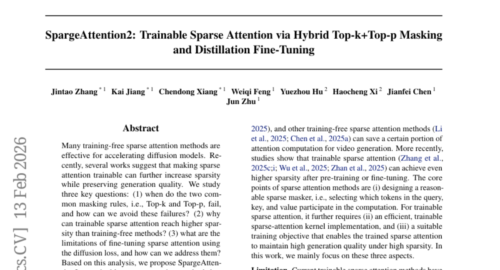
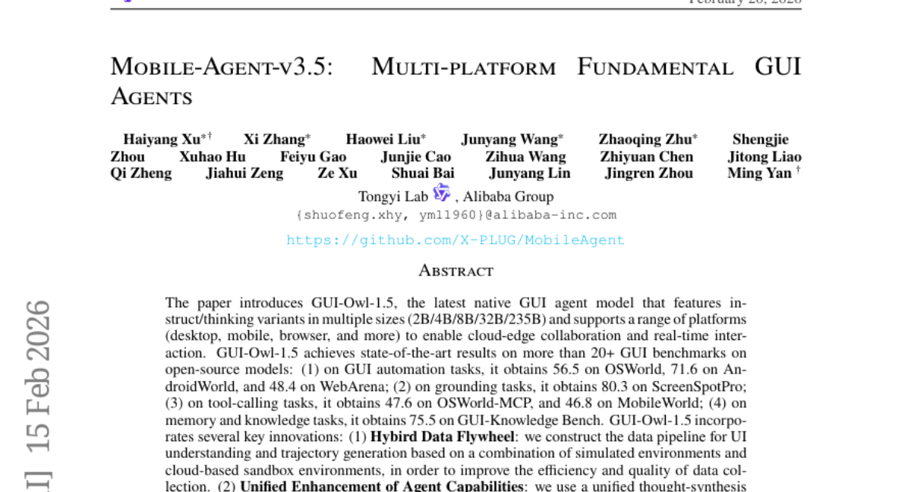
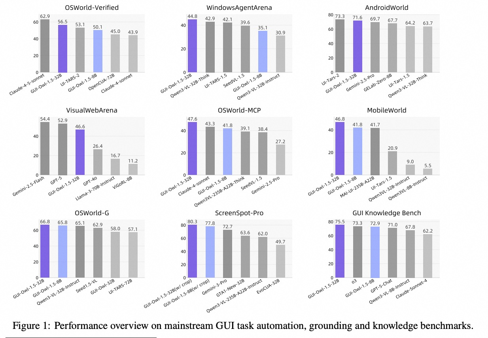
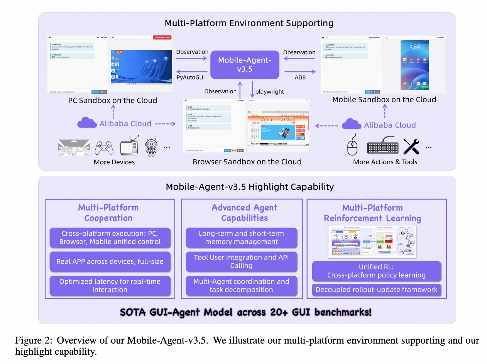
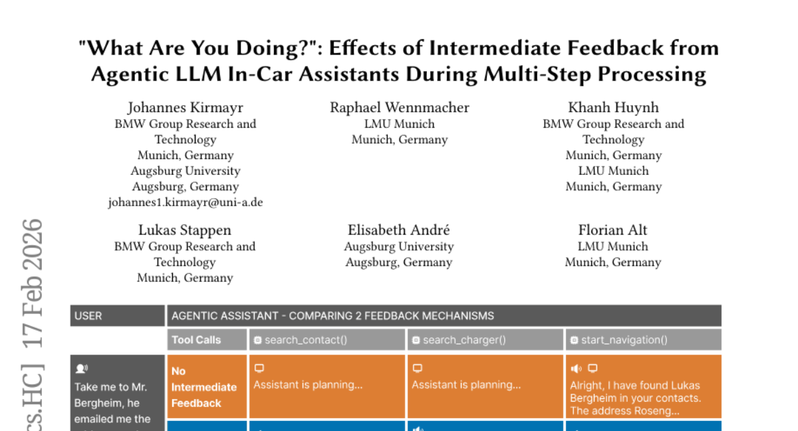
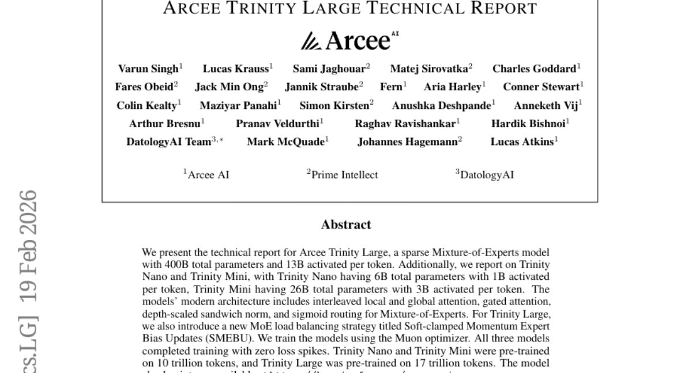

# 2026-02-20 Daily Papers (Top 5)

## 1. [SpargeAttention2: Trainable Sparse Attention via Hybrid Top-k+Top-p Masking and Distillation Fine-Tuning](https://huggingface.co/papers/2602.13515)
**Upvotes**: 21 | **도입 난이도**: 중 | **신뢰도**: 상
**arXiv**: https://arxiv.org/abs/2602.13515

**태그**: Diffusion Model, Attention, Sparsity, Video Generation, Optimization, Video, Distillation

### 📌 한 줄 요약
비디오 확산 모델에서 attention 연산량을 95%까지 줄이면서 생성 품질을 유지하는 SpargeAttention2를 제안, 기존 sparse attention 방법들을 능가하는 성능을 보임.

### 🔑 핵심 포인트
- Top-k와 Top-p 마스킹의 실패 원인 분석 및 하이브리드 마스킹 규칙 제안
- Distillation 기반 fine-tuning objective를 통한 생성 품질 보존
- 비디오 확산 모델에서 95% attention sparsity 및 16.2배 속도 향상 달성

### 🧑‍💻 개발자 관점
비디오 생성 모델의 추론 속도를 크게 향상시키고, 메모리 사용량을 줄여 더 큰 모델을 학습하거나 배포하는 데 도움이 될 수 있다.

### 🚀 실무 적용 아이디어
- 기존 비디오 확산 모델에 SpargeAttention2 적용하여 성능 향상 및 메모리 절약 효과 확인
- SpargeAttention2의 하이브리드 마스킹 규칙을 다른 attention 기반 모델에 적용하여 효과 검증
- Distillation 기반 fine-tuning objective를 다른 sparse attention 방법과 결합하여 성능 개선 시도

### ⚠️ 리스크/한계
- SpargeAttention2가 특정 구조의 비디오 확산 모델에 최적화되었을 수 있음
- 하이브리드 마스킹 규칙의 하이퍼파라미터 튜닝에 대한 추가적인 연구가 필요함

### 📝 초록 기반 상세 설명
최근 확산 모델에서 attention 연산량을 줄이기 위한 sparse attention 연구가 활발하다. 기존 연구들은 Top-k나 Top-p 마스킹 규칙의 한계를 보였고, fine-tuning 과정에서 생성 품질 저하가 발생하기도 했다. 본 연구에서는 이러한 문제점을 분석하고, Top-k와 Top-p를 결합한 하이브리드 마스킹 규칙을 제안하여 높은 희소성에서도 안정적인 마스킹을 가능하게 한다. 또한 distillation 기반 fine-tuning objective를 통해 sparse attention fine-tuning 과정에서 생성 품질을 보존한다. 실험 결과, SpargeAttention2는 비디오 확산 모델에서 95%의 attention sparsity를 달성하면서도 생성 품질을 유지하여 기존 방법들을 능가하는 성능을 보여준다.

---

## 2. [Unified Latents (UL): How to train your latents](https://huggingface.co/papers/2602.17270)
**Upvotes**: 19 | **도입 난이도**: 중 | **신뢰도**: 중
**arXiv**: https://arxiv.org/abs/2602.17270

**태그**: Diffusion Model, Latent Representation, Image Generation, Video Generation, Vision

_How_to_train_your_latents_img.jpg)

### 📌 한 줄 요약
Unified Latents (UL) 프레임워크는 diffusion prior와 diffusion model을 사용하여 잠재 표현 학습 성능을 높이고, ImageNet-512 및 Kinetics-600 데이터셋에서 SOTA를 달성하여 이미지 및 비디오 생성 모델의 효율성과 품질을 향상시킬 수 있다.

### 🔑 핵심 포인트
- Diffusion prior와 diffusion model을 활용한 새로운 잠재 표현 학습 프레임워크 (UL) 제안
- Latent bitrate upper bound를 tight하게 제공하는 간단한 학습 목표 개발
- ImageNet-512 및 Kinetics-600에서 SOTA 성능 달성 (적은 FLOPs로 높은 품질)

### 🧑‍💻 개발자 관점
UL 프레임워크는 이미지 및 비디오 생성 모델 개발 시 학습 효율성을 높이고 생성 품질을 향상시키는 데 활용될 수 있으며, 특히 제한된 컴퓨팅 자원 환경에서 더욱 유용하다.

### 🚀 실무 적용 아이디어
- UL 프레임워크를 기존 이미지/비디오 생성 모델에 적용하여 성능 향상 실험
- UL 학습 목표를 다른 종류의 잠재 표현 학습 방식과 결합하여 새로운 방법론 탐색
- UL의 hyperparameter (noise level 등) 튜닝을 통해 특정 데이터셋에 최적화

### ⚠️ 리스크/한계
- UL 프레임워크의 특정 데이터셋에 대한 일반화 성능 검증 필요
- Diffusion model 기반 방법론의 inherent한 계산 비용 문제 존재

### 📝 초록 기반 상세 설명
잠재 표현 학습은 이미지 및 비디오 생성 모델의 성능에 큰 영향을 미친다. 기존 방식은 학습 효율성이 낮거나 생성 품질이 떨어지는 문제가 있었다. 본 논문에서는 diffusion prior와 diffusion model로 공동 정규화된 잠재 표현을 학습하는 Unified Latents (UL) 프레임워크를 제안한다. UL은 인코더의 출력 노이즈를 prior의 최소 노이즈 레벨에 연결하여 간단하면서도 tight한 bitrate upper bound를 제공하는 학습 목표를 사용한다. ImageNet-512에서 FID 1.4를 달성하며, Stable Diffusion 잠재 공간 기반 모델보다 적은 FLOPs로 높은 재구성 품질(PSNR)을 보인다. Kinetics-600에서는 FVD 1.3으로 새로운 SOTA를 달성했다.

---

## 3. [Mobile-Agent-v3.5: Multi-platform Fundamental GUI Agents](https://huggingface.co/papers/2602.16855)
**Upvotes**: 18 | **도입 난이도**: 중 | **신뢰도**: 상
**arXiv**: https://arxiv.org/abs/2602.16855

**태그**: GUI Automation, Agent, Multi-Platform, RL, Tool-Calling, Reasoning, Benchmark

### 📌 한 줄 요약
다양한 플랫폼에서 GUI 자동화를 위한 에이전트 모델 GUI-Owl-1.5를 공개, 개발자들이 UI 자동화 및 테스트를 효율적으로 수행할 수 있도록 돕는다.

### 🔑 핵심 포인트
- 다양한 플랫폼 지원 (데스크탑, 모바일, 웹)
- 하이브리드 데이터 플라이휠을 통한 데이터 효율성 및 품질 향상
- MRPO 알고리즘을 사용한 다중 플랫폼 환경에서의 RL 스케일링

### 🧑‍💻 개발자 관점
GUI-Owl-1.5는 개발자들이 GUI 자동화 테스트 및 UI 기반 작업 자동화를 더 쉽고 효율적으로 수행할 수 있도록 지원하며, 특히 다양한 플랫폼을 지원하므로 크로스 플랫폼 앱 개발에 유용하다.

### 🚀 실무 적용 아이디어
- 깃허브에서 GUI-Owl-1.5 모델 다운로드 및 로컬 환경 테스트
- 제공된 클라우드-샌드박스 데모를 통해 GUI-Owl-1.5의 기능 직접 체험
- GUI 자동화 테스트 파이프라인에 GUI-Owl-1.5 통합 시도

### ⚠️ 리스크/한계
- 235B 모델은 리소스 요구량이 매우 높을 수 있음
- 특정 플랫폼 또는 UI 프레임워크에 대한 최적화가 필요할 수 있음

### 📝 초록 기반 상세 설명
GUI 자동화는 다양한 플랫폼에서 일관된 사용자 경험을 제공하는 데 중요한 역할을 하지만, 플랫폼별 호환성 문제와 복잡한 UI 구조로 인해 어려움을 겪습니다. 이 논문에서는 데스크탑, 모바일, 웹 등 다양한 플랫폼을 지원하고 클라우드-엣지 협업이 가능한 GUI 에이전트 모델 GUI-Owl-1.5를 소개합니다. GUI-Owl-1.5는 하이브리드 데이터 플라이휠, 통합된 사고 합성 파이프라인, 다중 플랫폼 환경 RL 스케일링 기술을 통해 GUI 자동화, 그라운딩, 툴 사용, 지식 습득 능력을 향상시켰습니다. 다양한 GUI 벤치마크에서 최첨단 성능을 달성했으며, 모델과 데모를 오픈소스로 공개하여 접근성을 높였습니다.

### 🖼️ 추가 자료

---

## 4. ["What Are You Doing?": Effects of Intermediate Feedback from Agentic LLM In-Car Assistants During Multi-Step Processing](https://huggingface.co/papers/2602.15569)
**Upvotes**: 12 | **도입 난이도**: 중 | **신뢰도**: 중
**arXiv**: https://arxiv.org/abs/2602.15569

**태그**: Agent, LLM, User Experience, In-Car Assistant, Feedback, Reasoning

### 📌 한 줄 요약
운전 중 멀티스텝 작업을 수행하는 LLM 기반 차량 내 에이전트 어시스턴트에서 중간 피드백 제공이 사용자 경험, 신뢰도 향상, 작업 부하 감소에 긍정적인 영향을 미침.

### 🔑 핵심 포인트
- 에이전트 LLM 기반 차량 내 어시스턴트의 중간 피드백이 사용자 경험 및 신뢰도 향상에 기여
- 사용자들은 초기 투명성을 중요하게 생각하며, 시스템 신뢰도에 따라 피드백 상세 정도를 조절하는 적응형 접근 방식을 선호
- 운전 중 작업 부하 감소에 중간 피드백이 효과적

### 🧑‍💻 개발자 관점
멀티스텝 작업을 수행하는 챗봇이나 에이전트 시스템 개발 시, 사용자에게 중간 진행 상황을 적절하게 피드백하는 것이 중요함을 알려준다. 특히 복잡한 작업이나 사용자의 신뢰가 중요한 경우, 초반에는 상세한 피드백을 제공하고 이후에는 점진적으로 줄이는 전략을 고려할 수 있다.

### 🚀 실무 적용 아이디어
- LLM 에이전트 개발 시, 작업 단계를 분할하고 각 단계별 진행 상황을 사용자에게 피드백하는 기능 추가
- 피드백 상세 정도를 조절하는 옵션을 제공하여 사용자가 직접 설정 가능하게 구현
- AB 테스트를 통해 다양한 피드백 전략의 효과를 측정하고 사용자 반응을 분석

### ⚠️ 리스크/한계
- 실험 환경이 실제 운전 환경과 다를 수 있으며, 사용자 수가 제한적임
- 특정 LLM 모델에 최적화된 결과일 수 있으며, 다른 모델에서는 다른 결과가 나타날 수 있음

### 📝 초록 기반 상세 설명
자율적으로 멀티스텝 작업을 수행하는 에이전트 AI 어시스턴트는 사용자 경험 측면에서 중요한 문제를 제기한다. 특히 운전과 같이 주의가 필요한 상황에서 시스템은 진행 상황과 추론 과정을 어떻게 전달해야 할까? 본 연구는 LLM 기반 차량 내 어시스턴트에서 계획된 단계 및 중간 결과 피드백을 제공하는 것과 최종 결과만 제공하는 경우를 비교하는 실험을 통해 피드백 타이밍과 상세 정도가 사용자 경험에 미치는 영향을 조사했다. 실험 결과, 중간 피드백은 인지된 속도, 신뢰도, 사용자 경험을 향상시키고 작업 부하를 감소시키는 것으로 나타났다. 인터뷰 결과, 사용자들은 초기에는 높은 투명성을 요구하지만 시스템의 신뢰도가 높아짐에 따라 점진적으로 상세 정도를 줄이는 적응형 접근 방식을 선호하는 것으로 나타났다. 본 연구 결과는 에이전트 어시스턴트의 피드백 타이밍과 상세 정도 설계에 대한 시사점을 제공한다.

---

## 5. [Arcee Trinity Large Technical Report](https://huggingface.co/papers/2602.17004)
**Upvotes**: 9 | **도입 난이도**: 중 | **신뢰도**: 상
**arXiv**: https://arxiv.org/abs/2602.17004

**태그**: MoE, Large Language Model, Sparse Model

### 📌 한 줄 요약
Arcee에서 개발한 MoE 모델 Trinity 시리즈(Large, Mini, Nano)를 공개했으며, 특히 Large 모델은 새로운 로드 밸런싱 전략 SMEBU를 통해 안정적인 학습을 보였다. 개발자들은 Hugging Face에서 모델을 다운로드하여 사용할 수 있다.

### 🔑 핵심 포인트
- 400B 파라미터의 MoE 모델 Trinity Large 공개 (token 당 13B 활성화)
- 새로운 MoE 로드 밸런싱 전략 Soft-clamped Momentum Expert Bias Updates (SMEBU) 제안
- Hugging Face를 통해 모델 체크포인트 제공

### 🧑‍💻 개발자 관점
MoE 모델을 활용하여 모델 크기를 키우면서도 효율적인 추론이 가능하다. 특히 SMEBU는 MoE 모델 학습의 안정성을 높이는 데 기여할 수 있으며, 개발자들은 해당 모델을 기반으로 다양한 실험 및 fine-tuning을 진행할 수 있다.

### 🚀 실무 적용 아이디어
- Hugging Face에서 Trinity Large 모델 다운로드 후 성능 테스트
- SMEBU 로드 밸런싱 전략을 기존 MoE 모델에 적용하여 성능 개선 시도
- Trinity 시리즈 모델을 기반으로 특정 task에 fine-tuning 진행

### ⚠️ 리스크/한계
- MoE 모델 특성상 expert 선택 및 로드 밸런싱에 대한 추가적인 연구 필요
- 모델 크기가 매우 커서 충분한 컴퓨팅 자원 필요

### 📝 초록 기반 상세 설명
최근 대규모 언어 모델의 효율성을 높이기 위해 Mixture-of-Experts (MoE) 모델이 주목받고 있다. Arcee는 400B 파라미터의 Trinity Large를 포함한 Trinity 시리즈를 개발하여 공개했다. 이 모델들은 interleaved local/global attention, gated attention 등의 현대적인 구조를 채택했으며, Trinity Large는 SMEBU라는 새로운 MoE 로드 밸런싱 전략을 사용한다. Muon 옵티마이저를 사용하여 학습했으며, Trinity Large는 17조 토큰으로 학습되었다. 해당 모델들은 Hugging Face에서 사용할 수 있다.

---

