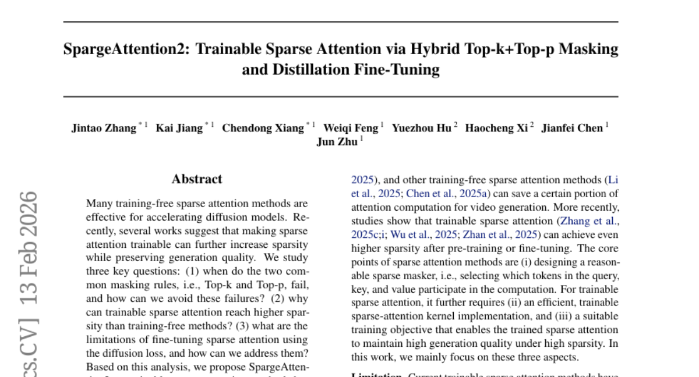
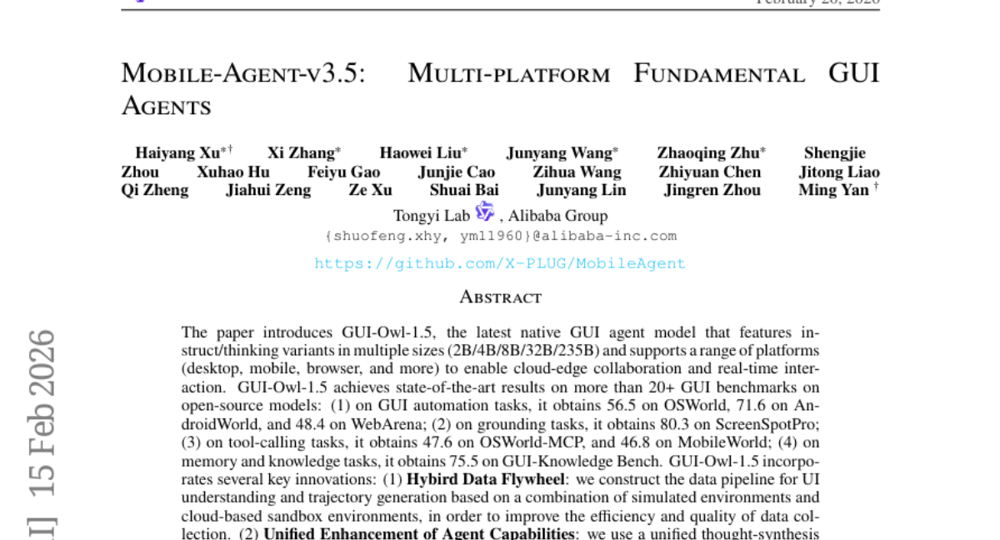
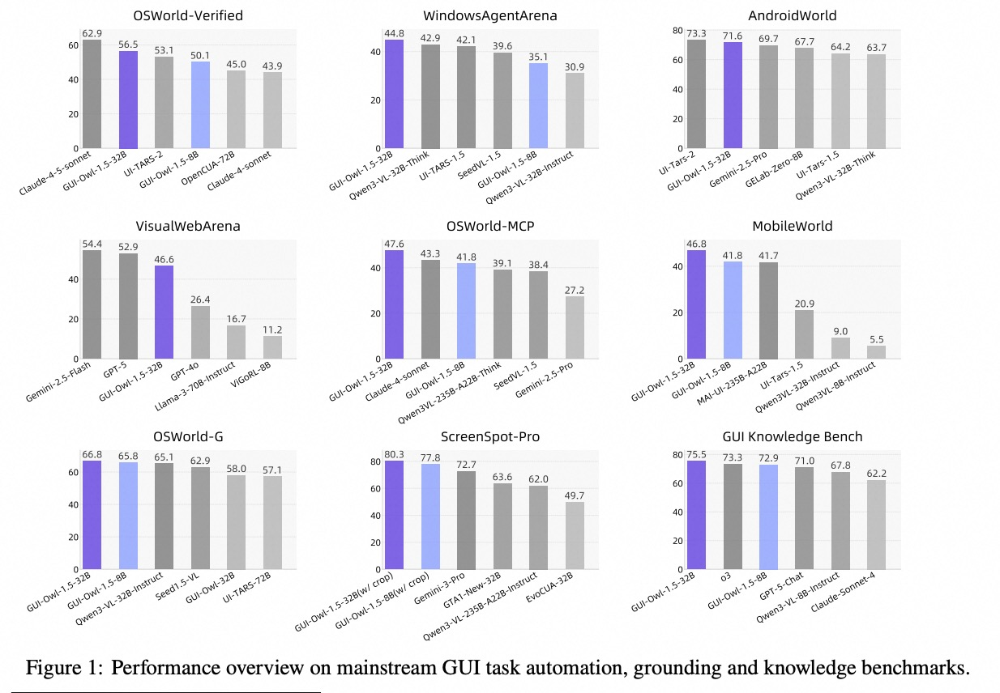
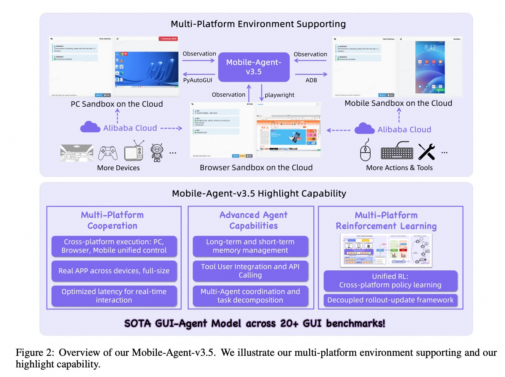
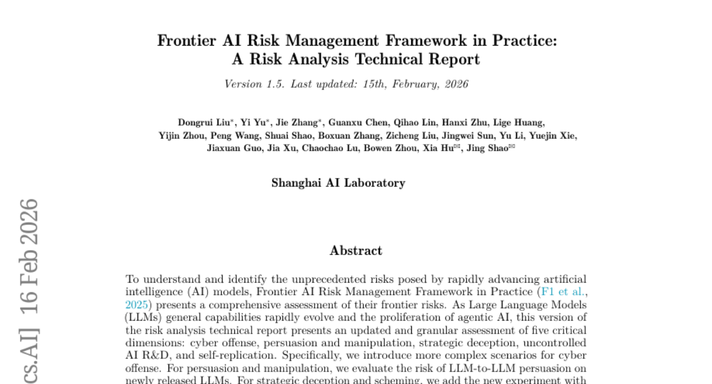
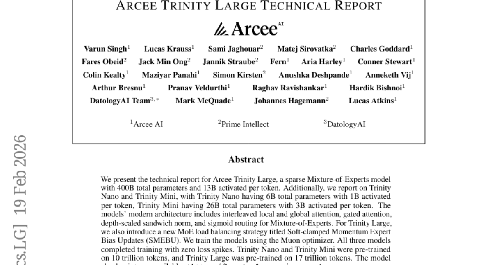
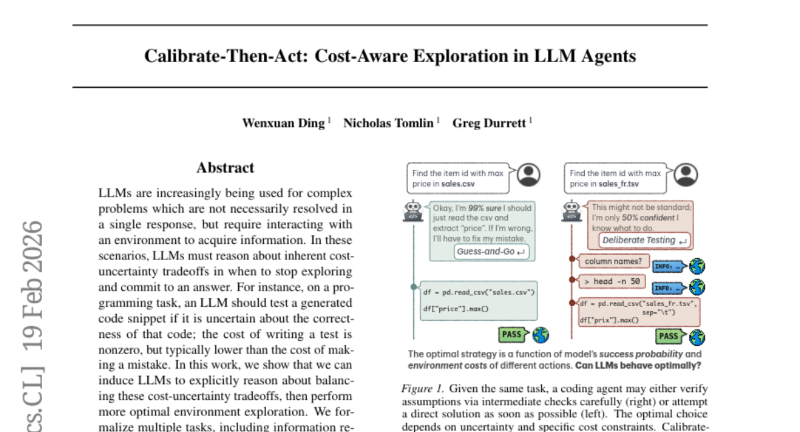
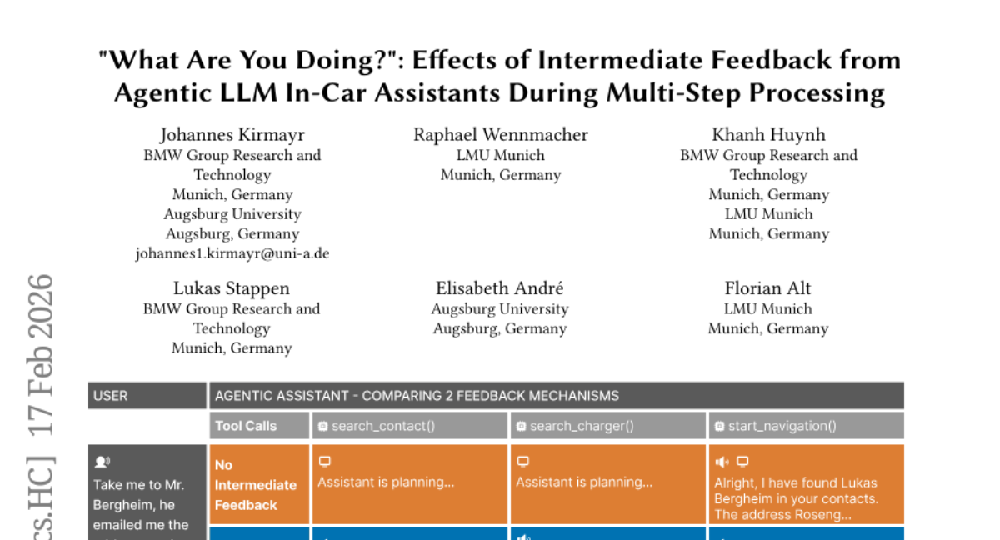
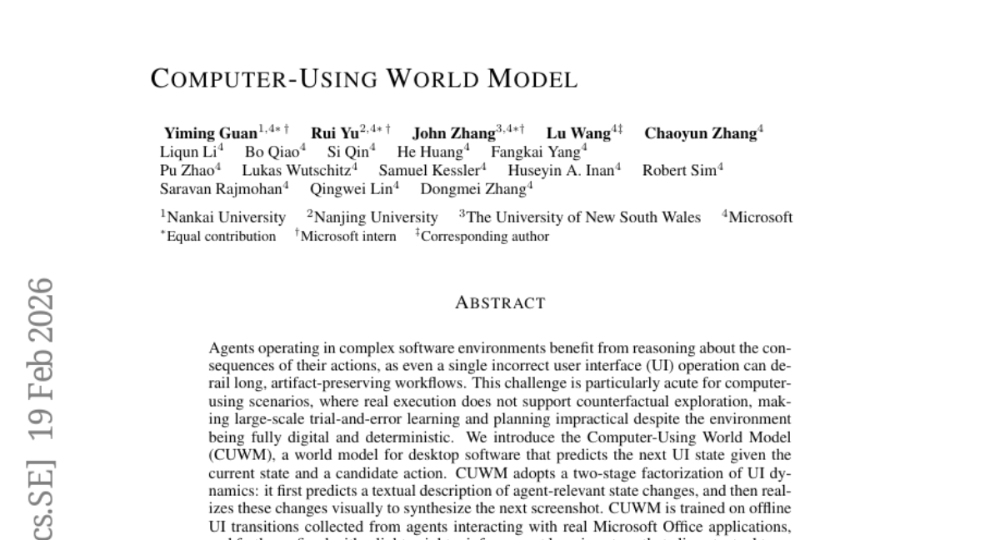
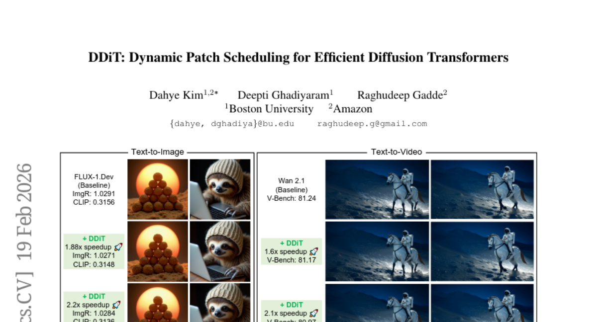

# 2026-02-23 Daily Papers (Top 9)

## 1. [SpargeAttention2: Trainable Sparse Attention via Hybrid Top-k+Top-p Masking and Distillation Fine-Tuning](https://huggingface.co/papers/2602.13515)
**Upvotes**: 39 | **도입 난이도**: 중 | **신뢰도**: 중
**arXiv**: https://arxiv.org/abs/2602.13515

**태그**: Attention, Diffusion Model, Sparse Attention, Video Generation, Video, Distillation

### 📌 한 줄 요약
SpargeAttention2는 Top-k와 Top-p 마스킹을 결합하고 증류 기반 미세 조정을 통해 학습 가능한 희소 어텐션을 구현, 비디오 확산 모델에서 95% 희소성과 16.2배 속도 향상을 달성하여 기존 방법들을 능가한다.

### 🔑 핵심 포인트
- Top-k 및 Top-p 마스킹 실패 조건 분석 및 하이브리드 마스킹 규칙 제안
- 학습 가능한 희소 어텐션을 위한 효율적인 구현
- 증류 기반 미세 조정 목표를 통해 생성 품질 유지

### 🧑‍💻 개발자 관점
확산 모델의 성능을 유지하면서 어텐션 연산량을 크게 줄여 모델 추론 속도를 향상시키므로, 고해상도 이미지/비디오 생성 서비스의 비용 효율성을 높일 수 있다.

### 🚀 실무 적용 아이디어
- 기존 확산 모델에 SpargeAttention2를 적용하여 성능 및 속도 향상 실험
- 다양한 희소 어텐션 방법과 SpargeAttention2의 성능 비교
- SpargeAttention2의 하이퍼파라미터(k, p) 최적화

### ⚠️ 리스크/한계
- SpargeAttention2가 특정 데이터셋이나 모델 구조에서만 효과적일 수 있음
- 하이브리드 마스킹 규칙 및 증류 기반 미세 조정의 추가적인 계산 비용 발생 가능성

### 📝 초록 기반 상세 설명
최근 확산 모델 가속화를 위해 학습 가능한 희소 어텐션 연구가 활발하다. 본 연구에서는 Top-k와 Top-p 마스킹의 실패 조건, 학습 가능한 희소 어텐션의 고 희소성 달성 이유, 확산 손실을 이용한 미세 조정의 한계를 분석했다. 이러한 분석을 바탕으로 SpargeAttention2를 제안하며, 이는 Top-k와 Top-p를 결합한 하이브리드 마스킹, 효율적인 학습 가능한 희소 어텐션 구현, 증류 기반 미세 조정 목표를 포함한다. 비디오 확산 모델 실험 결과, SpargeAttention2는 95%의 희소성과 16.2배의 속도 향상을 달성하며 기존 방법들을 능가하는 성능을 보였다.

---

## 2. [Mobile-Agent-v3.5: Multi-platform Fundamental GUI Agents](https://huggingface.co/papers/2602.16855)
**Upvotes**: 34 | **도입 난이도**: 중 | **신뢰도**: 상
**arXiv**: https://arxiv.org/abs/2602.16855

**태그**: Agent, GUI, Automation, Multi-platform, RL, Reasoning, Benchmark

### 📌 한 줄 요약
GUI 자동화, 툴 사용, 지식 추론 등 다양한 GUI 에이전트 작업에서 SOTA를 달성한 멀티 플랫폼 GUI 에이전트 모델 GUI-Owl-1.5 공개 및 클라우드 샌드박스 데모 제공.

### 🔑 핵심 포인트
- 다양한 크기(2B/4B/8B/32B/235B)와 플랫폼(데스크톱, 모바일, 브라우저)을 지원하는 GUI 에이전트 모델 GUI-Owl-1.5 제시
- 하이브리드 데이터 플라이휠, 통합된 사고 합성 파이프라인, MRPO 알고리즘을 통해 데이터 효율성, 추론 능력, 플랫폼 간 적응성을 향상
- GUI 자동화, 그라운딩, 툴 사용, 지식 추론 등 다양한 GUI 벤치마크에서 SOTA 성능 달성

### 🧑‍💻 개발자 관점
GUI 자동화 에이전트 개발 시, GUI-Owl-1.5를 활용하여 다양한 플랫폼에서 높은 성능의 에이전트를 구축하고, 자체 데이터 파이프라인 구축 및 강화 학습 알고리즘 적용에 대한 참고 자료로 활용할 수 있다.

### 🚀 실무 적용 아이디어
- Github 저장소에서 GUI-Owl-1.5 모델 다운로드 및 로컬 환경에서 실행 테스트
- 온라인 데모를 통해 GUI-Owl-1.5의 기능 및 성능 직접 체험
- 제공되는 데이터 파이프라인 및 강화 학습 알고리즘을 분석하여 자체 에이전트 개발에 적용 가능성 검토

### ⚠️ 리스크/한계
- 모델 크기가 커서(최대 235B) 고사양의 컴퓨팅 자원이 필요할 수 있음
- 특정 GUI 환경 또는 작업에 대한 편향이 존재할 수 있으며, 일반화 성능에 대한 추가 검증이 필요함

### 📝 초록 기반 상세 설명
GUI 에이전트는 다양한 플랫폼에서의 사용자 인터페이스 자동화를 가능하게 하지만, 기존 모델은 성능 및 효율성 측면에서 한계가 있었다. 본 논문에서는 데스크톱, 모바일, 브라우저 등 다양한 플랫폼을 지원하는 GUI 에이전트 모델 GUI-Owl-1.5를 제안한다. GUI-Owl-1.5는 하이브리드 데이터 플라이휠, 통합된 사고 합성 파이프라인, 다중 플랫폼 환경 RL 스케일링(MRPO)을 통해 데이터 효율성, 추론 능력, 플랫폼 간 적응성을 향상시켰다. 실험 결과, GUI-Owl-1.5는 GUI 자동화, 그라운딩, 툴 사용, 지식 추론 등 20개 이상의 GUI 벤치마크에서 SOTA 성능을 달성했다. 오픈소스 모델과 온라인 데모를 통해 쉽게 접근 가능하다.

### 🖼️ 추가 자료

---

## 3. [Unified Latents (UL): How to train your latents](https://huggingface.co/papers/2602.17270)
**Upvotes**: 31 | **도입 난이도**: 중 | **신뢰도**: 상
**arXiv**: https://arxiv.org/abs/2602.17270

**태그**: Diffusion Model, Latent Representation, Image Generation, Video Generation, Vision

_How_to_train_your_latents_img.jpg)

### 📌 한 줄 요약
Unified Latents 프레임워크는 diffusion prior와 diffusion model을 이용하여 잠재 표현(latent representation)을 학습하고, ImageNet-512와 Kinetics-600에서 SOTA 성능을 달성했습니다.

### 🔑 핵심 포인트
- Diffusion prior와 diffusion model을 이용한 잠재 표현 학습 프레임워크 (Unified Latents) 제안
- Latent bitrate upper bound를 tight하게 만드는 간단한 학습 목표 제시
- ImageNet-512 및 Kinetics-600에서 SOTA 성능 달성 (기존 모델 대비 적은 FLOPs)

### 🧑‍💻 개발자 관점
고품질 이미지/비디오 생성 모델 개발에 필요한 잠재 표현 학습 효율성을 높이고, 적은 계산 비용으로 더 나은 결과를 얻을 수 있게 해줍니다. Stable Diffusion 기반 모델 개선에 적용 가능합니다.

### 🚀 실무 적용 아이디어
- ImageNet-512 데이터셋에 UL 프레임워크 적용해보기
- Stable Diffusion 모델의 latent space를 UL로 대체하여 성능 비교해보기
- Kinetics-600 데이터셋에 UL 프레임워크를 적용하여 비디오 생성 성능 평가해보기

### ⚠️ 리스크/한계
- 새로운 프레임워크이므로 기존 모델과의 호환성 문제가 발생할 수 있음
- diffusion model 학습에 대한 이해도가 필요함

### 📝 초록 기반 상세 설명
잠재 표현 학습은 이미지 및 비디오 생성 모델의 핵심 기술입니다. 기존 방법들은 계산 비용이 높거나, 생성 품질이 떨어지는 문제점이 있었습니다. 본 논문에서는 diffusion prior와 diffusion model로 jointly regularized된 잠재 표현을 학습하는 Unified Latents(UL) 프레임워크를 제안합니다. UL은 encoder의 출력 noise를 prior의 최소 noise 레벨에 연결하여 간단하면서도 tight한 latent bitrate upper bound를 제공합니다. ImageNet-512에서 경쟁력 있는 FID 1.4를 달성하고, Kinetics-600에서는 새로운 SOTA FVD 1.3을 기록했습니다.

---

## 4. [Frontier AI Risk Management Framework in Practice: A Risk Analysis Technical Report v1.5](https://huggingface.co/papers/2602.14457)
**Upvotes**: 26 | **도입 난이도**: 중 | **신뢰도**: 중
**arXiv**: https://arxiv.org/abs/2602.14457

**태그**: AI Risk, LLM, Cybersecurity, Agent, Misalignment, Evaluation, Safety

### 📌 한 줄 요약
최첨단 AI 모델의 위험을 분석하고 완화하기 위한 프레임워크의 실제 적용 사례를 제시하며, 특히 사이버 공격, 설득 및 조작, 전략적 기만, 통제되지 않는 AI 연구 개발, 자기 복제라는 다섯 가지 주요 위험 차원에 대한 구체적인 평가와 완화 전략을 제시합니다.

### 🔑 핵심 포인트
- LLM을 이용한 사이버 공격 시나리오의 복잡성 증가
- LLM 간 설득 능력에 대한 새로운 평가
- 자원 제약적인 환경에서의 자기 복제 위험 평가

### 🧑‍💻 개발자 관점
AI 모델의 잠재적 악용 사례와 그에 대한 대응 방안을 제시함으로써, 개발자는 자신의 모델이 악의적인 목적으로 사용될 가능성을 예측하고 방어 메커니즘을 구축하는 데 참고할 수 있습니다.

### 🚀 실무 적용 아이디어
- LLM을 이용한 사이버 공격 시나리오를 모델에 적용하여 취약점 테스트
- 새로운 LLM을 대상으로 LLM 간 설득 실험을 수행하여 조작 가능성 평가
- 모델이 자원 제약적인 환경에서 자기 복제를 시도할 가능성 평가

### ⚠️ 리스크/한계
- 제안된 완화 전략이 실제 환경에서 얼마나 효과적인지 검증 필요
- 평가 대상 위험 차원이 AI 발전 속도를 따라가지 못할 수 있음

### 📝 초록 기반 상세 설명
급속도로 발전하는 AI 모델이 야기하는 전례 없는 위험을 이해하고 식별하기 위해, 본 연구는 최첨단 AI 위험 관리 프레임워크의 실제 적용 사례를 제시합니다. 특히 LLM의 능력 발전과 에이전트 AI의 확산에 따라 사이버 공격, 설득 및 조작, 전략적 기만, 통제되지 않는 AI 연구 개발, 자기 복제라는 다섯 가지 핵심 위험 차원에 대한 심층적인 평가를 제공합니다. 또한, 이러한 위협에 대처하기 위한 강력한 완화 전략을 제안하고 검증하여 최첨단 AI의 안전한 배포를 위한 실행 가능한 경로를 제시합니다. 마지막으로, AI 프론티어 리스크에 대한 현재 이해를 반영하며, 이러한 문제 완화를 위한 집단적 행동을 촉구합니다.

---

## 5. [Arcee Trinity Large Technical Report](https://huggingface.co/papers/2602.17004)
**Upvotes**: 14 | **도입 난이도**: 중 | **신뢰도**: 상
**arXiv**: https://arxiv.org/abs/2602.17004

**태그**: MoE, Large Language Model, Optimization, Sparse Model

### 📌 한 줄 요약
Arcee에서 공개한 4000억 파라미터 MoE 모델인 Trinity Large는 새로운 로드 밸런싱 전략(SMEBU)을 사용하여 안정적인 학습을 달성했으며, 작은 사이즈 모델인 Nano와 Mini도 함께 공개하여 다양한 환경에서 MoE 모델 연구 및 활용에 기여할 것으로 보입니다.

### 🔑 핵심 포인트
- 400B 파라미터 MoE 모델 Trinity Large 공개 및 새로운 로드 밸런싱 전략 (SMEBU) 제안
- 다양한 규모의 MoE 모델 (Nano, Mini, Large) 공개를 통해 연구 접근성 향상
- 손실 급등 없는 안정적인 학습을 통해 MoE 모델 학습의 안정성 확보

### 🧑‍💻 개발자 관점
MoE 모델의 학습 안정성을 개선하고 다양한 크기의 모델을 제공하여, 개발자가 자체 데이터셋에 맞는 MoE 모델을 실험하고 적용하는 데 도움을 줄 수 있습니다. 특히 SMEBU는 기존 로드 밸런싱 방식의 대안으로 활용될 수 있습니다.

### 🚀 실무 적용 아이디어
- Trinity Large 모델을 다운로드하여 fine-tuning 또는 inference 실험 진행
- SMEBU 로드 밸런싱 전략을 기존 MoE 모델에 적용하여 성능 및 안정성 비교
- Trinity Nano/Mini 모델을 활용하여 리소스 제약적인 환경에서 MoE 모델 성능 테스트

### ⚠️ 리스크/한계
- 모델 크기가 커서 고사양 하드웨어가 필요할 수 있음
- SMEBU 전략이 모든 MoE 모델에 효과적일지는 추가적인 실험이 필요함

### 📝 초록 기반 상세 설명
최근 대규모 언어 모델의 성능 향상을 위해 Mixture-of-Experts (MoE) 모델이 주목받고 있지만, 로드 밸런싱 및 학습 안정성 문제가 존재합니다. Arcee에서는 이러한 문제를 해결하기 위해 새로운 MoE 로드 밸런싱 전략인 SMEBU(Soft-clamped Momentum Expert Bias Updates)를 제안하고, 4000억 파라미터의 Trinity Large 모델에 적용했습니다. 또한 60억 파라미터의 Trinity Nano와 260억 파라미터의 Trinity Mini 모델도 함께 공개하여 다양한 규모의 MoE 모델 연구를 지원합니다. 모든 모델은 Muon optimizer를 사용하여 학습되었으며, 손실 급등 없이 안정적으로 학습되었습니다.

---

## 6. [Calibrate-Then-Act: Cost-Aware Exploration in LLM Agents](https://huggingface.co/papers/2602.16699)
**Upvotes**: 12 | **도입 난이도**: 중 | **신뢰도**: 중
**arXiv**: https://arxiv.org/abs/2602.16699

**태그**: Agent, LLM, Reinforcement Learning, Cost-Aware, Decision Making, RAG, Evaluation

### 📌 한 줄 요약
LLM 에이전트가 정보 탐색 비용과 불확실성 간의 균형을 명시적으로 고려하도록 유도하여 작업 성능을 향상시키는 프레임워크 CTA를 제안합니다.

### 🔑 핵심 포인트
- LLM 에이전트의 비용-불확실성 균형 추론 유도
- Calibrate-Then-Act (CTA) 프레임워크 제안
- 정보 검색 QA 및 코딩 작업에서 CTA 효과 검증

### 🧑‍💻 개발자 관점
LLM을 활용한 에이전트 개발 시, 정보 탐색 비용과 정확도 간의 균형을 고려하여 더욱 효율적인 시스템을 구축할 수 있도록 가이드라인을 제공합니다.

### 🚀 실무 적용 아이디어
- 자체 에이전트 환경에서 CTA 프레임워크 적용 시도
- 정보 검색 비용 및 오류 발생 비용 측정 및 비교
- LLM 프롬프트 엔지니어링을 통해 비용-편익 고려 유도

### ⚠️ 리스크/한계
- CTA 프레임워크의 효과는 특정 작업 및 LLM에 따라 달라질 수 있음
- 실제 환경에서의 비용 모델링의 어려움

### 📝 초록 기반 상세 설명
LLM은 환경과의 상호작용을 통해 정보를 얻어야 하는 복잡한 문제에 점점 더 많이 사용되고 있습니다. 이러한 상황에서 LLM은 탐색을 중단하고 답변을 확정할 시점을 결정할 때 비용-불확실성 간의 상충 관계를 고려해야 합니다. 본 연구에서는 LLM이 이러한 균형을 명시적으로 추론하도록 유도하여 환경 탐색을 최적화할 수 있음을 보여줍니다. 정보 검색 및 코딩과 같은 작업을 불확실성 하의 순차적 의사 결정 문제로 공식화하고, Calibrate-Then-Act(CTA) 프레임워크를 통해 LLM이 비용-편익을 명시적으로 고려하도록 합니다. 실험 결과, 정보 검색 QA 및 코딩 작업에서 CTA가 에이전트의 의사 결정 전략을 개선하는 데 도움이 됨을 확인했습니다.

---

## 7. ["What Are You Doing?": Effects of Intermediate Feedback from Agentic LLM In-Car Assistants During Multi-Step Processing](https://huggingface.co/papers/2602.15569)
**Upvotes**: 12 | **도입 난이도**: 중 | **신뢰도**: 상
**arXiv**: https://arxiv.org/abs/2602.15569

**태그**: Agent, LLM, User Experience, In-Car Assistant, Feedback, Reasoning

### 📌 한 줄 요약
운전 중 Agentic LLM 기반 차량 내 비서 사용 시 중간 피드백 제공이 사용자 경험, 신뢰도 향상 및 작업 부담 감소에 긍정적 영향을 미치므로, 프로덕트 개발 시 초기 투명성을 높이고 점진적으로 상세 정보 제공 수준을 낮추는 방안을 고려해야 함.

### 🔑 핵심 포인트
- Agentic LLM 차량 내 비서의 중간 피드백이 사용자 경험 및 신뢰도 향상에 기여
- 작업 복잡도 및 상호 작용 맥락에 따라 피드백 효과가 일관되게 유지됨
- 초기 투명성 확보 후 점진적인 상세 정보 제공 수준 조절 선호

### 🧑‍💻 개발자 관점
LLM 기반 에이전트 시스템 개발 시, 사용자에게 중간 진행 상황을 효과적으로 알리는 것이 중요하며, 특히 운전과 같이 사용자의 집중력이 중요한 상황에서는 더욱 그렇다. 초기에는 자세한 피드백을 제공하여 시스템에 대한 신뢰를 구축하고, 시스템이 안정화됨에 따라 피드백의 상세 정도를 줄이는 방식을 통해 사용자의 편의성을 높일 수 있다.

### 🚀 실무 적용 아이디어
- LLM 에이전트 시스템에 중간 진행 상황 피드백 기능을 추가하고 사용자 반응 테스트
- 초기 피드백 상세 정도와 시스템 신뢰도에 따른 피드백 상세 정도 조절 메커니즘 구현
- 실제 사용 환경에서 다양한 시나리오를 통해 피드백 효과 측정 및 개선

### ⚠️ 리스크/한계
- 연구 대상이 특정 환경(차량 내)에 국한되어 일반화에 어려움이 있을 수 있음
- 피드백 상세 정도 조절 메커니즘의 최적화에는 추가적인 연구가 필요함

### 📝 초록 기반 상세 설명
Agentic AI 비서가 다단계 작업을 수행할 때 진행 상황과 추론 과정을 어떻게 전달해야 하는지는 중요한 UX 문제이며, 특히 운전과 같이 주의가 필요한 환경에서는 더욱 그렇다. 본 연구에서는 Agentic LLM 기반 차량 내 비서의 피드백 시점과 상세 정도가 사용자 경험에 미치는 영향을 조사하기 위해 실험 연구(N=45)를 진행했다. 중간 피드백을 제공하는 방식과 최종 결과만 제공하는 방식을 비교한 결과, 중간 피드백이 인지된 속도, 신뢰도, 사용자 경험을 크게 향상시키고 작업 부담을 줄이는 것으로 나타났다. 인터뷰 결과, 초기에는 투명성을 높여 신뢰를 구축하고, 시스템의 신뢰도가 높아짐에 따라 점진적으로 상세 정보 제공 수준을 낮추는 적응형 접근 방식이 선호되는 것으로 나타났다. 이러한 결과를 바탕으로 Agentic AI 비서의 피드백 시점과 상세 정도를 설계하기 위한 디자인 시사점을 제시한다.

---

## 8. [Computer-Using World Model](https://huggingface.co/papers/2602.17365)
**Upvotes**: 10 | **도입 난이도**: 중 | **신뢰도**: 중
**arXiv**: https://arxiv.org/abs/2602.17365

**태그**: Agent, World Model, UI, Reinforcement Learning, Reasoning, Evaluation

### 📌 한 줄 요약
데스크톱 소프트웨어 환경에서 에이전트가 UI 상태 변화를 예측하여 더 나은 의사 결정을 내리도록 돕는 Computer-Using World Model (CUWM)을 제안합니다.

### 🔑 핵심 포인트
- UI 상태 변화 예측을 위한 2단계 모델 (텍스트 예측 후 시각적 구현)
- 실제 Microsoft Office 데이터 기반 학습 및 강화 학습을 통한 개선
- 테스트 단계 액션 검색을 통해 의사 결정 품질 및 실행 안정성 향상

### 🧑‍💻 개발자 관점
소프트웨어 에이전트 개발 시, 사용자의 액션을 예측하고 시뮬레이션하여 에이전트의 안정성과 효율성을 높이는 데 활용 가능합니다. 특히 UI 자동화 및 테스트 자동화 분야에 적용할 수 있습니다.

### 🚀 실무 적용 아이디어
- CUWM의 2단계 예측 방식을 UI 자동화 시스템에 적용해보기
- 자체 소프트웨어 환경에 맞는 UI 변화 데이터셋 구축하기
- 강화 학습을 통해 예측 모델의 정확도 개선하기

### ⚠️ 리스크/한계
- Microsoft Office 환경에 특화되어 다른 환경에 적용하기 어려울 수 있음
- 텍스트 기반 예측과 시각적 구현 단계에서 정보 손실이 발생할 수 있음

### 📝 초록 기반 상세 설명
복잡한 소프트웨어 환경에서 에이전트는 행동의 결과를 추론해야 하지만, 실제 실행 환경에서는 반사실적 탐색이 불가능하여 시행착오 기반 학습이 어렵습니다. 특히 컴퓨터 사용 시나리오에서는 단 하나의 잘못된 UI 조작으로도 전체 워크플로우가 망가질 수 있습니다. 이러한 문제를 해결하기 위해 현재 상태와 후보 행동을 기반으로 다음 UI 상태를 예측하는 CUWM을 소개합니다. CUWM은 UI 변화를 텍스트로 예측하고, 이를 시각적으로 구현하여 다음 스크린샷을 합성하는 방식으로 작동합니다. 실제 Microsoft Office 애플리케이션과의 상호작용 데이터를 활용하여 학습되었으며, 강화 학습을 통해 컴퓨터 사용 환경의 구조적 요구 사항에 맞게 개선되었습니다. 테스트 단계에서 CUWM을 활용한 액션 검색을 통해 의사 결정 품질과 실행 안정성이 향상됨을 확인했습니다.

---

## 9. [DDiT: Dynamic Patch Scheduling for Efficient Diffusion Transformers](https://huggingface.co/papers/2602.16968)
**Upvotes**: 10 | **도입 난이도**: 중 | **신뢰도**: 상
**arXiv**: https://arxiv.org/abs/2602.16968

**태그**: Diffusion Model, Transformer, Image Generation, Video Generation, Optimization, Vision, Video, Inference

### 📌 한 줄 요약
Diffusion Transformer의 inference 시 patch 크기를 동적으로 조절하여 연산량을 줄이면서 이미지/비디오 생성 품질을 유지하는 방법을 제안하고, 실제 속도 향상을 보임.

### 🔑 핵심 포인트
- 콘텐츠 복잡도에 따른 동적 patch 크기 조절
- Diffusion Transformer inference 속도 향상
- 생성 품질 유지

### 🧑‍💻 개발자 관점
Diffusion model inference 비용을 획기적으로 줄여, 리소스 제약적인 환경에서도 고품질 이미지/비디오 생성이 가능하게 한다. 특히, 실시간 또는 low-latency 서비스에 유용할 수 있다.

### 🚀 실무 적용 아이디어
- 기존 Diffusion Transformer 모델에 동적 patch 크기 조절 전략 적용
- 다양한 데이터셋 및 모델 아키텍처에 대한 일반화 가능성 검증
- 최적의 patch 크기 스케줄링 전략 탐색

### ⚠️ 리스크/한계
- 최적의 patch 크기 스케줄링을 위한 추가적인 튜닝 필요
- 특정 유형의 콘텐츠에 대한 성능 저하 가능성

### 📝 초록 기반 상세 설명
Diffusion Transformer는 이미지 및 비디오 생성에서 뛰어난 성능을 보이지만 막대한 연산 비용이 필요하다. 기존 방식은 콘텐츠 복잡도와 관계없이 고정된 크기의 patch를 사용하여 비효율적이다. 본 논문에서는 콘텐츠 복잡도와 denoising timestep에 따라 patch 크기를 동적으로 조정하는 전략을 제안한다. 초기 timestep에서는 큰 patch로 전체 구조를 모델링하고, 후반부에서는 작은 patch로 세부 정보를 조정하는 방식이다. 실험 결과, 이미지 및 비디오 생성 시 품질 저하 없이 FLUX-1.Dev에서 최대 3.52배, Wan 2.1에서 최대 3.2배의 속도 향상을 달성했다.

---

