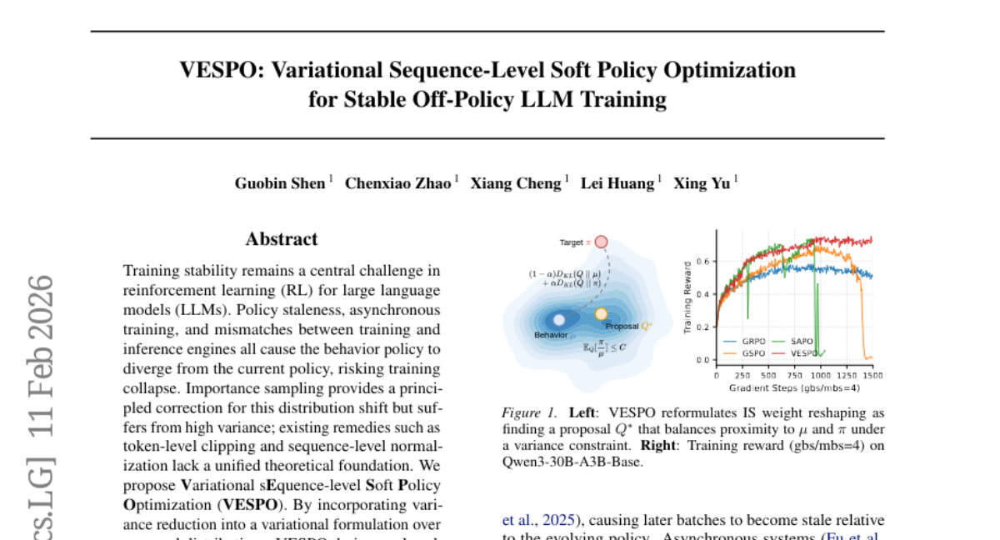
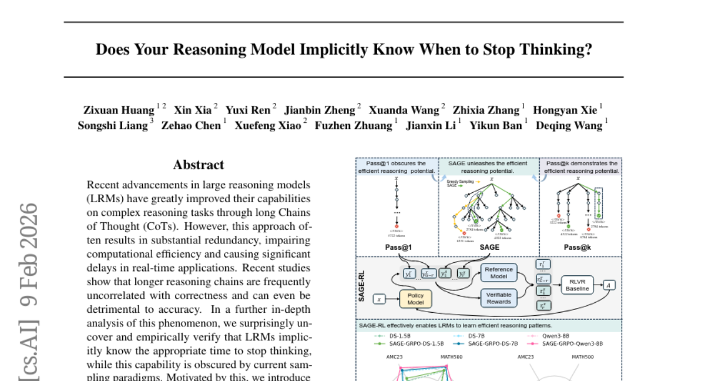
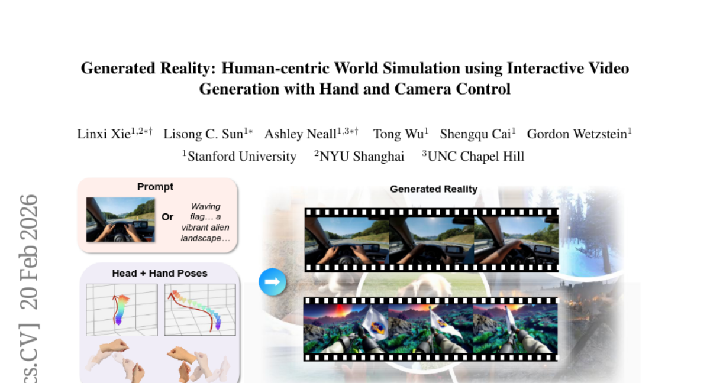
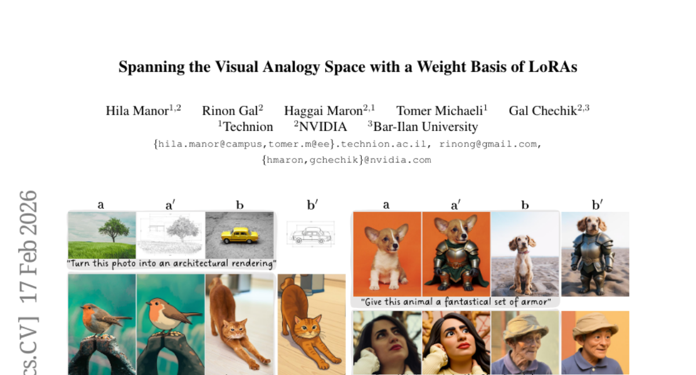
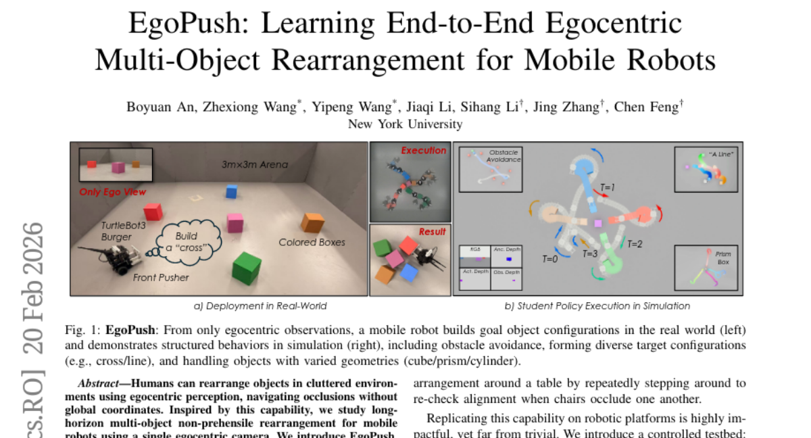
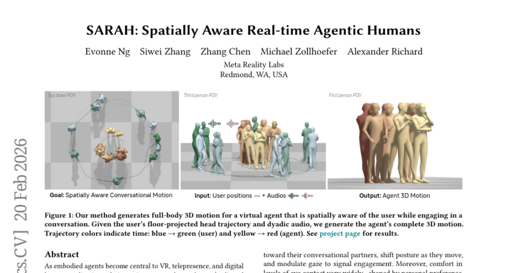
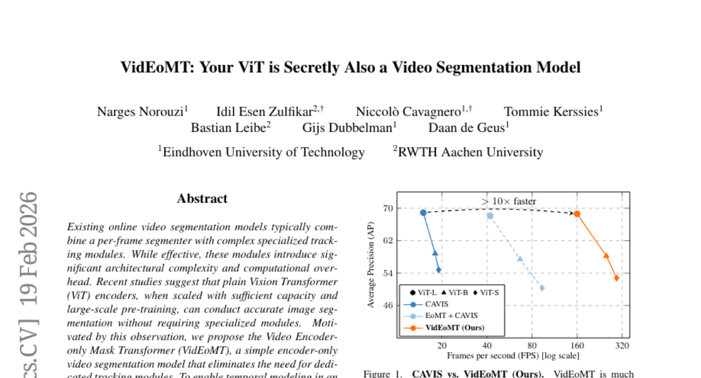
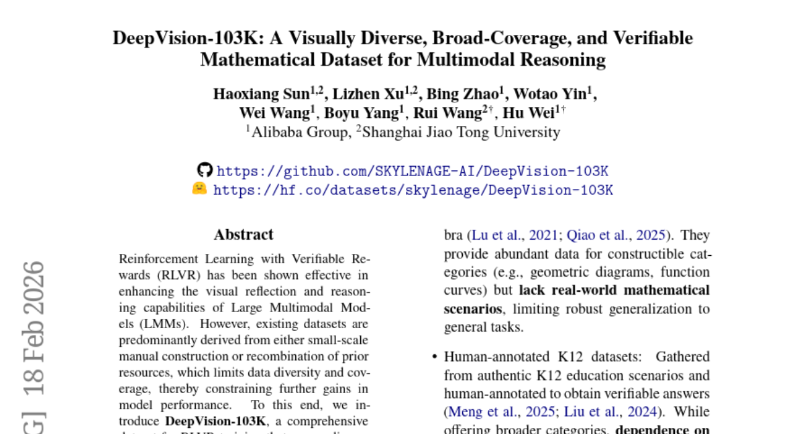

# 2026-02-24 Daily Papers (Top 9)

## 1. [VESPO: Variational Sequence-Level Soft Policy Optimization for Stable Off-Policy LLM Training](https://huggingface.co/papers/2602.10693)
**Upvotes**: 158 | **도입 난이도**: 중 | **신뢰도**: 상
**arXiv**: https://arxiv.org/abs/2602.10693

**태그**: Reinforcement Learning, LLM, Training Stability, Off-Policy, Variational Methods, Reasoning, Benchmark, Inference

### 📌 한 줄 요약
LLM 강화 학습의 불안정성 문제를 변분법 기반 분산 감소 기법으로 해결하여, 비동기 및 정책 노후화 환경에서도 안정적인 학습과 일관된 성능 향상을 제공하는 기술입니다.

### 🔑 핵심 포인트
- 시퀀스 수준 중요도 샘플링의 분산 감소를 위한 변분법 기반 이론적 프레임워크 제공
- 길이 정규화 없이 시퀀스 수준 중요도 가중치에 직접 작동하는 폐쇄형 재형성 커널 제안
- 정책 노후화 (최대 64배) 및 완전 비동기 학습 환경에서 LLM RL 학습 안정성 획기적 개선

### 🧑‍💻 개발자 관점
LLM의 RL 파인튜닝 시 학습이 불안정하여 어려움을 겪는 개발자에게 VESPO는 분산된 비동기 환경에서도 훨씬 더 안정적이고 견고한 학습 과정을 제공하여, LLM 기반 에이전트 개발 및 배포의 효율성과 신뢰성을 크게 향상시킬 수 있습니다.

### 🚀 실무 적용 아이디어
- 현재 LLM RL 파인튜닝 프로젝트에 VESPO를 적용하여 학습 안정성 개선 효과를 검증하고, 기존의 클리핑/정규화 방식과 비교 실험 수행.
- VESPO를 활용하여 의도적으로 높은 정책 노후화 비율이나 완전 비동기 학습 환경을 설정하여, 기존 방식 대비 안정성 향상폭을 측정.
- VESPO의 코드(GitHub 링크 제공)를 분석하여 실제 구현 난이도와 기존 학습 파이프라인 통합 방안을 사전 검토.

### ⚠️ 리스크/한계
- 추상적으로 '일관된 성능 향상'이라고만 언급되어, 실제 애플리케이션에서 기대할 수 있는 구체적인 성능 개선 지표가 부족함.
- 수학적 추론 벤치마크에 대한 실험 결과만 제시되어, 대화, 요약 등 다른 LLM 작업으로의 일반화 가능성에 대한 추가 검증이 필요함.
- 새로운 알고리즘이므로 도입 시 발생할 수 있는 예상치 못한 버그나 복잡한 설정 문제가 있을 수 있음.

### 📝 초록 기반 상세 설명
대규모 언어 모델(LLM)의 강화 학습(RL)은 학습 안정성 문제에 직면해 있으며, 정책 노후화, 비동기 학습, 그리고 학습/추론 엔진 불일치로 인해 정책이 발산하고 학습이 붕괴될 위험이 큽니다. 중요도 샘플링은 이러한 분포 변화를 보정하지만 분산이 높고, 기존 토큰/시퀀스 수준 해결책은 이론적 기반이 부족했습니다. 본 논문은 변분법적 틀에 분산 감소를 통합하여 시퀀스 수준 중요도 가중치에 직접 적용되는 폐쇄형 재형성 커널을 도출하는 VESPO를 제안합니다. VESPO는 수학적 추론 벤치마크에서 최대 64배의 노후화 비율과 완전 비동기 실행 환경에서도 안정적인 학습을 유지하며, 밀집 모델과 Mixture-of-Experts(MoE) 모델 모두에서 일관된 성능 향상을 제공합니다.

---

## 2. [Does Your Reasoning Model Implicitly Know When to Stop Thinking?](https://huggingface.co/papers/2602.08354)
**Upvotes**: 98 | **도입 난이도**: 중 | **신뢰도**: 상
**arXiv**: https://arxiv.org/abs/2602.08354

**태그**: LLM, Reasoning, Efficiency, Sampling, RL, Benchmark, Inference

### 📌 한 줄 요약
거대 추론 모델(LRM)이 스스로 생각 멈출 시점을 알게 하여, 추론 과정의 효율성과 정확성을 동시에 개선합니다.

### 🔑 핵심 포인트
- 거대 추론 모델(LRM)이 추론을 멈출 적절한 시점을 암묵적으로 인지하고 있음을 실증적으로 규명.
- 이러한 효율적인 추론 잠재력을 발휘하게 하는 새로운 샘플링 패러다임 SAGE 제안.
- SAGE를 그룹 기반 강화 학습(SAGE-RL)에 통합하여 LRM의 추론 정확도와 효율성을 동시에 크게 향상.

### 🧑‍💻 개발자 관점
LLM을 활용한 추론 시스템을 개발할 때, 불필요한 연산 비용과 응답 지연 문제를 겪는 경우가 많습니다. 이 연구는 모델의 추론 효율을 높여 실시간 애플리케이션의 성능을 개선하고 운영 비용을 절감하는 데 기여할 수 있습니다.

### 🚀 실무 적용 아이디어
- 현재 사용 중인 CoT 기반 LLM 애플리케이션에서 추론 체인 길이와 정확도/효율성 간의 상관관계를 분석하여 불필요한 연산 오버헤드를 확인.
- 본 연구의 SAGE와 유사한 '자기 인식적 추론 종료' 메커니즘을 지원하는 LLM 프레임워크나 API 기능이 있는지 탐색.
- 실시간 반응이 중요한 LLM 기반 에이전트 시스템에서 SAGE와 같은 효율적인 샘플링 전략 도입 가능성을 검토.

### ⚠️ 리스크/한계
- 주로 수학적 벤치마크에서 효과를 검증했으므로, 다른 도메인(예: 복잡한 비즈니스 로직, 자연어 이해)에서의 일반화 및 효과는 추가 검증이 필요함.
- SAGE가 새로운 샘플링 패러다임과 강화 학습 통합을 포함하므로, 실제 시스템에 적용하기 위해서는 ML 엔지니어링 전문 지식과 상당한 개발 노력이 필요할 수 있음.

### 📝 초록 기반 상세 설명
거대 추론 모델(LRM)은 긴 추론 과정(CoT)을 통해 복잡한 문제를 해결하지만, 이는 종종 과도한 중복을 발생시켜 비효율적이며 오히려 정확도를 저해하기도 합니다. 본 연구는 LRM이 사실상 추론을 멈출 적절한 시점을 내재적으로 인지하고 있으나, 기존 샘플링 방식 때문에 이 능력이 가려져 있음을 경험적으로 밝혀냈습니다. 이에 우리는 효율적인 추론 잠재력을 극대화하는 새로운 샘플링 패러다임인 SAGE를 제안합니다. 나아가 SAGE를 그룹 기반 강화 학습(SAGE-RL)에 통합하여, 표준 pass@1 추론에서 LRM의 추론 정확도와 효율성을 여러 까다로운 수학 벤치마크에서 현저히 향상시켰습니다.

---

## 3. [Generated Reality: Human-centric World Simulation using Interactive Video Generation with Hand and Camera Control](https://huggingface.co/papers/2602.18422)
**Upvotes**: 19 | **도입 난이도**: 상 | **신뢰도**: 상
**arXiv**: https://arxiv.org/abs/2602.18422

**태그**: Generative AI, XR, Video Generation, Human-Computer Interaction, Diffusion Model, Video, Evaluation, Distillation

### 📌 한 줄 요약
XR 환경에서 사용자의 머리와 손 움직임을 직접 제어하여 실감 나는 가상 환경을 생성하고, 사용자 제어감과 작업 성능을 향상시키는 인간 중심 비디오 생성 모델을 개발했습니다.

### 🔑 핵심 포인트
- 사용자의 머리 및 관절 레벨 손 포즈를 직접 제어 입력으로 받는 인간 중심 비디오 월드 모델 제안.
- 정교한 손-객체 상호작용을 가능하게 하는 3D 머리 및 손 제어 메커니즘(확산 트랜스포머 컨디셔닝) 개발.
- 양방향 비디오 확산 모델을 실제 상호작용 가능한 인과적 시스템으로 증류하여, 높은 사용자 제어감과 작업 성능을 달성.

### 🧑‍💻 개발자 관점
XR 애플리케이션 개발 시, 사용자의 실제 몸동작을 통한 직관적인 가상 환경 제어가 가능해져 훨씬 몰입감 있고 자연스러운 사용자 경험을 구현할 수 있는 기반 기술을 제공합니다. 이는 특히 실감형 콘텐츠, 트레이닝 시뮬레이션 등에서 활용 가치가 높습니다.

### 🚀 실무 적용 아이디어
- Meta Quest나 OpenXR 등의 핸드/헤드 트래킹 SDK를 활용하여 사용자 입력 데이터(포즈, 움직임)를 실시간으로 추출하고 전처리하는 파이프라인 구축을 시도해봅니다.
- 기존 오픈소스 비디오 생성 모델(예: AnimateDiff 등)에 간단한 3D 포즈 정보(예: 미리 정의된 아바타의 헤드/핸드 조인트)를 컨디셔닝 입력으로 주입하여, 제어 가능성을 탐색하는 PoC(Proof of Concept)를 진행합니다.
- 논문에서 제시된 '효과적인 3D 헤드 및 손 제어 메커니즘'의 세부 구현 방식을 파악하고, 이를 기존 Diffusion Transformer 기반 모델에 적용하여 미세 조정을 시도해봅니다.

### ⚠️ 리스크/한계
- 실시간으로 고품질의 가상 환경을 생성하는 데 필요한 막대한 컴퓨팅 자원과 모델 학습 비용이 상업적 서비스 및 엣지 디바이스 적용에 큰 제약이 될 수 있습니다.
- 머리 및 손 포즈 트래킹의 정확성과 강건성이 다양한 실제 환경에서 충분히 확보되지 않을 경우, 사용자 제어감 저하 및 비정상적인 비디오 생성으로 이어질 수 있습니다.

### 📝 초록 기반 상세 설명
확장 현실(XR)은 사용자의 실제 움직임에 반응하는 생성 모델을 필요로 하지만, 기존 비디오 월드 모델은 텍스트나 키보드 같은 제한적인 제어 신호만 받아들여 실제 몸으로 상호작용하는 데 한계가 있었습니다. 본 논문은 사용자의 트래킹된 머리 포즈와 관절 레벨의 손 포즈를 모두 조건으로 사용하는 인간 중심 비디오 월드 모델을 소개합니다. 이를 위해 확산 트랜스포머 컨디셔닝 전략을 평가하고 3D 머리 및 손 제어에 효과적인 메커니즘을 제안하여 정교한 손-객체 상호작용을 가능하게 합니다. 우리는 이 전략으로 양방향 비디오 확산 모델 교사를 학습시키고 이를 인과적, 상호작용적 시스템으로 증류하여 1인칭 가상 환경을 생성합니다. 인간 피험자를 대상으로 한 평가 결과, 관련 베이스라인 대비 향상된 작업 성능과 훨씬 높은 수준의 제어감을 입증했습니다.

---

## 4. [Spanning the Visual Analogy Space with a Weight Basis of LoRAs](https://huggingface.co/papers/2602.15727)
**Upvotes**: 9 | **도입 난이도**: 중 | **신뢰도**: 상
**arXiv**: https://arxiv.org/abs/2602.15727

**태그**: Vision, LoRA, Generative AI, Image Manipulation, Machine Learning, Evaluation, Inference

### 📌 한 줄 요약
시각적 유추 학습에서 단일 LoRA의 한계를 극복하고, LoRA 가중치 기반을 동적으로 조합하여 이미지 변환의 일반화 성능을 획기적으로 향상시키는 기술입니다.

### 🔑 핵심 포인트
- 시각적 변환을 위한 LoRA 모듈의 학습 가능한 '기저(basis)' 제안
- 입력 유추 쌍에 기반하여 기저 LoRA들을 동적으로 선택하고 가중치를 부여하는 경량 인코더 도입
- LoRA 기반 분해가 유연한 시각 조작에 유망한 방향임을 입증하여 일반화 성능 크게 개선

### 🧑‍💻 개발자 관점
개발자는 이 기술을 활용하여 텍스트로는 표현하기 어려운 복잡한 이미지 변환 작업을 훨씬 더 유연하고 정교하게 제어할 수 있으며, 다양한 시각적 조작 시나리오에 대한 모델의 일반화 능력을 높일 수 있습니다.

### 🚀 실무 적용 아이디어
- 자신이 다루는 특정 이미지 조작(예: 스타일 전이, 객체 변형) 시나리오에 대해 LoRWeB의 일반화 성능을 평가해 볼 것
- 다양한 크기 또는 구성의 LoRA 기저 모듈이 성능 및 추론 시간에 미치는 영향을 탐색해 볼 것
- 기존 T2I 모델에 LoRWeB를 통합하여 사용자가 제공하는 시각적 예시를 통한 이미지 변환 기능을 추가하는 실험을 해볼 것

### ⚠️ 리스크/한계
- LoRA 기저와 인코더 학습에 필요한 데이터셋 구성 및 학습 비용이 클 수 있음
- 동적으로 조합되는 LoRA들의 수가 많아질 경우, 추론 시 오버헤드가 증가할 가능성

### 📝 초록 기반 상세 설명
시각적 유추 학습은 텍스트 설명 없이 데모를 통해 이미지를 조작할 수 있게 해줍니다. 기존 방식은 단일 LoRA 모듈을 사용하지만, 다양한 시각적 변환 공간을 포착하는 데 한계가 있어 일반화 성능이 저조했습니다. 이에 LoRWeB는 학습 가능한 LoRA 모듈의 기저(basis)와 경량 인코더를 도입하여, 추론 시 각 유추 작업에 맞춰 이 기저 LoRA들을 동적으로 선택하고 가중치를 부여합니다. 이를 통해 SOTA 성능을 달성하고, 이전에 본 적 없는 시각적 변환에 대한 일반화 능력을 크게 향상시켰습니다.

### 🖼️ 추가 자료

---

## 5. [Decoding as Optimisation on the Probability Simplex: From Top-K to Top-P (Nucleus) to Best-of-K Samplers](https://huggingface.co/papers/2602.18292)
**Upvotes**: 8 | **도입 난이도**: 중 | **신뢰도**: 상
**arXiv**: https://arxiv.org/abs/2602.18292

**태그**: LLM, Decoding, Sampling, Optimization, Generative AI, RAG

_to_Best-of-K_Sampl_img.jpg)

### 📌 한 줄 요약
언어 모델 디코딩을 최적화 문제로 재정의하여 기존 샘플링 방식을 통합하고, Best-of-K 같은 새롭고 효과적인 디코더를 설계해 LLM 성능을 크게 향상시킬 수 있습니다.

### 🔑 핵심 포인트
- 다양한 기존 디코딩 전략(Greedy, Softmax, Top-K, Top-P, Sparsemax)을 확률 심플렉스 상의 단일 최적화 문제로 통합하고 원리를 명확히 함.
- 휴리스틱한 방식이 아닌, 원칙적인 최적화 기반으로 새로운 디코더를 쉽게 설계할 수 있는 프레임워크를 제시함.
- 다중 샘플 파이프라인(self-consistency, reranking)을 위한 KL-anchored coverage 기반의 Best-of-K(BoK) 디코더를 제안하여 LLM의 문제 해결 정확도를 크게 개선함.

### 🧑‍💻 개발자 관점
이 연구는 개발자들이 LLM의 출력 품질과 다양성을 보다 체계적이고 효과적으로 제어할 수 있게 하여, 특히 복잡한 추론이나 다중 샘플링이 필요한 시나리오에서 LLM의 실용적인 가치를 높입니다.

### 🚀 실무 적용 아이디어
- 현재 LLM 애플리케이션의 multi-sample 파이프라인(예: self-consistency, RAG reranking)에 Best-of-K(BoK) 샘플링 전략을 적용하여 성능 개선 여부를 실험합니다.
- 기존에 사용하던 Top-K, Top-P 같은 디코딩 방식이 이 논문의 최적화 프레임워크에서 어떤 의미를 가지는지 이해하고, 특정 태스크에 맞춤화된 디코더 설계 가능성을 탐색합니다.
- 새로운 디코더 설계 시, 휴리스틱 대신 이 논문에서 제시하는 '모델 점수 vs 구조적 선호' 트레이드오프 관점에서 목표 함수를 정의하고 구현해봅니다.

### ⚠️ 리스크/한계
- 제안된 최적화 프레임워크와 BoK 디코더의 이점을 완전히 활용하려면 최적화 개념에 대한 이해가 필요할 수 있습니다.
- 실제 성능 향상 폭은 LLM 모델, 특정 태스크, 샘플링 온도 및 K 값 설정에 따라 다를 수 있으므로, 광범위한 검증이 필요합니다.

### 📝 초록 기반 상세 설명
언어 모델 디코딩은 LLM 활용의 핵심 요소임에도 불구하고, 여전히 휴리스틱한 튜닝 방식으로 다루어지고 있습니다. 본 연구는 디코딩을 확률 심플렉스 상에서 모델 점수와 구조적 선호를 절충하는 정규화된 최적화 문제로 접근해야 한다고 주장합니다. 이 단일 프레임워크는 Greedy, Softmax, Top-K, Top-P 등 기존 디코딩 방식을 통합하고 그 최적성 조건을 설명합니다. 나아가 이 프레임워크를 통해 Best-of-K(BoK)와 같은 새로운 디코더를 설계했으며, 이는 multi-sample 파이프라인(예: self-consistency, reranking)에서 좋은 대안을 커버하는 것을 목표로 합니다. BoK는 Qwen2.5-Math-7B 모델에서 MATH500 태스크의 정확도를 최대 +18.6% 향상시키는 등 뛰어난 성능 개선을 보였습니다.

---

## 6. [EgoPush: Learning End-to-End Egocentric Multi-Object Rearrangement for Mobile Robots](https://huggingface.co/papers/2602.18071)
**Upvotes**: 5 | **도입 난이도**: 상 | **신뢰도**: 상
**arXiv**: https://arxiv.org/abs/2602.18071

**태그**: Robot Learning, Reinforcement Learning, Computer Vision, Mobile Robotics, End-to-End Learning, Vision, Video, Distillation

### 📌 한 줄 요약
모바일 로봇이 값비싼 센서 없이도 사람처럼 시야 기반으로 여러 물체를 재배치하도록 학습하는 프레임워크를 제안하여, 복잡한 환경에서의 로봇 자율성을 크게 향상시킵니다.

### 🔑 핵심 포인트
- 전역 상태 추정 없이 단일 시야각 카메라만으로 모바일 로봇의 다중 물체 비집기 재배치 가능 정책 학습.
- 물체 간의 '상대적' 공간 관계를 인코딩하는 물체 중심 잠재 공간(object-centric latent space) 설계.
- 교사-학생 학습 방식: 시야가 제한된 교사 모델이 시각적 단서 기반의 활성 인지 행동을 유도하고, 이를 순수 시각 학생 모델로 전이.

### 🧑‍💻 개발자 관점
이 연구는 값비싼 전역 센서나 정밀한 위치 추정 없이도 로봇이 복잡하고 동적인 환경에서 물체를 능숙하게 조작할 수 있는 실용적인 길을 제시합니다. 이는 창고 자동화, 서비스 로봇 등 다양한 분야에서 로봇의 자율성과 강건성을 높이는 데 핵심적인 기술이 될 수 있습니다.

### 🚀 실무 적용 아이디어
- 논문에서 공개한 코드와 영상을 심층 분석하여 EgoPush의 아키텍처와 학습 전략을 이해하고, 자사의 로봇 조작 태스크에 적용 가능성을 탐구.
- 물체 중심 잠재 공간(object-centric latent space) 아이디어를 자사 로봇의 환경 인지 및 상태 표현 방식에 적용하여 로버스트한 제어 모델 개발을 시도.
- 장기적 로봇 태스크에서 보상 희소성 문제를 해결하기 위한 '단계별 문제 분해 및 시간 감쇠 보상' 전략을 벤치마킹하여 자사 강화 학습 프로젝트에 도입.

### ⚠️ 리스크/한계
- 밀어서 재배치(non-prehensile) 방식은 물체를 직접 잡는(prehensile) 방식보다 조작 가능한 물체의 종류나 정밀도에 한계가 있을 수 있습니다.
- 교사 학습에 사용되는 'sparse keypoints'의 안정적인 추출과 새로운 물체 및 환경에 대한 확장성이 실제 적용 시 중요한 도전 과제가 될 수 있습니다.
- 제로샷 Sim-to-Real 전이가 성공적이라 할지라도, 실제 환경의 예상치 못한 변수나 도메인 갭으로 인해 특정 엣지 케이스에서는 여전히 성능 저하가 발생할 수 있습니다.

### 📝 초록 기반 상세 설명
기존 로봇은 전역 좌표에 의존하여 물체 재배치에 한계가 있었고, 특히 동적인 장면에서 실패율이 높았습니다. 본 연구는 사람이 시야 기반으로 물체를 다루는 방식에 영감을 받아, 단일 시야각 카메라만으로 모바일 로봇의 다중 물체 비집기 재배치(non-prehensile rearrangement)를 가능하게 하는 EgoPush 프레임워크를 제안합니다. EgoPush는 절대적 자세 대신 물체 간의 상대적 공간 관계를 인코딩하는 물체 중심 잠재 공간을 설계하며, 전역 상태 추정 없이 지각 기반으로 동작합니다. 또한, 시야 제한 교사 모델로부터 순수 시각 학생 모델로 지식을 전이하는 교사-학생 학습과, 장기적 보상 할당을 위한 단계별 문제 분해 및 시간 감쇠 보상 방식을 도입합니다. 광범위한 시뮬레이션 실험에서 기존 종단 간 RL 방식보다 현저히 높은 성공률을 보였으며, 실제 로봇에서도 성공적인 제로샷 Sim-to-Real 전이를 입증했습니다.

---

## 7. [SARAH: Spatially Aware Real-time Agentic Humans](https://huggingface.co/papers/2602.18432)
**Upvotes**: 4 | **도입 난이도**: 중 | **신뢰도**: 상
**arXiv**: https://arxiv.org/abs/2602.18432

**태그**: Agent, VR, Real-time, Motion Synthesis, Generative AI, Audio, Inference, Safety

### 📌 한 줄 요약
실시간 VR 환경에서 사용자의 위치와 음성에 반응하여 자연스러운 몸짓, 방향 전환, 시선 처리를 제공하는 공간 인지형 AI 에이전트 생성 기술입니다.

### 🔑 핵심 포인트
- 사용자 위치와 오디오를 기반으로 실시간 공간 인지 대화 동작을 생성하는 최초의 완전 인과적 방법론.
- 인과적 트랜스포머 VAE와 인터리브드 잠재 토큰, 그리고 플로우 매칭 모델을 결합한 독창적인 아키텍처.
- 모델 학습과 제어를 분리하여 사용자가 추론 시 시선 접촉 강도를 조절할 수 있는 시선 점수 메커니즘 도입.

### 🧑‍💻 개발자 관점
이 기술은 VR/AR, 메타버스, 디지털 휴먼, 텔레프레즌스 등에서 사용자 경험을 혁신할 수 있습니다. 개발자는 훨씬 더 자연스럽고 반응성이 뛰어난 AI 에이전트를 구축하여 현실감 있는 상호작용을 구현할 수 있게 됩니다.

### 🚀 실무 적용 아이디어
- SARAH 기술을 기존 VR/AR 애플리케이션에 통합하여 에이전트와의 상호작용 품질 개선 효과를 검증해볼 것.
- 제공되는 시선 제어 메커니즘을 활용하여 다양한 에이전트 페르소나(예: 수줍음, 적극적)를 구현하고 사용자 반응을 테스트할 것.
- 보고된 성능(300 FPS)을 실제 사용 환경의 다양한 하드웨어(예: 보급형 VR 헤드셋)에서 벤치마킹하여 실용성을 평가할 것.

### ⚠️ 리스크/한계
- 모델의 복잡성으로 인해 특정 환경 및 하드웨어에서의 최적화 및 배포에 높은 전문성이 요구될 수 있습니다.
- 보고된 결과는 특정 데이터셋(Embody 3D)에 기반하므로, 다른 언어나 문화적 맥락에서 자연스러운 동작을 생성하기 위한 추가 학습이나 미세 조정이 필요할 수 있습니다.

### 📝 초록 기반 상세 설명
VR, 텔레프레즌스 등에서 몰입감 있는 경험을 제공하기 위해 에이전트는 단순한 음성 기반 제스처를 넘어 사용자에게 반응하고 자연스럽게 상호작용해야 합니다. 기존 방법들은 이러한 공간 인지 능력이 부족하여 에이전트가 사용자의 움직임에 동적으로 반응하지 못하는 문제가 있었습니다. 이 연구는 사용자 위치와 대화 오디오를 기반으로 실시간으로 전신 동작을 생성하는 최초의 완전 인과적(causal) 방법을 제안합니다. 제안된 아키텍처는 인과적 트랜스포머 VAE와 플로우 매칭 모델을 결합하며, 시선 제어를 위한 분류기 없는 안내(classifier-free guidance) 기반 시선 점수 메커니즘을 도입했습니다. 결과적으로 Embody 3D 데이터셋에서 300 FPS 이상의 속도로 최신 기술 수준의 모션 품질을 달성했으며, 실시간 VR 시스템에서 성공적으로 검증되었습니다.

---

## 8. [VidEoMT: Your ViT is Secretly Also a Video Segmentation Model](https://huggingface.co/papers/2602.17807)
**Upvotes**: 3 | **도입 난이도**: 하 | **신뢰도**: 상
**arXiv**: https://arxiv.org/abs/2602.17807

**태그**: Vision, Video Segmentation, Transformer, Real-time, Video

### 📌 한 줄 요약
복잡한 트래킹 모듈 없이 인코더 온리 ViT 기반으로 비디오 분할 모델을 5~10배 빠르게 만들어 최대 160FPS를 달성하며 경쟁력 있는 성능을 제공합니다.

### 🔑 핵심 포인트
- 복잡한 트래킹 모듈 없이 비디오 분할을 수행하는 인코더 온리 ViT 모델(VidEoMT) 제안
- 경량 쿼리 전파 및 쿼리 융합 전략을 통해 트래커의 이점을 유지하면서 시간적 일관성 확보
- 경쟁력 있는 정확도를 유지하며 기존 모델 대비 5~10배 빠른 속도(최대 160 FPS) 달성

### 🧑‍💻 개발자 관점
비디오 분할 모델의 아키텍처 복잡성을 크게 줄이고 계산 비용을 낮춰, 실시간 비디오 처리 및 배포 시 성능 향상에 기여할 수 있습니다.

### 🚀 실무 적용 아이디어
- 제공된 코드를 활용하여 특정 비디오 분할 태스크(예: 자율주행, CCTV 분석)에 대한 성능 및 속도 테스트 수행
- 다양한 ViT 백본 사이즈(예: ViT-B, ViT-S)를 사용하여 정확도와 속도 간의 트레이드오프를 평가
- 새로운 쿼리 전파 및 융합 메커니즘이 장기적인 객체 추적 또는 빠른 객체 변화 환경에서 어떻게 동작하는지 검토

### ⚠️ 리스크/한계
- "경쟁력 있는 정확도"가 모든 시나리오에서 최신 기술(SOTA) 수준을 의미하지 않을 수 있으며, 특정 복잡한 상황에서는 정확도 저하가 있을 수 있음
- 쿼리 전파 메커니즘이 매우 빠른 객체 변화, 장기적인 객체 가려짐 또는 신규 객체 다수 출현 시 강건성 문제를 가질 수 있음

### 📝 초록 기반 상세 설명
기존 온라인 비디오 분할 모델은 프레임별 분할기와 복잡한 트래킹 모듈을 결합하지만, 이러한 모듈은 아키텍처 복잡성과 계산 오버헤드를 야기합니다. 본 연구는 대규모 사전 학습된 ViT 인코더가 특수 모듈 없이도 이미지 분할을 잘 수행한다는 점에 착안하여, 전용 트래킹 모듈을 제거한 인코더 온리 모델인 VidEoMT를 제안합니다. VidEoMT는 이전 프레임의 쿼리를 재사용하는 경량 쿼리 전파 메커니즘과 새로운 콘텐츠에 대한 적응성을 위한 쿼리 융합 전략을 통해 시간적 모델링을 가능하게 합니다. 결과적으로 VidEoMT는 추가 복잡성 없이 트래커의 이점을 얻어 경쟁력 있는 정확도를 달성하며, ViT-L 백본으로 최대 160 FPS의 속도로 5~10배 더 빠릅니다.

---

## 9. [DeepVision-103K: A Visually Diverse, Broad-Coverage, and Verifiable Mathematical Dataset for Multimodal Reasoning](https://huggingface.co/papers/2602.16742)
**Upvotes**: 2 | **도입 난이도**: 중 | **신뢰도**: 상
**arXiv**: https://arxiv.org/abs/2602.16742

**태그**: Vision, LLM, Dataset, Reinforcement Learning, Multimodal, RAG, Reasoning, Benchmark

### 📌 한 줄 요약
DeepVision-103K는 시각 요소를 포함한 K12 수학 문제에 특화된 LMM 학습 데이터셋으로, 모델의 멀티모달 추론 능력과 시각적 이해도를 크게 향상시켜 정확한 AI 시스템 개발에 기여합니다.

### 🔑 핵심 포인트
- 시각적 다양성과 광범위한 커버리지를 가진 대규모 수학 멀티모달 데이터셋 DeepVision-103K 구축 및 공개
- RLVR(Reinforcement Learning with Verifiable Rewards) 훈련을 위한 최적화된 데이터셋 제공
- LMM의 시각적 인지, 반영 및 수학적 추론 능력 현저한 향상 입증

### 🧑‍💻 개발자 관점
이 데이터셋은 시각 정보를 이해하고 수학적 문제를 해결해야 하는 AI 시스템, 특히 LMM의 성능을 직접적으로 개선할 수 있는 강력한 자원입니다. 개발자는 이를 활용하여 더욱 정확하고 신뢰성 높은 멀티모달 AI 에이전트 및 애플리케이션을 구축할 수 있습니다.

### 🚀 실무 적용 아이디어
- DeepVision-103K 데이터셋을 다운로드하여 기존 LMM의 수학적/시각적 추론 능력 파인튜닝에 즉시 활용
- DeepVision-103K를 활용하여 강화 학습 기반의 새로운 멀티모달 모델 훈련 파이프라인 구축 및 실험
- DeepVision으로 훈련된 모델과 기존 모델의 멀티모달 수학 벤치마크 성능을 비교 분석하여 개선 효과 정량화

### ⚠️ 리스크/한계
- K12 수학 주제에 초점이 맞춰져 있어 고등 수학이나 다른 복잡한 과학/공학 도메인에서의 효과는 추가 검증이 필요함
- 강화 학습(RLVR) 설정의 복잡성으로 인해 최적의 학습 환경 구축 및 튜닝에 상당한 시간과 자원이 소요될 수 있음
- 데이터셋 생성 방식(예: 합성 데이터 비율)에 대한 자세한 정보가 부족하여 잠재적인 데이터 편향이나 한계에 대한 고려가 필요함

### 📝 초록 기반 상세 설명
검증 가능한 보상 기반 강화 학습(RLVR)은 대규모 멀티모달 모델(LMM)의 시각적 추론 능력 향상에 효과적임이 입증되었습니다. 하지만 기존 데이터셋은 다양성과 커버리지 측면에서 한계가 있어 모델 성능 개선에 제약이 있었습니다. 이에 본 연구는 다양한 K12 수학 주제, 방대한 지식 포인트 및 풍부한 시각적 요소를 포함하는 포괄적인 RLVR 훈련 데이터셋인 DeepVision-103K를 제안합니다. DeepVision으로 훈련된 모델은 멀티모달 수학 벤치마크에서 강력한 성능을 보였고, 일반적인 멀티모달 추론 작업에도 효과적으로 일반화됨을 확인했습니다. 추가 분석 결과, 훈련된 모델의 시각적 인지, 반영 및 추론 능력이 향상되어 DeepVision이 멀티모달 추론 발전에 효과적임을 검증합니다.

---

