# 2026-02-27 Daily Papers (Top 9)

## 1. [HyTRec: A Hybrid Temporal-Aware Attention Architecture for Long Behavior Sequential Recommendation](https://huggingface.co/papers/2602.18283)
**Upvotes**: 44 | **도입 난이도**: 중 | **신뢰도**: 상
**arXiv**: https://arxiv.org/abs/2602.18283

**태그**: Recommendation System, Attention Mechanism, Sequential Recommendation, Long Sequence, Temporal Modeling, RAG, Evaluation, Inference

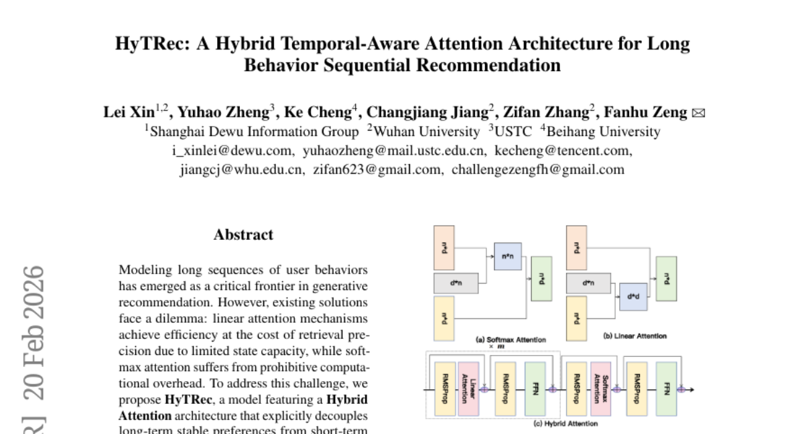

### 📌 한 줄 요약
HyTRec은 선형 어텐션과 소프트맥스 어텐션을 결합하여 긴 사용자 행동 시퀀스 모델링의 효율성과 정확성을 동시에 높이고, 특히 초장기 시퀀스에서 추천 성능을 크게 향상시킨다.

### 🔑 핵심 포인트
- 선형 어텐션과 소프트맥스 어텐션을 결합한 하이브리드 어텐션 구조 제안
- Temporal-Aware Delta Network (TADN)을 통한 최신 행동 신호 강화 및 과거 노이즈 억제
- 산업 규모 데이터셋에서 초장기 시퀀스 추천 성능 향상 (Hit Rate 8% 이상)

### 🧑‍💻 개발자 관점
긴 시퀀스 데이터를 효율적으로 처리하고 추천 정확도를 높여 사용자 경험을 개선할 수 있으며, 특히 사용자 행동 로그가 방대한 서비스에 유용하다.

### 🚀 실무 적용 아이디어
- HyTRec 모델 구조를 기반으로 자사 서비스 데이터에 맞는 하이브리드 어텐션 전략 실험
- TADN을 활용하여 시간 흐름에 따른 사용자 관심사 변화를 모델링하는 방식 적용
- 기존 모델과 HyTRec을 A/B 테스트하여 성능 비교

### ⚠️ 리스크/한계
- 하이브리드 어텐션 구조의 최적 파라미터 튜닝 필요
- TADN의 효과는 데이터 특성에 따라 달라질 수 있음

### 📝 초록 기반 상세 설명
긴 사용자 행동 시퀀스를 모델링하는 것은 추천 시스템에서 중요한 과제이지만, 기존 방식은 효율성과 정확성 사이의 trade-off가 존재한다. 선형 어텐션은 효율적이지만 정확도가 떨어지고, 소프트맥스 어텐션은 계산 비용이 높다. 이러한 문제점을 해결하기 위해 HyTRec은 장기적인 선호도와 단기적인 관심 변화를 분리하여 처리하는 하이브리드 어텐션 구조를 제안한다. 선형 어텐션은 긴 시퀀스를 처리하고, 소프트맥스 어텐션은 최근 상호작용에 집중한다. 또한 Temporal-Aware Delta Network (TADN)을 통해 최신 행동 신호를 강화하고 과거 노이즈를 억제한다. 산업 규모 데이터셋에서 HyTRec은 선형 추론 속도를 유지하면서 강력한 베이스라인을 능가하며, 특히 초장기 시퀀스 사용자에게서 Hit Rate가 8% 이상 향상되었다.

---

## 2. [MolHIT: Advancing Molecular-Graph Generation with Hierarchical Discrete Diffusion Models](https://huggingface.co/papers/2602.17602)
**Upvotes**: 40 | **도입 난이도**: 중 | **신뢰도**: 상
**arXiv**: https://arxiv.org/abs/2602.17602

**태그**: Graph Neural Network, Drug Discovery, Molecular Generation, Diffusion Model

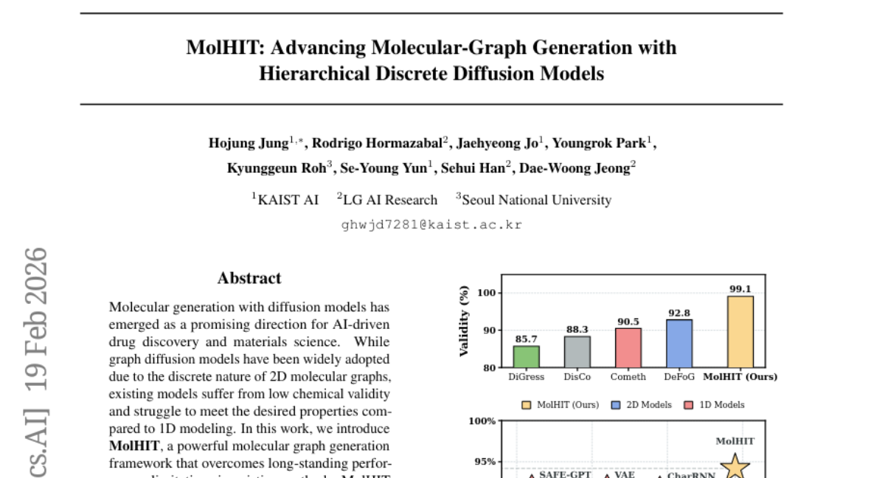

### 📌 한 줄 요약
MolHIT은 계층적 이산 확산 모델을 사용하여 분자 그래프 생성의 화학적 유효성을 높이고, MOSES 데이터셋에서 SOTA를 달성하여 AI 기반 신약 개발 및 재료 과학에 기여할 수 있다.

### 🔑 핵심 포인트
- 계층적 이산 확산 모델 기반의 새로운 분자 그래프 생성 프레임워크 MolHIT 제시
- 화학적 우선순위를 고려한 이산 확산 일반화 및 원자 역할 기반 인코딩 적용
- MOSES 데이터셋에서 SOTA 달성 및 다운스트림 작업에서 강력한 성능 입증

### 🧑‍💻 개발자 관점
화학 구조를 생성하는 AI 모델의 성능을 향상시켜 신약 개발 및 재료 과학 분야에서 새로운 물질 발견 가능성을 높일 수 있다. 특히, 화학적 유효성이 높은 분자 구조를 생성하는 데 유용하다.

### 🚀 실무 적용 아이디어
- MolHIT 모델을 활용하여 특정 속성을 가진 분자 구조 생성 실험 진행
- 기존 그래프 생성 모델과 MolHIT의 성능 비교 분석
- MolHIT 모델을 기반으로 새로운 분자 생성 모델 개발

### ⚠️ 리스크/한계
- 모델의 복잡성으로 인해 학습 및 추론에 많은 계산 자원이 필요할 수 있음
- 생성된 분자의 실제 합성 가능성 및 안정성에 대한 추가 검증 필요

### 📝 초록 기반 상세 설명
분자 생성 분야에서 그래프 확산 모델은 2D 분자 그래프의 이산적 특성으로 인해 널리 사용되지만, 기존 모델은 낮은 화학적 유효성과 원하는 속성을 충족시키기 어렵다는 문제가 있다. 본 연구에서는 계층적 이산 확산 모델(Hierarchical Discrete Diffusion Model)을 기반으로 하는 강력한 분자 그래프 생성 프레임워크인 MolHIT을 제안하여 기존 방법의 성능 제한을 극복한다. MolHIT은 화학적 우선순위를 인코딩하는 추가 카테고리로 이산 확산을 일반화하고, 원자 유형을 화학적 역할에 따라 분리하는 원자 인코딩을 사용한다. MolHIT은 MOSES 데이터셋에서 거의 완벽한 유효성으로 새로운 SOTA 성능을 달성했으며, 다중 속성 유도 생성 및 스캐폴드 확장과 같은 다운스트림 작업에서도 강력한 성능을 입증했다.

---

## 3. [DreamID-Omni: Unified Framework for Controllable Human-Centric Audio-Video Generation](https://huggingface.co/papers/2602.12160)
**Upvotes**: 28 | **도입 난이도**: 중 | **신뢰도**: 상
**arXiv**: https://arxiv.org/abs/2602.12160

**태그**: Audio-Video, Generation, Diffusion Model, Transformer, Human-Centric, RAG, Video, Audio

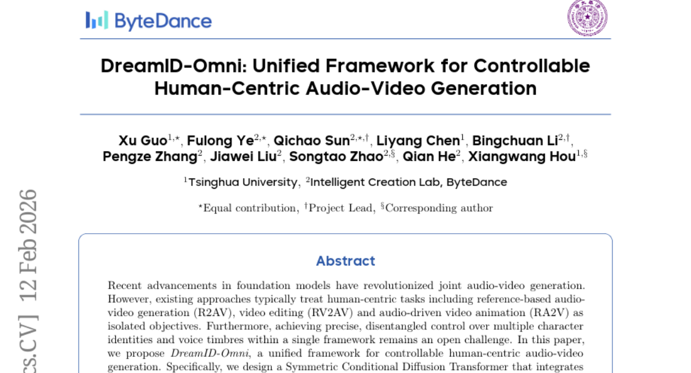

### 📌 한 줄 요약
DreamID-Omni는 사람 중심 오디오-비디오 생성 작업을 통합하고, 다중 ID 및 음색 제어를 가능하게 하여 기존 상용 모델을 능가하는 성능을 제공하는 프레임워크입니다.

### 🔑 핵심 포인트
- 사람 중심 오디오-비디오 생성 작업을 통합하는 DreamID-Omni 프레임워크 제안
- 다중 ID 및 음색 제어를 위한 이중 레벨 분리 전략 도입
- 약하게 제약된 사전 지식을 활용한 다중 작업 점진적 훈련 방식 개발

### 🧑‍💻 개발자 관점
DreamID-Omni는 오디오-비디오 생성 모델 개발 시 다양한 사람 중심 작업을 통합하고, ID 및 음색 제어 기능을 향상시켜 더욱 현실감 있는 콘텐츠 제작에 기여할 수 있습니다.

### 🚀 실무 적용 아이디어
- DreamID-Omni 프레임워크를 사용하여 특정 캐릭터의 오디오-비디오 생성 실험
- 이중 레벨 분리 전략을 다양한 데이터셋에 적용하여 ID-음색 제어 성능 평가
- 다중 작업 점진적 훈련 방식을 다른 생성 모델에 적용하여 성능 향상 가능성 검토

### ⚠️ 리스크/한계
- 복잡한 구조로 인해 학습 및 추론에 많은 리소스가 필요할 수 있음
- 특정 데이터셋에 과적합될 가능성이 있으며, 일반화 성능 확보가 중요함

### 📝 초록 기반 상세 설명
최근 파운데이션 모델의 발전으로 오디오-비디오 생성 분야가 혁신되었지만, 기존 연구들은 참조 기반 오디오-비디오 생성, 비디오 편집, 오디오 기반 비디오 애니메이션과 같은 사람 중심 작업을 개별적으로 다루었습니다. 또한, 단일 프레임워크 내에서 여러 캐릭터의 ID와 음색을 정확하게 제어하는 데 어려움이 있었습니다. 본 논문에서는 제어 가능한 사람 중심 오디오-비디오 생성을 위한 통합 프레임워크인 DreamID-Omni를 제안합니다. 이 프레임워크는 이종 조건 신호를 통합하는 대칭 조건부 확산 트랜스포머를 사용하고, ID-음색 바인딩 실패 및 화자 혼동 문제를 해결하기 위해 이중 레벨 분리 전략을 도입했습니다. 또한, 약하게 제약된 생성적 사전 지식을 활용하여 강력하게 제약된 작업을 정규화하는 다중 작업 점진적 훈련 방식을 개발했습니다. 실험 결과, DreamID-Omni는 비디오, 오디오 및 오디오-비디오 일관성 측면에서 최첨단 성능을 달성했으며, 상용 모델보다도 뛰어났습니다.

---

## 4. [SkyReels-V4: Multi-modal Video-Audio Generation, Inpainting and Editing model](https://huggingface.co/papers/2602.21818)
**Upvotes**: 18 | **도입 난이도**: 중 | **신뢰도**: 중
**arXiv**: https://arxiv.org/abs/2602.21818

**태그**: Video Generation, Audio Generation, Multi-modal, Diffusion Model, Inpainting, RAG, Multimodal, Vision, Video, Audio

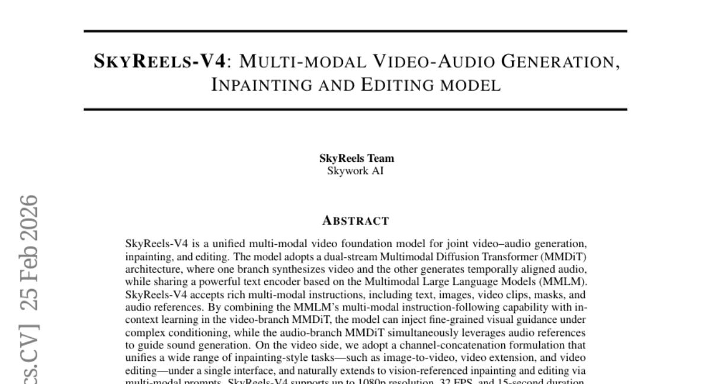

### 📌 한 줄 요약
SkyReels V4는 1080p 해상도, 32 FPS, 15초 길이의 비디오와 오디오를 동시에 생성, 편집, 인페인팅할 수 있는 효율적인 멀티모달 비디오 파운데이션 모델로, 고품질 시네마틱 콘텐츠 제작에 활용될 수 있습니다.

### 🔑 핵심 포인트
- 멀티모달 입력을 통한 비디오 및 오디오 동시 생성, 인페인팅, 편집 기능 통합
- 듀얼 스트림 MMDiT 아키텍처와 MMLM 기반 텍스트 인코더를 활용한 고품질 콘텐츠 생성
- 저해상도-고해상도 결합 생성 및 슈퍼 해상도 기술을 통한 효율적인 고해상도 비디오 생성

### 🧑‍💻 개발자 관점
SkyReels V4는 비디오 편집 및 생성 파이프라인을 간소화하고, 다양한 멀티모달 입력을 통해 창의적인 콘텐츠 제작을 지원하여 개발자가 보다 쉽게 고품질 비디오 콘텐츠를 제작할 수 있도록 돕습니다.

### 🚀 실무 적용 아이디어
- 제공되는 API 및 SDK를 활용하여 기존 비디오 편집 도구에 통합
- 다양한 멀티모달 입력을 조합하여 새로운 콘텐츠 생성 실험
- 저해상도-고해상도 생성 파이프라인의 성능 및 효율성 분석

### ⚠️ 리스크/한계
- 모델의 크기와 복잡성으로 인한 높은 컴퓨팅 자원 요구
- 생성된 비디오 및 오디오의 품질에 대한 주관적인 평가 기준 존재

### 📝 초록 기반 상세 설명
기존 비디오 생성 모델은 멀티모달 입력, 비디오-오디오 동시 생성, 통합 편집 기능을 동시에 지원하지 못했습니다. SkyReels V4는 듀얼 스트림 MMDiT 아키텍처를 통해 비디오와 오디오를 동시에 생성하고, MMLM 기반 텍스트 인코더를 공유하여 다양한 멀티모달 지시를 따릅니다. 특히, 채널 연결 방식을 통해 이미지-비디오 변환, 비디오 확장, 비디오 편집 등 다양한 인페인팅 스타일 작업을 통합 인터페이스로 처리합니다. 저해상도 전체 시퀀스와 고해상도 키프레임을 결합 생성하고, 슈퍼 해상도 및 프레임 보간 모델을 적용하여 고해상도, 장시간 비디오 생성을 효율적으로 구현했습니다. SkyReels V4는 멀티모달 입력, 비디오-오디오 동시 생성, 통합 편집을 동시에 지원하는 최초의 비디오 파운데이션 모델입니다.

---

## 5. [ARLArena: A Unified Framework for Stable Agentic Reinforcement Learning](https://huggingface.co/papers/2602.21534)
**Upvotes**: 15 | **도입 난이도**: 중 | **신뢰도**: 중
**arXiv**: https://arxiv.org/abs/2602.21534

**태그**: Reinforcement Learning, Agent, LLM, Policy Optimization, RAG, Distillation

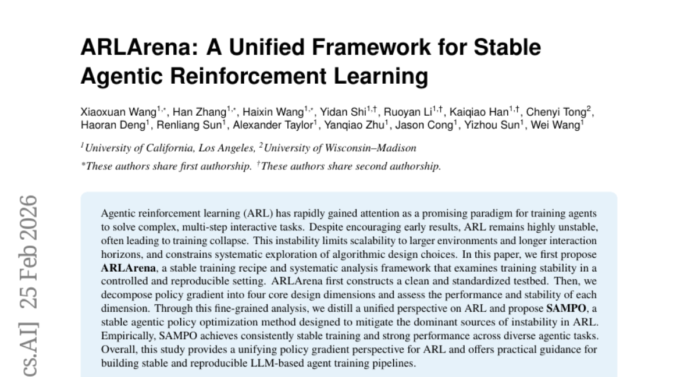

### 📌 한 줄 요약
LLM 기반 에이전트 훈련 시 불안정성을 해소하고 안정적인 학습을 가능하게 하는 프레임워크 ARLArena와 새로운 정책 최적화 방법 SAMPO를 제시하여, 다양한 에이전트 작업에서 일관된 성능 향상을 달성.

### 🔑 핵심 포인트
- ARLArena: 안정적인 ARL 학습 및 분석을 위한 프레임워크 제시
- SAMPO: ARL의 불안정성 완화를 위한 새로운 정책 최적화 방법 제안
- 다양한 에이전트 작업에서 SAMPO의 안정적인 학습 및 우수한 성능 입증

### 🧑‍💻 개발자 관점
LLM 기반 에이전트 개발 시 안정적인 학습 환경을 구축하고 성능을 향상시키는 데 활용할 수 있으며, 특히 불안정성 문제 해결에 도움이 될 수 있습니다.

### 🚀 실무 적용 아이디어
- ARLArena 프레임워크를 활용하여 기존 에이전트 학습 파이프라인의 안정성 분석
- SAMPO 알고리즘을 기존 정책 최적화 방법에 적용하여 성능 비교
- ARLArena 환경에서 다양한 하이퍼파라미터 및 아키텍처 실험을 통해 최적 설정 탐색

### ⚠️ 리스크/한계
- SAMPO가 특정 유형의 에이전트 작업에만 효과적일 수 있음
- ARLArena 환경이 실제 환경을 완벽하게 반영하지 못할 수 있음

### 📝 초록 기반 상세 설명
에이전트 강화 학습(ARL)은 복잡한 상호 작용 작업을 해결하기 위한 유망한 패러다임으로 주목받고 있지만, 불안정성으로 인해 학습이 붕괴되는 경우가 많아 확장성과 알고리즘 탐색에 제약이 있었습니다. 본 논문에서는 ARL의 안정적인 학습 레시피와 체계적인 분석 프레임워크인 ARLArena를 제안하여 통제되고 재현 가능한 환경에서 학습 안정성을 분석합니다. ARLArena는 정책 경사도를 핵심 설계 차원으로 분해하고 각 차원의 성능과 안정성을 평가합니다. 이러한 분석을 통해 ARL에 대한 통합된 관점을 제시하고, ARL의 주요 불안정성 원인을 완화하는 안정적인 에이전트 정책 최적화 방법인 SAMPO를 제안합니다. 다양한 에이전트 작업에서 SAMPO는 일관되게 안정적인 학습과 강력한 성능을 달성했습니다.

---

## 6. [GUI-Libra: Training Native GUI Agents to Reason and Act with Action-aware Supervision and Partially Verifiable RL](https://huggingface.co/papers/2602.22190)
**Upvotes**: 10 | **도입 난이도**: 중 | **신뢰도**: 중
**arXiv**: https://arxiv.org/abs/2602.22190

**태그**: Agent, GUI, RL, SFT, Reasoning, Vision, Benchmark

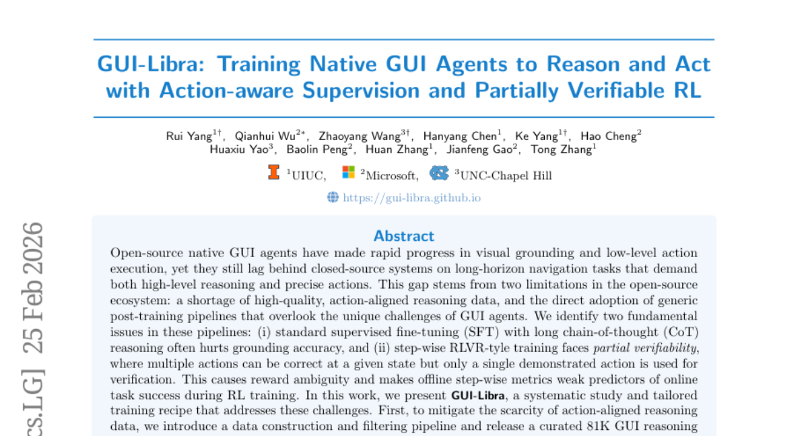

### 📌 한 줄 요약
GUI 에이전트의 성능 향상을 위해 액션 인지 SFT, KL 규제 기반 RL 등 데이터 및 학습 파이프라인을 개선하여 웹/모바일 GUI 작업의 정확도와 완료율을 높임.

### 🔑 핵심 포인트
- 액션과 정렬된 고품질 GUI 추론 데이터셋 81K개 구축 및 공개
- 액션 인지 SFT를 통해 추론 능력과 실제 행동의 연결 강화
- 부분 검증 가능한 RL 환경에서 KL 규제를 통해 학습 안정성 확보 및 성능 향상

### 🧑‍💻 개발자 관점
GUI 자동화 에이전트 개발 시 데이터 구축 및 학습 파이프라인 개선을 통해 성능 향상을 꾀할 수 있으며, 특히 액션 인지 SFT와 KL 규제 기반 RL은 실제 환경에서의 안정적인 동작에 기여할 수 있습니다.

### 🚀 실무 적용 아이디어
- GUI-Libra 데이터셋을 활용하여 기존 모델의 성능 개선 시도
- 액션 인지 SFT를 적용하여 GUI 에이전트의 추론 능력과 행동 연결 강화
- 부분 검증 가능한 환경에서 KL 규제를 활용한 RL 학습 적용 및 효과 검증

### ⚠️ 리스크/한계
- 제안하는 방법이 특정 GUI 환경에 최적화되어 다른 환경에서는 효과가 제한적일 수 있음
- KL 규제 하이퍼파라미터 튜닝에 대한 어려움이 있을 수 있음

### 📝 초록 기반 상세 설명
GUI 에이전트는 고품질의 액션-정렬 추론 데이터 부족과 GUI 에이전트의 특성을 고려하지 않은 일반적인 사후 훈련 파이프라인 사용으로 인해 성능이 제한적입니다. 기존 방식은 CoT 추론을 사용한 SFT가 오히려 성능을 저하시키고, 부분적으로만 검증 가능한 RL 환경에서 부정확한 보상으로 학습이 불안정해지는 문제가 있습니다. 이러한 문제를 해결하기 위해 GUI-Libra는 액션 인지 SFT, 데이터 선별 파이프라인, KL 규제 기반 RL을 도입했습니다. 액션 인지 SFT는 추론 후 행동 및 직접 행동 데이터를 혼합하고, KL 규제는 오프라인-온라인 예측 가능성을 향상시킵니다. 다양한 웹 및 모바일 벤치마크에서 GUI-Libra는 단계별 정확도와 전체 작업 완료율을 모두 개선했습니다. 데이터, 코드, 모델을 공개하여 GUI 에이전트 연구를 촉진합니다.

---

## 7. [JavisDiT++: Unified Modeling and Optimization for Joint Audio-Video Generation](https://huggingface.co/papers/2602.19163)
**Upvotes**: 9 | **도입 난이도**: 중 | **신뢰도**: 상
**arXiv**: https://arxiv.org/abs/2602.19163

**태그**: Audio-Video, Generation, Multimodal, DPO, Vision, Video, Audio, Evaluation, Safety

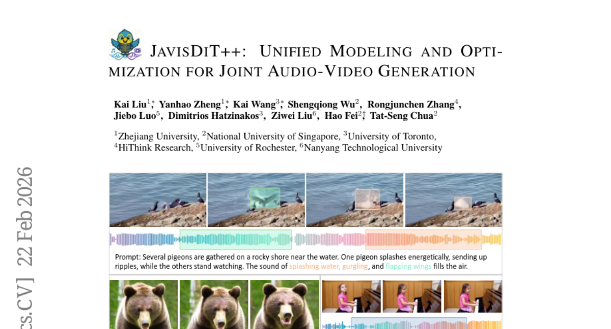

### 📌 한 줄 요약
JavisDiT++는 1M 규모의 데이터로도 Veo3와 유사한 고품질 오디오-비디오 동시 생성을 가능하게 하는 효율적인 프레임워크를 제시합니다.

### 🔑 핵심 포인트
- Modality-Specific Mixture-of-Experts (MS-MoE)를 통한 modality 간 상호작용 효율성 향상
- Temporal-Aligned RoPE (TA-RoPE)를 이용한 오디오-비디오 프레임 레벨 동기화
- Audio-Video Direct Preference Optimization (AV-DPO)를 통한 인간 선호도 기반 모델 최적화

### 🧑‍💻 개발자 관점
오디오-비디오 생성 모델 개발 시, 데이터 효율성을 높이고 인간 선호도에 맞는 결과물을 얻기 위한 핵심 기술 요소(MS-MoE, TA-RoPE, AV-DPO)를 벤치마킹할 수 있습니다.

### 🚀 실무 적용 아이디어
- MS-MoE를 활용한 modality 간 feature fusion 실험
- TA-RoPE를 기존 모델에 적용하여 시간적 동기화 성능 개선 시도
- AV-DPO를 활용하여 생성 모델의 human preference alignment 실험

### ⚠️ 리스크/한계
- 1M 규모의 데이터셋에 특화되어 다른 데이터셋에 대한 일반화 성능은 추가 검증 필요
- Veo3와 같은 상용 모델과의 직접적인 비교 분석 부족

### 📝 초록 기반 상세 설명
텍스트-이미지 생성에서 오디오-비디오 생성으로 AIGC가 확장되고 있지만, 기존 오픈소스 모델은 품질, 동기화, 인간 선호도 측면에서 상용 모델에 비해 뒤쳐져 있습니다. 이러한 격차를 해소하기 위해 JavisDiT++는 modality-specific MoE, temporal-aligned RoPE, AV-DPO를 통해 오디오-비디오 동시 생성을 위한 통합 모델링 및 최적화 프레임워크를 제안합니다. MS-MoE는 modality 간 상호작용 효율성을 높이고, TA-RoPE는 프레임 레벨 동기화를, AV-DPO는 인간 선호도에 부합하는 출력을 가능하게 합니다. Wan2.1-1.3B-T2V 기반으로 1M 규모의 데이터만으로도 SOTA를 달성했으며, 다양한 실험을 통해 제안 모듈의 효과를 검증했습니다.

### 🖼️ 추가 자료
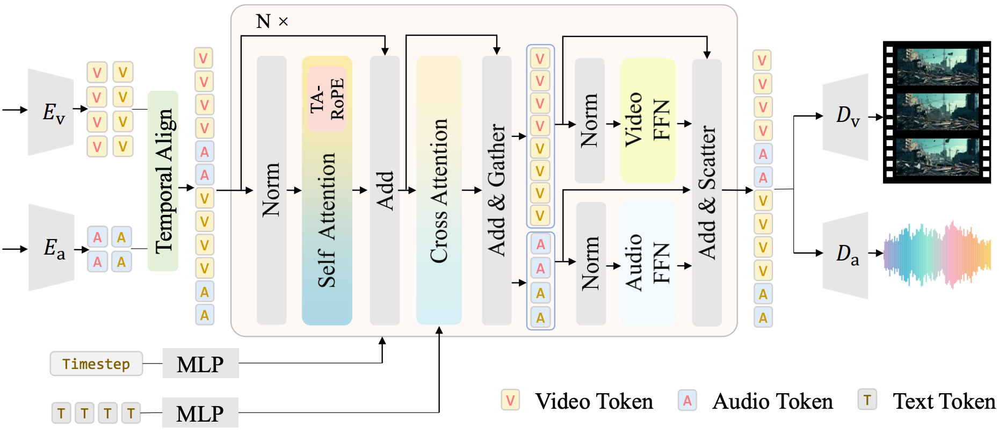
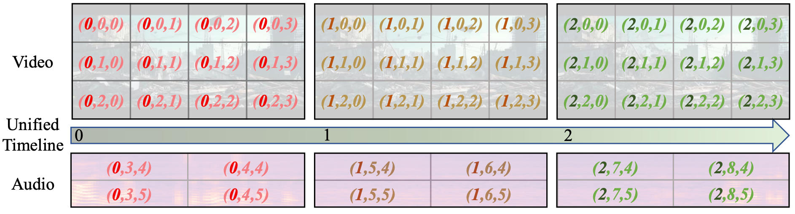
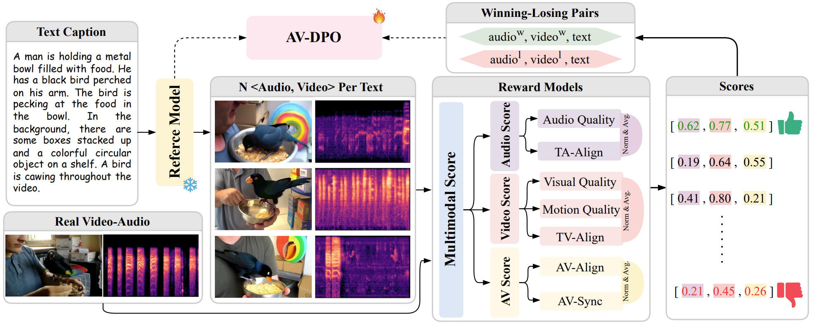

---

## 8. [Solaris: Building a Multiplayer Video World Model in Minecraft](https://huggingface.co/papers/2602.22208)
**Upvotes**: 8 | **도입 난이도**: 중 | **신뢰도**: 상
**arXiv**: https://arxiv.org/abs/2602.22208

**태그**: Agent, Vision, Multi-Agent, Simulation, Video, Evaluation

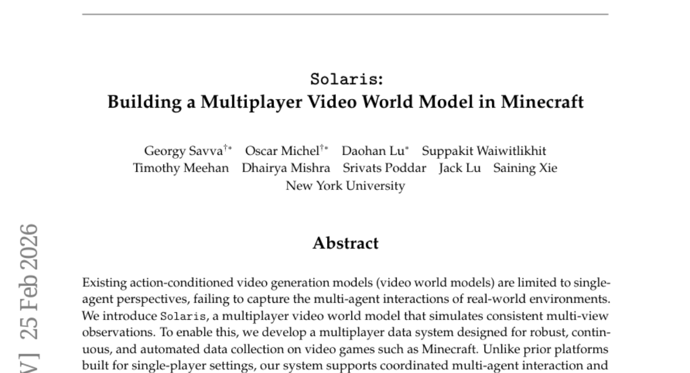

### 📌 한 줄 요약
Minecraft 환경에서 다중 에이전트 상호작용을 모델링하는 새로운 비디오 월드 모델(Solaris)을 구축하고, 데이터 수집 시스템과 평가 프레임워크를 제시하여 다중 에이전트 시뮬레이션 연구에 기여함.

### 🔑 핵심 포인트
- 다중 에이전트 환경을 위한 데이터 수집 시스템 개발
- 다중 에이전트 비디오 월드 모델(Solaris) 제안
- 다양한 평가 지표를 포함하는 다중 에이전트 평가 프레임워크 구축

### 🧑‍💻 개발자 관점
다중 에이전트 환경에서의 시뮬레이션 및 학습을 위한 기반 기술을 제공하며, 게임, 로봇 제어 등 다양한 분야에서 활용될 수 있습니다. 특히, 복잡한 상호작용을 모델링하고 예측하는 데 유용합니다.

### 🚀 실무 적용 아이디어
- 제공되는 데이터셋과 시스템을 활용하여 다중 에이전트 환경에서의 모델 학습 및 평가 실험 진행
- Solaris 모델 구조를 기반으로 새로운 다중 에이전트 모델 개발
- Checkpointed Self Forcing 훈련 방법을 다른 task에 적용하여 성능 향상 시도

### ⚠️ 리스크/한계
- Minecraft 환경에 특화되어 다른 환경으로의 일반화에 어려움이 있을 수 있음
- 모델의 복잡성으로 인해 학습 및 추론에 상당한 컴퓨팅 자원이 필요할 수 있음

### 📝 초록 기반 상세 설명
기존 비디오 월드 모델은 단일 에이전트 관점에 국한되어 실제 환경의 다중 에이전트 상호작용을 제대로 포착하지 못했습니다. 본 연구에서는 Minecraft와 같은 비디오 게임에서 안정적이고 지속적인 자동 데이터 수집을 위한 다중 에이전트 데이터 시스템을 개발하고, 이를 기반으로 다중 시점 관찰을 일관되게 시뮬레이션하는 다중 에이전트 비디오 월드 모델인 Solaris를 제안합니다. 제안하는 시스템은 기존 단일 플레이어 환경 플랫폼과 달리, 다중 에이전트 상호작용과 동기화된 비디오 및 액션 캡처를 지원합니다. 수집된 1264만 프레임의 데이터셋을 사용하여 다중 에이전트 움직임, 기억, 접지(grounding), 건설, 시점 일관성에 대한 평가 프레임워크를 구축했습니다. Solaris는 단일 플레이어에서 다중 플레이어 모델링으로 점진적으로 전환하는 단계별 파이프라인과 Checkpointed Self Forcing 훈련을 통해 기존 baseline을 능가하는 성능을 보여줍니다.

---

## 9. [VecGlypher: Unified Vector Glyph Generation with Language Models](https://huggingface.co/papers/2602.21461)
**Upvotes**: 8 | **도입 난이도**: 중 | **신뢰도**: 상
**arXiv**: https://arxiv.org/abs/2602.21461

**태그**: Language Model, Vector Graphics, Font Generation, Multimodal, Vision, Evaluation

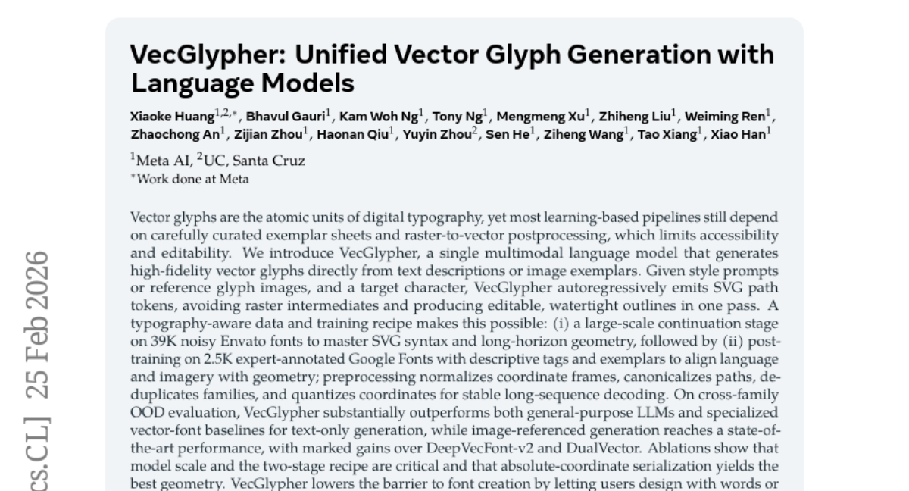

### 📌 한 줄 요약
VecGlypher는 텍스트 설명이나 이미지 예시로부터 고품질 벡터 글리프를 직접 생성하는 단일 멀티모달 언어 모델로, 폰트 제작의 접근성을 높이고 편집 가능성을 향상시킨다.

### 🔑 핵심 포인트
- 멀티모달 언어 모델을 사용하여 벡터 글리프를 직접 생성
- 대규모 데이터와 2단계 학습 방식을 통해 고품질 결과 확보
- 텍스트 및 이미지 기반 폰트 생성 기능 제공

### 🧑‍💻 개발자 관점
폰트 디자인 및 생성 파이프라인을 자동화하고, 사용자가 텍스트 설명이나 이미지 예시를 통해 쉽게 폰트를 디자인할 수 있도록 지원하여 개발 생산성을 향상시킬 수 있다.

### 🚀 실무 적용 아이디어
- VecGlypher 모델을 사용하여 특정 스타일의 폰트 생성 실험
- 기존 폰트 생성 파이프라인에 VecGlypher 통합 가능성 검토
- VecGlypher의 API 또는 SDK를 활용하여 폰트 생성 자동화 시스템 구축

### ⚠️ 리스크/한계
- 생성된 폰트의 품질 및 스타일 일관성 유지 필요
- 모델의 계산 복잡도 및 리소스 요구 사항 고려 필요

### 📝 초록 기반 상세 설명
기존의 벡터 글리프 생성 파이프라인은 수작업으로 관리되는 예시 시트와 래스터-벡터 변환 후처리에 의존하여 접근성과 편집성에 제한이 있었다. VecGlypher는 스타일 프롬프트, 참조 글리프 이미지, 대상 문자를 입력받아 SVG 경로 토큰을 자동 회귀적으로 생성하여 래스터 중간 단계를 없애고 편집 가능한 완전한 외곽선을 한 번에 생성한다. 대규모 폰트 데이터로 SVG 구문과 기하학적 구조를 학습하고, 전문가가 주석을 단 Google Fonts 데이터로 언어 및 이미지를 기하학적 구조에 정렬하는 2단계 학습 방식을 사용한다. VecGlypher는 텍스트 기반 생성에서 기존 LLM 및 전문 벡터 폰트 모델보다 우수한 성능을 보이며, 이미지 참조 생성에서는 SOTA 성능을 달성했다.

---

