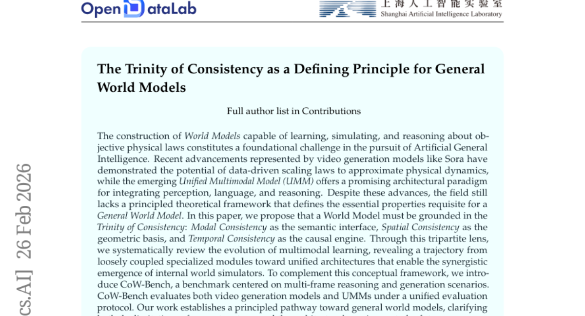
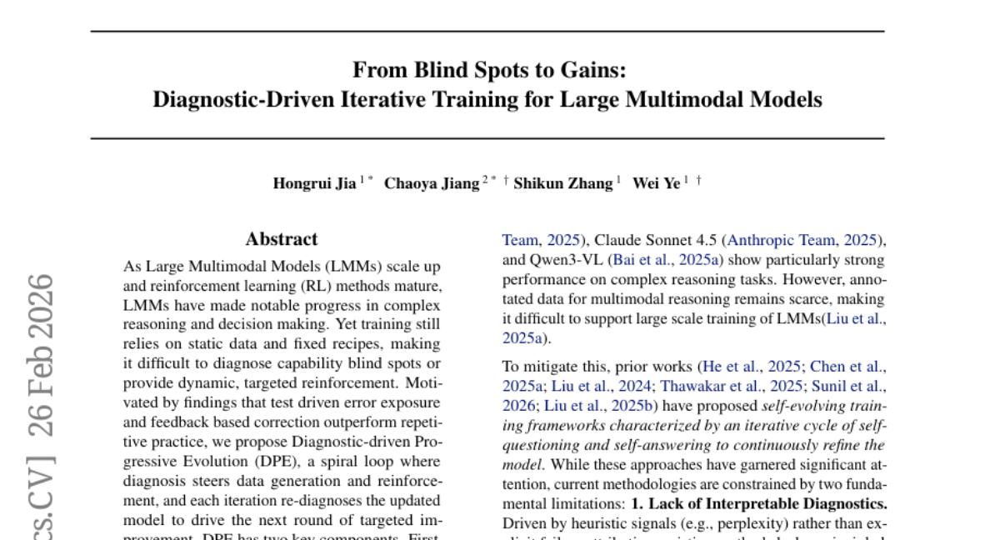
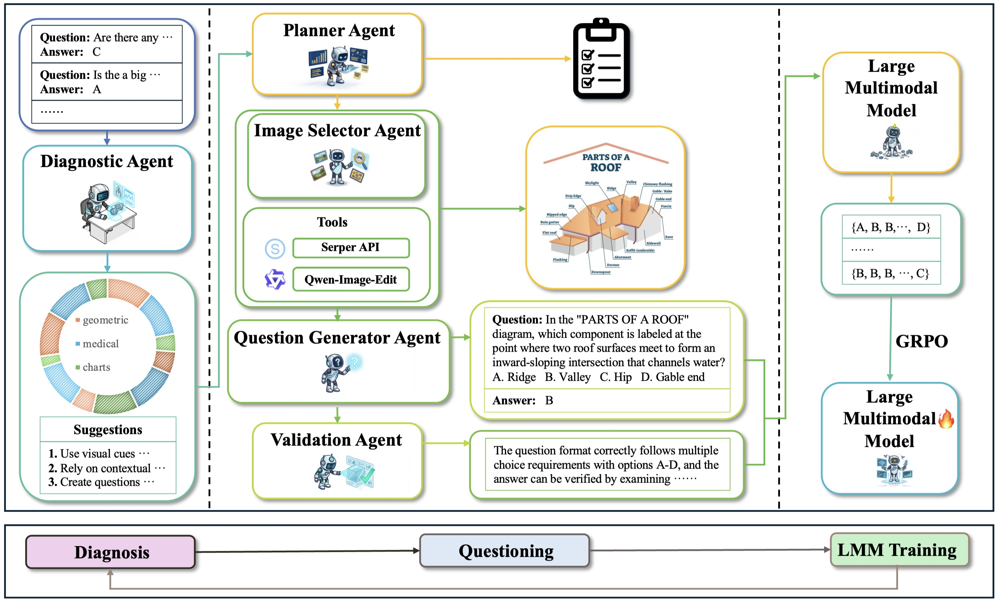
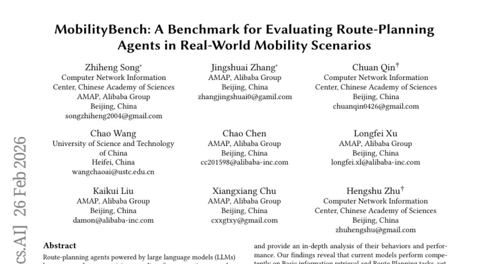
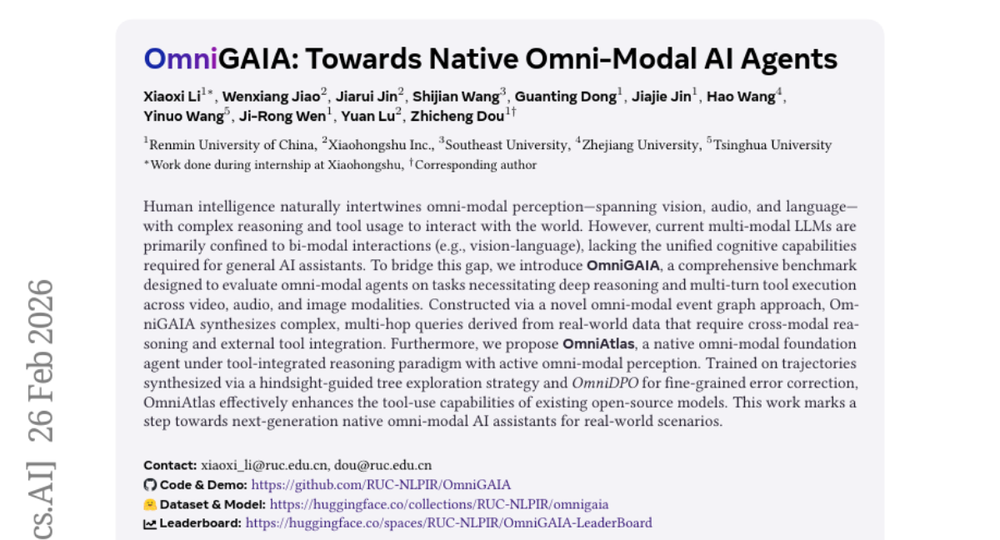
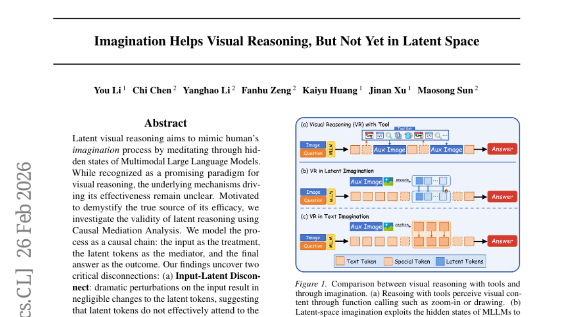
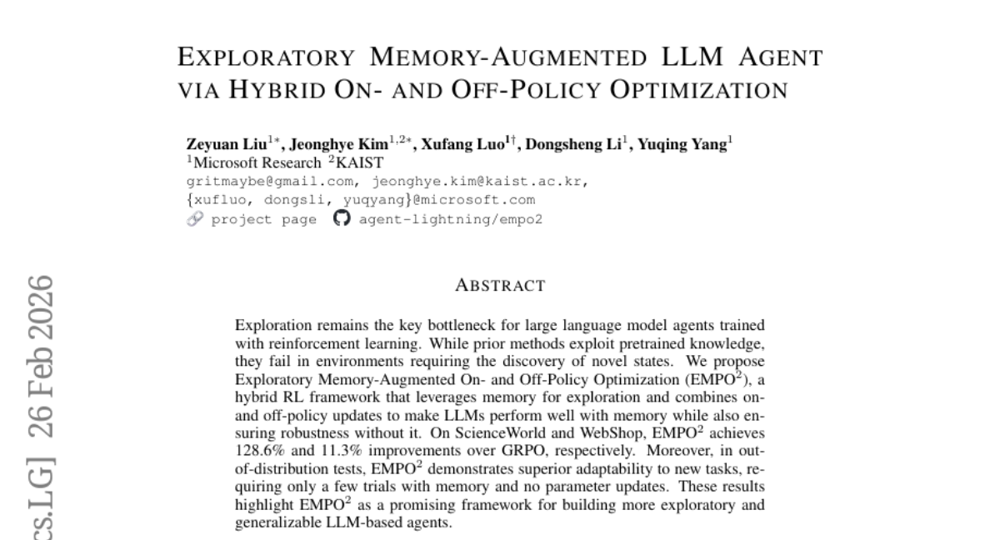
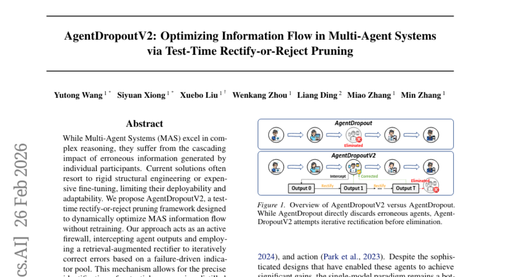
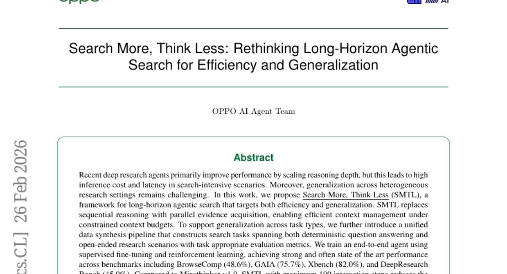
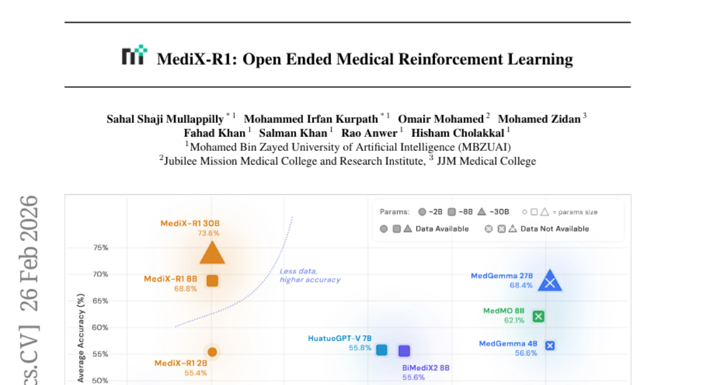

# 2026-03-02 Daily Papers (Top 9)

## 1. [The Trinity of Consistency as a Defining Principle for General World Models](https://huggingface.co/papers/2602.23152)
**Upvotes**: 188 | **도입 난이도**: 중 | **신뢰도**: 중
**arXiv**: https://arxiv.org/abs/2602.23152

**태그**: World Model, Multimodal Learning, Benchmark, AGI, Video Generation, Reasoning, Multimodal, Video, Evaluation

### 📌 한 줄 요약
일관성이라는 원칙 하에 General World Model의 필수 속성을 정의하고, CoW-Bench라는 새로운 벤치마크를 통해 모델을 평가하는 프레임워크를 제시하여, AGI 발전에 기여한다.

### 🔑 핵심 포인트
- World Model의 필수 속성으로 Modal, Spatial, Temporal 일관성 제시
- 멀티모달 학습의 발전 과정을 분석하여 통합 아키텍처의 필요성 강조
- CoW-Bench 벤치마크를 통해 다양한 모델 평가

### 🧑‍💻 개발자 관점
World Model의 일관성이라는 새로운 관점을 제시하여, 실제 서비스에 적용할 때 모델의 신뢰성과 예측 가능성을 높이는 데 기여할 수 있다.

### 🚀 실무 적용 아이디어
- CoW-Bench를 활용하여 기존 모델의 성능 평가
- 새로운 모델 설계 시 일관성 요소를 고려
- 비디오 생성 모델과 UMM을 통합하여 성능 향상 시도

### ⚠️ 리스크/한계
- CoW-Bench가 모든 시나리오를 포괄하지 못할 수 있음
- 일관성 요소 외 다른 중요한 요소가 존재할 수 있음

### 📝 초록 기반 상세 설명
인공 일반 지능(AGI)을 위한 World Model 구축은 중요한 과제이다. 최근 Sora와 같은 비디오 생성 모델과 UMM은 가능성을 보여주지만, General World Model의 필수 속성에 대한 이론적 프레임워크가 부족하다. 본 논문에서는 Modal, Spatial, Temporal 일관성의 세 가지 요소를 World Model의 기준으로 제안한다. 멀티모달 학습의 발전 과정을 분석하고, CoW-Bench를 통해 비디오 생성 모델과 UMM을 평가한다. 이 연구는 General World Model을 향한 방향을 제시하고, 현재 시스템의 한계와 미래 아키텍처 요구 사항을 명확히 한다.

---

## 2. [From Blind Spots to Gains: Diagnostic-Driven Iterative Training for Large Multimodal Models](https://huggingface.co/papers/2602.22859)
**Upvotes**: 147 | **도입 난이도**: 중 | **신뢰도**: 상
**arXiv**: https://arxiv.org/abs/2602.22859

**태그**: LMM, Reinforcement Learning, Data Augmentation, Diagnostic Training, Agent, Reasoning, Multimodal, Vision, Benchmark

### 📌 한 줄 요약
LMM의 약점을 진단하고, 진단 결과를 바탕으로 데이터를 생성 및 강화 학습을 반복하여 모델 성능을 지속적으로 향상시키는 DPE 프레임워크를 제안하고, 다양한 벤치마크에서 성능 향상을 입증함.

### 🔑 핵심 포인트
- LMM의 약점을 진단하고 개선하는 DPE 프레임워크 제안
- 에이전트 기반 데이터 생성 및 강화 학습 전략
- 다양한 벤치마크에서 DPE의 효과 입증

### 🧑‍💻 개발자 관점
LMM의 성능을 지속적으로 개선하고, 특정 약점에 대한 타겟 학습을 가능하게 하여 실제 서비스 환경에서 LMM의 활용도를 높일 수 있습니다.

### 🚀 실무 적용 아이디어
- DPE 프레임워크를 기반으로 자체 LMM 학습 파이프라인 구축
- 에이전트 기반 데이터 생성 전략을 활용하여 데이터셋 확장
- 모델의 약점 진단 및 타겟 강화 학습 실험

### ⚠️ 리스크/한계
- 에이전트 기반 데이터 생성 과정에서 품질 관리 필요
- DPE 프레임워크의 효과는 특정 모델 및 데이터셋에 따라 달라질 수 있음

### 📝 초록 기반 상세 설명
최근 대규모 멀티모달 모델(LMM)은 복잡한 추론 및 의사 결정에서 상당한 발전을 이루었지만, 정적 데이터와 고정된 학습 방식으로 인해 모델의 약점을 진단하고 타겟 강화 학습을 제공하기 어렵습니다. 본 논문에서는 테스트 기반 오류 노출 및 피드백 기반 수정이 반복적인 연습보다 효과적이라는 점에 착안하여, 진단 기반 점진적 발전(DPE)이라는 새로운 학습 패러다임을 제안합니다. DPE는 진단 -> 데이터 생성 및 강화 -> 재진단의 반복적인 루프를 통해 모델을 개선합니다. 구체적으로, 여러 에이전트가 웹 검색 및 이미지 편집 도구를 사용하여 다양한 데이터를 생성하고, 실패 원인을 분석하여 데이터 혼합을 조정하고, 약점에 집중된 데이터를 생성하여 타겟 강화 학습을 수행합니다. Qwen3-VL-8B-Instruct 및 Qwen2.5-VL-7B-Instruct 모델에 대한 실험 결과, 11개의 벤치마크에서 지속적인 성능 향상을 보여 DPE가 지속적인 LMM 학습을 위한 확장 가능한 패러다임임을 입증했습니다.

### 🖼️ 추가 자료

---

## 3. [MobilityBench: A Benchmark for Evaluating Route-Planning Agents in Real-World Mobility Scenarios](https://huggingface.co/papers/2602.22638)
**Upvotes**: 98 | **도입 난이도**: 중 | **신뢰도**: 상
**arXiv**: https://arxiv.org/abs/2602.22638

**태그**: Benchmark, LLM, Route Planning, Mobility, Evaluation, Agent, RAG

### 📌 한 줄 요약
실제 사용자 쿼리를 기반으로 LLM 기반 경로 계획 에이전트를 평가할 수 있는 벤치마크 MobilityBench를 공개하여, 개인화된 모빌리티 앱 개선에 기여할 수 있습니다.

### 🔑 핵심 포인트
- 실제 사용자 쿼리 기반의 대규모 경로 계획 벤치마크 MobilityBench 제시
- 결정적 API-replay 샌드박스를 통한 재현 가능한 평가 환경 제공
- 다양한 LLM 기반 경로 계획 에이전트의 성능 분석 및 개선 방향 제시

### 🧑‍💻 개발자 관점
LLM을 활용한 경로 계획 에이전트 개발 시, 실제 사용자 데이터 기반의 MobilityBench를 통해 모델의 성능을 객관적으로 평가하고 개선할 수 있습니다. 특히, 선호도 제약 조건이 있는 경로 계획 성능 향상에 집중할 수 있습니다.

### 🚀 실무 적용 아이디어
- MobilityBench 데이터셋을 다운로드하여 LLM 기반 경로 계획 모델 학습 및 평가
- 제공되는 평가 툴킷을 사용하여 모델의 성능 지표 측정 및 분석
- 선호도 제약 조건이 있는 경로 계획 성능 향상을 위한 모델 개선 연구

### ⚠️ 리스크/한계
- 벤치마크 데이터가 특정 지역 및 서비스에 편향되어 있을 수 있음
- API-replay 샌드박스가 실제 환경을 완벽하게 모방하지 못할 수 있음

### 📝 초록 기반 상세 설명
LLM 기반 경로 계획 에이전트는 자연어 상호 작용을 통해 일상적인 이동성을 지원하는 유망한 패러다임으로 부상했지만, 실제 환경에서의 체계적인 평가는 다양한 경로 요구 사항, 비결정적 매핑 서비스, 제한된 재현성으로 인해 어려움을 겪고 있습니다. 이러한 문제를 해결하기 위해 실제 사용자 쿼리를 기반으로 하는 대규모 벤치마크인 MobilityBench를 제안합니다. MobilityBench는 결정적 API-replay 샌드박스를 통해 재현 가능한 평가를 지원하며, 결과 유효성, 명령 이해, 계획, 도구 사용, 효율성을 중심으로 다차원 평가 프로토콜을 제공합니다. MobilityBench를 사용하여 다양한 LLM 기반 경로 계획 에이전트를 평가한 결과, 현재 모델은 기본 정보 검색 및 경로 계획 작업에서는 유능하지만, 선호도 제약 조건이 있는 경로 계획에서는 어려움을 겪는다는 것을 확인했습니다. 벤치마크 데이터, 평가 툴킷 및 문서는 공개적으로 제공됩니다.

---

## 4. [OmniGAIA: Towards Native Omni-Modal AI Agents](https://huggingface.co/papers/2602.22897)
**Upvotes**: 49 | **도입 난이도**: 중 | **신뢰도**: 중
**arXiv**: https://arxiv.org/abs/2602.22897

**태그**: Agent, Multi-modal, Benchmark, Reasoning, Tool-use, Vision, Video, Audio, Evaluation

### 📌 한 줄 요약
OmniGAIA는 비전, 오디오, 언어를 통합하여 복잡한 추론과 도구 사용을 요구하는 차세대 옴니모달 AI 에이전트 개발을 위한 벤치마크 및 에이전트 모델(OmniAtlas)을 제시합니다.

### 🔑 핵심 포인트
- 옴니모달 AI 에이전트 평가를 위한 새로운 벤치마크 OmniGAIA 제시
- 도구 통합 추론 패러다임을 사용하는 옴니모달 에이전트 OmniAtlas 제안
- Hindsight-guided tree exploration 및 OmniDPO를 통한 도구 사용 능력 향상

### 🧑‍💻 개발자 관점
다양한 modality를 융합하여 추론하고 도구를 사용하는 AI 에이전트 개발에 필요한 기반을 제공하며, 실제 서비스에 적용 가능한 멀티모달 에이전트 개발에 활용될 수 있습니다.

### 🚀 실무 적용 아이디어
- OmniGAIA 벤치마크를 사용하여 기존 멀티모달 모델의 성능 평가
- OmniAtlas 모델을 기반으로 특정 도메인에 특화된 옴니모달 에이전트 개발
- Hindsight-guided tree exploration 및 OmniDPO를 활용한 모델 학습 전략 실험

### ⚠️ 리스크/한계
- OmniGAIA 벤치마크의 현실 세계 데이터 반영 정도 및 일반화 성능에 대한 검증 필요
- OmniAtlas 모델의 계산 비용 및 리소스 요구 사항에 대한 고려 필요

### 📝 초록 기반 상세 설명
현재 멀티모달 LLM은 주로 시각-언어 상호작용에 국한되어 있어, 범용 AI 비서에 필요한 통합 인지 능력이 부족합니다. 이러한 격차를 해소하기 위해 OmniGAIA 벤치마크를 제안하며, 이는 비디오, 오디오, 이미지 modality에서 깊은 추론과 다단계 도구 실행을 필요로 하는 작업을 평가합니다. OmniGAIA는 옴니모달 이벤트 그래프 방식을 통해 실제 데이터에서 복잡한 다단계 쿼리를 합성하여 교차 modality 추론 및 외부 도구 통합을 요구합니다. 또한, 능동적인 옴니모달 인식을 통해 도구 통합 추론 패러다임 하에서 OmniAtlas라는 옴니모달 에이전트를 제안합니다. Hindsight-guided tree exploration 전략과 OmniDPO를 통해 학습된 OmniAtlas는 기존 오픈 소스 모델의 도구 사용 능력을 효과적으로 향상시킵니다.

---

## 5. [Imagination Helps Visual Reasoning, But Not Yet in Latent Space](https://huggingface.co/papers/2602.22766)
**Upvotes**: 36 | **도입 난이도**: 중 | **신뢰도**: 상
**arXiv**: https://arxiv.org/abs/2602.22766

**태그**: Vision, LLM, Reasoning, Causality, Multimodal, Benchmark

### 📌 한 줄 요약
Multimodal LLM의 latent space를 활용한 visual reasoning은 실제 이미지 정보를 제대로 활용하지 못하며, 명시적인 텍스트 기반 이미지네이션이 더 효과적임.

### 🔑 핵심 포인트
- Multimodal LLM의 latent space는 입력 이미지 정보를 효과적으로 반영하지 못함
- Latent 토큰은 최종 결과에 미치는 영향이 미미함
- 명시적인 텍스트 기반 이미지네이션이 latent space 기반 방법보다 효과적임

### 🧑‍💻 개발자 관점
Multimodal LLM 기반 visual reasoning 시스템 개발 시, latent space에 의존하기보다 명시적인 텍스트 기반 이미지네이션을 활용하는 것이 더 효율적일 수 있음을 시사합니다.

### 🚀 실무 적용 아이디어
- CapImagine 모델 구조 및 구현 방식 상세 분석
- 기존 visual reasoning 시스템에 CapImagine 적용 및 성능 비교
- 다양한 vision-centric 벤치마크에서 CapImagine 성능 검증

### ⚠️ 리스크/한계
- CapImagine의 성능이 특정 데이터셋 또는 task에 편향될 가능성
- 텍스트 기반 이미지네이션의 한계 (복잡한 시각적 디테일 표현의 어려움)

### 📝 초록 기반 상세 설명
Multimodal LLM에서 latent visual reasoning은 인간의 상상 과정을 모방하려는 시도이지만, 그 효과의 메커니즘은 불분명합니다. 이 연구는 Causal Mediation Analysis를 통해 latent reasoning의 유효성을 검증합니다. 분석 결과, 입력과 latent 토큰 간의 연결이 약하고, latent 토큰이 최종 결과에 미치는 영향도 미미함을 발견했습니다. 또한, latent 토큰은 제한적인 시각 정보를 인코딩하며 유사성이 높습니다. 따라서 latent reasoning의 필요성에 의문을 제기하고, 명시적인 텍스트 기반 이미지네이션 방법인 CapImagine을 제안하며, 실험 결과 CapImagine이 latent-space 기반 방법보다 우수한 성능을 보였습니다.

---

## 6. [Exploratory Memory-Augmented LLM Agent via Hybrid On- and Off-Policy Optimization](https://huggingface.co/papers/2602.23008)
**Upvotes**: 30 | **도입 난이도**: 중 | **신뢰도**: 상
**arXiv**: https://arxiv.org/abs/2602.23008

**태그**: Agent, Reinforcement Learning, Exploration, Memory, RAG

### 📌 한 줄 요약
EMPO^2는 메모리를 활용한 탐색과 온-오프 정책 업데이트를 결합하여 LLM 에이전트의 탐색 능력과 일반화 성능을 향상시키는 새로운 강화 학습 프레임워크이며, 특히 새로운 환경에 대한 적응력이 뛰어나다.

### 🔑 핵심 포인트
- 메모리 기반 탐색과 온-오프 정책 결합을 통한 LLM 에이전트의 탐색 능력 향상
- 새로운 환경에 대한 뛰어난 적응력 (파라미터 업데이트 없이 적은 시도로 우수한 성능)
- ScienceWorld 및 WebShop 환경에서 기존 방법 대비 상당한 성능 향상

### 🧑‍💻 개발자 관점
LLM 에이전트 개발 시, EMPO^2 프레임워크는 새로운 환경에서의 탐색 능력을 향상시키고, 적은 데이터로도 빠르게 적응할 수 있도록 도와 개발 비용을 절감하고 성능을 개선할 수 있다.

### 🚀 실무 적용 아이디어
- EMPO^2를 기반으로 특정 도메인에 맞는 LLM 에이전트 개발
- 다양한 환경에서 EMPO^2의 성능 및 적응력 테스트
- 메모리 구조 및 온-오프 정책 업데이트 전략을 개선하여 EMPO^2 성능 향상

### ⚠️ 리스크/한계
- 메모리 구조 설계 및 관리의 복잡성
- 온-오프 정책 업데이트의 안정성 및 수렴 문제

### 📝 초록 기반 상세 설명
LLM 에이전트의 강화 학습 훈련 시 탐색 능력은 여전히 중요한 문제이다. 기존 방법들은 사전 학습된 지식을 활용하지만, 새로운 상태 발견이 필요한 환경에서는 어려움을 겪는다. 본 논문에서는 메모리를 활용한 탐색과 온-오프 정책 업데이트를 결합한 하이브리드 강화 학습 프레임워크인 EMPO^2를 제안한다. EMPO^2는 메모리를 활용하여 LLM의 성능을 향상시키면서도 메모리 없이도 견고성을 유지하도록 설계되었다. ScienceWorld 및 WebShop 환경에서 EMPO^2는 GRPO 대비 각각 128.6% 및 11.3%의 성능 향상을 달성했다. 또한, EMPO^2는 새로운 작업에 대한 뛰어난 적응력을 보여주며, 적은 수의 메모리 활용 시도로 파라미터 업데이트 없이도 우수한 성능을 나타냈다.

---

## 7. [AgentDropoutV2: Optimizing Information Flow in Multi-Agent Systems via Test-Time Rectify-or-Reject Pruning](https://huggingface.co/papers/2602.23258)
**Upvotes**: 24 | **도입 난이도**: 중 | **신뢰도**: 상
**arXiv**: https://arxiv.org/abs/2602.23258

**태그**: Agent, Pruning, Information Flow, MAS, RAG, Reasoning, Benchmark, Evaluation, Distillation

### 📌 한 줄 요약
AgentDropoutV2는 Multi-Agent System에서 에이전트의 오류를 실시간으로 정정하거나 제거하여 전체 시스템 성능을 향상시키는 새로운 프레임워크를 제공하며, 별도의 재학습 없이도 적용 가능하다.

### 🔑 핵심 포인트
- 테스트 타임에 에이전트의 오류를 정정하거나 제거하는 새로운 프레임워크 제시
- Retrival-Augmented Rectifier를 활용하여 오류 수정
- 별도의 재학습 없이 Multi-Agent System의 성능 향상

### 🧑‍💻 개발자 관점
Multi-Agent System 개발 시, AgentDropoutV2를 통해 개별 에이전트의 오류로 인한 시스템 전체 성능 저하를 방지하고, 별도의 재학습 없이 실시간으로 시스템을 개선할 수 있다.

### 🚀 실무 적용 아이디어
- 자체 Multi-Agent System에 AgentDropoutV2 적용하여 성능 향상 실험
- Retrival-Augmented Rectifier의 성능 및 효율성 분석
- 다양한 오류 패턴에 대한 Indicator pool 구축 및 활용 방안 연구

### ⚠️ 리스크/한계
- 새로운 유형의 오류 패턴에 대한 일반화 성능이 낮을 수 있음
- Retrival-Augmented Rectifier의 성능에 따라 전체 시스템 성능이 좌우될 수 있음

### 📝 초록 기반 상세 설명
Multi-Agent System(MAS)은 복잡한 추론에 강하지만, 개별 에이전트의 오류가 전체 시스템에 큰 영향을 미치는 문제가 있다. 기존 방법들은 구조적 변경이나 비용이 많이 드는 fine-tuning에 의존하여 적용 및 적응에 제한이 있었다. AgentDropoutV2는 재학습 없이 MAS의 정보 흐름을 최적화하는 rectify-or-reject pruning 프레임워크를 제안한다. 이 프레임워크는 에이전트의 출력을 가로채고, retrieval-augmented rectifier를 사용하여 오류를 반복적으로 수정하며, 수정 불가능한 오류는 제거하여 오류 전파를 방지한다. 수학 벤치마크에서 평균 6.3%의 정확도 향상을 보였으며, 다양한 오류 패턴에 대한 context-aware indicator를 활용하여 task 난이도에 따라 rectification 노력을 동적으로 조절하는 뛰어난 일반화 및 적응성을 보여준다.

---

## 8. [Search More, Think Less: Rethinking Long-Horizon Agentic Search for Efficiency and Generalization](https://huggingface.co/papers/2602.22675)
**Upvotes**: 18 | **도입 난이도**: 중 | **신뢰도**: 중
**arXiv**: https://arxiv.org/abs/2602.22675

**태그**: Agent, Search, Reasoning, Generalization, RAG, Benchmark, Evaluation, Inference

### 📌 한 줄 요약
Agent가 sequential reasoning을 줄이고 parallel evidence acquisition을 통해 효율성과 generalization을 높이는 SMTL 프레임워크를 제안하고, 다양한 benchmark에서 SOTA를 달성함.

### 🔑 핵심 포인트
- Sequential reasoning을 parallel evidence acquisition으로 대체하여 효율성 향상
- Unified data synthesis pipeline을 통해 다양한 task type에 대한 generalization 지원
- BrowseComp, GAIA, Xbench, DeepResearch Bench 등에서 SOTA 성능 달성

### 🧑‍💻 개발자 관점
Agent 기반 시스템에서 추론 비용을 줄이고 다양한 task에 적용할 수 있는 방법을 제시하여, 실제 서비스 적용 가능성을 높임.

### 🚀 실무 적용 아이디어
- SMTL 프레임워크를 기반으로 자체 데이터에 맞는 agent 학습
- Parallel evidence acquisition 전략을 기존 agent 시스템에 적용
- Unified data synthesis pipeline을 활용하여 다양한 task에 대한 agent 성능 평가

### ⚠️ 리스크/한계
- Parallel evidence acquisition의 효과는 task의 특성에 따라 달라질 수 있음
- Unified data synthesis pipeline의 현실 적합성에 대한 추가 검증 필요

### 📝 초록 기반 상세 설명
기존 연구 Agent는 reasoning depth를 늘려 성능을 향상시키지만, 추론 비용과 latency가 높고 다양한 환경에서 generalization이 어렵습니다. 이 문제를 해결하기 위해, 본 연구에서는 효율성과 generalization을 목표로 하는 Search More, Think Less (SMTL) 프레임워크를 제안합니다. SMTL은 sequential reasoning 대신 parallel evidence acquisition을 사용하여 context budget 제약 하에서 효율적인 context 관리를 가능하게 합니다. 또한, deterministic question answering과 open-ended research 시나리오를 포괄하는 unified data synthesis pipeline을 도입하여 task type에 따른 generalization을 지원합니다. Supervised fine-tuning과 reinforcement learning을 통해 end-to-end agent를 학습하여 BrowseComp, GAIA, Xbench, DeepResearch Bench 등 다양한 benchmark에서 SOTA 성능을 달성했습니다.

---

## 9. [MediX-R1: Open Ended Medical Reinforcement Learning](https://huggingface.co/papers/2602.23363)
**Upvotes**: 16 | **도입 난이도**: 중 | **신뢰도**: 상
**arXiv**: https://arxiv.org/abs/2602.23363

**태그**: Reinforcement Learning, Medical, MLLM, LLM-as-judge, VLM, Reasoning, Multimodal, Vision, Benchmark, Evaluation, Safety

### 📌 한 줄 요약
MediX-R1은 의료 분야 MLLM을 위한 개방형 강화 학습 프레임워크로, 임상적으로 의미 있는 자유 형식 답변을 가능하게 하며, LLM 기반 평가를 통해 성능을 향상시켰습니다.

### 🔑 핵심 포인트
- 개방형 의료 질문 응답을 위한 강화 학습 프레임워크 MediX-R1 제시
- LLM 기반의 복합 보상 함수를 통해 모델의 추론 능력 향상
- LLM-as-judge 기반의 통합 평가 프레임워크 제안

### 🧑‍💻 개발자 관점
의료 분야에서 MLLM의 활용 가능성을 넓히고, 특히 자유 형식의 질문에 대한 답변 능력을 향상시키는 데 기여할 수 있습니다. 개발자는 MediX-R1의 강화 학습 방법과 LLM 기반 평가 방식을 통해 의료 분야 모델의 성능을 개선할 수 있습니다.

### 🚀 실무 적용 아이디어
- MediX-R1 프레임워크를 기반으로 자체 의료 데이터셋에 fine-tuning 실험 진행
- 제시된 복합 보상 함수의 각 요소별 효과 분석 및 개선
- LLM-as-judge 평가 방식을 다른 의료 task에 적용하여 성능 평가

### ⚠️ 리스크/한계
- LLM-as-judge의 편향 가능성 및 평가의 일관성 문제
- 강화 학습의 불안정성 및 보상 함수 설계의 어려움

### 📝 초록 기반 상세 설명
기존 의료 MLLM은 주로 객관식 문제에 국한되어 자유 형식의 임상적 추론 능력이 부족했습니다. MediX-R1은 그룹 기반 강화 학습과 복합 보상 함수를 사용하여 이 문제를 해결합니다. LLM 기반 정확도 보상, 임베딩 기반 의미론적 보상, 형식 및 modality 보상을 결합하여 모델의 추론 능력과 modality 인식 능력을 향상시킵니다. 제안하는 통합 평가 프레임워크는 LLM-as-judge를 사용하여 모델의 성능을 평가합니다. MediX-R1은 제한된 데이터셋으로도 표준 의료 LLM 및 VLM 벤치마크에서 우수한 성능을 보였으며, 특히 개방형 임상 task에서 큰 개선을 보였습니다.

---

