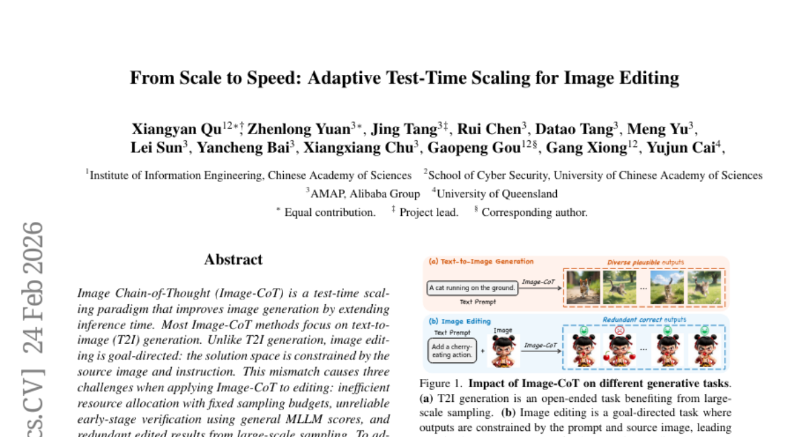
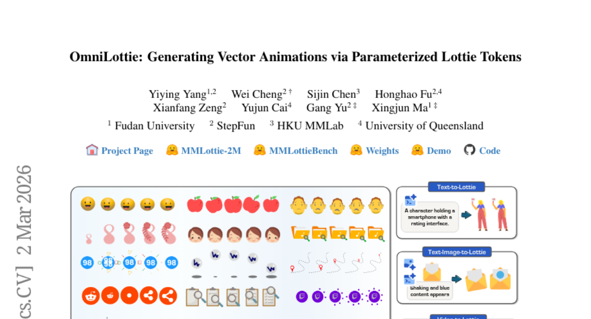
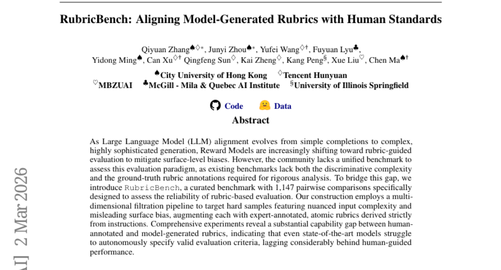
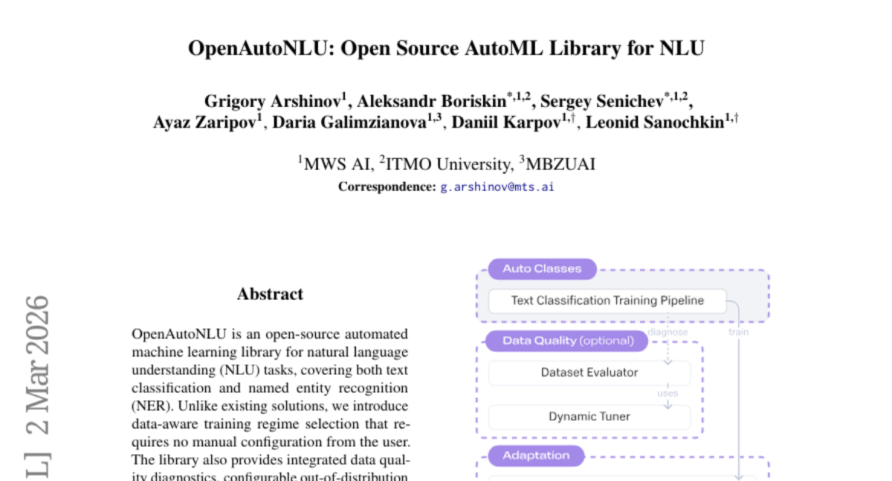
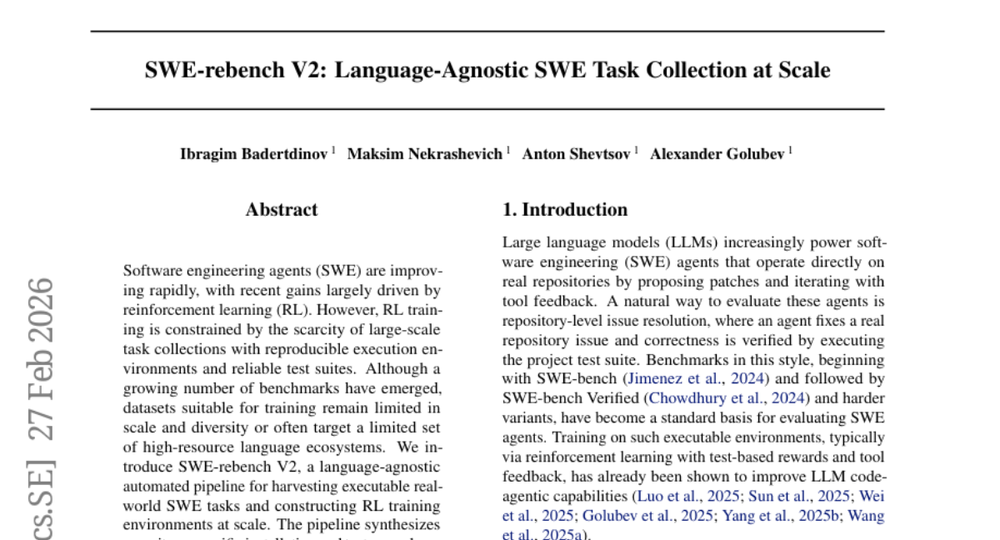
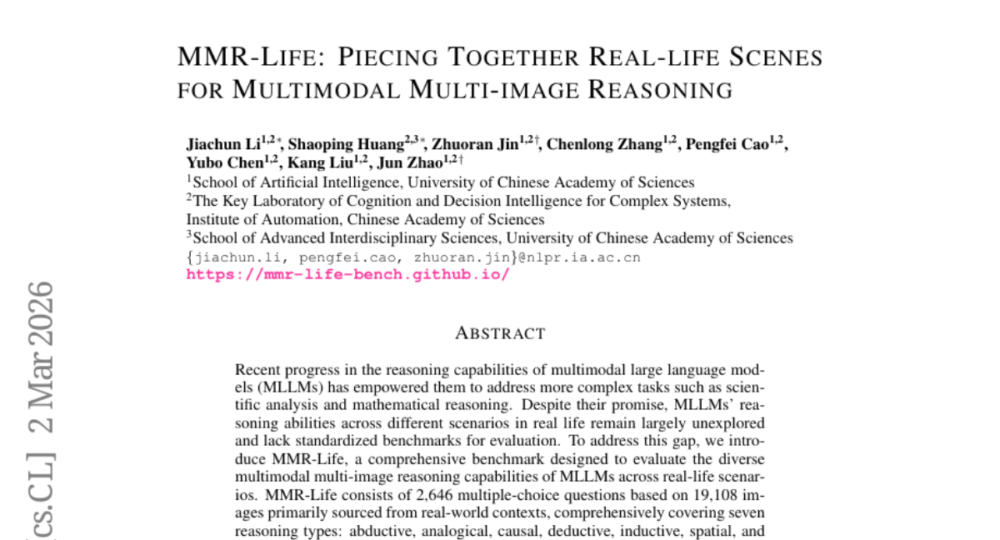
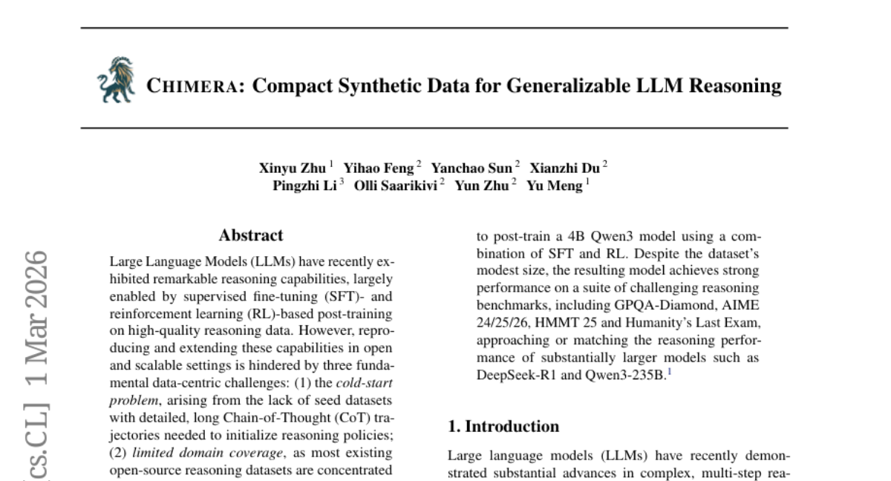
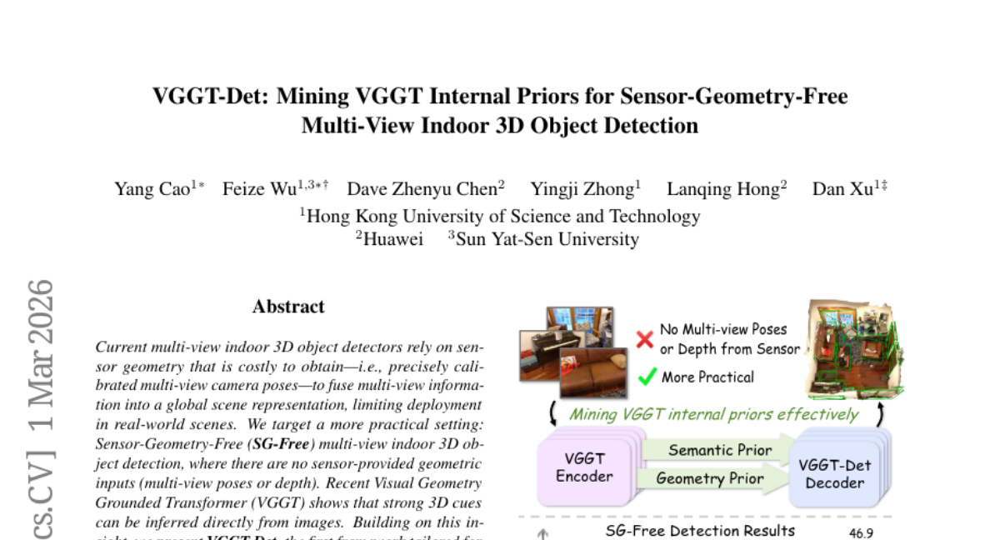
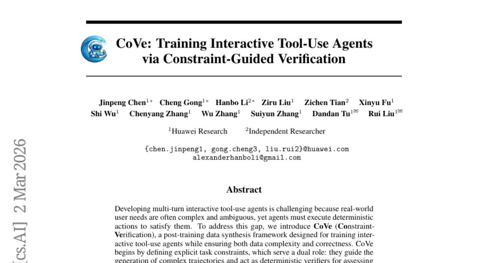

# 2026-03-04 Daily Papers (Top 9)

## 1. [From Scale to Speed: Adaptive Test-Time Scaling for Image Editing](https://huggingface.co/papers/2603.00141)
**Upvotes**: 110 | **도입 난이도**: 중 | **신뢰도**: 상
**arXiv**: https://arxiv.org/abs/2603.00141

**태그**: Image Editing, CoT, Inference Optimization, MLLM, Vision, Benchmark, Inference

### 📌 한 줄 요약
이미지 편집 시, 편집 난이도에 따라 자원 할당을 동적으로 조절하고, 편집 특화 검증을 통해 효율성을 높이는 Adaptive Edit-CoT (ADE-CoT) 프레임워크를 제안하여, 기존 방식 대비 2배 이상의 속도 향상을 달성했습니다.

### 🔑 핵심 포인트
- 편집 난이도에 따른 동적 자원 할당 전략
- 영역 localization 및 캡션 일관성을 활용한 편집 특화 검증
- 인스턴스 특화 검증 기반의 깊이 우선 탐색을 통한 조기 종료

### 🧑‍💻 개발자 관점
이미지 편집 파이프라인에서 추론 효율성을 극대화하고 싶은 개발자에게 유용하며, 특히 리소스 제약이 있는 환경에서 더욱 효과적입니다. 기존 모델에 쉽게 통합하여 성능 향상을 기대할 수 있습니다.

### 🚀 실무 적용 아이디어
- 기존 이미지 편집 모델(Step1X-Edit, BAGEL, FLUX.1 Kontext 등)에 ADE-CoT 프레임워크 적용 실험
- 편집 난이도 추정 모듈 및 편집 특화 검증 모듈 구현 및 성능 비교
- 실제 서비스 환경에서 ADE-CoT의 성능 및 효율성 검증

### ⚠️ 리스크/한계
- 편집 난이도 추정의 정확성에 따라 성능이 크게 좌우될 수 있음
- 편집 특화 검증 모듈의 설계 및 구현 난이도가 높을 수 있음

### 📝 초록 기반 상세 설명
이미지 Chain-of-Thought (Image-CoT)는 추론 시간을 늘려 이미지 생성을 개선하는 패러다임이지만, 이미지 편집은 텍스트-이미지 생성과 달리 소스 이미지와 명령어에 의해 제약되므로 기존 Image-CoT 방식 적용 시 비효율적인 자원 할당, 신뢰성 낮은 초기 검증, 중복된 결과 등의 문제가 발생합니다. 이러한 문제 해결을 위해 편집 난이도 기반 동적 자원 할당, 편집 특화 검증을 통한 초기 가지치기, 인스턴스 특화 검증 기반의 조기 종료를 포함하는 ADE-CoT 프레임워크를 제안합니다. 실험 결과, ADE-CoT는 기존 방식 대비 유사한 자원 사용량으로 더 나은 성능을 보이며 2배 이상의 속도 향상을 달성했습니다.

---

## 2. [OmniLottie: Generating Vector Animations via Parameterized Lottie Tokens](https://huggingface.co/papers/2603.02138)
**Upvotes**: 102 | **도입 난이도**: 중 | **신뢰도**: 상
**arXiv**: https://arxiv.org/abs/2603.02138

**태그**: Animation, Vector Graphics, Lottie, Multi-modal, Tokenizer, Vision

### 📌 한 줄 요약
OmniLottie는 멀티모달 지시사항으로부터 고품질 벡터 애니메이션을 생성하는 프레임워크로, Lottie 토큰화를 통해 JSON 파일의 복잡성을 해결하고 사전 훈련된 시각-언어 모델을 활용하여 애니메이션 생성 성능을 향상시킴.

### 🔑 핵심 포인트
- Lottie JSON 파일을 토큰화하여 애니메이션 생성 모델의 학습 효율성을 높임
- 사전 훈련된 시각-언어 모델을 활용하여 멀티모달 지시사항 기반 애니메이션 생성
- 대규모 벡터 애니메이션 데이터셋 MMLottie-2M 구축

### 🧑‍💻 개발자 관점
Lottie 애니메이션을 활용하는 앱 개발 시, OmniLottie를 통해 복잡한 애니메이션을 더 쉽게 생성하고 관리할 수 있어 개발 생산성을 향상시킬 수 있습니다.

### 🚀 실무 적용 아이디어
- OmniLottie 토크나이저를 사용하여 기존 Lottie 파일 구조 분석 및 최적화
- MMLottie-2M 데이터셋을 활용하여 애니메이션 생성 모델 학습 및 성능 비교
- OmniLottie 프레임워크를 기반으로 새로운 애니메이션 생성 기능 개발

### ⚠️ 리스크/한계
- 특정 스타일이나 복잡한 애니메이션의 경우 생성 품질이 떨어질 수 있음
- 사전 훈련된 모델의 성능에 따라 애니메이션 품질이 좌우될 수 있음

### 📝 초록 기반 상세 설명
벡터 애니메이션 생성은 복잡한 구조적 메타데이터와 포맷팅 토큰으로 인해 어려움이 있습니다. 이러한 문제를 해결하기 위해 OmniLottie는 Lottie JSON 파일을 구조화된 명령과 파라미터 시퀀스로 변환하는 토크나이저를 도입했습니다. 이 토크나이저를 통해 사전 훈련된 시각-언어 모델을 기반으로 멀티모달 지시사항을 따르는 고품질 벡터 애니메이션을 생성할 수 있습니다. 또한, 2백만 개의 벡터 애니메이션 데이터셋인 MMLottie-2M을 구축하여 연구를 지원합니다. 실험 결과, OmniLottie는 멀티모달 지시사항에 부합하는 생생하고 의미론적으로 정렬된 벡터 애니메이션을 생성할 수 있음을 입증했습니다.

---

## 3. [RubricBench: Aligning Model-Generated Rubrics with Human Standards](https://huggingface.co/papers/2603.01562)
**Upvotes**: 42 | **도입 난이도**: 중 | **신뢰도**: 상
**arXiv**: https://arxiv.org/abs/2603.01562

**태그**: LLM, Evaluation, Benchmark, Alignment, Safety

### 📌 한 줄 요약
LLM 평가 시 표면적 편향을 줄이기 위해 루브릭 기반 평가가 중요해지고 있지만, 이를 평가할 벤치마크가 부족하여 RubricBench를 제안하고, 모델이 생성한 루브릭과 인간 루브릭 간의 성능 차이를 분석함.

### 🔑 핵심 포인트
- 루브릭 기반 평가의 신뢰성을 평가하기 위한 새로운 벤치마크 RubricBench 제시
- 다차원 필터링 파이프라인을 사용하여 어려운 샘플을 선별하고 전문가 주석으로 보강
- 모델이 생성한 루브릭과 인간 루브릭 간의 성능 격차 확인

### 🧑‍💻 개발자 관점
LLM을 활용한 코드 생성 또는 평가 시스템 개발 시, 모델이 생성한 평가 기준의 신뢰성을 검증하고 개선하는 데 활용할 수 있다.

### 🚀 실무 적용 아이디어
- RubricBench 데이터셋을 활용하여 자체 모델의 루브릭 생성 능력을 평가
- 모델이 생성한 루브릭을 개선하기 위한 fine-tuning 또는 RAG 실험
- RubricBench의 필터링 파이프라인을 참고하여 hard sample 생성 전략 벤치마킹

### ⚠️ 리스크/한계
- RubricBench가 특정 유형의 편향에만 초점을 맞추고 있을 수 있음
- 실험 결과가 특정 모델 아키텍처 또는 데이터셋에 따라 달라질 수 있음

### 📝 초록 기반 상세 설명
LLM의 정렬(alignment)이 복잡해짐에 따라 루브릭 기반 평가가 중요해지고 있지만, 기존 벤치마크는 복잡성과 루브릭 어노테이션이 부족하여 신뢰성 있는 평가가 어려웠다. 이러한 문제점을 해결하기 위해, RubricBench라는 새로운 벤치마크를 구축하여 루브릭 기반 평가의 신뢰성을 평가한다. RubricBench는 다차원 필터링 파이프라인을 사용하여 미묘한 복잡성과 표면적 편향을 가진 어려운 샘플을 선별하고, 전문가가 주석을 단 atomic 루브릭으로 보강했다. 실험 결과, 모델이 생성한 루브릭은 인간이 생성한 루브릭에 비해 성능이 크게 떨어지는 것을 확인했으며, 이는 모델이 유효한 평가 기준을 자율적으로 지정하는 데 어려움을 겪고 있음을 시사한다.

---

## 4. [OpenAutoNLU: Open Source AutoML Library for NLU](https://huggingface.co/papers/2603.01824)
**Upvotes**: 39 | **도입 난이도**: 중 | **신뢰도**: 중
**arXiv**: https://arxiv.org/abs/2603.01824

**태그**: AutoML, NLU, NER, Text Classification, LLM

### 📌 한 줄 요약
OpenAutoNLU는 사용하기 쉬운 API를 통해 텍스트 분류 및 NER 작업을 위한 자동화된 NLU 머신러닝 라이브러리를 제공하며, 데이터 품질 진단, OOD 감지, LLM 기능 통합을 통해 사용자 설정 없이도 최적의 학습을 지원합니다.

### 🔑 핵심 포인트
- 데이터 인식 기반 자동 학습 방식 선택 (수동 설정 불필요)
- 통합된 데이터 품질 진단 및 OOD 감지 기능 제공
- 텍스트 분류 및 NER 작업을 위한 LLM 기능 통합

### 🧑‍💻 개발자 관점
OpenAutoNLU는 개발자가 NLU 모델을 쉽게 구축하고 배포할 수 있도록 자동화된 기능을 제공하며, 데이터 품질 문제와 OOD 문제를 해결하는 데 도움을 주어 모델의 신뢰성을 높일 수 있습니다.

### 🚀 실무 적용 아이디어
- 제공된 데모 앱을 통해 OpenAutoNLU의 기능을 직접 체험해보기
- 자체 데이터셋을 사용하여 텍스트 분류 또는 NER 모델 학습해보기
- OOD 감지 기능을 활용하여 모델의 안정성 테스트해보기

### ⚠️ 리스크/한계
- 특정 도메인 또는 언어에 대한 성능 제한 가능성
- 자동화된 학습 방식이 항상 최적의 결과를 보장하지 않을 수 있음

### 📝 초록 기반 상세 설명
기존 NLU 솔루션은 수동 설정이 필요했지만, OpenAutoNLU는 데이터 인식을 통해 자동으로 학습 방식을 선택하여 사용자의 번거로움을 줄입니다. 이 오픈 소스 라이브러리는 텍스트 분류와 개체명 인식(NER)을 모두 지원하며, 데이터 품질 진단 기능과 OOD 감지 기능을 내장하고 있습니다. 또한, LLM 기능을 통합하여 다양한 NLU 작업을 지원합니다. OpenAutoNLU는 최소한의 코드로도 강력한 NLU 기능을 활용할 수 있도록 설계되었습니다. 데모 앱은 https://openautonlu.dev 에서 확인할 수 있습니다.

---

## 5. [SWE-rebench V2: Language-Agnostic SWE Task Collection at Scale](https://huggingface.co/papers/2602.23866)
**Upvotes**: 38 | **도입 난이도**: 중 | **신뢰도**: 중
**arXiv**: https://arxiv.org/abs/2602.23866

**태그**: SWE, Agent, RL, Benchmark, Automation, Vision

### 📌 한 줄 요약
다양한 언어에 걸쳐 대규모 소프트웨어 엔지니어링(SWE) 작업을 수집하고 실행 가능한 환경을 구축하는 자동화 파이프라인 SWE-rebench V2를 통해, SWE 에이전트의 RL 학습 데이터 부족 문제를 해결하고 다양한 언어 지원을 가능하게 함.

### 🔑 핵심 포인트
- 언어에 독립적인 SWE 작업 수집 및 RL 환경 구축 파이프라인 SWE-rebench V2 개발
- 32,000개 이상의 작업과 120,000개 이상의 추가 작업 데이터셋 구축 및 공개
- 다양한 언어 및 모델에 대한 진단 연구를 통해 데이터셋 유효성 검증

### 🧑‍💻 개발자 관점
다양한 언어와 환경에서 작동하는 SWE 에이전트 개발에 필요한 대규모 학습 데이터를 제공하여, 특정 언어에 종속되지 않고 다양한 환경에서 작동하는 자동화 도구 개발에 기여할 수 있습니다.

### 🚀 실무 적용 아이디어
- SWE-rebench V2 데이터셋을 활용하여 자사 에이전트의 다국어 지원 성능 테스트 및 개선
- 제공되는 파이프라인을 기반으로 새로운 언어 및 환경에 대한 작업 데이터셋 구축 자동화
- LLM 심판 앙상블을 활용하여 테스트 케이스의 신뢰성 및 적절성 검증 자동화

### ⚠️ 리스크/한계
- 생성된 문제 설명의 품질이 낮을 수 있으며, 추가적인 검증 필요
- 일부 테스트 케이스가 지나치게 제한적이거나 불완전할 수 있음

### 📝 초록 기반 상세 설명
소프트웨어 엔지니어링 에이전트(SWE)는 강화 학습(RL)을 통해 빠르게 발전하고 있지만, RL 학습은 실행 환경과 신뢰할 수 있는 테스트 스위트를 갖춘 대규모 작업 컬렉션 부족으로 제약됩니다. 기존 벤치마크들은 규모, 다양성, 특정 언어에 편향된 문제점을 가지고 있습니다. 본 논문에서는 실제 SWE 작업을 수집하고 RL 학습 환경을 대규모로 구축하기 위한 언어에 독립적인 자동화 파이프라인인 SWE-rebench V2를 소개합니다. 이 파이프라인은 대화형 설정 에이전트를 통해 저장소별 설치 및 테스트 절차를 합성하고, LLM 심판 앙상블을 사용하여 검증합니다. 이 파이프라인을 사용하여 20개 언어와 3,600개 이상의 저장소에 걸쳐 32,000개 이상의 작업 데이터 세트를 구축하고, 추가적으로 120,000개 이상의 작업 데이터셋을 릴리즈합니다. 수집된 인스턴스는 다양한 언어와 모델에 걸쳐 검증되었으며, 데이터셋, 수집 및 실행 코드를 공개하여 다양한 언어 및 저장소에서 SWE 에이전트의 대규모 학습을 지원합니다.

---

## 6. [MMR-Life: Piecing Together Real-life Scenes for Multimodal Multi-image Reasoning](https://huggingface.co/papers/2603.02024)
**Upvotes**: 35 | **도입 난이도**: 중 | **신뢰도**: 상
**arXiv**: https://arxiv.org/abs/2603.02024

**태그**: Benchmark, Multimodal, Reasoning, Vision, Evaluation

### 📌 한 줄 요약
실생활 시나리오 기반의 멀티모달, 멀티 이미지 추론 능력을 평가하는 새로운 벤치마크 MMR-Life를 제시하여, GPT-5 조차 58% 정확도에 그치는 등 기존 MLLM의 한계를 지적하고 향후 멀티모달 추론 시스템 개선의 토대를 마련함.

### 🔑 핵심 포인트
- 실생활 기반 멀티모달 멀티 이미지 추론 벤치마크 MMR-Life 제시
- 7가지 추론 유형(귀납, 유추, 인과, 연역, 귀납, 공간, 시간) 포괄
- GPT-5 조차 58% 정확도로, 기존 MLLM의 한계점을 지적

### 🧑‍💻 개발자 관점
실제 환경에서의 멀티모달 추론 성능을 객관적으로 평가하고 개선할 수 있는 벤치마크를 제공하여, 개발자들이 더욱 강력하고 신뢰성 있는 MLLM 기반 애플리케이션을 구축하는 데 기여할 수 있습니다.

### 🚀 실무 적용 아이디어
- MMR-Life 데이터셋을 활용하여 자사 MLLM 모델의 성능 평가 및 개선
- 제시된 7가지 추론 유형별 성능 분석을 통해 모델의 강점과 약점 파악
- 사고 길이, 추론 방법 등 다양한 요인이 성능에 미치는 영향 분석

### ⚠️ 리스크/한계
- 벤치마크가 실제 모든 시나리오를 포괄하지 못할 수 있음
- GPT-5 조차 낮은 성능을 보여, 벤치마크 자체가 너무 어려울 수 있음

### 📝 초록 기반 상세 설명
최근 멀티모달 대형 언어 모델(MLLM)의 추론 능력이 발전했지만, 실제 생활 시나리오에서의 다양한 추론 능력은 충분히 탐구되지 않았고 표준화된 평가 기준도 부족합니다. 이러한 문제점을 해결하기 위해 실제 환경에서 수집한 19,108장의 이미지를 기반으로 2,646개의 다지선다형 질문으로 구성된 MMR-Life 벤치마크를 소개합니다. MMR-Life는 귀납, 유추, 인과, 연역, 귀납, 공간, 시간 등 7가지 추론 유형을 포괄적으로 평가합니다. 37개의 고급 모델을 평가한 결과, GPT-5와 같은 최상위 모델도 58%의 정확도에 그치는 등 상당한 어려움을 보였습니다. 또한, 모델의 사고 길이, 추론 방법, 추론 유형 등이 성능에 미치는 영향을 분석했습니다. MMR-Life는 차세대 멀티모달 추론 시스템을 평가, 분석, 개선하기 위한 포괄적인 기반을 제공합니다.

---

## 7. [CHIMERA: Compact Synthetic Data for Generalizable LLM Reasoning](https://huggingface.co/papers/2603.00889)
**Upvotes**: 30 | **도입 난이도**: 중 | **신뢰도**: 중
**arXiv**: https://arxiv.org/abs/2603.00889

**태그**: LLM, Reasoning, Synthetic Data, Fine-tuning, RAG, Benchmark, Evaluation

### 📌 한 줄 요약
CHIMERA 데이터셋은 소규모지만 다양한 과학 분야에 걸쳐 LLM의 추론 능력을 향상시켜, 더 큰 모델에 필적하는 성능을 달성할 수 있게 한다.

### 🔑 핵심 포인트
- 9K 샘플의 compact한 synthetic 추론 데이터셋 CHIMERA를 구축
- 8개 과학 분야, 1K+ 토픽을 포괄하는 넓고 구조화된 커버리지 제공
- 자동화된 평가 파이프라인을 통해 문제 유효성 및 정답 검증

### 🧑‍💻 개발자 관점
LLM의 추론 능력을 향상시키기 위한 데이터셋 구축 및 활용 방안을 제시하며, 특히 데이터가 부족하거나 annotation 비용이 높은 분야에서 유용하게 활용될 수 있다.

### 🚀 실무 적용 아이디어
- CHIMERA 데이터셋을 활용하여 LLM fine-tuning 실험 진행
- 자체 도메인에 맞는 synthetic 데이터 생성 파이프라인 구축
- CHIMERA의 자동 평가 파이프라인을 활용하여 모델 성능 검증

### ⚠️ 리스크/한계
- Synthetic 데이터의 한계 (실제 데이터와의 괴리)
- 데이터셋의 크기가 작아 일반화 성능에 대한 추가 검증 필요

### 📝 초록 기반 상세 설명
LLM은 고품질 추론 데이터에 대한 fine-tuning을 통해 뛰어난 추론 능력을 보여주지만, 데이터 부족, 제한된 도메인, 비싼 annotation 비용으로 인해 확장성에 제약이 있다. 이러한 문제를 해결하기 위해 8개의 주요 과학 분야와 1000개 이상의 세분화된 주제를 포괄하는 9K 샘플의 compact한 synthetic 추론 데이터셋 CHIMERA를 제안한다. CHIMERA는 최첨단 추론 모델에 의해 생성된 풍부하고 긴 CoT 추론 궤적을 제공하며, 자동화된 평가 파이프라인을 통해 문제의 유효성과 정답 여부를 교차 검증한다. CHIMERA로 fine-tuning된 4B Qwen3 모델은 GPQA-Diamond, AIME, Humanity's Last Exam과 같은 어려운 추론 벤치마크에서 DeepSeek-R1 및 Qwen3-235B와 같은 훨씬 큰 모델에 필적하는 강력한 성능을 달성했다.

---

## 8. [VGGT-Det: Mining VGGT Internal Priors for Sensor-Geometry-Free Multi-View Indoor 3D Object Detection](https://huggingface.co/papers/2603.00912)
**Upvotes**: 29 | **도입 난이도**: 중 | **신뢰도**: 상
**arXiv**: https://arxiv.org/abs/2603.00912

**태그**: 3D Object Detection, Multi-View, Transformer, Visual Geometry, RAG, Vision

### 📌 한 줄 요약
VGGT의 내부 semantic/geometric prior를 활용하여 센서 정보 없이 multi-view 이미지로부터 3D object detection 성능을 향상시키는 새로운 프레임워크 VGGT-Det을 제안하고, ScanNet 및 ARKitScenes 데이터셋에서 SOTA 대비 상당한 성능 향상을 달성했다.

### 🔑 핵심 포인트
- 센서 정보 없는 multi-view 3D object detection을 위한 새로운 프레임워크 VGGT-Det 제안
- VGGT attention map을 활용한 Attention-Guided Query Generation (AG) 모듈 도입
- Query-Driven Feature Aggregation (QD)을 통해 multi-level geometric feature 효과적 활용

### 🧑‍💻 개발자 관점
센서 정보 없이 multi-view 이미지만으로 3D object detection이 가능하므로, 로봇이나 AR/VR 환경에서 센서 calibration 비용을 절감하고 유연성을 높일 수 있다.

### 🚀 실무 적용 아이디어
- VGGT-Det을 실제 로봇 환경에 적용하여 성능 테스트
- AG 및 QD 모듈의 hyperparameter 튜닝을 통해 성능 최적화
- 다른 backbone 모델과의 결합을 시도하여 확장 가능성 검토

### ⚠️ 리스크/한계
- VGGT 성능에 의존적이므로, VGGT 성능이 낮은 경우 VGGT-Det 성능 저하 가능성 존재
- 복잡한 구조로 인해 학습 및 추론 시간이 오래 걸릴 수 있음

### 📝 초록 기반 상세 설명
기존 multi-view 3D object detection은 정확한 카메라 포즈와 같은 센서 정보에 의존하여 실제 환경에서의 적용이 제한적이었다. 본 논문에서는 센서 정보 없이 multi-view 이미지로부터 3D object detection을 수행하는 새로운 프레임워크 VGGT-Det을 제안한다. VGGT-Det은 VGGT 인코더를 통합하고, Attention-Guided Query Generation (AG)과 Query-Driven Feature Aggregation (QD)라는 두 가지 핵심 컴포넌트를 도입하여 VGGT 내부의 semantic 및 geometric prior를 효과적으로 활용한다. 실험 결과, VGGT-Det은 ScanNet 및 ARKitScenes 데이터셋에서 기존 SOTA 방법 대비 각각 4.4 및 8.6 mAP@0.25 향상을 보여주었다. 이는 VGGT 내부의 semantic 및 geometric prior가 AG 및 QD에 의해 효과적으로 활용될 수 있음을 입증한다.

---

## 9. [CoVe: Training Interactive Tool-Use Agents via Constraint-Guided Verification](https://huggingface.co/papers/2603.01940)
**Upvotes**: 20 | **도입 난이도**: 중 | **신뢰도**: 상
**arXiv**: https://arxiv.org/abs/2603.01940

**태그**: Agent, Tool-use, Data Synthesis, Constraint-Verification, Benchmark, Evaluation

### 📌 한 줄 요약
CoVe 프레임워크는 명시적인 제약 조건을 활용하여 인터랙티브 툴 사용 에이전트의 학습 데이터 생성 및 검증을 효율적으로 수행, 기존 모델 대비 뛰어난 성능을 달성하여 실제 서비스에 적용 가능한 수준의 에이전트 개발을 가능하게 함.

### 🔑 핵심 포인트
- 명시적 제약 조건 기반 데이터 생성 및 검증
- 지도 학습 및 강화 학습을 위한 고품질 데이터 제공
- 기존 모델 대비 효율적인 성능 향상

### 🧑‍💻 개발자 관점
CoVe 프레임워크는 복잡한 사용자 인터랙션이 필요한 툴 사용 에이전트 개발 시 데이터 구축 및 모델 학습 비용을 절감하고 성능을 향상시킬 수 있어, 실제 서비스에 적용 가능한 수준의 에이전트 개발에 기여할 수 있다.

### 🚀 실무 적용 아이디어
- CoVe 프레임워크를 활용하여 특정 도메인의 툴 사용 에이전트 학습 데이터 구축
- 생성된 데이터를 활용하여 기존 모델 파인튜닝 및 성능 비교
- 제약 조건 정의 및 검증 프로세스 개선을 통한 데이터 품질 향상

### ⚠️ 리스크/한계
- 제약 조건 정의의 어려움 및 제약 조건의 품질에 따른 성능 변화 가능성
- 특정 도메인에 특화된 성능 향상 가능성

### 📝 초록 기반 상세 설명
멀티턴 인터랙티브 툴 사용 에이전트 개발은 복잡하고 모호한 사용자 요구사항을 만족시키기 위해 어려움이 많다. 이러한 문제를 해결하기 위해 CoVe(Constraint-Verification)라는 새로운 데이터 합성 프레임워크를 제안한다. CoVe는 명시적인 태스크 제약 조건을 정의하여 복잡한 트래젝토리를 생성하고, 생성된 트래젝토리의 품질을 검증하는 데 활용한다. 이를 통해 지도 학습(SFT)을 위한 고품질 학습 데이터를 생성하고, 강화 학습(RL)을 위한 정확한 보상 신호를 도출한다. τ^2-bench 벤치마크에서 CoVe-4B 모델은 Airline 및 Retail 도메인에서 각각 43.0% 및 59.4%의 성공률을 달성했으며, 유사한 규모의 강력한 베이스라인을 능가하고 최대 17배 더 큰 모델과 경쟁력 있는 성능을 보였다. CoVe는 인터랙티브 툴 사용 에이전트를 위한 효과적이고 효율적인 학습 데이터 합성 방법을 제공한다.

---

