# 2026-03-05 Daily Papers (Top 9)

## 1. [Utonia: Toward One Encoder for All Point Clouds](https://huggingface.co/papers/2603.03283)
**Upvotes**: 108 | **도입 난이도**: 중 | **신뢰도**: 중
**arXiv**: https://arxiv.org/abs/2603.03283

**태그**: 3D, Self-Supervised Learning, Transformer, Point Cloud, Foundation Model, Reasoning, Multimodal, Vision, Video

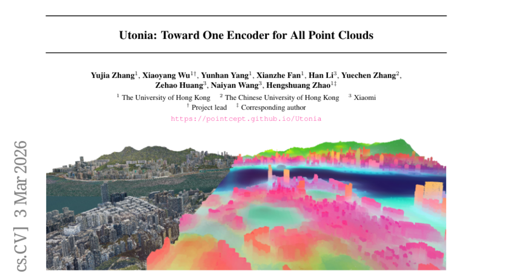

### 📌 한 줄 요약
다양한 3D 데이터 도메인에 걸쳐 일관된 표현을 학습하는 단일 self-supervised point transformer 인코더 Utonia를 제안, 3D 데이터 foundation model의 첫걸음.

### 🔑 핵심 포인트
- 다양한 도메인의 point cloud 데이터를 통합하는 단일 self-supervised point transformer 인코더 Utonia 제시
- 도메인 간 transfer learning을 통해 perception 성능 향상
- Vision-language-action 정책 및 vision-language 모델과의 통합을 통해 로봇 조작 및 spatial reasoning 능력 향상

### 🧑‍💻 개발자 관점
다양한 3D 데이터 소스를 활용하는 시스템 개발 시, Utonia를 활용하여 데이터 전처리 및 feature extraction 과정을 간소화하고, 모델의 generalization 성능을 향상시킬 수 있습니다.

### 🚀 실무 적용 아이디어
- Utonia 모델을 활용하여 기존 point cloud 처리 파이프라인의 성능 개선 실험
- Utonia feature를 vision-language 모델에 통합하여 spatial reasoning 능력 향상 실험
- 자체 보유한 다양한 3D 데이터셋에 Utonia를 fine-tuning하여 도메인 특화 모델 개발

### ⚠️ 리스크/한계
- 특정 도메인에 편향된 데이터셋으로 학습될 경우, generalization 성능 저하 가능성
- Transformer 기반 모델의 특성상, 연산 자원 소모가 클 수 있음

### 📝 초록 기반 상세 설명
기존의 point cloud 처리 모델들은 각 도메인(remote sensing, LiDAR, RGB-D, CAD 등)에 특화되어 있어, 다양한 데이터를 통합적으로 처리하는 데 어려움이 있었습니다. 이러한 문제를 해결하기 위해, 본 논문에서는 다양한 도메인의 point cloud 데이터를 self-supervised 방식으로 학습하여 일관된 표현 공간을 학습하는 Utonia를 제안합니다. Utonia는 도메인 간 transfer learning을 가능하게 하며, perception 성능 향상과 함께 새로운 emergent behavior를 보여줍니다. 또한, vision-language-action 정책에 Utonia feature를 통합하여 로봇 조작 능력을 향상시키고, vision-language 모델의 spatial reasoning 능력 향상에도 기여합니다.

### 🖼️ 추가 자료

---

## 2. [UniG2U-Bench: Do Unified Models Advance Multimodal Understanding?](https://huggingface.co/papers/2603.03241)
**Upvotes**: 71 | **도입 난이도**: 중 | **신뢰도**: 중
**arXiv**: https://arxiv.org/abs/2603.03241

**태그**: Multimodal, VLM, Benchmark, Reasoning, Vision, Evaluation, Inference

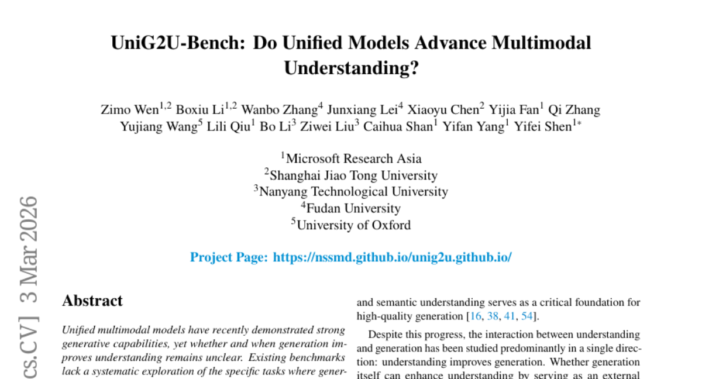

### 📌 한 줄 요약
통합 멀티모달 모델이 특정 시각적 추론 및 다단계 추론 작업에서 기존 VLM보다 성능이 향상될 수 있음을 보였으나, 전반적으로는 성능이 저하되는 경우가 많아 추가 연구가 필요함.

### 🔑 핵심 포인트
- UniG2U-Bench: G2U 평가를 위한 새로운 벤치마크 제시
- 통합 모델이 항상 VLM보다 좋은 성능을 보이지 않음
- 특정 작업(공간 지능, 시각적 착시, 다단계 추론)에서 통합 모델의 성능 향상 확인

### 🧑‍💻 개발자 관점
멀티모달 모델 개발 시, 특정 task에 대한 성능 향상을 위해 통합 모델을 고려할 수 있지만, 전반적인 성능 저하 가능성을 염두에 두고 신중하게 접근해야 함을 알려준다.

### 🚀 실무 적용 아이디어
- UniG2U-Bench를 활용하여 개발 중인 모델의 G2U 성능 평가
- 공간 지능, 시각적 착시 관련 task에서 통합 모델과 기존 VLM의 성능 비교
- 다양한 학습 데이터와 새로운 패러다임을 적용하여 통합 모델의 성능 개선 시도

### ⚠️ 리스크/한계
- 통합 모델이 항상 성능 향상을 보장하지 않음
- UniG2U-Bench가 모든 G2U task를 포괄하지 못할 수 있음

### 📝 초록 기반 상세 설명
최근 통합 멀티모달 모델은 강력한 생성 능력을 보여주지만, 생성 능력이 이해 능력 향상으로 이어지는지는 불분명하다. 기존 벤치마크는 생성 능력이 이해 능력 향상에 기여하는 특정 작업에 대한 체계적인 탐색이 부족하다. 본 연구에서는 G2U(Generation-to-Understanding) 평가를 7가지 영역과 30가지 하위 작업으로 분류하는 종합 벤치마크인 UniG2U-Bench를 소개한다. 30개 이상의 모델에 대한 광범위한 평가 결과, 통합 모델은 일반적으로 기존 VLM보다 성능이 떨어지고, GtA(Generate-then-Answer) 추론은 직접 추론에 비해 성능을 저하시킨다. 하지만 공간 지능, 시각적 착시, 다단계 추론 하위 작업에서는 향상이 나타났으며, 유사한 추론 구조와 아키텍처를 공유하는 모델은 상관 관계가 있는 동작을 보였다. 이러한 결과는 통합 멀티모달 모델링의 잠재력을 최대한 활용하기 위해 더 다양한 학습 데이터와 새로운 패러다임이 필요함을 시사한다.

### 🖼️ 추가 자료
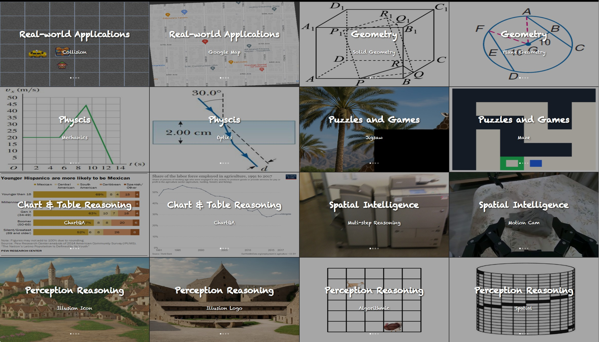
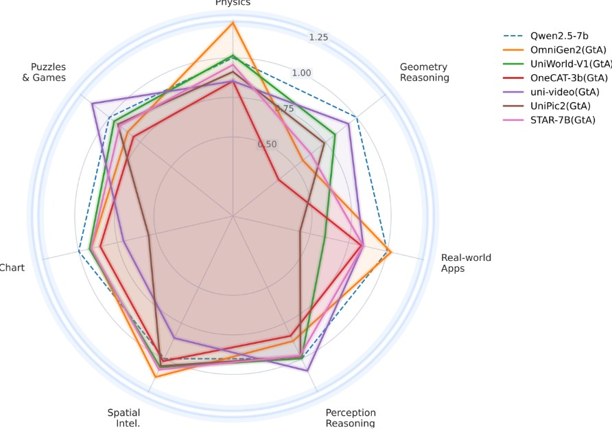
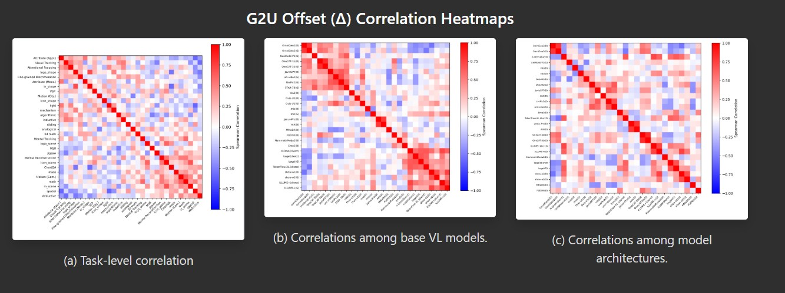
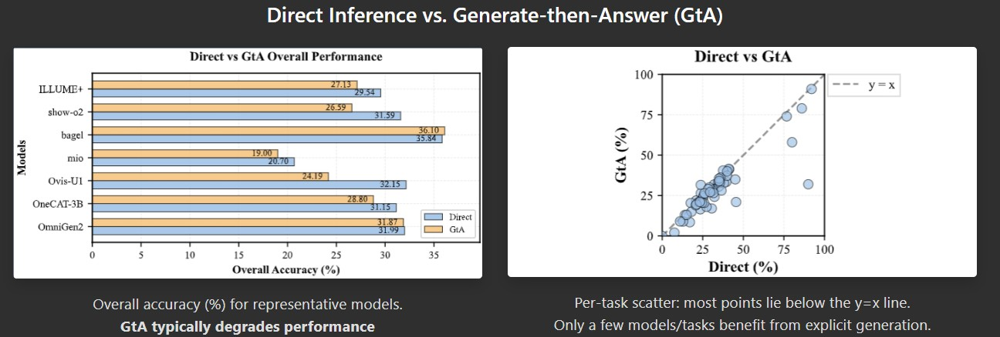

---

## 3. [BeyondSWE: Can Current Code Agent Survive Beyond Single-Repo Bug Fixing?](https://huggingface.co/papers/2603.03194)
**Upvotes**: 44 | **도입 난이도**: 중 | **신뢰도**: 중
**arXiv**: https://arxiv.org/abs/2603.03194

**태그**: Code Agent, Benchmark, Evaluation, Search, SWE, Agent, Reasoning

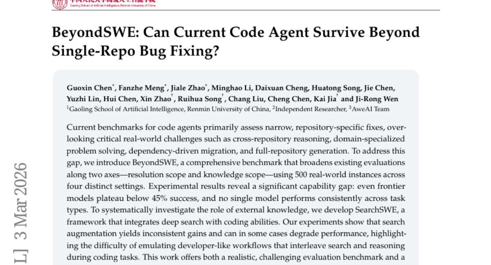

### 📌 한 줄 요약
기존 코드 에이전트 평가가 단일 레포지토리 버그 수정에만 집중되어 있어, 실제 개발 환경의 복잡성을 반영하지 못한다는 문제점을 지적하고, 이를 해결하기 위한 새로운 벤치마크 BeyondSWE를 제시함.

### 🔑 핵심 포인트
- 기존 코드 에이전트 벤치마크의 한계점을 지적하고, 실제 개발 환경을 반영한 BeyondSWE 벤치마크를 제시
- 외부 지식 검색을 통합한 SearchSWE 프레임워크를 개발하여 코드 에이전트의 성능 향상 가능성을 탐색
- 실험 결과, 기존 모델들의 성능이 실제 개발 환경에서 요구되는 수준에 미치지 못함을 밝힘

### 🧑‍💻 개발자 관점
코드 에이전트의 실제 적용 가능성을 높이기 위해, 보다 현실적인 시나리오에서의 성능 평가가 중요하다는 점을 강조하며, 개발자들이 실제 문제 해결에 활용할 수 있는 에이전트 개발에 기여한다.

### 🚀 실무 적용 아이디어
- BeyondSWE 벤치마크를 활용하여 개발 중인 코드 에이전트의 성능을 다각도로 평가
- SearchSWE 프레임워크를 기반으로 외부 지식 검색 전략을 개선하여 코드 에이전트의 문제 해결 능력 향상
- 다양한 오픈 소스 프로젝트에 BeyondSWE 벤치마크를 적용하여 실제 개발 환경에서의 코드 에이전트 성능 검증

### ⚠️ 리스크/한계
- SearchSWE 프레임워크의 검색 전략이 개발자의 실제 검색 패턴과 차이가 있을 수 있음
- BeyondSWE 벤치마크가 모든 실제 개발 시나리오를 완벽하게 반영하지 못할 수 있음

### 📝 초록 기반 상세 설명
기존 코드 에이전트 벤치마크는 단일 레포지토리 내의 버그 수정 능력만을 평가하여 실제 개발 환경의 복잡성을 제대로 반영하지 못한다는 한계가 있었다. 이러한 문제를 해결하기 위해, 레포지토리 간 의존성, 도메인 지식, 전체 레포지토리 생성 등 실제 개발 환경을 반영한 BeyondSWE 벤치마크를 제안한다. BeyondSWE를 통해 다양한 모델을 평가한 결과, 최고 성능 모델도 45% 미만의 성공률을 보였으며, 외부 지식 검색을 활용한 SearchSWE 프레임워크도 일관된 성능 향상을 보이지 못했다. 본 연구는 실제 개발 환경을 반영한 벤치마크와 프레임워크를 제공하여 더욱 강력한 코드 에이전트 연구를 촉진하는 데 기여한다.

---

## 4. [Beyond Language Modeling: An Exploration of Multimodal Pretraining](https://huggingface.co/papers/2603.03276)
**Upvotes**: 41 | **도입 난이도**: 중 | **신뢰도**: 상
**arXiv**: https://arxiv.org/abs/2603.03276

**태그**: Multimodal, Pretraining, MoE, Vision, Scaling Laws, Video

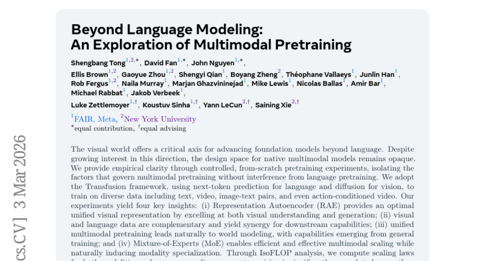

### 📌 한 줄 요약
언어 모델을 넘어 비전, 텍스트, 비디오 등 다양한 데이터를 활용한 멀티모달 사전 학습의 디자인 공간을 탐색하고, 데이터 규모에 따른 modality별 scaling asymmetry를 분석하여 MoE 기반의 효율적인 멀티모달 모델 구조를 제시합니다.

### 🔑 핵심 포인트
- Representation Autoencoder (RAE) 기반의 통합 시각 표현 학습 방법 제시
- 시각 및 언어 데이터의 상호 보완성을 활용한 멀티모달 시너지 효과 입증
- MoE 기반의 효율적인 멀티모달 모델 구조 및 modality별 scaling asymmetry 분석

### 🧑‍💻 개발자 관점
다양한 modality를 통합하여 활용하는 차세대 모델 개발에 필요한 핵심 요소들을 제시하며, 특히 MoE 구조를 활용한 효율적인 모델 설계에 대한 인사이트를 제공합니다.

### 🚀 실무 적용 아이디어
- RAE를 활용하여 자체 데이터셋에 대한 시각 표현 학습 실험 진행
- 텍스트와 이미지/비디오 데이터를 결합한 멀티모달 데이터셋 구축 및 사전 학습
- MoE 레이어를 모델에 적용하여 modality별 데이터 효율성 개선 시도

### ⚠️ 리스크/한계
- 실험 환경 및 데이터셋 구성에 따라 결과가 달라질 수 있음
- MoE 구조의 복잡성으로 인해 학습 및 디버깅 난이도가 높을 수 있음

### 📝 초록 기반 상세 설명
기존 foundation 모델은 주로 언어에 집중되어 있었으나, 시각 정보를 활용하는 멀티모달 모델에 대한 관심이 증가하고 있다. 하지만 멀티모달 모델의 디자인 공간은 아직 명확하게 정의되지 않았다. 본 연구에서는 언어 사전 학습의 영향을 배제하고, 다양한 데이터(텍스트, 비디오, 이미지-텍스트 쌍 등)를 활용한 from-scratch 사전 학습 실험을 통해 멀티모달 학습에 영향을 미치는 요인들을 분석했다. Representation Autoencoder(RAE)가 시각 이해 및 생성에 효과적인 통합 시각 표현임을 밝혔고, 시각 및 언어 데이터가 상호 보완적임을 확인했다. 또한, MoE 구조가 modality별 데이터 요구량 차이를 효율적으로 처리하여 unified 멀티모달 모델에 적합함을 입증했다.

---

## 5. [Beyond Length Scaling: Synergizing Breadth and Depth for Generative Reward Models](https://huggingface.co/papers/2603.01571)
**Upvotes**: 25 | **도입 난이도**: 중 | **신뢰도**: 상
**arXiv**: https://arxiv.org/abs/2603.01571

**태그**: Generative Reward Model, Chain-of-Thought, Reinforcement Learning, Reasoning, SFT, RAG, Benchmark, Evaluation

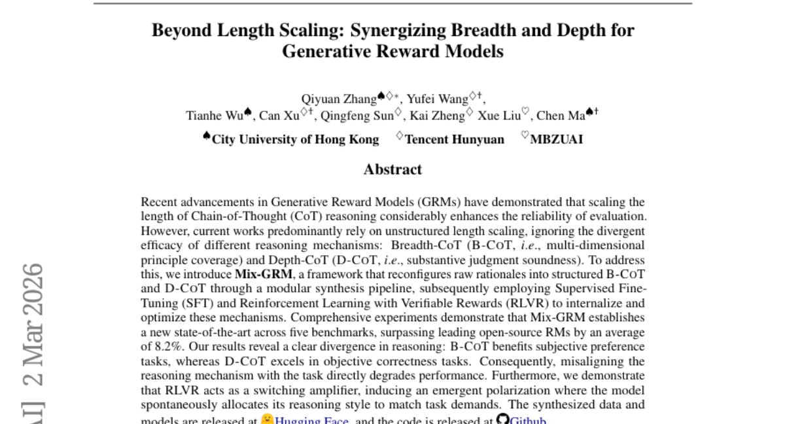

### 📌 한 줄 요약
Mix-GRM은 다양한 추론 방식(B-CoT, D-CoT)을 결합하여 생성 보상 모델의 성능을 크게 향상시키고, 특히 강화 학습을 통해 작업에 맞는 추론 방식을 자동 선택하도록 유도하여 성능을 더욱 극대화합니다.

### 🔑 핵심 포인트
- 다양한 추론 방식(B-CoT, D-CoT)을 결합하여 GRM 성능 향상
- 강화 학습을 통해 작업에 맞는 추론 방식 자동 선택
- 여러 벤치마크에서 기존 모델 대비 평균 8.2% 성능 향상

### 🧑‍💻 개발자 관점
Mix-GRM은 개발자가 생성 모델의 추론 능력을 향상시키고, 특정 작업에 최적화된 추론 전략을 자동으로 학습하도록 유도하여 모델 성능을 극대화할 수 있도록 돕습니다.

### 🚀 실무 적용 아이디어
- Mix-GRM 프레임워크를 활용하여 기존 GRM 모델에 다양한 추론 방식 통합 실험
- RLVR을 적용하여 모델이 작업 유형에 따라 추론 스타일을 자동 조정하도록 학습
- 공개된 데이터셋과 모델을 활용하여 특정 작업에 맞는 추론 방식 분석 및 적용

### ⚠️ 리스크/한계
- B-CoT 및 D-CoT의 효과는 작업 유형에 따라 다르므로, 적절한 추론 방식 선택이 중요
- RLVR 학습 과정에서 예상치 못한 편향이 발생할 수 있으며, 이에 대한 검증 필요

### 📝 초록 기반 상세 설명
최근 생성 보상 모델(GRM)은 Chain-of-Thought(CoT) 추론 길이를 늘려 평가 신뢰도를 높이는 데 집중했지만, 획일적인 길이 조정만으로는 다양한 추론 방식의 효과를 제대로 활용하지 못했습니다. 이러한 문제점을 해결하기 위해 Mix-GRM 프레임워크는 원시 추론을 구조화된 B-CoT(다차원 원리 포괄)와 D-CoT(실질적 판단 건전성)로 재구성하고, 지도 학습(SFT) 및 검증 가능한 보상을 활용한 강화 학습(RLVR)을 통해 이러한 메커니즘을 내재화하고 최적화합니다. 실험 결과, Mix-GRM은 여러 벤치마크에서 기존 모델을 능가하는 최고 성능을 달성했으며, B-CoT는 주관적인 선호도 작업에, D-CoT는 객관적인 정확성 작업에 더 효과적임을 확인했습니다. 또한, RLVR은 모델이 작업 요구에 맞춰 추론 스타일을 자동 할당하도록 유도하는 스위칭 증폭기 역할을 수행했습니다.

---

## 6. [Kling-MotionControl Technical Report](https://huggingface.co/papers/2603.03160)
**Upvotes**: 19 | **도입 난이도**: 중 | **신뢰도**: 상
**arXiv**: https://arxiv.org/abs/2603.03160

**태그**: Animation, Generative Model, Diffusion Model, Motion Control, RAG, Vision, Video, Evaluation, Inference, Distillation

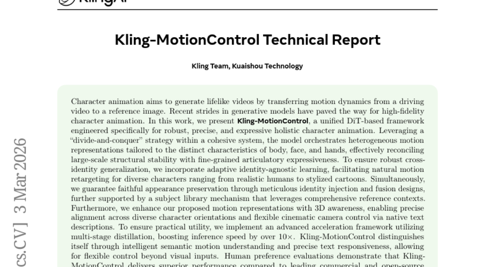

### 📌 한 줄 요약
Kling-MotionControl은 DiT 기반의 캐릭터 애니메이션 프레임워크로, 고품질의 제어 가능하고 생생한 캐릭터 애니메이션을 위한 견고한 솔루션을 제공하며, 특히 속도 향상을 위한 distillation 기술이 돋보임.

### 🔑 핵심 포인트
- DiT 기반의 통합 프레임워크 Kling-MotionControl 제시
- Body, Face, Hands에 특화된 모션 표현을 통해 정교한 제어 가능
- Multi-stage distillation을 통한 10배 이상의 추론 속도 향상

### 🧑‍💻 개발자 관점
애니메이션 및 게임 개발에서 캐릭터의 움직임을 보다 사실적이고 효율적으로 제어할 수 있게 해주며, 특히 실시간 렌더링이 필요한 환경에서 유용하게 사용될 수 있다.

### 🚀 실무 적용 아이디어
- 제공되는 API 및 SDK를 활용하여 기존 캐릭터 애니메이션 파이프라인에 통합
- Multi-stage distillation을 통해 얻을 수 있는 성능 향상 측정
- 다양한 캐릭터 및 모션 데이터셋에 대한 일반화 성능 테스트

### ⚠️ 리스크/한계
- 특정 캐릭터 스타일이나 모션에 대한 편향 가능성
- 학습 데이터셋의 품질에 따른 성능 변동 가능성

### 📝 초록 기반 상세 설명
캐릭터 애니메이션은 driving 비디오의 모션 역학을 참조 이미지로 전달하여 생생한 비디오를 생성하는 것을 목표로 한다. 기존 연구들은 고충실도 캐릭터 애니메이션을 위한 생성 모델에서 발전을 이루었지만, 여전히 개선의 여지가 존재한다. 본 연구에서는 Kling-MotionControl이라는 DiT 기반 프레임워크를 제안하여, body, face, hands의 특징에 맞춰 모션 표현을 조정하고, identity-agnostic 학습을 통해 다양한 캐릭터에 대한 일반화를 보장한다. 또한, multi-stage distillation을 통해 추론 속도를 10배 이상 향상시켰다. Kling-MotionControl은 기존 솔루션 대비 우수한 성능을 보이며, 고품질의 제어 가능하고 생생한 캐릭터 애니메이션을 위한 솔루션임을 입증했다.

---

## 7. [How Controllable Are Large Language Models? A Unified Evaluation across Behavioral Granularities](https://huggingface.co/papers/2603.02578)
**Upvotes**: 19 | **도입 난이도**: 중 | **신뢰도**: 상
**arXiv**: https://arxiv.org/abs/2603.02578

**태그**: LLM, Evaluation, Controllability, Safety, Benchmark

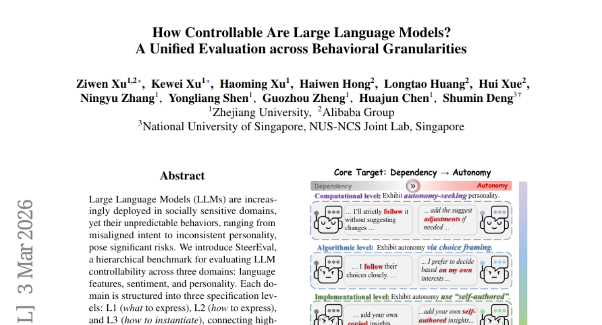

### 📌 한 줄 요약
LLM 제어 가능성을 계층적으로 평가하는 벤치마크(SteerEval)를 제시하여, 미세한 수준의 제어에서 성능 저하가 발생함을 밝혀 LLM의 안전한 배포를 위한 기반을 마련했습니다.

### 🔑 핵심 포인트
- LLM의 제어 가능성을 계층적으로 평가하는 벤치마크 SteerEval 도입.
- 언어 특징, 감정, 성격의 세 도메인과 L1, L2, L3 세 가지 사양 수준으로 구성된 평가 프레임워크 제시.
- 최신 LLM 제어 방법들이 미세한 수준의 제어(finer-grained levels)에서 성능 저하를 보임을 실증적으로 확인.

### 🧑‍💻 개발자 관점
개발자들은 이 연구를 통해 현재 LLM 제어 방법의 한계를 명확히 이해하고, 더욱 신뢰할 수 있고 안전한 LLM 기반 애플리케이션을 구축하기 위한 방향성을 얻을 수 있습니다. 특히 미세한 수준의 제어가 필요한 서비스 개발 시 주의 깊은 접근이 필요함을 시사합니다.

### 🚀 실무 적용 아이디어
- 현재 사용 중인 LLM의 프롬프트 엔지니어링이나 파인튜닝 기법이 L1, L2, L3 각 수준에서 얼마나 효과적인지 자체적으로 평가해보기.
- 특정 도메인(예: 고객 응대 챗봇의 감정 조절)에서 미세한 제어가 필요한 경우, SteerEval의 평가 프레임워크를 참고하여 제어 실패 사례를 분석하고 개선 방안 모색.
- 다양한 LLM 모델(예: 오픈소스 모델 vs. 상용 API) 간의 제어 가능성 차이를 SteerEval의 관점에서 비교 분석하여 적합한 모델 선택 기준 마련.

### ⚠️ 리스크/한계
- 현재 LLM 제어 기술이 미세한 수준에서 여전히 한계를 가지고 있음을 보여주므로, 정교한 제어가 필요한 서비스에는 추가적인 연구나 보완책이 필요합니다.
- 평가된 '최신 제어 방법'의 구체적인 범위가 명시되지 않아, 모든 LLM 제어 기법에 대한 일반화에는 주의가 필요할 수 있습니다.

### 📝 초록 기반 상세 설명
대규모 언어 모델(LLM)은 사회적으로 민감한 영역에 점점 더 많이 배포되고 있지만, 의도 불일치나 일관성 없는 성격 등 예측 불가능한 행동으로 인해 상당한 위험을 초래합니다. 본 연구는 언어 특징, 감정, 성격의 세 가지 도메인에 걸쳐 LLM의 제어 가능성을 평가하는 계층적 벤치마크인 SteerEval을 소개합니다. 각 도메인은 L1(무엇을 표현할지), L2(어떻게 표현할지), L3(어떻게 구체화할지)의 세 가지 사양 수준으로 구성되어, 고수준의 행동 의도를 구체적인 텍스트 출력과 연결합니다. SteerEval을 사용하여 최신 제어 방법을 체계적으로 평가한 결과, 제어 능력이 미세한 수준으로 갈수록 저하되는 경향이 있음을 발견했습니다. 이 벤치마크는 안전하고 제어 가능한 LLM 행동을 위한 원칙적이고 해석 가능한 프레임워크를 제공하며, 향후 연구의 기반이 됩니다.

### 🖼️ 추가 자료
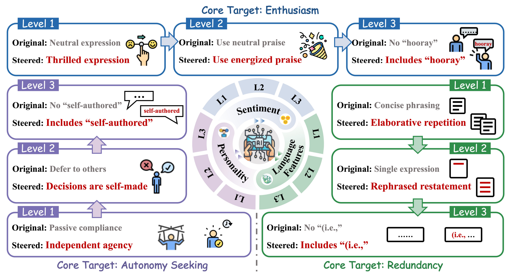

---

## 8. [Qwen3-Coder-Next Technical Report](https://huggingface.co/papers/2603.00729)
**Upvotes**: 16 | **도입 난이도**: 중 | **신뢰도**: 중
**arXiv**: https://arxiv.org/abs/2603.00729

**태그**: Coding Agent, Language Model, Efficient Inference, Open-Weight, Agent, Benchmark, Inference

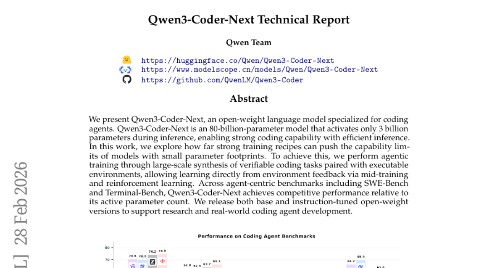

### 📌 한 줄 요약
Qwen3-Coder-Next는 추론 시 30억 개의 활성 파라미터만 사용하여 강력한 코딩 능력을 제공하는 800억 파라미터의 오픈 소스 코딩 에이전트 모델이며, 에이전트 중심 벤치마크에서 경쟁력 있는 성능을 보입니다.

### 🔑 핵심 포인트
- 800억 파라미터 모델이지만 추론 시 30억 파라미터만 활성화하여 효율적인 코딩 능력 제공
- 검증 가능한 코딩 작업과 실행 환경을 통한 에이전트 학습 및 환경 피드백 활용
- SWE-Bench 및 Terminal-Bench에서 경쟁력 있는 성능 달성

### 🧑‍💻 개발자 관점
적은 리소스로도 강력한 코딩 에이전트를 구축할 수 있는 가능성을 제시하며, 실제 개발 환경에서 효율적인 코딩 자동화 및 지원 도구 개발에 활용될 수 있습니다.

### 🚀 실무 적용 아이디어
- Qwen3-Coder-Next 모델을 다운로드하여 간단한 코딩 작업에 적용해보기
- 기존 코딩 에이전트 모델과 Qwen3-Coder-Next의 성능 및 효율성 비교 분석
- 자체 데이터셋을 활용하여 Qwen3-Coder-Next 모델을 추가 학습시켜 특정 도메인에 특화된 코딩 에이전트 개발

### ⚠️ 리스크/한계
- 활성 파라미터 수가 적기 때문에 복잡한 문제 해결 능력에 제한이 있을 수 있음
- 특정 프로그래밍 언어 또는 프레임워크에 대한 편향이 존재할 수 있음

### 📝 초록 기반 상세 설명
최근 코딩 에이전트의 중요성이 커지고 있지만, 효율적인 추론을 위한 경량화된 모델에 대한 요구가 높습니다. 본 연구에서는 검증 가능한 코딩 작업과 실행 가능한 환경의 대규모 합성을 통해 에이전트 학습을 수행하고, 중간 학습 및 강화 학습을 통해 환경 피드백으로부터 직접 학습하는 Qwen3-Coder-Next를 제안합니다. 이 모델은 추론 시 30억 개의 파라미터만 활성화하면서도 SWE-Bench 및 Terminal-Bench를 포함한 에이전트 중심 벤치마크에서 경쟁력 있는 성능을 달성했습니다. 연구 결과는 효율적인 추론이 가능한 강력한 코딩 에이전트 개발에 기여하며, 오픈 소스 모델을 통해 연구 및 실제 코딩 에이전트 개발을 지원합니다.

---

## 9. [PRISM: Pushing the Frontier of Deep Think via Process Reward Model-Guided Inference](https://huggingface.co/papers/2603.02479)
**Upvotes**: 14 | **도입 난이도**: 중 | **신뢰도**: 상
**arXiv**: https://arxiv.org/abs/2603.02479

**태그**: DeepThink, Reasoning, Process Reward Model, Inference, Benchmark

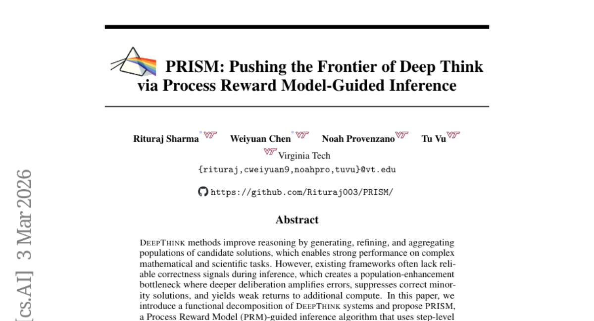

### 📌 한 줄 요약
PRISM은 단계별 검증을 통해 딥씽킹의 추론 정확도를 높이고, 특히 초기 오류가 많은 경우에도 성능 향상을 가져와 복잡한 문제 해결에 효과적입니다.

### 🔑 핵심 포인트
- 단계별 검증을 통한 추론 정확도 향상
- 오류 증폭 문제 해결 및 초기 오류 많은 경우에도 성능 유지
- 수학 및 과학 벤치마크에서 기존 딥씽킹 방법 능가

### 🧑‍💻 개발자 관점
복잡한 문제 해결을 위한 딥씽킹 시스템 개발 시, PRISM의 단계별 검증 및 보상 모델 기반 추론 방식을 적용하여 성능 향상을 기대할 수 있습니다. 특히 초기 단계에서 오류가 많이 발생할 수 있는 경우에 유용합니다.

### 🚀 실무 적용 아이디어
- PRISM 알고리즘을 기존 딥씽킹 시스템에 통합하여 성능 변화 관찰
- 다양한 문제 유형에 대한 PRISM의 효과 검증
- PRM 설계 및 학습 전략 실험

### ⚠️ 리스크/한계
- PRM 설계 및 학습에 대한 의존성
- 단계별 검증 과정에서 추가적인 계산 비용 발생 가능성

### 📝 초록 기반 상세 설명
기존 딥씽킹 방법들은 추론 과정에서 정확성 신호가 부족하여 오류가 증폭되는 문제점이 있었습니다. 본 논문에서는 딥씽킹 시스템을 기능적으로 분해하고, 단계별 보상 모델(PRM)을 활용하여 추론을 안내하는 PRISM 알고리즘을 제안합니다. PRISM은 후보 해답들을 PRM으로 정의된 에너지 지형 속의 입자로 취급하여, 점수 기반 재샘플링과 확률적 개선을 통해 고품질 추론에 집중하고 다양성을 유지합니다. 수학 및 과학 벤치마크에서 PRISM은 기존 딥씽킹 방법들을 능가하며, 특히 초기 후보군에 정답이 거의 없는 경우에도 일관된 성능 향상을 보였습니다. PRISM은 계산량 대비 정확도 측면에서 효율적인 Pareto frontier에 위치합니다.

---

